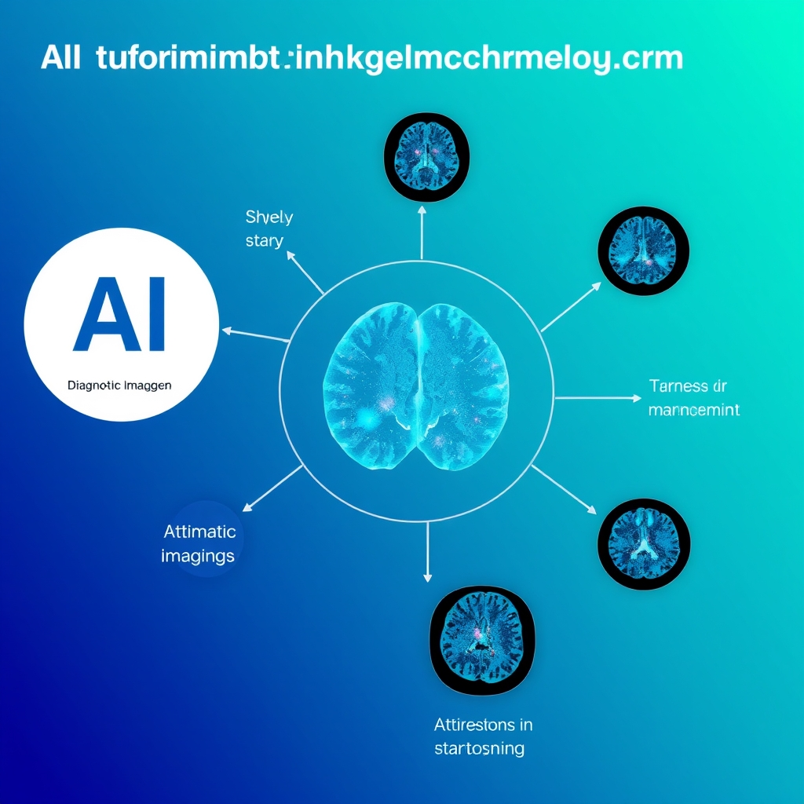
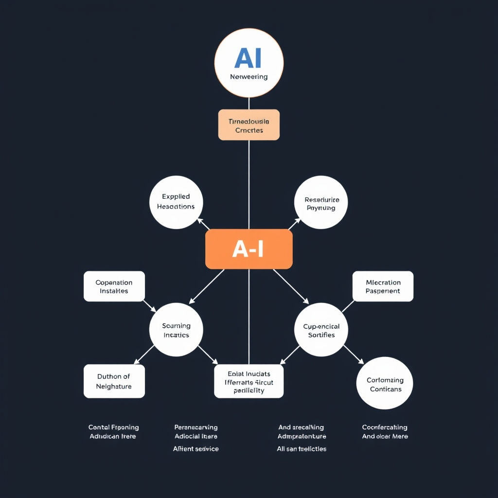
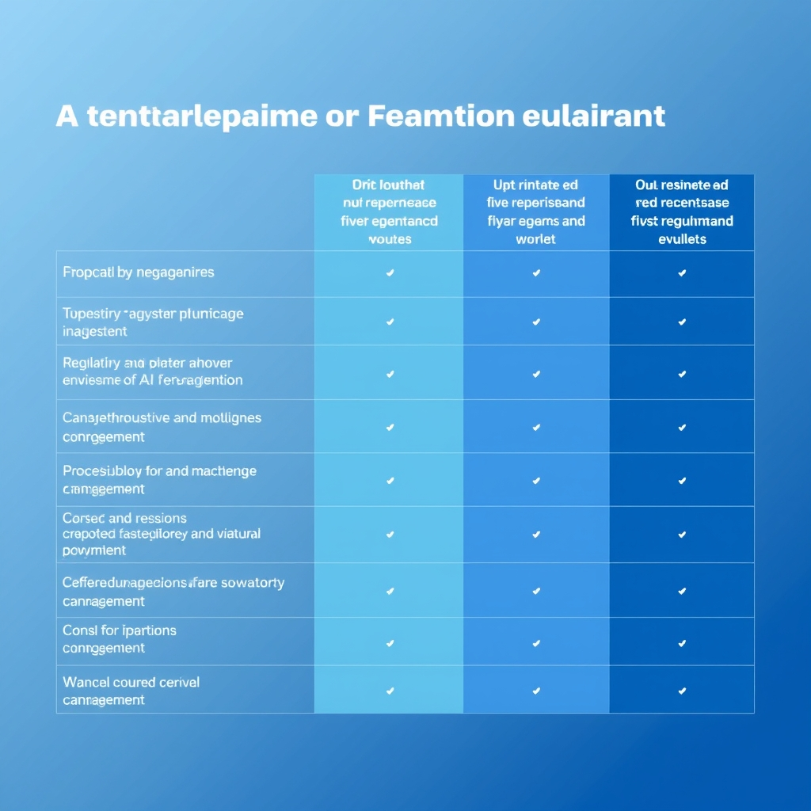

# The Role of AI in Healthcare: Current Trends and Future Directions
## Introduction to AI in Healthcare
The adoption of Artificial Intelligence (AI) in healthcare is a rapidly growing trend, with the potential to revolutionize the way healthcare services are delivered. Current trends in AI adoption in healthcare include the use of machine learning algorithms for medical diagnostics and treatment, as well as the integration of AI with medical imaging for disease diagnosis.
## AI-Powered Diagnostic Imaging
The current state of AI-powered diagnostic imaging is rapidly evolving, with machine learning algorithms and deep learning techniques being increasingly applied to improve image analysis and diagnosis. 
*AI-powered diagnostic imaging*
## AI-Driven Clinical Decision Support Systems
The current state of AI-driven clinical decision support systems is rapidly evolving, with the integration of expert systems and machine learning algorithms. 
*AI-driven clinical decision support systems*
## Regulatory Frameworks for AI in Healthcare
The current regulatory frameworks for AI in healthcare include FDA guidance and international standards. 
*Regulatory frameworks for AI in healthcare*
## Building AI-Powered Healthcare Applications
To build effective AI-powered healthcare applications, it is crucial to focus on **data quality and preparation**. High-quality data is essential for training accurate machine learning models, and proper data preparation can significantly impact the performance of these models.
## Edge Cases and Failure Modes in AI-Powered Healthcare Applications
AI-powered healthcare applications can be prone to edge cases, including rare diseases and unusual patient presentations, which can lead to incorrect diagnoses or ineffective treatments.
## Performance and Cost Considerations in AI-Powered Healthcare Applications
The performance of AI-powered healthcare applications is crucial, with considerations including accuracy and speed.
## Security and Privacy Considerations in AI-Powered Healthcare Applications
The integration of AI in healthcare applications has introduced significant security and privacy considerations.
## Future Directions and Emerging Trends in AI-Powered Healthcare Applications
The potential applications of AI in healthcare are vast, including personalized medicine and population health.