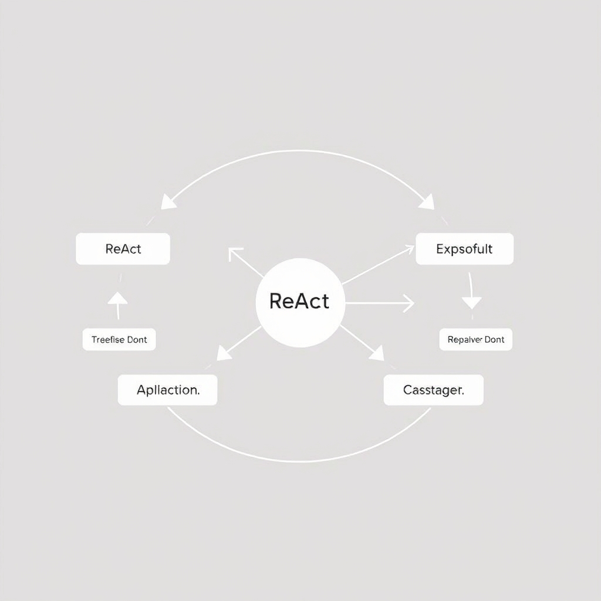

# Beyond the Chatbot: Deconstructing the AI Agent Architecture

## The Anatomy of an Agent
The core components of an AI agent include a Large Language Model (LLM) as the 'brain' or reasoning engine, a planning phase, memory, and a tool-use interface. 
* The LLM serves as the central reasoning engine, enabling the agent to process and understand natural language inputs and generate human-like responses. 
* The planning phase involves decomposing complex goals into sub-tasks, allowing the agent to break down problems into manageable parts and develop a strategy for solving them. 
* Memory is crucial for an agent, comprising both short-term context and long-term vector storage. Short-term context refers to the information an agent needs to maintain during a conversation or task, while long-term vector storage involves retaining knowledge and information over an extended period. 
* The tool-use interface enables agents to interact with external tools, APIs, and databases, expanding their capabilities beyond text generation. 
* A key distinction exists between a standard chatbot and an autonomous agent. While a chatbot is typically designed to respond to user inputs within a predefined scope, an autonomous agent is capable of performing tasks independently, using its reasoning engine and external tools to achieve goals.

## The Reasoning Loop: ReAct and Beyond
The Reason-Act (ReAct) pattern is a fundamental component of an AI agent's architecture, enabling it to iterate toward a solution. This pattern consists of three primary phases: Thought, Action, and Observation.
* **Thought**: The agent's reasoning engine, typically a Large Language Model (LLM), processes the current state and generates a plan or decision.
* **Action**: The agent interacts with its environment, which can include tool usage, API calls, or other external actions.
* **Observation**: The agent receives feedback from its actions, which can be in the form of tool outputs, sensor data, or other observations.

Handling feedback loops from tool outputs is crucial, as it allows the agent to refine its plan and adapt to changing circumstances. State management during multi-step reasoning is also essential, as the agent must maintain a consistent understanding of its environment and the effects of its actions.


*The ReAct (Reason-Act) loop: an iterative process where the agent reasons, executes an action, and observes the result to refine its next step.*

A basic ReAct loop can be represented in pseudo-code as follows:
```python
while goal_not_achieved:
    thought = reason_about_state(state)
    action = select_action(thought)
    observation = take_action(action)
    state = update_state(state, observation)
```
Non-deterministic outputs require robust error handling, as the agent must be able to recover from unexpected results or failures.

## Tool Integration and Security
The integration of tools with AI agents is crucial for their ability to interact with the real world. However, this integration also introduces significant security risks. 
* The risks of arbitrary code execution by agents must be carefully managed to prevent potential security breaches. 
* To mitigate these risks, sandboxing and least-privilege access for tools are essential. This ensures that agents can only execute authorized actions and cannot access sensitive data. 
* Defining tool schemas, such as JSON function calling, provides a structured way for agents to interact with tools. This helps to prevent errors and ensures that agents use tools correctly. 
* Handling tool failures and retries is also critical. Agents should be designed to gracefully handle tool failures and implement retry mechanisms to ensure that tasks are completed successfully. 
* Finally, there is a trade-off between agent autonomy and human-in-the-loop verification. While agents should be able to operate independently, human oversight may be necessary to prevent errors or security breaches. 
For example, when using a tool to make an API call, the agent should be designed to handle potential errors, such as network timeouts or invalid responses. 
```json
{
    "tool": "api_call",
    "params": {
        "url": "https://example.com/api/endpoint",
        "method": "GET"
    }
}

## Limitations and Failure Modes
The development of AI agents is not without its challenges. Understanding the limitations and potential failure modes of these systems is crucial for setting realistic expectations and designing more robust agents.
* **Hallucination in tool parameters**: This occurs when an agent provides false or misleading information as input to a tool, potentially causing the tool to produce incorrect results or behave erratically. For instance, if an agent is tasked with booking a flight, it may 'hallucinate' a non-existent flight number, leading to a failed booking attempt.
* **Infinite loops in agent reasoning**: Agents can become stuck in infinite loops if they are unable to resolve a goal or sub-goal. This can happen when an agent's planning phase fails to account for all possible outcomes or when the agent's memory is insufficient to store the necessary context.
* **Debugging non-deterministic agent paths**: The non-deterministic nature of some AI systems makes it challenging to debug and identify the root cause of errors. This is because the same input may produce different outputs, making it difficult to reproduce and diagnose issues.
* **Long-horizon planning**: Agents often struggle with planning over long horizons due to the complexity and uncertainty of real-world environments. As the planning horizon increases, the number of possible outcomes and the uncertainty of the environment grow exponentially, making it harder for the agent to make accurate predictions and decisions.
* **Observability of agentic systems**: The current state of observability for agentic systems is limited, making it difficult to monitor and understand the decision-making processes of these agents. This lack of transparency can make it challenging to identify and address potential issues, further exacerbating the limitations and failure modes of AI agents.

## Conclusion: Building for Agency
The development of AI agents has shifted from focusing solely on prompt engineering to a more comprehensive system engineering approach. This change in perspective is crucial for creating reliable and efficient agents. Key to agent success is the implementation of modularity and observability, allowing for better management and understanding of the complex interactions within the system. For those looking to start building their own agents, it's essential to begin with narrow, well-defined domains. This focused approach enables the development of specialized agents that can effectively execute tasks within their specified scope. As agentic frameworks continue to evolve, we can expect to see more sophisticated and autonomous systems that can tackle a wide range of challenges.
