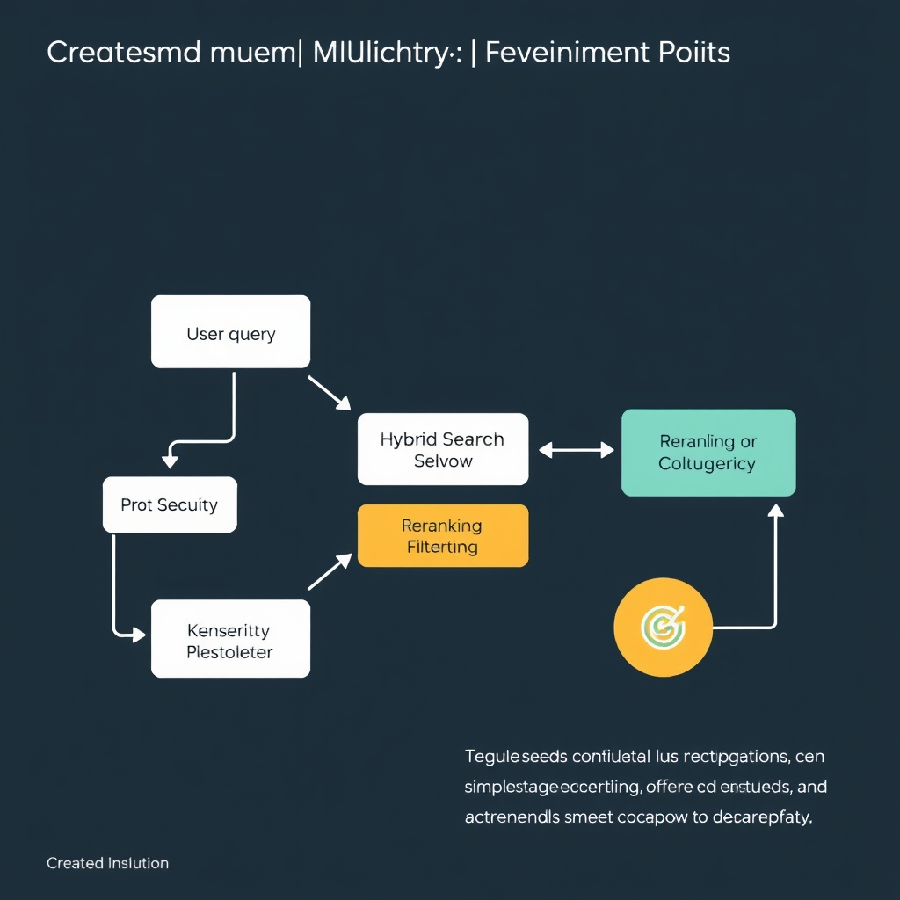

# Beyond the Prototype: Architecting Production-Grade Enterprise RAG

## The Death of Naive RAG
The limitations of 'naive' RAG, which relies on simple embedding and top-k retrieval, become apparent when contrasted with the stringent requirements of enterprise settings. These limitations include the inability to provide keyword-specific precision, a issue known as the 'semantic gap'.
* The 'semantic gap' refers to the discrepancy between the search results provided by vector search and the actual relevance of those results to the user's query, often missing keyword-specific precision.
* The concept of a multi-stage retrieval pipeline is introduced as a solution to address these limitations, offering a more robust architecture for RAG systems.
* Governance and security are non-negotiable aspects of RAG systems, particularly in enterprise environments where sensitive data is involved. As noted in [Secure Retrieval-Augmented Generation (RAG) in Enterprise Environments](https://www.daxa.ai/blogs/secure-retrieval-augmented-generation-rag-in-enterprise-environments), adversarial content embedded in user input or retrievable documents can hijack model responses.

## Designing the Multi-Stage Retrieval Pipeline


*A production-grade RAG pipeline: moving from naive retrieval to a multi-stage architecture with hybrid search and reranking.*
The technical components of a modern RAG architecture are crucial for its success in enterprise settings. Key aspects include:
* Hybrid search, which combines dense vector embeddings with sparse keyword search (BM25), offering a more comprehensive retrieval approach.
* Cross-encoder reranking, which refines the top-k results by re-evaluating the query and document pairs to improve precision.
* Query transformation techniques such as expansion and decomposition, which enhance the query to better capture the user's intent.
* A high-level architecture diagram or flow description that outlines the pipeline's components and their interactions.
* The choice of vector database, with options like Pinecone, Qdrant, and Milvus, each with its strengths in terms of scalability, filtering capabilities, and managed services.

For instance, Pinecone is notable for its managed and serverless approach, making it a preferred choice for teams seeking ease of use and minimal maintenance. Qdrant stands out with its Rust-based implementation and robust metadata filtering capabilities, while Milvus is recognized for its high-throughput and scalability, particularly in GPU-accelerated environments.

```python
# Example of a simple vector database query using Pinecone
import pinecone

# Initialize the Pinecone environment
pinecone.init(api_key='YOUR_API_KEY', environment='us-west1-gcp')

# Create an index
index_name = 'example_index'
pinecone.Index(index_name)

# Connect to the index
index = pinecone.Index(index_name)

# Query the index
query = 'example query'
results = index.query(vectors=[query], top_k=10)
```
This example illustrates how to interact with a vector database like Pinecone, highlighting the simplicity and effectiveness of integrating such databases into a RAG pipeline.

## Hardening the System: Security and Governance
The security of RAG systems is a critical concern, especially in enterprise environments where sensitive data is often involved. To address these concerns, it's essential to define a RAG threat model that includes risks such as prompt injection, data poisoning, and document-level membership inference. 
* Define the RAG threat model: prompt injection, data poisoning, and document-level membership inference.
* Explain how to implement document-level access control (ACLs) within the retrieval process.
* Discuss strategies for sanitizing retrieved content before it reaches the LLM.
* Address the risk of data leakage through unfiltered retrieval.
According to [Secure Retrieval-Augmented Generation (RAG) in Enterprise Environments](https://www.daxa.ai/blogs/secure-retrieval-augmented-generation-rag-in-enterprise-environments), adversarial content embedded in user input or retrievable documents can hijack model responses, bypassing access controls and policies. Furthermore, [RAG Security and Privacy: Formalizing the Threat Model and Attack Surface](https://arxiv.org/html/2509.20324v1) introduces a structured taxonomy of adversary types based on their access to model components and data, and formally defines key threat vectors such as document-level membership inference and data poisoning.

## Continuous Evaluation and Observability
To ensure the reliability and performance of RAG systems, continuous evaluation and observability are crucial. This involves distinguishing between retrieval metrics and generation metrics. Retrieval metrics include Precision@k, MRR, which measure the accuracy of the retrieval process. Generation metrics, on the other hand, include Faithfulness, Hallucination rate, which assess the quality and accuracy of the generated content.

* Distinguish between retrieval metrics (Precision@k, MRR) and generation metrics (Faithfulness, Hallucination rate).
* Introduce automated evaluation frameworks like Ragas and DeepEval, which can streamline the evaluation process and provide comprehensive insights into system performance.
* Explain the importance of a 'golden dataset' for regression testing, which serves as a benchmark for evaluating system performance over time.
* Discuss monitoring latency and cost as part of the production feedback loop, which is essential for optimizing system performance and ensuring cost-effectiveness.

## From Prototype to Production
To successfully transition a RAG prototype to a production-grade system, it's essential to understand the evolution from static retrieval to dynamic, governed pipelines. This shift involves moving beyond simple vector search toward a multi-stage, governed, and continuously evaluated pipeline.
* The shift from static retrieval to dynamic, governed pipelines requires careful consideration of security, performance, and cost.
* RAG is an iterative process that demands constant tuning to ensure optimal results.
* Balancing performance, security, and cost is crucial in the enterprise, where the stakes are high and the requirements are stringent.
