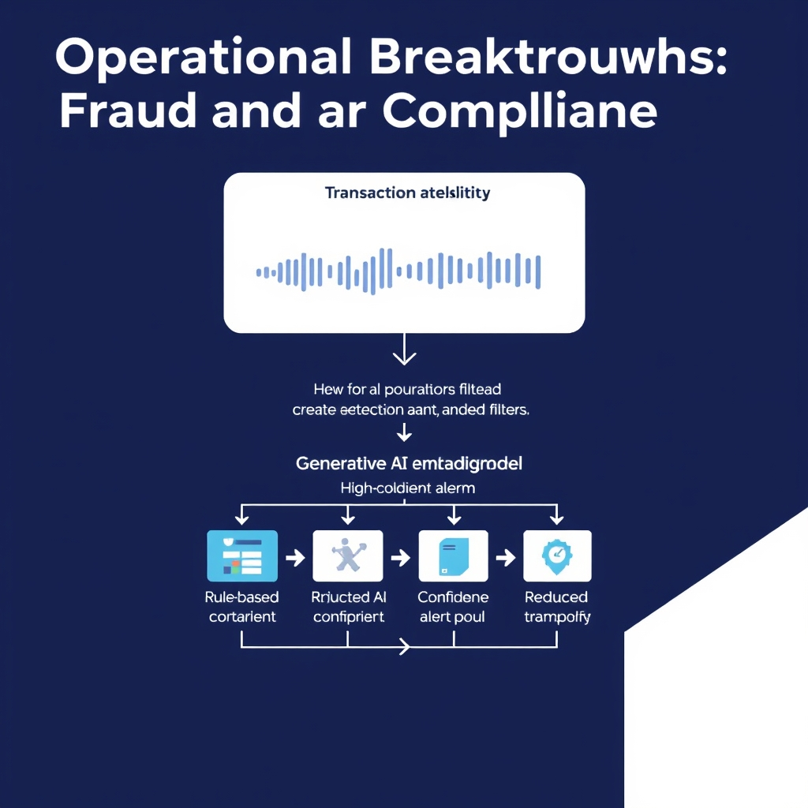
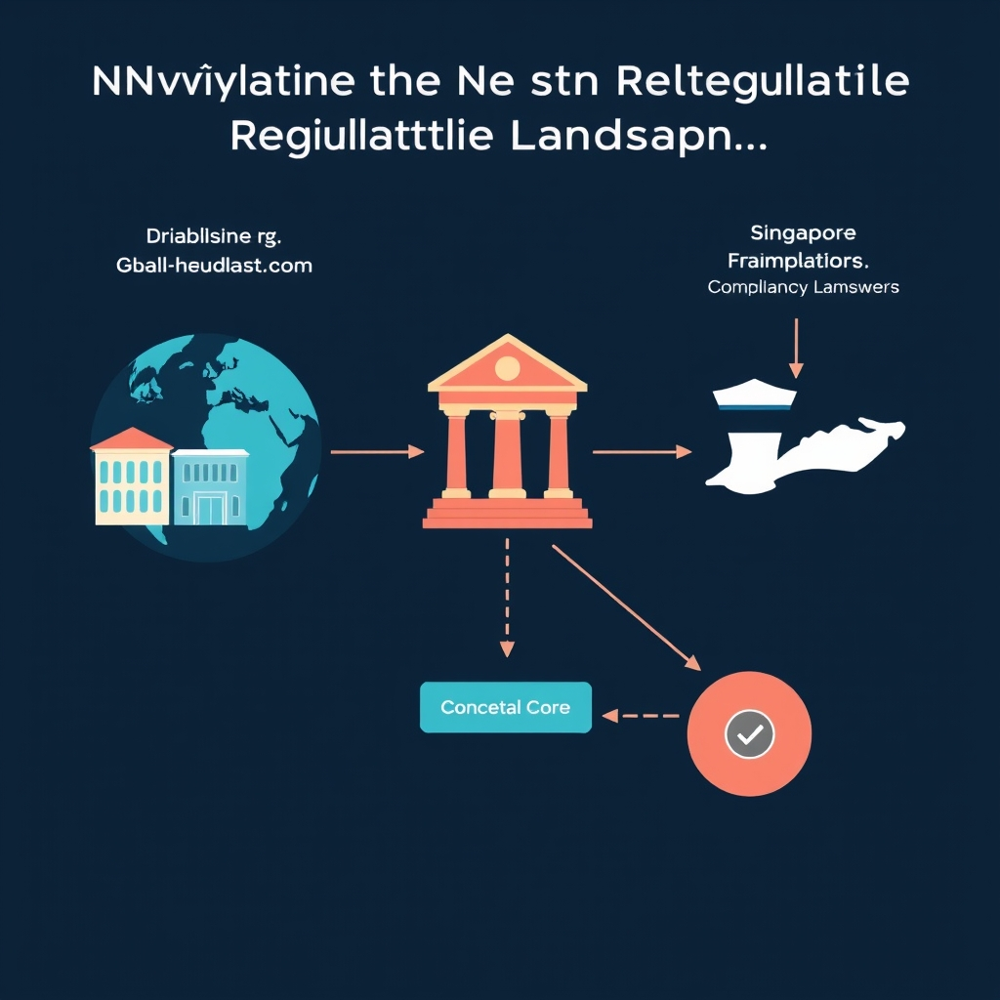

# AI in Finance: From Pilot Projects to Enterprise Pillars

## The State of AI Adoption in 2026

In 2026, AI has moved from a niche experiment to a mainstream capability across the financial sector. Approximately 65% of financial institutions report active AI deployments, and around 89% say those systems are delivering both top‑line growth and bottom‑line savings. This shift is documented in the latest industry survey, which underscores how AI is no longer a peripheral add‑on but a core driver of performance [State of AI in Financial Services 2026 Report](https://www.facebook.com/nvidiaeurope/posts/the-latest-state-of-ai-in-financial-services-2026-trends-report-reveals-how-firm/1203319401972605).

*AI in 2026: The shift from isolated pilot projects to a unified, centrally governed enterprise infrastructure.*

### From pilots to enterprise‑wide platforms

During the early 2020s, most banks ran isolated proof‑of‑concepts—chatbots for customer service, narrow fraud‑detection models, or limited credit‑scoring tools. By 2026, the majority have integrated AI into their core architecture:

- Centralized data lakes feed unified models for risk, compliance, and personalization.
- Cloud‑native AI pipelines support real‑time decisioning across retail, corporate, and wealth‑management divisions.
- Governance layers ensure model versioning, monitoring, and auditability at scale.

### A new institutional mindset

The data shows a cultural transformation. Executives now treat AI as a **standard operating tool** rather than a discretionary project. Board committees include AI oversight, and budget allocations for AI have become a fixed line item comparable to IT infrastructure spending. This mindset shift is reflected in hiring patterns—chief AI officers sit alongside CIOs and CROs—and in the adoption of enterprise AI platforms that are managed like any other critical system.

Collectively, these trends illustrate that AI has become a strategic asset, delivering measurable financial benefits while reshaping how institutions design, fund, and govern technology initiatives.

## Operational Breakthroughs: Fraud and Compliance

Generative AI is increasingly being integrated into fraud‑prevention workflows. Modern models can ingest billions of transaction records, customer profiles, and historical sanction lists in a single pass, extracting patterns that are difficult for rule‑based systems to capture. By representing each transaction as a high‑dimensional vector, the AI can compare it against a continuously updated embedding of illicit behavior, flagging anomalies in near‑real time.

*Generative AI improves fraud detection efficiency by processing unstructured data and reducing false positives.*

- **Processing scale** – Unlike traditional statistical filters, generative models can handle unstructured data such as free‑text notes, chat logs, and voice transcripts, enriching the risk signal pool. This capability is highlighted in a recent industry overview, which notes that banks are leveraging these models to “analyze massive volumes of transaction data, customer profiles, and historical patterns to identify suspicious activities” [Generative AI in Banking: 7 Real‑World Use Cases (2026)](https://www.ideas2it.com/blogs/generative-ai-in-banking).

- **False‑positive reduction** – Sanctions screening has historically suffered from a high alert‑to‑true‑positive ratio, forcing compliance teams to investigate many benign alerts. Generative AI’s contextual understanding cuts through this noise by weighing multiple risk dimensions simultaneously. The top‑five AI trends report that “operations teams continue to spend significant time investigating non‑suspicious alerts,” and that generative AI is already delivering a measurable drop in those false positives [Top Five AI Trends Reshaping Banking in 2026](https://www.retailbankerinternational.com/comment/top-five-ai-trends-banking).

- **Adaptation to evolving tactics** – Money‑laundering schemes mutate quickly. Generative AI mitigates this cat‑and‑mouse game by continuously retraining on fresh transaction streams, allowing the model to learn new typologies without manual rule updates. The same industry overview emphasizes that these models “not only detect known money‑laundering techniques but also adapt to evolving schemes, ensuring banks stay ahead of criminal tactics” [Generative AI in Banking: 7 Real‑World Use Cases (2026)](https://www.ideas2it.com/blogs/generative-ai-in-banking).

- **Operational efficiency gains** – Automating risk assessment frees analysts to focus on high‑impact investigations. As false positives decline, the average handling time per alert drops, reducing the overall cost of compliance. AI‑driven risk scores can be fed directly into downstream systems—such as automated transaction holds or dynamic customer onboarding checks—creating a closed‑loop workflow that accelerates decision‑making while maintaining regulatory rigor [Top Five AI Trends Reshaping Banking in 2026](https://www.retailbankerinternational.com/comment/top-five-ai-trends-banking).

Overall, the convergence of massive data processing, adaptive learning, and workflow automation positions generative AI as a decisive lever for financial institutions seeking to tighten fraud defenses without inflating operational budgets.

## Navigating the New Regulatory Landscape

### RBI’s Draft Guidance on Model Risk Management

The Reserve Bank of India (RBI) has issued a draft *Guidance on Regulatory Principles for Model Risk Management* that outlines a governance framework for developing, validating, deploying, and overseeing both traditional and AI/ML models used by regulated entities. The draft stresses documented model inventories, rigorous validation protocols, and continuous performance monitoring to mitigate model risk and support capital adequacy. By codifying these expectations, the RBI is moving AI model oversight from ad‑hoc supervisory reviews toward a structured, enforceable regime, indicating that compliance will soon become a mandatory operational requirement for Indian banks and fintechs. [Bloomberg report](https://www.bloomberg.com/professional/insights/regulation/july-2026-global-regulatory-brief-model-risk-capital-markets-reform-and-ai-innovation)

### Singapore’s Cross‑Sector AI Agent Governance Framework

In January 2026, Singapore’s Infocomm Media Development Authority (IMDA) released what it described as the world’s first cross‑sector governance framework for AI agents, explicitly naming finance as a national mission sector. The framework introduces a tiered risk‑based licensing model, mandatory transparency disclosures for AI‑driven financial products, and a centralized AI Registry to track agent deployments across industries. By extending AI governance beyond a single sector, Singapore establishes a unified regulatory baseline that other jurisdictions can reference when developing harmonised standards. [PRNewswire release](https://www.prnewswire.com/apac/news-releases/metacomp-launches-the-worlds-first-ai-agent-governance-framework-for-regulated-financial-services-302749713.html)

### From Voluntary Ethics to Mandatory Compliance

Both the RBI draft and Singapore’s AI agent framework illustrate a broader global shift: regulators are moving from advisory ethical guidelines toward enforceable compliance obligations. Earlier AI initiatives often relied on industry‑led best practices, but the new rules require documented risk assessments, audit trails, and regulatory reporting. This evolution reduces regulatory uncertainty that previously hampered large‑scale AI deployments and creates a level playing field, compelling all market participants to meet the same baseline standards.

### Implications for Global Financial Firms

For multinational banks and fintechs, the emerging mosaic of AI regulations presents several operational challenges:

- **Multi‑jurisdictional model validation:** Firms must adapt model risk management processes to satisfy both RBI’s detailed validation checklist and Singapore’s AI agent licensing criteria, often requiring parallel documentation streams.
- **Cross‑border data governance:** Divergent data residency and privacy rules mean that AI training datasets may need to be segmented or anonymised to comply with local oversight.
- **Regulatory technology (RegTech) integration:** Deploying unified RegTech platforms that can map local regulatory requirements to a central model inventory becomes essential to avoid duplication and ensure real‑time compliance monitoring.
- **Strategic product design:** Financial products that rely on generative AI or autonomous agents must be engineered with built‑in transparency and auditability to meet forthcoming disclosure mandates.

Overall, the convergence toward mandatory AI governance signals that compliance will be a core component of AI strategy for global financial institutions, requiring proactive investment in model risk frameworks, cross‑border coordination, and adaptable technology stacks.

*Multinational firms must integrate diverse regional regulatory frameworks into a centralized, scalable compliance core.*

## Sources

- [The latest State of AI in Financial Services: 2026 Trends ...](https://www.facebook.com/nvidiaeurope/posts/the-latest-state-of-ai-in-financial-services-2026-trends-report-reveals-how-firm/1203319401972605)
- [The top five AI trends reshaping banking in 2026 - Retail Banker International](https://www.retailbankerinternational.com/comment/top-five-ai-trends-banking)
- [Generative AI in Banking: 7 Real-World Use Cases (2026)](https://www.ideas2it.com/blogs/generative-ai-in-banking)
- [July 2026 Global Regulatory Brief: Model risk, capital markets reform and AI innovation | Insights | Bloomberg Professional Services](https://www.bloomberg.com/professional/insights/regulation/july-2026-global-regulatory-brief-model-risk-capital-markets-reform-and-ai-innovation)
- [MetaComp launches the world's first AI agent governance framework for regulated financial services](https://www.prnewswire.com/apac/news-releases/metacomp-launches-the-worlds-first-ai-agent-governance-framework-for-regulated-financial-services-302749713.html)