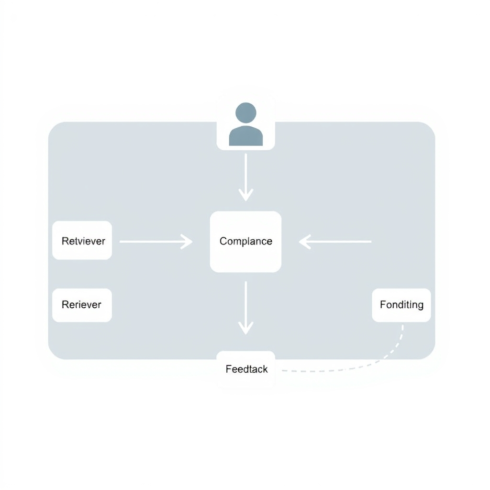
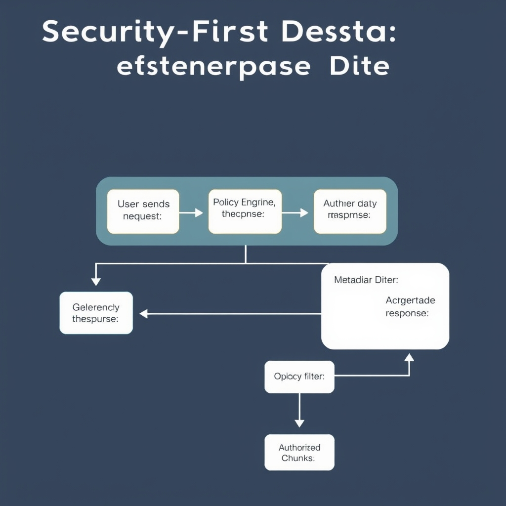
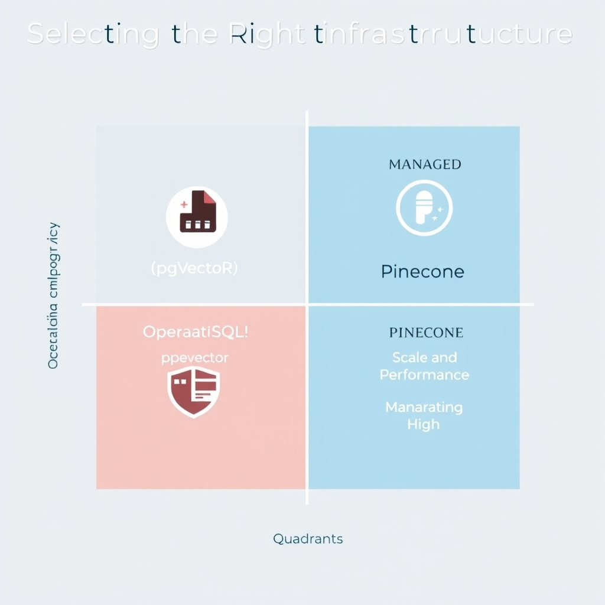

# Architecting Enterprise-Grade RAG: Beyond the Simple Pipeline

## The Evolution of Enterprise RAG Architecture

### Limitations of single‑pass RAG pipelines

Traditional RAG implementations treat retrieval and generation as a single, linear step. This design creates several pain points for enterprises:

*The multi-agent orchestration model: A central orchestrator manages specialized agents to ensure iterative retrieval, validation, and compliance.*

- **Static context** – The model receives a fixed set of documents, so it cannot refine its answer when the initial retrieval is incomplete.
- **Hallucination risk** – Without a validation stage, generated text may drift from source material, leading to misinformation.
- **Compliance blind spots** – A monolithic pipeline cannot enforce regulatory constraints (e.g., GDPR, HIPAA) on a per‑query basis.
- **Scalability bottlenecks** – Adding new data sources or processing higher query volumes requires re‑engineering the entire pipeline rather than scaling individual components.

These shortcomings make single‑pass pipelines unsuitable for the security‑first, high‑throughput environments expected in 2026.

### Multi‑agent orchestration model

Enter the **multi‑agent orchestration model**, where a lightweight coordinator routes a query through a series of purpose‑built agents. As described in the industry guide [*Defensible RAG: 2026 Enterprise Implementation Best Practices*](https://techplustrends.com/enterprise-rag-implementation-best-practices-2026), enterprises now deploy agents such as:

- **Retriever Agent** – Decomposes the user query, performs iterative retrieval, and enriches the context with the most relevant chunks.
- **Critic (Validation) Agent** – Checks the retrieved evidence for factual consistency, flags hallucinations, and scores answer faithfulness.
- **Compliance Agent** – Applies policy rules, redacts protected data, and ensures the response stays within regulatory boundaries.
- **Formatting Agent** – Aligns the final output with corporate style guides and downstream system contracts.

The orchestrator monitors each agent’s status, retries failed steps, and can parallelize independent agents to meet latency targets.

### How agentic workflows boost accuracy and reliability

1. **Iterative retrieval** lets the Retriever Agent refine its search based on early feedback, reducing missed relevant documents.
1. **Validation loops** performed by the Critic Agent catch hallucinations before they reach the user, raising overall answer correctness.
1. **Policy enforcement** by the Compliance Agent guarantees that no sensitive data leaks, satisfying audit and legal requirements.
1. **Modular scaling** means each agent can be independently sized or replaced (e.g., swapping a dense‑retrieval model for a newer one) without disrupting the whole system.

Collectively, these characteristics transform RAG from a fragile, one‑off pipeline into a resilient, enterprise‑grade service capable of meeting the accuracy, reliability, and security expectations of modern organizations.

## Security-First Design: Protecting Enterprise Data

### Role‑Based Access Control (RBAC) as the Foundation

Enterprise RAG pipelines must enforce **who can do what** before any vector lookup occurs. A classic RBAC matrix maps users (or groups) to permissions such as *read*, *write*, and *admin* on specific document collections. In a fintech context, a trader might be granted read‑only access to market‑data embeddings, while a compliance officer receives read/write rights on regulatory filings. This granularity prevents accidental exposure of sensitive assets and satisfies audit requirements.

*Permission-aware retrieval: The query interceptor applies metadata filters based on the user's role before the vector search executes.*

### Permission‑Aware Retrieval

RBAC alone is insufficient if the retrieval layer can surface unauthorized vectors. **Permission‑aware retrieval** embeds the user’s role into the query engine so that only vectors whose metadata tags match the caller’s clearance are returned. Implementation steps:

1. **Metadata Enrichment** – Tag each document with attributes like `department`, `confidentiality_level`, and `region` at ingestion time.
1. **Policy Engine** – Deploy a lightweight policy service (e.g., Open Policy Agent) that evaluates the caller’s role against the requested metadata.
1. **Query Interceptor** – Wrap the vector search API; before executing the nearest‑neighbor query, the interceptor injects a filter clause derived from the policy decision.

### Audit Logging and Encryption

**Audit logging** must be immutable, timestamped, and centrally aggregated. Every retrieval request, role evaluation, and LLM prompt should emit a structured log entry containing:

- User identifier
- Requested query vector hash
- Decision outcome (allowed/denied)
- Reasoning snapshot from the policy engine
- Response size and latency

These logs feed into SIEM platforms for real‑time anomaly detection and compliance reporting.

**Encryption** protects data both in transit (TLS 1.3) and at rest (AES‑256 with customer‑managed keys). For vector stores that support envelope encryption, the key hierarchy should be scoped per business unit, enabling revocation without re‑indexing the entire corpus.

### Mitigating Prompt Injection and Data Leakage

Even with strict retrieval controls, a malicious user can craft a prompt that coerces the LLM into revealing protected information. Defensive measures include:

- **Input Sanitization** – Strip or escape user‑provided code snippets and system commands before concatenating them with retrieved context.
- **LLM Guardrails** – Deploy a secondary verification model that scans the final prompt for disallowed patterns (e.g., requests for personally identifiable information).
- **Response Filtering** – Post‑process LLM outputs with regex or policy‑based redaction to remove any inadvertently leaked excerpts.
- **Rate Limiting & Anomaly Detection** – Monitor query patterns for spikes that may indicate automated probing attempts.

By weaving RBAC, permission‑aware retrieval, robust audit trails, encryption, and proactive injection defenses into the core of an enterprise RAG system, organizations can meet the stringent security expectations of 2026 while still delivering high‑quality, context‑rich answers.

## Selecting the Right Vector Infrastructure

### Evaluating pgvector on PostgreSQL

*Operational simplicity* is the primary reason many 2026 enterprise teams start with **pgvector** embedded in PostgreSQL. Because the vector extension lives inside a familiar relational engine, teams can reuse existing CI/CD pipelines, backup strategies, and monitoring dashboards. No separate service endpoint is required, so latency is limited to the database round‑trip and the operational overhead is essentially that of a standard Postgres cluster. The Medium production guide notes that pgvector “handles up to 50 million vectors comfortably” for typical RAG workloads, making it a solid baseline for most internal knowledge‑base applications[^1].

*Security* benefits flow from PostgreSQL’s mature RBAC model and native encryption‑at‑rest, allowing enterprises to apply the same policies they already enforce on transactional data.

______________________________________________________________________

### Analyzing Pinecone for High‑Scale, Performance‑Critical Needs

When latency budgets shrink below **50 ms p99** at multi‑region scale, a fully managed vector service becomes attractive. **Pinecone** offers a purpose‑built, horizontally scalable index that can achieve sub‑50 ms p99 latency at scale, even as the vector count grows into the billions. The same Medium guide positions Pinecone as “the strongest alternative” for workloads that demand sub‑50 ms p99 latency at scale or that prefer to offload operational responsibilities such as sharding, replica management, and hardware provisioning[^1].

*Compliance* is baked in: Pinecone provides built‑in encryption‑in‑flight, audit logging, and region‑level isolation, which aligns with enterprise data‑sovereignty requirements.

______________________________________________________________________

### Infrastructure Overhead vs. Managed‑Service Benefits

| Aspect                    | pgvector on PostgreSQL                                                                              | Pinecone Managed Service                                                            |
| ------------------------- | --------------------------------------------------------------------------------------------------- | ----------------------------------------------------------------------------------- |
| **Deployment effort**     | Requires provisioning of a Postgres cluster, installing the pgvector extension, and tuning indexes. | Zero‑ops provisioning via console/API; no server management.                        |
| **Scalability**           | Scales vertically; horizontal scaling needs custom sharding or Citus.                               | Horizontal scaling handled automatically; supports billions of vectors.             |
| **Latency guarantees**    | Dependent on DB hardware and network; typical p99 ~70‑120 ms at 50 M vectors.                       | SLA‑backed sub‑50 ms p99 across regions.                                            |
| **Operational cost**      | Lower compute cost for small‑to‑mid workloads; cost grows with self‑managed scaling.                | Higher per‑query cost but predictable; includes maintenance, upgrades, and support. |
| **Security & compliance** | Leverages existing Postgres RBAC, TLS, and encryption; audit logging must be added.                 | Built‑in encryption, audit logs, and region‑level data residency controls.          |

______________________________________________________________________

### Decision Matrix for Enterprise Scale

| Enterprise Scale                                   | Primary Concern                                           | Recommended Choice                                                                              |
| -------------------------------------------------- | --------------------------------------------------------- | ----------------------------------------------------------------------------------------------- |
| **Small / pilot (≤ 10 M vectors)**                 | Fast time‑to‑value, reuse existing DB ops                 | **pgvector** – minimal new infrastructure.                                                      |
| **Medium (10‑50 M vectors, moderate traffic)**     | Balanced cost vs. performance, internal security policies | **pgvector** with tuned indexes; consider Citus for horizontal scaling if needed.               |
| **Large (≥ 50 M vectors, high QPS, global users)** | Strict latency SLAs, operational predictability           | **Pinecone** – managed service removes scaling friction.                                        |
| **Regulated / multi‑region compliance**            | Data residency, auditability, zero‑trust networking       | **Pinecone** (region‑locked clusters) or **pgvector** only if you can meet compliance in‑house. |

By mapping your workload size, latency targets, and compliance posture against this matrix, you can choose the vector store that aligns with both technical requirements and organizational constraints.

\[^1\]: Pratik Rupareliya, *Top 15 Vector Databases in 2026: A Production Decision Guide from 100 Enterprise Deployments*, Medium, https://medium.com/@pratik-rupareliya/top-15-vector-databases-in-2026-a-production-decision-guide-from-100-enterprise-deployments-dd58a04f51a5

*Decision framework: Choosing between pgvector and Pinecone based on your organization's scale and operational maturity.*

## Conclusion: Building for the Future

The future of enterprise Retrieval‑Augmented Generation hinges on **modular, agentic architecture**. By decomposing the pipeline into specialized agents—retrieval, validation, compliance, and orchestration—you gain the flexibility to swap, upgrade, or scale components without disrupting the whole system. This modularity not only improves accuracy and reliability but also aligns with the rapid pace of AI model evolution.

Security must be treated as an **ongoing process**, not a one‑off feature toggle. Continuous monitoring, role‑based access controls, and automated audit trails should be baked into every agent’s lifecycle. Regularly revisiting threat models and updating mitigation strategies (e.g., prompt‑injection defenses) ensures that data protection keeps pace with emerging risks.

Finally, adopt an **iterative development cadence** driven by concrete business outcomes. Start with a minimal viable agentic workflow, measure its impact on key metrics such as retrieval relevance and compliance hit‑rates, then incrementally add capabilities—additional agents, tighter security policies, or richer vector stores—as the organization’s needs evolve. This feedback‑loop approach guarantees that the RAG solution remains both technically robust and tightly aligned with strategic goals.