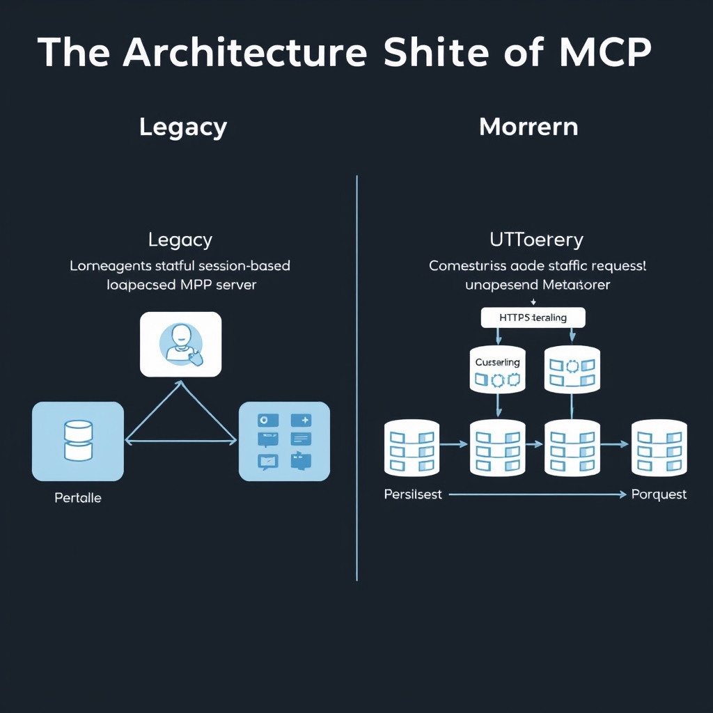
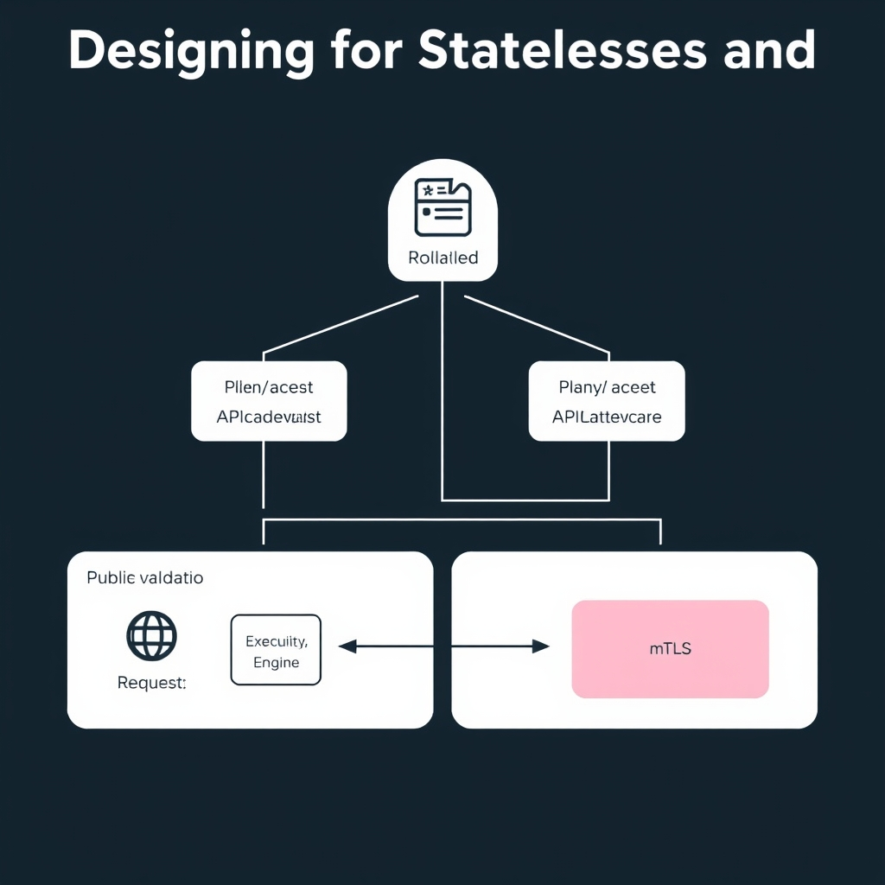
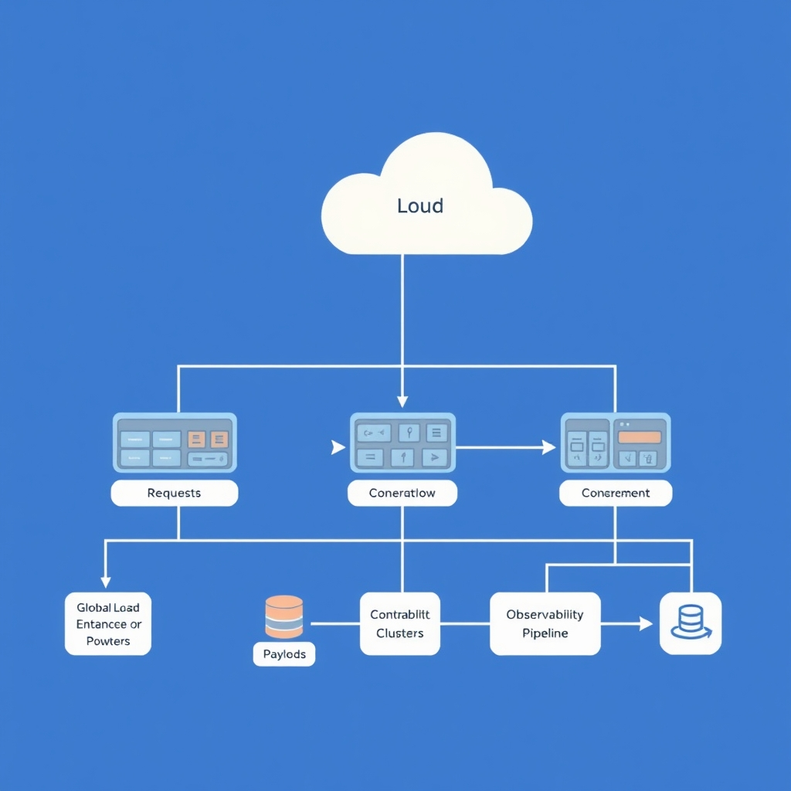

# Architecting for Agentic AI: The Evolution of the Model Context Protocol

## The Architectural Shift of MCP

The July 28 2026 release of the Model Context Protocol (MCP) marks a decisive move from a developer‑centric, session‑oriented tool to a truly stateless, cloud‑ready infrastructure. The specification overhaul eliminates transport‑level session management, turning MCP into a protocol that can run on ordinary HTTP load‑balanced back‑ends. This change ripples through existing AI agent designs in three key ways:

*The transition from stateful, session-bound connections to stateless, load-balanced infrastructure enables horizontal scaling across cloud environments.*

- **Legacy session handling becomes obsolete** – agents that previously relied on persistent connections to maintain context must now externalize state, typically in a shared datastore or cache. The shift forces a redesign of conversation flow logic, moving from in‑process session IDs to token‑based or request‑scoped identifiers.
- **Scalability is no longer bounded by a single host** – because the protocol no longer ties context to a specific TCP session, multiple instances of an MCP server can serve the same request pool. Standard cloud load balancers (e.g., AWS ALB, GCP Cloud Load Balancing) can now distribute traffic without risking loss of context, as the protocol itself carries all necessary metadata. This capability is explicitly highlighted in the update documentation, which notes that MCP now "scales on ordinary HTTP load‑balanced infrastructure"[Scaling AI Agent Infrastructure with the MCP Stateless updates](https://developers.googleblog.com/scaling-ai-agent-infrastructure-with-the-mcp-stateless-updates).
- **Deployment flexibility expands** – statelessness enables hybrid on‑premise and multi‑cloud topologies. Teams can spin up short‑lived server instances for burst workloads, confident that no hidden session state will be stranded on a terminated node.

### Limitations of the Original Session‑Oriented Design

The pre‑2026 MCP required a dedicated, long‑lived connection per agent instance. This model introduced several constraints:

1. **Resource contention** – each active session consumed a socket and memory on the host, limiting the number of concurrent agents.
1. **Fault tolerance challenges** – a server crash could orphan sessions, forcing complex reconnection logic.
1. **Geographic latency** – agents were often tied to the nearest server, preventing optimal routing across regions.

By contrast, the stateless model discards these bottlenecks, allowing any server to handle any request without prior handshake state.

### Cloud‑Native Load Balancing Enabled

With state removed from the transport layer, MCP traffic behaves like any other HTTP request. Load balancers can perform round‑robin, least‑connections, or latency‑based routing, automatically scaling out as demand spikes. This eliminates the need for custom session‑affinity plugins and aligns MCP with existing DevOps pipelines for autoscaling and blue‑green deployments.

### Significance of the 10,000+ Public Server Milestone

The ecosystem’s rapid growth—exceeding 10,000 active public MCP servers by early 2026—demonstrates broad adoption and validates the protocol’s readiness for enterprise scale. This milestone, reported by industry observers, underscores the community’s confidence in the stateless architecture and signals a robust, decentralized network capable of supporting diverse AI agent workloads[​MCP Hits 10000+ Servers as Biggest Update Ships [2026]](https://tech-insider.org/ie/model-context-protocol-mcp-update-2026).

Collectively, these changes redefine how developers architect AI agents: from tightly coupled, session‑dependent services to flexible, horizontally scalable components that fit naturally into modern cloud environments.

## Designing for Statelessness and Security

The July 2026 MCP update moves every security decision out of the wire protocol and into the surrounding application stack. In practice, the protocol no longer carries authentication tokens, session identifiers, or integrity checks; those responsibilities now belong to the server implementation and any platform‑level services that host it. This shift has three immediate implications for architects:

*By moving security enforcement to the application layer, the gateway acts as the primary policy enforcement point, isolating the internal execution engine.*

### 1. Security enforcement lives in the application layer

- **Policy enforcement points (PEPs)** are instantiated by the MCP server code rather than being baked into the protocol handshake. For example, rate‑limiting, input validation, and role‑based access control must be coded into the request‑handling middleware of each custom server.
- **Audit trails** must be generated by the application, because the protocol itself no longer emits signed logs. Developers should integrate structured logging (e.g., JSON‑encoded events) with a centralized SIEM to retain visibility.

According to [The New MCP Specification](https://www.akamai.com/blog/security-research/new-mcp-specification-security-teams-must-prepare), "security decisions that were previously enforced by the protocol are increasingly delegated to MCP server developers and platform operators."

### 2. Managing trust boundaries for custom servers

- **Define clear ownership zones** – separate the *public‑facing API gateway* (managed by the platform operator) from the *internal execution engine* (owned by the application team). The gateway should terminate TLS, perform initial authentication, and forward only validated payloads to the engine.
- **Zero‑trust networking** – enforce mutual TLS between gateway and engine, even within the same data center, to prevent lateral compromise.
- **Immutable infrastructure** – treat server binaries as immutable artifacts stored in a signed container registry. Deployments must be verified against a cryptographic hash before launch, ensuring that only vetted code can process MCP messages.

### 3. Authentication without protocol‑level statefulness

- **Stateless token validation** – use JWTs or OAuth‑2 access tokens that the application validates on each request. Because MCP does not maintain session state, the token must contain all claims needed for authorization.
- **Short‑lived tokens** – limit token lifetime (e.g., 5‑15 minutes) to reduce the impact of token leakage. Refresh tokens can be exchanged via a dedicated auth service that is outside the MCP data path.
- **Challenge‑response flows** – for high‑value operations, require an additional proof‑of‑possession step (e.g., signed nonce) that the server verifies independently of the MCP payload.

### 4. Role of platform operators in the new security paradigm

- **Operator‑level policy orchestration** – operators provide global policies (e.g., IP allow‑lists, request quotas) that are enforced by the gateway before traffic reaches any custom server.
- **Managed secret distribution** – operators should supply secrets (TLS certificates, signing keys) via a secret‑management service (e.g., Vault) rather than hard‑coding them.
- **Compliance monitoring** – operators must audit server configurations for compliance with the MCP security model, ensuring that no legacy stateful checks remain in the codebase.

#### Practical checklist for architects

1. **Audit existing MCP servers** for any protocol‑level authentication logic and migrate it to application middleware.
1. **Implement a gateway** that terminates TLS, validates stateless tokens, and enforces operator policies.
1. **Adopt zero‑trust networking** between gateway and execution engine, using mutual TLS.
1. **Integrate immutable deployment pipelines** with signed container images.
1. **Configure short‑lived JWTs** and a dedicated auth service for token issuance.
1. **Document trust boundaries** in architecture diagrams and share them with security teams.

By re‑architecting around these principles, developers can leverage the stateless nature of the new MCP while preserving a robust security posture across the entire agentic stack.

## Enterprise Integration Strategies

### How the Hyperscalers Adopted MCP

By mid‑2026, the leading cloud providers have woven the Model Context Protocol into the core of their AI agent services. OpenAI, Google, Microsoft, and AWS all report native support for MCP, enabling agents to exchange context without maintaining session state on the client side. This integration is documented in the industry‑wide update that highlighted the protocol’s rollout to over **10,000 public servers** — a milestone that underscores its rapid adoption across the major platforms [MCP Update Report](https://tech-insider.org/ie/model-context-protocol-mcp-update-2026).

*Enterprise-scale MCP deployments leverage standard cloud-native infrastructure, utilizing global load balancing and distributed tracing for reliability.*

- **AWS** exposes MCP‑enabled endpoints through its SageMaker Inference API, allowing developers to invoke stateless agents with a single HTTP call.
- **Google Cloud** bundles MCP into Vertex AI Agents, providing built‑in load balancing and automatic scaling.
- **Microsoft Azure** incorporates MCP in the Azure OpenAI service, where the protocol’s stateless nature simplifies multi‑tenant deployments.

### Benefits of a Standardized, Stateless Protocol

1. **Interoperability** – A single wire format means agents built on different platforms can converse without custom adapters. Teams can mix‑and‑match services (e.g., a Google‑hosted planner with an AWS‑hosted executor) while preserving context fidelity.
1. **Simplified DevOps** – Stateless calls eliminate the need for session affinity, allowing cloud load balancers to distribute traffic evenly. This reduces latency spikes and improves overall throughput.
1. **Security Consistency** – With no protocol‑level state, authentication can be delegated to standard OAuth 2.0 or JWT mechanisms, aligning with existing cloud IAM policies.
1. **Future‑Proofing** – Because MCP defines a versioned schema, providers can introduce extensions without breaking existing agents. Developers can adopt new features incrementally, preserving backward compatibility.

### Future‑Proofing Your AI Stack

To stay resilient against subsequent protocol revisions, consider the following architectural patterns:

- **Adapter Layer** – Encapsulate MCP calls behind a thin abstraction that can translate between protocol versions. When a new version is released, only the adapter needs updating.
- **Feature Flags** – Gate optional MCP extensions behind runtime flags, allowing gradual rollout across environments.
- **Schema Validation** – Employ JSON‑Schema validators at the edge to catch mismatches early, preventing cascading failures in downstream agents.

### Anticipating Cloud‑Scale Bottlenecks

Even with a stateless design, large‑scale deployments can encounter performance constraints:

- **Network Saturation** – High‑frequency context exchanges may saturate VPC bandwidth. Mitigate by co‑locating agents within the same region and leveraging internal load balancers.
- **Cold‑Start Latency** – Serverless functions invoked via MCP can suffer cold starts. Warm‑pool strategies or provisioned concurrency can keep latency predictable.
- **Rate‑Limiting** – Cloud providers often enforce API throttling. Implement exponential back‑off and request batching to stay within quota limits.
- **Observability Gaps** – Stateless interactions can obscure request tracing. Deploy distributed tracing tools (e.g., OpenTelemetry) that propagate correlation IDs through MCP payloads.

By aligning with the hyperscalers’ MCP implementations, standardizing on a stateless contract, and proactively addressing scaling challenges, enterprises can build AI agent ecosystems that are both robust today and adaptable to tomorrow’s protocol evolutions.

## Sources

- [Scaling AI Agent Infrastructure with the MCP Stateless updates - Google Developers Blog](https://developers.googleblog.com/scaling-ai-agent-infrastructure-with-the-mcp-stateless-updates)
- [MCP Hits 10000+ Servers as Biggest Update Ships [2026]](https://tech-insider.org/ie/model-context-protocol-mcp-update-2026)
- [The New MCP Specification: What Security Teams Must Prepare For](https://www.akamai.com/blog/security-research/new-mcp-specification-security-teams-must-prepare)