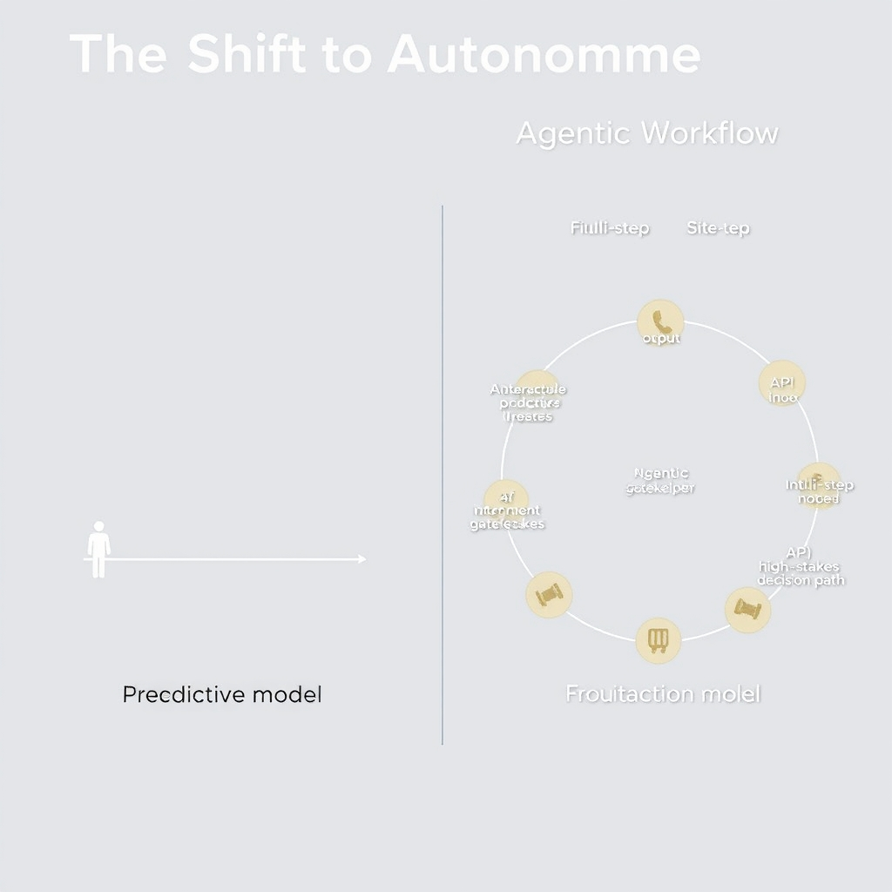
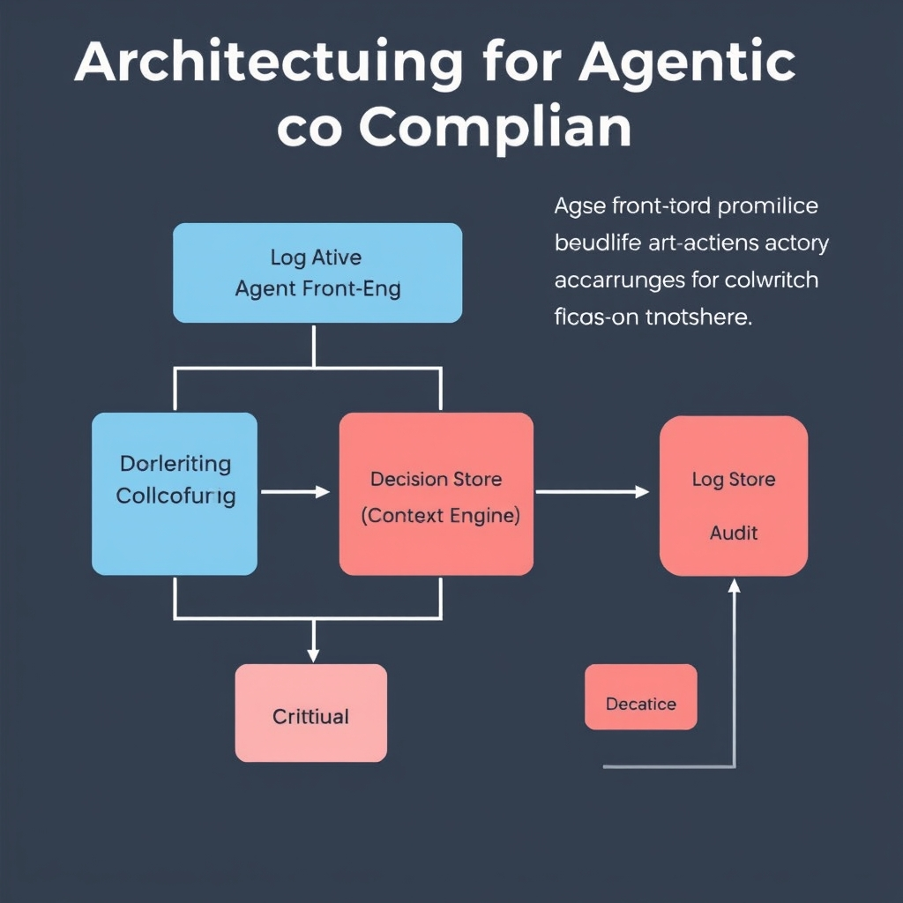

# Beyond Automation: Navigating the Era of Agentic AI in Finance

## The Shift to Autonomous Finance

The financial sector’s AI journey began with **predictive models** that ingested historical transaction data to forecast credit risk, churn, or market movements. These models were typically *single‑step*: a data feed produced a score, which a human analyst reviewed before any action was taken. Over the past few years, the focus has shifted toward **agentic AI**—systems that can plan, execute, and adapt across multiple steps without continuous human direction. In practice, an autonomous agent can ingest a loan application, run credit scoring, negotiate terms, generate a contract, and even trigger settlement, all within a single workflow.


*The shift from single-step predictive models to multi-step autonomous agents allows for end-to-end financial processing with strategic human oversight.*

______________________________________________________________________

### From Prediction to Autonomy

1. **Simple predictive pipelines** – Linear regression or gradient‑boosted trees output a probability that a customer will default. The output is a *decision point* for a human.
1. **Decision‑orchestration layers** – Rule‑based engines stitch together several models (e.g., fraud detection + credit scoring) but still require manual approval at hand‑off points.
1. **Multi‑step autonomous agents** – Leveraging large language models (LLMs) and reinforcement‑learning‑based planners, agents can query internal APIs, interpret regulatory language, and adjust actions in real time. This evolution mirrors the broader AI trend described by JourneyBee, which notes that *"Agentic AI is the dominant technological shift we can expect to see in 2026"*【https://journeybee.io/resources/fintech-trends-and-predictions】.

______________________________________________________________________

### Adoption at Scale

A 2026 market analysis by Kellton reports that **88 % of financial organizations have integrated AI into at least one key business function**, contributing to a projected $45.59 billion AI‑in‑banking market【https://www.kellton.com/kellton-tech-blog/ai-in-banking-use-cases-benefits-future-of-finance】. This figure reflects not only the prevalence of predictive analytics but also the rapid rollout of agentic prototypes in production environments.

______________________________________________________________________

### Real‑World Agentic Deployments

- **Capital One’s MACAW** – A multi‑agent platform that automates end‑to‑end credit underwriting, from data ingestion to contract generation, reducing processing time from days to minutes【https://fintechnews.ch/aifintech/top-ai-trends-in-banking-in-2026/83961】.
- **J.P. Morgan’s ASK DAVID** – An internal conversational assistant that orchestrates complex trading strategies, pulls market data, and executes orders autonomously, allowing traders to focus on high‑level decision making【https://fintechnews.ch/aifintech/top-ai-trends-in-banking-in-2026/83961】.

Both initiatives illustrate how tier‑1 banks are moving beyond isolated models to **multi‑agent workflows** that handle quant investing, lending, and compliance tasks.

______________________________________________________________________

### Efficiency Gains vs. Legacy Automation

Legacy automation—rule‑based RPA bots or static decision trees—offers speed but suffers from brittleness: any change in data schema or regulation requires manual re‑coding. Agentic workflows, by contrast, provide:

- **Dynamic adaptation** – Agents can interpret new regulatory language on the fly, reducing downtime during policy updates.
- **End‑to‑end latency reduction** – A loan that once required three separate systems and human hand‑offs can now be completed in a single, continuous transaction.
- **Scalable expertise** – LLM‑driven agents encapsulate domain knowledge that would otherwise reside in siloed analyst teams.

The net effect is a **productivity uplift** that many institutions quantify as a 30‑40 % reduction in operational cost per processed case, while simultaneously improving consistency and auditability. As the industry embraces these autonomous capabilities, the next frontier shifts from *whether* the technology works to *how* it can be governed safely.

## The Regulatory Landscape: A Tale of Two Approaches

### U.S. Model‑Risk Guidance and the Agentic AI Exclusion

In April 2026 the Federal Reserve, OCC, and FDIC released **SR 26‑2**, a modernised model‑risk management framework that supersedes the older SR 11‑7 guidance. While the document expands oversight to advanced analytics, it **explicitly excludes generative and agentic AI** from its scope, noting that these technologies demand a separate regulatory approach【https://www.ncontracts.com/nsight-blog/how-generative-ai-impacts-your-fis-risk-management-program】. The practical impact is two‑fold:

1. **Regulatory uncertainty** – firms can deploy agentic agents without a clear set of compliance checkpoints, forcing risk officers to interpret existing rules or build internal safeguards.
1. **Competitive pressure** – banks that can self‑regulate may accelerate deployment, but those that wait for formal guidance risk falling behind peers that have already integrated multi‑step autonomous workflows.

Because SR 26‑2 does not prescribe reporting, validation, or audit‑trail requirements for agentic systems, institutions must **extend their model‑risk controls** (e.g., independent model validation, documentation of assumptions) to cover the autonomous decision‑making loop. Failure to do so can trigger supervisory scrutiny under broader prudential standards, even if the specific AI activity is technically out of scope.

______________________________________________________________________

### The United Kingdom’s Technology‑Agnostic Approach

Across the Atlantic, the **FCA, PRA, and BoE** have taken a different tack. Their 2026 statements reaffirm that AI, including agentic variants, will be overseen **through existing regulatory frameworks** rather than through bespoke AI legislation【https://www.globalpolicywatch.com/2026/04/uk-financial-services-regulators-approach-to-artificial-intelligence-in-2026】. This stance rests on three pillars:

- **Principle‑based supervision** – regulators focus on outcomes (e.g., fairness, resilience) rather than prescribing specific technical controls.
- **Leverage of existing risk‑management regimes** – model‑risk, operational risk, and conduct‑risk requirements are applied to AI systems as they would to any other model.
- **Flexibility for innovation** – by avoiding prescriptive AI rules, the UK aims to keep its financial sector attractive to fintechs and large banks experimenting with autonomous agents.

The downside is that firms must **interpret broad principles** for highly complex, self‑directing agents, which can lead to divergent internal policies.

______________________________________________________________________

### Implications for Global Financial Institutions

For banks that operate in both jurisdictions, the regulatory dichotomy creates a **dual‑track compliance burden**:

- In the U.S., risk‑management teams must design **supplemental controls** to fill the SR 26‑2 gap, often mirroring the UK’s principle‑based expectations but documented as internal policy.
- In the UK, the same teams can rely on existing frameworks, but they must still demonstrate **how those frameworks map to autonomous decision flows**.

Practically, this means maintaining **separate governance artefacts** (e.g., model‑validation reports for the U.S., principle‑alignment matrices for the UK) while ensuring that the underlying agentic platform remains consistent. Cross‑border data‑sharing agreements, model‑ownership registers, and audit‑trail standards must be harmonised to avoid duplicated effort and to satisfy both regulators.

______________________________________________________________________

### The Governance Gap: Risks of Outpacing Regulation

When technology evolves faster than regulation, a **"governance gap"** emerges. Key risks include:

1. **Regulatory arbitrage** – firms may channel high‑impact agentic workloads to the jurisdiction with the lighter oversight, exposing the organization to reputational and supervisory risk if the activity is later deemed non‑compliant.
1. **Model‑risk blind spots** – without explicit guidance, banks may overlook failure modes unique to multi‑agent systems, such as emergent behaviour or cascade errors.
1. **Audit‑trail insufficiency** – SR 26‑2’s exclusion means U.S. supervisors could still invoke broader prudential rules (e.g., SR 11‑7‑like expectations) to demand detailed logs, catching firms off‑guard if they have not built robust logging.
1. **Stakeholder mistrust** – investors and customers may question the adequacy of oversight when regulators publicly acknowledge a gap, potentially affecting capital costs and market confidence.

Mitigating these risks requires **proactive governance**: establishing a cross‑jurisdictional AI‑risk committee, instituting real‑time monitoring dashboards, and publishing transparent audit‑trail policies that satisfy the stricter of the two regulatory expectations. By treating the governance gap as a **risk‑management objective rather than a compliance afterthought**, global banks can turn regulatory divergence into a competitive advantage while safeguarding systemic stability.

## Architecting for Agentic Compliance

### Human‑in‑the‑Loop (HITL) for High‑Stakes Workflows

In autonomous finance, a *human‑in‑the‑loop* is not a safety net that can be switched off; it is a contractual control point that satisfies both risk appetite and regulator‑mandated oversight. For high‑value activities—e.g., credit underwriting, market‑making, or anti‑money‑laundering (AML) alerts—the HITL requirement typically includes:


*A modular architecture ensures that every autonomous decision is captured in an immutable audit trail, independent of the primary decision-making logic.*

1. **Pre‑execution gating** – the agent proposes a decision, the system surfaces a concise rationale, and a designated officer must approve or reject before the action is committed.
1. **Post‑execution review** – every autonomous transaction is logged with a timestamp, the originating prompt, the model version, and the final outcome. A compliance analyst must sign off on a daily batch report.
1. **Escalation triggers** – thresholds (e.g., exposure > $10 M, model confidence < 85 %) automatically route the request to senior risk managers, bypassing the normal automated path.

Embedding these controls in the software architecture ensures that the “human” component is a deterministic, auditable step rather than an ad‑hoc checkpoint.

______________________________________________________________________

### Modular Architecture for Decision‑Logging

A clean way to monitor agentic behavior is to treat logging as a first‑class service. The diagram below outlines a loosely‑coupled stack that can be scaled across multiple agents and data centers:

```
+-------------------+      +-------------------+      +-------------------+
|  Agent Front‑End  | ---> |  Decision Engine  | ---> |  Audit Service    |
+-------------------+      +-------------------+      +-------------------+
        |                          |                         |
        |   (JSON request/resp)    |   (gRPC, async)         |   (Kafka topic)
        v                          v                         v
+-------------------+      +-------------------+      +-------------------+
|  Context Store    |      |  Model Registry   |      |  Log Store (ELK)  |
+-------------------+      +-------------------+      +-------------------+
```

- **Agent Front‑End** – UI or API that receives business intents (e.g., *"run a loan‑approval simulation"*).
- **Decision Engine** – orchestrates one or more autonomous agents, injects the latest model version, and attaches a *decision‑id*.
- **Audit Service** – subscribes to a durable event stream (Kafka, Pulsar) and writes immutable records to a tamper‑evident log store (e.g., append‑only S3 bucket + Elasticsearch for query).
- **Context Store** – holds transient state (session data, market snapshots) that agents may read but never modify.
- **Model Registry** – version‑controlled repository (MLflow, ModelDB) that tags each model with compliance metadata (risk tier, explainability score).

By decoupling the audit trail from the decision engine, you can upgrade agents without touching the logging pipeline, and you can route logs to separate compliance zones for different jurisdictions.

______________________________________________________________________

### Explainability Strategies for Multi‑Agent Systems

When several agents collaborate—e.g., a pricing bot, a risk‑assessment bot, and a settlement bot—the overall outcome can become a black box. The following tactics keep the system explainable:

- **Chain‑of‑Thought Serialization** – each agent appends a short, human‑readable narrative to the request payload (e.g., *"Risk bot flagged 2.3 % probability of default based on credit‑score X"*). The final audit record concatenates these snippets, producing a step‑by‑step audit trail.
- **Feature Attribution Service** – integrate SHAP or LIME as a micro‑service that, on demand, returns the top contributing features for any model inference. Store the attribution alongside the decision log.
- **Policy‑Driven Guardrails** – encode business rules (e.g., *"no loan > $500k without senior manager sign‑off"*) in a declarative policy engine (OPA). When a rule is violated, the engine emits a clear violation message that becomes part of the audit record.
- **Visualization Dashboard** – surface a timeline view where compliance officers can expand each agent’s contribution, see feature importance charts, and trace back to the original data source.

These mechanisms turn a multi‑agent workflow from an opaque pipeline into a series of documented, reversible steps.

______________________________________________________________________

### Conceptual Code: Audit‑Trail Wrapper

Below is a minimal Python wrapper that any agent can import to automatically emit an immutable audit entry. It assumes a Kafka producer (`kafka_producer`) and a JSON‑serializable `request` object.

```python
import json
import uuid
import time
from datetime import datetime
from kafka import KafkaProducer

# Global producer – in production this would be a singleton with TLS/auth.
producer = KafkaProducer(
    bootstrap_servers=["kafka-broker:9092"],
    value_serializer=lambda v: json.dumps(v).encode("utf-8"),
)

class AuditTrail:
    """Utility to record every autonomous decision.

    Usage::
        with AuditTrail(agent_name="pricing_bot", request=req) as audit:
            decision = model.predict(req.payload)
            audit.record(decision=decision, confidence=0.92)
    """

    def __init__(self, agent_name: str, request: dict):
        self.agent_name = agent_name
        self.request_id = request.get("request_id", str(uuid.uuid4()))
        self.session_id = request.get("session_id")
        self.start_ts = datetime.utcnow().isoformat()
        self.base_record = {
            "audit_id": str(uuid.uuid4()),
            "agent": agent_name,
            "request_id": self.request_id,
            "session_id": self.session_id,
            "timestamp": self.start_ts,
            "payload_snapshot": request.get("payload"),
        }
        self.records = []

    def __enter__(self):
        return self

    def __exit__(self, exc_type, exc_val, exc_tb):
        # Flush all accumulated records as a single Kafka message.
        envelope = {"audit": self.base_record, "steps": self.records}
        producer.send("agentic_audit", envelope)
        producer.flush()
        # Propagate exception if any.
        return False

    def record(self, **kwargs):
        """Append a step‑level entry.

        Typical keys: decision, confidence, explanation, policy_violation.
        """
        step = {"timestamp": datetime.utcnow().isoformat(), **kwargs}
        self.records.append(step)
```

**How it fits the architecture**

- The wrapper writes to the **Audit Service** via the `agentic_audit` Kafka topic.
- Each step includes a *payload_snapshot* and optional *explanation* fields, satisfying the chain‑of‑thought and feature‑attribution requirements.
- Because the wrapper is a context manager, the audit record is guaranteed to be emitted even if the agent raises an exception, preserving a complete failure trace.

______________________________________________________________________

With a disciplined HITL policy, a modular logging stack, explainability hooks, and a reusable audit‑trail library, financial firms can move from experimental agentic pilots to production‑grade autonomous systems that meet both internal risk appetites and emerging regulatory expectations.

## Conclusion: Building the Future of Trust

Waiting for a bespoke regulatory regime before deploying agentic AI is a strategic misstep. The April 2026 SR 26‑2 guidance explicitly **excludes generative and agentic AI**, signalling that regulators recognize the technology’s pace outstrips their rule‑making cycles. In a market projected to reach **$45.59 billion in 2026** with **88 % of firms already using AI**, postponing implementation cedes market share to competitors that are already building internal safeguards.

> *“The key to practical agentic AI application likely hinges on whether the industry can build the compliance infrastructure to deploy it safely and at scale.”* – Fintech Trends 2026

A proactive **internal compliance framework** therefore becomes a competitive advantage. By embedding **human‑in‑the‑loop controls**, audit‑trail wrappers, and modular monitoring layers, firms can demonstrate to regulators and clients that risk is managed even in the absence of explicit rules. This not only satisfies the *principles‑based* oversight favored by the UK’s FCA, PRA, and BoE but also prepares organizations for future, more prescriptive mandates.

Looking ahead, the balance between rapid innovation and systemic stability will be defined by **governance maturity, not by regulatory lag**. Institutions that invest today in explainability, decision‑logging, and cross‑jurisdictional policy alignment will be positioned to scale autonomous workflows—such as Capital One’s MACAW or JP Morgan’s ASK DAVID—while mitigating the “governance gap” risk. In the autonomous finance era, trust is engineered internally; the firms that master that engineering will shape the next wave of financial services.