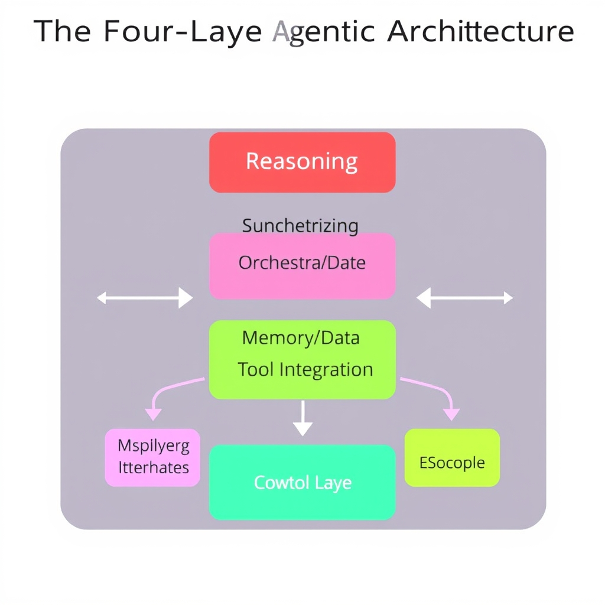
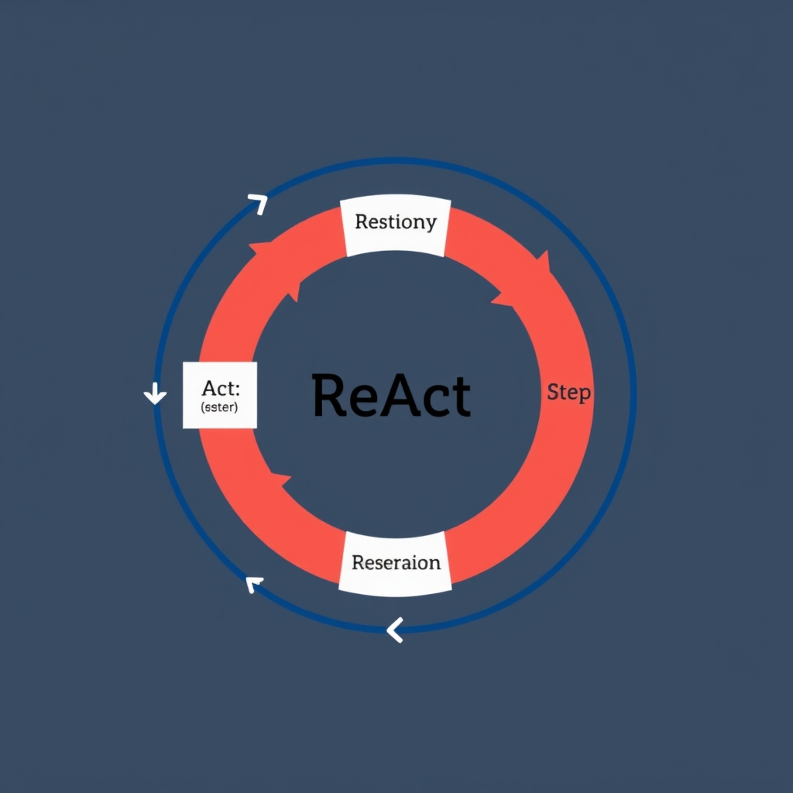
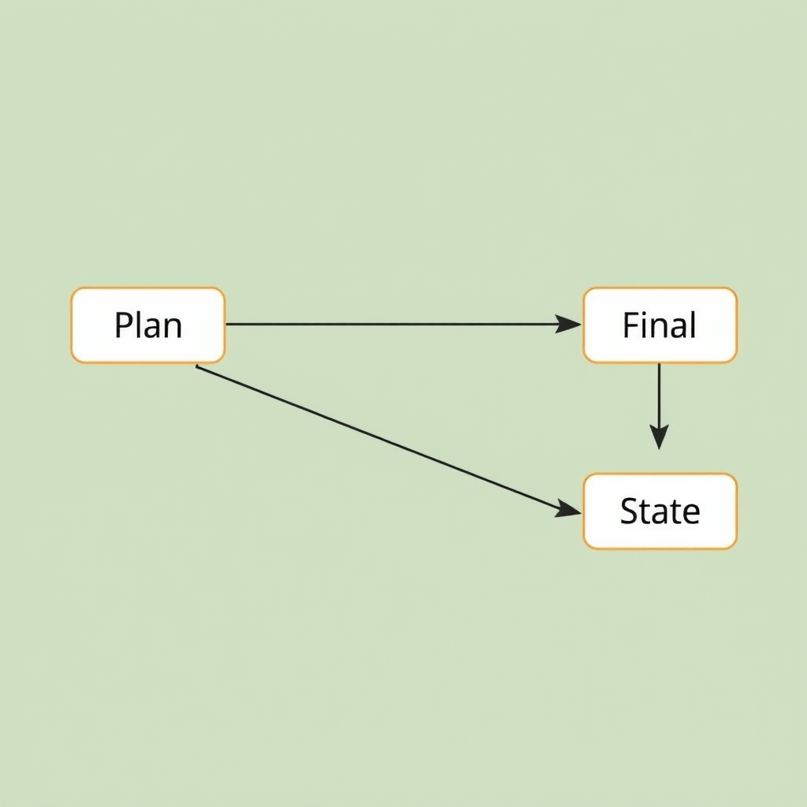

# Beyond Automation: The 2026 Architecture of Autonomous AI Agents

## The Shift from Scripted Automation to Autonomous Agents

Traditional automation pipelines are essentially **linear scripts**: a developer hard‑codes a sequence of steps (extract → transform → load, or trigger → API call → report) and the system dutifully follows that path every time. The workflow has no awareness of the *why* behind the steps; it simply executes a predetermined order until it either succeeds or fails. If the environment changes—new data formats, altered business rules, or unexpected errors—the script must be manually rewritten.

In contrast, **agentic systems** are goal‑seeking entities. Rather than a static chain, an AI agent receives a high‑level objective (e.g., "prepare a quarterly sales forecast") and decides **what** actions are needed, **when** to take them, and **how** to adapt if conditions shift. The agent continuously evaluates progress against the goal, making it resilient to change and capable of handling open‑ended problems.

The core of this autonomy is the **Reason → Act → Iterate** cycle:

1. **Reason** – The LLM analyzes the goal, available context, and any prior observations to generate a plan or hypothesis.
1. **Act** – It invokes tools (APIs, databases, web browsers) to gather data, perform computations, or modify external state.
1. **Iterate** – Results are fed back into the reasoning step, allowing the agent to refine its plan, handle errors, or pursue new sub‑goals.

Crucially, the **LLM itself is the decision‑maker**. In a scripted workflow the developer encodes every decision; in an agentic workflow the developer provides the *capabilities* (tools, memory, orchestration hooks) and the LLM decides *how* to use them. This shift moves intelligence from the codebase to the model, enabling dynamic problem solving without constant developer intervention.

This new paradigm is organized around a **four‑layer architecture**—Reasoning, Orchestration, Memory/Data, and Tool Integration. Each layer encapsulates a distinct responsibility, yet they interoperate to realize the Reason → Act → Iterate loop. Understanding these layers will be the focus of the next section, where we break down the standardized 2026 agentic stack.

## The Four-Layer Agentic Architecture


*The 2026 standardized agentic stack: A modular architecture separating cognitive reasoning from execution and state management.*

### Reasoning Layer – The Cognitive Engine

The reasoning layer is the *brain* of an autonomous agent. It receives the high‑level goal (e.g., "plan a weekend trip") and generates a structured plan using one of the established reasoning patterns (Chain‑of‑Thought, ReAct, Plan‑and‑Execute, Tree‑of‑Thought). This plan is expressed as a sequence of abstract actions, each annotated with required inputs and expected outputs. The layer does **not** invoke external services directly; instead, it produces a *task graph* that the orchestration layer will schedule.

> "In 2026, most production AI agent architectures are built around four interconnected layers: Reasoning Layer, Orchestration Layer, Memory and Data Layer, and Tool Integration Layer" \[[EICTA 2026](https://www.eicta.iitk.ac.in/knowledge-hub/artificial-intelligence/ai-agent-architecture-explained)\]

### Orchestration Layer – Managing State and Flow

Orchestration is responsible for turning the abstract plan into concrete execution steps. It maintains a runtime state machine that tracks which sub‑tasks have started, completed, or failed. When a task requires external interaction (e.g., calling a weather API), the orchestration layer selects the appropriate tool from the Tool Integration Layer, injects the necessary context from the Memory/Data layer, and monitors the response. It also handles multi‑agent coordination: if a sub‑task is delegated to a specialized agent, the orchestrator routes the request and aggregates the results.

Key responsibilities include:

- **Flow control** – sequencing, branching, and retry logic.
- **State persistence** – storing intermediate results so the agent can resume after interruptions.
- **Concurrency** – launching independent sub‑tasks in parallel when the plan permits.

### Memory/Data Layer – Contextual Backbone

An agent’s effectiveness hinges on its ability to recall relevant information. The memory layer provides two complementary stores:

1. **Short‑term context** – a mutable cache of the current conversation, recent tool outputs, and transient variables. This cache is flushed after each reasoning cycle.
1. **Long‑term knowledge** – a searchable vector store or database that holds historical interactions, domain facts, and user preferences. Retrieval mechanisms (semantic search, key‑value lookup) surface this data to the reasoning layer, enabling the agent to ground its plans in past experience.

By exposing a uniform API (`get_context()`, `store_memory()`), the memory layer decouples the reasoning engine from storage implementation details, allowing developers to swap a simple in‑memory dict for a distributed vector database without changing higher‑level logic.

### Tool Integration Layer – Defining External Capabilities

Tools are the *hands* of the agent. This layer encapsulates all callable resources—REST APIs, CLI commands, custom functions, or even other agents. Each tool is described by a schema that specifies:

- **Name and purpose** (e.g., `fetch_weather` – retrieve forecast data).
- **Input contract** (JSON schema for parameters).
- **Output contract** (expected response shape).
- **Rate limits / authentication** details.

During orchestration, the layer validates inputs against the schema, performs the call, and returns a normalized result. By centralizing tool definitions, the architecture enforces consistency, simplifies testing, and makes it straightforward to add or retire capabilities.

### Layer Interaction – A Cohesive Cycle

1. **Goal ingestion** – The agent receives a user request, which the reasoning layer interprets.
1. **Plan generation** – Using its cognitive engine, the reasoning layer produces a task graph.
1. **Orchestration kickoff** – The orchestration layer loads the plan, pulls any needed context from the memory layer, and schedules the first task.
1. **Tool execution** – When a task requires an external action, the orchestration layer invokes the appropriate tool via the Tool Integration Layer.
1. **Result assimilation** – Outputs are stored back into the memory layer, enriching both short‑term context and long‑term knowledge.
1. **Iterative refinement** – The reasoning layer can re‑run with the updated context, adjusting the plan until the goal is satisfied or a termination condition is met.

This closed‑loop design ensures that each layer remains focused on a single responsibility while collectively delivering autonomous, goal‑directed behavior. The separation also aids scalability: reasoning can be offloaded to specialized LLM endpoints, orchestration can run on a lightweight event loop, memory can leverage distributed vector stores, and tools can be hosted as independent micro‑services.

______________________________________________________________________

*The four‑layer model described here reflects the consensus architecture documented by the EICTA Consortium in 2026.*

## Cognitive Strategies: How Agents Think

### Chain‑of‑Thought (CoT)

CoT prompts the LLM to articulate each inference step before arriving at a conclusion. By externalizing its reasoning, the model reduces hallucination and makes debugging straightforward. For example, when asked to compute the probability of drawing two red cards from a deck, a CoT prompt would generate:


*The ReAct loop: The agent continuously reasons about its progress, acts using tools, and observes the results to refine its next move.*

1. *There are 52 cards, 26 red.*
1. *The probability of the first red card is 26/52.*
1. *After removing one red card, 25 red remain out of 51.*
1. *Multiply the two probabilities.*

The final answer follows naturally from the listed steps. This linear logical progression mirrors human problem‑solving and is especially effective for arithmetic, symbolic reasoning, and step‑by‑step explanations. [(source)](https://www.eicta.iitk.ac.in/knowledge-hub/artificial-intelligence/ai-agent-architecture-explained)

______________________________________________________________________

### ReAct (Reasoning and Acting)

ReAct closes the gap between thought and execution. The agent alternates between a **reasoning** phase—where it interprets observations or generates a plan—and an **acting** phase—where it invokes a tool (e.g., a web search, database query, or calculator). The loop continues until the goal is satisfied.

**Example:** An agent tasked with "find the latest COVID‑19 statistics for Italy" would:

1. *Reason*: Identify that a reliable source is the WHO API.
1. *Act*: Issue an HTTP GET request to the API.
1. *Reason*: Parse the JSON response and extract the relevant fields.
1. *Act*: Format the data for the user.

Because the LLM decides *when* to act, the system can adapt to unexpected results (e.g., a 404 error) by reasoning about alternative sources. This pattern is the backbone of most production agents, where observation‑action cycles drive autonomy. [(source)](https://www.eicta.iitk.ac.in/knowledge-hub/artificial-intelligence/ai-agent-architecture-explained)

______________________________________________________________________

### Tree‑of‑Thought (ToT)

ToT expands the search space by exploring multiple reasoning branches in parallel. Instead of a single linear chain, the agent generates a **tree** of candidate thoughts, evaluates each leaf with a scoring function, and prunes sub‑optimal paths. This is useful for combinatorial problems where a single line of reasoning may miss better solutions.

**Illustration:** Solving a Sudoku puzzle. The agent:

1. Generates possible numbers for the first empty cell (branch A, B, C).
1. For each branch, recursively fills subsequent cells, creating deeper sub‑branches.
1. Scores each complete board based on rule compliance.
1. Returns the highest‑scoring leaf as the solution.

By maintaining a structured set of alternatives, ToT mitigates the myopic bias of CoT and enables agents to backtrack efficiently. [(source)](https://www.eicta.iitk.ac.in/knowledge-hub/artificial-intelligence/ai-agent-architecture-explained)

______________________________________________________________________

### Plan‑and‑Execute

Plan‑and‑Execute decomposes a high‑level objective into discrete sub‑tasks, assigns each to the appropriate tool, and orchestrates their execution. The planning stage produces a **task graph**; the execution stage runs the graph, handling dependencies and failures.

**Scenario:** Creating a three‑day travel itinerary for Tokyo.

1. *Plan*: Break the goal into "research attractions", "check opening hours", "optimize route", and "format itinerary".
1. *Execute*: Call a travel‑info API for attractions, query a calendar service for opening times, run a routing optimizer, and finally generate a markdown document.
1. *Iterate*: If the optimizer reports an infeasible route, the agent revisits the planning stage to adjust constraints.

This pattern blends the deterministic structure of traditional workflows with the flexibility of autonomous reasoning, allowing agents to adapt plans on the fly.

______________________________________________________________________

### Putting the Strategies Together

Modern agents often blend these patterns. A typical workflow might start with a CoT to outline a problem, switch to ReAct for data gathering, employ ToT when multiple solution paths emerge, and finish with Plan‑and‑Execute to deliver the result. Understanding when and why each cognitive strategy is appropriate is key to designing agents that are both **effective** and **robust**.

## Tooling and Frameworks in 2026

### Leading Frameworks in 2026

The 2026 AI‑agent ecosystem has coalesced around three production‑ready stacks:


*Graph-based orchestration: Frameworks like LangGraph manage state across nodes, ensuring context is preserved throughout the execution path.*

- **LangGraph** – a graph‑oriented orchestration engine that lets developers declare nodes (reasoning steps, tool calls, memory accesses) and automatically handles state propagation. It is widely adopted for multi‑step planning because the graph model mirrors the four‑layer architecture (Reasoning → Orchestration → Memory → Tools) [Source](https://alicelabs.ai/en/insights/best-ai-agent-frameworks-2026).
- **Mastra** – focuses on modular reasoning components and provides a plug‑in system for custom planners. Its emphasis on explicit *plan objects* makes it a natural fit for ReAct and Tree‑of‑Thought strategies.
- **Microsoft Agent Framework 1.0** – integrates tightly with Azure services, offering built‑in support for durable functions, vector stores, and secure credential handling. The framework abstracts the orchestration layer behind a declarative YAML schema, reducing boilerplate for large‑scale deployments.

All three expose a **SDK** that hides low‑level API calls, allowing developers to invoke tools (e.g., web search, database queries) with a single method call. This abstraction is crucial because the LLM no longer needs to construct raw HTTP requests; the SDK translates intent into the appropriate tool invocation while managing authentication and rate‑limiting.

______________________________________________________________________

### Why State Management Is the Primary Production Challenge

In autonomous agents, *state* encompasses the current plan, intermediate observations, and memory snapshots. Unlike static scripts, an agent must persist and evolve this state across asynchronous tool calls, retries, and user interactions. Failure to synchronize state leads to:

- **Inconsistent reasoning** – the planner may act on stale observations.
- **Lost context** – memory retrieval becomes unreliable, breaking the iterative "Reason‑Act‑Iterate" loop.
- **Scaling bottlenecks** – distributed deployments need a consistent view of state across nodes.

Practitioners therefore treat state management as the most critical engineering hurdle, often dedicating entire services (e.g., Redis, Azure Cosmos DB) to store orchestration graphs and memory vectors. The frameworks above address this by providing built‑in state stores and versioned checkpoints, but developers must still design idempotent workflows and handle concurrency.

______________________________________________________________________

### SDKs: Abstracting Tool Calling and API Interaction

Modern SDKs perform three essential functions:

1. **Tool Registry** – a declarative catalog where each external capability (search, spreadsheet, image generation) is described with input schema and authentication details.
1. **Invocation Wrapper** – converts the LLM’s natural‑language intent into a typed function call, handling serialization, error handling, and retries.
1. **Result Normalization** – returns a uniform response object that the reasoning layer can ingest, regardless of the underlying service (REST, gRPC, or serverless function).

By centralizing these concerns, SDKs let the reasoning component focus on *what* to do rather than *how* to do it, preserving the clean separation of the four‑layer architecture.

______________________________________________________________________

### Minimal Agent Definition (LangGraph Example)

The snippet below demonstrates a bare‑bones LangGraph agent that:

- Receives a user query.
- Plans a two‑step chain‑of‑thought.
- Calls a web‑search tool.
- Stores the result in memory for later reference.

```python
from langgraph import Graph, Node
from langgraph.sdk import ToolRegistry, invoke_tool

# 1️⃣ Register external tools
registry = ToolRegistry()
registry.register(
    name="web_search",
    endpoint="https://api.search.example.com/query",
    method="GET",
    auth_token="${SEARCH_API_KEY}"
)

# 2️⃣ Define reasoning nodes
def plan_node(context):
    # Simple chain‑of‑thought: clarify intent → decide tool
    intent = context["user_input"]
    if "latest" in intent.lower():
        return {"next": "search", "query": intent}
    return {"next": "fallback"}

def search_node(context):
    result = invoke_tool(registry, "web_search", params={"q": context["query"]})
    # Persist result in the memory layer (handled by LangGraph internally)
    context["search_result"] = result["snippet"]
    return {"next": "final"}

def final_node(context):
    return {"response": f"Here is what I found: {context['search_result']}"}

# 3️⃣ Assemble the graph
agent_graph = Graph()
agent_graph.add_node(Node(name="plan", func=plan_node))
agent_graph.add_node(Node(name="search", func=search_node))
agent_graph.add_node(Node(name="final", func=final_node))
agent_graph.set_entrypoint("plan")

# 4️⃣ Run the agent
user_input = "What are the latest trends in AI agents?"
output = agent_graph.run({"user_input": user_input})
print(output["response"])  # → Here is what I found: …
```

The example highlights how the SDK abstracts the **tool calling** (`invoke_tool`) and how the **orchestration layer** (the `Graph`) automatically threads state (`context`) between nodes. Switching to Mastra or Microsoft Agent Framework would involve swapping the graph definition and SDK import, but the overall structure—reasoning → tool → memory → response—remains identical, illustrating the portability promised by the standardized four‑layer stack.

______________________________________________________________________

By leveraging these frameworks, handling state explicitly, and relying on SDKs for tool abstraction, developers can move from experimental prototypes to production‑grade autonomous agents with confidence.

## Building for Reliability and Scale

The four‑layer architecture—Reasoning, Orchestration, Memory/Data, and Tool Integration—has become the de‑facto blueprint for production‑grade agents. By isolating *what* the agent decides (Reasoning) from *how* it coordinates work (Orchestration), from *where* it stores context (Memory) and *what* external capabilities it can invoke (Tools), developers gain clear separation of concerns. This modularity translates directly into maintainability: each layer can be versioned, tested, and swapped without destabilising the whole system.

It is tempting to view autonomous agents as black‑box magic, but they are fundamentally structured software. The LLM acts as a decision engine, not a mystical oracle, and the surrounding layers enforce state management, persistence, and safe tool access. Recognising this helps teams apply conventional engineering practices—unit testing, logging, and CI/CD pipelines—to agent projects.

**Choosing a framework**

- **Domain complexity**: For simple, single‑agent flows, lightweight SDKs (e.g., OpenAI Agents SDK) suffice. Complex multi‑agent orchestration benefits from state‑rich platforms like LangGraph or Mastra.
- **Tooling ecosystem**: If your stack relies heavily on Microsoft services, the Microsoft Agent Framework offers native connectors; otherwise, LangGraph’s plug‑in model provides broader flexibility.
- **Operational maturity**: Prioritise frameworks with built‑in observability and retry semantics when scaling to production workloads.

Looking ahead, the evolution from scripted automation to truly autonomous agents is less a leap than a steady convergence of these four layers. As tooling matures and reasoning patterns (ReAct, Tree‑of‑Thought, etc.) become more robust, agents will increasingly handle open‑ended goals with minimal human oversight—yet always grounded in the disciplined architecture outlined above.