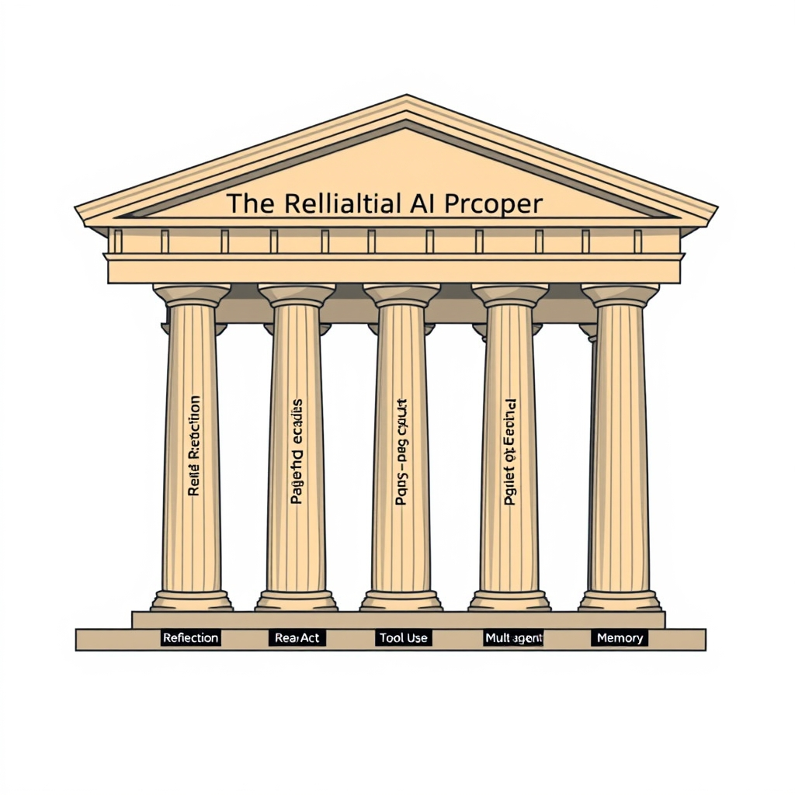
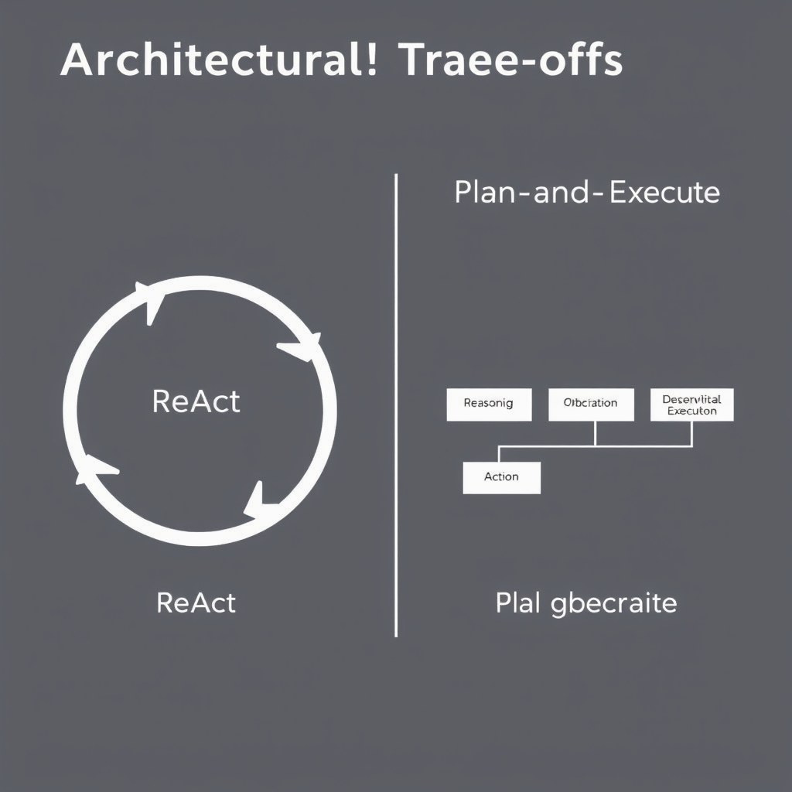
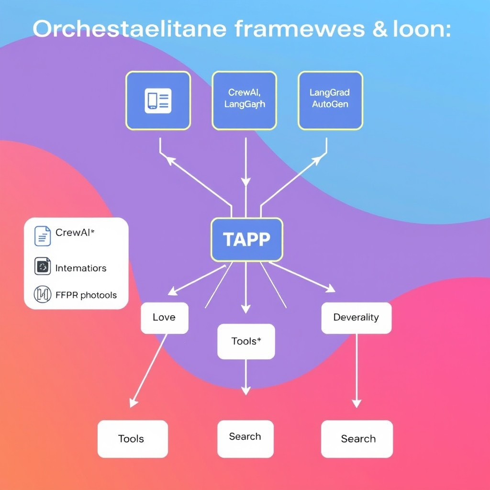

# Beyond Prompting: The 2026 Guide to AI Agent Architectures

## The Shift to Agentic Systems

The early wave of large‑language‑model (LLM) applications relied on a single prompt‑and‑response cycle: the developer supplied a carefully crafted instruction, the model returned text, and the interaction ended. This pattern works for static Q&A or content generation, but it cannot react to new information, invoke external services, or retain context across turns. Autonomous agents extend the LLM core with **reasoning**, **tool use**, and **memory** loops, turning a static generator into a self‑directed system that can plan, act, observe outcomes, and adjust its strategy in real time.

### From Prompting to Autonomy

- **Prompt‑only**: deterministic output, no side‑effects, limited to the knowledge baked into the model.
- **Agentic behavior**: the model decides *what* to do (e.g., query a database, call an API), executes the action, observes the result, and iterates until a goal is satisfied. This closed‑loop workflow reduces hallucinations and enables execution of complex, multi‑step tasks.

### Enterprise Adoption is Accelerating

Gartner predicts that **33 % of enterprise software applications will embed agentic AI by 2028**, up from less than 1 % in 2024【https://www.ideas2it.com/blogs/ai-agent-frameworks】. The surge is driven by the need for automated decision‑making, real‑time data integration, and personalized user experiences that static LLM prompts cannot deliver. Companies are moving from prototype chatbots to production‑grade agents that orchestrate workflows across CRM, ERP, and analytics platforms.

### Core Components of a Modern Agent

1. **Reasoning** – the LLM generates a plan or selects the next action based on the current goal and observations.
1. **Tool Use** – the agent invokes external functions (APIs, databases, code execution) via a standardized interface, turning abstract intent into concrete effect.
1. **Memory** – short‑term or long‑term state storage allows the agent to recall prior steps, user preferences, or domain knowledge, preventing repetitive queries and enabling context‑aware decisions.

### Why Architectural Patterns Matter

Even with reasoning, tool use, and memory, naïve implementations can suffer from flaky tool calls, unbounded loops, or inconsistent state. Structured patterns such as **ReAct** or **Plan‑and‑Execute** impose disciplined loops and clear separation of concerns, turning a powerful but unpredictable LLM into a reliable production component. Establishing these patterns early is essential for scaling agents from proof‑of‑concepts to enterprise‑ready services.

## The Seven Pillars of Agent Design


*The seven pillars of modern agent design provide the structural integrity required to move from experimental chatbots to production-grade autonomous systems.*

### The Seven Pillars of Modern Agent Design

| Pattern                       | Core idea                                                                                                                                         | Typical use case                                                   |
| ----------------------------- | ------------------------------------------------------------------------------------------------------------------------------------------------- | ------------------------------------------------------------------ |
| **Reflection**                | The agent periodically reviews its own reasoning trace, asking *"Did I miss anything?"* before finalizing a response.                             | Complex Q&A where intermediate steps matter.                       |
| **ReAct**                     | A tight loop of **R**eason → **A**ction → **O**bservation, allowing the model to call tools, observe results, and immediately adjust its plan.    | Open‑ended search or troubleshooting where the path is unknown.    |
| **Plan‑and‑Execute**          | Explicit **Plan** phase (task decomposition) followed by a sequential **Execute** phase that runs each sub‑task with its own tool calls.          | Structured workflows such as invoice processing or data pipelines. |
| **Tool Use**                  | Formalized function calls (e.g., OpenAI Function Call Protocol) that let the model invoke external APIs or code without hallucinating parameters. | Retrieval, calculation, or database updates.                       |
| **Multi‑Agent Collaboration** | Multiple specialized agents exchange messages, each handling a subset of the problem (e.g., planner, executor, validator).                        | Large projects requiring parallel expertise.                       |
| **Memory Management**         | Persistent short‑term and long‑term stores (vector stores, key‑value logs) that the agent can read/write across turns.                            | Conversational assistants that need context continuity.            |
| **Human‑in‑the‑Loop**         | The system pauses for explicit human confirmation or correction before committing high‑risk actions.                                              | Safety‑critical domains like finance or healthcare.                |

These seven patterns are identified as the most impactful design choices for AI agents in 2026 [The 7 Design Patterns Every AI Agent Developer Should Know in 2026](https://pub.towardsai.net/the-7-design-patterns-every-ai-agent-developer-should-know-in-2026-c77f28b51565).

#### Solving Hallucination and Reliability

- **Hallucination mitigation** – By grounding decisions in *Tool Use* and *Memory Management*, agents avoid fabricating data. When a model needs a numeric answer, it calls a calculator tool rather than guessing, eliminating the classic LLM hallucination.

- **Reliability through feedback** – *ReAct*’s observation step provides immediate verification of each action, catching errors before they propagate. *Plan‑and‑Execute* adds a deterministic ordering, making the overall workflow auditable. *Human‑in‑the‑Loop* introduces an external sanity check for high‑stakes outputs.

- **Consistency across turns** – Persistent memory ensures that the same premise is not re‑interpreted differently later, a common source of contradictory answers.

Collectively, these patterns shift reliability from prompt engineering to architectural guarantees.

#### Not Mutually Exclusive

In practice, production agents blend several pillars. A typical autonomous assistant might:

1. **Reflect** on its initial plan,
1. **Plan‑and‑Execute** a sequence of tool calls,
1. Use **ReAct** within each sub‑task to adapt to unexpected tool responses,
1. Store intermediate results in **Memory**, and
1. Invoke a **Human‑in‑the‑Loop** checkpoint before committing a financial transaction.

Such hybrid compositions leverage the strengths of each pattern while covering their individual blind spots. The next section will dive deeper into the two most common architectural families—ReAct and Plan‑and‑Execute—to help you decide which core loop fits your use case best.

## Architectural Trade-offs: ReAct vs. Plan-and-Execute

### ReAct Loop: Reasoning → Act → Observe

The ReAct architecture intertwines **reasoning** and **action** in a tight feedback cycle. At each iteration the LLM:


*ReAct (left) uses a tight feedback loop for dynamic tasks, while Plan-and-Execute (right) uses a structured, sequential approach for predictable workflows.*

1. **Generates a reasoning trace** – a natural‑language chain‑of‑thought that explains why a particular tool or API should be invoked.
1. **Selects an action** – typically a function call, web request, or database query, expressed in a structured schema.
1. **Observes the result** – the raw response is fed back into the prompt, allowing the model to refine its hypothesis or terminate.

This loop continues until a stopping condition (e.g., a `DONE` token or a confidence threshold) is met. Because the model can react to unexpected observations, ReAct excels at **open‑ended problems** where the solution path cannot be fully enumerated beforehand. The approach is described in the 2026 MLflow developer guide, which notes that “ReAct combines reasoning and acting in a tight observation feedback loop… fits tasks where the path to a solution is not fully known upfront”【https://mlflow.org/articles/types-of-ai-agent-architectures-2026-developer-guide】.

### Plan‑and‑Execute Workflow: Decompose → Execute Sequentially

Plan‑and‑Execute separates the problem‑solving process into two distinct phases:

1. **Planning** – The LLM receives the original user request and produces a **structured plan** (often a numbered list or DAG) that outlines sub‑tasks, required tools, and execution order.
1. **Execution** – An orchestrator iterates over the plan, invoking each tool in sequence. After each step the orchestrator captures the output and, if necessary, feeds it back to the LLM for **plan refinement** before proceeding to the next step.

Because the plan is generated **once** (or only when a deviation is detected), this pattern shines for **structured, predictable workflows** such as data pipelines, report generation, or multi‑step form filling. The same MLflow guide states that “Plan‑Execute separates planning from execution into two explicit phases… works well for structured workflows.”【https://mlflow.org/articles/types-of-ai-agent-architectures-2026-developer-guide】

### Decision Matrix

| Criterion               | ReAct (Reason‑Act‑Observe)                                    | Plan‑and‑Execute (Decompose‑Execute)                            |
| ----------------------- | ------------------------------------------------------------- | --------------------------------------------------------------- |
| **Task predictability** | Low – model decides next action on‑the‑fly                    | High – plan defines fixed sequence                              |
| **Tool usage pattern**  | Frequent, opportunistic calls; can adapt to new tools mid‑run | Batch of calls defined up‑front; tool set static per plan       |
| **Error handling**      | Immediate observation allows rapid correction                 | Errors detected after a step; may require re‑planning           |
| **Latency**             | Potentially higher due to repeated LLM calls per step         | Lower overall latency once plan is built                        |
| **Best‑fit scenarios**  | Creative problem solving, troubleshooting, exploratory QA     | Data extraction pipelines, report generation, compliance checks |

Developers can use this matrix to match their use case characteristics to the appropriate architecture.

### Minimal ReAct Loop Implementation (Python)

Below is a concise example that demonstrates the core ReAct cycle using OpenAI’s function‑calling API. The snippet abstracts the loop into a `react_step` helper and runs until the model signals completion.

```python
import openai
import json

# Define a simple tool schema – e.g., a web‑search function
search_tool = {
    "name": "web_search",
    "description": "Search the web for a query and return the top result.",
    "parameters": {
        "type": "object",
        "properties": {"query": {"type": "string", "description": "Search terms"}},
        "required": ["query"]
    },
}

# ReAct loop
def react_step(messages):
    response = openai.ChatCompletion.create(
        model="gpt-4o-mini",
        messages=messages,
        functions=[search_tool],
        function_call="auto",
    )
    msg = response.choices[0].message
    # If the model decided to call a function
    if msg.get("function_call"):
        func_name = msg["function_call"]["name"]
        args = json.loads(msg["function_call"]["arguments"])
        # Mock tool execution – replace with real API call
        observation = f"Result for '{args['query']}'"
        # Append observation for next iteration
        messages.append({"role": "assistant", "content": None, "function_call": msg["function_call"]})
        messages.append({"role": "function", "name": func_name, "content": observation})
        return messages, False
    # Otherwise the model has produced a final answer
    messages.append({"role": "assistant", "content": msg["content"]})
    return messages, True

# Initial user request
conversation = [{"role": "user", "content": "Find the latest AI conference in Berlin and give me the registration link."}]

finished = False
while not finished:
    conversation, finished = react_step(conversation)

print(conversation[-1]["content"])  # Final answer
```

**Key points of the example**:

- The LLM decides whether to call `web_search` or to output a final answer.
- Each function call’s result is appended as a **function message**, which the model observes on the next turn.
- The loop terminates when the model returns a plain `assistant` message without a `function_call`.

### When to Choose Which Architecture

- **Pick ReAct** when the problem space is **dynamic**: the agent must explore, backtrack, or incorporate unexpected data (e.g., troubleshooting a failing API, interactive tutoring).
- **Pick Plan‑and‑Execute** when the workflow can be **pre‑mapped**: tasks have clear dependencies and the cost of re‑planning outweighs the benefit of on‑the‑fly decisions (e.g., ETL pipelines, multi‑step form automation).

By aligning the architectural choice with task characteristics, developers can avoid common pitfalls such as excessive latency (over‑using ReAct on a deterministic pipeline) or brittle failures (forcing Plan‑and‑Execute on an exploratory query). This disciplined selection is a cornerstone of building **reliable, production‑grade AI agents**.

## Orchestration Frameworks and Interoperability

### Comparing Leading Orchestration Frameworks

| Framework     | Core Strength                                                           | Multi‑agent Support                                                            | Tool Integration Model                                                                           |
| ------------- | ----------------------------------------------------------------------- | ------------------------------------------------------------------------------ | ------------------------------------------------------------------------------------------------ |
| **CrewAI**    | Declarative workflow DSL that emphasizes human‑in‑the‑loop supervision. | Built‑in coordination primitives for up to dozens of agents.                   | Relies on OpenAI‑style function calls; can be wrapped with custom adapters.                      |
| **LangGraph** | Graph‑based composition where nodes are LLM calls or tool invocations.  | Native graph traversal enables dynamic spawning of sub‑agents.                 | Provides a thin abstraction layer that maps directly to the **Tool Abstraction Protocol (TAP)**. |
| **AutoGen**   | Auto‑generation of agent scaffolding from high‑level specifications.    | Focuses on peer‑to‑peer communication patterns (e.g., chat‑based negotiation). | Uses the **Function Call Protocol (FCP)** to enforce JSON‑schema‑validated tool calls.           |


*Standardized protocols like TAP and FCP act as a middleware layer, allowing different orchestration frameworks to interact with a common set of tools.*

*Sources: CrewAI, LangGraph, AutoGen are listed among the top frameworks in 2026*【https://www.instaclustr.com/education/agentic-ai/agentic-ai-frameworks-top-10-options-in-2026】.

### Tool Abstraction Protocol (TAP) and Function Call Protocol (FCP)

- **TAP** defines a JSON schema that describes a tool’s name, input parameters, and execution semantics. By decoupling *what* a tool does from *how* it is invoked, TAP lets any compliant framework (e.g., LangGraph) swap out a database query, a web‑scraper, or a proprietary API without changing the agent logic.
- **FCP**, popularized by OpenAI, enforces function signatures at the model‑output stage. The LLM must emit a structured call that matches the declared schema, guaranteeing that the downstream executor receives well‑formed arguments.

Both protocols aim to eliminate the ad‑hoc string‑parsing that plagued early agents and to provide a contract that can be validated before execution. This reduces hallucination‑induced failures and simplifies debugging across heterogeneous toolsets.

*Evidence on emerging standards*【https://www.ssonetwork.com/intelligent-automation/columns/ai-agent-protocols-10-modern-standards-shaping-the-agentic-era】.

### Why Standardized Protocols Matter for Multi‑Agent Ecosystems

1. **Interoperability** – When agents built with CrewAI need to call a tool originally authored for LangGraph, a shared protocol (TAP/FCP) ensures the request is understood without custom adapters.
1. **Reliability** – Schemas act as a guardrail; malformed calls are rejected early, preventing cascading errors in downstream agents.
1. **Observability** – Uniform request/response formats make logging and tracing consistent, a prerequisite for production monitoring.
1. **Vendor Neutrality** – Teams can migrate between LLM providers (OpenAI, Anthropic, Gemini) without rewriting tool‑call logic, because the protocol sits above the model layer.

### Cost and Performance Implications of Complex Orchestration

- **Latency Overhead** – Each additional orchestration layer (e.g., a graph engine in LangGraph) introduces network hops and serialization costs. In latency‑sensitive use cases (real‑time decision support), a lightweight framework like CrewAI may be preferable.
- **Compute Billing** – Multi‑agent loops can trigger many LLM calls. Frameworks that support *batching* of tool invocations (AutoGen’s peer‑to‑peer mode) can reduce token consumption.
- **Resource Management** – Sophisticated schedulers (available in LangGraph) allow dynamic scaling of agent workers, but they also require more infrastructure (Kubernetes pods, message queues), raising operational expense.
- **Scalability Trade‑off** – While AutoGen’s auto‑generation accelerates development, the generated orchestration code may be less optimized than hand‑crafted pipelines, leading to higher CPU usage at scale.

Balancing these factors often comes down to the target workload: for exploratory prototypes, the convenience of AutoGen outweighs cost; for enterprise‑grade pipelines, CrewAI’s lean runtime and explicit TAP contracts deliver predictable performance.

______________________________________________________________________

*The Gartner forecast that 33 % of enterprise software will embed agentic AI by 2028 underscores the strategic importance of choosing a framework that can scale reliably*【https://www.ideas2it.com/blogs/ai-agent-frameworks】.

## Building for the Future of Autonomy

### Choosing the Right Pattern Beats Picking the Biggest Model

The most common mistake when building an AI agent is to assume that a larger language model automatically solves reliability problems. In practice, the architectural pattern you adopt—whether ReAct, Plan‑and‑Execute, or a memory‑augmented loop—has a far greater impact on predictability and cost. A modest‑sized model wired through a well‑designed ReAct loop can outperform a massive model that merely receives a static prompt because the loop provides continuous observation, error correction, and tool invocation.

### Reliability Is a Design Discipline

Prompt engineering is still useful, but it is only the surface layer of a robust system. Reliability emerges from explicit design choices: clear separation of reasoning and acting, deterministic planning phases, and disciplined memory management. By encoding these concerns in code rather than in a prompt, developers gain version‑controlled, testable components that can be monitored, logged, and iteratively improved.

### Experiment with Multi‑Agent Collaboration

Complex workflows—such as end‑to‑end data pipelines, multi‑step customer support, or autonomous research assistants—often exceed the capacity of a single agent. The **Multi‑Agent Collaboration** pattern lets you decompose a problem into specialized agents (e.g., a retrieval agent, a synthesis agent, and a verification agent) that communicate through standardized protocols like TAP or the Function Call Protocol. Even a simple prototype that swaps a single ReAct agent for a pair of cooperating agents can reveal hidden bottlenecks and open pathways to scalability.

### From Prototype to Production‑Grade

The field is moving quickly from proof‑of‑concept notebooks to enterprise‑ready services. To make that leap, developers should:

1. **Select a pattern that matches the task’s predictability** – open‑ended research favors ReAct; structured business processes benefit from Plan‑and‑Execute.
1. **Embed observability** – log each reasoning step, tool call, and observation to enable rapid debugging.
1. **Adopt interoperable standards** – using TAP or FCP ensures that future tools can be swapped without rewriting agent logic.
1. **Iterate with multi‑agent setups** – start with a single agent, then layer additional agents as the workflow matures.

By grounding autonomy in solid architectural patterns rather than raw model size, developers can build AI agents that are not only clever but also dependable, maintainable, and ready for the production demands of tomorrow’s enterprise software.