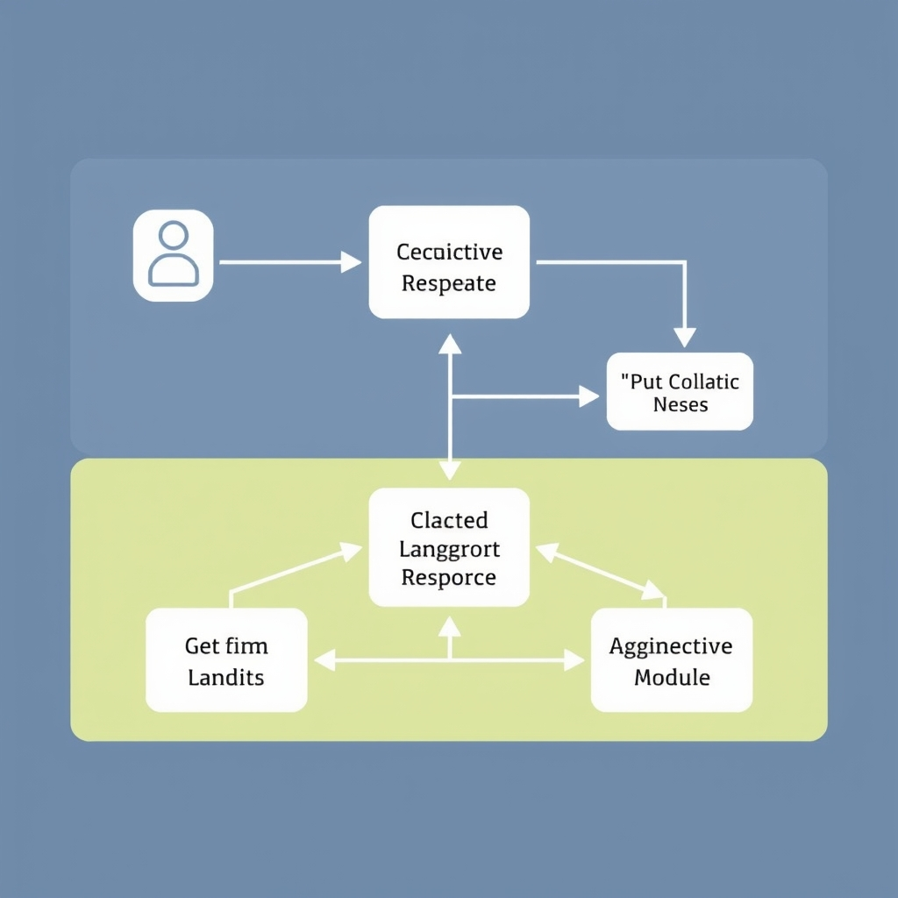
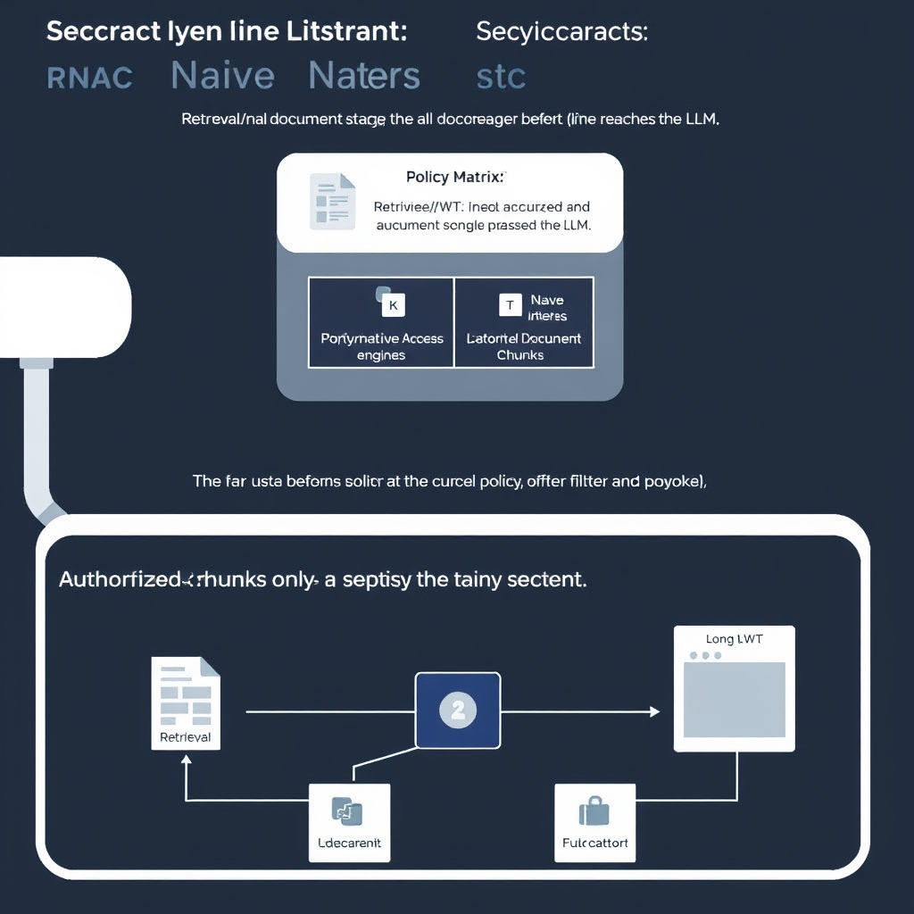
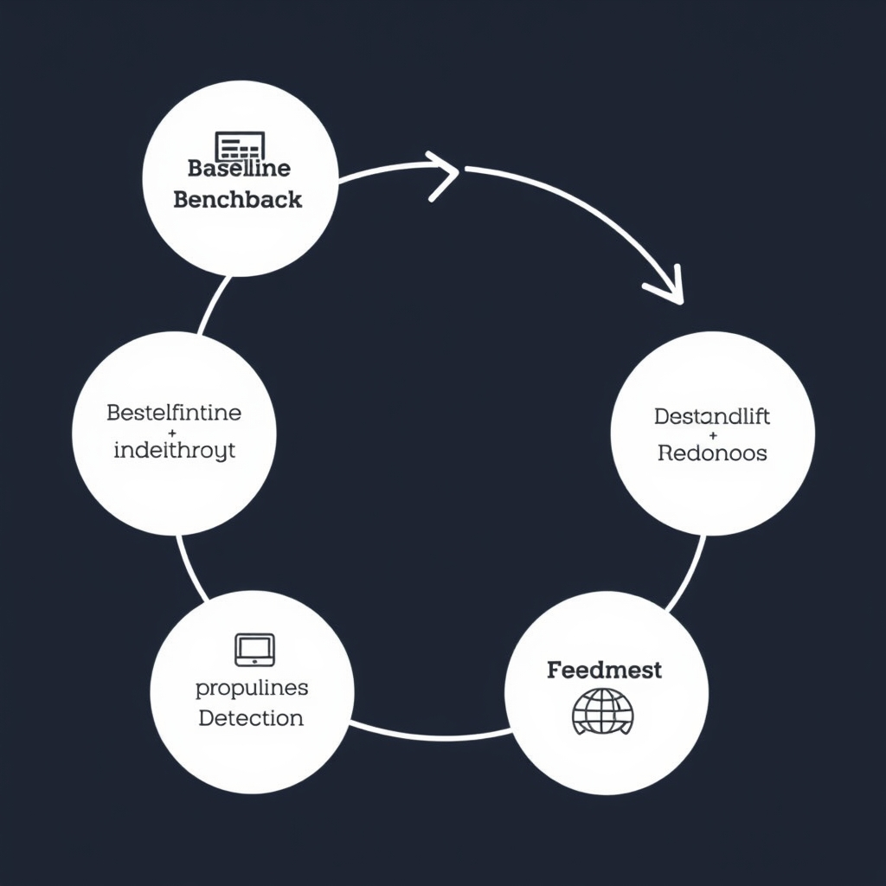

# Beyond Prototypes: Architecting Production-Grade Enterprise RAG in 2026

## The Evolution of the Enterprise RAG Stack

The enterprise RAG landscape has converged on a **compositional architecture** that treats retrieval, orchestration, and evaluation as interchangeable, replaceable services rather than a monolithic pipeline. This shift is driven by three practical pressures:

*The 2026 enterprise RAG stack: a compositional architecture where retrieval, orchestration, and evaluation are decoupled, modular services.*

- **Scalability** – isolated components can be horizontally scaled or swapped without rewriting the entire stack.
- **Maintainability** – teams can own distinct service contracts (e.g., a retrieval team vs. an orchestration team) and iterate independently.
- **Governance** – security, compliance, and observability hooks can be injected at well‑defined boundaries.

______________________________________________________________________

### From Monolith to Modular, Agentic Systems

Early RAG prototypes bundled vector stores, prompt templates, and LLM calls into a single script. While fast for proof‑of‑concepts, such monoliths suffered from:

- **Tight coupling** – any change to the vector index required a full redeploy of the LLM logic.
- **Limited observability** – tracing a single request across retrieval, reasoning, and generation was cumbersome.
- **Poor reuse** – the same retrieval logic could not be shared across multiple downstream agents.

Modern stacks replace the monolith with **agentic modules** that expose clean APIs. A retrieval agent answers *"Which documents are relevant?"*; an orchestration agent decides *"How should those documents be combined with the LLM?"*; an evaluation agent measures *"How faithful is the answer?"*. This decomposition mirrors micro‑service design and enables enterprise‑grade SLAs.

______________________________________________________________________

### LlamaIndex: The Retrieval Backbone

LlamaIndex (formerly GPT Index) has become the de‑facto retrieval layer for large‑scale deployments. Its strengths include:

- **Connector ecosystem** – native adapters for SQL, NoSQL, cloud storage, and enterprise document management systems (e.g., SharePoint, Confluence).
- **Hybrid indexing** – supports dense vector, sparse BM25, and metadata‑driven filters in a single index, allowing fine‑grained retrieval policies.
- **Extensible node parsers** – developers can inject custom chunkers for domain‑specific formats such as legal contracts or medical records.

Because LlamaIndex abstracts the underlying store, enterprises can swap a self‑hosted Faiss cluster for a managed Pinecone service without touching downstream code.

______________________________________________________________________

### LangChain & LangGraph: Orchestration & Agentic Flow

Once relevant passages are retrieved, the next challenge is **orchestrating** how they interact with the LLM. LangChain provides a library of **chains** (sequential, conditional, and looped) that can be composed programmatically. LangGraph extends this model with a **graph‑based DSL**, enabling:

- **Dynamic branching** – routes based on retrieval confidence scores or user intent.
- **Stateful agents** – maintain conversation context across multiple retrieval‑generation cycles.
- **Tool integration** – invoke external APIs (e.g., CRM look‑ups) as part of the reasoning loop.

Together, LangChain and LangGraph give enterprises the flexibility to build **agentic workflows** that adapt to regulatory checks, cost‑optimisation policies, or real‑time user feedback.

______________________________________________________________________

### RAGAS & LangSmith: Closing the Evaluation Loop

Production RAG must be continuously validated. **RAGAS** (Retrieval‑Augmented Generation Assessment Suite) offers a suite of metrics—faithfulness, relevance, and answer completeness—computed against a held‑out benchmark set. **LangSmith** complements this by providing:

- **End‑to‑end tracing** – visualises each step from retrieval through LLM inference to final answer.
- **Automated regression testing** – flags drift when model updates or index re‑builds degrade performance.
- **Dashboarding** – aggregates metric trends for governance teams.

Embedding RAGAS and LangSmith into the CI/CD pipeline ensures that any architectural change (e.g., swapping LlamaIndex for a new vector DB) is immediately measured against the **0.85 faithfulness threshold** that production‑grade systems now target.

______________________________________________________________________

### The Current Enterprise Stack (2026)

> *"For most serious enterprise deployments in 2026, the winning pattern is LlamaIndex for retrieval + LangChain/LangGraph for orchestration + RAGAS or LangSmith for evaluation."* [[LlamaIndex Enterprise Architecture Whitepaper]](https://docs.llamaindex.ai/en/stable/enterprise/architecture) and [[LangChain Production Guide]](https://docs.langchain.com/docs/production)

By adhering to this compositional blueprint, organizations gain the agility to evolve individual components while preserving the security, compliance, and performance guarantees demanded by production workloads.

## Securing the Pipeline: Retrieval-Native Access Control

### Retrieval‑Native Access Control

Retrieval‑native access control (RNAC) moves permission enforcement **into the search layer**. Instead of returning a raw vector‑based hit list that is later trimmed, the retrieval engine evaluates the requesting user’s identity, role attributes, and the document‑level policy **before** any augmentation or LLM prompt construction. This guarantees that only authorized content ever reaches the generative component, eliminating a whole class of leakage vectors.

*Retrieval-Native Access Control (RNAC) enforces security at the index level, preventing unauthorized data from ever entering the LLM context.*

> "Retrieval‑native access control has emerged as the preferred security model in 2026. It operates directly within the retrieval engine, ensuring each search result is filtered by user identity, attributes, and document‑level policies before augmentation occurs" \[[Kiteworks](https://www.kiteworks.com/cybersecurity-risk-management/rag-pipeline-security-best-practices)\].

### Why Post‑Retrieval Filtering Is Risky

A naïve pipeline retrieves a superset of documents, then applies a policy filter in application code. This approach suffers from three critical weaknesses:

1. **Transient exposure** – the full result set resides in memory or logs, potentially accessible to privileged processes or compromised containers.
1. **Timing attacks** – an attacker can infer the existence of restricted documents by measuring response latency differences between filtered and unfiltered queries.
1. **Inconsistent enforcement** – disparate services may implement policy checks differently, leading to gaps where a document slips through.

By contrast, RNAC eliminates the intermediate, unrestricted result set, ensuring that unauthorized documents never leave the retrieval index.

### Integrating Identity and Document Policies

Modern retrieval back‑ends (e.g., Elasticsearch, Vespa, or vector stores with built‑in security layers) expose a **policy evaluation hook**. The typical flow is:

1. The client presents a JWT or SSO token containing user ID, groups, and clearance level.
1. The retrieval engine extracts these claims and matches them against a **policy matrix** stored alongside each document’s metadata (e.g., `owner_id`, `allowed_roles`, `sensitivity`).
1. Only documents whose policy predicates evaluate to true are returned as candidate chunks for augmentation.

This integration can be expressed declaratively using a policy language such as Open Policy Agent (OPA) or a simple rule engine embedded in the index. The result is a single, auditable decision point that aligns with zero‑trust principles.

### Preventing Data Leakage in Multi‑Tenant Deployments

Enterprises often host multiple business units or external partners on a shared RAG platform. RNAC safeguards these environments by:

- **Tenant isolation**: each tenant’s documents carry a `tenant_id` tag; the retrieval query automatically scopes results to the caller’s tenant context.
- **Dynamic attribute checks**: attributes like `region` or `compliance_level` are evaluated per request, preventing cross‑region data spill.
- **Audit trails**: because the filter runs inside the engine, every allowed/denied decision can be logged with immutable metadata, supporting forensic analysis.

Implementing RNAC therefore transforms the retrieval stage from a performance‑only component into a **governed security gate**, a prerequisite for moving RAG from experimental sandboxes to production‑grade enterprise services.

## Compliance and Sovereignty in Regulated Sectors

The EU AI Act, which entered full force on 2 August 2026, reshapes how enterprises can expose generative AI services. Its core provisions—risk‑based classification, mandatory documentation, and strict data‑governance obligations—apply directly to Retrieval‑Augmented Generation (RAG) pipelines because the model ingests and emits proprietary or regulated content. Non‑compliant deployments risk fines up to 6 % of global turnover, making compliance a non‑negotiable design constraint.

### Platform choices for a compliant stack

| Platform                | Deployment model                       | Key compliance features                                                      |
| ----------------------- | -------------------------------------- | ---------------------------------------------------------------------------- |
| **SphereIQ**            | Self‑hosted (on‑prem or private cloud) | End‑to‑end audit logs, policy‑driven indexing, built‑in EU AI Act checklists |
| **Haystack Enterprise** | Self‑hosted (Docker/Kubernetes)        | Data residency controls, role‑based access, model‑explainability hooks       |
| **Cohere North**        | Hybrid (private‑cloud option)          | Automated impact‑assessment templates, encrypted vector stores               |

These solutions are highlighted in the 2026 enterprise RAG landscape as the only offerings that separate themselves from generic cloud‑native services by providing **compliance‑native** capabilities such as immutable provenance records and configurable data‑retention policies.

### Why data residency and control matter

Regulated sectors—finance, healthcare, and public administration—must keep personally identifiable information (PII) and sensitive operational data within defined geographic boundaries. The EU AI Act couples this requirement with *data‑governance transparency*: every document used for retrieval must be traceable to its source, and any transformation performed by the RAG pipeline must be logged. Self‑hosted platforms enable organizations to:

- **Enforce jurisdictional storage** by locating vector databases in EU‑approved data centers.
- **Apply fine‑grained policies** that restrict which model endpoints can access specific document collections.
- **Perform on‑prem audit** without relying on third‑party telemetry, satisfying both GDPR and AI Act documentation clauses.

### Cloud‑native vs. sovereign‑ready deployments

| Aspect                 | Cloud‑native (public SaaS)                                            | Sovereign‑ready (self‑hosted)                                                  |
| ---------------------- | --------------------------------------------------------------------- | ------------------------------------------------------------------------------ |
| **Control plane**      | Managed by provider; limited visibility into indexing pipelines.      | Full ownership of indexing, retrieval, and model serving layers.               |
| **Data residency**     | Often multi‑region; may conflict with jurisdictional mandates.        | Explicit placement in chosen sovereign zones.                                  |
| **Compliance updates** | Provider‑driven; lag can expose gaps with evolving regulations.       | In‑house patching; organization can align updates with audit cycles.           |
| **Scalability**        | Elastic scaling on demand, but at cost of opaque resource allocation. | Scalable via private Kubernetes clusters, with predictable compliance posture. |

While cloud‑native services excel in speed of provisioning, they typically expose only *post‑retrieval* controls, leaving the retrieval engine itself vulnerable to policy violations. Sovereign‑ready stacks embed access control and audit hooks directly into the vector store and retrieval middleware, ensuring that **only authorized documents ever enter the model context**.

### Practical steps for regulated adopters

1. **Select a compliance‑native platform** (e.g., SphereIQ or Haystack Enterprise) that offers self‑hosting and built‑in EU AI Act checklists.
1. **Map data residency requirements** to the physical location of vector indexes and model weights.
1. **Implement policy‑driven ingestion**: tag each document with jurisdiction, sensitivity level, and retention schedule before indexing.
1. **Integrate automated impact assessments** into the CI/CD pipeline, leveraging the platform’s compliance APIs to generate audit artifacts for every RAG release.
1. **Continuously monitor** provenance logs and vector‑store access patterns to detect drift from the declared compliance posture.

By aligning architecture choices with the EU AI Act’s mandates and leveraging self‑hosted, sovereign‑ready platforms, enterprises can transition RAG from experimental labs to production environments that satisfy the most stringent regulatory expectations.

## Quantifying Success: Benchmarks and Faithfulness

### Standard Benchmarks for Enterprise RAG

The community has converged on a handful of open‑source suites that let teams compare retrieval‑augmented pipelines on a common yardstick. The most widely referenced are:

- **RAGBench** – a general‑purpose benchmark that pairs a diverse document corpus with multi‑choice questions to stress both retrieval relevance and generation quality. [Source](https://labelyourdata.com/articles/llm-fine-tuning/rag-evaluation)
- **LegalBench‑RAG** – focuses on legal‑domain QA, measuring how well a system extracts statutes, case law, and contractual language before generating an answer. [Source](https://labelyourdata.com/articles/llm-fine-tuning/rag-evaluation)
- **CRAG** – emphasizes contextual relevance by requiring the model to answer questions that depend on multiple, non‑contiguous passages.
- **WixQA** – a web‑scale QA benchmark that tests scalability of retrieval across millions of pages.
- **T²‑RAGBench** – evaluates multi‑turn, task‑oriented interactions, useful for conversational assistants.

These suites report a set of metrics—recall@k, exact‑match, BLEU/ROUGE, and, crucially, **faithfulness** scores derived from human‑in‑the‑loop verification.

______________________________________________________________________

### The 0.85 Faithfulness Threshold

For regulated enterprises, a faithfulness score **≥ 0.85** has become the de‑facto production gate. Scores below this level correlate with hallucination rates that exceed tolerable limits for auditability and legal liability. The threshold is supported by findings in the RAGAS benchmark paper, which observed that a faithfulness score of 0.85 corresponds to hallucination probabilities under 5 % on enterprise‑like workloads [RAGAS paper](https://arxiv.org/abs/2305.14223) and the official RAGAS documentation [RAGAS docs](https://github.com/explodinggradients/ragas).

Achieving this target typically requires:

1. **High‑quality retrieval** – top‑k documents must contain the answer with > 90 % recall.
1. **Prompt engineering** – explicit grounding instructions (e.g., *"cite the source paragraph"*).
1. **Post‑generation verification** – using models like RAGAS or LangSmith to flag low‑faithfulness outputs before they reach the user.

______________________________________________________________________

### Hallucination, Faithfulness, and Explainability

Hallucination is the symptom; faithfulness is the measurable cause. When a model generates content not grounded in retrieved evidence, the faithfulness score drops, and the system’s explainability suffers because there is no provenance to surface. Enterprises therefore treat the **faithfulness‑explainability link** as a single risk vector:

- **Low faithfulness → higher hallucination → weaker traceability → regulatory non‑compliance.**
- **High faithfulness → clear citation paths → audit‑ready explanations.**

Monitoring both metrics in tandem lets operators set alerts (e.g., *faithfulness < 0.85 for three consecutive batches*) and trigger fallback mechanisms such as human review.

______________________________________________________________________

### Roadmap for Continuous Performance Monitoring

1. **Baseline Establishment** – Run the chosen benchmark suite on the production stack and record all metrics, especially faithfulness.
1. **Automated Ingestion** – Integrate a monitoring agent (e.g., LangSmith) that logs per‑query scores and stores provenance data.
1. **Threshold Alerts** – Configure alerts for deviations: faithfulness \< 0.85, recall@k \< 0.9, or hallucination spikes > 5 %.
1. **Periodic Re‑Benchmarking** – Quarterly re‑run of RAGBench/LegalBench‑RAG to capture drift from data updates or model upgrades.
1. **Feedback Loop** – Feed flagged low‑faithfulness cases back into the training pipeline (fine‑tuning or retrieval index refinement).
1. **Governance Dashboard** – Provide stakeholders with a live view of key KPIs, audit logs, and compliance attestations.

By institutionalizing this loop, enterprises move RAG from a sandbox experiment to a production‑grade service that meets both performance expectations and regulatory scrutiny.

*The continuous performance monitoring loop: institutionalizing faithfulness checks to ensure production-grade reliability.*