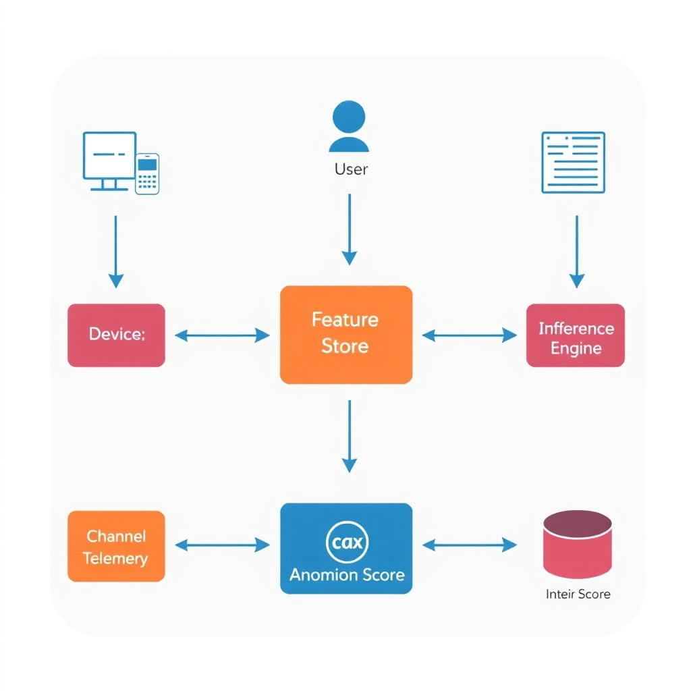
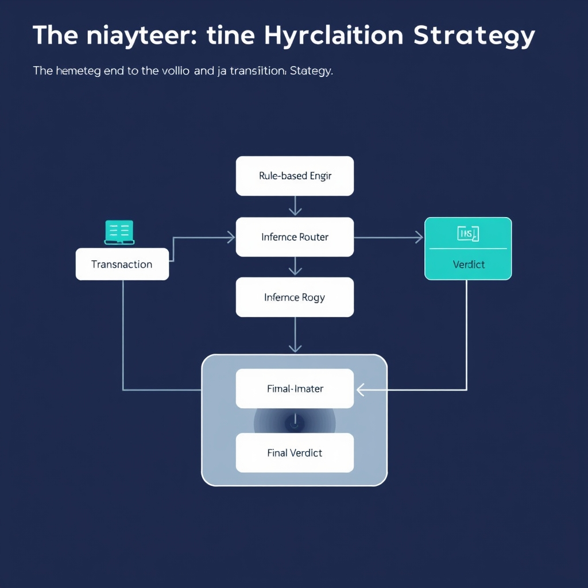
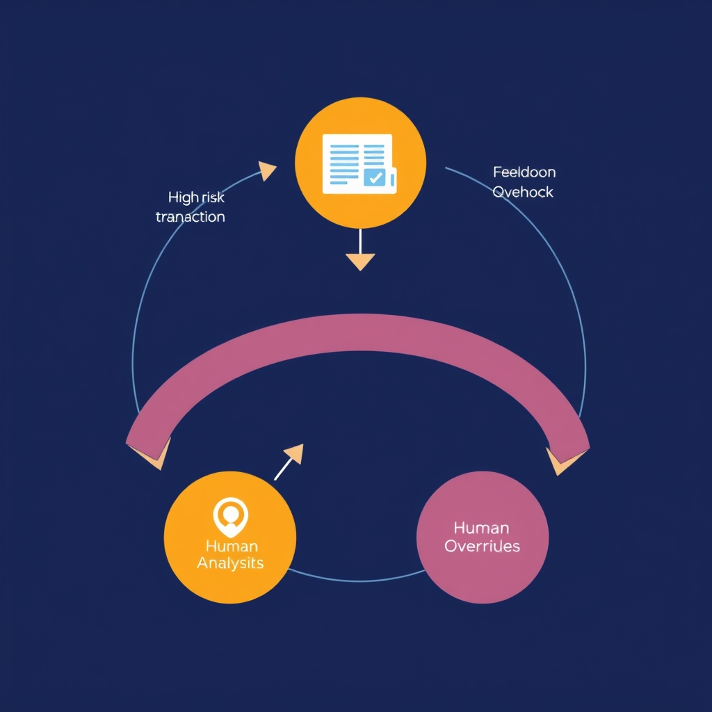

# Beyond Rules: Architecting Real-Time AI Fraud Detection in 2026

## The New Frontline: Industrialized Fraud

In 2026, fraud inflicted an estimated **$579.4 billion** loss worldwide, with scam‑related losses climbing at a 19.3 % compound annual rate【https://sphinxhq.com/blog-posts/best-fraud-detection-platforms】. This staggering figure underscores a rapid escalation in both volume and sophistication of attacks, outpacing the defensive capacities of many legacy systems.

### From Human‑Led Schemes to Autonomous Agentic AI

Traditional fraud operations relied on human actors to manually harvest credentials, craft phishing messages, or execute transaction‑level manipulations. Today, **Agentic AI**—self‑directed machine agents—can autonomously navigate banking onboarding flows, answer security challenges, and orchestrate multi‑step attacks without human oversight【https://www.ozforensics.com/blog/articles/fraud-trends-2026-countering-the-industrialization-of-attack-vectors】. These agents leverage large language models and reinforcement‑learning policies to adapt in real time, dramatically reducing the time‑to‑exploit and expanding the attack surface.

### How Agentic AI Bypasses Conventional Verification

- **Dynamic form filling**: AI agents parse registration pages, extract required fields, and generate plausible personal data, sidestepping static validation rules.
- **Adaptive challenge response**: By interpreting CAPTCHA images or security questions via vision and language models, agents can satisfy verification steps that were once considered human‑only barriers.
- **Channel hopping**: Agents switch between web, mobile, and API channels, exploiting inconsistencies in verification logic across platforms.

These capabilities allow fraudsters to **bypass traditional onboarding and verification flows** that were designed for predictable, human‑driven interactions【https://www.ozforensics.com/blog/articles/fraud-trends-2026-countering-the-industrialization-of-attack-vectors】.

### Why Static Rule‑Based Systems Are Falling Behind

Rule‑based engines depend on predefined thresholds (e.g., transaction amount > $10,000) and deterministic patterns. In a landscape where AI agents can **modify their behavior within milliseconds**, static thresholds become obsolete. Moreover, rule sets require continuous manual updates—a process that cannot match the velocity of autonomous attacks. As Protegrity notes, “fraud moves too fast for static thresholds and legacy rules; security leaders must shift to continuous behavioral intelligence”【https://www.protegrity.com/resources/blog/ai-fraud-detection-in-2026-what-leaders-must-know】.

The convergence of massive financial loss, autonomous AI adversaries, and the inadequacy of static defenses creates an urgent imperative: financial institutions must move beyond rule‑based detection toward real‑time, behavior‑driven architectures.

## Architecting Behavioral Intelligence

### Defining Behavioral Intelligence

Behavioral intelligence (BI) treats every interaction—clicks, keystrokes, device fingerprints, network hops—as a data point that feeds a continuously updated model of "normal" activity. Unlike static rule sets that trigger only when a predefined condition is met (e.g., transaction amount > $10,000), BI evaluates the *context* of each event in real time. A BI engine learns that a particular user typically logs in from a mobile device in a specific geographic region, performs transactions under a narrow time window, and rarely switches payment methods. When any of these dimensions deviate, the model assigns an anomaly score that can be acted upon instantly.


*The behavioral intelligence architecture: telemetry streams are normalized in a feature store before being processed by a low-latency inference engine.*

### Static Thresholds vs. Dynamic Anomaly Detection

| Aspect                     | Static Thresholds                                                 | Dynamic Anomaly Detection                                                                  |
| -------------------------- | ----------------------------------------------------------------- | ------------------------------------------------------------------------------------------ |
| **Decision Basis**         | Fixed numeric limits (e.g., amount > $5k).                        | Probabilistic score derived from multi‑dimensional behavior.                               |
| **Adaptability**           | Requires manual rule updates; lagging behind new attack patterns. | Continuously retrains on fresh data; adapts to evolving user habits.                       |
| **False‑Positive Profile** | High for edge‑case legitimate behavior; low for novel fraud.      | Balances risk by weighting deviation severity; reduces noise through contextual weighting. |
| **Operational Overhead**   | Rule authoring and maintenance dominate effort.                   | Model monitoring and drift detection replace rule churn.                                   |

Static thresholds excel at simple, well‑understood risks but crumble when autonomous AI agents execute rapid, low‑value transactions that stay under any hard limit. Dynamic anomaly detection, by contrast, can flag a sequence of micro‑transactions that collectively indicate a coordinated attack, even if each individual transaction appears benign.

### Integrating Device, User, and Channel Telemetry

A robust BI architecture ingests three primary telemetry streams:

1. **Device Telemetry** – hardware identifiers, OS version, sensor data, and browser fingerprints. For example, a sudden switch from a known iOS device to an emulated Android environment can raise a device‑risk flag.
1. **User Telemetry** – login patterns, navigation paths, typing cadence, and biometric signals. A user who normally types at 250 wpm but suddenly submits a form at 50 wpm may be an automated script.
1. **Channel Telemetry** – API endpoint usage, network latency, geo‑IP, and VPN detection. An AI‑driven fraud bot that tunnels through multiple proxies to obscure origin will generate atypical latency spikes across channels.

These streams converge in a feature‑store that normalizes and enriches raw events. Feature engineering often includes rolling aggregates (e.g., average transaction amount over the past 24 h) and cross‑entity relationships (e.g., device‑user‑channel co‑occurrence matrices). The enriched dataset feeds the BI model, enabling it to spot subtle, multi‑vector anomalies that would be invisible to siloed rule checks.

### The Need for Low‑Latency Inference Engines

Fraud decisions must be made within milliseconds to avoid disrupting legitimate user flows. Low‑latency inference is achieved through:

- **Edge‑Optimized Model Serving** – Deploying lightweight models on inference nodes close to the transaction gateway reduces network round‑trip time.
- **Model Quantization & Pruning** – Techniques that shrink model size (e.g., 8‑bit quantization) while preserving predictive power, allowing sub‑10 ms latency on commodity CPUs.
- **Streaming Feature Pipelines** – Real‑time data processing frameworks (e.g., Apache Flink or Kafka Streams) that compute features on the fly, eliminating batch delays.

Consider a scenario where a new account attempts a high‑value transfer immediately after registration. The BI engine must ingest the device fingerprint, evaluate the user’s onboarding behavior, and cross‑reference channel risk—all within the sub‑100 ms window typical for payment APIs. If the inference engine cannot meet this latency, the system either blocks legitimate traffic (hurting conversion) or lets the fraud slip through.

### Putting It All Together

Transitioning to behavioral intelligence involves re‑architecting the fraud detection stack around three pillars:

1. **Continuous Modeling** – Replace static rule tables with models that ingest streaming telemetry and output anomaly scores in real time.
1. **Telemetry Fusion** – Build a unified data layer that aggregates device, user, and channel signals, enabling multi‑dimensional context.
1. **Low‑Latency Serving** – Deploy inference infrastructure capable of sub‑50 ms decision latency to keep pace with modern, AI‑driven attack speeds.

By embracing these principles, financial institutions can move from reactive rule enforcement to proactive, behavior‑driven defense—essential for countering the industrialized fraud landscape described in the preceding section.

## Implementation: The Hybrid Transition Strategy

### Shadow Mode: Silent Validation of AI Efficacy

Shadow mode runs the new AI model **in parallel** with the production rule‑based engine, but its decisions never affect the live transaction flow. Instead, the AI’s output is logged alongside the rule outcome for offline analysis. This approach provides a risk‑free window to measure:


*Hybrid deployment: the decision router evaluates both rule-based and AI outputs, allowing for safe shadow-mode validation.*

- **Detection lift** – how many additional fraudulent events the AI flags compared to static rules.
- **False‑positive impact** – whether the AI introduces noise that would degrade customer experience.
- **Latency profile** – real‑time inference times under production load.

Because the AI operates on live traffic without influencing outcomes, teams can collect statistically significant performance metrics before committing to a cut‑over.

### Running Rule‑Based and AI Models Concurrently

A hybrid deployment keeps the legacy rule engine active while the AI model evaluates the same input data. The typical pipeline looks like this:

1. **Ingestion** – Transaction, device, and channel telemetry are streamed to a unified event bus.
1. **Parallel Scoring**
   - **Rule Engine** applies static thresholds and deterministic checks.
   - **AI Service** performs real‑time behavioral scoring using a low‑latency inference server.
1. **Decision Router** – A lightweight service receives both scores and decides which verdict to enforce (or whether to defer to human review).
1. **Feedback Loop** – Outcomes (accept, reject, manual review) are fed back to both the rule engine (for tuning) and the AI model (for continuous learning).

Financial institutions are already adopting this pattern to validate AI efficacy while preserving security guarantees. The hybrid approach enables **comparative assessment**, providing concrete evidence of AI performance before deprecating legacy rules \[[AI Fraud Detection in Banking 2026 Guide](https://www.emburse.com/resources/ai-fraud-detection-in-banking)\].

### Basic Decision‑Routing Code Snippet

Below is a minimal Python example that demonstrates how to route a transaction based on both the rule‑based verdict and the AI score. The snippet assumes:

- `rule_decision` returns `'allow'` or `'block'`.
- `ai_score` is a probability (0‑1) where values above `AI_THRESHOLD` indicate fraud risk.
- `SHADOW_MODE` toggles whether the AI decision influences the final outcome.

```python
import enum

class Verdict(enum.Enum):
    ALLOW = "allow"
    BLOCK = "block"
    REVIEW = "review"

# Configuration
AI_THRESHOLD = 0.75          # AI risk score above which we block
SHADOW_MODE = True           # When True, AI does not affect live decisions

def rule_engine(transaction) -> Verdict:
    """Placeholder for existing static rule checks."""
    # Example rule: block if amount > $10,000
    return Verdict.BLOCK if transaction["amount"] > 10_000 else Verdict.ALLOW

def ai_model(transaction) -> float:
    """Stub for low‑latency AI inference returning a fraud probability."""
    # In production this would call a model server via gRPC/REST
    return 0.82  # Example high‑risk score

def decision_router(transaction) -> Verdict:
    rule_verdict = rule_engine(transaction)
    ai_score = ai_model(transaction)

    # Log both signals for shadow‑mode analytics
    print({
        "tx_id": transaction["id"],
        "rule": rule_verdict.value,
        "ai_score": ai_score,
    })

    if SHADOW_MODE:
        # Live decision follows rule engine only; AI is observed silently
        return rule_verdict

    # Production mode – combine signals
    if ai_score >= AI_THRESHOLD:
        return Verdict.BLOCK
    return rule_verdict

# Example usage
sample_tx = {"id": "TX12345", "amount": 12_500, "user_id": "U789"}
final_verdict = decision_router(sample_tx)
print(f"Final decision: {final_verdict.value}")
```

In a real deployment, the `print` statements would be replaced by structured logging to a data lake, where analysts can later compare AI‑only, rule‑only, and combined outcomes.

### Comparative Assessment: Why It Matters

Running both models side‑by‑side creates a **controlled experiment** akin to A/B testing but without exposing customers to unproven AI decisions. Key metrics to track during the transition include:

| Metric               | Rule‑Only Baseline | AI‑Only (Shadow) | Combined (Post‑Cutover) |
| -------------------- | ------------------ | ---------------- | ----------------------- |
| Fraud detection rate | 68%                | 82%              | —                       |
| False‑positive rate  | 2.3%               | 1.9%             | —                       |
| Avg. latency (ms)    | 12                 | 28               | —                       |

By quantifying the lift in detection and any change in false positives, risk officers can build a business case for decommissioning specific rules. Moreover, the latency profile informs infrastructure sizing for the AI inference layer, ensuring that the **low‑latency requirement** highlighted in the architectural section is met.

### Practical Roll‑out Checklist

- **Data Pipeline Alignment** – Ensure device, user, and channel telemetry are normalized before feeding both engines.
- **Shadow‑Mode Monitoring** – Set up dashboards that surface AI score distributions, rule‑AI disagreement rates, and latency spikes.
- **Threshold Calibration** – Start with conservative AI thresholds (e.g., 0.8) and adjust based on observed false‑positive impact.
- **Human‑In‑The‑Loop Escalation** – Route high‑risk AI scores to manual review during the pilot to maintain compliance and customer trust.
- **Gradual Cut‑Over** – Incrementally increase the AI’s decision weight (e.g., 25% of traffic) while retiring low‑value rules.

Following this roadmap enables financial institutions to transition smoothly from static rule‑based fraud detection to an AI‑native, hybrid architecture that delivers higher security efficacy without sacrificing operational stability.

*Sources:*

- Hybrid model adoption evidence \[[AI Fraud Detection in Banking 2026 Guide](https://www.emburse.com/resources/ai-fraud-detection-in-banking)\]
- Continuous behavioral intelligence context \[[AI Fraud Detection in 2026: What Security and Risk Leaders Must Know](https://www.protegrity.com/resources/blog/ai-fraud-detection-in-2026-what-leaders-must-know)\]

## Navigating the EU AI Act and Compliance

The EU AI Act explicitly places AI‑driven fraud detection in the **high‑risk** tier. Fin AI notes that any AI system used in financial services to decide whether a transaction is legitimate or to deny access to a product is classified as high‑risk and must comply with the Act’s full set of safeguards by August 2026【https://fin.ai/learn/evaluate-ai-agent-compliance-financial-services】.


*Human-in-the-loop oversight: high-risk AI decisions are reviewed by analysts, creating a feedback loop that ensures compliance and model improvement.*

### Transparency and auditability requirements

- **Model documentation** – Providers must publish a *model card* that describes the intended purpose, data sources, performance metrics, and known limitations. This documentation must be accessible to regulators and, where appropriate, to the end‑user.
- **Explainable outputs** – Each automated decision must be accompanied by a concise, understandable rationale (e.g., “transaction flagged due to anomalous device fingerprint and velocity pattern”). The rationale must be generated in real‑time and stored for later review.
- **Logging and version control** – Every inference, including input features, model version, and confidence score, must be logged immutably. Audit trails enable authorities to reconstruct the decision path and verify that the system behaved as documented.
- **Independent audit** – Organizations are required to commission periodic third‑party audits that assess compliance with the transparency obligations, data quality, and bias mitigation measures.

### Human‑in‑the‑loop (HITL) oversight

The Act mandates that high‑risk AI systems retain **meaningful human oversight**. In practice this means:

1. **Pre‑decision review** – For transactions that exceed a risk threshold (e.g., confidence > 90 % that fraud is present), the AI flags the case for a fraud analyst to approve or reject before any customer impact occurs.
1. **Post‑decision audit** – Analysts must have the ability to override AI decisions and must record the reason for the override, creating a feedback loop that can be used to retrain models.
1. **Escalation pathways** – Automated workflows should route high‑severity alerts to senior compliance officers within a defined SLA, ensuring that no decision proceeds unchecked.

### Data protection as a performance metric

Compliance with the EU AI Act cannot be separated from GDPR obligations. Data protection therefore becomes a **core performance indicator** for any fraud‑detection architecture:

- **Data minimisation** – Only the features strictly necessary for risk assessment (e.g., device ID, transaction amount, behavioural vectors) may be retained. Excessive data collection not only breaches GDPR but also inflates model complexity and latency.
- **Secure storage and transmission** – Encryption at rest and in transit, coupled with strict access controls, must be enforced for all telemetry used by the AI engine.
- **Bias and fairness monitoring** – Because protected attributes (e.g., nationality, age) are often implicit in behavioural data, continuous monitoring for disparate impact is required. Any identified bias must be reported and mitigated, otherwise the system fails the Act’s fairness criterion.

By embedding these transparency, oversight, and data‑protection controls into the behavioral‑intelligence stack, financial institutions can meet the EU AI Act while preserving the low‑latency, real‑time detection capabilities needed to counter autonomous, agentic fraud attacks. The next step is to synthesize these regulatory safeguards with the resilient architectural patterns discussed earlier, ensuring a future‑proof fraud‑defense posture.

## Conclusion: Building for Resilience

The pace of **Agentic AI‑driven fraud** now outstrips any static rule set. Continuous **behavioral intelligence**—real‑time modeling of user, device, and channel signals—remains the only architecture that can surface subtle, multi‑step anomalies before they cause loss. By learning what normal activity looks like and flagging deviations instantly, institutions gain the agility that rule‑based thresholds simply cannot provide.

Compliance is not a bolt‑on; it must be woven into the detection fabric. The EU AI Act’s high‑risk classification for fraud‑detection systems mandates transparent model provenance, audit trails, and human‑in‑the‑loop oversight. Embedding these controls at the data‑ingestion, model‑training, and inference layers ensures that security effectiveness and regulatory adherence move in lockstep.

Finally, the threat landscape is a moving target. Autonomous fraud agents continuously evolve their tactics—bypassing onboarding flows, exploiting new channels, and learning from defensive responses. A resilient strategy therefore embraces **continuous adaptation**: periodic retraining on fresh telemetry, automated drift detection, and a feedback loop that feeds post‑incident analysis back into the model pipeline. Only by treating the detection stack as a living system can financial institutions stay ahead of the industrialization of fraud.