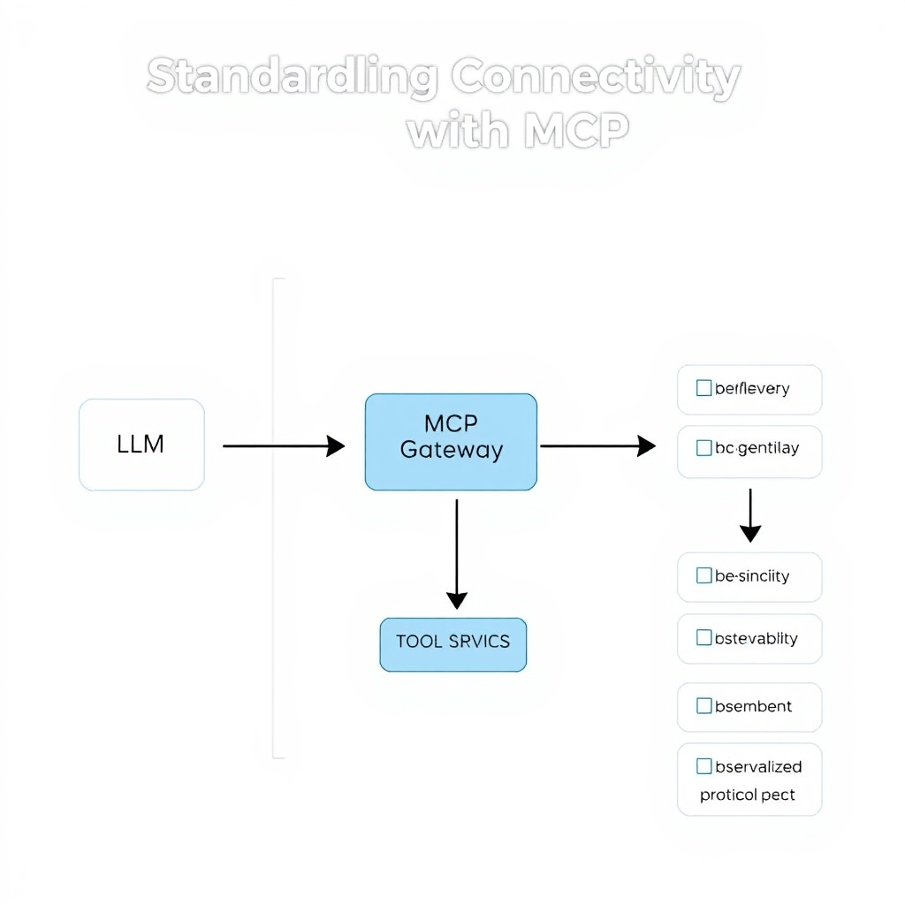
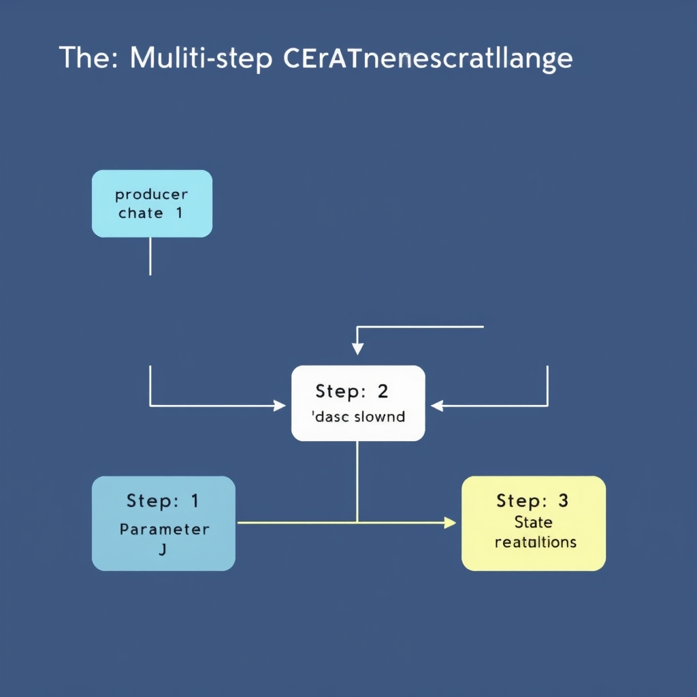
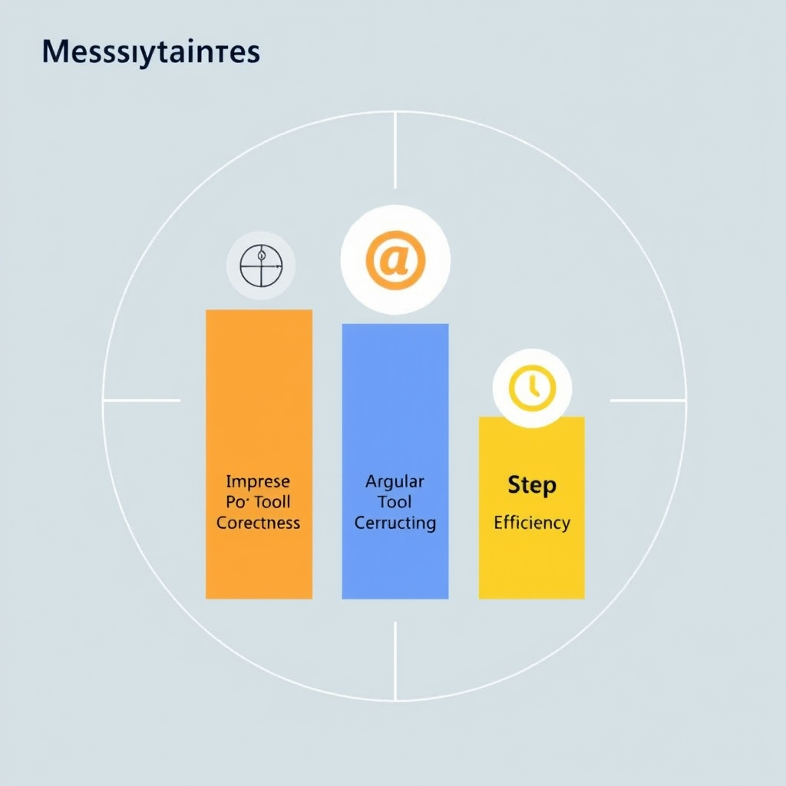

# Beyond Single Turns: Mastering Multi-Step LLM Tool Orchestration in 2026

## The State of Tool Calling in 2026

The past few years have turned **function calling**—the ability of an LLM to emit a JSON‑encoded request that matches a predefined schema—into the foundation of production‑grade agents. Early implementations were limited to a single, isolated call, often used for simple look‑ups or data retrieval. Today, developers stitch together dozens of calls, passing intermediate results from one API to the next, to achieve end‑to‑end workflows such as automated ticket triage, code generation pipelines, and real‑time data dashboards.

- **From single‑turn to multi‑step orchestration** – The shift is driven by the need for agents that can maintain state across calls, reason about dependencies, and recover from errors. Research shows that *parameter inference errors* dominate failures in long chains, highlighting the growing complexity of state propagation【https://arxiv.org/html/2603.24709v1】.
- **JSON schema as the production baseline** – Modern tool‑calling frameworks require developers to publish a JSON schema for each function. The LLM receives these schemas, selects the appropriate tool, and returns a structured payload that can be validated before execution. This contract eliminates ambiguous text parsing and enables automated testing pipelines【https://deploybase.ai/articles/best-llm-for-function-calling-tool-use-comparison】.

Frontier proprietary models such as **Claude Opus** and **GPT‑5.6** are being integrated into early‑adopter platforms, pushing the envelope of how many steps an agent can reliably manage. At the same time, open‑source projects have closed the gap: the **Qwen3‑Coder** series consistently hits over 70 % on the SWE‑bench Verified benchmark, demonstrating that community‑driven models can power sophisticated tool orchestration without proprietary licenses【https://modal.com/resources/best-open-source-code-llms-tool-calling-agents】.

The necessity of moving beyond single‑turn interactions is now evident. Single‑call agents cannot satisfy use‑cases that require conditional branching, iterative refinement, or cumulative data aggregation. By embracing multi‑step orchestration, teams unlock capabilities such as autonomous debugging, dynamic report generation, and real‑time decision support—capabilities that define the next generation of LLM‑driven applications.

## Standardizing Connectivity with MCP

### The Protocol Wars: From Proprietary Hooks to a Unified Standard

During 2024‑2025, vendors released competing JSON‑schema extensions (e.g., OpenAI's `function_call`, Anthropic's `tool_use`, and Cohere's `action_schema`). Each required agents to embed vendor‑specific adapters, inflating integration cost and fragmenting the ecosystem. The community’s “protocol wars” culminated in the **Model Context Protocol (MCP)**, which was formalized in the 2026 AI Agents Stack report. The paper notes that *“the protocol debate is over. MCP won. The only question left is how you lock down your MCP servers before someone exploits them.”* — [The AI Agents Stack: LLM to Production (2026)](https://theaiengineer.substack.com/p/the-ai-agents-stack-2026-edition).

MCP’s success stems from three pragmatic design choices:

1. **Vendor‑agnostic schema** – a single JSON‑compatible description of tool signatures that any compliant model can consume.
1. **Bidirectional context passing** – agents can both send calls *and* receive structured responses without custom parsers.
1. **Extensible metadata** – versioning, authentication, and rate‑limit hints are baked into the protocol, eliminating ad‑hoc extensions.

### Decoupling Agents from Tool Implementations

MCP treats the **agent** and the **tool service** as independent micro‑services communicating over a well‑defined contract. An agent only needs to know the tool’s *name* and *JSON schema*; the actual implementation (REST, gRPC, serverless function, or even a legacy SOAP endpoint) lives behind an MCP gateway.

This decoupling yields several engineering benefits:

- **Swap‑ability** – replace a weather API with a newer provider without retraining the LLM; only the schema registration changes.
- **Language neutrality** – tools written in Go, Python, or Rust expose the same MCP endpoint, allowing heterogeneous stacks.
- **Testing isolation** – mock MCP servers can be spun up locally, enabling deterministic unit tests for the agent’s reasoning logic.

### Security Implications of Exposing MCP Servers

Because MCP servers become the *only* public surface for agentic execution, they inherit the attack surface of any external service. The 2026 AI Agents Stack report highlights three primary concerns:

1. **Unauthorized tool invocation** – an attacker could craft a valid MCP request that triggers privileged actions (e.g., database writes). Mitigation requires **mutual TLS** and **per‑tool API keys** validated at the gateway.
1. **Data leakage** – the protocol carries full argument payloads, which may contain PII. Encrypting the `arguments` field end‑to‑end and enforcing **field‑level redaction** at the MCP layer prevents accidental exposure.
1. **Denial‑of‑service** – agents can generate rapid fire calls. Rate‑limiting per‑agent token and employing **circuit‑breaker patterns** at the MCP server protect downstream services.

Implementers should treat the MCP gateway as a **zero‑trust bastion**: authenticate every agent, authorize each tool call, and log every request for audit.

### High‑Level Architectural View

Below is a textual diagram of a typical MCP‑based stack:

```
+-------------------+        +-------------------+        +-------------------+
|   LLM Agent       | <---> |   MCP Gateway    | <---> |   Tool Service(s) |
| (reasoning core) |        | (protocol router) |        | (REST, gRPC, etc.)|
+-------------------+        +-------------------+        +-------------------+
        |                               ^
        |                               |
        |   +-------------------+       |
        +---|   Observability   |-------+
            | (tracing, logs)  |
            +-------------------+
```

- **LLM Agent** generates a `call` object conforming to the registered schema.
- **MCP Gateway** validates the request, performs authentication/authorization, and forwards the call to the appropriate **Tool Service**.
- Responses flow back through the gateway, preserving the original schema, allowing the agent to continue reasoning.
- An **Observability layer** captures request/response pairs for debugging and metric collection (e.g., tool correctness, latency).

By standardizing this interaction, MCP eliminates the need for bespoke adapters, reduces integration friction, and provides a clear security perimeter—setting the foundation for reliable, production‑grade agentic workflows.


*The MCP architecture decouples the agent's reasoning core from the specific implementation of external tools, enabling modularity and standardized observability.*

## The Multi-Step Orchestration Challenge

### Parameter Inference Errors: The Primary Failure Point

Research shows that *parameter inference errors* dominate the failure budget of long‑dependency tool chains【https://arxiv.org/html/2603.24709v1】. When an LLM must synthesize arguments for a downstream API based on the output of a previous call, even a small deviation—such as an off‑by‑one index or a missing field—causes the entire sequence to abort. In practice, these errors arise from two sources:


*Parameter inference errors occur when an agent fails to extract specific fields from a previous tool's output, causing downstream steps to receive malformed data.*

1. **Ambiguous schema mapping** – JSON schemas describe required fields, but the model may generate a superset, omit a required key, or mis‑type a value.
1. **Context drift** – As the conversation lengthens, the model’s attention to earlier steps weakens, leading to stale or mismatched values.

Both issues are amplified in multi‑step orchestration because each subsequent call depends on the exact output of the previous one.

______________________________________________________________________

### State Propagation Between Dependent Calls

Unlike single‑turn function calls, agentic workflows must retain *state* across several interactions. The state typically includes:

- Raw API responses (JSON blobs)
- Derived intermediate variables (e.g., a user’s `account_id`)
- Execution metadata (timestamps, retry counters)

Propagating this state reliably is non‑trivial. LLMs do not have an intrinsic memory store; they rely on the surrounding prompt to re‑inject prior values. If the prompt exceeds token limits or the developer forgets to include a crucial field, the next tool invocation receives incomplete data, leading to the parameter errors described above.

______________________________________________________________________

### Code Illustration: A Typical Three‑Step Chain

```python
# Pseudocode for an agent that recommends a travel package
# Step 1: Resolve a city name to a destination ID
city = "Paris"
resp1 = call_tool(
    name="lookup_destination",
    arguments={"city_name": city}
)  # Expected: {"dest_id": "D123"}

# Step 2: Query availability using the ID from step 1
# BUG: The model often returns the whole response object instead of the ID
availability = call_tool(
    name="check_availability",
    arguments={"destination_id": resp1}  # <-- error: should be resp1["dest_id"]
)

# Step 3: Book the package using the availability token
booking = call_tool(
    name="book_package",
    arguments={
        "token": availability["token"],
        "user_id": "U456"
    }
)
```

In the snippet above, the **parameter inference error** occurs at Step 2: the LLM passes the entire `resp1` object instead of extracting `dest_id`. Empirical studies report that such mismatches account for the majority of multi‑step failures【https://arxiv.org/html/2603.24709v1】.

______________________________________________________________________

### Error‑Handling and Self‑Correction Strategies

To make agentic pipelines robust, developers should layer defensive mechanisms around the LLM’s raw output:

1. **Schema Validation Layer** – After each tool call, run a JSON‑schema validator. If validation fails, trigger a *re‑prompt* that asks the model to re‑format its arguments.
1. **Explicit State Store** – Persist intermediate results in a key‑value store (e.g., Redis) and reference them by stable identifiers rather than by re‑embedding raw JSON in the prompt.
1. **Retry Logic with Contextual Feedback** – On validation failure, automatically resend the previous step’s output along with a concise error description (e.g., "`destination_id` missing, please extract from `resp1`.")
1. **Self‑Correction Loop** – Allow the agent to introspect its own reasoning. After a failed step, the model can be prompted with a summary of the error and asked to generate a corrected call.
1. **Fallback Tools** – Provide a simpler, more permissive tool as a backup (e.g., a free‑text search API) that can recover when the primary, stricter tool rejects the input.

By combining validation, persistent state, and iterative self‑correction, the failure rate of parameter inference drops dramatically, turning brittle chains into production‑grade workflows.

______________________________________________________________________

### Takeaway

Multi‑step orchestration collapses when the LLM loses grip on the exact shape of data it must pass forward. Recognizing *parameter inference errors* as the chief culprit, engineering a reliable state‑propagation mechanism, and embedding systematic error‑handling loops are essential steps toward stable agentic systems.

## Measuring Success: The 2026 Evaluation Framework

### Tool Correctness

Tool Correctness measures whether the agent selects the appropriate function for a given intent. In practice, this is a binary check: did the model call *search_documents* when the user asked for recent research, or did it mistakenly invoke *create_event*? A production‑grade evaluation suite records the intended tool (derived from a ground‑truth plan) and compares it to the model’s choice, yielding a precision/recall score across thousands of scenarios. The metric directly reflects the model’s understanding of the tool catalog and its ability to map natural‑language requests to the correct JSON schema.

### Argument Correctness

Even when the right tool is chosen, the interaction fails if the arguments do not conform to the schema or contain semantic errors. Argument Correctness validates that every parameter:

- matches the expected type (e.g., `int` vs. `string`),
- respects required fields, and
- encodes the correct value derived from prior steps.

For example, a multi‑step workflow that extracts a date from a PDF and then calls `schedule_meeting(start_time=…)` must pass the exact ISO‑8601 timestamp. The evaluation framework parses the generated JSON, runs schema validation, and optionally executes a sandboxed mock of the tool to catch downstream failures. This metric is crucial because, as noted in recent research, *parameter value errors* dominate failures in long dependency chains \[[arXiv](https://arxiv.org/html/2603.24709v1)\].

### Step Efficiency

Step Efficiency rewards agents that achieve the goal in the fewest useful invocations. The metric counts the number of tool calls that contribute to the final answer and divides it by the minimal known optimal count. An agent that redundantly calls `list_files` twice before a single `read_file` incurs a penalty, whereas a well‑orchestrated agent that directly calls `read_file` after a single `search_repository` scores higher. This encourages the design of concise, purpose‑driven loops rather than exhaustive trial‑and‑error.

### Why Static Benchmarks Fall Short

Traditional static benchmarks—e.g., single‑turn function‑calling tests—measure only isolated correctness. They cannot capture:

1. **State propagation** across dependent calls, where the output of one API becomes the input of the next.
1. **Error recovery** behaviors, such as self‑correction after a malformed argument.
1. **Efficiency trade‑offs**, because static tests often allow unlimited steps.

Consequently, a model that scores 95 % on a static suite may still fail catastrophically in a real‑world agentic pipeline. Modern evaluation frameworks therefore embed *dynamic* scenarios that simulate end‑to‑end workflows, logging each metric above and aggregating them into a composite score. This approach aligns with industry best practices outlined in the 2026 evaluation guide \[[Confident AI](https://www.confident-ai.com/blog/llm-agent-evaluation-complete-guide)\].

### Putting It All Together

A robust production pipeline records the three metrics per request, stores them in a time‑series dashboard, and triggers alerts when any metric dips below a service‑level threshold. By continuously monitoring Tool Correctness, Argument Correctness, and Step Efficiency, teams can pinpoint failure modes—whether they stem from model drift, schema mismatches, or inefficient orchestration—and iterate on prompts, fine‑tuning data, or MCP configuration accordingly.


*A production-grade evaluation framework relies on these three deterministic metrics to move beyond static benchmarks and measure real-world agent reliability.*

## Conclusion: Building for Reliability

The past sections have shown how the **Model Context Protocol (MCP)** has become the de‑facto standard for wiring agents to tools, and how the three‑metric evaluation framework—Tool Correctness, Argument Correctness, and Step Efficiency—anchors rigorous performance measurement. Together they mark a clear shift from ad‑hoc function calls to disciplined, production‑ready agentic pipelines.

Reliability now hinges on two operational pillars:

- **Observability:** logging every MCP request/response, tracing state propagation, and surface‑level dashboards let teams spot parameter inference errors before they cascade.
- **Iterative testing:** automated replay of recorded tool chains, combined with synthetic edge‑case generation, drives continuous improvement and reduces the failure rate documented in recent multi‑step orchestration studies.

For high‑stakes workflows—financial reconciliation, medical data extraction, or safety‑critical code generation—developers should embed a **human‑in‑the‑loop handoff** after the agent’s final step. A lightweight UI that surfaces the tool call log and its arguments lets a domain expert approve or correct the outcome, turning a brittle chain into a controlled process.

Looking ahead, 2026 will likely see tighter MCP security sandboxes, richer schema versioning, and broader adoption of self‑correcting loops powered by the same evaluation metrics. Teams that bake observability, testing, and human oversight into their agentic designs will be best positioned to reap the reliability gains promised by today’s standards.