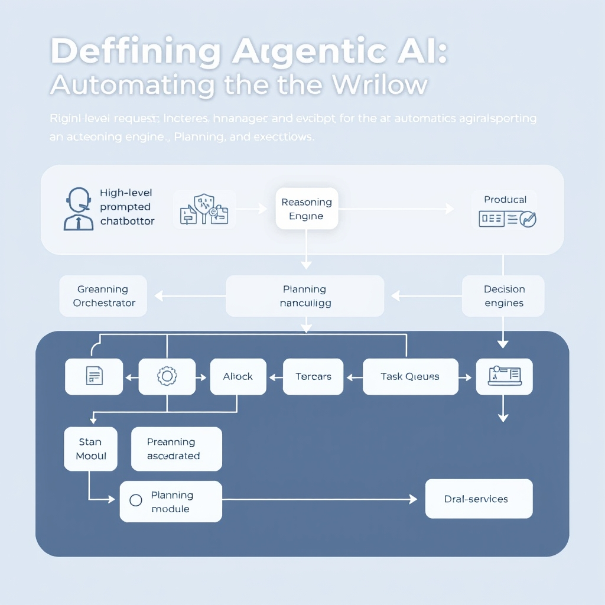
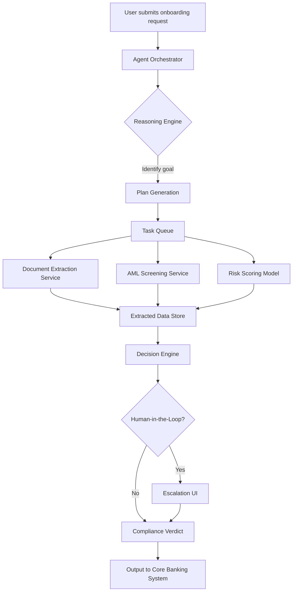
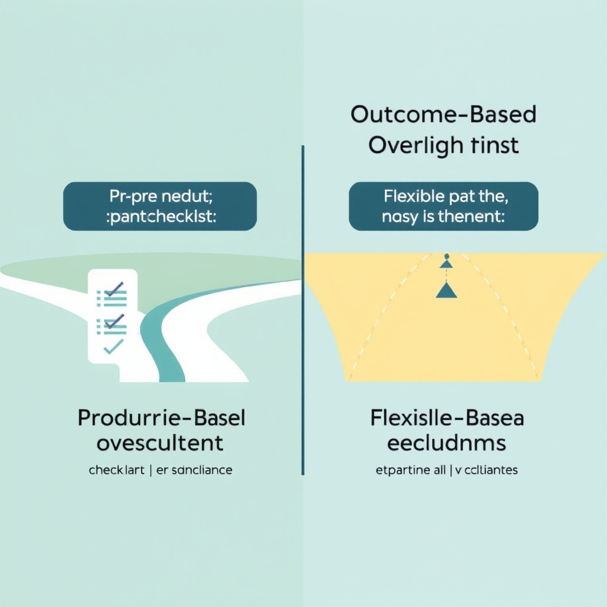
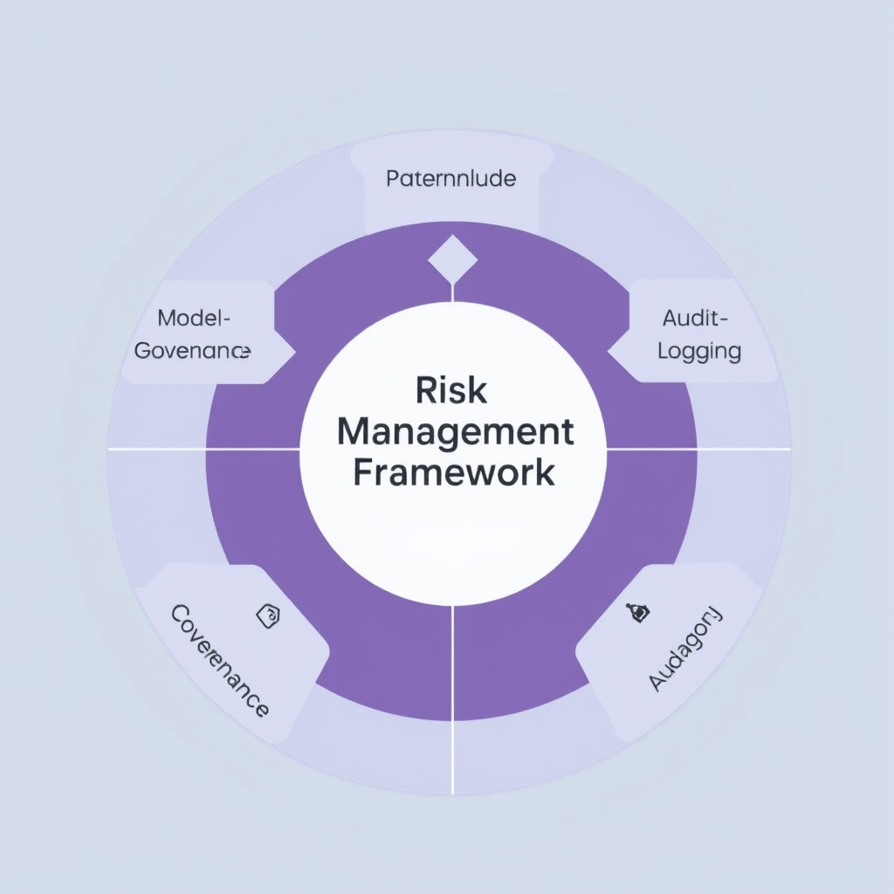

# Beyond the Chatbot: The Rise of Agentic AI in Financial Services

## The State of AI in Finance: From Pilot to Production

In 2026, AI has become almost ubiquitous in financial services: **81 %** of surveyed firms report using AI in at least one function, yet only **14 %** consider it a *strategic transformation* rather than a peripheral tool[^1]. This gap highlights a common pattern—organizations are comfortable experimenting, but few have integrated AI into the core of their business models.

### Where the effort is concentrated

- **Internal process automation** – 79 % of firms cite this as their primary AI use case.
- **Data and knowledge management** – 69 % focus on AI‑driven data handling and insight generation.
  These two buckets dominate the AI landscape because they address immediate pain points: repetitive manual workflows and the ever‑growing volume of structured and unstructured data that banks must ingest, cleanse, and act upon. By automating routine tasks such as transaction reconciliation, compliance document routing, or client onboarding, institutions can free up analysts for higher‑value activities while reducing operational risk.

### The economic incentive to go further

Generative AI alone is projected to unlock **$200 billion to $340 billion** in annual value for the banking sector, equivalent to roughly **9 %–15 %** of operating profits[^2]. This sizable upside is not limited to isolated pilots; it materializes when AI moves from proof‑of‑concept to production‑grade systems that continuously execute end‑to‑end processes.

The data points converge on a clear imperative: firms must transition from ad‑hoc pilots to integrated, outcome‑focused AI deployments. Doing so not only captures the projected financial upside but also positions institutions to compete in a market where AI‑enabled efficiency is rapidly becoming a baseline expectation rather than a differentiator.

______________________________________________________________________

\[^1\]: Cambridge CCAF 2026 Global AI in Financial Services Report, cited in *AI in FinTech in 2026: Use Cases, Risks & Market Size* (https://uvik.net/blog/ai-in-fintech).
\[^2\]: *Generative AI in Banking: 7 Real‑World Use Cases (2026)*, Ideas2IT (https://www.ideas2it.com/blogs/generative-ai-in-banking).

## Defining Agentic AI: Automating the Workflow

Agentic AI represents a shift from **single‑prompt generative models** to **autonomous software agents** that can reason about a goal, devise a plan, and carry out a sequence of actions without continuous human direction. In practice, an agentic system consists of three tightly coupled capabilities:


*Agentic AI architecture: Moving from manual prompts to autonomous reasoning, planning, and execution.*

1. **Reasoning** – interpreting the high‑level intent (e.g., "verify a new client for KYC compliance") and identifying constraints such as regulatory thresholds or data‑privacy rules.
1. **Planning** – breaking the intent into discrete, ordered tasks (identity document extraction, AML watch‑list screening, risk‑score calculation, etc.) and selecting the appropriate micro‑services to execute each step.
1. **Execution** – invoking those services, handling retries, and aggregating results into a final decision that can be returned to the user or downstream workflow.

______________________________________________________________________

### Why Generative Chatbots Aren’t Enough

Traditional generative models (GPT‑4, Claude, etc.) excel at **text generation** when they receive a prompt. They lack an internal loop that can:

- **Persist state** across multiple interactions.
- **Trigger external APIs** or databases without explicit user instructions.
- **Self‑evaluate** whether a sub‑task succeeded and decide on the next action.

Consequently, a chatbot must be prompted for each step—"extract the ID", then "run AML check", then "calculate risk"—which introduces latency, human error, and scalability limits. Agentic AI removes that friction by embedding the orchestration logic inside the model, allowing a single high‑level request to drive an end‑to‑end workflow.

______________________________________________________________________

### Adoption Landscape

The 2026 Cambridge CCAF survey shows that **21 %** of financial‑services firms have already deployed AI agents in production, while **52 %** are running pilots or more advanced experiments【https://uvik.net/blog/ai-in-fintech】. This rapid uptake underscores the market’s appetite for moving beyond proof‑of‑concept chat interfaces toward fully operational, autonomous agents that can handle compliance‑critical processes.

______________________________________________________________________

### Conceptual Architecture: KYC Verification Agent

Below is a **Mermaid** diagram that captures a typical agentic workflow for Know‑Your‑Customer (KYC) verification. The diagram is deliberately abstract so it can be adapted to other multi‑step financial processes.



- **Agent Orchestrator**: Receives the high‑level request and maintains session state.
- **Reasoning Engine**: Interprets regulatory constraints and business policies.
- **Plan Generation**: Produces a DAG of tasks (extraction → screening → scoring).
- **Task Queue**: Dispatches each micro‑service call, monitors success, and retries on failure.
- **Human‑in‑the‑Loop**: Optional checkpoint for edge cases flagged by the decision engine.

______________________________________________________________________

### Minimal Working Example (Python‑like Pseudocode)

The following snippet illustrates the core loop an agent might execute. It is intentionally language‑agnostic but shows how reasoning, planning, and execution are wired together.

```python
class AgenticKYC:
    def __init__(self, services):
        self.services = services  # dict of callable micro‑services

    def run(self, request):
        # 1️⃣ Reason about the request
        goal = self._interpret(request)
        # 2️⃣ Generate a plan (ordered list of tasks)
        plan = self._plan(goal)
        # 3️⃣ Execute each task, collecting results
        context = {}
        for task in plan:
            result = self.services[task](request, context)
            context[task] = result
            if not self._task_success(result):
                raise RuntimeError(f"{task} failed")
        # 4️⃣ Final decision based on aggregated context
        return self._decide(context)

    # ---- Helper methods (simplified) ----
    def _interpret(self, req):
        return "KYC_VERIFICATION"

    def _plan(self, goal):
        return ["extract_documents", "aml_screen", "risk_score"]

    def _task_success(self, res):
        return res.get("status") == "ok"

    def _decide(self, ctx):
        if ctx["risk_score"]["score"] < 0.3:
            return {"verdict": "approve"}
        return {"verdict": "review", "reason": "high risk"}
```

The example demonstrates **self‑contained autonomy**: a single `run` call drives the entire KYC pipeline, handling failures and producing a compliance‑ready verdict without further human prompts.

______________________________________________________________________

### Takeaway

Agentic AI is more than a buzzword; it is a concrete architectural pattern that enables financial institutions to **scale complex, regulated workflows** while preserving the agility of AI‑driven decision making. The growing production deployment rate (21 %) signals that early adopters are already reaping efficiency gains, and the 52 % pilot figure suggests the majority of the industry is on the cusp of a similar transformation.

## Navigating Outcome-Based Regulation


*The shift in regulatory oversight: From rigid procedural mandates to flexible, outcome-based frameworks.*


*Core components of an AI risk management framework for maintaining compliance in autonomous systems.*

The regulatory tide in 2026 has moved from prescriptive check‑lists to **outcome‑based oversight**. Rather than dictating the exact steps a firm must follow, supervisors now publish the *desired results* – such as accurate credit‑risk scoring, zero‑tolerance for discriminatory outcomes, and demonstrable audit trails – and leave the implementation details to the institution. This shift, highlighted by the 2026 Trends report from SAIFR, gives firms the latitude to choose the most efficient AI‑enabled processes while still meeting the regulator’s expectations. The net effect is a regulatory environment that rewards innovation, provided the end‑state aligns with policy goals.

### AI risk‑management frameworks become mandatory

To satisfy outcome‑based mandates, financial institutions must embed **risk‑management frameworks** that address two core AI concerns:

- **Explainability** – models must produce intelligible rationales for decisions that affect customers (e.g., loan approvals). Transparent reasoning enables auditors to verify that the outcome matches regulatory expectations.
- **Bias mitigation** – systematic monitoring for disparate impact is required to ensure that autonomous agents do not unintentionally discriminate against protected groups.

A practical framework typically includes:

1. **Data provenance catalog** – records the source, lineage, and quality metrics of every dataset fed to an agent.
1. **Model governance board** – cross‑functional reviewers who approve model updates and certify compliance with explainability standards.
1. **Continuous monitoring dashboard** – tracks key fairness and performance indicators in real time, triggering alerts when thresholds are breached.
1. **Audit‑ready logging** – immutable logs of agentic actions, decisions, and data accesses that can be inspected during regulator‑led examinations.

These components translate the abstract outcome‑based goals into concrete, auditable processes.

### Flexibility accelerates innovation cycles

Because regulators no longer prescribe a single workflow, firms can experiment with **lean, production‑grade pipelines**. For example, a bank can replace a manual KYC review with an autonomous agent that pulls identity documents, validates them against watch‑lists, and flags anomalies – all while logging each decision step for later review. The ability to iterate quickly reduces time‑to‑value from months to weeks, aligning with the industry’s projected $200‑$340 B value uplift.

### Security considerations for autonomous agents

When agents operate on **sensitive financial data** (account balances, transaction histories, personal identifiers), the attack surface expands:

- **Privilege escalation** – agents often require elevated API keys to interact with multiple internal systems. Mis‑configured permissions can expose data to unauthorized services.
- **Data exfiltration** – autonomous workflows that move data between cloud storage, third‑party analytics, and internal databases must enforce end‑to‑end encryption and strict egress controls.
- **Model poisoning** – adversaries may attempt to corrupt training data streams, leading agents to produce erroneous or biased outcomes.

Mitigation strategies include zero‑trust network segmentation, role‑based access controls for each agent, and regular penetration testing of the agentic orchestration layer.

By aligning risk‑management, explainability, and security practices with outcome‑based regulatory expectations, financial firms can unlock the speed and scale of Agentic AI while staying firmly within the compliance envelope.

## Conclusion: The Strategic Imperative

The transition from isolated AI pilots to **Agentic AI** is the lever that can unlock the full $340 billion value horizon projected for the financial sector. While 81 % of firms now experiment with AI, only 21 % have placed autonomous agents in production – a gap that directly translates into untapped profit potential. By enabling agents to reason, plan, and execute end‑to‑end workflows (e.g., KYC verification or real‑time fraud mitigation), institutions can capture the high‑margin gains that generative AI alone cannot deliver.

Regulatory oversight has also evolved. Outcome‑based frameworks now focus on *what* a model must achieve rather than prescribing *how* it must be built, turning compliance into a **strategic enabler** rather than a bottleneck【https://saifr.ai/blog/2026-trends-ai-and-compliance-in-financial-services】. This flexibility allows firms to iterate faster, embed robust risk‑management controls, and still meet the same result‑oriented expectations.

**Leadership imperative**: move beyond the "chat" layer of generative tools and invest in agents that act. Deploying production‑grade Agentic AI not only aligns with the emerging regulatory climate but also positions firms to capture a share of the $200‑$340 billion annual value pool, securing a sustainable competitive edge.