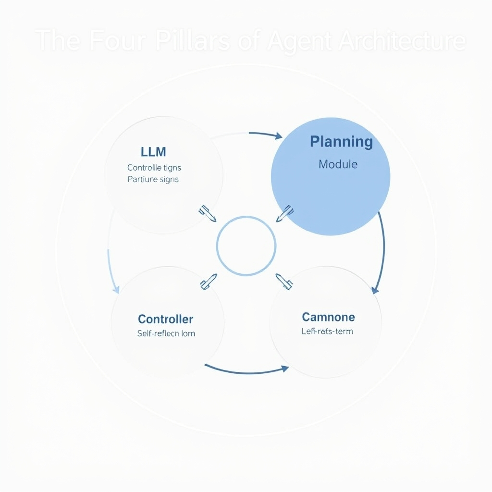
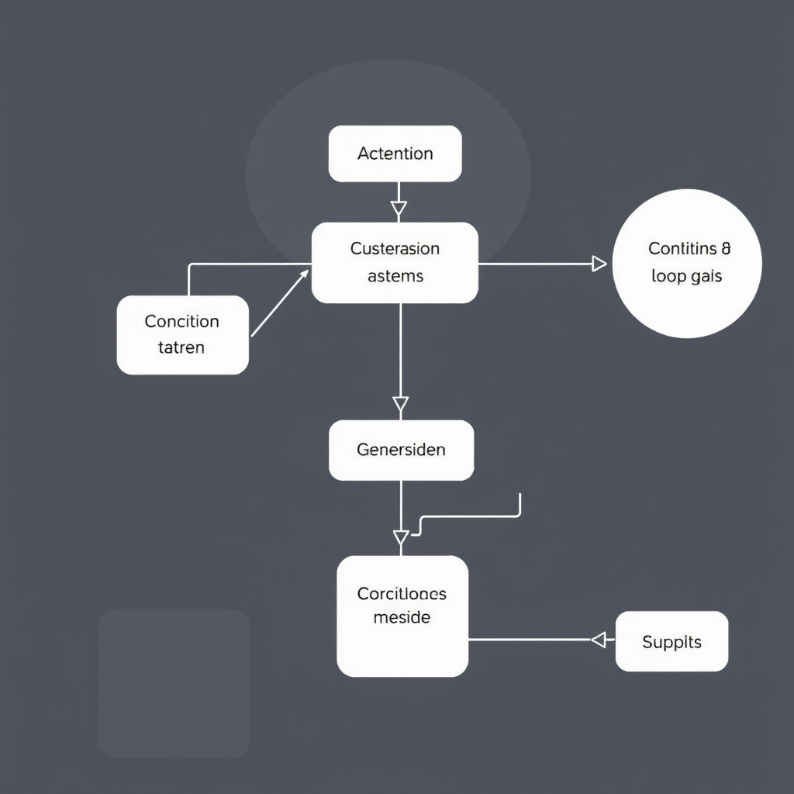
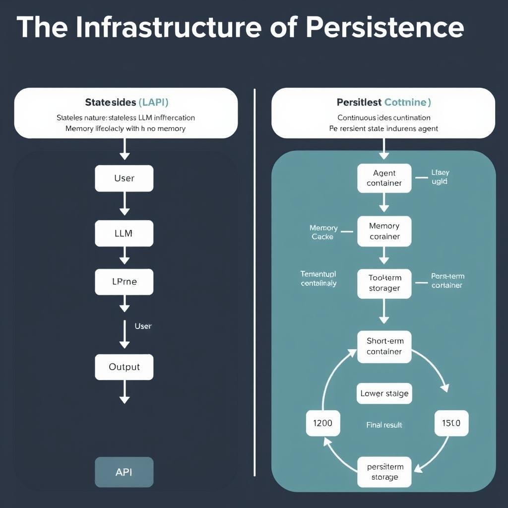

# Beyond the LLM: Understanding the Architecture of AI Agents

## The Four Pillars of Agent Architecture

### The LLM as the System Controller

The central element of an autonomous AI agent is a large language model that functions as a decision‑making controller rather than a simple text generator. In this role the LLM ingests structured observations, issues commands to downstream tools, and evaluates the results. By continuously interpreting user intent, translating high‑level goals into concrete actions, and coordinating the internal workflow, the LLM becomes the brain of the system.

### Planning Modules: Decomposing Complex Goals

A dedicated planning component breaks a top‑level objective into an ordered sequence of sub‑tasks that the LLM can execute one at a time. For instance, a travel‑assistant might receive the request “Plan a weekend trip to Kyoto.” The planner first identifies required actions—searching for flights, reserving a hotel, drafting an itinerary—then orders them according to dependencies and timing constraints. This decomposition lets the LLM focus on a single micro‑goal, which reduces the chance of hallucination and improves traceability of each step.

### Memory Mechanisms: Short‑Term vs. Long‑Term Storage

Effective agents must retain context across interactions. Short‑term memory stores the immediate dialogue state, such as the last user utterance or the result of a recent API call, enabling the LLM to reference recent information without re‑querying external services. Long‑term memory preserves knowledge that spans sessions—user preferences, historical transaction data, or domain‑specific facts. Implementations typically combine fast in‑memory caches with vector‑based semantic stores, ensuring that relevant information can be retrieved even after days or weeks.

### Self‑Reflection Loops for Iterative Refinement

After each action, the agent runs a self‑reflection step in which the LLM reviews the outcome, assesses progress toward the original goal, and decides whether the plan needs adjustment. This mirrors human problem‑solving: the system asks itself questions like “Did the flight search return acceptable options?” and, if not, issues a refined query. The loop acts as a safety net, catching errors early and allowing dynamic adaptation to changing environments.

Collectively, these four pillars—LLM controller, planning, memory, and self‑reflection—constitute the modular architecture that upgrades a plain language model into a reliable autonomous agent. This configuration aligns with the definition proposed in recent research, which identifies the LLM plus planning, memory, tool use, and self‑reflection as the core components of modern AI agents [Nature study](https://www.nature.com/articles/s44387-026-00076-4).

*The four pillars of agent architecture function as an integrated system, allowing the model to act, learn, and iterate.*

## Orchestration and Reasoning Strategies

### Comparing ReAct and Chain‑of‑Thought reasoning

ReAct (Reasoning and Acting) and Chain‑of‑Thought (CoT) are two complementary prompting paradigms that move LLMs beyond single‑shot answer generation. ReAct interleaves reasoning steps with explicit actions—such as API calls or tool invocations—allowing the model to *act* on its intermediate conclusions. In contrast, CoT encourages the model to produce a linear chain of reasoning before arriving at a final answer, improving performance on tasks that require multi‑step deduction. Both strategies are discussed in a benchmark study of AI agent frameworks that found they can improve task performance when used together [From LLMs to AI agents: a systematic benchmark for SAO structure extraction in patent analytics](https://www.nature.com/articles/s41598-026-49727-1). A benchmark in the domain of patent analytics reported that integrating the two strategies into a generator‑judge architecture yielded higher task accuracy than using either alone.

*Graph-based orchestration, such as LangGraph, enables non-linear execution, branching logic, and critical human-in-the-loop safety gates.*

### Why graph‑based workflows like LangGraph matter for complexity

When an agent must navigate non‑linear problem spaces—e.g., conditional sub‑tasks, loops, or parallel explorations—a linear prompt chain quickly becomes brittle. LangGraph introduces a stateful, graph‑oriented execution model where each node represents a reasoning or action step, and edges encode possible transitions based on observed outcomes. This structure enables agents to *branch* dynamically, revisit prior steps, and maintain context across long interactions. The framework’s ability to represent complex decision trees is a key differentiator from traditional linear pipelines, making it suitable for real‑world applications that involve iterative refinement and contingency handling [The 12 Most Powerful AI Agent Frameworks in 2026](https://vocal.media/writers/the-12-most-powerful-ai-agent-frameworks-in-2026).

### Implementing human‑in‑the‑loop controls for safety

Safety‑critical deployments often require a human overseer to validate or veto actions before they affect external systems. In a graph‑based orchestration, a dedicated "review" node can pause execution, surface the model’s proposed action, and await human input. LangGraph’s explicit state management makes it straightforward to serialize the current graph snapshot, present it to an operator, and resume from the same point after approval. This pattern reduces the risk of unintended behavior while preserving the agent’s autonomy for routine steps.

### Handling branching logic in autonomous agents

Branching logic arises when an agent must choose between alternative pathways based on dynamic evidence—e.g., selecting a data source, retrying a failed API call, or adapting to user feedback. In a LangGraph workflow, conditional edges are defined by predicates that evaluate the agent’s internal state or external signals. When a predicate evaluates to true, the graph follows the corresponding branch; otherwise, it traverses an alternate path. This mechanism supports:

- **Error recovery**: Loop back to a previous node on failure and attempt a different strategy.
- **Parallel exploration**: Spawn multiple sub‑graphs that run concurrently, later merging results.
- **Adaptive planning**: Re‑plan mid‑execution when new information invalidates the original plan.

By combining ReAct’s action‑oriented reasoning with CoT’s deep deliberation, and embedding them within a graph‑driven orchestration like LangGraph, developers can construct agents that are both *intelligent* and *controllable*. The resulting systems move beyond ad‑hoc prompt engineering toward a disciplined, modular architecture capable of handling real‑world complexity safely.

## The Infrastructure of Persistence

*Stateless inference (left) discards context, whereas stateful agent architectures (right) utilize persistent memory and compute to maintain context over time.*

AI agents mark a fundamental shift from the traditional request‑response model of LLM inference to a **persistent software system** that continuously manages state. In a stateless setup, each user query triggers a fresh model call, discarding any context once the response is returned. By contrast, an agent must retain short‑term observations, long‑term knowledge, and intermediate results across many interactions. This transition to **persistent memory management** enables the system to build on prior work, avoid redundant computation, and refine its behavior over time. As noted in the GTC 2026 briefing, autonomous agents require "large KV caches and long‑running context management" to function effectively[​GTC 2026: NVIDIA’s Claws Strategy and the Rise of Agent AI Infrastructure](https://counterpointresearch.com/en/insights/GTC-2026-NVIDIA-Claws-Strategy-and-the-Rise-of-Agent-AI-Infrastructure).

### Sustained Compute for Long‑Running Tasks

Complex goals—such as planning a multi‑day travel itinerary or orchestrating a supply‑chain workflow—cannot be solved in a single, millisecond‑scale inference call. Agents must keep compute resources allocated while they decompose the problem, query external tools, and iteratively refine solutions. This **sustained compute** model differs from the bursty usage patterns of classic LLM APIs, where idle time dominates and scaling is purely request‑driven. Persistent containers, GPU‑backed services, or serverless functions with warm‑up periods are now the norm for production agents.

### Overcoming Transient Inference Constraints

Stateless inference suffers from two key limitations:

1. **Context window truncation** – each call can only see a limited token window, forcing the agent to re‑inject prior information manually.
1. **Cold‑start latency** – loading model weights for every request adds overhead.
   Persistent agents sidestep these issues by keeping the model loaded and by storing embeddings or key‑value pairs in a long‑lived cache. This allows the agent to retrieve relevant facts instantly and to maintain a coherent narrative across dozens or hundreds of steps.

### Best Practices for Maintaining Agent State in Production

- **Versioned State Stores** – Use a database that supports schema evolution (e.g., PostgreSQL with JSONB or a vector store) so that updates to the memory schema do not corrupt existing agents.
- **Checkpointing** – Periodically snapshot the agent’s memory graph to durable storage; this enables graceful restarts and facilitates debugging.
- **Isolation per Agent** – Allocate separate namespaces or containers for each agent instance to prevent cross‑talk and to enforce security boundaries.
- **Monitoring & Autoscaling** – Track cache hit rates, compute utilization, and latency; trigger autoscaling policies when sustained compute demand exceeds thresholds.
- **Graceful Degradation** – Design fallback logic that can operate with reduced memory (e.g., summarizing long‑term knowledge) when resources become constrained.

By embracing these infrastructure patterns, developers move beyond ad‑hoc prompt engineering toward **robust, production‑grade AI agents** that behave like traditional software services—always on, stateful, and capable of handling complex, long‑duration tasks.

## Standardizing Agent Interoperability

**Fragmented tool integrations**

Today's AI agents must juggle dozens of APIs, SDKs, and custom wrappers. Each vendor defines its own JSON schema for describing a tool’s inputs, outputs, and authentication, forcing developers to write brittle adapters for every new component. The resulting maintenance overhead slows iteration and creates hidden incompatibilities when agents are combined across platforms.

**How MCP simplifies entity and resource description**

The Model Context Protocol (MCP) introduces a single, declarative schema for representing any entity—whether a language model, a third‑party tool, or a persistent resource. By standardizing fields such as `name`, `capabilities`, `input_schema`, and `auth_requirements`, MCP lets an orchestrator ingest disparate tools without bespoke code. This uniform description enables automatic validation, versioning, and discovery, reducing integration effort from days to minutes. [Model Context Protocol (MCP)](https://www.ibm.com/think/news/ai-tech-trends-predictions-2026)

**Building future‑proof agents with standardized interfaces**

When an agent relies on MCP‑defined contracts, swapping one tool for a newer, more capable version is a matter of updating the entity descriptor rather than rewriting orchestration logic. Agents can also compose new capabilities at runtime by loading additional MCP definitions, supporting plug‑and‑play extensibility. This modularity aligns with the broader shift toward micro‑service‑style AI architectures, where each component can evolve independently while preserving overall system stability.

**Industry move toward unified agent protocols**

The Linux Foundation’s Agentic AI Foundation, backed by contributors like Anthropic, is championing MCP as the lingua franca for agent ecosystems. Early collaborations between the A2A framework and MCP already demonstrate a single card that can describe both a tool and an autonomous agent, hinting at a future where agents interoperate seamlessly across vendors and domains. [Model Context Protocol (MCP)](https://www.ibm.com/think/news/ai-tech-trends-predictions-2026)

## Sources

- [AI agent in healthcare: applications, evaluations, and future directions](https://www.nature.com/articles/s44387-026-00076-4)
- [From LLMs to AI agents: a systematic benchmark for SAO structure extraction in patent analytics | Scientific Reports](https://www.nature.com/articles/s41598-026-49727-1)
- [The 12 Most Powerful AI Agent Frameworks in 2026](https://vocal.media/writers/the-12-most-powerful-ai-agent-frameworks-in-2026)
- [GTC 2026: NVIDIA’s Claws Strategy and the Rise of Agent AI Infrastructure](https://counterpointresearch.com/en/insights/GTC-2026-NVIDIA-Claws-Strategy-and-the-Rise-of-Agent-AI-Infrastructure)
- [The trends that will shape AI and tech in 2026](https://www.ibm.com/think/news/ai-tech-trends-predictions-2026)