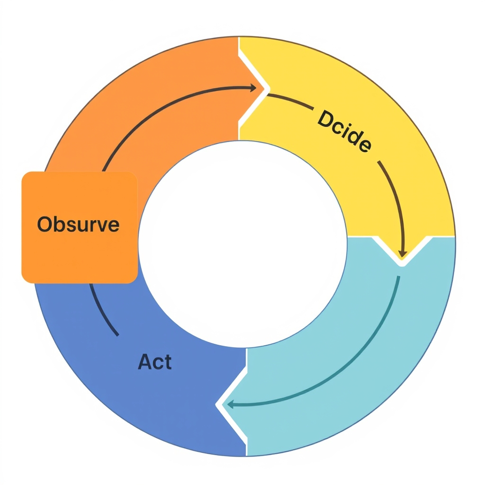
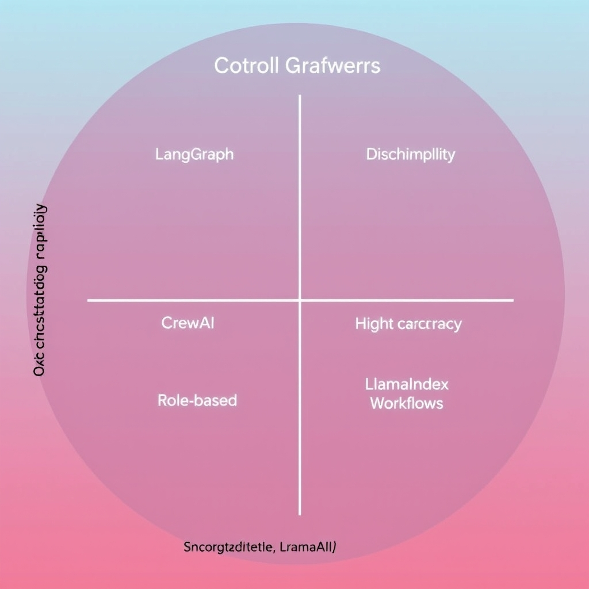

# Beyond the Prompt: Architecting Production-Ready AI Agents

## The Evolution of Agency: From Prompts to Processes
The concept of AI agency has evolved significantly, shifting from static LLM prompts to dynamic agentic workflows. This evolution is driven by the need for autonomous systems that can execute complex workflows. The four pillars of agency are:
* Memory: to retain context
* Reasoning: to break down goals
* Tool use: to interact with systems
* Orchestration: to manage multi-step processes
According to the LangChain State of AI Agents Report: 2024 Trends, approximately 51% of surveyed professionals are using AI agents in production, with 78% having active plans to implement them soon. Single-turn responses are insufficient for complex business tasks, which require iterative feedback loops and autonomous decision-making. As the industry moves toward autonomous workflows, it's essential to understand the architectural patterns required to build reliable AI agents.

## Architectural Patterns for Reliability

The performance of AI agents is significantly improved by iterative feedback loops. This section details the core reliability mechanisms and architectural patterns that enable robust AI agents.
* The 'observe-act-reflect' cycle is a fundamental reliability mechanism. It involves the agent observing its environment, acting based on that observation, and then reflecting on the outcome to inform future actions.
* Planning and multi-agent collaboration play crucial roles in reducing hallucinations. By planning ahead and collaborating with other agents, an AI agent can validate its actions and decisions, thus mitigating the risk of autonomous failure.
* Event-driven architectures are more suitable for AI agents than linear execution. Event-driven architectures allow agents to respond to changing conditions and unexpected events, making them more adaptable and resilient.
* These patterns mitigate the risks of autonomous failure by introducing feedback loops and checks that ensure the agent's actions align with its goals and the environment's state. For example, the `observe-act-reflect` cycle can be implemented using a simple loop: ```python
while True:
    observation = observe_environment()
    action = decide_action(observation)
    take_action(action)
    reflection = reflect_on_outcome()
    update_knowledge(reflection)```
This loop ensures that the agent continuously observes its environment, acts based on that observation, and reflects on the outcome to improve its knowledge and decision-making.


*The observe-act-reflect cycle creates a continuous feedback loop, allowing agents to learn from outcomes and adjust their behavior dynamically.*
## Selecting Your Framework: LangGraph, CrewAI, and LlamaIndex
The choice of framework is crucial for building reliable AI agents. Leading frameworks include LangGraph, CrewAI, and LlamaIndex Workflows, each serving different architectural needs. 
* Analyzing LangGraph for granular, stateful control reveals its suitability for applications requiring precise control over agent actions. For example, a LangGraph state graph definition might look like this:
```python
import langgraph

def define_state_graph():
    # Define states
    states = [
        langgraph.State('start'),
        langgraph.State('running'),
        langgraph.State('paused'),
        langgraph.State('stopped')
    ]
    # Define transitions
    transitions = [
        langgraph.Transition('start', 'running', 'start_running'),
        langgraph.Transition('running', 'paused', 'pause_running'),
        langgraph.Transition('paused', 'running', 'resume_paused'),
        langgraph.Transition('running', 'stopped', 'stop_running')
    ]
    # Create state graph
    state_graph = langgraph.StateGraph(states, transitions)
    return state_graph
```
* Evaluating CrewAI for role-based multi-agent orchestration shows its strength in managing complex, collaborative workflows. 
* Examining LlamaIndex Workflows for event-driven, high-concurrency needs highlights its ability to handle simultaneous processes and complex agentic operations. 
When choosing a framework, consider the specific requirements of your project, including the level of control needed, the complexity of workflows, and the need for concurrent processing. 
A decision matrix can help guide this choice, ensuring that the selected framework aligns with the project's architectural philosophy and needs. 
| Framework | Granular Control | Role-Based Orchestration | Event-Driven Concurrency |
| --- | --- | --- | --- |
| LangGraph | High | Low | Low |
| CrewAI | Medium | High | Medium |
| LlamaIndex Workflows | Low | Medium | High |
For example, if a project requires handling many simultaneous processes, LlamaIndex Workflows might be the most appropriate choice. 
In contrast, if granular control over agent actions is necessary, LangGraph could be more suitable. 
Ultimately, the framework choice should follow the specific architectural need, ensuring that the AI agent can execute complex workflows reliably and efficiently.


*Framework selection should be driven by your specific architectural requirements, such as the need for stateful control versus high-concurrency event handling.*
## The Reality of Production: Governance and Debugging
The deployment of autonomous systems in enterprise environments introduces several challenges, including the need for effective governance and debugging mechanisms. Key considerations include:
* The necessity of **observability tools** for tracking agent decision paths, ensuring transparency and accountability in autonomous operations.
* Addressing **security concerns** regarding tool access and data privacy, as autonomous agents interact with sensitive systems and data.
* Outlining strategies for **human-in-the-loop (HITL) intervention**, allowing for timely intervention when necessary to prevent or mitigate potential issues.
* Understanding the **cost implications** of iterative agent loops, as the ongoing execution and potential for errors can impact resource utilization and operational expenses.

## Building for the Future of Autonomy
The shift toward agentic systems marks a significant evolution in how we approach complex tasks. Moving from simple prompts to complex, reliable workflows involves understanding the architectural patterns and framework choices that support autonomy. 
* The transition from single-turn LLM prompts to robust AI agents requires a deep understanding of the four pillars of agency: memory, reasoning, tool use, and orchestration. 
* Framework choice should follow the specific architectural need, whether it's the granular control of LangGraph, the role-based orchestration of CrewAI, or the event-driven capabilities of LlamaIndex Workflows. 
* Starting with small, high-value use cases like IT triage or contract review can provide a tangible path to implementing autonomous agents. 
* Reliability is an ongoing engineering process, not a one-time setup, emphasizing the need for continuous monitoring and improvement.