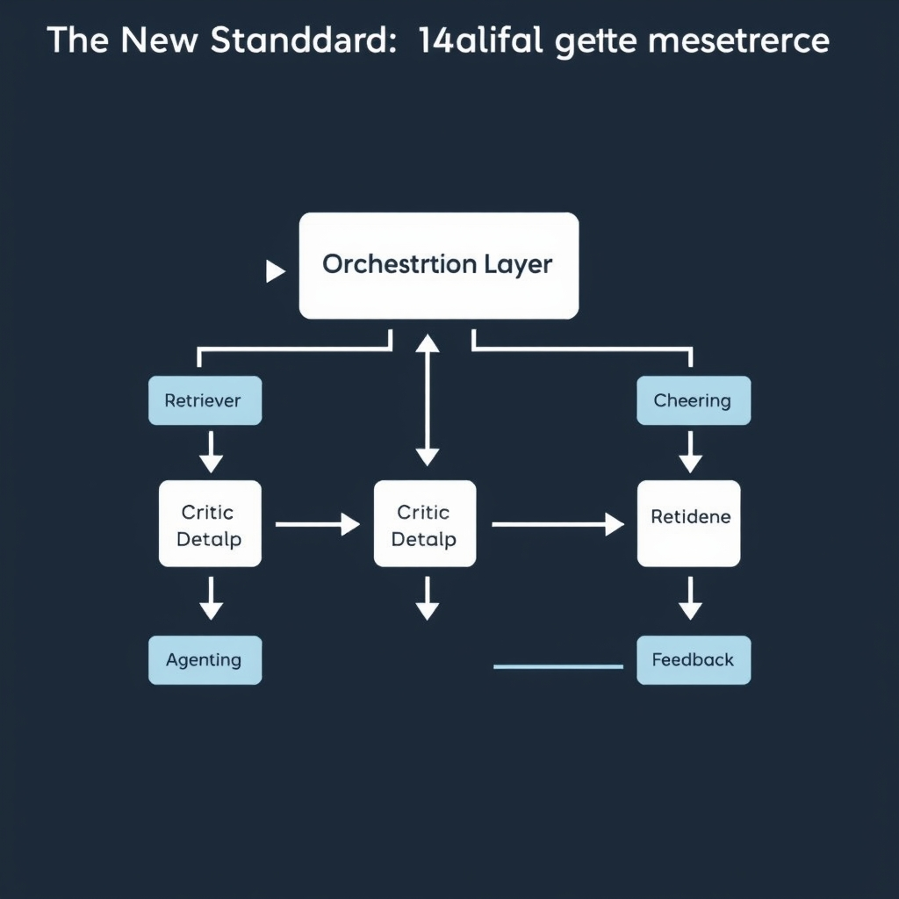
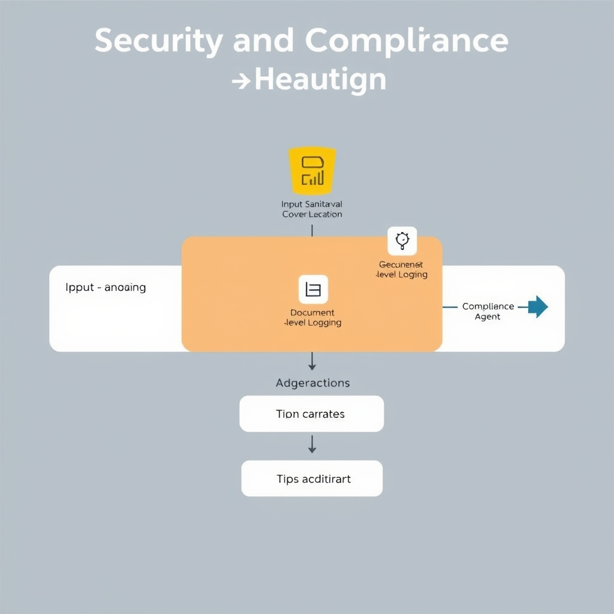
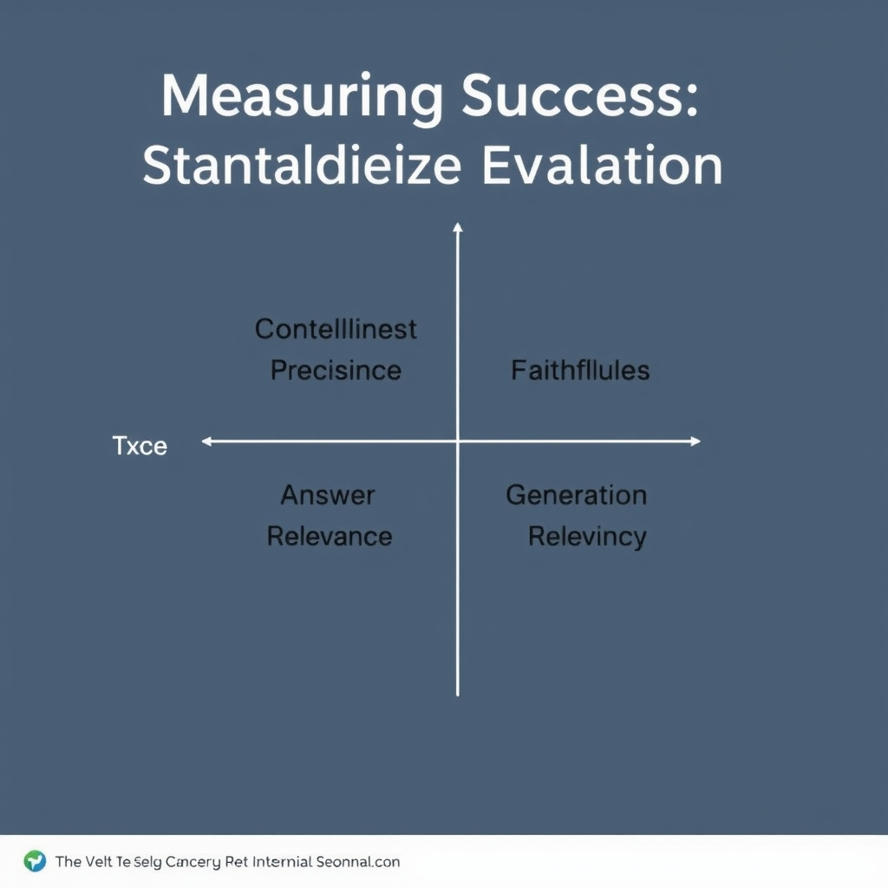

# Beyond the Prototype: Architecting Enterprise-Grade RAG in 2026

## The New Standard: Multi-Agent Orchestration

**From Monolithic Pipelines to Agentic Orchestration**


*Modern enterprise RAG replaces monolithic pipelines with specialized agents for retrieval, critique, compliance, and formatting.*

Traditional RAG implementations chain a single vector‑search component directly into a large language model (LLM). While sufficient for proof‑of‑concept demos, this "retrieval + LLM" pattern collapses under enterprise demands for nuanced reasoning, policy enforcement, and output formatting. As noted by *Defensible RAG: 2026 Enterprise Implementation Best Practices*, modern deployments now treat each functional concern as a dedicated agent rather than a monolithic step【https://techplustrends.com/enterprise-rag-implementation-best-practices-2026】.

______________________________________________________________________

### Core Agents and Their Responsibilities

- **Retriever Agent** – Executes the vector lookup, applies document‑level filters (e.g., tenant, sensitivity tags), and returns a ranked set of passages. It isolates raw similarity logic so that downstream agents never see unvetted vectors.
- **Critic Agent** – Receives the retrieved passages and the user prompt, then performs a sanity check: does the context actually answer the question? It flags hallucinations, assesses relevance, and can request additional chunks before passing the result forward.
- **Compliance Agent** – Encodes regulatory rules (GDPR, EU AI Act, industry‑specific policies) as a rule‑engine. It inspects both the retrieved snippets and the LLM’s draft answer, stripping or redacting prohibited content and rejecting prompts that would trigger disallowed data exposure.
- **Formatting Agent** – Takes the compliant answer and reshapes it to the consumer’s contract (JSON schema, markdown report, or API payload). By separating presentation from generation, the system guarantees consistent output across channels.

These agents communicate through a lightweight orchestration layer (often an event‑driven workflow engine or a LangChain‑style chain). Each step produces a verifiable artifact—metadata, scores, and audit logs—that the next agent can consume, enabling fine‑grained traceability.

______________________________________________________________________

### Why Multi‑Agent Systems Excel at Complex Reasoning & Compliance

1. **Specialized Context Evaluation** – The Critic can invoke chain‑of‑thought prompting or external tools (e.g., calculators) before the LLM generates the final answer, allowing multi‑step reasoning that a single pass cannot achieve.
1. **Policy Isolation** – Compliance logic lives in its own agent, making regulatory updates a matter of rule‑set revision rather than re‑training the LLM or rewriting prompt templates.
1. **Dynamic Adaptation** – If the Critic deems the initial retrieval insufficient, it can trigger a secondary search with adjusted filters, effectively creating a feedback loop that mimics human research.
1. **Auditable Hand‑offs** – Every hand‑off records the agent name, input payload, and decision rationale, satisfying enterprise audit requirements without sacrificing performance.

______________________________________________________________________

### Limitations of Simple "Vector Search + LLM" Prototypes

| Aspect              | Single‑Pipeline Prototype                                             | Multi‑Agent Architecture                                                             |
| ------------------- | --------------------------------------------------------------------- | ------------------------------------------------------------------------------------ |
| **Reasoning Depth** | One‑shot generation; struggles with multi‑step logic.                 | Iterative critique and tool use enable deeper reasoning.                             |
| **Compliance**      | Ad‑hoc prompt guards; easy to miss edge cases.                        | Formal Compliance Agent enforces rule sets deterministically.                        |
| **Error Isolation** | Failures are opaque; debugging requires replaying the whole pipeline. | Each agent logs its own outcome, simplifying root‑cause analysis.                    |
| **Scalability**     | Adding new checks means rewriting prompts.                            | New agents (e.g., a Bias Detector) can be plugged in without touching existing code. |

In practice, enterprises that cling to the monolithic model quickly encounter hidden costs: frequent hallucinations, regulatory breaches, and brittle maintenance. By contrast, an orchestrated suite of Retriever, Critic, Compliance, and Formatting agents provides a modular, auditable, and extensible foundation that scales from pilot to production while meeting the security and governance expectations of modern organizations.

## Security and Compliance by Design

### Prompt Injection & Data Leakage

Enterprise RAG pipelines expose two high‑impact attack surfaces. A **prompt injection** occurs when an adversarial user crafts a query that manipulates the downstream LLM to produce unintended output, potentially leaking proprietary knowledge or violating policy. The risk is amplified because the LLM sees both the user prompt *and* the retrieved context, giving an attacker a vector to inject malicious instructions into the generation step. Mitigations include:

- Sanitizing user inputs before they reach the Retriever Agent.
- Using a **Critic Agent** to flag suspicious prompt patterns.
- Enforcing a whitelist of allowed system prompts.

**Data leakage** arises when the Retriever returns documents that contain sensitive information not intended for the requester. Unfiltered retrieval can inadvertently expose confidential contracts, PII, or trade secrets. To curb this, enterprises must:

- Apply content‑based filters (e.g., regex, entity masking) immediately after retrieval.
- Restrict the retrieval scope to collections the requester is authorized to see.

Both concerns are highlighted in the security analysis of enterprise RAG environments【https://www.daxa.ai/blogs/secure-retrieval-augmented-generation-rag-in-enterprise-environments】.

______________________________________________________________________

### Granular Access Control (RBAC) at the Document Level

Traditional RBAC models grant permissions at the application or database level, which is insufficient for RAG where each query may touch dozens of documents. A **document‑level RBAC** layer ensures that the Retriever Agent only returns vectors associated with documents the caller is permitted to view. Implementation steps:

1. **Metadata tagging** – Store each document’s classification (e.g., `public`, `confidential`, `restricted`) alongside its vector.
1. **Policy engine** – Before executing a similarity search, the engine injects a filter clause that matches the caller’s roles to the document tags.
1. **Dynamic scopes** – For cross‑departmental use cases, combine role hierarchies with attribute‑based access control (ABAC) to express conditions like “Finance & Senior Analyst”.

By embedding RBAC into the retrieval query, you prevent unauthorized vectors from ever entering the LLM prompt, eliminating a whole class of leakage scenarios.

______________________________________________________________________

### Audit Logging for Every Query & Retrieval Step

Regulatory compliance and forensic investigations demand an immutable trail of what was asked, what was retrieved, and what was generated. A robust audit log should capture:

- **User identifier** and role.
- **Timestamp** of the request.
- **Original prompt** (sanitized to remove any injected payload).
- **Retriever output** – list of document IDs, similarity scores, and any filtering actions.
- **Critic/Compliance decisions** – flags raised, reasons for rejection, or modifications applied.
- **LLM response** – final answer presented to the user.

Storing logs in a tamper‑evident system (e.g., append‑only ledger or WORM storage) enables auditors to reconstruct the decision chain and verify that no prohibited data left the system. The Daxa analysis stresses that “failing to rigorously log all queries, retrievals, filtering, and generation steps undermines compliance”【https://www.daxa.ai/blogs/secure-retrieval-augmented-generation-rag-in-enterprise-environments】.

______________________________________________________________________

### Compliance Agents & Regulatory Alignment (EU AI Act)

Modern RAG architectures introduce a dedicated **Compliance Agent** that continuously evaluates retrieved content against regulatory constraints. Its responsibilities include:

- **Policy enforcement** – checking that generated text does not violate prohibited content rules (e.g., disallowed political persuasion under the EU AI Act).
- **Risk scoring** – assigning a compliance risk level to each response based on the sensitivity of the source documents.
- **Escalation** – routing high‑risk queries to a human reviewer or applying stricter sanitization.

The agentic orchestration model described in the Defensible RAG best‑practice guide lists the Compliance Agent alongside Retriever, Critic, and Formatting agents as a core component of enterprise‑grade pipelines【https://techplustrends.com/enterprise-rag-implementation-best-practices-2026】. By codifying regulatory checks into an autonomous service, organizations can achieve **by‑design compliance**, reducing the need for ad‑hoc manual reviews and ensuring that every generation step respects the latest legal standards.

______________________________________________________________________

### Putting It All Together

A production‑ready RAG system therefore layers security and compliance at every stage:

1. **Input sanitization** to thwart prompt injection.
1. **Document‑level RBAC** to limit retrieval to authorized data.
1. **Real‑time filtering** to prevent accidental leakage.
1. **Comprehensive audit logging** for traceability.
1. **Compliance Agent** to enforce regulations such as the EU AI Act.

When these controls are baked into the architecture rather than bolted on after the fact, enterprises can move confidently from prototype to a governed, auditable RAG service that meets both business and legal requirements.


*Security and compliance are not add-ons; they are integrated controls at every stage of the RAG pipeline.*

## Measuring Success: Standardized Evaluation


*The four core metrics for RAG evaluation, balancing retrieval performance with generation accuracy.*

### Core Evaluation Metrics for Enterprise RAG

Enterprise‑grade Retrieval‑Augmented Generation must be judged on more than raw relevance. Four metrics have emerged as the de‑facto standard:

| Metric                | What it measures                                                                                     | Why it matters                                                                   |
| --------------------- | ---------------------------------------------------------------------------------------------------- | -------------------------------------------------------------------------------- |
| **Faithfulness**      | The degree to which the generated answer is factually consistent with the retrieved source material. | Prevents hallucinations that can breach compliance or damage trust.              |
| **Answer Relevance**  | How well the answer addresses the user's intent, regardless of source fidelity.                      | Directly ties to user satisfaction and business value.                           |
| **Context Precision** | The proportion of retrieved documents that are truly pertinent to the query.                         | Reduces noise, limits data exposure, and improves downstream generation quality. |
| **Context Recall**    | The fraction of all relevant documents that the retriever successfully returns.                      | Ensures critical knowledge is not omitted, a key compliance requirement.         |

These dimensions are described in detail by Atlan’s RAG evaluation guide, which also notes that they are implemented by the leading open‑source frameworks [1](https://atlan.com/know/how-to-evaluate-rag-systems-explained).

______________________________________________________________________

### Open‑Source Frameworks that Operationalize the Metrics

| Framework    | Metrics Covered                            | Notable Features                                                       |
| ------------ | ------------------------------------------ | ---------------------------------------------------------------------- |
| **RAGAS**    | Faithfulness, Relevance, Precision, Recall | Provides a unified scoring API and supports custom reference datasets. |
| **DeepEval** | Faithfulness, Relevance                    | Offers model‑agnostic prompts for automated fact‑checking.             |
| **TruLens**  | Precision, Recall                          | Integrates with LangChain pipelines and visualizes retrieval heatmaps. |
| **ARES**     | All four metrics                           | Emphasizes regulatory reporting, exporting audit‑ready logs.           |

All four tools are actively maintained in 2026 and can be swapped into a production pipeline without code rewrites, thanks to their common JSON schema for metric results.

______________________________________________________________________

### Automating Evaluation in a CI/CD Pipeline

1. **Define a test suite** containing representative queries and a ground‑truth corpus (e.g., a snapshot of the knowledge base).
1. **Add a step** in the pipeline that runs the chosen evaluation framework against the latest model and retriever build.
1. **Publish the metric JSON** as an artifact; use a dashboard (Grafana, Kibana) to track trends over time.
1. **Gate merges** on threshold checks – for example, reject a PR if faithfulness drops below 92 % or context recall falls under 85 %.

Because the metrics are deterministic given the same inputs, failures are reproducible, enabling rapid rollback of a regression‑inducing change. This approach mirrors best practices in software testing and satisfies audit requirements for traceable model updates.

______________________________________________________________________

### From Anecdotal Testing to Data‑Driven Monitoring

Early prototypes often rely on ad‑hoc prompt experiments and manual inspection of a handful of answers. While useful for proof‑of‑concept, that method cannot scale to the volume and regulatory scrutiny of enterprise deployments. By institutionalizing the four core metrics and integrating them into CI/CD, teams shift from "does it look right?" to "does it meet quantified standards?".

The transition brings several concrete benefits:

- **Predictable quality** – statistical baselines make it clear when a new data source or model version degrades performance.
- **Compliance evidence** – audit logs of metric scores satisfy regulators demanding proof of model reliability.
- **Continuous improvement** – trend analysis highlights systematic gaps (e.g., low context recall) that can be addressed by retriever tuning or richer indexing.

In sum, a standardized, automated evaluation framework is the linchpin that turns a promising RAG prototype into a reliable, governed enterprise asset.

## Infrastructure: The Case for pgvector

### Evaluating Vector Store Choices

| Aspect                   | Dedicated Vector DB (e.g., Pinecone, Milvus)                                  | General‑Purpose DB + pgvector                                                                                   |
| ------------------------ | ----------------------------------------------------------------------------- | --------------------------------------------------------------------------------------------------------------- |
| **Scalability**          | Built‑in sharding, automatic scaling for billions of vectors.                 | Relies on PostgreSQL's scaling mechanisms; horizontal scaling requires logical replication or Citus extensions. |
| **Operational Overhead** | Separate service, distinct monitoring, backup, and security stack.            | Single‑stack deployment; existing Postgres tooling (pgAdmin, WAL archiving) applies.                            |
| **Feature Set**          | Advanced ANN algorithms, hybrid search, metadata‑rich filters out‑of‑the‑box. | Supports cosine, inner‑product, and L2 via `pgvector`; complex filters must be expressed in SQL.                |
| **Cost**                 | Managed pricing per query/GB; can be high at scale.                           | License‑free; cost tied to existing Postgres infrastructure.                                                    |
| **Compliance**           | Vendor‑specific certifications; data residency may be limited.                | Leverages PostgreSQL's mature audit, RBAC, and encryption capabilities, simplifying compliance.                 |

The trade‑off is clear: dedicated vector stores excel when you need massive scale, ultra‑low latency, or specialized ANN algorithms. However, they introduce a second operational surface and often come with higher cloud spend. For many enterprises—especially those just launching a production RAG pipeline—pgvector offers a pragmatic balance of performance, cost, and governance.

### Why pgvector Is the Recommended Starting Point

The 2026 production guide notes that *"if you’re starting a new production RAG project today and you don’t have a strong reason to pick something else, start with pgvector on Postgres"*【https://medium.com/@pratik-rupareliya/top-15-vector-databases-in-2026-a-production-decision-guide-from-100-enterprise-deployments-dd58a04f51a5】. PostgreSQL already provides:

- **Mature security model** (row‑level security, RBAC, audit logging) that aligns with enterprise policies.
- **Transactional guarantees** ensuring that vector insertions and deletions are atomic with associated metadata.
- **Ecosystem integration**: the same backup, monitoring, and disaster‑recovery pipelines used for relational data apply to vector data.
- **Flexibility**: you can prototype with simple `SELECT … ORDER BY embedding <=> query_vector LIMIT k` and later switch to a dedicated store without rewriting business logic.

### When to Migrate to a Specialized Vector Database

Consider a migration when any of the following thresholds are met:

- **Dataset size > 200 M vectors** and query latency consistently exceeds 50 ms.
- **Need for custom ANN indexes** (e.g., HNSW with tuned ef‑construction) not supported by pgvector.
- **High query concurrency** (≥10 k QPS) that outpaces PostgreSQL's connection handling.
- **Regulatory constraints** requiring a vendor‑certified AI‑specific service.

At that point, a lift‑and‑shift can be orchestrated by exporting the `embedding` column to the target store and updating the retrieval agent to call the new API.

### Basic pgvector Search Query

```sql
-- Ensure the pgvector extension is installed
CREATE EXTENSION IF NOT EXISTS vector;

-- Example table storing documents and their embeddings
CREATE TABLE documents (
    id          SERIAL PRIMARY KEY,
    title       TEXT,
    content     TEXT,
    embedding   VECTOR(768)  -- dimensionality matches the LLM encoder
);

-- Insert a sample embedding (placeholder values)
INSERT INTO documents (title, content, embedding)
VALUES ('Sample', 'Lorem ipsum', '[0.12,0.34, … ,0.56]');

-- Perform a similarity search for the 5 most relevant rows
WITH query AS (
    SELECT '[0.11,0.33, … ,0.55]'::VECTOR AS q_vec
)
SELECT d.id, d.title, d.content,
       d.embedding <=> q.q_vec AS distance  -- L2 distance operator
FROM documents d, query q
ORDER BY distance
LIMIT 5;
```

The `<=>` operator computes Euclidean distance; replace it with `<#>` for cosine similarity if preferred. This snippet demonstrates a production‑ready pattern: a CTE for the query vector, a deterministic distance calculation, and an `ORDER BY` to retrieve the top‑k matches.

By starting with pgvector, teams gain immediate access to a secure, transactionally consistent vector store while preserving the option to scale out to a dedicated engine as usage patterns evolve.

## Conclusion: Building for the Long Term

The journey from a proof‑of‑concept "vector search + LLM" to a governed enterprise RAG platform is now a multi‑stage migration:

- **Prototype phase** – a single retrieval pipeline that optimises raw relevance but leaves security, auditability and compliance as after‑thoughts.
- **Governed phase** – an agentic orchestration layer (Retriever, Critic, Compliance, Formatting) that enforces policy, validates output, and formats results for downstream systems. This shift is documented in the 2026 Defensible RAG best‑practice guide, which notes that modern deployments replace a monolithic pipeline with dedicated agents to handle complex reasoning and regulatory checks【https://techplustrends.com/enterprise-rag-implementation-best-practices-2026】.

Reliability and compliance now outweigh raw speed as the primary success metrics. Enterprises must measure **faithfulness**, **answer relevance**, **context precision**, and **context recall**—the four core metrics that open‑source frameworks such as RAGAS and TruLens expose【https://atlan.com/know/how-to-evaluate-rag-systems-explained】. Coupled with strict RBAC, prompt‑injection defenses, and immutable audit logs (as highlighted by Daxa.ai)【https://www.daxa.ai/blogs/secure-retrieval-augmented-generation-rag-in-enterprise-environments】, these metrics ensure that every query is both accurate and compliant.

Looking ahead, a **modular architecture**—where each agent, security component, and evaluation harness can be swapped or upgraded independently—future‑proofs the investment against rapid AI advances and evolving regulations. By treating RAG as a composable service rather than a monolith, organisations can scale responsibly while maintaining the agility to adopt new models, vector stores, or compliance frameworks as the market (projected to near $10 B by 2030) matures【https://www.sphereinc.com/blogs/best-enterprise-rag-platforms-2026】.