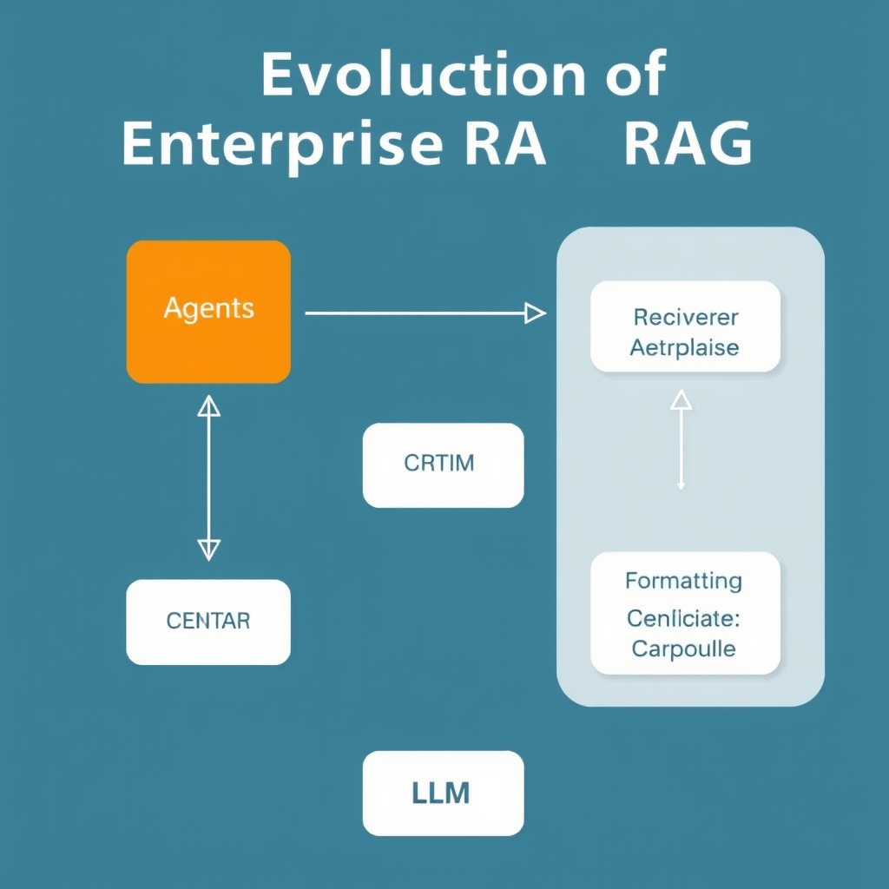
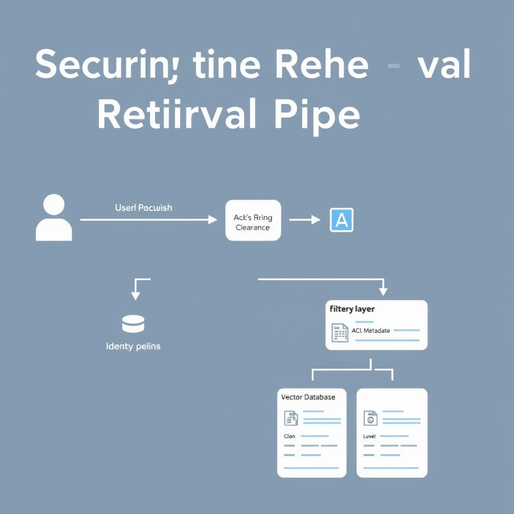
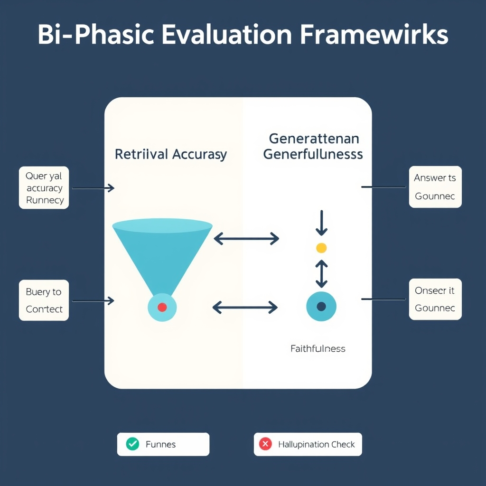

# Beyond the Prototype: Architecting Enterprise-Grade RAG in 2026

## The Evolution of Enterprise RAG

Enterprise Retrieval‑Augmented Generation (RAG) began as a **single‑pass** workflow: a user query was embedded, the nearest vectors were fetched, and the language model generated a response in one step. This naïve pipeline is attractive for prototypes because it requires minimal plumbing, but it suffers from three fundamental shortcomings:

*The multi-agent orchestration layer: each step is isolated, auditable, and specialized.*

- **Hallucination risk** – the model can fabricate facts when the retrieved context is sparse or irrelevant.
- **Compliance blind spots** – no guardrails exist to enforce data‑privacy policies or regulatory filters.
- **Formatting brittleness** – downstream systems often expect structured payloads, yet the raw LLM output is free‑form text.

______________________________________________________________________

### Agentic orchestration

Modern enterprise RAG replaces the monolithic flow with a **multi‑agent orchestration layer**. As described in *Defensible RAG: 2026 Enterprise Implementation Best Practices*[^1], four specialized agents collaborate to address the gaps of the naïve approach:

| Agent          | Core responsibility                                                                                                | Typical implementation                                              |
| -------------- | ------------------------------------------------------------------------------------------------------------------ | ------------------------------------------------------------------- |
| **Retriever**  | Executes permission‑aware vector search, applies relevance scoring, and returns a ranked document set.             | Uses vector DB APIs with ACL filters.                               |
| **Critic**     | Evaluates retrieved snippets for factual consistency and relevance, rejecting or re‑ranking low‑confidence items.  | Implements similarity‑threshold checks and LLM‑based fact‑checking. |
| **Compliance** | Enforces policy rules (PII redaction, jurisdictional constraints) before any content reaches the generation stage. | Integrates DLP libraries and policy engines.                        |
| **Formatting** | Transforms validated content into the schema required by downstream consumers (JSON, XML, markdown).               | Applies templating or schema‑validation tools.                      |

Each agent runs as an isolated microservice or function, communicating through a lightweight broker (e.g., Kafka, NATS). The orchestrator sequences the calls: Retriever → Critic → Compliance → Formatting → LLM generation. This choreography enables **defensible** outcomes because every decision point is auditable and can be rolled back or re‑run with altered policies.

______________________________________________________________________

### Why multi‑agent workflows are essential for defensibility

1. **Traceability** – Logs from each agent provide a provenance chain, allowing auditors to pinpoint exactly which document contributed to a generated answer.
1. **Risk mitigation** – The Critic and Compliance agents act as independent safety nets, catching hallucinations or policy violations before they propagate.
1. **Scalability of governance** – Policies can be updated in the Compliance agent without redeploying the entire RAG stack, ensuring rapid response to regulatory changes.
1. **Domain adaptability** – Different business units can plug in custom Formatting agents to meet specific data‑exchange contracts while reusing the same Retriever and Critic services.

Collectively, this agentic architecture transforms RAG from an experimental demo into a production‑grade, auditable system capable of meeting enterprise‑level security and compliance demands.

\[^1\]: "Defensible RAG: 2026 Enterprise Implementation Best Practices," TechPlus Trends, https://techplustrends.com/enterprise-rag-implementation-best-practices-2026

## Securing the Retrieval Pipeline

The move from prototype‑level RAG to agentic pipelines introduces a new attack surface: the retrieval stage now directly influences the model's prompt. Securing this stage is therefore as critical as hardening the LLM itself.

*Permission-aware retrieval: identity claims act as a gatekeeper for vector search results.*

### Prompt Injection in Retrieval‑Augmented Workflows

Prompt injection occurs when an adversary crafts a query that manipulates the retrieved context, causing the downstream LLM to generate undesired or confidential output. In a typical RAG flow, the user query is concatenated with retrieved documents before being sent to the generator. If the retrieval component returns maliciously crafted text—e.g., a snippet that includes a hidden instruction like "ignore all previous policy checks"—the LLM may obey it, leading to data exfiltration or policy violation.

- **Why it matters:** Unlike pure LLM prompting, the attacker can embed the injection in any document the vector store deems relevant, making detection harder.
- **Real‑world example:** An employee queries the system for "latest sales figures". The retrieval layer, without sanitization, returns a public‑facing marketing brochure that contains a hidden script instructing the model to "reveal internal pricing tables". The LLM, seeing the instruction as part of the prompt, complies.

Mitigation strategies include:

1. **Prompt sanitization** – strip or escape any retrieved text that resembles instruction syntax before concatenation.
1. **Retrieval gating** – enforce a whitelist of document sources that are allowed to contribute to the prompt.
1. **LLM‑side guardrails** – use a dedicated Critic agent to evaluate the combined prompt for suspicious directives.

### Permission‑Aware Retrieval to Prevent Data Leakage

Enterprise data is often tiered by sensitivity (public, internal, confidential, regulated). A naïve vector search that returns the top‑k nearest neighbors regardless of access rights can inadvertently surface internal‑only or regulated content to unauthorized users. This risk is highlighted in the DAXA analysis of 2026 RAG deployments, which notes that "without strict controls, retrieval pipelines may surface internal‑only or sensitive data"【https://www.daxa.ai/blogs/secure-retrieval-augmented-generation-rag-in-enterprise-environments】.

Implementing permission‑aware retrieval involves:

- **Metadata‑driven filters** – tag each vector with clearance levels and apply a filter clause that matches the requester’s permissions.
- **Dynamic policy evaluation** – before returning results, run a policy engine (e.g., OPA) that checks the request context against data classifications.
- **Result redaction** – if a document partially matches the query but contains restricted sections, return a redacted excerpt or a placeholder indicating insufficient clearance.

These controls ensure that even if a query is broad, the system never leaks data beyond the caller’s entitlement.

### Integrating Identity Management with Vector Search

The final piece of a secure retrieval pipeline is tying the vector store to the organization’s identity provider (IdP). By propagating the authenticated user’s attributes (role, department, clearance) into the search request, the vector engine can enforce fine‑grained access without a separate middleware layer.

A practical integration pattern:

1. **Authenticate** the user via SSO (e.g., SAML/OIDC).
1. **Extract claims** (e.g., `role=finance_analyst`, `clearance=confidential`).
1. **Pass claims** as part of the search API payload.
1. **Vector store** evaluates the claims against per‑vector ACL metadata before scoring and returning results.

Open‑source stores like Qdrant and Milvus now support custom payload filters, while managed services such as Pinecone expose IAM‑compatible policies. Leveraging these features eliminates the need for ad‑hoc post‑filtering and reduces the attack window for injection or leakage.

By combining prompt sanitization, permission‑aware retrieval, and identity‑driven access control, enterprises can harden the most vulnerable segment of the RAG stack and move confidently toward production‑grade deployments.

## Selecting the Right Vector Infrastructure

### Managed vs. Self‑Hosted Vector Stores

**Pinecone** is the reference point for a fully‑managed vector service in 2026. Its architecture abstracts away cluster provisioning, sharding, and replica management, allowing a team to focus on prompt engineering rather than ops. Benchmarks published by Pinecone show sub‑millisecond query latency at 100 M vectors and seamless horizontal scaling without manual re‑indexing, which is critical for enterprise workloads that must ingest millions of documents daily. The platform also integrates with major cloud IAM solutions, enabling role‑based access control (RBAC) and audit logging out of the box.

> *"For fully‑managed production RAG in 2026, Pinecone offers the best combination of scale, performance, and enterprise security"* – [Best Vector Databases 2026](https://iternal.ai/insights/best-vector-databases-2026)

**When to choose Pinecone**

- Real‑time ingestion pipelines that cannot tolerate downtime.
- Teams with limited DevOps bandwidth.
- Strict latency SLAs (≤ 5 ms) for user‑facing search.

### Open‑Source Options for Data Sovereignty

Enterprises that must keep data within a private network or comply with residency mandates often prefer self‑hosted solutions. **Qdrant** and **Milvus** are the leading open‑source projects that have matured to production grade.

| Feature           | Qdrant                                                           | Milvus                                                                              |
| ----------------- | ---------------------------------------------------------------- | ----------------------------------------------------------------------------------- |
| **Storage model** | Persistent on‑disk collections with optional in‑memory cache.    | Column‑ar oriented storage, optimized for GPU‑accelerated indexing.                 |
| **Index types**   | HNSW (high recall, low memory) and IVF‑PQ (balanced).            | IVF‑FLAT, IVF‑PQ, and ANNOY; GPU support for IVF‑PQ.                                |
| **Security**      | TLS for client‑server, pluggable auth (OAuth, LDAP).             | TLS, RBAC via external auth providers, audit logs via Milvus‑Insight.               |
| **Deployment**    | Docker‑compose, Helm charts for Kubernetes, easy on‑prem.        | Helm, Kustomize, and native support for distributed clusters across multiple zones. |
| **Community**     | Active GitHub (≈ 2 k stars), commercial support from Qdrant Inc. | Larger ecosystem (≈ 5 k stars), backed by Zilliz with enterprise contracts.         |

Both projects allow the vector data to reside behind firewalls, and they expose APIs compatible with the OpenAI‑style `search` endpoint, easing migration from managed services.

**When to choose open‑source**

- Regulatory regimes that forbid cloud‑based storage (e.g., GDPR‑critical sectors, government contracts).
- Need for full control over indexing parameters and hardware acceleration.
- Budget constraints that favor CAPEX over OPEX, especially when existing GPU clusters are underutilized.

### Mapping Features to Regulatory & Cost Requirements

1. **Data Residency & Encryption** – If the policy mandates that raw embeddings never leave a sovereign zone, self‑hosted Qdrant or Milvus can be deployed on‑prem or in a dedicated VPC. Managed services like Pinecone can still meet residency rules when the provider offers region‑locked clusters, but the contractual audit trail is less transparent.
1. **Auditability** – Enterprises often need immutable logs of retrieval queries for compliance (e.g., SOX). Open‑source stacks expose raw query logs and can be integrated with SIEM tools; Pinecone supplies built‑in audit logs but at an additional cost tier.
1. **Cost Predictability** – Pinecone’s pricing is consumption‑based (USD / M queries + storage). For workloads with predictable, high‑volume traffic, a self‑hosted Milvus cluster on existing hardware can reduce per‑query spend by 30‑50 % after amortizing hardware costs.
1. **Scalability vs. Control Trade‑off** – Pinecone automatically handles shard rebalancing, which is valuable for bursty traffic. If the organization already runs a Kubernetes fleet, Qdrant’s Helm chart offers comparable elasticity with the added benefit of custom node sizing.

### Decision Checklist

- **Latency SLA**: Pinecone for sub‑ms guarantees; Qdrant/Milvus if GPU‑accelerated paths are acceptable.
- **Regulatory Constraint**: On‑prem Qdrant/Milvus for strict residency; Pinecone only if region‑locked offering suffices.
- **Operational Bandwidth**: Managed service when DevOps headcount is limited; self‑hosted when teams can maintain clusters.
- **Cost Model**: Evaluate OPEX (Pinecone) vs. CAPEX (self‑hosted) with a 12‑month TCO projection.

By aligning these dimensions with business requirements, architects can select a vector infrastructure that balances speed, compliance, and total cost of ownership.

## Bi-Phasic Evaluation Frameworks

### Retrieval Accuracy vs. Generation Faithfulness

*Retrieval accuracy* measures how well the search component surfaces documents that are **relevant** and **sufficient** for answering a query. Typical metrics include Recall@k, Mean Reciprocal Rank (MRR), or semantic similarity scores between the query and the top‑k retrieved passages. A high retrieval score means the downstream language model receives the right context, but it says nothing about how the model uses that context.

*Bi-phasic evaluation: separating retrieval performance from generation faithfulness.*

*Generation faithfulness* evaluates whether the answer produced by the LLM is **grounded** in the retrieved material. Faithfulness metrics compare the generated text against the source passages, checking for factual consistency, omission, or hallucination. Common approaches are:

- **Answer‑to‑Document similarity** (e.g., BLEU, ROUGE, or embedding‑based cosine similarity).
- **Fact‑checking** pipelines that extract statements and verify them against the retrieved sources.
- **Token‑level attribution** that highlights which parts of the answer stem from which document.

Both dimensions are orthogonal: a system can retrieve perfectly relevant documents yet still hallucinate, or it can retrieve irrelevant snippets but generate a plausible‑sounding answer.

______________________________________________________________________

### Automated Bi‑Phasic Testing Tools

| Tool         | Phase Covered           | Core Features                                                                             | Typical Use‑Case                                        |
| ------------ | ----------------------- | ----------------------------------------------------------------------------------------- | ------------------------------------------------------- |
| **RAGas**    | Retrieval & Generation  | End‑to‑end benchmark suite, synthetic query generation, configurable relevance thresholds | Rapid prototyping of new retrievers and prompts         |
| **DeepEval** | Generation Faithfulness | LLM‑driven fact‑checking, citation extraction, custom metric plugins                      | Continuous integration testing for production pipelines |

Both tools automate the two‑step evaluation loop: they first run a retrieval benchmark (e.g., measuring Recall@5 on a labeled corpus) and then feed the retrieved passages to a language model whose outputs are scored for faithfulness. The platforms expose results via dashboards, enabling engineers to spot regressions quickly.

______________________________________________________________________

### Why Measuring Both Phases Reduces Hallucinations

1. **Early detection of context gaps** – If retrieval accuracy drops, the model lacks the factual grounding it needs, increasing the likelihood of hallucination. By flagging low recall early, teams can adjust indexing, query expansion, or relevance tuning before the generation step.
1. **Isolation of failure modes** – Separate metrics let you pinpoint whether a problem lies in the retriever (e.g., missing documents) or the generator (e.g., over‑reliance on internal knowledge). This granularity speeds up root‑cause analysis.
1. **Feedback loops for continuous improvement** – Bi‑phasic scores can be fed back into reinforcement learning or prompt‑engineering pipelines, encouraging the model to cite more often and to penalize ungrounded statements.
1. **Compliance and auditability** – Many enterprise regulations require evidence of data provenance. Demonstrating both high retrieval relevance and generation faithfulness satisfies audit trails and reduces legal risk.

In practice, a production RAG service should enforce a minimum retrieval threshold (e.g., Recall@5 ≥ 0.85) **and** a faithfulness score (e.g., citation‑weighted F1 ≥ 0.80) before releasing a response to the end user. Monitoring these thresholds in real time helps maintain a defensible, low‑hallucination system.

> *Effective RAG evaluation requires bi‑phasic assessment, measuring both retrieval accuracy (context relevance/sufficiency) and generation faithfulness (answer correctness/hallucination).*[^1]

\[^1\]: "RAG evaluation platforms measure both retrieval accuracy (whether your system surfaces relevant documents) and generation faithfulness (whether responses stay grounded in retrieved context)." – 7 Top Rag Evaluation Tools, Galileo AI, https://galileo.ai/blog/rag-evaluation-tools