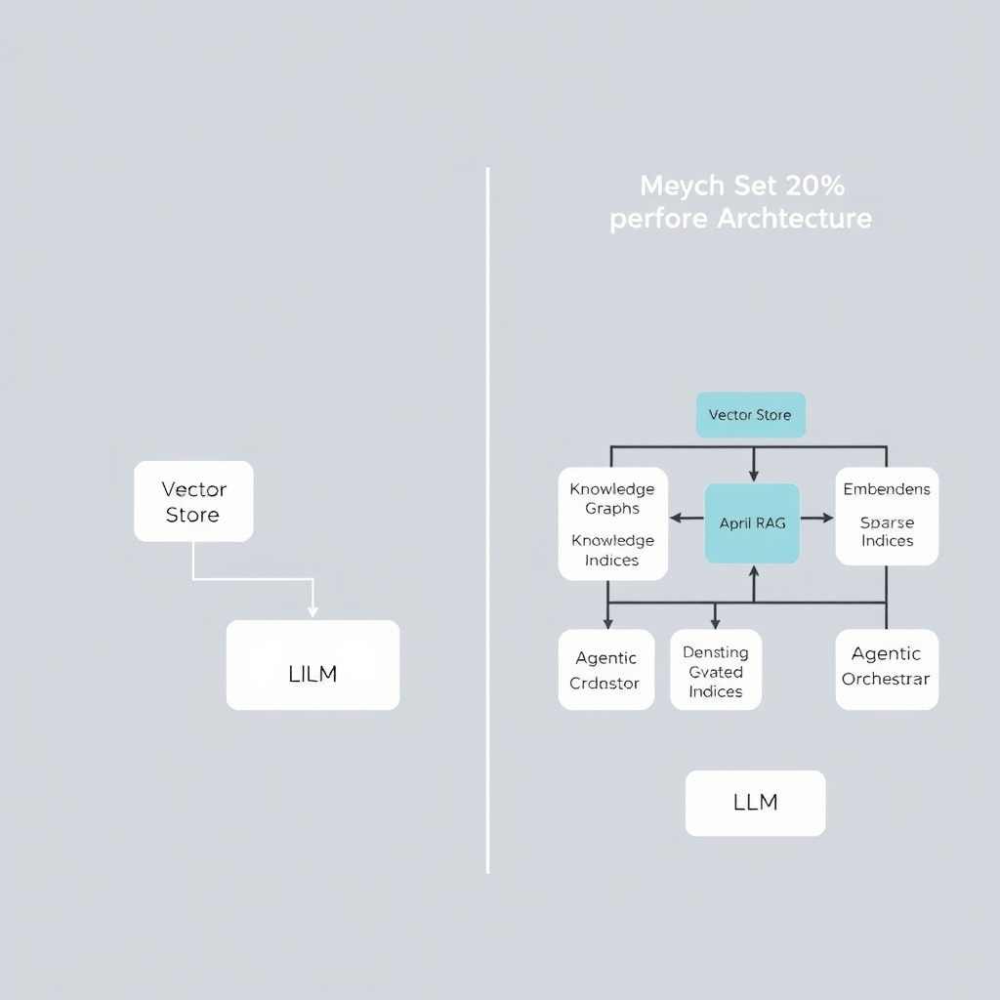
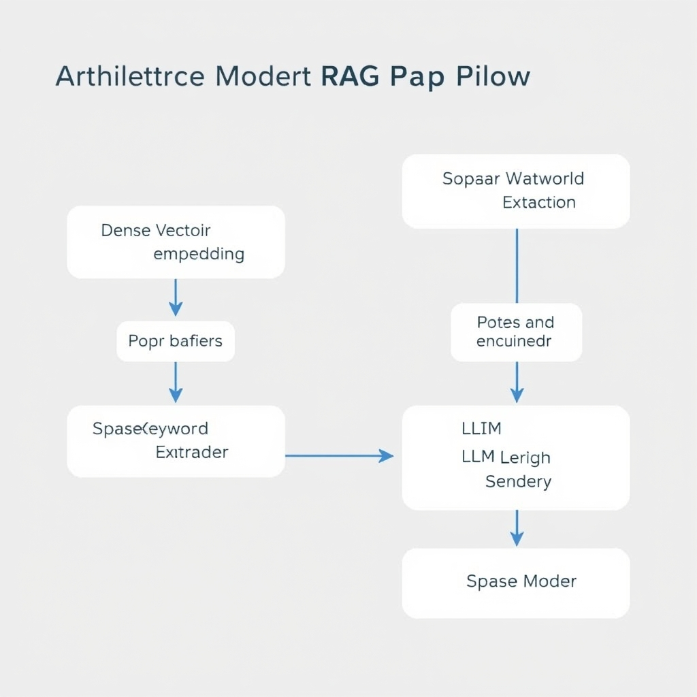
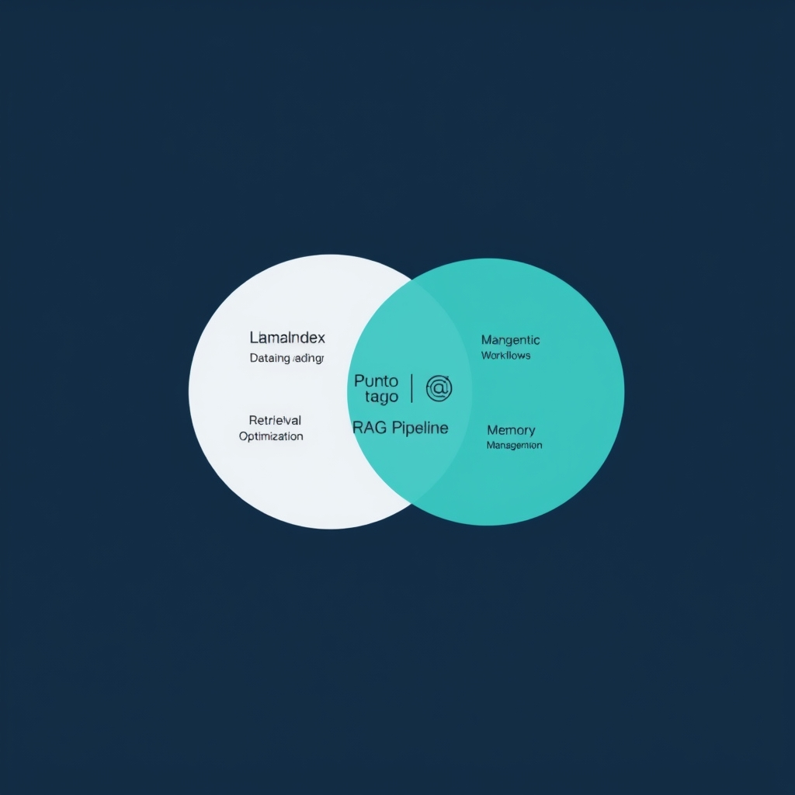

# Beyond Vector Search: Architecting Production RAG in 2026

## The State of Vector Infrastructure in 2026

The vector database market in 2026 is characterized by a shift from simple storage to intelligent retrieval, with several key players dominating the landscape. According to a comparison of top vector databases, Pinecone, Qdrant, Weaviate, Milvus, and Chroma are among the leading solutions, each serving distinct use cases. For instance, Pinecone offers the best combination of scale, performance, and enterprise security for fully-managed production RAG, while Weaviate and Milvus are proven choices for open-source flexibility.


*The shift from simple vector-only storage to multi-modal, agentic retrieval architectures.*

### Market Maturity

A key distinction in the market is between managed services like Pinecone and self-hosted engines like Qdrant and Milvus. Managed services provide ease of use and scalability, but may lack the customization options of self-hosted solutions.

### Engine Distinction

In terms of performance, Qdrant has demonstrated the fastest p50 query latency at 4ms in standardized benchmarks. This highlights the importance of considering latency when selecting a vector database.

### Limitations of Vector-Only Search

However, 'vector-only' search is insufficient for modern production requirements, which often involve complex, multi-modal, and agentic retrieval architectures. Specialized engines are needed to meet enterprise performance SLAs, particularly in applications that require low-latency and high-throughput.

### Specialized Engines

The role of specialized engines in meeting these requirements cannot be overstated. By providing optimized solutions for specific use cases, these engines enable organizations to build high-performance RAG pipelines that can handle complex retrieval tasks. As the market continues to evolve, the importance of selecting the right vector engine for specific technical requirements will only continue to grow.

## Selecting Your Engine: Performance vs. Scale

When selecting a vector database engine, it's essential to consider the trade-offs between performance and scale. For real-time applications, Qdrant's 4ms p50 latency advantage is a significant factor, as demonstrated in standardized benchmarks conducted in Q1 2026. On the other hand, Milvus is well-suited for billion-scale, high-throughput deployments, offering a robust solution for large-scale applications.

### Evaluating Engine Options

- **Qdrant**: Ideal for real-time applications with low-latency requirements, Qdrant offers a high-performance solution with its 4ms p50 latency advantage.
- **Milvus**: Designed for large-scale deployments, Milvus provides a scalable solution for high-throughput applications.
- **Managed vs. Open-Source**: The choice between managed services like Pinecone and open-source engines like Qdrant and Milvus depends on the need for convenience versus control. Managed services offer ease of use and enterprise-grade security, while open-source engines provide flexibility and customization options.
- **Security and Compliance**: For enterprise-grade deployments, security and compliance considerations are crucial. Factors such as data encryption, access controls, and auditing capabilities must be evaluated when selecting a vector database engine.

Ultimately, the choice of vector database engine depends on the specific technical requirements of the application. By considering factors such as performance, scale, and security, developers can select the most suitable engine for their use case and build a robust foundation for their RAG pipeline.

## Architecting Modern RAG Pipelines

The integration of vector databases into advanced retrieval architectures is crucial for modern applications. Moving beyond simple semantic search, Hybrid RAG (dense + sparse) architectures offer improved performance by combining the strengths of both dense and sparse retrieval methods.


*A hybrid RAG pipeline architecture that combines dense semantic search with sparse keyword retrieval for improved accuracy.*

- Implementing GraphRAG to capture relational context between data points allows for more nuanced understanding and retrieval of complex data.
- The role of Agentic RAG in multi-step reasoning and tool selection enables more sophisticated decision-making processes.
  To illustrate this, consider a basic hybrid retrieval query structure, which might look like the following:

```python
import numpy as np
from qdrant_client import QdrantClient

# Initialize the Qdrant client
client = QdrantClient(host='localhost', port=6333)

# Define the query vector
query_vector = np.array([1.0, 2.0, 3.0])

# Define the query filter
query_filter = {
    'must': [
        {'key': 'tag', 'value': 'example'}
    ]
}

# Define the sparse vector query (e.g., using BM25 or keyword search)
sparse_query = {
    'query': 'example keyword',
    'vector': query_vector
}

# Perform the hybrid search using Qdrant's search_batch or hybrid search API
response = client.search_batch(
    vectors=[query_vector],
    filters=[query_filter],
    sparse_queries=[sparse_query],
    limit=10
)

# Print the results
for point in response:
    print(point.id, point.score, point.payload)
```

This example demonstrates how to use Qdrant to perform a hybrid search with a query vector, a filter, and a sparse vector query. By leveraging these advanced architectures and integrating them with vector databases, developers can build more powerful and flexible retrieval systems.

## Orchestration: LlamaIndex and LangChain Synergy

The integration of vector databases into modern retrieval architectures is crucial for their effectiveness. To manage the retrieval lifecycle, industry-standard frameworks such as LlamaIndex and LangChain are often utilized in tandem.


*LlamaIndex and LangChain serve complementary roles, with LlamaIndex focusing on data retrieval and LangChain on agentic orchestration.*

- Production stacks frequently employ both LlamaIndex and LangChain due to their complementary strengths.
- LlamaIndex is primarily used for data ingestion, indexing, and retrieval optimization, streamlining the process of preparing and querying data.
- LangChain and its extension LangGraph, on the other hand, focus on orchestration, memory management, and facilitating agentic workflows. This includes handling multi-step reasoning and tool selection, which are essential for complex, architecture-driven retrieval systems.
- When integrating these frameworks, it's essential to avoid common pitfalls such as misconfiguring data pipelines or underestimating the computational resources required for large-scale deployments.
  As evidenced by [LangChain vs LlamaIndex (2026): Complete Production RAG Comparison](https://www.premai.io/blog/langchain-vs-llamaindex-2026-complete-production-rag-comparison), many production stacks leverage the synergy between LlamaIndex and LangChain to achieve efficient and scalable retrieval architectures.
  By understanding how to effectively orchestrate vector databases with these frameworks, developers can build high-performance RAG pipelines that meet the demands of modern applications.

## Conclusion: Building for the Future

In conclusion, the vector database landscape has undergone a significant shift in 2026, from a focus on raw embedding storage to a more nuanced emphasis on supporting complex, multi-modal, and agentic retrieval architectures. As outlined in the [Best Vector Databases 2026](https://iternal.ai/insights/best-vector-databases-2026), the market is now dominated by key players such as Pinecone, Qdrant, Weaviate, Milvus, and Chroma, each serving distinct use cases. The transition from storage-centric to intelligence-centric RAG systems is well underway, with production-grade systems becoming more specialized, intelligent, and architecture-driven, as noted in [5 RAG Architectures for AI Engineers to Know in 2026](https://www.linkedin.com/posts/brijpandeyji_rag-is-no-longer-just-vector-search-llm-activity-7467221569761832962-xgVn). When choosing infrastructure for these systems, it is crucial to prioritize architectural flexibility over vendor lock-in, ensuring that the selected vector engine can adapt to evolving requirements and integrate seamlessly with frameworks like LangChain and LlamaIndex, which are [evolving to handle complex orchestration and data-centric workflows](https://www.premai.io/blog/langchain-vs-llamaindex-2026-complete-production-rag-comparison). By doing so, developers can future-proof their RAG pipelines and unlock the full potential of vector databases in driving innovative, AI-powered applications.