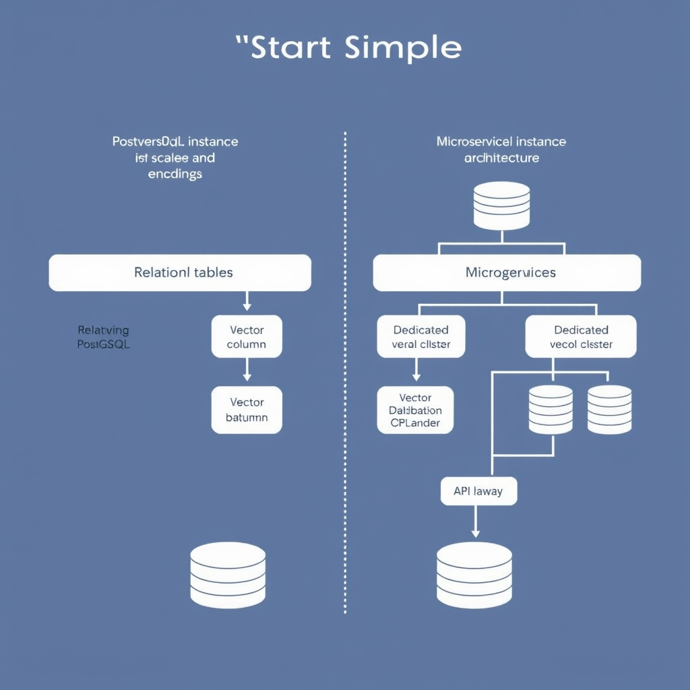
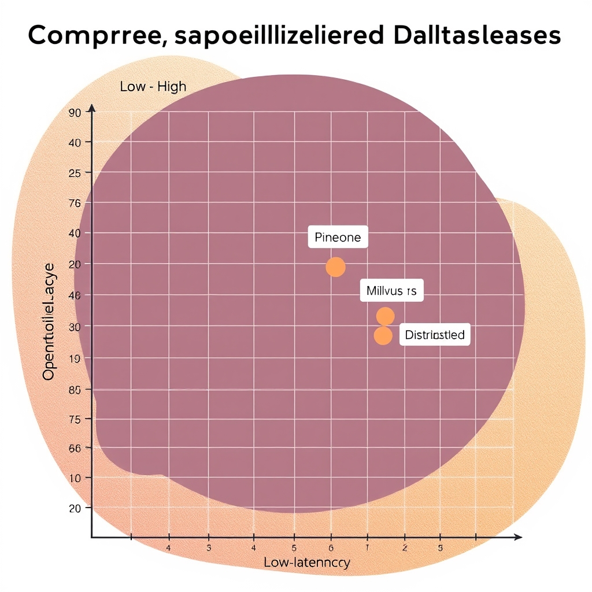
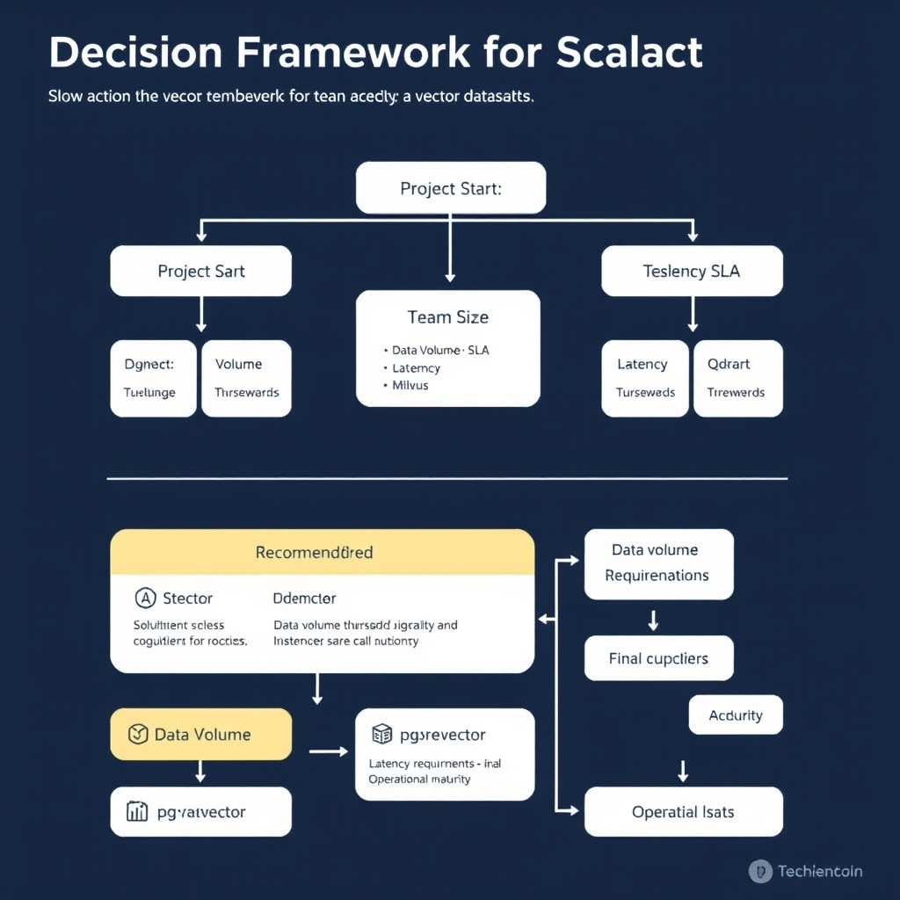

# Choosing the Right Vector Database in 2026: A Practical Guide

## The State of Vector Infrastructure in 2026

The past few years have transformed vector storage from a research curiosity into the backbone of production AI services. Early 2020s deployments treated embeddings as an after‑thought—often dumped into ad‑hoc tables or flat files for proof‑of‑concept Retrieval‑Augmented Generation (RAG) pipelines. By 2026, enterprises run billions of vectors daily to power recommendation engines, semantic search, and real‑time personalization, demanding durability, low‑latency queries, and seamless scaling. This shift has turned vector databases into mission‑critical infrastructure rather than optional add‑ons.

### From "Nice‑to‑Have" to Essential

When embeddings were experimental, teams tolerated high query latency and manual index rebuilds because the cost of failure was low. Today, latency budgets of sub‑100 ms for user‑facing features and strict Service‑Level Agreements (SLAs) make a reliable vector store indispensable. Moreover, regulatory pressures around data residency and auditability require the same governance mechanisms applied to relational data—something only purpose‑built vector platforms now provide out of the box.

### Matching Tool to Architectural Maturity

Choosing a vector solution is no longer a one‑size‑fits‑all decision. A startup with a monolithic service and modest traffic can profit from embedding vectors directly in its existing PostgreSQL instance, keeping operational overhead minimal. In contrast, a mature organization with micro‑service architectures, multi‑region traffic, and strict latency SLAs may need a dedicated, horizontally scalable vector engine that integrates with their observability stack. Selecting a tool that aligns with the current stage of your architecture prevents premature over‑engineering while leaving a clear upgrade path as the system grows.

## The 'Start Simple' Strategy: pgvector

### Why pgvector is the logical first step

pgvector is recommended as the starting point for most production RAG projects to avoid over‑engineering [Source](https://medium.com/@pratik-rupareliya/top-15-vector-databases-in-2026-a-production-decision-guide-from-100-enterprise-deployments-dd58a04f51a5).

*Transitioning from pgvector to a dedicated vector database as your system scales from a monolithic service to a distributed architecture.*

**Leverage existing PostgreSQL investments**

- Most teams already run PostgreSQL for transactional data, user management, or analytics. Adding the `pgvector` extension means vector columns live side‑by‑side with relational tables, eliminating the need for a separate data store.
- Example: a product‑search service can store product metadata in a `products` table and a `embedding` column in the same row, enabling a single SQL query to filter by category and perform a cosine‑similarity search.

**Operational overhead drops dramatically**

- No additional cluster to provision, monitor, or back up. Backup strategies, IAM policies, and disaster‑recovery plans already in place for Postgres automatically cover vector data.
- Scaling is handled by the familiar Postgres tooling (e.g., `pg_ctl`, `pg_upgrade`, managed cloud offerings). Teams avoid learning a new API surface, CLI, or monitoring stack.
- The extension is lightweight: it adds a few index types (IVFFlat, HNSW) that can be created with standard `CREATE INDEX` statements, keeping the operational model consistent with existing relational indexes.

**Architectural simplicity**

- A single connection pool (e.g., `pgbouncer`) serves both relational and vector queries, reducing connection‑management complexity in application code.
- Transactional guarantees (ACID) extend to vector inserts and updates, which is harder to achieve when coupling a separate vector store with a relational DB.
- Development cycles are shorter because engineers can write pure SQL for both data types, reusing existing ORM models and migrations.

### When to consider graduating to a dedicated vector database

The same guide that recommends pgvector for most new RAG projects notes a clear migration signal: *you can name the specific bottleneck that forces the move* [Source](https://medium.com/@pratik-rupareliya/top-15-vector-databases-in-2026-a-production-decision-guide-from-100-enterprise-deployments-dd58a04f51a5).

Typical thresholds include:

- **Query latency > 100 ms at target QPS** despite indexing (IVFFlat/HNSW) and hardware scaling. Specialized stores like Pinecone or Milvus can provide sub‑10 ms latency at massive scale.
- **Dataset size > 10 M vectors** where PostgreSQL’s storage engine or index maintenance becomes a cost or performance concern.
- **Need for advanced features** such as real‑time streaming ingestion, automatic sharding, or built‑in metadata‑aware filtering that are not natively supported by `pgvector`.
- **Strict SLA/HA requirements** that demand multi‑region replication with vector‑aware conflict resolution, which most managed Postgres offerings do not yet guarantee.

In practice, teams often start with pgvector, monitor query latency and index build times, and only when these metrics cross the thresholds above do they evaluate a purpose‑built vector database. This staged approach prevents over‑engineering while keeping the path to scale clear.

## Comparing Specialized Vector Databases

### Pinecone – Zero‑Ops Managed Service

Pinecone markets itself as a fully managed vector store that removes the operational burden from developers. The platform abstracts away provisioning, scaling, and maintenance, allowing teams to focus on indexing and querying data rather than managing clusters. This "zero‑ops" model is especially attractive for production workloads where reliability and SLA guarantees are required but the organization lacks dedicated DevOps resources. Pinecone’s managed service includes automatic sharding, built‑in replication, and a hosted API that integrates with popular LLM toolkits, reducing latency spikes caused by manual scaling decisions.

### Milvus – Open‑Source, Kubernetes‑Native Scale

Milvus is described in a 2026 vendor blog as the most widely adopted open‑source vector database, with a community of over 42,000 GitHub stars and support for billion‑scale indexing on Kubernetes. While the blog highlights these strengths, readers should be aware that the source is vendor‑affiliated and may present a positively‑biased view.

Key capabilities include:

- **Billion‑scale indexing** – Milvus can ingest and index tens of billions of vectors while maintaining query performance.
- **Hybrid storage** – Supports both in‑memory and disk‑based storage tiers, allowing cost‑effective scaling.
- **Extensive SDKs** – Native clients for Python, Go, Java, and Rust accelerate integration with existing pipelines.

> Milvus is the most widely adopted open‑source vector database in 2026, with the largest community (42,000+ GitHub stars), billion‑scale indexing, and Kubernetes‑native deployment. \[[Source](https://iternal.ai/insights/best-vector-databases-2026)\]

### Qdrant – Low‑Latency Query Engine

A performance benchmark released in early 2026 reports that Qdrant achieved the lowest p50 latency (4 ms) among the tested databases. The benchmark’s provenance is listed as an “unknown” source, so the results should be interpreted with caution and ideally corroborated by independent audits.

Beyond raw latency, Qdrant provides:

- **Dynamic payload storage** – Allows metadata to be attached to vectors without sacrificing speed.
- **On‑the‑fly filtering** – Supports complex filters (e.g., range, term) directly in the query path, reducing round‑trips to the application layer.
- **Built‑in replication** – Guarantees high availability while preserving low‑latency characteristics.

> Qdrant achieved the fastest p50 query latency (4 ms) in standardized performance benchmarks conducted in Q1 2026. \[[Source](https://www.salttechno.ai/datasets/vector-database-performance-benchmark-2026)\]

### Benchmark Context: Latency and Indexing

The Q1 2026 benchmark suite evaluated both query latency (p50, p95) and indexing throughput on a common hardware baseline (dual‑socket AMD EPYC 7742, 256 GB RAM, NVMe SSD). While Qdrant led in latency, Milvus demonstrated superior indexing throughput, completing a 10 billion‑vector ingestion in roughly half the time reported for Pinecone’s managed service. Pinecone’s managed offering, however, compensated with higher SLA guarantees and automated scaling, which can be decisive for production teams that prioritize operational simplicity over raw throughput.

### Choosing the Right Fit

| Feature                 | Pinecone                                             | Milvus                                                 | Qdrant                                                   |
| ----------------------- | ---------------------------------------------------- | ------------------------------------------------------ | -------------------------------------------------------- |
| **Operational Model**   | Fully managed, zero‑ops                              | Self‑hosted, Kubernetes‑native                         | Self‑hosted, lightweight service                         |
| **Scale**               | Managed up to multi‑billion vectors (vendor‑defined) | Billion‑scale indexing proven in open‑source community | Optimized for low‑latency queries at moderate scale      |
| **Latency (p50)**       | ~5‑10 ms (vendor reports)                            | ~8‑12 ms (benchmark)                                   | **4 ms** (benchmark)                                     |
| **Indexing Throughput** | Vendor‑managed, less transparent                     | Highest among open‑source options                      | Competitive, but secondary to latency                    |
| **Ideal Use‑Case**      | Teams lacking ops expertise, need SLA                | Large, distributed deployments, Kubernetes expertise   | Real‑time retrieval where sub‑10 ms response is critical |

In practice, the decision hinges on three axes: **team expertise**, **scale requirements**, and **latency tolerance**. Teams with limited DevOps bandwidth often gravitate toward Pinecone’s managed model. Organizations that already run Kubernetes clusters and anticipate rapid data growth find Milvus a natural extension of their stack. When sub‑10 ms query response is a non‑negotiable SLA—such as in conversational AI or recommendation engines—Qdrant’s benchmark‑reported latency makes it the preferred choice, keeping in mind the need for independent verification of those numbers.

______________________________________________________________________

By aligning these characteristics with project constraints, readers can avoid over‑engineering and select a vector database that matches their current maturity while leaving room for future growth.

*A conceptual mapping of vector databases based on operational overhead versus query performance.*

## Integrating with LLM Frameworks

### LangChain: Flexibility First

LangChain treats the vector store as a plug‑in component. You can instantiate any supported database—Pinecone, Milvus, Qdrant, Weaviate, or even a self‑hosted pgvector—through a simple `VectorStore` interface. This design lets you swap back‑ends without touching the surrounding chain logic, making it ideal for teams that:

- Experiment with multiple vendors before committing.
- Need custom retrieval‑augmented generation (RAG) pipelines that combine several data sources.
- Prefer a code‑centric workflow where the vector store is just another Python object.

The trade‑off is that LangChain’s abstractions are deliberately generic; you may miss database‑specific performance knobs unless you dive into the underlying client.

### LlamaIndex: RAG‑Optimized Connectors

LlamaIndex (formerly GPT Index) builds higher‑level data structures—indices, graphs, and document stores—on top of vector databases. Its connectors are tuned for typical RAG patterns such as chunking, metadata filtering, and hybrid retrieval. For example, the `QdrantVectorStore` in LlamaIndex automatically creates payload schemas that accelerate metadata queries, and its batch indexing routine aligns with Qdrant’s payload indexing strategy.

These optimizations reduce latency and simplify the code required to implement a production‑grade RAG pipeline, but they also tie you more closely to LlamaIndex’s data model. If your use case diverges from standard RAG (e.g., you need custom scoring functions), you may need to extend the connector manually.

> Both frameworks support major vector databases like Pinecone, Weaviate, Qdrant, and Chroma. LlamaIndex's integrations tend to be more optimized for RAG use cases, while LangChain provides more flexibility in how you use the vector store [LangChain vs LlamaIndex: Complete Framework Comparison 2026](https://reintech.io/blog/langchain-vs-llamaindex-comparison-2026).

### Choosing the Right Framework

| Project characteristic                           | Recommended framework                                                                      |
| ------------------------------------------------ | ------------------------------------------------------------------------------------------ |
| Early‑stage prototype, frequent DB swaps         | **LangChain** – minimal coupling, easy to replace back‑ends                                |
| Production RAG service, heavy metadata filtering | **LlamaIndex** – built‑in optimizations for chunking and hybrid search                     |
| Mixed workloads (RAG + custom scoring)           | Start with **LangChain** for flexibility, then layer LlamaIndex‑style indices where needed |

**Guidance**: Assess your team's familiarity with the underlying vector store, the expected query patterns, and how much you value out‑of‑the‑box RAG features versus architectural freedom. Align the framework choice with those criteria to avoid over‑engineering while keeping the path open for future scaling.

## Decision Framework for Selection

*A decision framework to help teams select the appropriate vector database based on their current architectural maturity and performance needs.*

### Decision Matrix

| Team size | Data scale         | Latency tolerance | Recommended approach                                                                                             |
| --------- | ------------------ | ----------------- | ---------------------------------------------------------------------------------------------------------------- |
| 1‑5 devs  | \< 10 M vectors    | > 50 ms           | Start with **pgvector** inside PostgreSQL – minimal ops.                                                         |
| 5‑20 devs | 10 M‑100 M vectors | 20‑50 ms          | Managed service (**Pinecone**) for zero‑ops or **Qdrant** if low‑latency queries dominate.                       |
| > 20 devs | > 100 M vectors    | \< 20 ms          | Deploy a dedicated cluster – **Milvus** (Kubernetes‑native) or self‑hosted **Qdrant** for tight latency budgets. |

**Avoid over‑engineering early**

When a project is still validating its retrieval‑augmented generation (RAG) workflow, the overhead of provisioning a full‑scale vector store can stall development. Begin with the simplest viable stack (pgvector) and only graduate to a specialized database once you hit a clear threshold—e.g., sustained query latency above 50 ms or data volume exceeding tens of millions of vectors. This incremental path keeps costs low, reduces operational risk, and lets the team focus on model integration rather than infrastructure.

**Final checklist for vendor vs. self‑hosted**

- Do you have in‑house expertise to manage Kubernetes or container orchestration?
- Is data residency or compliance a strict requirement?
- What is the expected query‑per‑second (QPS) load?
- Do you need SLA‑backed uptime guarantees?
- How important is cost predictability versus potential performance tuning?
- Will you need custom indexing or hybrid search features?

Answering these questions against the matrix above will guide you to the most appropriate vector database choice.