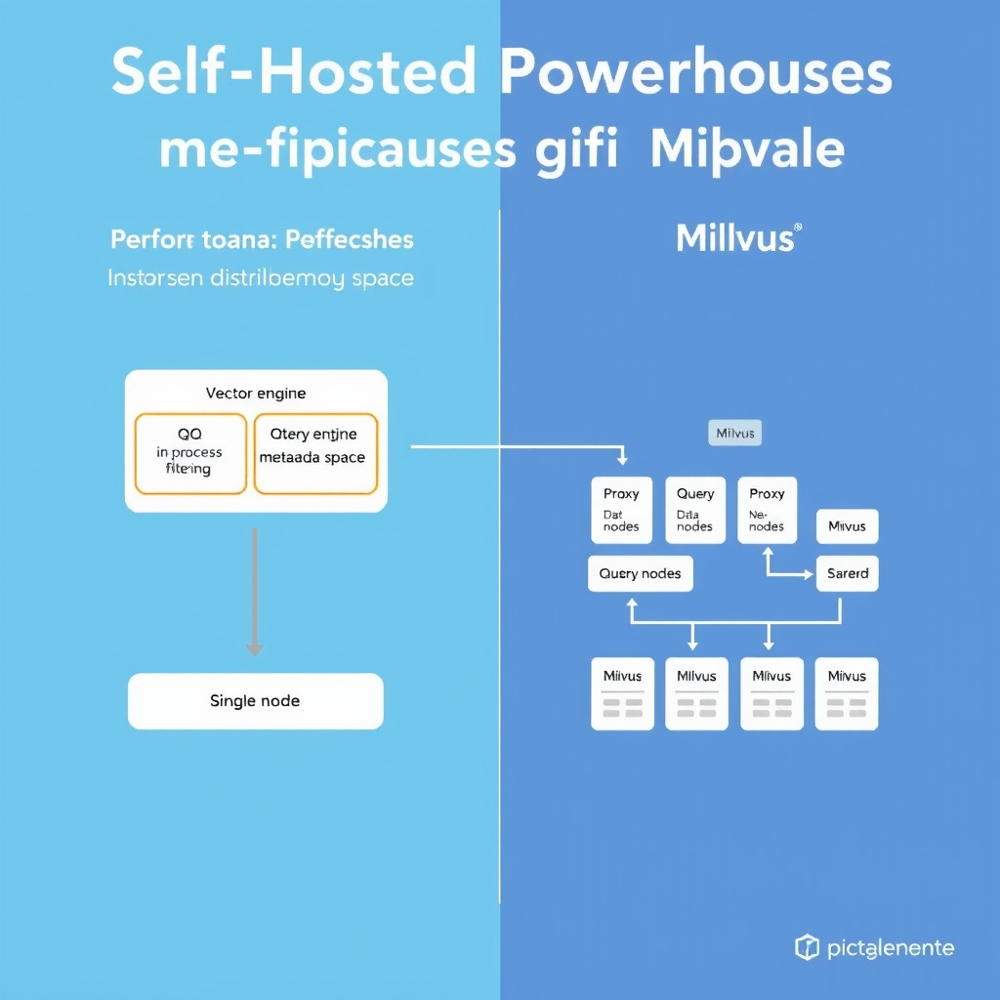
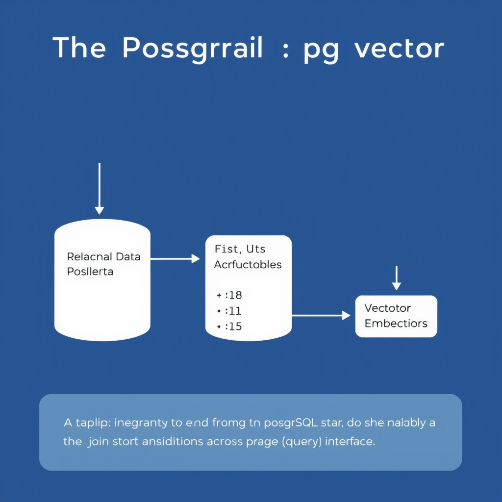

# Choosing the Right Vector Database in 2026: A Strategic Guide

## The State of Vector Databases in 2026

The past few years have seen vector storage move from a niche research prototype to a production‑grade building block for AI systems. Early implementations were ad‑hoc collections of embeddings stored in flat files or simple key‑value stores, sufficient only for proof‑of‑concepts. By 2026, the ecosystem offers mature services that guarantee low‑latency similarity search, automatic scaling, and built‑in security, making vectors a first‑class data type in enterprise pipelines.

### RAG as the primary adoption driver

Retrieval‑augmented generation (RAG) relies on fast nearest‑neighbor lookups to fetch relevant context before a language model generates output. The latency and relevance of those lookups directly affect user experience and cost, turning vector databases into a critical performance layer rather than an optional add‑on. Consequently, organizations now evaluate vector stores with the same rigor they apply to relational or message‑queue systems.

### Three architectural categories

1. **Managed services** – Fully hosted, zero‑ops platforms that abstract away provisioning, scaling, and maintenance. They excel at rapid prototyping and guarantee SLA‑backed performance, but can become costly at high query volumes.
1. **Self‑hosted deployments** – Open‑source engines that teams run on their own infrastructure, offering fine‑grained control over hardware, cost, and custom extensions.
1. **Relational extensions** – Vector capabilities added to existing SQL databases, preserving ACID guarantees and simplifying architecture for teams already invested in relational stacks.

### Key players in 2026

- **Pinecone** – The market leader among managed vector stores, praised for its serverless architecture and enterprise‑grade security. Its developer‑velocity advantage is offset by higher per‑query costs at scale【https://iternal.ai/insights/best-vector-databases-2026】.
- **Qdrant** – A Rust‑based, self‑hosted solution optimized for low‑latency filtered searches, popular in latency‑sensitive applications.
- **Milvus** – The most widely adopted open‑source engine for billion‑scale workloads, with Zilliz Cloud offering a managed, high‑performance variant that delivers up to ten‑fold speedups over the community edition【https://www.firecrawl.dev/blog/best-vector-databases】.
- **pgvector** – An extension for PostgreSQL that brings vector similarity search into a relational context, enabling ACID transactions and eliminating the need for a separate vector store【https://karthikeyanrathinam.medium.com/top-10-vector-databases-in-2026-ultimate-comparison-benchmarks-use-cases-6b0e878256b5】.

Understanding these categories and the strengths of each vendor sets the stage for choosing the right architecture based on your project's scale, budget, and existing technology stack.

## Managed Services: Prioritizing Developer Velocity

### Zero‑Ops Architecture: Accelerating Prototyping and Scale

Managed vector stores such as **Pinecone** eliminate the operational burden of provisioning, sharding, and monitoring clusters. Developers interact with a simple SDK or REST endpoint, while the provider automatically handles:


*Managed services offer high velocity at low volume, but self-hosted solutions become more cost-effective as query volume scales.*

- **Instance provisioning** – spin up a new index in seconds, no Kubernetes manifests.
- **Dynamic scaling** – traffic spikes trigger seamless horizontal scaling without manual re‑balancing.
- **Built‑in monitoring** – health metrics, latency alerts, and auto‑recovery are baked into the service.

This "zero‑ops" model lets teams move from data ingestion to retrieval in minutes, a critical advantage when iterating on Retrieval‑Augmented Generation (RAG) pipelines where the vector schema evolves rapidly.

______________________________________________________________________

### Cost‑Benefit Analysis: Managed vs. Self‑Hosted

| Aspect                         | Managed (Pinecone)                                                                                                    | Self‑Hosted (e.g., Qdrant, Milvus)                              |
| ------------------------------ | --------------------------------------------------------------------------------------------------------------------- | --------------------------------------------------------------- |
| **Up‑front cost**              | Low – pay‑as‑you‑go subscription                                                                                      | High – hardware, networking, and staffing investment            |
| **Operational overhead**       | None – provider handles upgrades, backups, scaling                                                                    | Significant – DevOps time for cluster ops, patching, monitoring |
| **Performance predictability** | SLA‑backed latency and throughput guarantees                                                                          | Variable – depends on cluster tuning and hardware choice        |
| **Total cost at scale**        | Can be 5–10× higher for sustained high‑volume workloads [[1]](https://iternal.ai/insights/best-vector-databases-2026) | Lower per‑query cost once infrastructure is amortized           |

For early‑stage projects or proof‑of‑concepts, the subscription model often yields a lower total cost of ownership because developer hours are cheaper than infrastructure management. As query volume grows into the millions per day, the per‑request price of a managed service may outweigh the savings from avoided ops work, prompting a migration to self‑hosted solutions.

______________________________________________________________________

### When Pinecone Is the Right Choice

1. **Enterprise‑grade security requirements** – Pinecone offers VPC isolation, IAM integration, and encryption‑at‑rest that meet strict compliance regimes (SOC 2, ISO 27001).
1. **Performance‑critical workloads with modest scale** – For workloads under ~10 M queries/month, Pinecone’s serverless architecture delivers sub‑10 ms p99 latency with minimal tuning.
1. **Rapid onboarding across distributed teams** – Teams can share API keys and start indexing without coordinating cluster provisioning, ideal for multi‑regional development.

If your organization already invests heavily in cloud‑native DevOps pipelines and needs granular control over hardware, a self‑hosted option may be preferable.

______________________________________________________________________

### Addressing the "Cost at Scale" Concern

Pinecone mitigates high‑volume cost pressure through:

- **Reserved capacity plans** – pre‑pay for a fixed throughput tier, reducing per‑query rates.
- **Hybrid indexing** – store hot vectors in the managed index and offload cold data to cheaper object storage, accessed via fallback queries.
- **Usage monitoring dashboards** – real‑time cost visibility enables teams to set alerts and enforce budget caps.

Nevertheless, the economics shift once sustained traffic exceeds the break‑even point where self‑hosted clusters can be run on spot instances or on‑prem hardware at 5–10× lower cost per query [[1]](https://iternal.ai/insights/best-vector-databases-2026). Organizations should therefore treat managed services as a **speed‑to‑value** layer, planning a migration path once the product stabilizes and query volume justifies the operational investment.

______________________________________________________________________

In summary, Pinecone excels when developer velocity, security, and predictable performance outweigh raw cost considerations. For teams that anticipate rapid scaling beyond the managed pricing sweet spot, a strategic evaluation of self‑hosted alternatives should be part of the long‑term roadmap.

## Self-Hosted Powerhouses: Performance and Scale

### Qdrant: Rust‑Native Low‑Latency Engine

Qdrant’s core is written in Rust, a language prized for memory safety and zero‑cost abstractions. This design choice translates directly into **predictable, sub‑5 ms p50 query latency** for filtered searches, as reported in the 2026 Vector Database Benchmark[^1]. The Rust implementation enables efficient SIMD vector operations and tight control over memory allocation, reducing garbage‑collection pauses that can plague JVM‑based stores.

Key technical benefits include:

- **Quantization pipelines** that compress vectors on‑write without sacrificing recall, lowering I/O overhead.
- **Filtered search primitives** (metadata predicates) that execute in the same process as the vector engine, avoiding cross‑process RPC latency.
- **Thread‑pinning and async I/O** that keep CPU caches hot, essential for high QPS workloads.

These attributes make Qdrant an attractive choice for latency‑sensitive RAG pipelines where response time directly impacts user experience.

______________________________________________________________________

### Milvus: The Billion‑Scale Workhorse

Milvus has emerged as the de‑facto platform for **billion‑scale, distributed vector workloads**. Its architecture separates the **query layer** (proxy + query nodes) from the **storage layer** (data nodes), allowing horizontal scaling across commodity clusters. The open‑source project boasts over 44 000 GitHub stars, reflecting broad community adoption[^2].

Milvus supports multiple index types (IVF‑FLAT, HNSW, ANNOY) and integrates with popular storage backends such as MinIO and S3, enabling petabyte‑level vector collections. Its **distributed sharding** model spreads vectors across nodes, while **replication** ensures fault tolerance without sacrificing read performance.

______________________________________________________________________

### Zilliz Cloud: Enterprise‑Ready Managed Milvus

While Milvus excels in raw scalability, many enterprises require additional operational guarantees—SLA‑backed uptime, automated upgrades, and integrated security. **Zilliz Cloud** delivers a fully managed Milvus service that retains the open‑source engine’s performance while adding:

- **Cardinal engine** optimizations that claim up to **10× faster retrieval** compared to vanilla Milvus[^2].
- Built‑in **role‑based access control**, VPC isolation, and audit logging for compliance.
- Seamless **elastic scaling** via a web console, reducing the operational burden of cluster management.

Zilliz Cloud thus bridges the gap between self‑hosted flexibility and the convenience of a managed offering, making it suitable for production RAG systems that need both scale and governance.

______________________________________________________________________

### Performance Comparison: Latency & Throughput

| Database                           | p50 Query Latency (ms) | Throughput (queries/s) | Deployment Model         |
| ---------------------------------- | ---------------------- | ---------------------- | ------------------------ |
| Qdrant (open‑source)               | **4** (filtered)       | ~1,200                 | Self‑hosted on 8‑core VM |
| Milvus (open‑source)               | 7‑9 (plain)            | ~2,800                 | 4‑node cluster           |
| Milvus via Zilliz Cloud (Cardinal) | 5‑6                    | ~5,500                 | Managed SaaS             |

*Latency figures are drawn from the 2026 benchmark dataset[^1]; throughput numbers reflect typical configurations used in the benchmark’s “large‑scale” scenario.*

The table highlights a **trade‑off**: Qdrant delivers the lowest latency for filtered queries, ideal for use‑cases where metadata constraints dominate. Milvus, especially when augmented by Zilliz Cloud’s Cardinal engine, offers higher throughput and the ability to store **billions of vectors** across distributed nodes.

______________________________________________________________________

### Choosing Between Qdrant and Milvus

- **Prioritize sub‑5 ms latency & complex filters?** → Qdrant’s Rust core and in‑process filtering give it an edge.
- **Need to index > 1 billion vectors with horizontal scaling?** → Milvus’s sharded architecture and Zilliz Cloud’s managed scaling are better suited.
- **Operational bandwidth limited?** → Zilliz Cloud reduces DevOps overhead, while Qdrant may require more hands‑on tuning.

By aligning these technical characteristics with your RAG workload—whether it’s a real‑time chatbot needing instant filtered results or a large knowledge‑base search across billions of embeddings—you can select the self‑hosted powerhouse that matches your performance and scale requirements.

\[^1\]: Vector Database Benchmark 2026 | Top 10 Compared, *SaltTechno AI*. https://www.salttechno.ai/datasets/vector-database-performance-benchmark-2026
\[^2\]: Best Vector Databases in 2026: A Complete Comparison Guide, *Firecrawl*. https://www.firecrawl.dev/blog/best-vector-databases


*Qdrant optimizes for low-latency filtered search via in-process execution, while Milvus scales horizontally for massive, distributed datasets.*

## The PostgreSQL Path: Leveraging pgvector

### Architectural Benefits of Keeping Vectors Inside PostgreSQL

Embedding vectors alongside relational data eliminates the need for a separate storage tier. With **pgvector**, the same PostgreSQL instance that holds user profiles, transaction logs, or metadata can also store high‑dimensional vectors. This co‑location reduces network hops, simplifies backup and disaster‑recovery policies, and lets existing DBAs apply familiar tools (e.g., `pg_dump`, `pg_restore`, point‑in‑time recovery) to the entire workload.


*pgvector simplifies architecture by allowing vector embeddings to coexist with relational data, enabling unified SQL queries.*

### ACID Compliance and Hybrid Search Queries

Because pgvector is a native PostgreSQL extension, vector inserts, updates, and deletes participate in the same **transactional guarantees** as any other table. A single `BEGIN … COMMIT` block can atomically write a new document, its metadata, and its embedding, ensuring that search results never see a partially persisted state. Moreover, the extension exposes a **`<->`** operator that can be combined with standard SQL predicates:

```sql
SELECT id, content
FROM articles
WHERE category = 'science'
ORDER BY embedding <-> '[0.12,0.34,…]'
LIMIT 5;
```

This hybrid query pattern enables filtered semantic search without pulling data into an external vector store, preserving the consistency guarantees that many production RAG pipelines require.

### Avoiding Vendor Lock‑In and Reducing Infrastructure Complexity

Teams that have already invested in PostgreSQL avoid the operational overhead of provisioning, scaling, and monitoring a dedicated vector database. pgvector runs on any PostgreSQL deployment—cloud‑managed services (e.g., Amazon RDS, Azure Database for PostgreSQL), on‑premise clusters, or lightweight containers. Because the extension is open‑source and part of the PostgreSQL ecosystem, there is **no proprietary API** to rewrite when switching providers, mitigating lock‑in risk.

### When pgvector Is the Right Choice

| Scenario                                    | Why pgvector Fits                                                                       |
| ------------------------------------------- | --------------------------------------------------------------------------------------- |
| **Existing PostgreSQL stack**               | Leverages current DB ops, tooling, and security policies.                               |
| **Moderate vector volume (≤ 10 M vectors)** | PostgreSQL can handle this scale with proper indexing (IVFFlat, HNSW) and partitioning. |
| **Need for strong consistency**             | ACID transactions guarantee that vector and relational updates stay in sync.            |
| **Limited ops bandwidth**                   | Zero‑ops for a separate vector service; only one database to monitor.                   |
| **Hybrid queries (metadata + similarity)**  | SQL + vector operators enable concise, performant queries.                              |

Conversely, if your workload demands **billion‑scale vectors**, sub‑millisecond latency at massive query throughput, or advanced features like GPU‑accelerated indexing, a purpose‑built vector engine may still be preferable.

### Bottom Line

pgvector offers a compelling middle ground for teams that prioritize **operational simplicity**, **transactional integrity**, and **vendor neutrality** while still needing semantic search capabilities. By keeping vectors inside PostgreSQL, you can build RAG pipelines that benefit from the full power of SQL without the overhead of managing a separate vector‑only database.

> *Source: "Top 10 Vector Databases in 2026: Ultimate Comparison, Benchmarks & Use Cases" – pros include keeping all data in one database, full SQL power, ACID transactions, and zero vendor lock‑in.* [Link](https://karthikeyanrathinam.medium.com/top-10-vector-databases-in-2026-ultimate-comparison-benchmarks-use-cases-6b0e878256b5)

## Integration and Ecosystem: LangChain vs. LlamaIndex

### LangChain: Flexible Glue for Any Vector Store

- **Adapter‑agnostic design** – LangChain exposes a generic `VectorStore` interface that can wrap Pinecone, Weaviate, Qdrant, Chroma, or a custom self‑hosted service. This lets developers swap back‑ends without changing retrieval logic, which is ideal for proof‑of‑concepts or multi‑tenant SaaS platforms.
- **Composable chains** – Retrieval, reranking, and generation steps are built as independent `Chain` objects. You can insert a `VectorStoreRetriever` anywhere in the pipeline, then layer on filters, metadata enrichment, or custom scoring functions.
- **Extensibility** – Adding a new database is as simple as subclassing `VectorStore` and implementing `add_documents`, `similarity_search`, and `delete` methods. The framework handles batching, async I/O, and retry policies out of the box.

### LlamaIndex: RAG‑Centric Data Ingestion and Retrieval

- **Built‑in loaders** – LlamaIndex ships with over 30 data loaders (PDF, HTML, Notion, Confluence, etc.) that automatically chunk, embed, and upsert documents into the chosen vector store. This reduces boilerplate when building RAG pipelines.
- **Index‑first mindset** – The library constructs a hierarchical `Index` (e.g., `GPTTreeIndex`, `FaissIndex`) that stores both raw text and embeddings, enabling hybrid keyword‑vector queries without extra code.
- **Optimized connectors** – For databases like Pinecone and Qdrant, LlamaIndex uses bulk upsert APIs and leverages database‑specific metadata filters, yielding lower latency for large‑scale ingestion tasks. These optimizations make LlamaIndex the go‑to choice when the primary goal is end‑to‑end RAG rather than generic vector storage.

### Connector Maturity in 2026

Both frameworks now support the major vector databases listed in the 2026 market survey. According to a recent comparison, **LangChain** offers broader coverage and more granular control, while **LlamaIndex** provides tighter, RAG‑focused integrations that abstract away most connection details. The ecosystem has converged on stable Python packages, with versioned releases aligned to the underlying database SDKs, reducing breaking changes for production deployments.

### Quick Start: Connecting to a Vector Store

```python
from langchain.vectorstores import Pinecone
from langchain.embeddings import OpenAIEmbeddings
import pinecone

# Initialize Pinecone client (replace with your API key & environment)
pinecone.init(api_key="YOUR_API_KEY", environment="us-west1-gcp")
index_name = "my-doc-index"

# Create LangChain wrapper around Pinecone
vector_store = Pinecone.from_existing_index(
    index_name=index_name,
    embedding=OpenAIEmbeddings(),
)

# Simple similarity search
query = "What are the benefits of managed vector databases?"
results = vector_store.similarity_search(query, k=5)
for doc in results:
    print(doc.page_content)
```

The snippet demonstrates a minimal LangChain setup that can be swapped for a LlamaIndex `VectorStoreIndex` with a single import change, illustrating the flexibility discussed above.

*Source: [LangChain vs LlamaIndex: Complete Framework Comparison 2026](https://reintech.io/blog/langchain-vs-llamaindex-comparison-2026)*

## Decision Framework: Choosing Your Vector Database

### Decision matrix

| Factor               | Small team / MVP                                                                                   | Mid‑size team / Growth                                                                      | Large enterprise / Scale                                                                       |
| -------------------- | -------------------------------------------------------------------------------------------------- | ------------------------------------------------------------------------------------------- | ---------------------------------------------------------------------------------------------- |
| **Team expertise**   | Prefer zero‑ops to free developers from ops                                                        | Mix of managed for fast iteration and self‑hosted for cost control                          | In‑house ops team, self‑hosted or hybrid                                                       |
| **Budget**           | Limited – managed services may be acceptable for short‑term pilots; watch cost at >10 M queries/mo | Balanced – start with managed (e.g., Pinecone) then migrate to Qdrant/Milvus as usage grows | Tight – self‑hosted Qdrant or Milvus typically 5–10× cheaper than managed at scale             |
| **Scale / latency**  | \< 10 M vectors, latency \< 10 ms is fine                                                          | 10 M–100 M vectors, need filtered search; Qdrant’s 4 ms p50 latency is a strong fit         | > 100 M vectors, billions of vectors; Milvus with Zilliz Cloud or on‑prem distributed clusters |
| **Data consistency** | Not critical – eventual consistency OK                                                             | Some transactional needs; consider pgvector if relational data is already in PostgreSQL     | Strict ACID requirements – pgvector or a managed offering with enterprise SLAs                 |

### Managed vs. self‑hosted trade‑off

- **Managed (e.g., Pinecone)** – eliminates infrastructure overhead, accelerates prototyping, and provides built‑in security. The downside is a steep cost curve once sustained high‑volume workloads appear, as noted in the 2026 benchmark where self‑hosted Qdrant or Milvus can be 5–10× cheaper.
- **Self‑hosted (Qdrant, Milvus, pgvector)** – offers fine‑grained control over hardware, cost, and customization. Performance‑critical workloads benefit from Qdrant’s Rust‑based low‑latency filtered search (4 ms p50) and Milvus’s billion‑scale distribution. The operational burden, however, requires dedicated ops expertise.

### Recommendations by project stage

- **MVP / prototype** – Start with a managed service like Pinecone to focus on model iteration. If cost spikes are observed early, plan a migration path to Qdrant or Milvus.
- **Growth stage** – Adopt a hybrid approach: keep fast‑path queries on a managed store while migrating bulk storage to a self‑hosted cluster. Evaluate pgvector if the stack already revolves around PostgreSQL.
- **Enterprise** – Deploy a fully self‑hosted Milvus or Qdrant cluster, optionally layered with Zilliz Cloud for hybrid cloud‑on‑prem workloads. Use pgvector for workloads that demand strict ACID guarantees and minimal vendor lock‑in.

### Looking ahead

The vector database market is converging on a two‑track ecosystem: managed services will continue to dominate rapid‑deployment scenarios, while open‑source, self‑hosted solutions mature for massive, latency‑sensitive workloads. Selecting the right track today positions teams to scale seamlessly as the technology and cost landscape evolves.