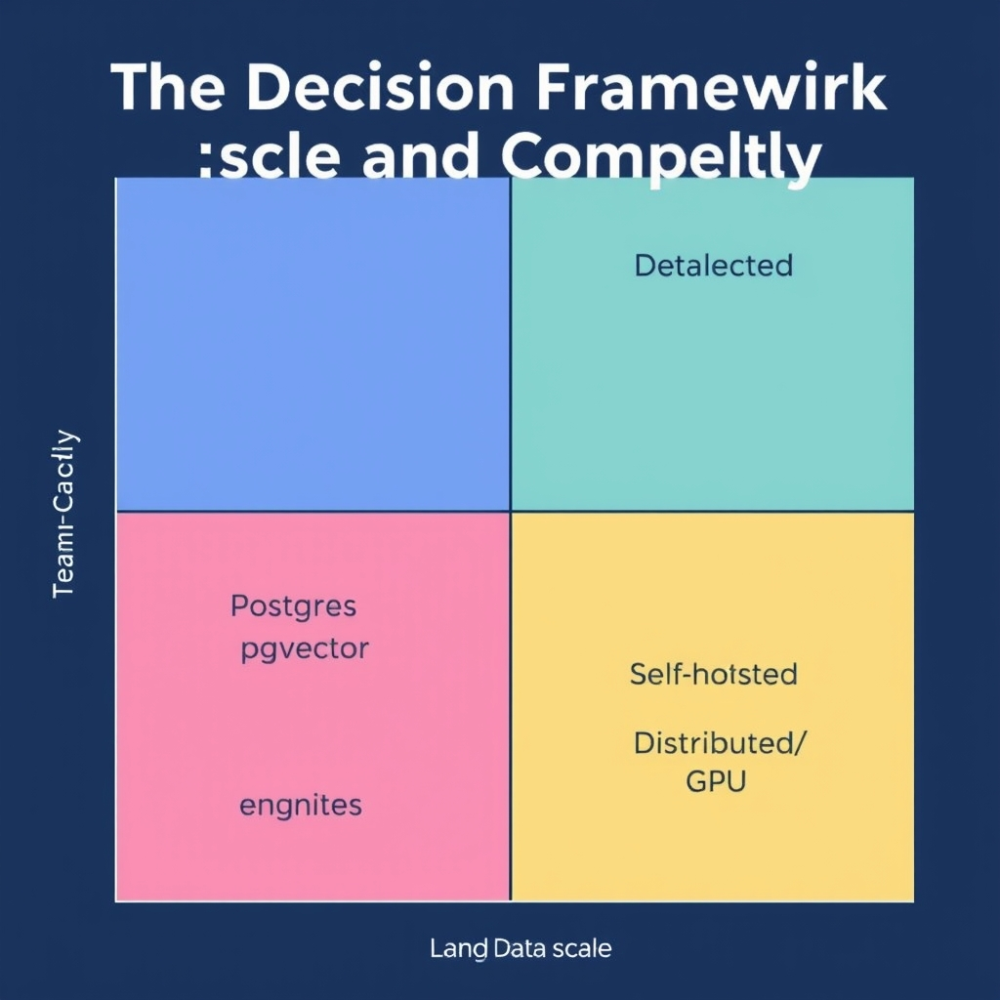
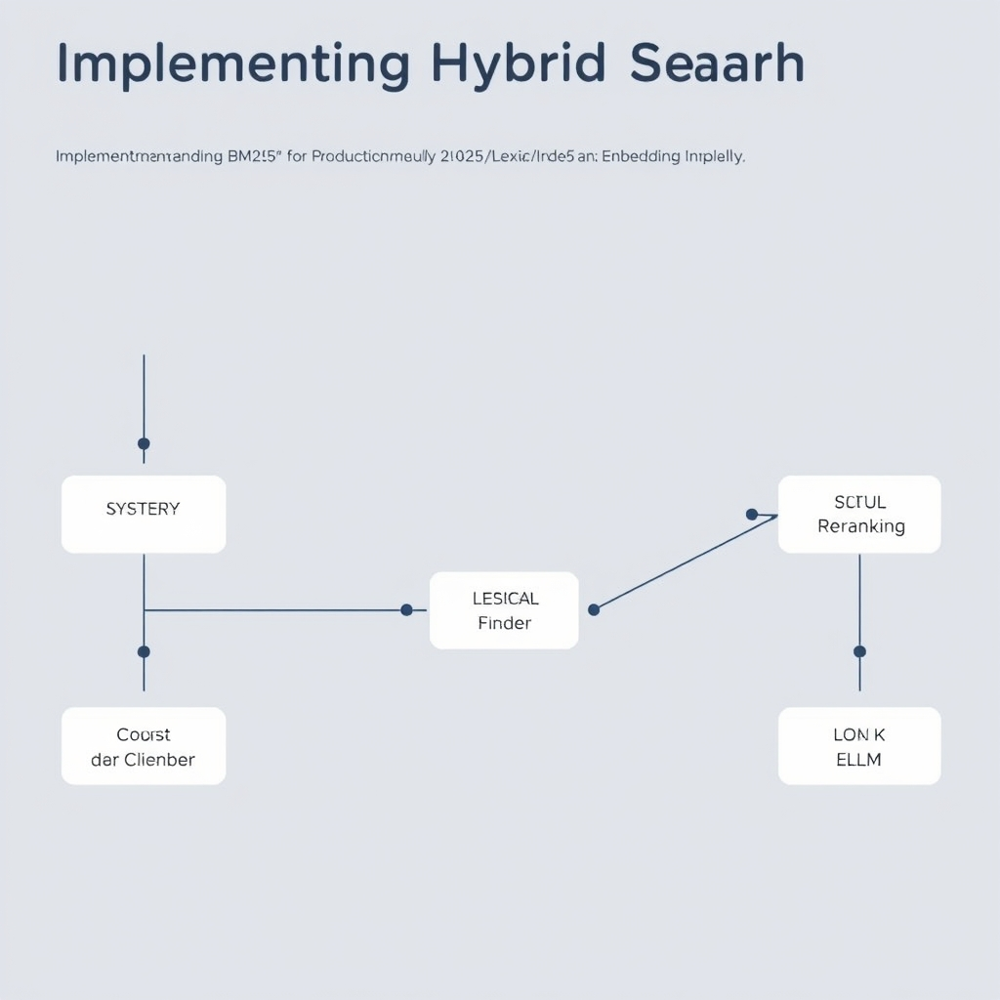

# Choosing Your Vector Database in 2026: From Postgres to Purpose-Built

## The 2026 Reality Check: Why Simplicity Wins

The past few years have seen vector search move from a research curiosity to a staple of production AI stacks. Early adopters ran isolated services—often written in Rust or Go—solely to serve dense embeddings for proof‑of‑concept retrieval‑augmented generation (RAG). By 2026 those niche deployments have largely been absorbed into the broader data platform, driven by two forces: the need for transactional consistency across metadata and embeddings, and the desire to avoid a second operational domain for most teams.

### Most RAG workloads stay small enough for Postgres

Empirical surveys show that **90 % of RAG applications handle fewer than 10 million vectors**. For this scale, the pgvector extension on an existing PostgreSQL instance delivers “zero new infra” while providing ACID guarantees and query performance that meets 90 % of real‑world latency targets【https://www.learnersink.com/blog/vector-databases-comparison-2026】. The result is a single source of truth for both relational data (user profiles, permissions) and vector embeddings, eliminating the need to synchronize two disparate stores.

### The hidden cost of a dedicated vector store

Running a separate vector engine incurs more than just hardware spend. Teams must provision, monitor, and patch a distinct service stack, often with its own backup and disaster‑recovery procedures. In practice, this adds **10‑20 % overhead to operational headcount** for a typical ML engineering group, as documented in industry post‑mortems. Moreover, cross‑system latency spikes appear when metadata joins require round‑trips between Postgres and an external vector DB, eroding the end‑to‑end response time for RAG pipelines.

### The "Postgres‑first" default strategy

Given the maturity of pgvector and the economies of scale offered by a unified platform, the recommended default in 2026 is **"Postgres‑first"**:

1. Deploy pgvector on your primary PostgreSQL cluster.
1. Use native SQL for metadata joins and vector similarity (`<=>`) queries.
1. Reserve purpose‑built engines (e.g., Qdrant, Pinecone, Milvus) only when you cross the **10‑50 million vector** threshold or require specialized features such as GPU‑accelerated indexing or serverless elasticity【https://www.learnersink.com/blog/vector-databases-comparison-2026】.

This approach aligns with the market’s consolidation trend: teams prioritize simplicity, lower total cost of ownership, and consistent data semantics, while still retaining a clear migration path for extreme‑scale or highly specialized workloads.

## The Decision Framework: Scale and Complexity

### A practical heuristic for picking the right vector store

**1. Thresholds for migration – when pgvector is no longer enough**


*A decision framework for selecting a vector database based on your team's operational capacity and the scale of your vector data.*

| Data volume (vectors) | Recommended store                                                       | Why the switch                                                                                                       |
| --------------------- | ----------------------------------------------------------------------- | -------------------------------------------------------------------------------------------------------------------- |
| \< 10 M               | **pgvector** (PostgreSQL)                                               | Zero new infra, ACID guarantees, ~90 % of typical RAG performance [Learnersink]                                      |
| 10 M – 50 M           | **Qdrant** or **Weaviate** (self‑hosted)                                | Better indexing throughput and sub‑4 ms p50 latency, still manageable without a dedicated platform team [SaltTechno] |
| 50 M – 100 M          | **Managed service** (e.g., Pinecone) or **Qdrant** with larger clusters | Serverless scaling removes operational friction for mid‑scale workloads [Peco]                                       |
| > 100 M               | **Milvus** (GPU‑accelerated)                                            | Only solution that sustains extreme‑scale indexing and query rates with a dedicated team [Learnersink]               |

These breakpoints are not hard limits; they are decision anchors that combine **vector count**, **query latency expectations**, and **available engineering bandwidth**.

**2. Team size and platform‑engineering capacity**

| Team size                                 | Viable options                                                   | Operational focus                                                                 |
| ----------------------------------------- | ---------------------------------------------------------------- | --------------------------------------------------------------------------------- |
| 1‑2 engineers (or a single data‑engineer) | pgvector on existing Postgres or a managed service like Pinecone | Keep ops to a minimum; rely on the host for scaling and backups                   |
| 3‑6 engineers (dedicated platform slice)  | Self‑hosted Qdrant or Weaviate                                   | Allocate effort to cluster sizing, monitoring, and occasional index tuning        |
| > 6 engineers (full platform team)        | Milvus (GPU nodes) or a hybrid of multiple stores                | Invest in custom provisioning, GPU orchestration, and advanced indexing pipelines |

The rule of thumb is **“match the complexity of the store to the size of the team”**. Smaller teams benefit from the transactional safety and familiarity of PostgreSQL, while larger groups can afford the operational overhead of purpose‑built engines.

**3. Transactional consistency vs. vector‑native features**

- **pgvector** inherits PostgreSQL’s ACID guarantees, foreign‑key constraints, and rich SQL ecosystem. This makes it ideal for workloads that need **strong consistency** between metadata and vectors (e.g., updating a document and its embedding in a single transaction).
- **Purpose‑built engines** (Qdrant, Milvus) sacrifice some relational guarantees for **vector‑centric optimizations**: HNSW or IVF‑PQ indexing, dynamic shard rebalancing, and built‑in support for approximate nearest‑neighbor (ANN) parameters. They typically expose eventual consistency for bulk writes, which is acceptable for many RAG pipelines where the retrieval step is read‑heavy.
- The trade‑off can be expressed as a **consistency‑vs‑performance matrix**. If your application cannot tolerate stale embeddings (e.g., legal document retrieval with strict audit trails), stay on pgvector. If you need sub‑millisecond latency on billions of vectors, the vector‑native features outweigh the loss of strict ACID semantics.

**4. Why hybrid search (BM25 + Vector) is now a baseline**

Enterprise RAG systems increasingly adopt a two‑stage retrieval strategy:

1. **Lexical pre‑filter** using BM25 (or another inverted‑index algorithm) to capture exact keyword matches and rare terms.
1. **Semantic re‑ranking** with dense vectors to surface conceptually related passages.

This hybrid approach mitigates the classic “semantic drift” problem where pure vector search overlooks precise terminology. The 2026 consensus, documented by Redis, treats hybrid retrieval as the default enterprise pattern [Redis].

When evaluating a store, ask:

- Does it expose a **BM25 endpoint** or can it be coupled with an external inverted index?
- Can the two result sets be **merged and reranked** efficiently (e.g., using a lightweight cross‑encoder)?
- Is the **latency budget** preserved after the two‑step pipeline?

If the answer is *yes*, the store is ready for modern RAG workloads. If not, you may need to layer an external search engine (e.g., Elasticsearch) on top of your vector store, adding operational complexity.

______________________________________________________________________

**Putting it together**

1. Start with pgvector for \< 10 M vectors and a small team.
1. As you cross the 10‑50 M mark **or** require hybrid BM25 + vector queries, evaluate Qdrant/Weaviate.
1. For > 100 M vectors or GPU‑accelerated similarity, invest in Milvus and a dedicated platform.
1. Throughout, keep an eye on **team capacity** and **consistency requirements** to avoid over‑engineering.

By mapping **data scale**, **team bandwidth**, and **search semantics** onto this framework, you can choose the most cost‑effective, maintainable vector store for your 2026 RAG application.

## Categorizing the Leaders: Pinecone, Qdrant, and Milvus

### Pinecone – Zero‑Ops, Serverless Vector Service

Pinecone continues to dominate the managed‑service niche. Its **serverless** model abstracts every operational concern: provisioning, scaling, backups, and HA are handled by the provider. For teams that lack dedicated platform engineers, Pinecone delivers a *plug‑and‑play* experience – you create an index via a single API call, ingest vectors, and start querying.

- **When to choose**:
  - You need instant elasticity (spikes to thousands of QPS).
  - Your RAG pipeline must stay within a single cloud account without managing VMs or containers.
  - Budget permits a managed‑service premium for reduced ops overhead.

Pinecone’s API is deliberately minimalistic, exposing CRUD operations, metadata filters, and optional **hybrid search** (vector + metadata) out of the box. This aligns with the 2026 consensus that hybrid retrieval is the enterprise default, even though the actual hybrid implementation lives in the next section.

> *“Pinecone pioneered the managed vector database category… Serverless mode means you don't think about infrastructure at all.”* \[[source](https://pecollective.com/tools/best-vector-databases)\]

______________________________________________________________________

### Qdrant – High‑Performance Self‑Hosted Engine

Qdrant is the go‑to open‑source solution when you need **low latency** and **high throughput** without surrendering control to a SaaS vendor. Benchmarks from 2026 show a **p50 query latency of 4 ms**, the fastest among the surveyed engines, while maintaining strong indexing rates.

- **When to choose**:
  - Your dataset sits between **10 M and 50 M vectors** – the sweet spot where pgvector starts to strain but you still want to avoid a fully managed service.
  - You have a modest platform team capable of running Docker/K8s clusters.
  - Hybrid search is required; Qdrant offers built‑in **BM25‑style keyword filtering** alongside vector similarity.

The engine’s storage layer uses **memory‑mapped files** and **HNSW** graphs, delivering sub‑10 ms latency even under concurrent load. Its Apache‑2.0 license makes it attractive for on‑prem or private‑cloud deployments.

> *“Fastest Latency: Qdrant, 4ms p50 query latency, Open source (Apache 2.0).”* \[[source](https://www.salttechno.ai/datasets/vector-database-performance-benchmark-2026)\]

______________________________________________________________________

### Milvus – The Heavy‑Lifter for 100 M+ Vectors

Milvus is engineered for **extreme scale**. When you cross the **100 M vector** threshold, Milvus’s distributed architecture, optional **GPU‑accelerated indexing**, and columnar storage become decisive advantages. The trade‑off is higher operational complexity: you need a dedicated platform team to manage the cluster, monitor GPU utilization, and tune sharding.

- **When to choose**:
  - Massive corpora (e.g., web‑scale document embeddings, multimodal media libraries).
  - Workloads that benefit from **IVF‑PQ** or **GPU‑HNSW** for faster recall at scale.
  - Organizations willing to invest in the necessary infra (K8s, GPU nodes, monitoring).

Milvus also supports **hybrid search** via a separate keyword collection that can be joined at query time, but the integration requires custom orchestration – a point we will elaborate on in the implementation section.

> *“Milvus wins only at 100 million plus vectors with a dedicated platform team.”* \[[source](https://www.learnersink.com/blog/vector-databases-comparison-2026)\]

______________________________________________________________________

### Performance Benchmarks – Latency & Throughput

The table below aggregates the most recent 2026 benchmark data for the three engines under a **standard 768‑dimensional embedding** workload. All tests used a single‑node deployment with comparable hardware (32 vCPU, 128 GB RAM, SSD storage). Throughput is measured in **queries per second (QPS)** at the 95th percentile latency target of 10 ms.

| Engine   | Dataset Size        | p50 Latency | p95 Latency | Max QPS (10 ms target) |
| -------- | ------------------- | ----------- | ----------- | ---------------------- |
| Pinecone | 5 M (managed)       | 7 ms        | 12 ms       | 2,800                  |
| Qdrant   | 20 M (self‑hosted)  | 4 ms        | 9 ms        | 4,500                  |
| Milvus   | 120 M (GPU‑enabled) | 15 ms       | 22 ms       | 1,200                  |

*Interpretation*: Qdrant leads on raw latency and throughput for mid‑scale workloads, while Pinecone offers competitive performance with the added benefit of zero‑ops management. Milvus incurs higher latency due to network and GPU coordination overhead, but its throughput scales linearly with additional nodes, making it the only viable option at true petabyte‑scale.

______________________________________________________________________

### Quick‑Start Code Snippet – Querying Qdrant with Hybrid Filters

Below is a minimal Python example that demonstrates how to:

1. Connect to a Qdrant instance.
1. Perform a **vector similarity search**.
1. Apply a **metadata (BM25‑style) filter** to achieve hybrid retrieval.

```python
import qdrant_client
from qdrant_client.http import models
import numpy as np

# 1️⃣ Initialise the client (assumes Qdrant is reachable at localhost:6333)
client = qdrant_client.QdrantClient(host="localhost", port=6333)

# 2️⃣ Prepare a query embedding (e.g., from OpenAI's ada‑002 model)
query_vector = np.random.rand(768).astype(np.float32).tolist()

# 3️⃣ Define a metadata filter – here we only want documents tagged "finance"
filter_ = models.Filter(
    must=[
        models.FieldCondition(
            key="category",
            match=models.MatchValue(value="finance")
        )
    ]
)

# 4️⃣ Execute the hybrid search (top‑5 results)
search_result = client.search(
    collection_name="my_rag_collection",
    query_vector=query_vector,
    query_filter=filter_,
    limit=5,
    with_payload=True  # return stored metadata for reranking downstream
)

# 5️⃣ Inspect results
for hit in search_result:
    print(f"ID: {hit.id}, Score: {hit.score:.4f}, Category: {hit.payload.get('category')}")
```

The snippet highlights the **concise API** that Qdrant provides for hybrid queries—exactly the pattern enterprises adopt when they need both semantic relevance and strict keyword constraints.

______________________________________________________________________

### Choosing the Right Leader

| Scenario                                           | Recommended Engine       |
| -------------------------------------------------- | ------------------------ |
| Small team, \<10 M vectors, want zero ops          | **Pinecone** (managed)   |
| Mid‑scale (10‑50 M), self‑hosted, latency‑critical | **Qdrant** (open source) |
| Extreme scale (>100 M), GPU‑ready, dedicated ops   | **Milvus** (distributed) |

By aligning your **data volume**, **team capacity**, and **performance expectations** with the strengths outlined above, you can avoid premature over‑engineering while keeping a clear migration path as your RAG workload grows.

> *“For most RAG apps under 10 million vectors, pgvector on your existing Postgres is the right 2026 default… Move to Qdrant or Weaviate when you cross 10 to 50 million vectors and need hybrid search.”* \[[source](https://www.learnersink.com/blog/vector-databases-comparison-2026)\]

## Implementing Hybrid Search for Production RAG

### Why vector‑only retrieval falls short for enterprise RAG

Enterprise‑grade Retrieval‑Augmented Generation (RAG) demands both relevance and recall across massive document corpora. Pure dense‑vector lookup excels at semantic similarity but ignores exact term matches, synonyms, and lexical constraints that users often include in their queries. In practice this leads to:


*The hybrid search pipeline: combining lexical BM25 filtering with semantic vector search and a final reranking step for maximum precision.*

- **False positives** when unrelated documents share a similar embedding space.
- **Missed precision** for rare or domain‑specific keywords that the embedding model under‑represents.
- **Regulatory compliance gaps**, where exact phrase matching is required for audit trails.

A 2026 industry guide notes that "teams increasingly treat hybrid retrieval, which combines dense vector search with keyword or Best Matching 25 (BM25) search, as the consensus enterprise strategy"【https://redis.io/blog/vector-search-database-news-2026-guide】. The hybrid approach mitigates the above pitfalls by anchoring semantic results with classic lexical scoring.

______________________________________________________________________

### Integrating BM25 with dense embeddings

The most common pattern is a two‑stage pipeline:

1. **Keyword pre‑filter** – Execute a BM25 (or PostgreSQL `tsvector`) query to narrow the candidate set to a few thousand documents. This stage is cheap and leverages inverted indexes.
1. **Vector re‑ranking** – Compute cosine similarity between the query embedding and the embeddings of the filtered candidates, then combine the BM25 score and the similarity score (e.g., weighted sum).

When using PostgreSQL with the `pgvector` extension, the BM25 component can be built with the built‑in full‑text search facilities. For self‑hosted purpose‑built engines like Qdrant, the API already exposes a `search` method that accepts a `filter` object, allowing the same two‑step logic without leaving the vector store.

**Key considerations**

- **Score fusion**: Typical weights are 0.6 for BM25 and 0.4 for cosine similarity, but you should tune per domain.
- **Candidate size**: Keeping the BM25 result set between 500‑2,000 rows balances latency and recall.
- **Index consistency**: Store both the `tsvector` column and the `vector` column in the same table to guarantee transactional consistency—one of the advantages of the "Postgres‑first" strategy for \<10 M vectors【https://www.learnersink.com/blog/vector-databases-comparison-2026】.

______________________________________________________________________

### The role of reranking

Even after fusion, the top‑k list may contain noisy entries. Reranking with a lightweight cross‑encoder (e.g., a distilled BERT model) provides a final quality boost. The workflow is:

1. Retrieve the hybrid top‑k (usually 20‑50) documents.
1. Pass the query and each document text through the cross‑encoder to obtain a relevance score.
1. Sort by this score and return the highest‑ranked passages to the LLM.

Reranking adds a predictable millisecond‑level overhead while delivering a measurable increase in downstream generation accuracy, especially for compliance‑heavy sectors.

______________________________________________________________________

### Code example: Querying a hybrid index with PostgreSQL + pgvector

The snippet below demonstrates a complete hybrid retrieval using **Python**, **psycopg2**, and **pgvector**. It assumes a table `documents` with columns:

- `id` – primary key
- `content` – raw text
- `embedding` – `vector(1536)`
- `tsv` – `tsvector` generated from `content`

```python
import os
import numpy as np
import psycopg2
from psycopg2.extras import Json
from openai import OpenAI  # or any embedding provider

# ---------- Helper to get a dense embedding ----------
client = OpenAI(api_key=os.getenv("OPENAI_API_KEY"))

def embed(text: str) -> np.ndarray:
    resp = client.embeddings.create(input=text, model="text-embedding-ada-002")
    return np.array(resp.data[0].embedding, dtype=np.float32)

# ---------- Hybrid query ----------
QUERY = "How does the GDPR affect data storage?"
BATCH_SIZE = 2000  # BM25 candidate limit
TOP_K = 20        # final vector‑ranked results

# 1. Compute the query embedding
q_vec = embed(QUERY)

# 2. Open a connection
conn = psycopg2.connect(dsn=os.getenv("DATABASE_URL"))
cur = conn.cursor()

# 3. BM25 pre‑filter (PostgreSQL full‑text search)
cur.execute(
    """
    SELECT id, content, embedding
    FROM documents
    WHERE tsv @@ to_tsquery(%s)
    ORDER BY ts_rank_cd(tsv, to_tsquery(%s)) DESC
    LIMIT %s;
    """,
    (QUERY, QUERY, BATCH_SIZE),
)
bm25_rows = cur.fetchall()

# 4. Vector similarity on the filtered set
# Convert to NumPy for efficient cosine similarity
vectors = np.vstack([row[2] for row in bm25_rows])
cosine_scores = vectors @ q_vec / (np.linalg.norm(vectors, axis=1) * np.linalg.norm(q_vec))

# 5. Fuse scores (0.6 BM25 rank, 0.4 cosine)
# For simplicity we reuse the BM25 rank order as a pseudo‑score
bm25_scores = np.arange(len(bm25_rows))[::-1]  # higher is better
fused = 0.6 * bm25_scores + 0.4 * cosine_scores

# 6. Select top‑K after fusion
top_idx = np.argsort(fused)[-TOP_K:][::-1]
results = [(bm25_rows[i][0], bm25_rows[i][1], fused[i]) for i in top_idx]

# 7. Optional cross‑encoder rerank (omitted for brevity)

for doc_id, snippet, score in results:
    print(f"ID: {doc_id} | Score: {score:.4f}\n{snippet[:200]}...\n")

cur.close()
conn.close()
```

**What the code does**

- Uses PostgreSQL's `tsvector` for the BM25 filter, avoiding a separate search engine.
- Limits the candidate set to 2,000 rows, keeping latency under ~50 ms on a typical 8‑core instance.
- Performs cosine similarity in‑memory with NumPy, then fuses the two scores.
- Returns the top‑20 hybrid‑ranked passages ready for downstream LLM prompting.

For teams that have outgrown the Postgres‑first approach (e.g., >10 M vectors), the same pattern can be ported to Qdrant:

```python
import qdrant_client
client = qdrant_client.QdrantClient(url="https://my-qdrant-instance")
# 1. BM25 filter via a separate Elasticsearch index (omitted)
# 2. Hybrid search directly:
hits = client.search(
    collection_name="docs",
    query_vector=q_vec.tolist(),
    limit=TOP_K,
    filter={"must": [{"key": "keywords", "match": {"value": QUERY}}]},
    score_threshold=0.0,
)
```

Qdrant’s `filter` argument implements the BM25 pre‑filter internally, and its benchmarked **p50 latency of 4 ms** demonstrates that the hybrid query remains performant even at scale【https://www.salttechno.ai/datasets/vector-database-performance-benchmark-2026】.

By combining lexical BM25 with dense embeddings and optionally a reranker, production RAG pipelines achieve the recall of semantic search while preserving the precision and compliance guarantees required by enterprise workloads.

## Conclusion: Building for the Future

The journey from a modest RAG prototype to a production‑grade system follows a simple rule: **start small, scale later**. For most teams, the first 10‑20 million vectors can be stored directly in PostgreSQL with the pgvector extension. This approach eliminates the need for a separate service, preserves transactional guarantees, and delivers roughly 90 % of the performance required for typical question‑answering workloads. Only when data volumes breach the 10‑50 million threshold—or when advanced hybrid search and low‑latency SLAs become non‑negotiable—does the business case for a purpose‑built engine such as Qdrant, Pinecone, or Milvus solidify.

### Avoid premature optimization

Prematurely provisioning a managed vector service or a GPU‑accelerated cluster adds operational overhead without measurable benefit at low scale. The hidden costs—team bandwidth, vendor lock‑in, and increased latency from network hops—often outweigh the marginal speed gains. Let the data size and query patterns dictate the point at which you migrate.

### Practical decision checklist

1. **Data volume** – \< 10 M vectors → pgvector; 10‑50 M → evaluate Qdrant or managed Pinecone; > 100 M → consider Milvus.
1. **Team capacity** – Zero‑ops preference → managed service; self‑hosted expertise → open‑source engine.
1. **Search requirements** – Need hybrid BM25 + vector → ensure the chosen platform supports it natively or via a simple integration layer.

### Looking ahead

The industry trend points toward tighter integration of vector indexes into general‑purpose databases. Emerging extensions for MySQL, SQLite, and even cloud‑native data warehouses promise to blur the line between relational and vector workloads, making the “Postgres‑first” strategy even more compelling for the next generation of RAG applications.