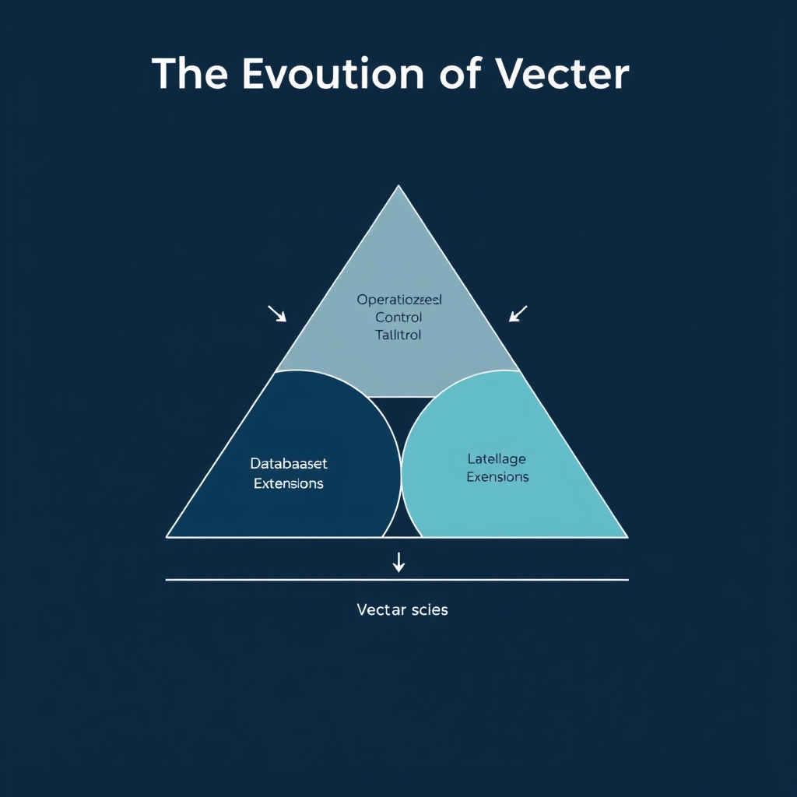
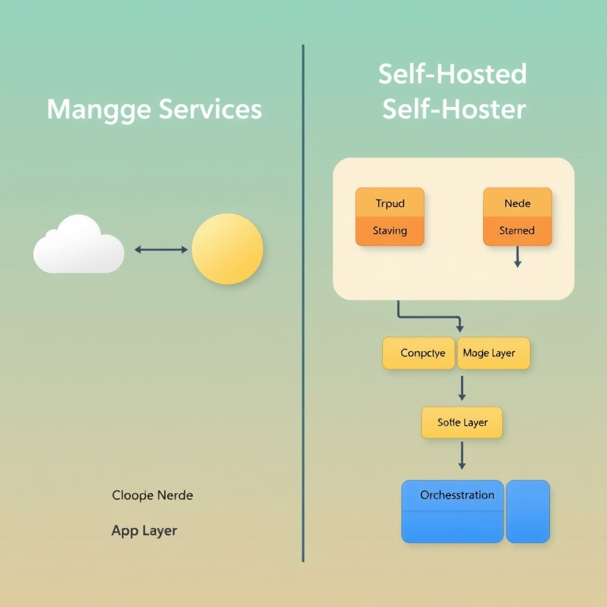
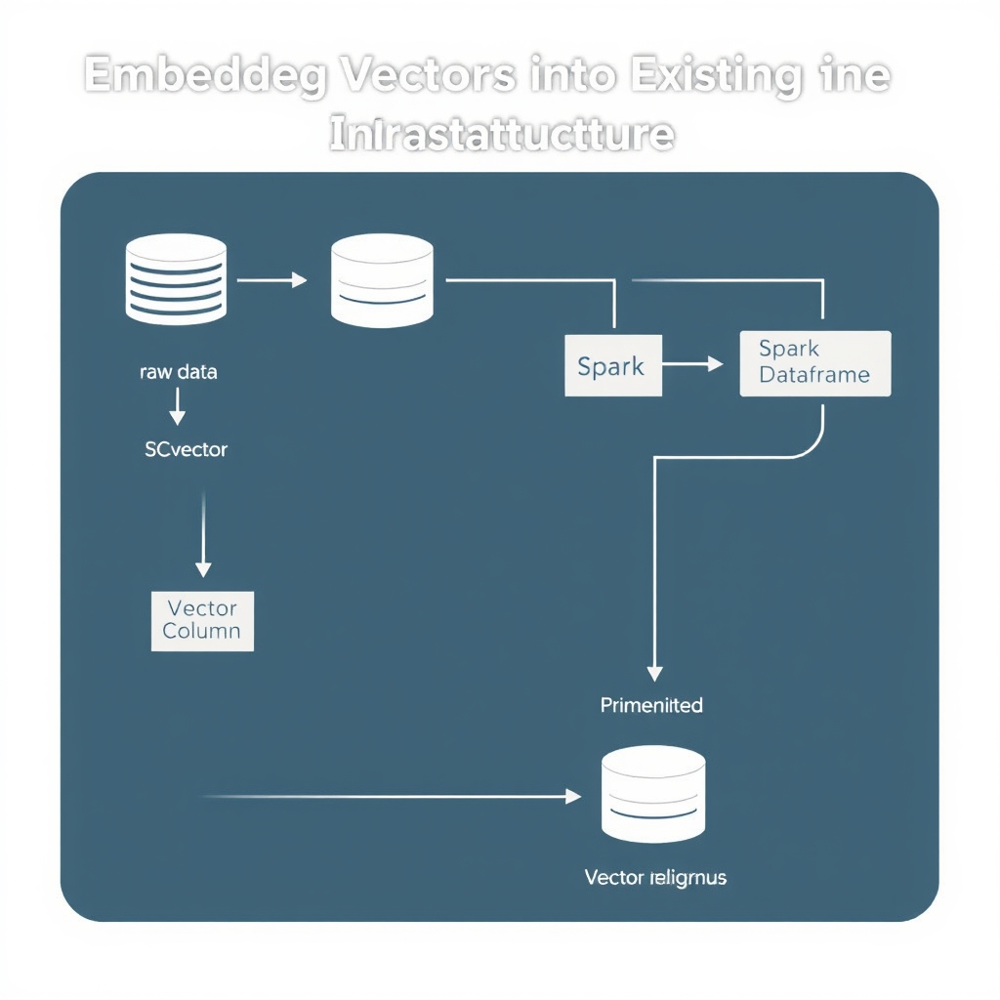

# Choosing Your Vector Database in 2026: Managed Services vs. Self-Hosted Engines

## The Evolution of Vector Storage

The vector‑search landscape has matured dramatically over the past few years. Early tools such as FAISS, Annoy, and HNSWlib were released primarily as research prototypes, offering high‑dimensional similarity search but requiring custom pipelines, manual hardware provisioning, and bespoke integration work. Their APIs were geared toward data scientists experimenting with embeddings rather than production engineers building resilient services.

As enterprises began to embed semantic search into customer‑facing applications, the need for **enterprise‑ready data infrastructure** grew. Vendors responded by adding durability guarantees, multi‑tenant isolation, role‑based access control, and native cloud integrations. These capabilities transformed vector stores from niche libraries into components that can sit alongside transactional databases, data lakes, and streaming platforms.

A notable trend in 2026 is the **shift toward lake‑native designs**. Instead of persisting vectors in a separate, purpose‑built cluster, modern systems write embeddings directly to object storage (e.g., S3 or Azure Blob) and index them in place. This approach reduces data duplication, aligns vector data lifecycle with the rest of the analytics stack, and leverages the scalability and cost model of cloud storage. Milvus 3.0 exemplifies this movement; its release announced a lake‑native architecture that stores vectors alongside raw data in the lake, enabling seamless retrieval without a dedicated storage tier [Milvus Tutorial](https://tech-insider.org/milvus-vector-database-tutorial-rag-13-steps-2026).

Within this evolving ecosystem, two architectural philosophies have emerged:

- **Purpose‑built vector databases** – systems such as Milvus, Pinecone, and Vespa are engineered from the ground up for high‑throughput similarity search. They provide specialized indexing structures, real‑time updates, and built‑in metrics for latency and recall.
- **Infrastructure extensions** – extensions like pgvector for PostgreSQL or Elasticsearch’s k‑NN plugin embed vector capabilities into existing relational or search engines. They appeal when teams prefer a single operational stack and can tolerate the performance trade‑offs of a general‑purpose engine.

Understanding where your workload sits on this spectrum—whether you need the raw performance of a dedicated engine or the operational simplicity of an extension—sets the stage for the deeper trade‑off analysis that follows.


*The vector storage landscape: Balancing operational simplicity, performance, and integration with existing data infrastructure.*

## Managed Services vs. Specialized Engines

### Zero‑Operations Overhead with Managed Services

Managed vector databases such as **Pinecone** promise a truly serverless experience: developers can ingest billions of vectors without ever provisioning or patching hardware. This eliminates the need for capacity planning, monitoring, and routine maintenance, allowing teams to focus on application logic and speed‑to‑market. The service’s architecture abstracts away scaling concerns, which is especially attractive for startups and enterprises that lack dedicated ops resources. [Pinecone](https://dev.to/riteshkokam/top-10-vector-databases-in-2026-4od9)


*Architectural footprint comparison: Managed serverless services hide infrastructure complexity, while self-hosted engines require explicit management of compute and storage nodes.*

### Performance and Cost‑Efficiency of Open‑Source Engines

Open‑source projects like **Milvus** are engineered for high‑throughput, low‑latency similarity search at billion‑scale. Because the software is freely available, organizations avoid recurring licensing fees, but they must provision the underlying compute and storage themselves. In practice, Milvus can achieve comparable query latency to managed offerings when tuned correctly, while the total cost of ownership can be lower for workloads that run continuously on owned infrastructure. [Milvus](https://dev.to/riteshkokam/top-10-vector-databases-in-2026-4od9)

### Scalability Trade‑offs at Billion‑Scale

| Aspect                 | Managed (e.g., Pinecone)                                      | Open‑Source (e.g., Milvus)                                                        |
| ---------------------- | ------------------------------------------------------------- | --------------------------------------------------------------------------------- |
| **Provisioning**       | Automatic, elastic scaling handled by the provider            | Manual cluster sizing; scaling requires adding nodes and rebalancing shards       |
| **Peak Load Handling** | Near‑instant burst capacity; provider absorbs spikes          | Requires pre‑emptive capacity planning; sudden spikes may cause throttling        |
| **Operational Cost**   | Pay‑as‑you‑go pricing; higher per‑query cost at extreme scale | Capital expense for hardware; lower marginal cost once infrastructure is in place |
| **Control**            | Limited to provider’s configuration options                   | Full control over indexing parameters, hardware choices, and custom optimizations |

Managed services excel when workloads are unpredictable or when the organization wants to avoid the operational burden of scaling to billions of vectors. Open‑source engines shine when the team can invest in infrastructure expertise and desires fine‑grained control over performance tuning.

### Decision Criteria for Self‑Hosting

- **Team Expertise**: If you have a dedicated SRE or data‑engineering team comfortable managing distributed storage, self‑hosting becomes viable.
- **Cost Predictability**: Evaluate whether a predictable capital expense (hardware) outweighs variable cloud service fees.
- **Regulatory Constraints**: On‑premises deployments may be required for data residency or compliance reasons.
- **Performance Customization**: Need for custom indexing strategies or hardware acceleration (e.g., GPUs) favors open‑source solutions.
- **Growth Trajectory**: Rapid, uncertain growth benefits from the elasticity of managed services, whereas steady, predictable growth can be amortized on owned clusters.

By weighing these factors against the zero‑ops convenience of managed platforms and the performance‑centric, cost‑effective nature of open‑source engines, you can select the vector storage approach that aligns with your architectural goals and budget constraints.

## Embedding Vectors into Existing Data Infrastructure


*Unified storage: Integrating vector search directly into relational engines or big data pipelines simplifies the tech stack.*

### pgvector: Vector Search Inside PostgreSQL

The **pgvector** extension adds a native `vector` data type and similarity operators to PostgreSQL, allowing you to store and query high‑dimensional embeddings without a separate service. Typical use cases include semantic text search, retrieval‑augmented generation (RAG) pipelines, and recommendation engines. Because the extension lives inside the relational engine, you retain ACID guarantees, existing role‑based access control, and the rich SQL ecosystem for joins and aggregations. In practice, a developer can create a table like:

```sql
CREATE TABLE documents (
    id   SERIAL PRIMARY KEY,
    text TEXT,
    emb  VECTOR(768)   -- e.g., OpenAI text‑embedding‑ada-002
);

-- Find the top‑5 most similar rows
SELECT id, text
FROM documents
ORDER BY emb <=> '[0.12,0.34,…]'::vector
LIMIT 5;
```

This pattern eliminates the need for a dedicated vector store and simplifies deployment, especially for teams already operating PostgreSQL clusters. The approach is highlighted as a preferred solution for integrating vector search into existing relational architectures in a recent benchmark comparison [PostgreSQL vs MySQL: 5 Benchmarks Reveal the Winner (2026)](https://tech-insider.org/postgresql-vs-mysql-2026).

### Apache Spark 4.2: Native Vector Retrieval in Big Data Pipelines

Spark 4.2 introduces **vector retrieval primitives** that let data engineers treat embeddings as first‑class citizens in distributed processing jobs. The new APIs expose functions such as `approxNearestNeighbors` and `vectorSimilarityJoin`, which operate on DataFrames backed by Parquet or Delta Lake files. This enables large‑scale similarity search directly within ETL or streaming workloads, removing the latency of round‑tripping to an external vector database.

```scala
val embeddings = spark.read.parquet("s3://my-bucket/embeddings.parquet")
val queryVec = Array(0.1, 0.2, …)
val nearest = embeddings.approxNearestNeighbors("vec", queryVec, 10)
nearest.show()
```

By embedding retrieval into Spark, organizations can consolidate AI model inference, feature engineering, and similarity search into a single compute fabric. The feature set is described as a potential game‑changer that could retire separate vector databases for many analytics workloads [Spark 4.2 AI workloads](https://thenewstack.io/spark-4-2-ai-workloads).

### When to Choose Extensions Over Dedicated Vector Databases

| Scenario                                                                       | Extension (e.g., pgvector)                         | Dedicated Vector DB                                         |
| ------------------------------------------------------------------------------ | -------------------------------------------------- | ----------------------------------------------------------- |
| Existing relational stack, low to moderate query volume                        | ✅ Simple deployment, unified backup/restore       | ❌ Added operational surface                                |
| Need for ultra‑low latency, billion‑scale vectors, custom indexing (IVF, HNSW) | ❌ Limited indexing options                        | ✅ Specialized algorithms, horizontal scaling               |
| Multi‑tenant SaaS with strict isolation                                        | ❌ Shared PostgreSQL instance may limit isolation  | ✅ Separate clusters, per‑tenant scaling                    |
| Real‑time streaming analytics                                                  | ❌ Relational DB not optimized for streaming joins | ✅ Integrated with streaming engines (e.g., Milvus + Kafka) |

In short, extensions shine when you **already run PostgreSQL**, your vector workload is modest, and you value operational simplicity. Dedicated engines become attractive when you need **advanced indexing**, **massive scale**, or **independent scaling** of compute and storage.

### Operational Footprint of Integrated Vector Search

- **Infrastructure** – Only the host database or Spark cluster needs to be provisioned; no extra services, networking, or security layers.
- **Monitoring** – Leverage existing DB metrics (CPU, I/O, query latency) or Spark UI dashboards; vector‑specific counters are exposed by the extensions.
- **Backup & Disaster Recovery** – Backups capture both relational data and vectors together, simplifying point‑in‑time restores.
- **Security** – Role‑based access control and row‑level security apply uniformly to vector columns, avoiding separate auth mechanisms.
- **Cost** – Eliminates separate VM or managed service fees; compute and storage are billed as part of the primary platform.

By embedding vector capabilities directly into PostgreSQL or Spark, teams can reduce architectural complexity while still supporting many AI‑driven use cases. The trade‑off is a ceiling on performance and scale that dedicated vector databases are designed to surpass.

## Sources

- [Milvus Tutorial: Vector DB RAG in 13 Steps [2026] - Tech Insider](https://tech-insider.org/milvus-vector-database-tutorial-rag-13-steps-2026)
- [Top 10 Vector Databases in 2026 - DEV Community](https://dev.to/riteshkokam/top-10-vector-databases-in-2026-4od9)
- [PostgreSQL vs MySQL: 5 Benchmarks Reveal the Winner [2026]](https://tech-insider.org/postgresql-vs-mysql-2026)
- [Spark 4.2 has a feature that could retire your vector database - The New Stack](https://thenewstack.io/spark-4-2-ai-workloads)