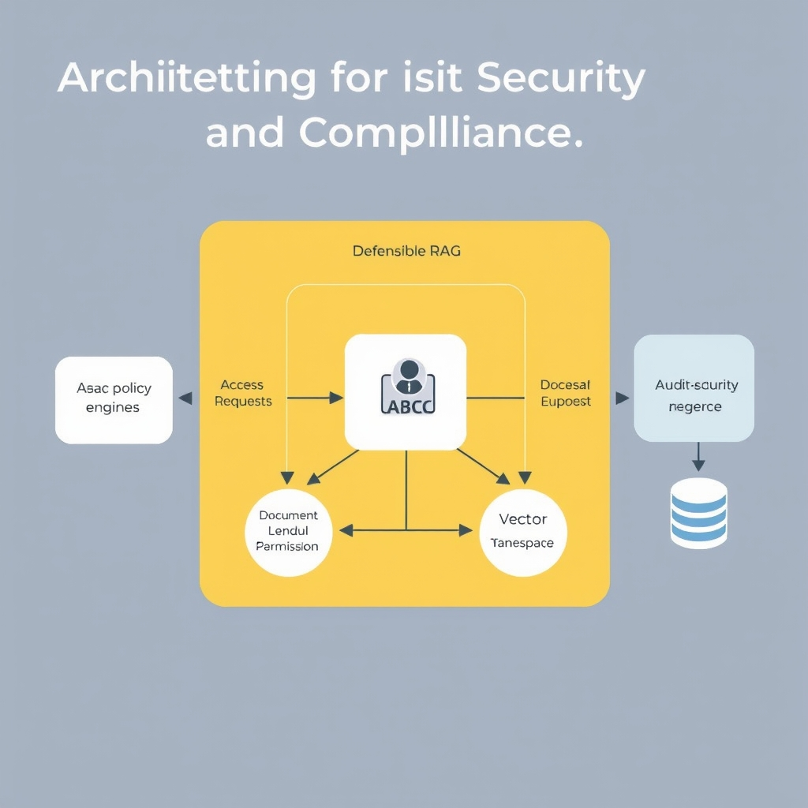
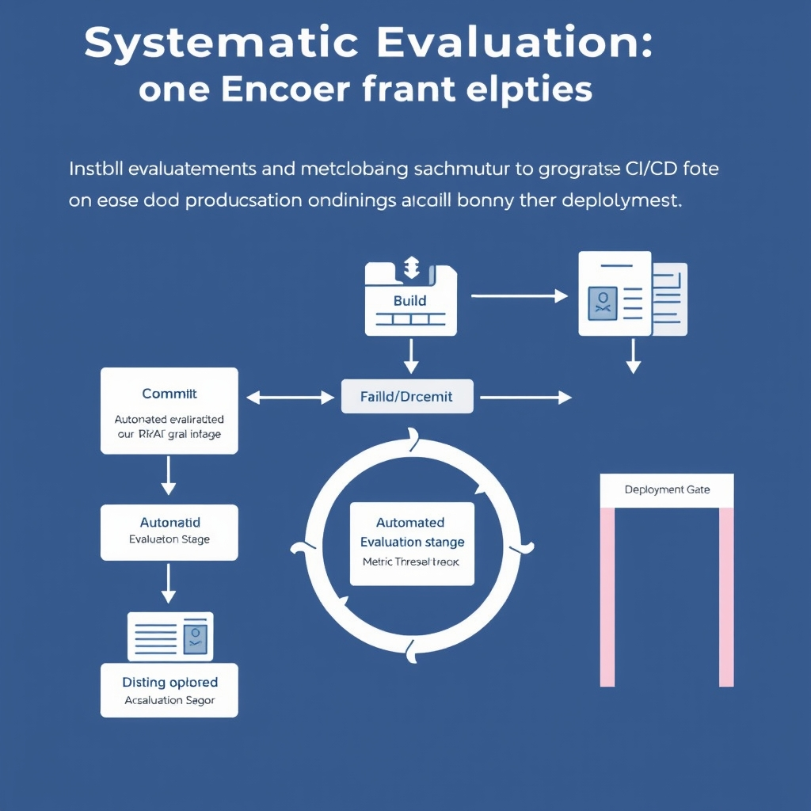

# Defensible RAG: Building Enterprise-Grade AI Infrastructure in 2026

## The Shift to Defensible RAG

**From Prototype to Governed Infrastructure**

In the early 2020s, most RAG deployments were proof‑of‑concept notebooks that stitched together an LLM, a vector store, and a simple retrieval script. Security was an afterthought, audit trails were nonexistent, and compliance checks were performed manually, if at all. By 2026 the landscape has shifted to a *governed infrastructure* model: RAG pipelines are provisioned as repeatable services, integrated with enterprise identity providers, and wrapped in policy engines that enforce data residency, retention, and access controls.

**Defensible RAG Defined**

*Defensible RAG* is the convergence of three non‑negotiable pillars:

- **Performance** – low‑latency retrieval and accurate generation that meet SLAs.
- **Auditability** – immutable logs for every query, document hit, and model inference.
- **Compliance** – built‑in controls that satisfy regulations such as the EU AI Act, HIPAA, or industry‑specific standards.
  Only when all three are satisfied can an organization claim its RAG solution is defensible in a legal or risk‑management audit.

**Regulatory Catalysts**

The EU AI Act, effective in 2024, classifies high‑risk AI systems—including those that retrieve and synthesize proprietary data—as subject to strict transparency and accountability obligations. Similar pressures are emerging in the U.S. (the AI Accountability Act) and in sector‑specific regimes (e.g., FINRA for finance). These regulations mandate documented data provenance, user‑level consent, and the ability to trace a generated answer back to its source documents.

**Technical Foundations for a Defensible Stack**

Meeting these demands requires a set of core components:

- **Attribute‑Based Access Control (ABAC)** at the retrieval layer to enforce fine‑grained policies.
- **Document‑level permissions** that prevent unauthorized exposure of sensitive records.
- **User‑isolated retrieval contexts** for multi‑tenant deployments, ensuring one tenant’s queries cannot influence another’s results.
- **Comprehensive audit logging** that captures query metadata, vector similarity scores, and LLM prompts for downstream review.

Together, these elements lay the groundwork for the deeper security and evaluation discussions that follow in the next sections.

## Architecting for Security and Compliance

### Implementing Attribute‑Based Access Control (ABAC) at the Retrieval Layer

ABAC evaluates policies against attributes of **subjects**, **objects**, **actions**, and **environment**. In a RAG pipeline, the retrieval layer becomes the first gate where a request is matched against these attributes before any vector search is executed. For example, a finance analyst (subject) requesting a contract clause (object) from a legal corpus can be allowed only if the request originates from the corporate network (environment) and the action is a *read* operation. By enforcing ABAC at this stage, you prevent unauthorized vectors from being queried, reducing the risk of data exfiltration before the LLM even sees the context.


*A defensible RAG architecture layers security controls to ensure that every retrieval request is authorized, isolated, and logged for compliance.*

> **Implementation tip**: Encode user role, department, and clearance level into JWT claims, then translate those claims into ABAC predicates that the retrieval service evaluates. This approach works with both managed vector stores (e.g., Pinecone) and self‑hosted solutions like Milvus.

______________________________________________________________________

### Document‑Level Permissions to Stop Leakage

RAG systems often ingest heterogeneous document collections—contracts, medical records, source code—each with its own confidentiality requirements. A coarse‑grained index that treats the entire corpus as a single permission set can inadvertently surface sensitive snippets to users lacking clearance. Document‑level permissions attach a security label to each indexed chunk (e.g., *public*, *confidential*, *restricted*). During retrieval, the engine filters out chunks whose labels do not satisfy the requester's attribute set.

**Concrete scenario**: A customer‑support chatbot accesses a knowledge base containing both public FAQs and internal troubleshooting guides. By tagging the internal guides with a *restricted* label, the ABAC check ensures that a support agent without the *internal‑access* attribute never receives those passages, even if the LLM attempts to hallucinate them.

______________________________________________________________________

### User‑Isolated Retrieval for Multi‑Tenant Deployments

Enterprises frequently host multiple business units or external clients on a shared RAG infrastructure. Without isolation, one tenant's queries could influence another's retrieval results via shared cache or embedding collisions. User‑isolated retrieval creates a logical silo per tenant:

1. **Separate vector namespaces** – each tenant's embeddings are stored in a distinct collection or namespace within the vector DB.
1. **Tenant‑specific query routing** – the API gateway injects the tenant identifier into the retrieval request, ensuring the correct namespace is queried.
1. **Independent quota and latency controls** – resource limits are enforced per tenant, preventing a noisy‑neighbor from degrading service for others.

This pattern aligns with the guidance from the *Enterprise RAG Guide 2026*, which recommends user‑isolated retrieval as a core control for regulated environments.

______________________________________________________________________

### Auditable Retrieval Pipelines

Compliance regimes such as the EU AI Act demand end‑to‑end traceability of AI decisions. In a RAG workflow, every step—from the initial user request, through vector similarity scoring, to the final LLM generation—must be logged with immutable metadata:

- **Request metadata**: user ID, tenant ID, timestamp, request payload hash.
- **Retrieval metadata**: vector DB namespace, top‑k document IDs, similarity scores, applied permission filters.
- **LLM inference metadata**: model version, temperature, token usage.
- **Response metadata**: generated answer hash, any post‑processing steps.

Storing these logs in a tamper‑evident system (e.g., append‑only log service or WORM storage) enables auditors to reconstruct the exact data flow for any query. Moreover, automated alerting can flag anomalous patterns—such as repeated access to *restricted* documents by a low‑privilege user—allowing rapid incident response.

______________________________________________________________________

### Putting It All Together

A defensible RAG architecture therefore layers security controls:

1. **ABAC** at the retrieval entry point to enforce role‑based policies.
1. **Document‑level permissions** to filter sensitive chunks.
1. **User‑isolated namespaces** for multi‑tenant safety.
1. **Comprehensive audit logging** for regulatory compliance.

By integrating these mechanisms, enterprises move beyond ad‑hoc prototypes toward a governed AI stack that satisfies both performance expectations and the stringent auditability demanded by modern regulations.

## Selecting the Right Framework and Database

### Framework Comparison

| Feature        | LangChain                                                                                                                                                                                   | LlamaIndex                                                                                        | Haystack                                                                                                                      |
| -------------- | ------------------------------------------------------------------------------------------------------------------------------------------------------------------------------------------- | ------------------------------------------------------------------------------------------------- | ----------------------------------------------------------------------------------------------------------------------------- |
| Primary role   | Orchestration of complex LLM workflows, tool integration, prompt chaining                                                                                                                   | High‑performance retrieval over heterogeneous document stores                                     | End‑to‑end pipelines with built‑in compliance checks, audit trails, and data governance                                       |
| Strengths      | Flexible DAG‑style pipelines; extensive connector library; strong community support【2†https://www.secondtalent.com/resources/top-rag-frameworks-and-tools-for-enterprise-ai-applications】 | Optimized indexing for large corpora; native support for multi‑modal data; fast similarity search | Pre‑configured components for regulated sectors (healthcare, finance); built‑in policy enforcement and model‑level provenance |
| Weaknesses     | Can become verbose for simple use‑cases; requires explicit security wrappers                                                                                                                | Limited out‑of‑the‑box compliance features; retrieval‑only focus                                  | Heavier runtime footprint; fewer integrations with non‑AI services                                                            |
| Ideal use‑case | Enterprises that need custom routing, tool use, or multi‑step reasoning                                                                                                                     | Document‑centric applications where latency and relevance dominate                                | Organizations under strict regulatory regimes that need auditability baked into the pipeline                                  |

### Vector Database Evaluation

| Database     | Management Model                              | Scale & Performance                                                                        | Integration Fit                                                                                                                             |
| ------------ | --------------------------------------------- | ------------------------------------------------------------------------------------------ | ------------------------------------------------------------------------------------------------------------------------------------------- |
| **Pinecone** | Fully managed SaaS, zero‑ops                  | Horizontal scaling with automatic sharding; good for up to billions of vectors             | Ideal for teams that prefer not to operate infra; aligns with cloud‑first strategies【3†https://encore.dev/articles/best-vector-databases】 |
| **Milvus**   | Self‑hosted (on‑prem or cloud)                | Enterprise‑scale, GPU‑accelerated indexing; supports billions of vectors and hybrid search | Suits organizations that need raw performance, on‑prem sovereignty, or custom extensions                                                    |
| **pgvector** | PostgreSQL extension (managed or self‑hosted) | Limited to PostgreSQL’s scaling limits; suitable for moderate workloads                    | Perfect for teams already running PostgreSQL, enabling unified relational + vector queries                                                  |

### Mapping Infrastructure Requirements to Tool Selection

1. **Data Sovereignty & On‑Prem Needs**
   - Choose **Milvus** (self‑hosted) or **pgvector** if the data cannot leave the corporate firewall. Pair with **Haystack** for its compliance‑first pipeline, ensuring audit logs are stored alongside the vector store.
1. **Zero‑Ops / Rapid Time‑to‑Market**
   - Opt for **Pinecone** to avoid operational overhead. Combine with **LangChain** to build sophisticated orchestration while delegating storage concerns to the managed service.
1. **Existing PostgreSQL Investments**
   - Leverage **pgvector** to reuse existing DB ops tooling. Use **LangChain** for orchestration or **LlamaIndex** if retrieval performance is the primary concern.
1. **Regulated Industry Requirements**
   - Deploy **Haystack** for its built‑in policy enforcement and auditability. Pair with a self‑hosted **Milvus** cluster to keep vector data under strict control.
1. **High‑Throughput, Multi‑Modal Retrieval**
   - **Milvus** with GPU acceleration delivers the throughput needed for real‑time, multi‑modal queries. Combine with **LlamaIndex** for its retrieval‑centric APIs.

### Decision Matrix (Quick Reference)

| Requirement                                 | Recommended Framework   | Recommended Vector Store                                        |
| ------------------------------------------- | ----------------------- | --------------------------------------------------------------- |
| Full workflow orchestration, cloud‑native   | LangChain               | Pinecone (managed)                                              |
| Document‑heavy retrieval, performance‑first | LlamaIndex              | Milvus (self‑hosted)                                            |
| Regulated compliance, audit trails          | Haystack                | Milvus (self‑hosted) or pgvector (if PostgreSQL already in use) |
| Minimal ops, leverage existing Postgres     | LangChain or LlamaIndex | pgvector                                                        |
| Sovereign data, on‑prem only                | Haystack                | Milvus                                                          |

By aligning the **security posture**, **operational model**, and **performance expectations** with the appropriate framework‑database pair, enterprises can construct a defensible RAG stack that satisfies both compliance mandates and business agility.

## Systematic Evaluation: Moving Beyond Anecdotes

### Core Metrics for Defensible RAG

Enterprise teams need a shared language to judge whether a RAG answer is *trustworthy* and *useful*. The community has converged on four quantitative metrics:


*Integrating evaluation metrics into the CI/CD pipeline creates an automated quality gate, ensuring only compliant and accurate RAG models reach production.*

| Metric                | What it measures                                                         | Why it matters for compliance                                                     |
| --------------------- | ------------------------------------------------------------------------ | --------------------------------------------------------------------------------- |
| **Faithfulness**      | Degree to which the generated answer stays true to the source documents. | Prevents hallucinations that could lead to misinformation or regulatory breaches. |
| **Answer Relevance**  | How well the answer addresses the user’s intent.                         | Ensures that downstream decisions are based on pertinent information.             |
| **Context Precision** | Ratio of retrieved passages that are actually used in the final answer.  | Reduces exposure of unnecessary data, supporting data minimization principles.    |
| **Context Recall**    | Proportion of all relevant passages that were retrieved.                 | Guarantees that critical evidence is not omitted, a key audit requirement.        |

These definitions are drawn from the latest evaluation research, which highlights their adoption across RAGAS, DeepEval, and TruLens 【https://atlan.com/know/how-to-evaluate-rag-systems-explained】.

### Evaluation Frameworks in 2026

| Framework    | Primary Strength                                                                | Typical Use‑Case                                                  |
| ------------ | ------------------------------------------------------------------------------- | ----------------------------------------------------------------- |
| **RAGAS**    | Broad metric suite, easy integration with LangChain/LlamaIndex pipelines.       | Baseline compliance dashboards.                                   |
| **DeepEval** | Deep‑learning‑based similarity scoring, useful for nuanced domain vocabularies. | Highly regulated sectors (e.g., finance, healthcare).             |
| **TruLens**  | End‑to‑end observability with model‑level provenance tracking.                  | Auditable CI/CD pipelines where each inference must be traceable. |

All three are open‑source and provide Python APIs that can be wrapped in automated tests.

### Embedding Evaluation in CI/CD

1. **Create a static test suite** – curate a set of representative queries with known ground‑truth answers and reference documents.
1. **Add a test stage** – after the model build step, invoke the evaluation framework and output a JSON report.
1. **Fail fast on regressions** – define threshold values (e.g., faithfulness ≥ 0.85). If any metric falls below, the pipeline aborts.
1. **Publish results** – push the JSON report to an artifact store or a compliance dashboard for auditors.

A typical GitHub Actions snippet might look like:

```yaml
name: RAG Evaluation
on: [push, pull_request]
jobs:
  evaluate:
    runs-on: ubuntu-latest
    steps:
      - uses: actions/checkout@v3
      - name: Set up Python
        uses: actions/setup-python@v4
        with:
          python-version: '3.11'
      - name: Install dependencies
        run: |
          pip install ragas[all] langchain
      - name: Run evaluation
        env:
          OPENAI_API_KEY: ${{ secrets.OPENAI_API_KEY }}
        run: |
          python scripts/evaluate_ragas.py
      - name: Upload report
        uses: actions/upload-artifact@v3
        with:
          name: rag-eval-report
          path: reports/metrics.json
```

### Minimal RAGAS Check (Python)

The following script demonstrates a *basic* RAGAS evaluation that can be dropped into the CI step above. It loads a small test set, runs the retrieval‑augmented generation, and prints a summary of the four core metrics.

```python
import json
from ragas import evaluate
from ragas.metrics import (
    faithfulness,
    answer_relevance,
    context_precision,
    context_recall,
)
from langchain.llms import OpenAI
from langchain.vectorstores import FAISS
from langchain.embeddings import OpenAIEmbeddings

# 1️⃣ Load a tiny test corpus (queries, reference docs, expected answers)
with open("tests/rag_test_cases.json") as f:
    test_cases = json.load(f)

# 2️⃣ Initialise LLM and vector store (replace with your production components)
llm = OpenAI(model="gpt-4o-mini")
embeddings = OpenAIEmbeddings()
vector_store = FAISS.from_texts([c["doc"] for c in test_cases], embeddings)

# 3️⃣ Build a simple RAG pipeline
def rag(query: str) -> str:
    docs = vector_store.similarity_search(query, k=4)
    context = "\n\n".join([d.page_content for d in docs])
    return llm.invoke(f"Answer the question using the following context:\n{context}\n\nQuestion: {query}")

# 4️⃣ Run evaluation
results = evaluate(
    test_cases,
    rag,
    metrics=[faithfulness, answer_relevance, context_precision, context_recall],
)

# 5️⃣ Output a concise report
summary = {m.name: round(v, 3) for m, v in results.items()}
print("RAGAS evaluation summary:", summary)
# Optionally write to a file for CI artifact collection
with open("reports/metrics.json", "w") as out:
    json.dump(summary, out, indent=2)
```

**Key takeaways**

- The four metrics give a balanced view of *truthfulness*, *usefulness*, and *data exposure*.
- RAGAS, DeepEval, and TruLens each integrate cleanly with modern orchestration tools (LangChain, LlamaIndex), enabling repeatable, auditable testing.
- Embedding the evaluation step in CI/CD turns performance monitoring into a compliance control, ensuring that any model update is objectively vetted before reaching production.

By treating evaluation as code, enterprises can satisfy both technical SLAs and regulatory audit trails, closing the gap between rapid AI innovation and defensible, enterprise‑grade RAG deployments.

## The Future of Governed AI

The enterprise landscape has moved past the hobby‑ist prototypes of the early 2020s and now treats Retrieval‑Augmented Generation as a core, governed service. Early pilots focused on raw latency and raw relevance; today every query is wrapped in ABAC policies, document‑level permissions, and immutable audit logs. This evolution is the backbone of what we call *defensible RAG*—a stack where performance, security, and compliance are inseparable.

Security and systematic evaluation have become the primary differentiators for successful deployments. Frameworks such as LangChain, LlamaIndex, and Haystack give engineers the flexibility to build complex pipelines, but without ABAC enforcement, isolated user retrieval, and rigorous logging, even the fastest retriever can expose sensitive data. Likewise, the four core metrics—faithfulness, answer relevance, context precision, and context recall—must be measured continuously with tools like RAGAS, DeepEval, or TruLens. Organizations that embed these checks into CI/CD pipelines can prove to regulators that their AI behaves predictably under audit.

A **compliance‑first mindset** therefore isn’t a bureaucratic add‑on; it’s a strategic advantage. By choosing stack components that natively support sovereignty (e.g., Milvus for on‑prem GPU acceleration or pg‑vector for PostgreSQL‑centric environments) and by enforcing policy‑driven access at the retrieval layer, enterprises future‑proof their AI investments against tightening regulations such as the EU AI Act.

The market reflects this shift. The enterprise RAG market is projected to grow from **$1.94 B in 2025 to $9.86 B by 2030**, a 38.4 % compound annual growth rate【https://www.sphereinc.com/blogs/best-enterprise-rag-platforms-2026】. Companies that adopt defensible RAG now will be positioned to capture a larger share of this expanding spend, while those that lag on security or evaluation risk costly remediation or regulatory penalties. Staying ahead means treating governance as a first‑class citizen of the architecture—not an afterthought.