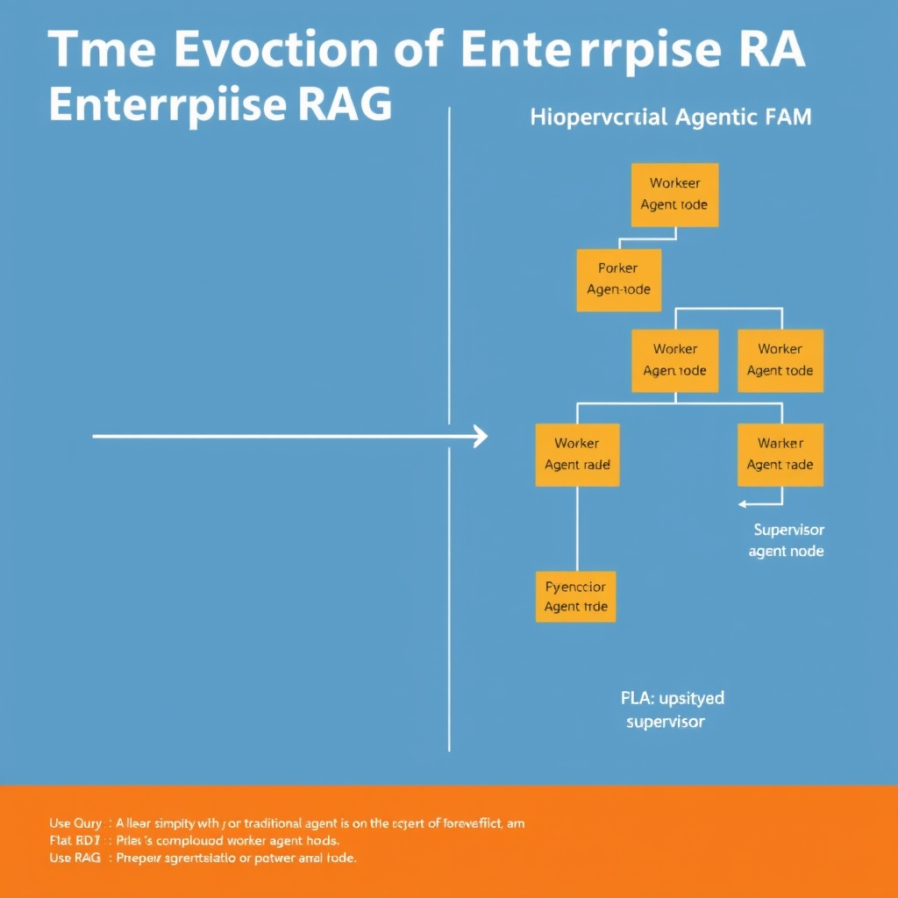
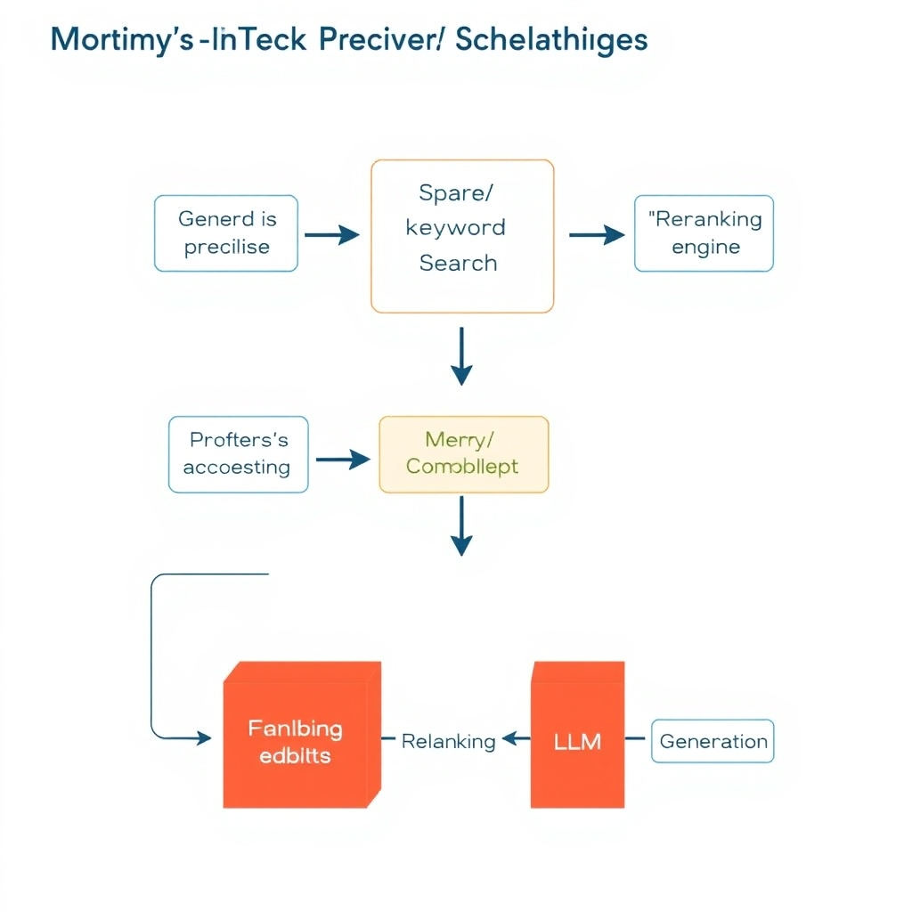
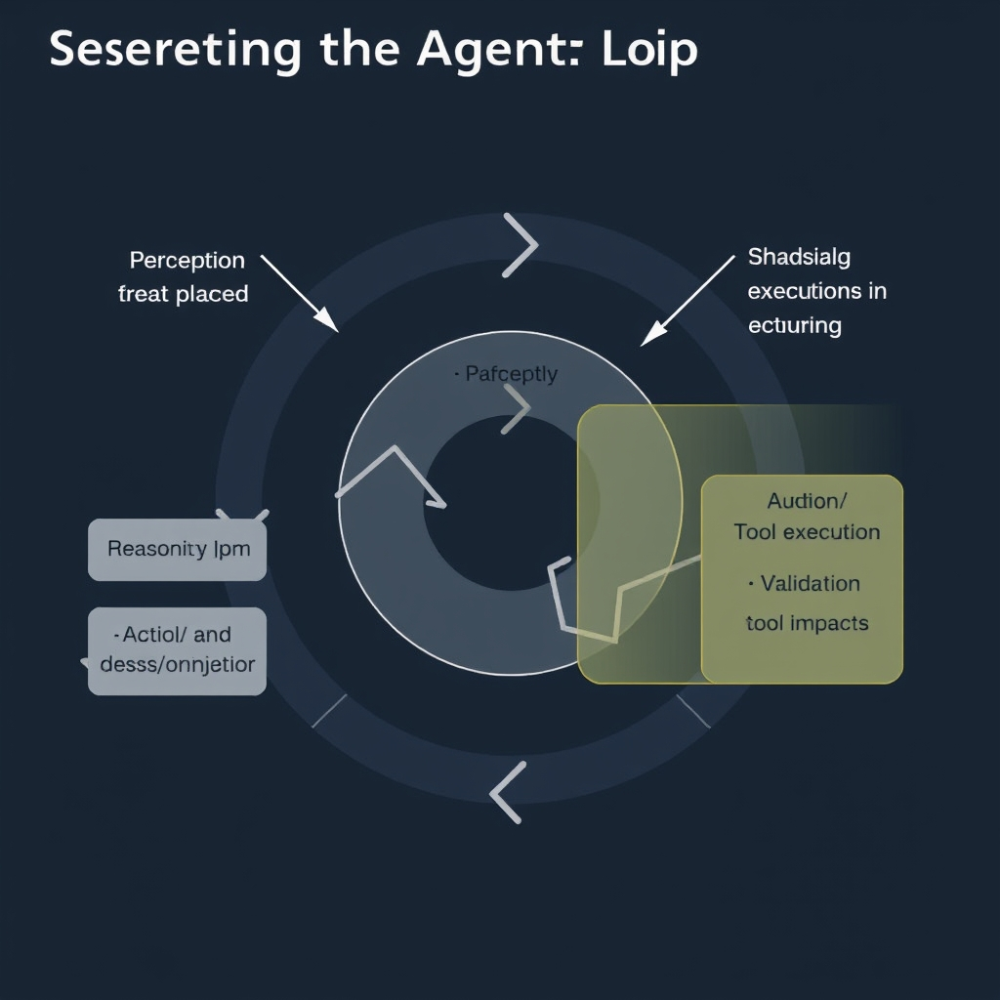

# Enterprise RAG: Scaling to Agentic Architectures in 2026

## The Evolution of Enterprise RAG

Enterprise Retrieval‑Augmented Generation (RAG) has outgrown the simple “retrieve‑then‑generate” pipeline that dominated early deployments. In a flat RAG setup, a single vector index returns the top‑k passages, which are then fed directly to an LLM. This approach suffers from two intertwined weaknesses:

*Comparison of traditional flat RAG (left) versus modern hierarchical agentic RAG (right).*

- **Limited reasoning depth** – the model must resolve the entire user intent from a monolithic chunk of text, often leading to hallucinations when the query spans multiple domains.
- **Brittle error handling** – if the initial retrieval misses a critical document, the downstream generation has no fallback, causing a cascade of incorrect answers.

Hierarchical, multi‑agent orchestration addresses both issues by introducing a supervisory layer that decomposes a complex query into sub‑tasks, dispatches them to specialized worker agents, and aggregates the results. The **EntQA** benchmark quantifies this shift: hierarchical orchestration achieved **84.5 % accuracy**, compared with **45.2 % for standard flat RAG** and **62.8 % for flat‑agent variants** — a near‑doubling of performance on enterprise‑grade questions [InfoQ article](https://www.infoq.com/articles/building-hierarchical-agentic-rag-systems).

Standard retrieval pipelines also struggle with domain‑specific nuance. Sparse keyword search can surface relevant terms, but lacks semantic breadth; pure vector similarity captures semantics but often overlooks rare industry jargon. By contrast, modern agentic reasoning leverages **tool‑calling** and **dynamic context switching**: a supervisor can invoke a domain‑expert retriever for legal clauses, then hand the result to a financial‑analyst agent, each operating with its own retrieval strategy. This compositional flexibility eliminates the one‑size‑fits‑all limitation of flat RAG.

The current trajectory therefore reflects a deliberate move toward **architectural complexity as a reliability lever**. Adding supervisory agents, error‑recovery loops, and specialized workers introduces more moving parts, but each layer contributes deterministic checkpoints that can be monitored, logged, and retried. In production environments where a single erroneous answer can have regulatory or financial repercussions, this engineered complexity is not a luxury—it is a prerequisite for enterprise‑grade trustworthiness.

## Modern Retrieval Strategies

Hybrid retrieval pairs dense vector similarity with a sparse keyword search layer, then applies a reranking model to surface the most relevant passages. The dense embeddings capture semantic similarity, while the keyword component ensures exact term matches that pure vector search often misses. Adding a reranker—typically a cross‑encoder that scores candidate documents against the query—creates a three‑stage pipeline that balances recall and precision for enterprise workloads. This architecture has become a widely adopted strategy for large‑scale RAG deployments because it overcomes the “scale wall” encountered by single‑method pipelines [Hybrid retrieval has become the consensus enterprise strategy](https://venturebeat.com/data/the-retrieval-rebuild-why-hybrid-retrieval-intent-tripled-as-enterprise-rag-programs-hit-the-scale-wall).

*A hybrid retrieval pipeline combines dense and sparse search results, which are then refined through a reranking layer before generation.*

### Reranking as a Critical Stage

In isolation, dense or sparse retrieval can return thousands of plausible candidates. Reranking narrows this set to a handful of top‑ranked results by evaluating each candidate with the full query context, often using a larger language model. This step is essential for enterprise use cases where downstream generation must rely on highly accurate source material; even a small drop in precision can propagate errors throughout the answer chain. The added computational cost is justified by measurable gains in answer correctness and reduced hallucination rates.

### LlamaIndex: Retrieval‑First by Design

Among the emerging toolkits, LlamaIndex distinguishes itself by treating retrieval as the foundational building block rather than an optional plugin. Unlike general‑purpose orchestration frameworks such as LangGraph or CrewAI, which embed retrieval as one of many capabilities, LlamaIndex structures its APIs and data abstractions around a retrieval‑first mindset, enabling agents to query, filter, and synthesize knowledge with minimal friction [LlamaIndex is positioned as a retrieval‑first framework for knowledge‑intensive agents](https://dynamicbusiness.com/featured/tech-tuesday/tech-tuesday-the-complete-guide-to-agentic-ai-tools-in-2026.html).

### Precision Gains for Domain‑Specific Documents

Hybrid pipelines excel in specialized corpora—legal contracts, technical manuals, or regulatory filings—where terminology is both nuanced and critical. Sparse keyword search captures domain‑specific jargon, while dense vectors surface semantically related passages that may use synonymous phrasing. The reranker then aligns these signals, delivering a precision boost that single‑method approaches struggle to achieve. Enterprises observe notable improvements in exact‑match retrieval accuracy on domain‑specific benchmarks when adopting hybrid strategies, directly translating to higher downstream answer fidelity.

In summary, modern enterprise RAG systems rely on a hybrid retrieval stack—dense + sparse + rerank—to meet the demanding precision and scalability requirements of complex business workflows.

## Architecting with Agentic Frameworks and MCP

### Core Agentic Frameworks for Enterprise RAG

- **LangGraph** – a graph‑based orchestration layer that lets developers define nodes (agents, tools, or data sources) and the edges that represent execution flow. Its declarative DSL makes it straightforward to compose hierarchical pipelines where higher‑level agents delegate subtasks to specialized child agents.
- **AutoGen** – focuses on automatic generation of multi‑agent conversations. It abstracts the turn‑taking logic, enabling agents to negotiate, request clarification, or invoke tools without hard‑coded routing.
- **CrewAI** – provides a crew‑management abstraction, treating each agent as a team member with a defined role, responsibility, and communication contract. This encourages clear ownership of sub‑tasks in large‑scale business workflows.

All three frameworks are highlighted as the leading open‑source options for enterprise AI orchestration in 2026 [5 Layers of Future‑Proof Enterprise AI Stack | ReadITQuik](https://readitquik.com/news/the-5-layers-of-a-future-proof-enterprise-ai-stack-2026-guide).

### Model Context Protocol (MCP): The Glue for Tool Communication

The Model Context Protocol (MCP) standardizes how agents exchange context, invoke tools, and return results. Rather than each framework defining its own JSON schema, MCP provides a common envelope that includes:

1. **Tool signature** – name, input schema, and expected output format.
1. **Execution metadata** – timestamps, provenance IDs, and security tags.
1. **Result wrapping** – a uniform wrapper that distinguishes successful responses from errors.

MCP now ships in every major orchestration framework, allowing agents built with LangGraph, AutoGen, or CrewAI to call the same external services (e.g., ERP lookup, document summarizer) without custom adapters [5 Layers of Future‑Proof Enterprise AI Stack | ReadITQuik](https://readitquik.com/news/the-5-layers-of-a-future-proof-enterprise-ai-stack-2026-guide).

### Why Standardized Protocols Matter for Multi‑Agent Workflows

- **Interoperability** – Agents from different vendors can collaborate when they speak the same protocol, enabling hybrid crews that combine LangGraph's graph execution with AutoGen's conversational routing.
- **Observability** – Uniform metadata lets ops teams instrument end‑to‑end tracing, performance metrics, and audit logs across the entire agent network.
- **Security** – A shared schema makes it easier to enforce validation, sandboxing, and least‑privilege policies at the protocol layer rather than per‑agent.
- **Versioning** – MCP’s explicit version field allows gradual rollout of protocol enhancements without disrupting existing agents.

### Hierarchical Delegation: From High‑Level Goals to Concrete Actions

Enterprise RAG tasks often involve multiple layers of reasoning:

1. **Strategic Planner** – receives a business objective (e.g., "prepare a quarterly risk report") and decomposes it into sub‑goals.
1. **Domain Specialists** – child agents such as a financial data retriever, a compliance validator, and a narrative generator each handle a focused slice of the problem.
1. **Tool Executors** – low‑level agents invoke vector stores, SQL databases, or external APIs using MCP‑wrapped calls.

The hierarchical model mirrors human project management: a senior analyst delegates to subject‑matter experts, who in turn use specific tools. By encoding this delegation in the orchestration graph, the system gains:

- **Scalability** – parallel execution of independent sub‑tasks reduces latency.
- **Reliability** – failures are isolated to the offending leaf agent; higher‑level agents can retry, fallback, or re‑route.
- **Explainability** – each delegation step is logged, providing a traceable decision tree for auditors.

When combined, LangGraph’s graph execution, AutoGen’s conversational coordination, and CrewAI’s role‑based crew management, all unified by MCP, give enterprises a robust blueprint for building production‑grade, hierarchical RAG pipelines that can evolve as business needs change.

## Securing the Agentic Loop

### Defining the Agent Loop Security Surface

The *agent loop* comprises three tightly coupled stages: perception (ingesting external data), reasoning (model inference), and action (invoking tools or APIs). Each stage presents a distinct attack surface that can be hijacked by malicious inputs, compromised tool endpoints, or rogue downstream services. Securing the loop therefore means protecting the data that enters the agent, the integrity of the model’s intermediate state, and the safety of any outbound calls the agent makes.

*Securing the agent loop requires implementing validation gateways at input and sandboxing actions to prevent rogue tool execution.*

### Risks Inherent to Tool‑Calling and Autonomous Reasoning

1. **Tool‑calling injection** – When an LLM decides to call a tool, it constructs a request payload based on its internal reasoning. An attacker can manipulate the context (e.g., by inserting crafted documents) so the agent generates a malicious request, leading to privilege escalation or data exfiltration.
1. **Feedback‑loop poisoning** – Agents often feed the results of a tool call back into the reasoning step. If the tool returns tampered data, the next inference cycle can be steered toward harmful conclusions, amplifying the impact of a single compromised response.
1. **Unbounded autonomy** – In multi‑step workflows, agents may iterate indefinitely. Without strict termination checks, an adversary can force the loop into a denial‑of‑service state or cause it to exhaust resources.

These risks are highlighted in industry analyses that note the primary 2026 security challenge is not patching the model itself but *securing the perception‑reasoning‑action cycle* — as discussed by [CSO Online](https://www.csoonline.com/article/4132860/why-2025s-agentic-ai-boom-is-a-cisos-worst-nightmare.html).

### Monitoring and Sandboxing Strategies

- **Input validation gateway** – Deploy a lightweight validator that checks incoming documents for anomalous patterns (e.g., unexpected code snippets, hidden Unicode) before they reach the agent’s perception stage.
- **Tool‑call audit log** – Record every tool invocation with timestamps, request payloads, and response hashes. Real‑time analytics can flag deviations from established usage profiles.
- **Execution sandbox** – Run external tools inside containerized environments with least‑privilege network policies. Restrict file system access and enforce time‑outs to prevent runaway processes.
- **Loop‑state checksum** – After each reasoning step, compute a cryptographic checksum of the agent’s internal state. Any unexpected change can trigger an alert and abort the loop.

### Why Traditional Prompt‑Injection Defenses Fall Short

Classic prompt‑injection mitigations focus on sanitizing the user‑provided prompt before it reaches the LLM. In an agentic system, however, the *effective prompt* is a composite of:

- The original user query.
- Data retrieved during perception.
- Outputs from previously called tools.

Because the agent continuously rewrites its own prompt based on tool results, an attacker can embed malicious payloads **after** the initial sanitization step, bypassing static filters. Moreover, the autonomous reasoning loop can amplify a tiny injection into a full‑blown exploit as the compromised state propagates through subsequent iterations. Therefore, security must shift from static prompt filtering to dynamic, runtime controls that monitor the entire loop.

### Practical Blueprint

1. **Establish a perimeter** around the perception stage with strict schema validation.
1. **Instrument every tool call** with immutable logging and enforce least‑privilege execution.
1. **Implement loop‑state integrity checks** to detect tampering between cycles.
1. **Continuously audit** the logs with anomaly‑detection models tuned to the specific business workflow.

By treating the agent loop as a first‑class security domain, enterprises can move beyond fragile prompt‑only defenses and achieve the reliability required for production‑grade RAG deployments.

## Sources

- [Building Hierarchical Agentic RAG Systems: Multi-Modal Reasoning with Autonomous Error Recovery - InfoQ](https://www.infoq.com/articles/building-hierarchical-agentic-rag-systems)
- [The retrieval rebuild: Why hybrid retrieval intent tripled as enterprise RAG programs hit the scale wall | VentureBeat](https://venturebeat.com/data/the-retrieval-rebuild-why-hybrid-retrieval-intent-tripled-as-enterprise-rag-programs-hit-the-scale-wall)
- [Tech Tuesday: The complete guide to agentic AI tools in 2026](https://dynamicbusiness.com/featured/tech-tuesday/tech-tuesday-the-complete-guide-to-agentic-ai-tools-in-2026.html)
- [5 Layers of Future-Proof Enterprise AI Stack | ReadITQuik](https://readitquik.com/news/the-5-layers-of-a-future-proof-enterprise-ai-stack-2026-guide)
- [Why 2025’s agentic AI boom is a CISO’s worst nightmare | CSO Online](https://www.csoonline.com/article/4132860/why-2025s-agentic-ai-boom-is-a-cisos-worst-nightmare.html)