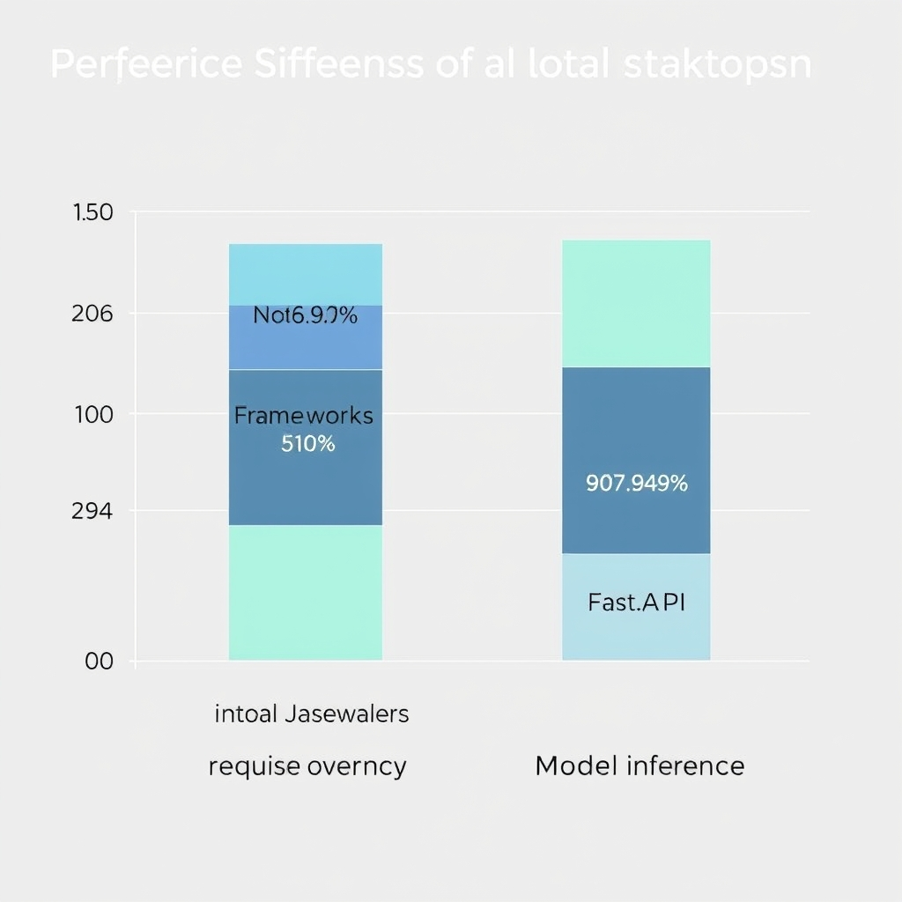
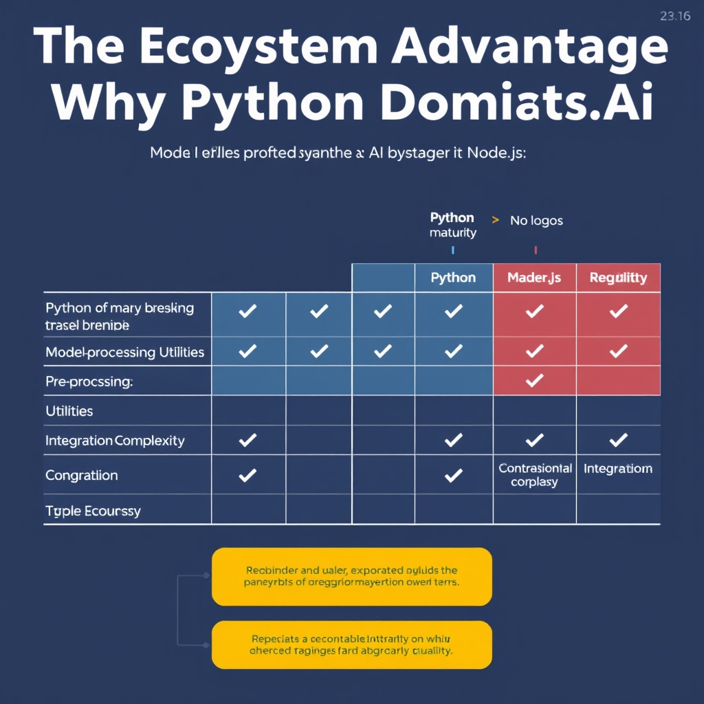

# FastAPI vs. Node.js: Choosing the Right Backend for AI Applications

## The AI Backend Dilemma

Modern AI applications rely on a backend that does more than expose a simple REST endpoint. It must orchestrate data preprocessing, invoke heavyweight model inference, manage authentication and rate‑limiting, and scale horizontally to handle bursty traffic. In practice, the backend becomes the glue that connects front‑end clients, data stores, and the machine‑learning stack, while also guaranteeing low‑latency responses for end users.

Choosing between FastAPI and Node.js is therefore a pivotal architectural decision. FastAPI runs on Python, the lingua franca of the AI community, giving direct access to libraries such as PyTorch, TensorFlow, Hugging Face Transformers, and LangChain without language bridges or inter‑process marshalling. Node.js, by contrast, excels at raw I/O throughput thanks to its non‑blocking event loop, making it attractive for high‑concurrency gateways that must route thousands of requests per second.

This trade‑off sets the stage for the deeper comparison that follows. On one side, we will examine the raw performance advantage of Node.js’s event‑driven model and its impact on request‑level latency. On the other, we will explore how FastAPI’s seamless integration with the Python ML ecosystem can eliminate the overhead of cross‑language calls, often dwarfing the framework’s own latency. Understanding where the bottleneck lies—network I/O versus model inference—will guide readers toward the most efficient stack for their AI‑native workloads.

## Performance Benchmarks and Architectural Differences

### Concurrency Model Comparison

- **Node.js** runs on a single JavaScript execution thread backed by the **libuv** thread pool for I/O operations. All network I/O, file reads, and DNS lookups are off‑loaded to this pool, while the event loop schedules callbacks in a non‑blocking fashion. This design yields extremely low per‑connection overhead and makes Node.js excel at handling many simultaneous sockets [4].
- **FastAPI** builds on **asyncio**. Each request is processed by an async coroutine, and the framework typically spawns multiple **worker processes** (e.g., via Uvicorn or Gunicorn) to leverage all CPU cores. Within a worker, asyncio schedules coroutines on a single thread, but the multi‑process model provides natural horizontal scaling [4].


*Framework overhead accounts for only 5-10% of total request latency, making the choice of web framework secondary to model inference performance.*

These architectural differences explain why raw I/O benchmarks often favor Node.js. A vendor analysis reports that Node.js offers **40‑60 %** better concurrent connection handling compared to FastAPI, a direct result of its event‑loop efficiency and lightweight thread‑pool model [1].

______________________________________________________________________

### Throughput Advantage in Practice

When measuring pure request‑per‑second (RPS) on a simple echo endpoint, Node.js consistently outpaces FastAPI by the cited **40‑60 %** margin. This advantage is most visible in workloads dominated by network I/O—e.g., serving static assets, proxying HTTP calls, or streaming data.

However, AI back‑ends rarely operate in this regime. The majority of latency stems from **model inference**, not from the web framework itself. An independent benchmark found that the *framework choice contributes only 5‑10 %* to total request latency, while the underlying model API call accounts for the remaining ~90 % [3]. In other words, even if Node.js can process more connections per second, the overall response time for an AI request is dominated by the time the model spends computing predictions.

______________________________________________________________________

### Implications for AI‑Centric Services

1. **Raw throughput matters** when the service is I/O‑bound (e.g., a high‑volume chat gateway that merely forwards messages). In such cases, Node.js’s event‑loop can reduce thread‑context switches and memory overhead.
1. **Framework overhead is negligible** for inference‑heavy endpoints. Whether the request passes through FastAPI or Node.js, the latency budget is set by the model’s compute time, GPU/CPU utilization, and any preprocessing/post‑processing steps.
1. **Scalability strategy** should align with the bottleneck. If the AI model is the limiting factor, investing in faster GPUs, model quantization, or batching yields far greater gains than swapping the web framework.

By understanding these trade‑offs, architects can decide where the **40‑60 % throughput edge** of Node.js translates into real‑world benefits—and when the **5‑10 % framework overhead** is simply a non‑issue because the AI workload dominates the latency profile.

______________________________________________________________________

**References**

[1] https://www.secondtalent.com/resources/fastapi-vs-node-js-usage-speed-and-popularity
[3] https://www.marsdevs.com/compare/fastapi-vs-nodejs-for-ai-backends
[4] https://dev.to/dipcb05/nodejs-vs-fastapi-event-loop-a-deep-dive-into-async-concurrency-35b1

## The Ecosystem Advantage: Why Python Dominates AI

### Maturity of the Python AI Stack

Python’s AI/ML ecosystem has been built around research and production for over a decade. Libraries such as **PyTorch**, **TensorFlow**, **Hugging Face Transformers**, and higher‑level orchestration tools like **LangChain**, **LangGraph**, **CrewAI**, and **Pydantic‑AI** are all actively maintained, have extensive documentation, and benefit from a massive community of contributors. According to Groovy Web, these tools are *6‑12 months ahead* of comparable Node.js offerings, making them the default choice for cutting‑edge agents, retrieval‑augmented generation (RAG) pipelines, evaluation frameworks, and model serving [(Groovy Web, 2026)](https://www.groovyweb.co/blog/nodejs-vs-python-backend-comparison-2026).

### JavaScript/TypeScript AI Tooling – Where It Stands

The JavaScript world does have AI libraries—**TensorFlow.js**, **ONNX Runtime Web**, **Hugging Face.js**, and the nascent **LangChainJS**—but they lag in several dimensions:

- **Model coverage** – Only a subset of the models available in PyTorch/Hugging Face are ported to JS, often with reduced precision.
- **Ecosystem depth** – Utilities for data preprocessing, tokenization, and fine‑tuning are far fewer, forcing developers to re‑implement common patterns.
- **Community support** – Fewer tutorials, slower issue resolution, and limited third‑party extensions.
- **Performance trade‑offs** – Running large transformer models in the browser or via Node often requires model conversion to ONNX or WebAssembly, adding latency and complexity.

### Direct Library Integration Cuts Friction

When the backend is written in Python, the same language that the majority of AI research libraries use, developers can:

1. **Import models directly** – `from transformers import pipeline` loads a model with a single line, preserving the original architecture and weights.
1. **Reuse preprocessing pipelines** – Tokenizers, data loaders, and augmentation utilities are native Python objects, eliminating cross‑language serialization.
1. **Leverage type‑safe schemas** – Tools like **Pydantic‑AI** validate request/response payloads against model signatures, reducing runtime errors.
1. **Iterate quickly** – Jupyter notebooks and Python REPLs enable rapid prototyping; the same code can be moved unchanged into a FastAPI endpoint.

In contrast, a Node.js service that needs the same model must either:

- Call a Python subprocess (introducing IPC overhead and deployment complexity),
- Use a converted ONNX model with limited feature parity, or
- Rely on a thin wrapper library that often lacks the latest model releases.

### Side‑by‑Side Comparison

| Feature                  | Python (FastAPI)                                          | JavaScript (Node.js)                             |
| ------------------------ | --------------------------------------------------------- | ------------------------------------------------ |
| Model library breadth    | >10,000 transformers, vision, audio models (Hugging Face) | ~1,000 models, many converted to ONNX            |
| Pre‑processing utilities | Full tokenizers, audio/video pipelines, `torchvision`     | Basic tokenizers, limited audio/video support    |
| Ecosystem updates        | Weekly releases, community‑driven extensions              | Quarterly releases, slower adoption              |
| Integration complexity   | Direct `import` statements, no language bridge            | Requires child process, RPC, or model conversion |
| Production tooling       | FastAPI + Uvicorn, Pydantic validation, async workers     | Express/Koa, custom validation layers            |

### Bottom Line

Because AI workloads are dominated by model inference latency rather than HTTP framework overhead, the ability to **plug directly into the Python AI stack** outweighs raw I/O speed advantages of Node.js. Developers can ship state‑of‑the‑art models, iterate faster, and avoid the brittle glue code that arises when crossing language boundaries. [(Groovy Web, 2026)](https://www.groovyweb.co/blog/nodejs-vs-python-backend-comparison-2026)


*Python's AI ecosystem offers deeper library support and easier integration, reducing development friction for AI-native applications.*

## The Hybrid Architecture Pattern


*The hybrid architecture pattern: Node.js handles high-concurrency I/O, while FastAPI manages specialized AI model inference.*

### Hybrid Architecture Overview

In a hybrid deployment the system is split into two logical layers:

1. **API Gateway (Node.js)** – a lightweight, event‑driven service that handles thousands of concurrent HTTP connections, performs request validation, authentication, rate‑limiting, and routes traffic.
1. **Intelligence Service (FastAPI)** – a Python process that loads one or more machine‑learning models and executes inference. Because the heavy lifting is done in Python, the service can import the full PyTorch, TensorFlow, or Hugging Face stack without language‑binding workarounds.

The two layers communicate over a fast, binary‑compatible protocol such as HTTP/1.1 with JSON payloads, or gRPC for lower latency. The diagram below shows a typical request flow:

```
+-------------------+          HTTP/JSON           +-------------------+
|   Client (Web /   | -------------------------> |   Node.js Gateway |
|   Mobile App)    | <------------------------- |   (Express/Fastify) |
+-------------------+          HTTP/JSON           +-------------------+
                                          |
                                          |   Forward request
                                          v
                                 +-------------------+
                                 |   FastAPI Service |
                                 |   (uvicorn +      |
                                 |    gunicorn workers) |
                                 +-------------------+
                                          |
                                          |   Model inference
                                          v
                                 +-------------------+
                                 |   Model Artifacts |
                                 +-------------------+
```

### Why Node.js as the Gateway?

- **Event‑loop concurrency** – a single Node.js process can keep thousands of sockets open with minimal CPU overhead, making it ideal for handling bursty traffic from browsers or mobile devices.
- **Rich ecosystem for edge concerns** – middleware for JWT validation, CORS, logging, and API versioning are mature and battle‑tested.
- **Stateless routing** – the gateway does not retain any model state, allowing horizontal scaling behind a load balancer.

### Why FastAPI for Inference?

- **Native Python bindings** – direct access to the latest releases of PyTorch, TensorFlow, and Hugging Face without the need for language bridges.
- **Async support with `uvicorn`** – while inference is CPU/GPU‑bound, FastAPI can still serve multiple requests concurrently by spawning multiple worker processes (e.g., via `gunicorn -k uvicorn.workers.UvicornWorker`).
- **Automatic OpenAPI docs** – developers can explore the inference API without extra tooling.

### Minimal Working Example

Below is a concise illustration of the two services communicating via HTTP. The example assumes Docker containers, but the same pattern works on bare‑metal or Kubernetes.

#### 1️⃣ FastAPI Inference Service (`app/main.py`)

```python
# app/main.py
from fastapi import FastAPI, HTTPException
from pydantic import BaseModel
import torch
from transformers import AutoModelForSequenceClassification, AutoTokenizer

app = FastAPI()

# Load model once at startup (GPU example)
model_name = "distilbert-base-uncased-finetuned-sst-2-english"
tokenizer = AutoTokenizer.from_pretrained(model_name)
model = AutoModelForSequenceClassification.from_pretrained(model_name).to("cuda")

class PredictRequest(BaseModel):
    text: str

class PredictResponse(BaseModel):
    label: str
    score: float

@app.post("/predict", response_model=PredictResponse)
async def predict(req: PredictRequest):
    inputs = tokenizer(req.text, return_tensors="pt").to("cuda")
    with torch.no_grad():
        logits = model(**inputs).logits
    probs = torch.softmax(logits, dim=-1).cpu().numpy()[0]
    label_idx = int(probs.argmax())
    label = model.config.id2label[label_idx]
    return PredictResponse(label=label, score=float(probs[label_idx]))
```

Run the service with two workers to keep the GPU busy while the event loop remains responsive:

```bash
# In the FastAPI container
gunicorn -k uvicorn.workers.UvicornWorker -w 2 -b 0.0.0.0:8000 app.main:app
```

#### 2️⃣ Node.js Gateway (`gateway/index.js`)

```javascript
// gateway/index.js
const express = require('express');
const axios = require('axios');
const rateLimit = require('express-rate-limit');

const app = express();
app.use(express.json());

// Simple rate limiting middleware
app.use(rateLimit({ windowMs: 60_000, max: 100 }));

// Proxy endpoint – forwards payload to FastAPI
app.post('/api/infer', async (req, res) => {
  try {
    const response = await axios.post('http://fastapi:8000/predict', {
      text: req.body.text,
    }, { timeout: 5000 });
    res.json(response.data);
  } catch (err) {
    console.error('Inference error:', err.message);
    res.status(502).json({ error: 'Inference service unavailable' });
  }
});

const PORT = process.env.PORT || 3000;
app.listen(PORT, () => console.log(`Gateway listening on ${PORT}`));
```

The gateway validates the incoming JSON, applies rate limits, and forwards the request to the FastAPI container (`http://fastapi:8000`). Errors from the inference layer are translated into a 502 response so the client receives a consistent API contract.

#### 3️⃣ Docker Compose Skeleton

```yaml
version: '3.8'
services:
  gateway:
    build: ./gateway
    ports:
      - "3000:3000"
    depends_on:
      - fastapi
  fastapi:
    build: ./app
    ports:
      - "8000:8000"
    runtime: nvidia   # if GPU is available
    environment:
      - CUDA_VISIBLE_DEVICES=0
```

### Operational Considerations

- **Scaling** – Deploy multiple gateway replicas behind an L7 load balancer; FastAPI can be scaled horizontally by adding more worker processes or containers.
- **Latency budgeting** – The gateway adds ~1 ms of overhead per hop; most of the end‑to‑end latency will be model inference, which typically ranges from 30 ms (small transformer) to >200 ms (large language model).
- **Observability** – Export Prometheus metrics from both services (`express-prometheus-middleware` for Node.js, `fastapi_prometheus` for FastAPI) and trace requests with OpenTelemetry to pinpoint bottlenecks.
- **Security** – Keep the internal FastAPI endpoint private to the Docker network; expose only the Node.js gateway to the public internet.

By delegating high‑throughput request handling to Node.js and reserving Python’s rich AI libraries for the inference tier, the hybrid pattern delivers the best of both worlds: raw I/O scalability and seamless access to state‑of‑the‑art models.

## Decision Framework for Your Next AI Project

### When to Choose FastAPI Exclusively

- **Python‑centric ML stack** – Your project relies heavily on PyTorch, TensorFlow, Hugging Face, or LangChain, and you need direct access to the latest model APIs without language bridges.
- **Inference‑bound latency** – Model inference time dwarfs request‑handling overhead, so the extra milliseconds from a Python framework are negligible.
- **Team expertise** – Your developers are primarily Python‑savvy and prefer a single language for both data‑science and service code.
- **Simplified deployment** – You want a straightforward Docker image that bundles the model, its dependencies, and the API.

### When to Choose Node.js Exclusively

- **High‑throughput I/O** – The service must handle thousands of concurrent connections (e.g., websockets, streaming data) where raw event‑loop performance matters.
- **Lightweight request processing** – Endpoints perform minimal computation (validation, routing, caching) and delegate heavy work elsewhere.
- **JavaScript/TypeScript ecosystem** – Your front‑end and back‑end share code, types, or libraries, reducing context switching.
- **Existing Node infrastructure** – You already operate CI/CD pipelines, monitoring, and scaling policies tuned for Node.js.

### Criteria for Adopting a Hybrid Architecture

1. **Mixed workload** – You need a high‑concurrency API gateway (Node.js) *and* a dedicated inference service (FastAPI) that can run GPU‑accelerated models.
1. **Team composition** – Both Python and JavaScript engineers are available, allowing each to own the layer that matches their expertise.
1. **Scalability separation** – You want to scale the gateway horizontally without affecting the GPU‑bound inference pods, which may require different autoscaling policies.
1. **Latency tolerance** – Inter‑service communication (e.g., HTTP/REST or gRPC) adds a predictable overhead that is acceptable compared to the overall inference latency.

### Final Recommendation

- **Start simple**: For proof‑of‑concepts or small teams, pick the language that aligns with your core competency—FastAPI for model‑heavy prototypes, Node.js for I/O‑heavy services.
- **Scale up with hybrid**: As traffic grows and the workload diversifies, introduce a Node.js gateway in front of a FastAPI inference microservice. This pattern preserves the performance edge of Node.js while leveraging Python’s AI ecosystem.
- **Re‑evaluate regularly**: Monitor request latency, GPU utilization, and team bandwidth. If one layer becomes a bottleneck, adjust scaling or consider consolidating to the more suitable framework.