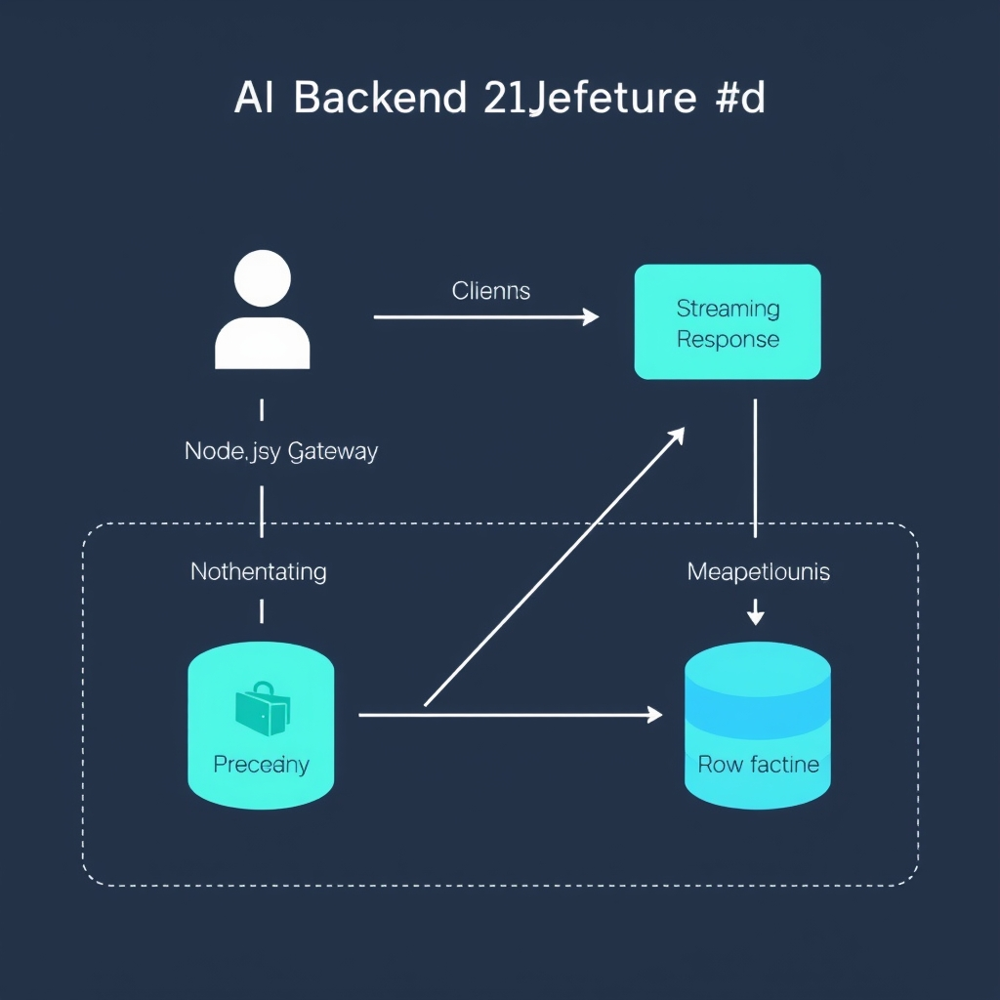
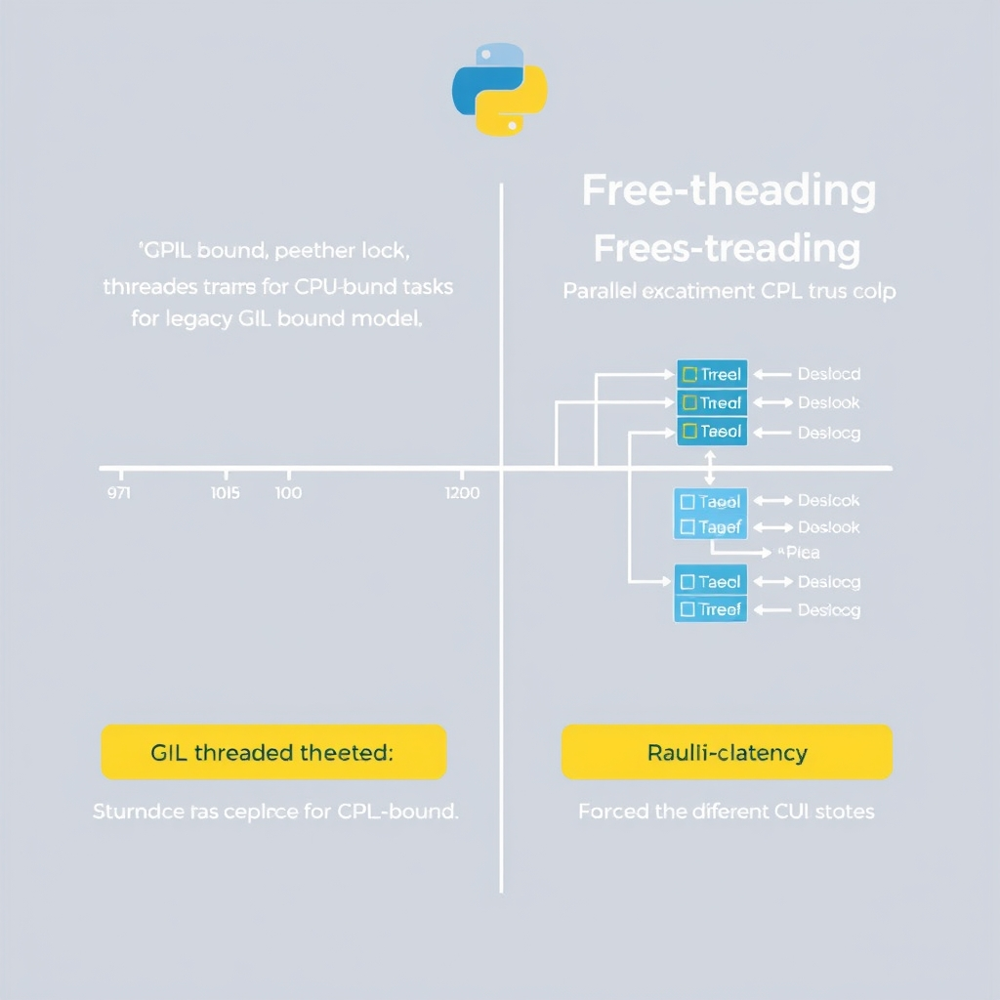
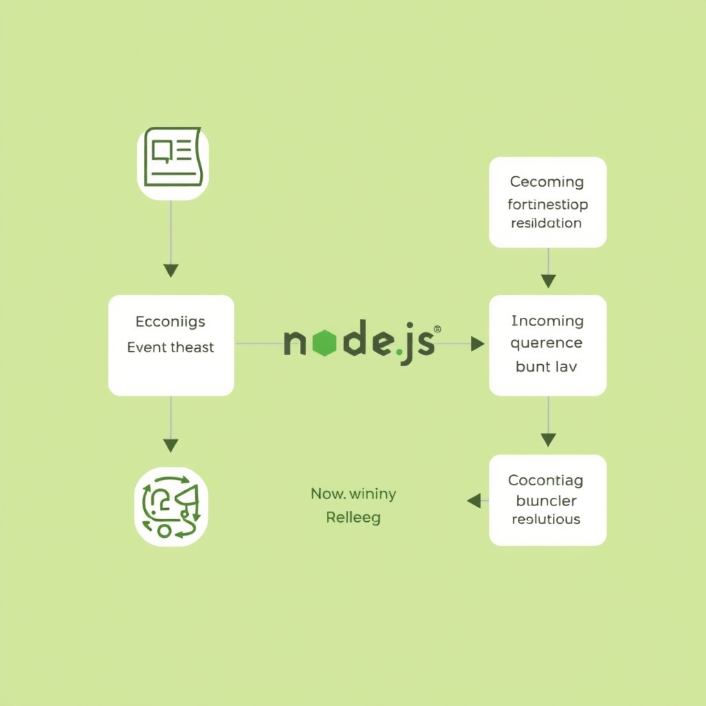

# FastAPI vs. Node.js: Choosing the Right Backend for AI in 2026

## The AI Backend Landscape in 2026

The AI backend landscape in 2026 no longer forces teams to pick *either* Python or Node.js; instead, most production systems adopt a **split‑stack** approach that lets each runtime play to its strengths.

### From "either/or" to "both"

Historically, developers chose a single language stack for the entire service layer. In AI‑first products this meant either a Python‑centric stack (FastAPI, Flask) or a JavaScript‑centric stack (Express, Nest). Today, the performance and developer‑experience gaps have narrowed, and the industry has converged on a hybrid model where a **Node.js gateway** handles high‑concurrency traffic while a **FastAPI inference service** runs the heavy AI workloads. This shift is driven by the need to serve thousands of concurrent UI streams without sacrificing the rich ecosystem of Python‑first AI libraries.

### Why Python remains the default for AI R&D

Python continues to dominate AI research because the most widely‑adopted frameworks—PyTorch, LangChain, LlamaIndex, Hugging Face, CrewAI—are built and maintained in Python. The research community writes code, publishes papers, and releases models in Python, creating a virtuous cycle that makes the language the de‑facto standard for model training and inference[^1]. FastAPI, running on Python 3.13, provides a lightweight, type‑safe way to expose these models as HTTP endpoints, making it the go‑to choice for AI‑heavy backends.

### Node.js’s role in web‑scale AI services

Node.js excels at **non‑blocking I/O** and can sustain 40‑60 % more concurrent connections than comparable Python servers. Modern AI products often need to stream token‑by‑token responses to browsers, multiplex WebSocket connections, or orchestrate multiple micro‑services. Node.js 22 LTS paired with Fastify or the Vercel AI SDK offers a performant, developer‑friendly gateway that can throttle, authenticate, and route traffic before it reaches the Python inference layer[^2].

### Introducing the split‑stack architecture

In a split‑stack design, the request flow looks like:

```
Client → Node.js Gateway → FastAPI Inference Service → (optional) downstream services
```

The gateway handles authentication, rate limiting, and response streaming, while the FastAPI service focuses solely on model execution. This separation of concerns reduces latency, simplifies scaling, and lets teams leverage the best tools from both ecosystems.

\[^1\]: [FastAPI vs Node.js for AI Backends in 2026 – MarsDevs](https://www.marsdevs.com/compare/fastapi-vs-nodejs-for-ai-backends)
\[^2\]: [Node.js vs Python for AI‑First Backends: The 2026 Decision Guide – DEV Community](https://dev.to/krunal_groovy/nodejs-vs-python-for-ai-first-backends-the-2026-decision-guide-1neg)


*The split-stack architecture: Node.js manages the user-facing gateway, while FastAPI handles specialized AI inference tasks.*

## Python and FastAPI: The Intelligence Layer

Python remains the lingua franca of AI research, and FastAPI has become the de‑facto gateway for exposing that intelligence as a service.


*Python 3.13's free-threading model enables true parallel execution for CPU-bound tasks, significantly reducing inference bottlenecks.*

### Python‑first AI libraries drive the stack

- **PyTorch**, **LangChain**, and **LlamaIndex** are all authored and maintained primarily in Python. Their APIs, extension mechanisms, and community tutorials assume a Python runtime, which means developers can stay within a single language ecosystem from model training to inference [https://dev.to/krunal_groovy/nodejs-vs-python-for-ai-first-backends-the-2026-decision-guide-1neg](https://dev.to/krunal_groovy/nodejs-vs-python-for-ai-first-backends-the-2026-decision-guide-1neg).
- Because these libraries expose native C/C++ kernels behind Python bindings, any attempt to wrap them in a non‑Python service incurs serialization overhead and version‑compatibility headaches. Running them directly under FastAPI eliminates the need for language bridges and keeps latency low.

### FastAPI streamlines inference endpoint creation

- **Declarative routing** – A single `@app.post("/predict")` decorator defines the HTTP contract, while Pydantic models automatically validate request payloads and serialize responses.
- **Async support** – Even though most model inference is CPU‑ or GPU‑bound, FastAPI’s async request handling frees the worker thread while the model runs, allowing the service to accept new connections without blocking the event loop.
- **OpenAPI generation** – Documentation is generated on the fly, giving data scientists and front‑end teams a self‑describing contract without extra tooling.
- **Production‑ready tooling** – Integration with Uvicorn, Gunicorn, and Docker is straightforward, and the ecosystem provides ready‑made health‑check and metrics middleware.

> *FastAPI on Python 3.13 is the recommended stack for Retrieval‑Augmented Generation (RAG) and multi‑agent backends in 2026* [https://www.marsdevs.com/compare/fastapi-vs-nodejs-for-ai-backends](https://www.marsdevs.com/compare/fastapi-vs-nodejs-for-ai-backends).

### Python 3.13 free‑threading lifts CPU‑bound bottlenecks

Python 3.13 introduces **free‑threading**, a cooperative‑multithreading model that removes the Global Interpreter Lock (GIL) for pure‑Python code. For CPU‑intensive inference pipelines that involve preprocessing, tokenization, or custom post‑processing steps written in Python, this change yields:

- **Higher parallelism** – Multiple inference requests can now execute CPU‑bound Python code concurrently on multi‑core machines.
- **Reduced latency spikes** – The interpreter no longer serializes execution, so a heavy request does not stall lighter ones.
- **Simplified scaling** – Developers can increase throughput by adding more worker processes without resorting to complex multiprocessing patterns.

The benefit is most pronounced when the model itself runs on a GPU (which already releases the GIL) but the surrounding Python logic remains on the CPU. Free‑threading ensures the entire request path stays non‑blocking.

### Isolate the intelligence layer from the user‑facing API

Keeping the FastAPI inference service separate from the public API gateway offers several architectural advantages:

- **Security** – The inference service can run in a restricted VPC or sandbox, exposing only internal endpoints. The external gateway handles authentication, rate limiting, and request sanitization.
- **Scalability** – AI workloads often require GPU nodes that scale independently of the stateless, high‑throughput Node.js gateway. Isolation lets each layer be autoscaled based on its own metrics.
- **Fault tolerance** – A crash in the inference layer (e.g., out‑of‑memory GPU error) does not bring down the entire application; the gateway can return graceful degradation messages.
- **Versioning** – Model updates and FastAPI version upgrades can be rolled out without impacting the stable user‑facing endpoints, enabling continuous delivery of AI improvements.

By treating FastAPI as a dedicated *intelligence microservice*, teams can leverage Python’s rich AI ecosystem, benefit from the performance gains of Python 3.13, and maintain a clean separation of concerns that prepares the system for the hybrid split‑stack architecture described later.

## Node.js: The High-Concurrency Gateway

Node.js excels as the high‑concurrency gateway for AI‑driven products. Its event‑driven, non‑blocking I/O model lets a single process handle thousands of simultaneous connections with minimal overhead, a characteristic that directly translates into smoother user experiences when streaming AI‑generated content.


*The Node.js event loop offloads I/O-bound tasks, allowing the gateway to maintain thousands of concurrent connections without blocking.*

### 40‑60 % throughput advantage

Benchmarks from *Second Talent* show that Node.js can sustain **40‑60 % more concurrent connections** than a comparable FastAPI service under identical hardware conditions [3](https://www.secondtalent.com/resources/fastapi-vs-node-js-usage-speed-and-popularity). The difference stems from:

- **Single‑threaded event loop**: I/O operations are delegated to the kernel or libuv thread pool, freeing the main thread to accept new requests.
- **Optimized V8 engine**: Modern JavaScript engines perform aggressive JIT compilation, reducing per‑request latency for lightweight routing logic.
- **Native HTTP/2 support**: Node.js 22 LTS includes built‑in HTTP/2, enabling multiplexed streams over a single TCP connection, which is ideal for AI response chunks.

In practice, a Node.js gateway can maintain 10 k+ open WebSocket connections while a FastAPI endpoint typically begins to saturate around 6‑7 k connections on the same instance.

### Streaming AI responses to the UI

AI models often produce output incrementally (e.g., token‑by‑token generation). Delivering these tokens to the front‑end as they become available reduces perceived latency and keeps users engaged. Node.js simplifies this pattern:

```js
import fastify from 'fastify';
import { createReadStream } from 'node:stream';

const app = fastify();

app.get('/chat', async (req, reply) => {
  // Proxy the streaming response from the FastAPI inference service
  const upstream = await fetch('http://fastapi:8000/generate', {
    method: 'POST',
    body: JSON.stringify({ prompt: req.query.q })
  });
  reply.type('text/event-stream');
  // Pipe token stream directly to the client
  upstream.body.pipe(reply.raw);
});

app.listen({ port: 3000 });
```

The snippet demonstrates how a Fastify route can act as a thin proxy, forwarding the token stream from a FastAPI inference service to the browser without buffering the entire payload. Because the proxy never blocks on CPU‑intensive work, the gateway remains responsive even under heavy load.

### Vercel AI SDK and Fastify: purpose‑built tools

Two libraries have emerged as de‑facto standards for AI gateways:

- **Vercel AI SDK (v6.0)** – Provides helpers for constructing streaming responses, handling token limits, and integrating with Vercel’s edge network. Its `streamText` utility abstracts the boilerplate of SSE or WebSocket delivery, letting developers focus on orchestration logic.
- **Fastify 5** – A lightweight, schema‑driven framework that minimizes request‑handling overhead. Its plugin ecosystem includes `fastify-websocket` and `fastify-http‑proxy`, both of which are optimized for high‑throughput scenarios.

Both tools are mentioned in the MarsDevs comparison as the recommended stack for “streaming UI on top of an AI service” [1](https://www.marsdevs.com/compare/fastapi-vs-nodejs-for-ai-backends).

### Why non‑blocking I/O matters for AI products

AI services are inherently **I/O‑bound** at the gateway layer:

1. **Model inference latency** – Even with GPU acceleration, a request may take hundreds of milliseconds. The gateway must keep the connection open while waiting for the model.
1. **External data fetches** – Retrieval‑augmented generation (RAG) often queries vector stores, databases, or third‑party APIs before invoking the model.
1. **Client‑side streaming** – Front‑ends expect a continuous flow of tokens to render progressive output.

If the gateway were to block on any of these steps (as a synchronous Python server might), the entire event loop would stall, causing a cascade of timeouts and degraded QoS. Node.js’s non‑blocking paradigm ensures that while one request awaits model output, the same process can accept and route dozens of other requests, preserving throughput and keeping latency predictable [1](https://www.marsdevs.com/compare/fastapi-vs-nodejs-for-ai-backends).

### Bottom line

By delegating CPU‑heavy inference to FastAPI while retaining request orchestration, authentication, and streaming at the Node.js layer, architects gain a **split‑stack** that leverages the best of both runtimes. The 40‑60 % concurrency edge, coupled with purpose‑built libraries like the Vercel AI SDK and Fastify, makes Node.js the natural choice for the high‑traffic gateway that powers modern AI‑enhanced user experiences.

## Implementing the Hybrid Split-Stack

### Architectural Blueprint

The hybrid **split‑stack** consists of three logical layers:

1. **Client** – browser, mobile app, or another service.
1. **Node.js Gateway** – handles HTTP routing, authentication, rate‑limiting, and streaming.
1. **FastAPI Inference Service** – a Python microservice that loads the model and serves inference requests.

______________________________________________________________________

#### Flow Diagram


The diagram mirrors the production pattern described by Coderaxo, which recommends using Node.js as the primary API gateway and deploying FastAPI as an isolated inference microservice [4].

______________________________________________________________________

#### Authentication & Rate Limiting at the Gateway

- **JWT verification** – Decode and validate the token before any request reaches FastAPI. This keeps the Python service free of auth boilerplate.
- **Rate‑limit per API key** – Use a Redis‑backed limiter (e.g., `express-rate-limit` with `rate-limit-redis`). The limiter runs in the Node layer, ensuring abusive traffic never consumes Python CPU cycles.
- **Scope enforcement** – Attach the user’s scopes to the request context and forward only the necessary metadata to FastAPI via custom headers (e.g., `x‑user‑id`, `x‑scopes`).

By centralising these concerns, the inference service can focus solely on model loading and prediction, which improves latency and simplifies scaling.

______________________________________________________________________

#### Service‑to‑Service Communication

Two common protocols work well:

| Protocol                     | Pros                                                                                    | Cons                                                                   |
| ---------------------------- | --------------------------------------------------------------------------------------- | ---------------------------------------------------------------------- |
| **REST (JSON over HTTP)**    | Easy to debug, works with existing HTTP tooling, no extra runtime dependencies.         | Higher overhead per call, less efficient for large payloads.           |
| **gRPC (HTTP/2 + protobuf)** | Binary payload, multiplexed streams, built‑in code generation for both Python and Node. | Requires protobuf schema maintenance, slightly steeper learning curve. |

For most AI gateways, **REST** is sufficient when the payloads are modest (e.g., text prompts). When streaming large token streams or binary tensors, **gRPC** provides lower latency and better back‑pressure handling.

______________________________________________________________________

#### Proxy Request Example (Node.js → FastAPI)

Below is a minimal Express‑based gateway that:

- validates a JWT,
- enforces a Redis‑backed rate limit,
- forwards the request to a FastAPI endpoint using **Axios** (REST),
- streams the response back to the client.

```javascript
// gateway.js
import express from 'express';
import jwt from 'jsonwebtoken';
import rateLimit from 'express-rate-limit';
import RedisStore from 'rate-limit-redis';
import Redis from 'ioredis';
import axios from 'axios';

const app = express();
app.use(express.json());

// --- Rate limiting -------------------------------------------------------
const redisClient = new Redis({ host: 'localhost', port: 6379 });
const limiter = rateLimit({
  store: new RedisStore({ sendCommand: (...args) => redisClient.call(...args) }),
  windowMs: 60_000,
  max: 100, // 100 requests per minute per API key
  keyGenerator: (req) => req.headers['x-api-key'] || req.ip,
});
app.use(limiter);

// --- Auth middleware ------------------------------------------------------
const AUTH_SECRET = process.env.AUTH_SECRET || 'super-secret';
function verifyToken(req, res, next) {
  const authHeader = req.headers.authorization;
  if (!authHeader) return res.status(401).json({ error: 'Missing token' });
  const token = authHeader.split(' ')[1];
  try {
    const payload = jwt.verify(token, AUTH_SECRET);
    // forward minimal user info to FastAPI
    req.user = { id: payload.sub, scopes: payload.scopes };
    next();
  } catch (e) {
    return res.status(403).json({ error: 'Invalid token' });
  }
}

// --- Proxy endpoint -------------------------------------------------------
app.post('/v1/infer', verifyToken, async (req, res) => {
  try {
    const fastapiUrl = 'http://localhost:8000/infer';
    const response = await axios.post(fastapiUrl, req.body, {
      responseType: 'stream',
      headers: {
        // Pass user context to FastAPI via custom headers
        'x-user-id': req.user.id,
        'x-user-scopes': req.user.scopes.join(','),
      },
    });
    // Pipe the streaming inference back to the client
    res.setHeader('Content-Type', response.headers['content-type']);
    response.data.pipe(res);
  } catch (err) {
    console.error('Proxy error:', err.message);
    res.status(502).json({ error: 'Upstream inference failure' });
  }
});

const PORT = process.env.PORT || 3000;
app.listen(PORT, () => console.log(`Node gateway listening on ${PORT}`));
```

**Key points** in the snippet:

- The gateway performs **authentication** and **rate limiting** before any network hop to FastAPI.
- User metadata is transmitted via lightweight headers (`x-user-id`, `x-user-scopes`).
- `axios` streams the FastAPI response, preserving the low‑latency token‑by‑token delivery that modern LLM UIs expect.

______________________________________________________________________

#### Putting It All Together

1. Deploy the **Node.js gateway** behind a CDN or edge platform (Vercel, Cloudflare Workers) to capture traffic at the edge.
1. Run the **FastAPI inference service** on GPU‑enabled instances, isolated from public traffic.
1. Choose **REST** for simplicity or **gRPC** for high‑throughput streaming; the gateway code can be swapped with a gRPC client with minimal changes.
1. Monitor both layers independently – Node.js for request‑level metrics (latency, rate‑limit hits) and FastAPI for model‑specific metrics (GPU utilization, inference time).

Following this blueprint lets teams exploit Python’s rich AI ecosystem while leveraging Node.js’s event‑driven concurrency, delivering a responsive, scalable AI product.

______________________________________________________________________

**References**

[4] Coderaxo, *FastAPI vs Node.js for High‑Performance AI Backends*, 2024. https://www.coderaxo.dev/blog/fastapi-vs-nodejs-for-ai-backends

## Conclusion: Choosing Your Path

The right backend strategy hinges on the concrete demands of your AI product, not on a blanket preference for FastAPI or Node.js.

- **When a single‑stack suffices** –
  - The workload is primarily batch inference or model training where Python’s ecosystem (PyTorch, LangChain, LlamaIndex) dominates.
  - Traffic is modest and can be handled comfortably by FastAPI’s built‑in concurrency.
  - You prefer a unified codebase and simpler DevOps pipelines.
- **When a hybrid split‑stack shines** –
  - Your application streams AI‑generated content to thousands of concurrent users (e.g., chat assistants, real‑time recommendation engines).
  - Low‑latency request routing, rate‑limiting, and WebSocket support are critical; Node.js excels at non‑blocking I/O.
  - You need to isolate the heavy inference service for independent scaling, security, or language‑specific tooling.

Looking ahead to 2026, the AI backend landscape will continue to polarize around two complementary forces: Python’s ever‑growing model libraries and Node.js’s event‑driven scalability. Teams that adopt a split‑stack architecture can swap out or upgrade each layer independently, future‑proofing their services against rapid advances in model efficiency and web‑scale delivery. Ultimately, the decision is a trade‑off between simplicity and performance; choose the path that aligns with your product’s latency targets, development resources, and long‑term scalability roadmap.