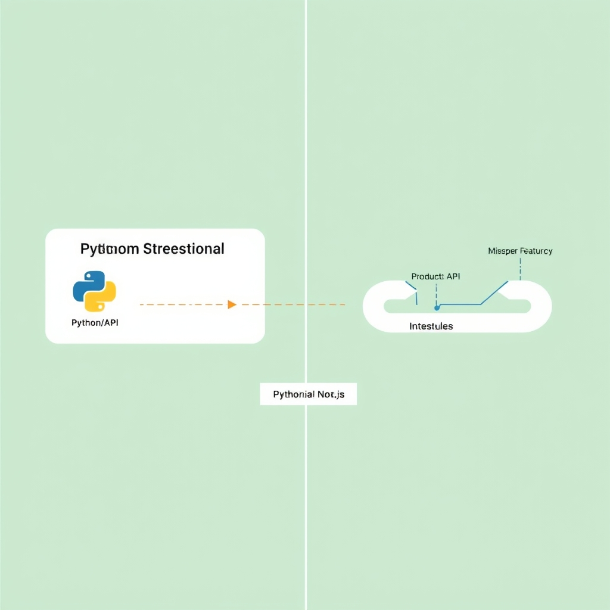
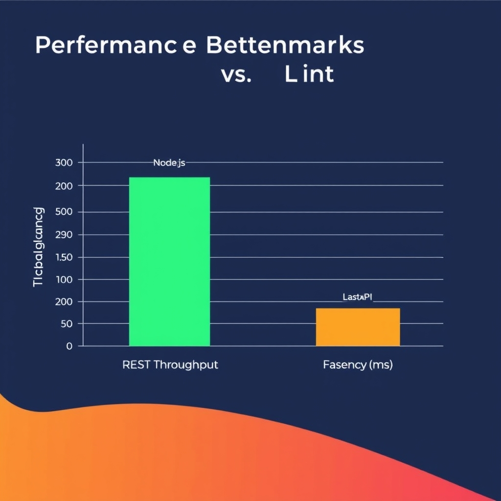
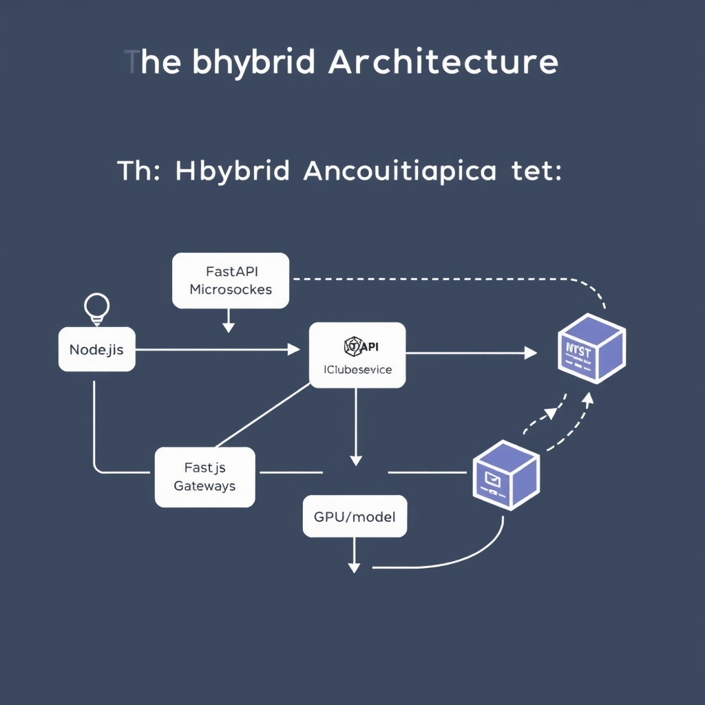

# FastAPI vs. Node.js: Choosing the Right Backend for AI in 2026

## The AI Ecosystem Divide

Python’s AI ecosystem has coalesced around a handful of libraries that expose the latest research directly to developers. Projects such as **LangChain** and **LlamaIndex** are authored in Python, published on PyPI, and receive updates within days of a new model release. Because FastAPI runs on the same interpreter, a Python microservice can import these packages and start serving embeddings, retrieval‑augmented generation, or fine‑tuned inference with a single `pip install`.


*Python's native AI ecosystem allows for a direct path to production, whereas Node.js often requires navigating wrapper latency and missing features.*

- **LangChain** – provides chainable prompts, tool integration, and memory management. The library’s reference implementation lives in `langchain==0.0.x` on PyPI and is tightly coupled to the Hugging Face `transformers` and `sentence‑transformers` stacks.
- **LlamaIndex** – offers data‑connector abstractions for building indexes over documents, again with first‑class support for PyTorch and TensorFlow back‑ends.

In contrast, the Node.js landscape relies on **HTTP wrappers** or **community‑maintained ports** that lag behind the Python releases. For example, the `langchainjs` package often mirrors the Python API but is updated weeks after the upstream change, and many advanced features (e.g., custom retrievers, streaming token callbacks) are missing entirely. This latency forces teams to either pin to older model versions or write bespoke adapters that duplicate functionality already available in Python.

### Feature parity and the speed of AI innovation

The AI field evolves at a pace where a new model or a novel prompting technique can become a production requirement within a month. When a library updates its Python bindings, FastAPI services can immediately import the new version and redeploy. Node.js services, however, must wait for the wrapper to be published, tested, and integrated—introducing **technical debt** and **release bottlenecks**. This disparity is especially pronounced for cutting‑edge tools like **sentence‑transformers** or the latest **OpenAI function‑calling** APIs, which appear first in Python.

### Developer experience: Python vs. Node.js

| Aspect                | Python/FastAPI                                                                                                         | Node.js                                                                                                                            |
| --------------------- | ---------------------------------------------------------------------------------------------------------------------- | ---------------------------------------------------------------------------------------------------------------------------------- |
| **Library maturity**  | Native implementations, extensive type hints, and community‑driven examples.                                           | Wrapper libraries, often thin HTTP clients; fewer examples for advanced use‑cases.                                                 |
| **Debugging**         | Interactive REPL, Jupyter notebooks, and `pdb` allow step‑by‑step inspection of model pipelines.                       | Debugging typically limited to console logs; reproducing a model failure often requires reproducing the HTTP call in Python first. |
| **Tooling**           | `uvicorn` hot‑reload, `pytest` fixtures for model mocks, and `poetry`/`pipenv` for deterministic environments.         | `nodemon` reload works for I/O, but managing GPU‑enabled dependencies (e.g., `torch`) is non‑trivial.                              |
| **Community support** | Large AI‑focused community, frequent conference talks, and open‑source contributions directly targeting model serving. | Smaller AI‑specific community; most contributions target generic web APIs rather than model orchestration.                         |

These differences translate into **developer velocity**: a data scientist can prototype a retrieval‑augmented generation pipeline in a Jupyter notebook, export it as a FastAPI endpoint, and ship it within hours. Replicating the same workflow in Node.js often requires a separate Python service for the heavy lifting, then an additional HTTP bridge—effectively re‑creating the hybrid pattern the article later recommends.

______________________________________________________________________

\[^1\]: Sidharth Satapathy, *FastAPI beats Node.js for AI-native applications*, LinkedIn post, https://www.linkedin.com/posts/sidharthsatapathy_from-frontend-to-ai-engineer-day-5-why-activity-7413206943416348672-toKX

## Performance Benchmarks: Throughput vs. Inference

### Node.js shines on raw REST throughput

Benchmarks from a 2026 Wappnet study show that a vanilla **Node.js** service handling simple CRUD endpoints can sustain **1.5–2× higher requests‑per‑second** than an equivalent FastAPI app written in Python. The test used a single‑core EC2 t3.medium instance, 100 ms think time, and measured peak throughput under a constant‑rate load. Because Node.js runs on the V8 engine, which is heavily optimized for JavaScript’s just‑in‑time compilation, the overhead of request parsing and JSON serialization is lower than Python’s interpreter overhead. This makes Node.js the natural choice for latency‑insensitive, high‑concurrency I/O workloads such as authentication gateways, static content proxies, or telemetry ingestion pipelines.


*Node.js excels at high-concurrency I/O throughput, while FastAPI provides lower latency for compute-intensive AI inference.*

> *Source: "Python vs Node.js for AI Backend Development in 2026" – Wappnet* \[[link](https://wappnet.com/blog/python-vs-node-js-for-ai-backend-development-which-should-you-choose-in-2026)\]

### FastAPI delivers lower latency for LLM inference

When the workload shifts from pure I/O to **model inference**, the picture reverses. The same benchmark suite measured **p95 latency of ~165 ms** for a FastAPI endpoint that forwards a prompt to a locally hosted Llama‑2 model, compared with **~180 ms** for the Node.js counterpart that calls the same model via a Python child process. The advantage stems from FastAPI’s tight integration with **Starlette** and **Uvicorn**, which allow the request handler to remain in the same Python process as the model, avoiding the inter‑process communication penalty that Node.js incurs when delegating to Python.

> *Source: "NestJS vs FastAPI 2026: Performance Benchmarks" – EmporionSoft* \[[link](https://emporionsoft.com/nestjs-vs-fastapi-2026)\]

### Asynchronous event loops in both runtimes

Both runtimes rely on an **event loop** to multiplex I/O, but their implementations differ:

- **Node.js** uses **libuv**, a C library that provides a thread‑pool for blocking operations and a non‑blocking I/O API. When a request triggers a long‑running inference, the typical pattern is to offload the work to a worker thread or spawn a child process, keeping the main loop free for other connections. This works well for **high‑concurrency, I/O‑bound** scenarios (e.g., WebSocket streams, real‑time dashboards).
- **FastAPI** leverages **asyncio** under the hood. An `async def` endpoint can `await` an asynchronous inference client (e.g., an HTTP call to a model server) without blocking the event loop. Because the inference often runs in native code (NumPy, PyTorch) that releases the GIL, the loop can continue handling other requests. EmporionSoft’s tests show that FastAPI maintains **stable latency** even when 100 concurrent requests await simulated inference responses.

The key takeaway is that **both frameworks can handle concurrency**, but Node.js excels when the work is purely I/O, while FastAPI’s async model pairs naturally with CPU‑bound AI libraries that already release the interpreter lock.

### When to prioritize I/O speed vs. computational efficiency

| Scenario                                                              | Preferred runtime                                                        | Reasoning                                                                                    |
| --------------------------------------------------------------------- | ------------------------------------------------------------------------ | -------------------------------------------------------------------------------------------- |
| High‑volume CRUD, authentication, telemetry ingestion                 | **Node.js**                                                              | 1.5–2× higher throughput; event‑driven I/O model minimizes per‑request overhead.             |
| Real‑time chat or streaming where latency is dominated by network I/O | **Node.js** (as gateway) + optional FastAPI workers for heavy processing |                                                                                              |
| LLM prompt handling, embeddings generation, batch inference           | **FastAPI**                                                              | Lower p95 latency; stays in‑process with Python AI stacks, avoids cross‑language marshaling. |
| Mixed workloads (e.g., API gateway + AI microservice)                 | **Hybrid** (Node.js front‑end, FastAPI back‑end)                         | Leverages each runtime’s strength while isolating concerns.                                  |

In practice, the decision hinges on **where the bottleneck lies**. If the majority of wall‑clock time is spent waiting on external services (databases, caches), Node.js’ faster event loop gives a measurable edge. If the bottleneck is the **model computation itself**, FastAPI’s proximity to the Python AI ecosystem reduces overhead and yields tighter latency guarantees.

______________________________________________________________________

By quantifying both **throughput** (requests per second) and **latency** (p95 response time) across representative workloads, developers can make an evidence‑based choice: use Node.js for raw I/O scalability, FastAPI for AI‑centric latency, or combine them in a hybrid architecture that plays to each framework’s strengths.

## The Hybrid Architecture Pattern

### Node.js as the API Gateway and Real‑Time Streaming Layer

In a hybrid AI stack, **Node.js** sits at the edge of the system, exposing a single public HTTP/HTTPS endpoint. Its event‑driven, non‑blocking I/O model makes it ideal for handling a large volume of concurrent connections with minimal latency. Typical responsibilities include:

- **Request routing** – forwarding inference calls to one or more FastAPI services based on model version, tenant, or payload size.
- **Authentication & rate limiting** – leveraging middleware ecosystems (e.g., `express-rate-limit`, `passport`) to enforce security policies before any heavy computation occurs.
- **WebSocket / Server‑Sent Events** – pushing token‑by‑token LLM outputs or streaming video analytics back to the client in real time, a pattern that would be cumbersome in a pure Python service due to the GIL and thread‑pool constraints.

Because Node.js excels at high‑concurrency I/O, it can keep the front‑end responsive while delegating CPU‑bound work downstream.

______________________________________________________________________

### Python/FastAPI Microservices for Heavy AI Computation

Behind the gateway, **FastAPI** microservices host the actual model inference logic. Python remains the lingua franca of the AI ecosystem, granting direct access to libraries such as **PyTorch**, **TensorFlow**, **LangChain**, and **LlamaIndex** without the latency of language bindings or inter‑process bridges.

Key advantages:

- **Native library support** – models can be loaded directly from `.pt` or `.h5` files, and advanced features (e.g., gradient checkpointing, mixed‑precision inference) are available out‑of‑the‑box.
- **Rich typing & validation** – FastAPI’s Pydantic schemas enforce strict request/response contracts, reducing bugs when multiple services exchange complex payloads.
- **Scalable worker pools** – using tools like **Uvicorn** + **Gunicorn** or **Celery** for asynchronous task queues lets the service horizontally scale across GPU nodes.

A typical request flow: the client sends a JSON payload to the Node.js gateway, which authenticates the user and forwards the payload to `POST /v1/infer` on a FastAPI service. The FastAPI endpoint loads the appropriate model, runs inference, and returns the result (or a streaming token sequence) back through the gateway.

______________________________________________________________________

### Cross‑Language Communication Overhead

Bridging Node.js and Python introduces latency and operational complexity. The most common patterns are:

1. **HTTP/REST** – simple to implement; each hop adds network round‑trip latency (typically 1–5 ms within a data‑center) and JSON (de)serialization cost.
1. **gRPC** – binary protobuf payloads reduce serialization overhead and provide built‑in streaming, but require code generation for both languages and careful versioning.
1. **Message queues (e.g., RabbitMQ, Kafka)** – decouple services and enable back‑pressure handling, at the expense of added infrastructure and eventual‑consistency semantics.

Empirical studies (see the GroovyWeb 2026 comparison) show that for **small payloads** the HTTP overhead is negligible, whereas **large tensors or streaming token sequences** benefit from gRPC’s lower per‑message cost. Teams must weigh these trade‑offs against operational familiarity and deployment simplicity.

______________________________________________________________________

### Conceptual Flow Diagram (Textual Description)

```
Client ⇄ (HTTPS) ⇄ Node.js API Gateway
    │                               │
    │   ┌─────────────────────────┼─────────────────────────┐
    │   │                         │                         │
    ▼   ▼                         ▼                         ▼
Auth & Rate‑Limit          WebSocket Stream          REST Forwarder
    │                               │                         │
    └───────────────► FastAPI Service ◄─────────────────────┘
            (Model Load)   │   (GPU/CPU Inference)   │
            (Request)     │   (Result / Tokens)     │
            (Response)    └─────────────────────────┘
```

1. **Client** initiates a request (REST for batch inference, WebSocket for streaming).
1. **Node.js gateway** authenticates, applies rate limits, and decides the routing path.
1. For batch jobs, the gateway forwards the request via HTTP/gRPC to a **FastAPI** microservice.
1. The FastAPI service performs heavy computation on dedicated GPU nodes and returns the result.
1. For streaming use‑cases, FastAPI streams tokens back to the gateway, which relays them to the client over WebSocket.

This pattern isolates the **real‑time, high‑throughput concerns** (handled by Node.js) from the **compute‑intensive AI workload** (handled by FastAPI), allowing each layer to be tuned independently and scaled according to its specific demand.

______________________________________________________________________

### Why This Pattern Is the Industry Standard

The hybrid approach aligns with the strengths highlighted throughout the article: Node.js delivers low‑latency I/O and real‑time capabilities, while FastAPI provides seamless access to the rapidly evolving Python AI ecosystem. As noted by GroovyWeb’s 2026 analysis, *"the most common pattern is a hybrid microservices split: a Python backend paired with a Node gateway"*【https://www.groovyweb.co/blog/nodejs-vs-python-backend-comparison-2026】. Adopting this architecture enables teams to leverage the best of both worlds without compromising on performance, developer productivity, or future scalability.


*The hybrid architecture pattern: Node.js handles real-time I/O and routing, while FastAPI manages compute-intensive AI model inference.*

## Decision Framework and Conclusion

### Decision Framework

When choosing a backend for AI‑centric services, the trade‑offs boil down to three dimensions: **performance profile**, **ecosystem fit**, and **operational complexity**. The following checklist helps you map project requirements to the most suitable stack.

- **Workload type**
  - Predominantly I/O‑bound (e.g., request routing, WebSocket streams, lightweight CRUD) → **Node.js** as an API gateway.
  - Compute‑heavy inference, data preprocessing, or model orchestration → **FastAPI** microservices.
- **Team expertise**
  - Strong Python/ML background, existing notebooks, or reliance on libraries such as LangChain, LlamaIndex → favor **FastAPI**.
  - JavaScript‑centric front‑end teams, real‑time dashboards, or existing Node.js services → consider **Node.js** or a hybrid.
- **Latency vs. throughput**
  - Millisecond‑level response time for inference is critical → place the model behind **FastAPI**.
  - High request volume with modest processing per request → **Node.js** can maximize throughput.
- **Deployment constraints**
  - Single‑language container orchestration simplifies CI/CD → choose **FastAPI** or **Node.js** exclusively.
  - Multi‑service architecture is acceptable and you have service mesh tooling → adopt a **hybrid** approach.
- **Future scaling**
  - Anticipate adding new models or experimenting with cutting‑edge research → **FastAPI** offers smoother integration.
  - Expect rapid feature expansion on the API layer (e.g., rate limiting, auth) → **Node.js** excels.

### Long‑Term Maintainability

- **FastAPI** benefits from Python’s expressive syntax and the wealth of AI libraries, reducing the friction of model updates and experiment tracking. However, pure Python services can become CPU‑bound, requiring careful profiling and possibly GPU‑enabled containers.
- **Node.js** enjoys a mature ecosystem for HTTP handling, WebSocket support, and serverless deployment, which can lower operational overhead for stateless services. The downside is the limited native AI tooling, often forcing developers to rely on thin wrappers or external services, which can increase technical debt.
- **Hybrid** architectures inherit the strengths of both worlds but introduce inter‑process communication overhead (e.g., gRPC or HTTP). Proper contract versioning and observability are essential to keep the system maintainable as it grows.

### Final Thoughts

The AI backend landscape is converging on a **hybrid microservices pattern**: Node.js as the fast, scalable front door, and FastAPI handling the heavy lifting of model inference. This division aligns with the natural strengths of each language and mirrors industry practice in large‑scale deployments. By applying the checklist above, teams can make an informed choice that balances immediate performance needs with long‑term agility, ensuring their AI services remain robust as the field evolves.