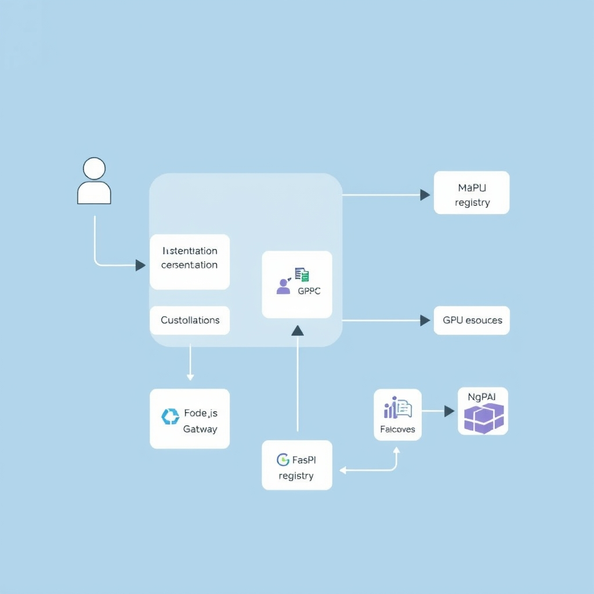

# FastAPI vs. Node.js: Choosing the Right Backend for Your 2026 AI Application

## The AI Backend Dilemma: I/O vs. Compute

The development of AI applications poses a unique dilemma for backend engineers. On one hand, these applications require real-time API responsiveness to ensure a seamless user experience. On the other hand, they also involve computationally intensive model inference, which can introduce significant latency. This dual nature of AI applications - being both I/O-bound and CPU-bound - creates a challenge in choosing the optimal backend architecture.


*The fundamental tension in AI applications: separating high-concurrency I/O from compute-intensive model inference.*

The requirements of real-time API responsiveness and model inference latency are inherently at odds. Real-time API responsiveness demands low-latency, high-throughput processing, whereas model inference can be a computationally expensive operation that takes significant time to complete.

In 2026, the industry standard is shifting towards decoupling these concerns. Rather than attempting to force a single-language stack to handle both I/O-bound and CPU-bound tasks, developers are increasingly adopting a hybrid approach. This involves using specialized frameworks and languages for each task, allowing for greater efficiency, scalability, and maintainability. By recognizing the limitations of single-language stacks, developers can create more effective, efficient, and scalable backend architectures, ultimately enabling them to deliver high-quality AI-powered products and services that meet the evolving needs of users.

## FastAPI: The Native Home of the AI Ecosystem

FastAPI has become the de facto choice for building AI/ML APIs due to its native integration with Python's extensive AI ecosystem. This ecosystem, comprising libraries like PyTorch, TensorFlow, and Hugging Face Transformers, offers unparalleled maturity and feature richness compared to its Node.js counterparts. As noted by [Second Talent](https://www.secondtalent.com/resources/fastapi-vs-node-js-usage-speed-and-popularity), FastAPI provides the most natural development experience for teams building AI-powered products or APIs that serve machine learning models.

### Maturity of Python Libraries

The maturity of Python libraries is a significant factor in FastAPI's adoption for ML-heavy workloads. Libraries such as PyTorch, TensorFlow, and Hugging Face Transformers have been extensively developed and refined over the years, providing a comprehensive set of tools for data scientists and ML engineers. According to [CodeMiners](https://codeminer.co/blog/nodejs-vs-python-backend-2026), Python's ML ecosystem is unmatched, with a wide range of libraries that cater to various aspects of machine learning, including deep learning and natural language processing.

### Asynchronous Design and ML Library Compatibility

FastAPI's asynchronous design is another key factor that contributes to its popularity in the AI/ML community. This design allows for efficient handling of concurrent requests without sacrificing compatibility with ML libraries. As [Emporion Soft](https://emporionsoft.com/nestjs-vs-fastapi-2026) notes, FastAPI demonstrates strong performance in handling concurrent asynchronous tasks, showing lower memory consumption than Node.js under high concurrency tiers in some benchmarks.

### Developer Experience

The developer experience is also an essential aspect of FastAPI's appeal to data scientists and ML engineers. FastAPI provides a simple and intuitive API for building ML-powered endpoints, making it easier for developers to focus on model development rather than infrastructure. For instance, creating a FastAPI endpoint that wraps a model inference call can be as straightforward as:

```python
from fastapi import FastAPI
from pydantic import BaseModel

app = FastAPI()

class PredictionRequest(BaseModel):
    input_text: str

@app.post("/predict")
def predict(request: PredictionRequest):
    # Call the model inference function
    prediction = model_predict(request.input_text)
    return {"prediction": prediction}
```

This example illustrates how FastAPI can be used to build a simple ML-powered API endpoint, highlighting the framework's ease of use and native support for ML workflows.

## Node.js: The Orchestrator for Real-Time UX

Node.js remains a dominant force in the realm of real-time applications and high-concurrency I/O, making it an ideal choice for the public-facing aspects of AI-powered web applications. Its ability to handle WebSocket-based streaming and high-concurrency I/O is unparalleled, allowing for seamless real-time interactions.

### High-Concurrency I/O and Real-Time UX

The single-threaded event loop of Node.js is optimized for I/O-bound operations, making it superior for handling a large number of concurrent connections. This is particularly beneficial for real-time applications, such as live updates, gaming, and collaborative editing, where low latency and high throughput are crucial.

### Role of Node.js as an API Gateway

Node.js can also serve as an effective API gateway, handling tasks such as authentication, rate limiting, and request routing. This allows for a clear separation of concerns, where Node.js focuses on managing the flow of requests and responses, while the AI inference services are handled by a more suitable framework like FastAPI.

### Limitations of Node.js for CPU-Intensive Tasks

However, the single-threaded nature of Node.js becomes a limitation when dealing with CPU-intensive tasks, such as AI model inference. Blocking the event loop with inference can lead to significant increases in tail latency, causing the server to become unresponsive to other requests. To mitigate this, it's essential to use worker threads or external microservices to offload CPU-intensive tasks, ensuring the event loop remains free to handle I/O-bound operations.

```javascript
// Example of using worker threads in Node.js to offload CPU-intensive tasks
const { Worker } = require('worker_threads');

const worker = new Worker('./worker.js');
worker.postMessage('Start inference');

worker.on('message', (result) => {
  console.log(`Inference result: ${result}`);
});

worker.on('error', (err) => {
  console.error(`Error occurred: ${err}`);
});
```

By understanding the strengths and limitations of Node.js in the context of AI-powered web applications, developers can design more efficient and scalable architectures, leveraging the best of both worlds to create seamless and responsive user experiences.

## Architecting the Hybrid Future


*Hybrid architecture: Node.js manages the public-facing gateway, while FastAPI handles compute-heavy inference.*

To effectively combine the strengths of FastAPI and Node.js, a microservices pattern can be employed, where Node.js serves as the public-facing gateway and FastAPI acts as the internal inference service. This architecture allows for the decoupling of I/O-bound and CPU-bound tasks, enabling each framework to operate within its area of expertise.

### Microservices Pattern

In this setup, Node.js handles high-concurrency I/O, real-time UX, and API gateway responsibilities such as authentication, rate limiting, and request routing. Meanwhile, FastAPI focuses on compute-heavy AI inference, leveraging its native integration with Python's mature AI ecosystem, including libraries like PyTorch, TensorFlow, and Hugging Face Transformers.

### Communication Strategies

For communication between the Node.js gateway and the FastAPI inference service, both gRPC and REST can be considered. gRPC offers a high-performance, contract-based approach that is well-suited for service-to-service communication, while REST provides a more traditional, widely adopted method that can be easier to implement and debug. The choice between gRPC and REST should be based on the specific requirements of the application, including performance needs, development complexity, and maintainability considerations.

### Operational Overhead

Managing a polyglot stack does introduce operational overhead, including the need to maintain proficiency in multiple technologies, manage different deployment environments, and ensure seamless communication between services. However, this overhead can be mitigated through the use of containerization (e.g., Docker), orchestration tools (e.g., Kubernetes), and continuous integration/continuous deployment (CI/CD) pipelines, which help standardize and automate the development, testing, and deployment processes.

### System Resilience and Scalability

The hybrid architecture improves system resilience by allowing each service to scale independently based on its specific workload. If the Node.js gateway experiences high traffic, it can be scaled without affecting the FastAPI inference service, and vice versa. This isolation also enhances resilience, as issues in one service are less likely to impact the other, thereby ensuring that at least part of the system remains operational even in the event of failures.
By adopting this hybrid approach, developers can create AI applications that not only leverage the best of both worlds in terms of technology but also achieve a balance between scalability, performance, and maintainability, ultimately leading to more robust and efficient systems.

## Conclusion: Building for Scale and Performance

In conclusion, the choice between FastAPI and Node.js for AI applications is not a binary decision, but rather a strategic combination of both. The primary function of the service should drive this choice, rather than language preference.
Forcing AI inference into a Node.js-only architecture can lead to significant risks, including blocked event loops and decreased system responsiveness.
Teams should prioritize modularity over stack simplicity, embracing the benefits of a hybrid architecture.
As the AI backend landscape continues to evolve, it is essential to recognize the value of combining FastAPI and Node.js to create scalable, high-performance applications.
Ultimately, the key to building scalable, high-performance AI applications is to prioritize modularity and strategically combine the strengths of both FastAPI and Node.js.