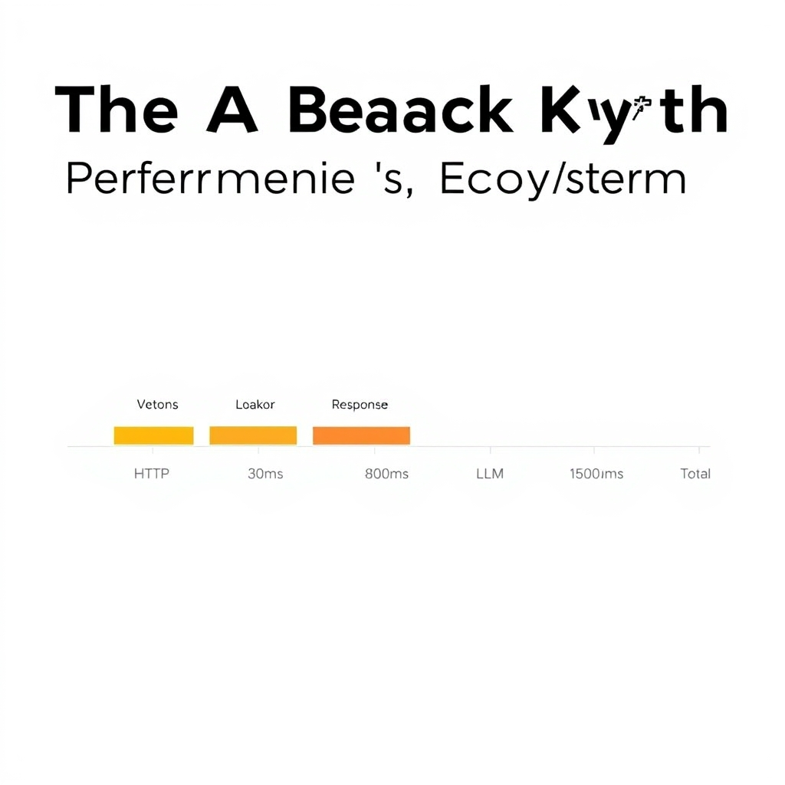
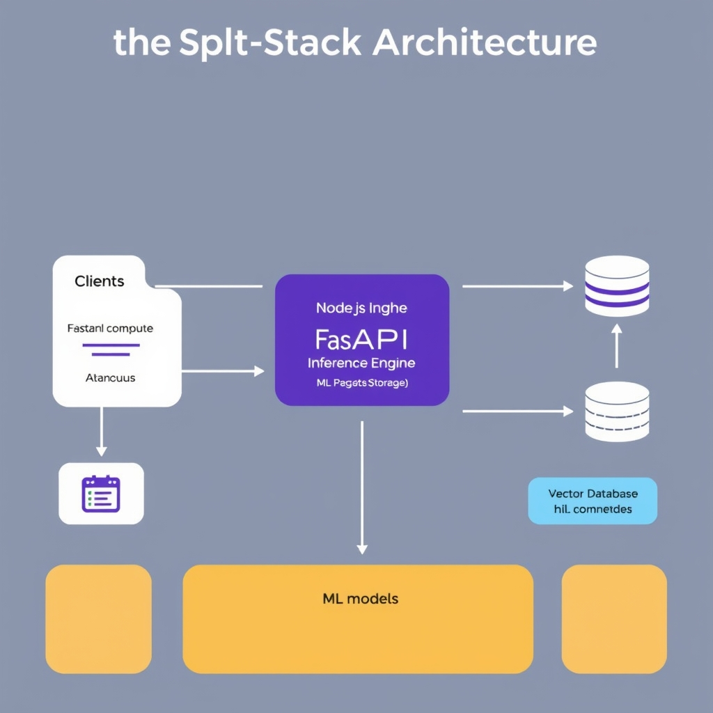

# FastAPI vs. Node.js: Choosing the Right Backend for Your AI Application

## The AI Backend Myth: Performance vs. Ecosystem

The notion that framework speed is the primary bottleneck in AI applications is a common misconception. In reality, model inference and vector search account for the vast majority of request latency. For instance, a typical request may involve 50ms for HTTP parsing, 30ms for embedding lookup, 800ms for vector search, 1.5s for a large language model (LLM) call, and 50ms for response, totaling ~2.4 seconds, with the framework contributing only 80ms of that time.


*Request latency breakdown: Framework overhead is dwarfed by the compute-intensive tasks of inference and vector search.*

The focus on 'framework speed' contrasts with the 'ecosystem integration' reality. The AI backend can be divided into two primary layers: the 'Product Layer' and the 'Inference Layer'. The Product Layer is responsible for handling user interactions, streaming UIs, and real-time features, whereas the Inference Layer focuses on model inference, vector search, and other compute-intensive tasks. Python and JavaScript serve different roles in modern AI stacks, with Python being the preferred choice for the Inference Layer due to its native integration with machine learning libraries like PyTorch, Hugging Face, and LangChain, and JavaScript (via Node.js) being often preferred for the Product Layer due to its event-driven architecture and high concurrency.
## FastAPI: The Native Home for Machine Learning
FastAPI is the preferred framework for AI-native applications due to its native integration with Python-based machine learning libraries like PyTorch, Hugging Face, and LangChain. Some key benefits of using FastAPI for AI-native backends include:
* Native integration with Python libraries like PyTorch, Hugging Face, and LangChain, allowing for seamless model inference and vector search.
* Handling CPU-bound tasks via multiprocessing and ASGI, which enables efficient processing of machine learning workloads.
* Elimination of the need for complex HTTP wrappers or child processes, thanks to the Python ecosystem.
For example, a simple FastAPI endpoint calling an ML model can be implemented as follows:
```python
from fastapi import FastAPI
from pydantic import BaseModel
import torch
import torch.nn as nn

class Item(BaseModel):
    name: str
    description: str = None
    price: float
    tax: float = None

class MLModel(nn.Module):
    def __init__(self):
        super(MLModel, self).__init__()
        self.fc1 = nn.Linear(5, 10)  # input layer (5) -> hidden layer (10)

    def forward(self, x):
        x = torch.relu(self.fc1(x))
        return x

app = FastAPI()
model = MLModel()

@app.post("/items/")
def create_item(item: Item):
    # Create a dummy input tensor
    input_tensor = torch.randn(1, 5)
    # Call the ML model
    output = model(input_tensor)
    return {
        'item': item,
        'model_output': output.detach().numpy().tolist()
    }
```
This example demonstrates how FastAPI can be used to create a simple API endpoint that calls an ML model, highlighting its suitability for AI-native applications.

## Node.js: The Orchestrator for the Product Layer

Node.js is often preferred for the product layer of AI applications, such as streaming UIs and real-time features, due to its event-driven architecture and high concurrency. The event-driven architecture allows Node.js to handle a large number of concurrent connections, making it ideal for high-concurrency API gateways. This architecture is particularly beneficial for applications that require handling multiple requests simultaneously, as it enables efficient management of resources and minimizes the risk of performance bottlenecks.

The advantage of Node.js for streaming UIs and real-time WebSocket communication lies in its ability to efficiently manage real-time updates and live feeds, providing a seamless user experience. By leveraging Node.js, developers can create applications that provide instant feedback and updates, which is critical for applications that require real-time interaction, such as live feeds, gaming, and collaborative editing. This capability enables developers to build engaging and interactive user interfaces that meet the demands of modern users.

The use of a shared language, such as TypeScript, between frontend and backend, facilitates easier code reuse, reduces the complexity of maintaining separate codebases, and enhances collaboration between frontend and backend developers. This shared language enables developers to work more efficiently, as they can reuse code and apply their existing knowledge to both frontend and backend development. As a result, the development process becomes more streamlined, and the overall quality of the application improves.

Node.js is the ideal 'glue' for complex user-facing features due to its ability to handle real-time communication, streaming, and high concurrency. Its event-driven architecture and support for WebSocket protocol make it an excellent choice for orchestrating the product layer of AI applications. By leveraging Node.js, developers can create applications that provide a seamless and engaging user experience, which is critical for applications that require real-time interaction and feedback.

## The Split-Stack Architecture

The split-stack architecture is a common pattern in production AI systems, where Node.js acts as the gateway and FastAPI acts as the inference engine. This separation of concerns improves maintainability and scalability. Node.js handles the product layer, including streaming UIs and real-time features, due to its event-driven architecture and high concurrency. FastAPI handles the inference layer, including model inference and vector search, due to its native integration with Python-based machine learning libraries like PyTorch, Hugging Face, and LangChain. This architecture allows for a clear separation of responsibilities, with Node.js focusing on user experience and FastAPI focusing on model integration. However, managing two separate services can introduce additional complexity, such as increased latency and added operational overhead. 
A high-level architectural diagram of this split-stack architecture would involve the Node.js gateway handling incoming requests and routing them to the appropriate service. The FastAPI inference engine would then handle model inference and vector search, leveraging its integration with machine learning libraries. The data would be stored and retrieved from a database or storage layer. To ensure scalability, a load balancer or API gateway would distribute traffic between the Node.js gateway and the FastAPI inference engine, allowing the system to handle a large volume of requests efficiently. This setup enables a smooth flow of data between the gateway and the inference engine, facilitating the deployment of production-ready AI systems.


*The split-stack architecture: Node.js manages the product layer and real-time communication, while FastAPI handles compute-heavy inference.*
## Conclusion: Choosing Your Path
The choice between FastAPI and Node.js for AI applications ultimately depends on the specific requirements of your project. FastAPI is ideal for heavy lifting, such as model inference and vector search, due to its native integration with Python-based machine learning libraries like PyTorch, Hugging Face, and LangChain. On the other hand, Node.js is better suited for the product layer, including streaming UIs and real-time features, thanks to its event-driven architecture and high concurrency.

Some key points to consider when deciding between a single-stack and a split-stack approach include:
* FastAPI's ability to handle CPU-bound tasks via multiprocessing and ASGI, making it a great choice for AI-native applications.
* Node.js's advantage in handling high-concurrency API gateways and real-time WebSocket communication, making it a great choice for user-facing features.
* The trade-offs of managing two separate services in a split-stack architecture, including increased complexity and potential latency issues.

Ultimately, the framework choice should serve the application's primary bottleneck. By prioritizing developer velocity and ecosystem access, you can make an informed decision that meets the needs of your project.