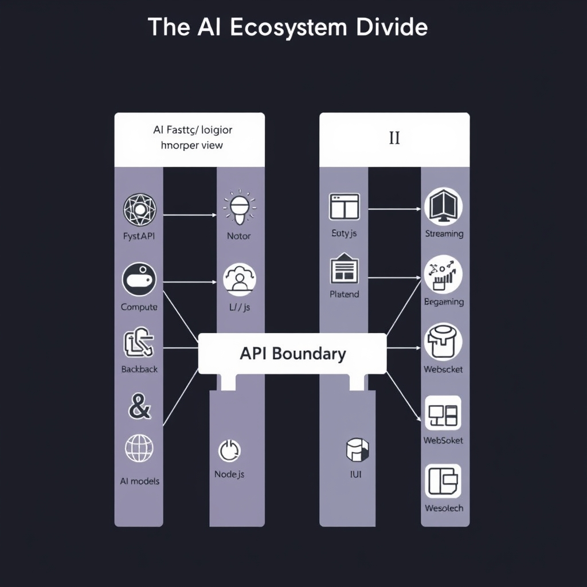
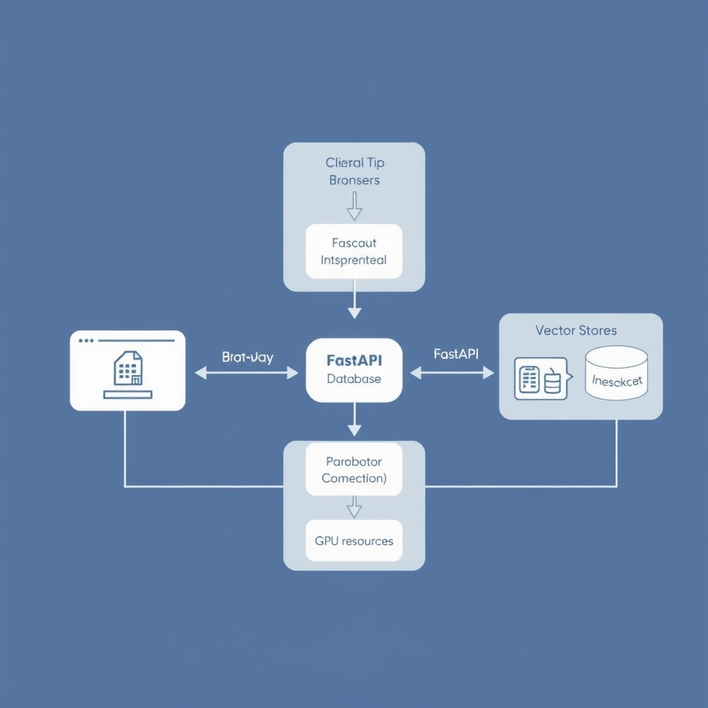

# FastAPI vs Node.js: Selecting the Right Stack for AI Applications

## The AI Ecosystem Divide

Python’s ecosystem is the de‑facto foundation for modern machine‑learning research. The majority of open‑source LLM toolkits, data‑science notebooks, and GPU‑accelerated libraries are written in Python, which means new model architectures and training tricks appear first in that language. By contrast, Node.js excels in the web‑infrastructure layer: its event‑driven runtime, mature package manager, and built‑in support for HTTP/2 and WebSockets make it the go‑to choice for serving static assets, handling authentication flows, and orchestrating micro‑service communication.

When it comes to Retrieval‑Augmented Generation (RAG) and multi‑agent pipelines, the Python side offers a decisive advantage. Libraries such as LangChain and LlamaIndex have reached a level of stability and feature completeness that makes them the "canonical" implementations for building context‑aware agents. The same analysis notes that FastAPI, running on Python 3.13, is the preferred framework for RAG and multi‑agent backends precisely because of this library maturity [FastAPI vs Node.js for AI Backends in 2026](https://www.marsdevs.com/compare/fastapi-vs-nodejs-for-ai-backends).

However, raw server throughput is not the primary bottleneck for most AI products. While Node.js can deliver 1.5‑2× higher I/O‑bound performance on pure request‑response workloads, the overall latency of an AI service is dominated by model inference and data‑processing steps, which are far slower than any network overhead. The comparative study highlights that Python wins when LLM inference or data‑science workloads dominate—not because Python itself is faster, but because the underlying libraries are far more mature and optimized for those tasks [Node.js vs Python for Backend: Which Wins in 2026?](https://www.groovyweb.co/blog/nodejs-vs-python-backend-comparison-2026).

Consequently, the strategic decision often reduces to a question of "model‑centric logic" versus "pure server throughput." If the core value of the application lies in sophisticated reasoning, retrieval, or agent orchestration, leveraging Python’s rich AI stack outweighs the modest I/O gains offered by Node.js. Conversely, for UI‑heavy, real‑time interfaces where latency is dominated by network chatter, Node.js can provide a smoother user experience. Understanding this ecosystem divide helps teams allocate the right language to the right layer, setting the stage for a split‑stack architecture that plays to each technology’s strengths.


*The ecosystem divide: FastAPI excels at compute-heavy AI orchestration, while Node.js excels at streaming real-time user experiences.*

## Deep Dive into FastAPI for Backend AI

FastAPI has become the de‑facto choice for the backend layer of AI products that need sophisticated retrieval‑augmented generation (RAG) pipelines or multi‑agent orchestration. The MarsDevs comparison notes that, for RAG and agentic workloads in 2026, developers overwhelmingly ship FastAPI on Python 3.13, leveraging the canonical LlamaIndex Python bindings and a mature asyncpg + pgvector stack for vector‑store access. This tight coupling of retrieval logic, prompt engineering, and agent coordination is difficult to replicate with a Node.js stack that lacks comparable native libraries.

Beyond the library ecosystem, FastAPI offers a unified development experience: the same Python codebase that defines model loading, token streaming, and chain composition also declares the HTTP endpoints that expose those capabilities. According to Second Talent, enterprise AI teams favor FastAPI because it “integrates seamlessly with LangChain, LlamaIndex, and other LLM frameworks,” allowing model logic and API serving to live side‑by‑side without language boundaries. This eliminates the friction of maintaining separate services in different runtimes and reduces latency introduced by inter‑process communication.

The broader Python ecosystem reinforces FastAPI’s position in productionizing ML models. Python’s dominance in research translates into first‑class support for cutting‑edge libraries—transformers, diffusion models, and quantization tools—all of which can be imported directly into a FastAPI route. Moreover, the async capabilities of FastAPI align with modern async database drivers (e.g., asyncpg) and vector‑store extensions (pgvector), enabling high‑throughput inference while preserving the simplicity of a single language stack. When a project requires deterministic reproducibility, extensive type‑checking, or direct access to GPU‑accelerated libraries such as PyTorch or TensorFlow, staying within Python avoids the overhead of language bridges or foreign‑function interfaces.

In practice, FastAPI becomes non‑negotiable when:

- The application relies on RAG or multi‑agent patterns that depend on Python‑only libraries like LlamaIndex or LangChain. [FastAPI vs Node.js for AI Backends in 2026](https://www.marsdevs.com/compare/fastapi-vs-nodejs-for-ai-backends)
- The team values a single repository for model code, preprocessing, and API definitions, streamlining CI/CD pipelines. [FastAPI vs Node.js: Usage, Speed and Popularity in 2026](https://www.secondtalent.com/resources/fastapi-vs-node-js-usage-speed-and-popularity)
- Production constraints demand tight integration with Python‑centric tooling, such as GPU drivers, data‑science notebooks, or custom C‑extensions.

When these conditions are met, FastAPI not only simplifies engineering effort but also maximizes performance by keeping the inference logic close to the language that best supports it.

## Node.js and the Modern Streaming UI

### Streaming UI with the Vercel AI SDK

The Vercel AI SDK abstracts the complexities of server‑sent events (SSE) and WebSocket streams, letting a Node.js layer push token‑by‑token responses directly to the browser. By wiring the SDK into a Fastify route, each LLM token emitted by a FastAPI inference service can be relayed to the client without buffering the entire response. This pattern yields a chat experience where the UI updates in near‑real‑time, mirroring the latency of the underlying model.

```js
// Fastify endpoint that forwards a streaming response from FastAPI
fastify.get('/chat', async (request, reply) => {
  const stream = await fetch('http://fastapi:8000/generate', { method: 'POST', body: request.body });
  reply.raw.writeHead(200, { 'Content-Type': 'text/event-stream' });
  for await (const chunk of stream.body) {
    reply.raw.write(`data: ${chunk}\n\n`);
  }
  reply.raw.end();
});
```

The code demonstrates how a thin Node.js proxy can preserve the SSE contract while delegating heavy model work to Python.

### Real‑time chat events and socket management

Beyond simple SSE, modern AI UIs often need bidirectional communication: typing indicators, user‑initiated function calls, and dynamic UI updates. Node.js excels at managing thousands of concurrent WebSocket connections thanks to its non‑blocking event loop. A typical setup uses `socket.io` or the native `ws` library to broadcast model‑generated events to specific sessions, while also handling client‑side actions such as "regenerate" or "stop".

```js
io.on('connection', socket => {
  socket.on('userMessage', async msg => {
    const response = await fetch('http://fastapi:8000/agent', { method: 'POST', body: JSON.stringify({msg}) });
    for await (const token of response.body) {
      socket.emit('assistantToken', token);
    }
    socket.emit('assistantDone');
  });
});
```

This pattern keeps the UI responsive: the browser receives tokens as they arrive, and the server can interrupt or modify the stream based on user actions.

### I/O throughput advantage over FastAPI for the UI layer

When the API surface is primarily I/O‑bound—routing requests, aggregating responses, and maintaining WebSocket streams—Node.js delivers roughly 1.5‑2× higher raw throughput than a comparable FastAPI service [GroovyWeb analysis](https://www.groovyweb.co/blog/nodejs-vs-python-backend-comparison-2026). The advantage stems from Node's single‑threaded, event‑driven architecture, which avoids the context‑switch overhead of Python's thread or async models for high‑frequency socket traffic. Consequently, a Node.js gateway can sustain more concurrent chat sessions with lower latency, while delegating the compute‑heavy inference work to FastAPI where Python's mature ML libraries provide the best performance.

In practice, a split‑stack deployment places the Vercel AI SDK‑enabled Node.js layer at the edge (e.g., Vercel or Cloudflare Workers) to capture user interactions instantly, and forwards inference calls to a FastAPI microservice hosted in a GPU‑optimized environment. This separation lets each language play to its strengths: Node.js for ultra‑low‑latency streaming UI, and Python for model‑centric logic.

## Architecting for the Future: The Split-Stack Pattern


*The split-stack pattern separates the UI-serving layer from the inference engine to optimize both latency and performance.*

### Split‑Stack Overview

A split‑stack architecture separates concerns into two dedicated services:

- **Inference layer (FastAPI)** – pure Python runtime that loads models, executes vector searches, and orchestrates agents. It stays close to the ML ecosystem, leveraging libraries such as LangChain, LlamaIndex, and PyTorch without the overhead of a full‑stack web server.
- **UI layer (Node.js BFF)** – a lightweight backend‑for‑frontend that handles HTTP/2, WebSocket, or Server‑Sent Events streams, aggregates responses from the FastAPI service, and pushes them to the browser or mobile client.

This division mirrors the way large‑scale AI products (> $5 M ARR) are built in production, where a Python FastAPI inference service is paired with a Node.js streaming UI — a pattern documented in the industry analysis of AI back‑ends [FastAPI vs Node.js for AI Backends in 2026](https://www.marsdevs.com/compare/fastapi-vs-nodejs-for-ai-backends).

______________________________________________________________________

### Interface Boundaries

1. **Transport Protocol** – The UI layer calls the inference layer over a stateless HTTP/JSON API. For streaming responses, the UI layer opens an SSE or WebSocket connection to the client and forwards chunked data received from FastAPI.
1. **Data Contract** – Define a minimal schema (e.g., `{ request_id, model, payload, metadata }`) that both services agree on. Keep payloads lightweight; heavy tensors stay in the Python process.
1. **Authentication & Rate Limiting** – Centralize auth in the Node.js BFF, passing a signed token to FastAPI for downstream verification. This prevents exposing model endpoints directly to the internet.
1. **Observability** – Export Prometheus metrics from each service (request latency, error rates) and correlate them via a shared `request_id`.

______________________________________________________________________

### When to Transition from Monolith to Split‑Stack

| Situation                   | Why a monolith may suffice                                                                                         | Why split‑stack becomes advantageous                                                                                                                      |
| --------------------------- | ------------------------------------------------------------------------------------------------------------------ | --------------------------------------------------------------------------------------------------------------------------------------------------------- |
| **Early prototype**         | Single FastAPI app can serve both API and simple UI rendering, reducing operational overhead.                      | As user concurrency grows, the UI layer needs non‑blocking I/O and fine‑grained scaling that Node.js excels at.                                           |
| **Model‑centric workloads** | If the product is primarily batch inference or offline processing, keeping everything in Python minimizes latency. | Real‑time chat or code‑completion UIs demand sub‑second streaming; Node.js can multiplex thousands of connections with minimal threads.                   |
| **Team specialization**     | A small team of data scientists may prefer a single codebase.                                                      | Larger teams benefit from clear ownership: ML engineers maintain FastAPI, frontend engineers own the Node.js BFF, enabling independent deployment cycles. |
| **Cost considerations**     | Running a single container reduces cloud spend.                                                                    | Separate services allow right‑sizing: GPU‑enabled FastAPI pods for inference, CPU‑only Node.js pods for UI, optimizing resource allocation.               |

______________________________________________________________________

### Blueprint for Production

1. **Containerize each service** – Docker images for FastAPI (with GPU drivers) and Node.js (lightweight Alpine base).
1. **Orchestrate with Kubernetes** – Deploy FastAPI as a `Deployment` behind a `ClusterIP` service; expose Node.js via an `Ingress` that terminates TLS.
1. **CI/CD pipelines** – Independent pipelines for model versioning (FastAPI) and UI feature releases (Node.js).
1. **Feature flagging** – Route a subset of traffic to the new split‑stack while keeping a fallback monolithic endpoint during migration.

By adhering to these boundaries and migration criteria, teams can reap the benefits of Python’s ML richness while delivering the low‑latency, streaming experiences that modern AI users expect.

## Sources

- [FastAPI vs Node.js for AI Backends in 2026 | MarsDevs](https://www.marsdevs.com/compare/fastapi-vs-nodejs-for-ai-backends)
- [Node.js vs Python for Backend: Which Wins in 2026?](https://www.groovyweb.co/blog/nodejs-vs-python-backend-comparison-2026)
- [FastAPI vs Node.js: Usage, Speed and Popularity in 2026 | Second Talent](https://www.secondtalent.com/resources/fastapi-vs-node-js-usage-speed-and-popularity)