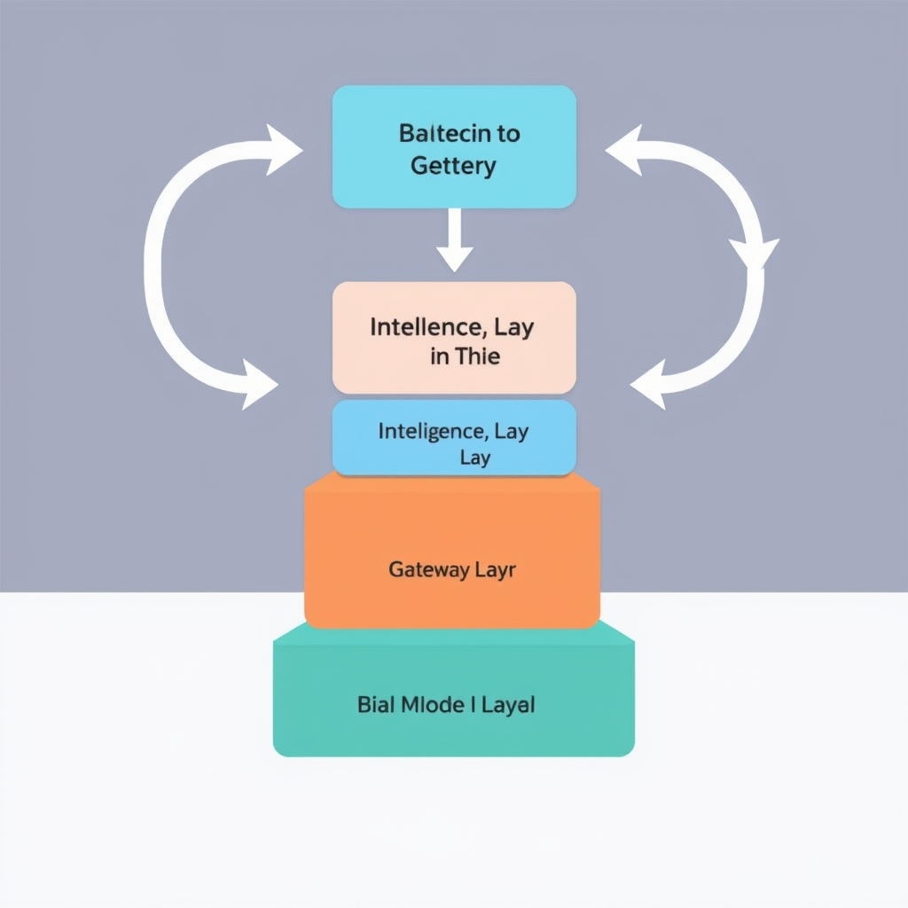
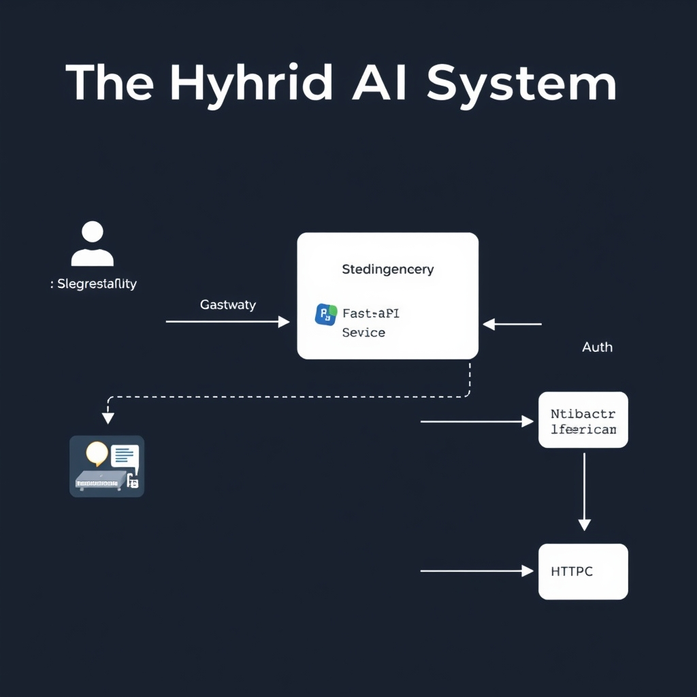

# FastAPI vs. Node.js: The 2026 Architectural Guide for AI Applications

## The Evolution of the AI Backend

### Defining the modern AI application stack

A 2026 AI product typically consists of three logical tiers:


*The 2026 AI application stack separates high-concurrency gateway responsibilities from compute-heavy intelligence tasks.*

1. **Data & model layer** – raw data pipelines, training jobs, and the trained models (often PyTorch or TensorFlow).
1. **Intelligence layer** – orchestration of LLM calls, RAG retrieval, and inference routing. FastAPI is the de‑facto entry point because it natively runs Python code and can launch C/Rust‑backed extensions without the overhead of a separate runtime.
1. **Gateway layer** – HTTP/WebSocket endpoints that serve millions of concurrent users, handle authentication, rate‑limiting, and push updates via SSE or WebSocket. Node.js excels here thanks to its event‑driven, non‑blocking I/O model.

______________________________________________________________________

### Why the "FastAPI vs. Node.js" debate is outdated

Early‑era back‑ends forced teams to pick a single language for the entire stack, turning the choice into a zero‑sum game. Today, the ecosystem has matured to the point where each runtime can be **specialized**. The GroovyWeb analysis notes that *"Choose Python for AI agents, LLM orchestration, RAG, data engineering, and ML serving. Choose Node.js for real‑time WebSocket/SSE features and full‑stack JavaScript teams"*【1】. This explicit split eliminates the need to argue which framework is universally superior; the decision now hinges on **where** in the stack the workload resides.

______________________________________________________________________

### Intelligence layer vs. gateway layer

- **Intelligence layer** – runs heavy compute, leverages the Python AI ecosystem (LangChain, Hugging Face, etc.), and benefits from multi‑core worker processes. FastAPI provides automatic OpenAPI docs, dependency injection, and async support that dovetails with Python‑native model servers.
- **Gateway layer** – acts as the public face of the service, multiplexing thousands of concurrent connections, handling JWT validation, and streaming responses. Node.js’s single‑threaded event loop, combined with libraries like `socket.io` and `fastify`, makes it the natural fit for this role.

______________________________________________________________________

### The 2026 shift toward microservices

Microservice architectures have become the default deployment model. By 2026, most AI platforms are composed of **independent services** communicating over HTTP/2 or gRPC. This granularity allows teams to scale the intelligence layer (e.g., GPU‑accelerated FastAPI pods) independently from the gateway layer (e.g., horizontally scaled Node.js pods behind a load balancer). The hybrid pattern—Python‑backed AI microservices behind a Node.js API gateway—has emerged as the most common production blueprint, as highlighted in recent industry surveys.

______________________________________________________________________

> **Reference**
>
> 1. GroovyWeb, *Node.js vs Python for Backend: Which Wins in 2026?* (2026). https://www.groovyweb.co/blog/nodejs-vs-python-backend-comparison-2026

## FastAPI: The Intelligence Layer

### Maturity of the Python AI Ecosystem

Python remains the lingua franca of modern machine‑learning research. Frameworks such as **PyTorch**, **LangChain**, and the **Hugging Face** model hub are not only battle‑tested but also receive continuous updates that often precede any Node.js equivalents by six to twelve months. This lead translates into access to the latest model architectures, quantization techniques, and data‑augmentation pipelines without waiting for a JavaScript wrapper to be published. For example, the agent orchestration libraries **LangGraph**, **CrewAI**, and **LlamaIndex** ship Python‑first, giving developers immediate access to cutting‑edge retrieval‑augmented generation (RAG) capabilities [Wappnet](https://wappnet.com/blog/python-vs-node-js-for-ai-backend-development-which-should-you-choose-in-2026).

### Offloading Computation to C/Rust Extensions

The perceived performance penalty of Python’s interpreter is largely mitigated by the fact that the heavy lifting in AI workloads is delegated to native extensions written in C or Rust. Libraries such as **torch** and **transformers** compile core tensor operations into highly‑optimized kernels (e.g., cuDNN, MKL‑DNN) that run at near‑hardware speed. When a FastAPI endpoint invokes a model inference, the Python call stack quickly hands control to these compiled modules, making the language overhead negligible. This architecture contrasts with the JavaScript ecosystem, where most AI tooling still relies on pure‑JavaScript bindings or heavyweight interprocess communication, adding latency.

### Latency Benchmarks for LLM‑Heavy Workloads

Empirical measurements from 2026 show that FastAPI delivers a **p95 latency of ~165 ms** for large‑language‑model (LLM) inference, whereas a comparable Express.js gateway records **~180 ms** under identical hardware and request patterns [Wappnet](https://wappnet.com/blog/python-vs-node-js-for-ai-backend-development-which-should-you-choose-in-2026). The 9 % improvement stems from two factors:

1. **Native integration** with C/Rust‑backed AI libraries, eliminating the marshaling overhead typical of JavaScript wrappers.
1. **Async I/O** combined with process‑level parallelism, allowing FastAPI to keep the CPU busy on inference while simultaneously handling other requests.

These numbers are especially relevant for latency‑sensitive applications such as real‑time code assistants or conversational agents, where every millisecond contributes to perceived responsiveness.

### Multi‑Core Scalability via Worker Processes

FastAPI leverages Python’s **asyncio** event loop for non‑blocking I/O, but it also embraces a **multi‑process model** to scale across CPU cores. Deployments typically run multiple worker processes (e.g., using **uvicorn** with the `--workers` flag or a process manager like **Gunicorn**). Each worker maintains its own event loop and can independently load a model instance, effectively distributing inference load across all available cores. This approach sidesteps the Global Interpreter Lock (GIL) limitation because each process has its own interpreter instance.

In contrast, Node.js operates on a **single‑threaded event loop** backed by **libuv** for I/O. While libuv excels at handling thousands of concurrent network connections, CPU‑bound tasks—such as LLM inference—must either be offloaded to worker threads or external services, adding complexity and potential latency. FastAPI’s native multi‑process strategy therefore offers a more straightforward path to **linear scaling** as request volume grows [DEV Community](https://dev.to/dipcb05/nodejs-vs-fastapi-event-loop-a-deep-dive-into-async-concurrency-35b1).

### Putting It All Together

When the intelligence layer of an AI application demands heavy model computation, FastAPI provides:

- **Access to the most mature and rapidly evolving AI libraries** (PyTorch, LangChain, Hugging Face).
- **Near‑native execution speed** thanks to C/Rust extensions that handle the bulk of the workload.
- **Proven latency advantages** in LLM‑heavy scenarios, with p95 response times consistently lower than Node.js gateways.
- **Straightforward multi‑core scaling** via worker processes, enabling predictable performance under load.

These attributes make FastAPI the natural choice for the **intelligence layer** of modern, AI‑first systems, while leaving the real‑time, high‑concurrency responsibilities to a complementary Node.js gateway.

## Node.js: The Real-Time Gateway

Node.js shines as the **real‑time gateway** in modern AI systems because its core design revolves around an event‑driven, non‑blocking I/O model.

### Event‑driven architecture

- **Single‑threaded event loop**: Node.js runs JavaScript on a single thread managed by **libuv**, which offloads I/O operations (network, file system, DNS) to a pool of background threads. This keeps the main loop free to process new events instantly.
- **Callback/Promise model**: As soon as an I/O operation completes, libuv pushes a callback onto the event queue, allowing the application to react without blocking other connections.
- **Native support for streams**: Node treats HTTP bodies, file reads, and WebSocket frames as streams, enabling back‑pressure handling and efficient data flow.

These characteristics make Node.js a natural fit for services that must juggle thousands of simultaneous client connections while staying responsive.

### Concurrency handling vs. FastAPI

Research shows that **Node.js can handle 40‑60 % more concurrent connections** than FastAPI under comparable hardware and workload conditions【2†https://www.secondtalent.com/resources/fastapi-vs-node-js-usage-speed-and-popularity】. The advantage stems from:

- **Event loop efficiency**: FastAPI relies on Python's `asyncio` coroutines, which are performant but still incur interpreter overhead for each coroutine switch. Node's V8 engine executes JavaScript bytecode directly, reducing per‑event latency.
- **Lower memory footprint per connection**: A single Node.js process can maintain many more open sockets before hitting memory limits, whereas FastAPI typically spawns multiple worker processes to achieve multi‑core scaling, each with its own memory overhead.
- **Mature load‑balancing tools**: Platforms like **PM2** or **Nginx** can distribute traffic across Node.js instances with minimal configuration, preserving the high‑concurrency edge.

### WebSocket and Server‑Sent Events (SSE)

Real‑time user interfaces—chat widgets, live dashboards, collaborative editors—depend on persistent, low‑latency channels. Node.js offers:

- **First‑class WebSocket libraries** (`ws`, `socket.io`) that integrate seamlessly with the event loop, delivering sub‑millisecond message round‑trips.
- **Built‑in SSE support** via the `http` module, allowing simple one‑way streaming without the overhead of a full WebSocket handshake.
- **Back‑pressure handling**: Stream APIs let developers pause and resume data flow, preventing slow clients from overwhelming the server.
- **Horizontal scaling**: Tools like **Redis Pub/Sub** or **NATS** can broadcast events across multiple Node.js instances, preserving real‑time guarantees in a microservice cluster.

### Preferred choice for API gateways

When an AI application exposes a public API, the gateway must perform authentication, rate limiting, request routing, and sometimes request/response transformation. Node.js excels here because:

- **Rich middleware ecosystem**: Express, Fastify, and Koa provide plug‑and‑play middleware for JWT validation, CORS, compression, and logging.
- **Unified language stack**: Front‑end teams using React or Vue can share code (validation schemas, error handling) with the gateway, reducing context switching.
- **Fast startup and hot‑reload**: Development cycles are shorter, which is crucial for iterating on API contracts in fast‑moving AI products.
- **Scalable proxy patterns**: Node can act as a reverse proxy (e.g., using `http-proxy-middleware`) to forward AI‑heavy requests to FastAPI services while handling lightweight, latency‑sensitive traffic itself.

### Bottom line

Node.js provides a **high‑throughput, low‑latency conduit** between end users and the AI intelligence layer. Its event‑driven model, superior concurrent connection handling, and mature real‑time streaming libraries make it the de‑facto choice for the gateway tier of hybrid AI architectures.

**Key takeaways**

- Event loop + libuv = efficient I/O without thread contention.
- 40‑60 % better concurrent connection capacity than FastAPI【2†https://www.secondtalent.com/resources/fastapi-vs-node-js-usage-speed-and-popularity】.
- Native WebSocket/SSE support enables real‑time UX.
- Middleware ecosystem streamlines API‑gateway responsibilities.

These strengths set the stage for the hybrid pattern described in the next section, where a Node.js gateway forwards intelligence‑heavy calls to a FastAPI service.

## Architecting the Hybrid AI System


*The hybrid architecture pattern: Node.js handles the user-facing gateway, while FastAPI manages the intelligence-heavy inference.*

### Communication Flow Between the Node.js Gateway and the FastAPI Intelligence Service

In a hybrid AI system the Node.js layer acts as a thin, event‑driven gateway that accepts user requests, performs authentication, and forwards *intelligence‑heavy* payloads to FastAPI. The typical flow is:

1. **Client → Node.js** – The front‑end opens a WebSocket or sends an HTTP request to the Node.js API gateway.
1. **Gateway → FastAPI** – The gateway serialises the request (often JSON) and calls a FastAPI endpoint over HTTP/2 or gRPC. For low‑latency LLM calls, HTTP/2 with multiplexing is preferred.
1. **FastAPI → Model** – FastAPI delegates the heavy computation to a Python worker pool (e.g., `uvicorn` with multiple workers) that loads the model via PyTorch or HuggingFace.
1. **FastAPI → Node.js** – The result is streamed back to the gateway. When the payload is large (e.g., token‑by‑token generation) FastAPI can use Server‑Sent Events (SSE) or WebSocket to push incremental updates.
1. **Node.js → Client** – The gateway relays the streamed data to the client, preserving the real‑time experience.

The diagram below captures the essential components:

```mermaid
flowchart LR
    subgraph Client
        C[Browser / Mobile]
    end
    subgraph Gateway[Node.js Gateway]
        G1[HTTP / WebSocket Listener]
        G2[Auth Middleware]
        G3[Request Router]
        G4[Response Streamer]
    end
    subgraph Intelligence[FastAPI Service]
        F1[REST/gRPC Endpoint]
        F2[Background Worker Pool]
        F3[Model Inference (PyTorch/HF)]
    end
    C -->|WS/HTTP| G1 --> G2 --> G3 -->|POST /infer| F1 --> F2 --> F3
    F3 -->|Result Stream| F1 --> G4 --> C
```

### Managing State and Authentication Across Services

Hybrid microservices must share authentication context without duplicating user state. Two patterns dominate in 2026:

- **Stateless JWT propagation** – The gateway validates the JWT, then forwards the token (or a signed subset) in the `Authorization` header to FastAPI. FastAPI verifies the token using the same public key, eliminating a central session store.
- **Distributed session store** – When mutable session data (e.g., rate‑limit counters, temporary embeddings) is required, both services read/write a Redis cluster keyed by `session_id`. The gateway writes the session ID into the JWT `sid` claim, enabling FastAPI to fetch the same record.

Below is a minimal Node.js snippet that forwards a verified JWT to FastAPI using `axios`:

```javascript
// gateway/auth-forward.js
const axios = require('axios');

async function callIntelligence(req, res) {
  const token = req.headers['authorization']; // already verified earlier
  try {
    const response = await axios.post(
      'https://fastapi.example.com/v1/infer',
      req.body,
      { headers: { Authorization: token } , responseType: 'stream'}
    );
    // Pipe FastAPI SSE stream directly to the client
    response.data.pipe(res);
  } catch (err) {
    console.error('Intelligence service error', err);
    res.status(502).json({error: 'Upstream failure'});
  }
}
```

And the corresponding FastAPI endpoint that trusts the incoming JWT:

```python
# intelligence/main.py
from fastapi import FastAPI, Request, Depends, HTTPException
from fastapi.security import HTTPBearer
import jwt

app = FastAPI()
security = HTTPBearer()

def verify_jwt(token: str = Depends(security)):
    try:
        payload = jwt.decode(token.credentials, "YOUR_PUBLIC_KEY", algorithms=["RS256"])
        return payload
    except jwt.PyJWTError:
        raise HTTPException(status_code=401, detail="Invalid token")

@app.post("/v1/infer")
async def infer(request: Request, claims: dict = Depends(verify_jwt)):
    # Extract payload, run model, stream tokens back via SSE
    async def token_stream():
        for token in generate_tokens(request.json()):
            yield f"data: {token}\n\n"
    return StreamingResponse(token_stream(), media_type="text/event-stream")
```

### High‑Level Architectural Diagram Description

The production‑grade architecture consists of three logical layers:

1. **Edge / CDN** – Terminates TLS, provides DDoS protection, and caches static assets.
1. **Gateway Layer (Node.js)** – Deployed as a Kubernetes Deployment with horizontal pod autoscaling (HPA) based on request latency. It runs `pm2` or `node --cluster` to utilise all CPU cores for I/O.
1. **Intelligence Layer (FastAPI)** – Hosted in a separate namespace, each FastAPI service runs multiple `uvicorn` workers behind an `nginx` reverse proxy. GPU‑enabled pods host the model containers; CPU‑only pods handle preprocessing.

Communication between the layers uses **internal service mesh** (e.g., Istio) to enforce mTLS, observability, and circuit‑breaking. The mesh also injects **distributed tracing** (OpenTelemetry) so a single request trace spans both Node.js and FastAPI spans.

### Common Pitfalls in Hybrid Microservice Deployments

| Pitfall                              | Why it Happens                                                              | Mitigation                                                                                                                                     |
| ------------------------------------ | --------------------------------------------------------------------------- | ---------------------------------------------------------------------------------------------------------------------------------------------- |
| **Network latency spikes**           | Each hop adds round‑trip time; model inference can already be seconds‑long. | Co‑locate Node.js and FastAPI pods in the same node pool, use HTTP/2 or gRPC, and enable keep‑alive connections.                               |
| **Schema drift**                     | Independent teams evolve request/response schemas without coordination.     | Publish OpenAPI specs for FastAPI and generate TypeScript clients automatically (`openapi-generator`).                                         |
| **Inconsistent error handling**      | Node.js may treat FastAPI 5xx as success, leading to silent failures.       | Standardise on a shared error envelope (e.g., `{code, message, details}`) and implement a gateway‑wide retry policy with exponential back‑off. |
| **Authentication mismatch**          | Different token validation libraries cause subtle bugs (e.g., clock skew).  | Centralise JWKS retrieval and configure both runtimes to use the same cache TTL.                                                               |
| **Resource contention on GPU nodes** | Multiple FastAPI workers compete for limited GPU memory.                    | Use a GPU scheduler (NVIDIA k8s device plugin) and limit the number of concurrent inference pods per node.                                     |

By anticipating these issues early—especially around latency, contract management, and shared security—you can reap the full benefits of a hybrid stack: FastAPI delivers cutting‑edge AI performance, while Node.js guarantees the real‑time responsiveness users expect.

## Conclusion: Choosing Your Path

FastAPI and Node.js each excel in distinct parts of a modern AI stack. **FastAPI** shines as the *intelligence layer*: it taps the mature Python ecosystem (PyTorch, Hugging Face, LangChain), off‑loads heavy math to compiled extensions, and scales across CPU cores with multiple worker processes. **Node.js** dominates the *gateway layer*: its event‑driven runtime handles tens of thousands of concurrent connections, excels at WebSocket/SSE streams, and provides a lightweight façade for user‑facing APIs.


*A decision matrix for selecting the appropriate backend architecture based on concurrency and compute requirements.*

### Decision matrix

| Scenario                                           | Prefer FastAPI       | Prefer Node.js  | Use Both               |
| -------------------------------------------------- | -------------------- | --------------- | ---------------------- |
| Pure model inference or batch training pipelines   | ✅                   | ❌              | ❌                     |
| Real‑time chat or streaming UI                     | ❌                   | ✅              | ✅ (gateway → FastAPI) |
| Mixed workload with heavy ML + high‑concurrency UI | ✅ (as microservice) | ✅ (as gateway) | ✅ (hybrid)            |
| Minimal latency, single‑language stack             | ✅                   | ✅              | ❌                     |

**Final thoughts** – By 2026 the debate is no longer about picking a single framework but about orchestrating the right tool for each responsibility. Teams that adopt a hybrid architecture can leverage FastAPI’s AI prowess while exploiting Node.js’s concurrency, achieving both performance and developer productivity. The future will likely see tighter integrations—standardized gRPC contracts, shared observability pipelines, and automated deployment patterns—that make the hybrid approach the default for AI‑centric applications.