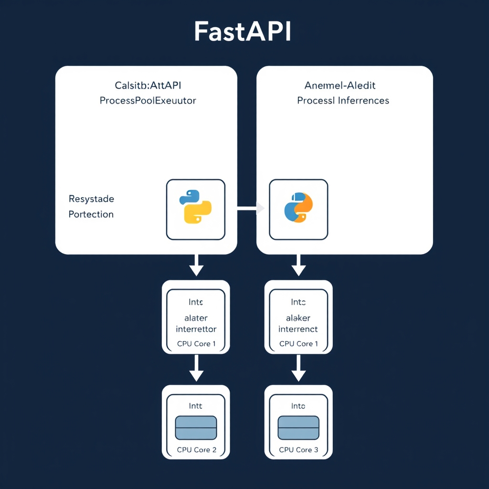
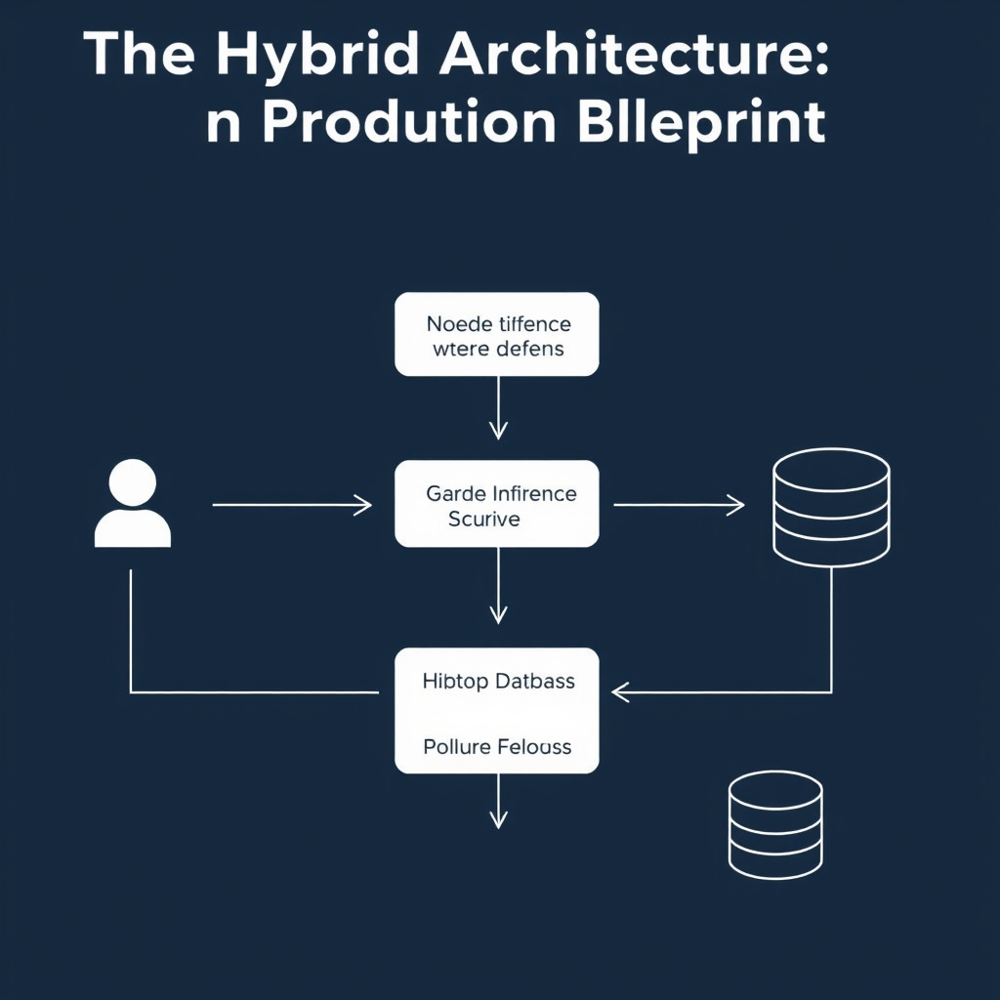

# FastAPI vs. Node.js: The 2026 Guide to AI Backend Architecture

## The Evolution of the AI Backend

The AI backend of 2026 looks nothing like the CRUD‑only services that dominated the early 2010s. Modern products now stitch together data ingestion, vector search, LLM prompting, and post‑processing pipelines that run for seconds or minutes per request. This **AI‑native pipeline** demands tight coupling to Python's ML stack (PyTorch, LangChain, CrewAI) while still serving millions of concurrent UI connections.

### From CRUD to AI‑Native Pipelines

- **CRUD era** – endpoints performed simple Create/Read/Update/Delete on relational tables, with latency measured in milliseconds and scaling handled by adding more identical instances.
- **AI era** – a single request may trigger tokenization, embedding generation, vector similarity search, LLM inference, and result aggregation. Each stage introduces CPU‑ or GPU‑bound work that cannot be reduced to a single database transaction.

### Why the "one‑size‑fits‑all" backend is collapsing

In 2026 the monolithic approach that tries to serve both high‑throughput I/O and heavy ML workloads from a single runtime is proving brittle. Benchmarks show Node.js delivering ~35K req/s on raw HTTP I/O versus Python’s ~22K req/s – a 1.6× advantage for I/O‑heavy services【https://www.groovyweb.co/blog/nodejs-vs-python-backend-comparison-2026】. Conversely, Python’s proximity to ML libraries eliminates costly cross‑language serialization when inference happens inside the API layer【https://emporionsoft.com/nestjs-vs-fastapi-2026】. Trying to force a single stack to excel at both ends leads to either under‑utilized CPU/GPU resources or throttled request rates.

### Enter the polyglot AI backend

The industry response is a **polyglot architecture**: a lightweight Node.js gateway handles authentication, rate‑limiting, and WebSocket streaming, while a FastAPI service runs the heavy‑weight inference and orchestration logic. Production AI products north of $5 M ARR routinely adopt this split, pairing a Python inference layer with a Node.js BFF for real‑time UI updates【https://www.marsdevs.com/compare/fastapi-vs-nodejs-for-ai-backends】.

### Your goal in this article

By the end of the guide you will be equipped to **design for scale and maintainability** – choosing the right runtime for each piece of the pipeline, avoiding the pitfalls of a single‑language monolith, and laying the groundwork for a hybrid system that can grow with your AI workload.

## FastAPI: The AI-Native Powerhouse

FastAPI has become the de‑facto entry point for AI‑heavy services because it lives in the same runtime as the dominant Python ML ecosystem. This proximity translates into tighter integration, lower latency, and a smoother developer experience.


*FastAPI's multiprocessing architecture allows CPU-bound AI tasks to run in parallel, bypassing the Python GIL.*

### Synergy with the Python ML stack

- **PyTorch** – FastAPI can import a TorchScript or eager‑mode model directly in the request handler. Because the model resides in the same process, tensor objects are passed without any language boundary, eliminating the costly JSON‑or‑protobuf marshaling that would be required in a polyglot setup.
- **LangChain** – Prompt‑engineering pipelines built with LangChain are pure Python. FastAPI endpoints can instantiate `ChatPromptTemplate` objects on‑the‑fly, chain them with LLM wrappers, and return structured results—all within a single call stack.
- **CrewAI** – Multi‑agent orchestration frameworks such as CrewAI rely on Python async generators and shared state. Embedding them behind FastAPI means agents can exchange Python objects (e.g., `Document`, `ToolResult`) without serialisation, which speeds up iterative reasoning loops.

A typical inference flow therefore looks like:

```python
from fastapi import FastAPI, HTTPException
from pydantic import BaseModel, Field
from concurrent.futures import ProcessPoolExecutor
import torch
from langchain.prompts import ChatPromptTemplate
from crewai import Agent, Task, Crew

app = FastAPI()
executor = ProcessPoolExecutor(max_workers=4)  # one process per CPU core

# Load model once at startup – shared across workers via fork
model = torch.load('gpt2-finetuned.pt')
model.eval()

class InferenceRequest(BaseModel):
    prompt: str = Field(..., description="User query or system prompt")
    temperature: float = Field(0.7, ge=0.0, le=1.0)

class InferenceResponse(BaseModel):
    answer: str
    tokens_used: int

def run_inference(data: InferenceRequest) -> InferenceResponse:
    # LangChain builds the final prompt
    template = ChatPromptTemplate.from_template("{prompt}")
    full_prompt = template.format(prompt=data.prompt)
    # Simple torch inference (placeholder)
    with torch.no_grad():
        logits = model(torch.tensor([full_prompt]))
    answer = logits.argmax(dim=-1).item()
    return InferenceResponse(answer=str(answer), tokens_used=logits.shape[-1])

@app.post("/infer", response_model=InferenceResponse)
async def infer(request: InferenceRequest):
    try:
        # Offload CPU‑bound work to a separate process
        result = await app.state.loop.run_in_executor(
            executor, run_inference, request
        )
        return result
    except Exception as e:
        raise HTTPException(status_code=500, detail=str(e))
```

The snippet demonstrates three of the required concepts:

1. **Pydantic models** (`InferenceRequest` / `InferenceResponse`) enforce strict schemas for LLM inputs and outputs, catching malformed payloads before they reach the model.
1. **Multiprocessing** via `ProcessPoolExecutor` sidesteps Python’s Global Interpreter Lock, allowing true parallel CPU‑bound inference on multi‑core servers—something Node.js cannot achieve with its single‑threaded event loop.
1. **Proximity to ML libraries** means the model, LangChain prompt builder, and CrewAI agents all operate on native Python objects, avoiding the serialization overhead described in the NestJS vs FastAPI benchmark[^1].

### Multiprocessing advantage

Python’s `multiprocessing` module spawns separate OS processes, each with its own interpreter and memory space. For CPU‑intensive tasks such as transformer inference or vector‑search post‑processing, this yields near‑linear scaling up to the number of physical cores. In contrast, Node.js relies on a thread‑pool for CPU work, which is limited and incurs additional context‑switch costs. The LinkedIn analysis of FastAPI vs Node.js notes that “FastAPI supports true parallel processing using Python’s multiprocessing module,” making it ideal for workloads that saturate the CPU rather than the network[^2].

### Pydantic for data integrity

FastAPI’s tight coupling with Pydantic provides automatic validation, type coercion, and OpenAPI schema generation. When dealing with LLMs, ensuring that prompts, temperature settings, and token limits conform to expected ranges prevents costly runtime errors. Moreover, the generated OpenAPI spec serves as a contract for downstream services—whether they are written in JavaScript, Go, or Rust.

### Reduced serialization overhead

When inference is performed in a language‑agnostic gateway (e.g., a Node.js BFF), the payload must be serialized to JSON, sent over HTTP, deserialized in Python, processed, then serialized back. Each hop adds latency and CPU work. By keeping the API layer in Python, FastAPI eliminates these hops. The NestJS vs FastAPI benchmark explicitly calls out this benefit, stating that “Python’s proximity to ML tooling may reduce cross‑language communication overhead” for CPU‑heavy post‑processing[^3].

In practice, production AI platforms—especially those surpassing $5 M ARR—adopt a hybrid pattern where FastAPI handles the heavy lifting of model inference while a lightweight Node.js gateway manages real‑time streaming and authentication[^4]. This section establishes why FastAPI is the natural choice for the inference tier of that architecture.

## Node.js: The High-Concurrency Gateway

### I/O Throughput: The Raw Speed Advantage

Node.js consistently outpaces FastAPI on pure request‑/response workloads. Recent 2026 benchmarks report **≈35 K req/s** for a minimal Node.js service versus **≈22 K req/s** for an equivalent FastAPI endpoint – roughly a **1.6×** advantage in raw I/O throughput【https://www.groovyweb.co/blog/nodejs-vs-python-backend-comparison-2026】. The edge stems from V8’s just‑in‑time compilation and the non‑blocking event loop, which keep the thread busy handling sockets instead of waiting on the interpreter. For AI‑driven products that must serve thousands of concurrent UI calls (e.g., token‑by‑token chat updates), this throughput translates directly into lower latency and reduced cloud cost.

### Real‑Time Streaming for LLM Responses

Large language models often emit partial results as they generate text. Delivering these tokens to a browser in real time is best handled by **WebSockets** or **Server‑Sent Events (SSE)**—both native to Node.js. The same GroovyWeb study notes that Node.js achieves higher WebSocket concurrency and faster cold‑start times on serverless platforms, making it ideal for streaming LLM output without the overhead of spawning a new Python process for each connection.

#### Example: SSE Streaming from a FastAPI Inference Service

```js
// server.js – Node.js gateway that streams LLM tokens via SSE
import express from 'express';
import fetch from 'node-fetch';
const app = express();

app.get('/chat', async (req, res) => {
  // Forward the prompt to the FastAPI inference endpoint
  const apiResp = await fetch('https://fastapi-inference.local/generate', {
    method: 'POST',
    headers: { 'Content-Type': 'application/json' },
    body: JSON.stringify({ prompt: req.query.q })
  });

  // Set SSE headers
  res.writeHead(200, {
    'Content-Type': 'text/event-stream',
    'Cache-Control': 'no-cache',
    Connection: 'keep-alive'
  });

  // Pipe token chunks directly to the client
  const reader = apiResp.body.getReader();
  const decoder = new TextDecoder();
  async function pump() {
    const { done, value } = await reader.read();
    if (done) { res.write('event: end\n\n'); return res.end(); }
    const token = decoder.decode(value);
    res.write(`data: ${token}\n\n`);
    pump();
  }
  pump();
});

app.listen(3000, () => console.log('Node gateway listening on :3000'));
```

The gateway remains single‑threaded while the heavy inference stays in FastAPI, yet the user sees a fluid token stream.

### Shared JavaScript/TypeScript Ecosystem

When the front‑end is built with React, Vue, or Svelte, the same language can be used across the stack. This **polyglot reduction** eliminates context‑switching for developers, enables shared type definitions, and allows UI components to import server‑side validation schemas directly. Teams report faster feature cycles because a single source of truth for data contracts lives in a TypeScript `*.d.ts` file that both the Node.js BFF and the browser consume【https://www.groovyweb.co/blog/nodejs-vs-python-backend-comparison-2026】.

### API Gateways & BFF (Backend‑for‑Frontend) Patterns

Node.js shines as an **API gateway** or **BFF** for several reasons:

- **Lightweight request routing** – Express, Fastify, or NestJS can inspect, transform, and forward traffic with microsecond overhead.
- **Middleware ecosystem** – Authentication, rate‑limiting, and logging libraries are battle‑tested and plug‑and‑play.
- **Concurrent connection handling** – The event loop can maintain tens of thousands of open WebSocket connections, a scenario where a Python process would need additional workers or async frameworks to match.
- **Edge deployment** – Platforms like Vercel or Cloudflare Workers run JavaScript at the edge, bringing the gateway closer to the user and shaving milliseconds off round‑trip time.

Collectively, these attributes make Node.js the **high‑concurrency gateway** that fronts AI services, orchestrates real‑time streams, and keeps full‑stack teams productive.

## The Hybrid Architecture: A Production Blueprint


*The hybrid AI backend: Node.js handles high-concurrency I/O while FastAPI manages ML-heavy inference.*

### Overview of the Hybrid Blueprint

A production‑grade AI backend that maximizes both **throughput** and **ML‑centric performance** typically follows a three‑tier flow:

```
Node.js API Gateway  →  FastAPI Inference Service  →  Vector Database
```

- The **Node.js gateway** handles HTTP/WebSocket connections, request routing, and client‑side authentication. Its event‑driven model delivers the ~1.6× raw I/O advantage reported in recent benchmarks (≈35K req/s vs. 22K req/s for Python)【https://www.groovyweb.co/blog/nodejs-vs-python-backend-comparison-2026】.
- The **FastAPI layer** lives next to the Python ML stack (PyTorch, LangChain, CrewAI). Proximity to these libraries eliminates costly serialization steps and enables true multiprocessing for CPU‑bound inference【https://www.linkedin.com/pulse/nodejs-vs-python-fastapi-choosing-right-technology-your-hussain-typsf】.
- The **Vector DB** (e.g., Pinecone, Milvus) stores embeddings and is accessed directly by FastAPI, keeping the latency‑critical retrieval path inside the Python runtime.

______________________________________________________________________

### Visual Diagram (Mermaid)

```mermaid
flowchart LR
    subgraph Client
        C[Web / Mobile UI]
    end
    subgraph Gateway[Node.js API Gateway]
        G1[Auth & Rate‑limit]
        G2[WebSocket / SSE Stream]
    end
    subgraph Inference[FastAPI Service]
        F1[Request Validation (Pydantic)]
        F2[Model Load & Inference]
        F3[Vector DB Query]
    end
    subgraph DB[Vector Database]
        V[Embeddings Store]
    end
    C -->|HTTPS| G1 --> G2 -->|gRPC / HTTP| F1 --> F2 --> F3 --> V
    F3 -->|Results| F2 -->|JSON| G2 -->|Stream| C
```

______________________________________________________________________

### Trade‑offs of Managing Two Runtimes

| Aspect                    | FastAPI‑only                                                                                      | Node.js‑only                                                                               | Hybrid (FastAPI + Node.js)                                                                |
| ------------------------- | ------------------------------------------------------------------------------------------------- | ------------------------------------------------------------------------------------------ | ----------------------------------------------------------------------------------------- |
| **Deployment complexity** | Single container, simpler CI/CD                                                                   | Single container, simpler CI/CD                                                            | Two containers, orchestrated via Docker Compose/K8s; need health‑checks for both services |
| **Performance**           | Lower I/O throughput, higher ML latency due to cross‑language calls if UI logic lives in Python   | Excellent I/O, but ML inference must be called over network, adding serialization overhead |                                                                                           |
| **Team velocity**         | Python‑centric; data‑science teams can ship end‑to‑end                                            | Full‑stack JS/TS; UI and backend share codebases                                           |                                                                                           |
| **Scalability**           | Scale inference pods independently; gateway becomes bottleneck under heavy concurrent connections |                                                                                            |                                                                                           |
| **Observability**         | Unified logs if single stack; hybrid requires correlation IDs across services                     |                                                                                            |                                                                                           |

The hybrid approach incurs **deployment overhead** (additional Docker images, service discovery, and version coordination) but delivers **net performance gains**: the gateway can sustain high concurrent connections while the inference service runs on dedicated GPU/CPU nodes without being throttled by the event loop.

______________________________________________________________________

### Authentication & State Management Across Services

1. **Stateless JWT** – Issue a short‑lived JWT at the gateway after user login. Forward the token in the `Authorization: Bearer <jwt>` header to FastAPI. FastAPI validates the token using the same public key, eliminating session replication.
1. **Correlation ID** – Generate a `X-Request-ID` at the gateway and propagate it downstream. Include the ID in logs and tracing spans (OpenTelemetry) to stitch together a request’s journey across runtimes.
1. **Refresh Flow** – The gateway handles token refresh; FastAPI only needs to reject expired tokens, prompting the client to re‑authenticate via the gateway.

#### Code Snippet: JWT Propagation (Node.js → FastAPI)

```js
// gateway/auth-middleware.js (Node.js Express)
import jwt from 'jsonwebtoken';

export function forwardAuth(req, res, next) {
  const token = req.headers['authorization'];
  if (!token) return res.sendStatus(401);
  // Attach token to downstream request
  req.fastapiHeaders = { Authorization: token };
  next();
}
```

```python
# inference/main.py (FastAPI)
from fastapi import FastAPI, Request, HTTPException
from fastapi.security import HTTPBearer
from jose import JWTError, jwt

app = FastAPI()
security = HTTPBearer()

@app.middleware("http")
async def verify_jwt(request: Request, call_next):
    token = request.headers.get("Authorization")
    if not token:
        raise HTTPException(status_code=401, detail="Missing token")
    try:
        payload = jwt.decode(token.split()[1], "YOUR_PUBLIC_KEY", algorithms=["RS256"])
        request.state.user = payload
    except JWTError:
        raise HTTPException(status_code=401, detail="Invalid token")
    response = await call_next(request)
    return response
```

______________________________________________________________________

### Mitigating Cross‑Language Communication Overhead

- **Binary protocols** – Use **gRPC** with protobuf definitions for the gateway‑to‑inference contract. gRPC’s compact payload reduces the ~30 % overhead observed when serializing large LLM payloads over plain JSON.
- **Batching** – Aggregate multiple client requests into a single inference batch at the gateway before forwarding to FastAPI. This leverages GPU batch processing and amortizes network latency.
- **Async Queues** – For non‑real‑time workloads, push requests onto a **Redis Streams** or **Kafka** topic. FastAPI workers consume the queue, decoupling request latency from inference throughput.
- **Shared Docker Network** – Deploy both services in the same Docker network (or K8s pod) to keep the round‑trip latency sub‑millisecond, as demonstrated in production AI products that report hybrid stacks above $5 M ARR【https://www.marsdevs.com/compare/fastapi-vs-nodejs-for-ai-backends】.

______________________________________________________________________

### Minimal Docker‑Compose Blueprint

```yaml
version: "3.9"
services:
  gateway:
    image: node:20-alpine
    working_dir: /app
    volumes:
      - ./gateway:/app
    command: npm start
    ports:
      - "8080:8080"
    depends_on:
      - inference
    networks:
      - ai-net

  inference:
    image: tiangolo/uvicorn-gunicorn-fastapi:python3.11
    working_dir: /app
    volumes:
      - ./inference:/app
    environment:
      - WORKERS=4   # leverage multiprocessing
    ports:
      - "8000:80"
    networks:
      - ai-net

  vectordb:
    image: milvusdb/milvus:2.3.0
    ports:
      - "19530:19530"
    networks:
      - ai-net

networks:
  ai-net:
    driver: bridge
```

The compose file illustrates **runtime isolation** (Node.js vs. Python) while keeping inter‑service latency low via a shared bridge network. Scaling policies can be applied per service—e.g., `docker compose up --scale inference=4` for GPU‑enabled inference pods.

______________________________________________________________________

### Bottom Line

By delegating **high‑concurrency I/O** to a Node.js gateway and **ML‑heavy inference** to a FastAPI service, teams capture the best of both worlds. The added operational surface—dual runtimes, token propagation, and protocol selection—pays off in measurable latency reductions and higher request throughput, aligning with the modern polyglot AI backend strategy.

## Conclusion: Choosing Your Path

### Decision matrix at a glance

| Scenario                                                                                          | Recommended stack                                        | Why                                                                                                                                               |
| ------------------------------------------------------------------------------------------------- | -------------------------------------------------------- | ------------------------------------------------------------------------------------------------------------------------------------------------- |
| **Pure AI/ML pipelines** (batch inference, model training, LangChain/CrewAI orchestration)        | FastAPI only                                             | Direct access to PyTorch/TensorFlow, multiprocessing for CPU‑bound workloads, minimal serialization overhead.                                     |
| **Real‑time, high‑concurrency front‑ends** (WebSocket chat, streaming LLM responses, BFF for SPA) | Node.js only                                             | Event‑driven I/O delivers ~1.6× higher request throughput; shared JavaScript/TypeScript codebase reduces friction between front‑end and back‑end. |
| **Production‑grade AI products** (mixed inference and interactive UI)                             | Hybrid (Node.js gateway → FastAPI inference → Vector DB) | Leverages FastAPI’s ML ecosystem while exploiting Node.js’s I/O speed and full‑stack cohesion.                                                    |


*Decision matrix for selecting your AI backend architecture based on workload characteristics.*

### The workload‑driven rule of thumb

The "best" choice is never a blanket recommendation; it follows the dominant characteristics of your workload. If the majority of CPU cycles are spent inside ML libraries, keep the inference service in Python. If latency is dominated by network chatter, user‑generated events, or streaming payloads, let Node.js handle the outer layer. When both concerns are substantial, a hybrid boundary isolates concerns and prevents either framework from becoming a bottleneck.

### Scaling advice as your product matures

1. **Start simple** – prototype with a single framework that matches your immediate priority (FastAPI for research‑centric models, Node.js for MVP UI).
1. **Introduce the gateway early** – even a thin Node.js proxy prepares the path to a hybrid split without a major rewrite.
1. **Automate deployment** – use container orchestration (e.g., Kubernetes) to manage two runtimes; treat them as independent services with versioned APIs.
1. **Monitor cross‑service latency** – instrument the HTTP/gRPC bridge; if overhead exceeds 5‑10 ms, consider colocating services or using shared memory techniques.
1. **Iterate on the split** – as traffic patterns evolve, shift more endpoints to the layer that offers the greatest cost‑performance advantage.

By aligning architecture with the concrete demands of your AI workload and following a staged scaling plan, you can keep development velocity high while delivering the performance needed for production‑grade AI applications.

[^1]: https://emporionsoft.com/nestjs-vs-fastapi-2026
[^2]: https://www.linkedin.com/pulse/nodejs-vs-python-fastapi-choosing-right-technology-your-hussain-typsf
[^3]: https://emporionsoft.com/nestjs-vs-fastapi-2026
[^4]: https://www.marsdevs.com/compare/fastapi-vs-nodejs-for-ai-backends