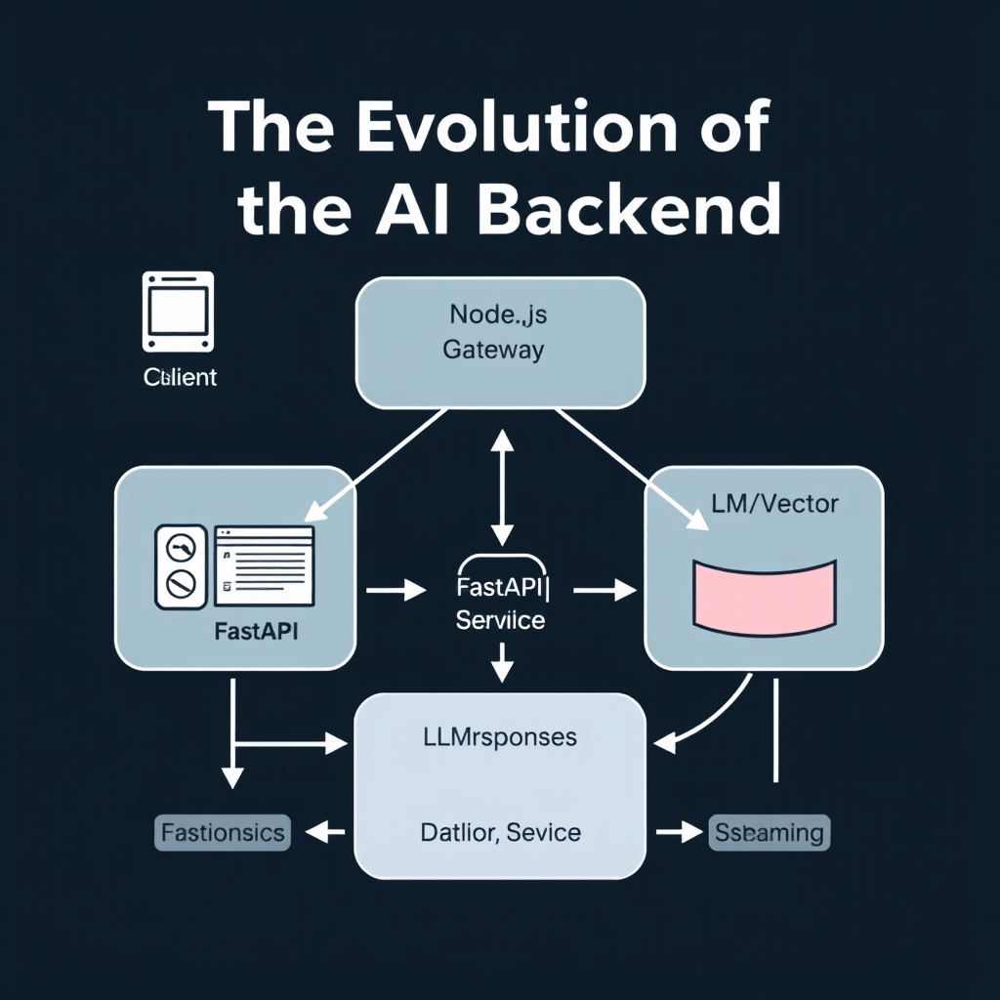
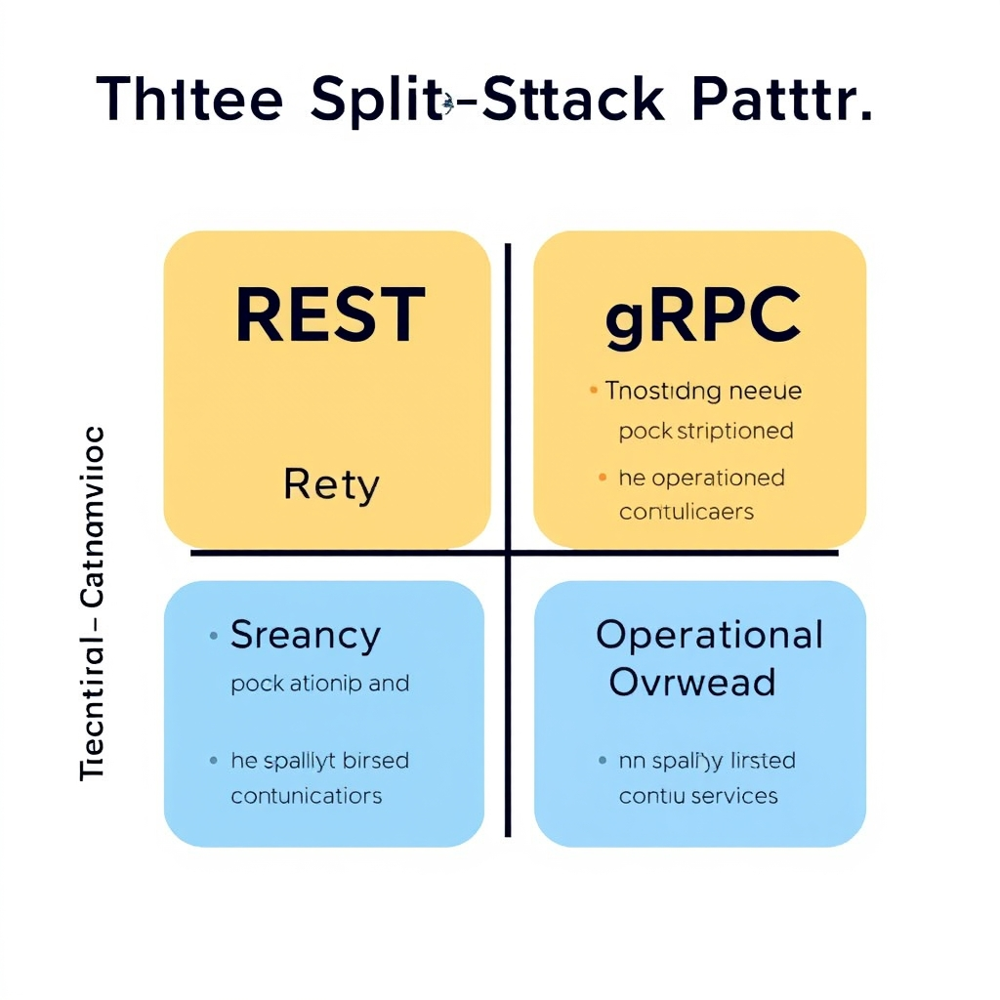
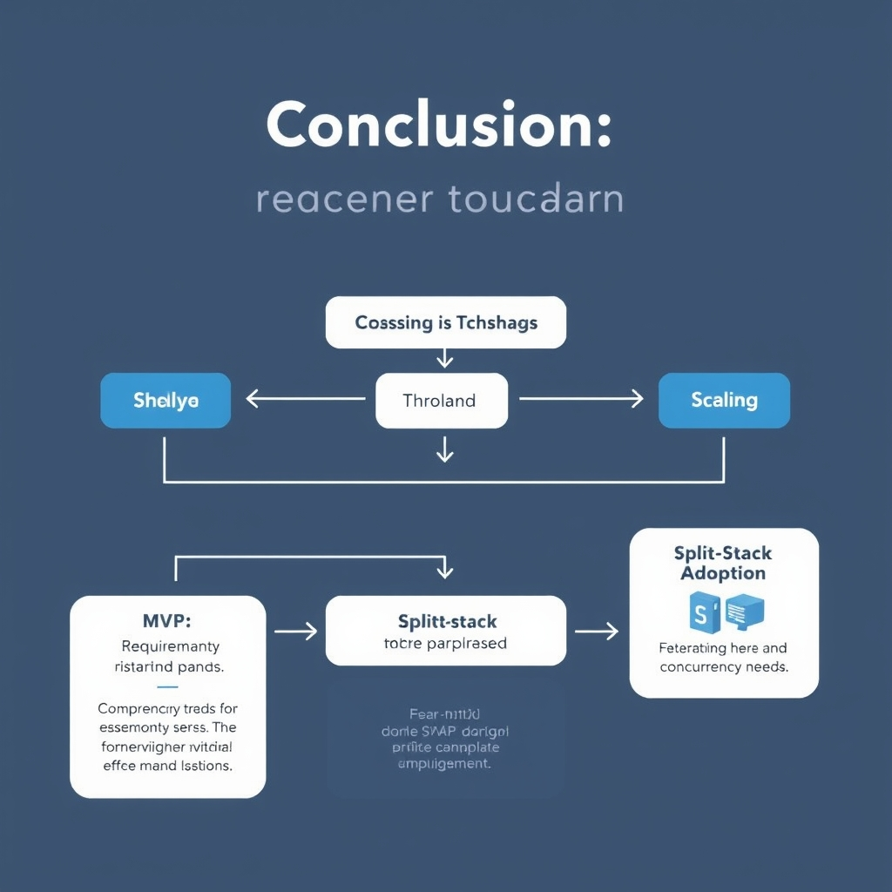

# FastAPI vs. Node.js: Why Modern AI Apps Use Both

## The Evolution of the AI Backend

The AI backend landscape of 2026 has moved beyond the early‑days monolith where a single service handled request routing, model inference, and client streaming. Modern products now decompose these responsibilities into **specialized services** that can evolve independently. This shift is driven by two converging trends:


*The split-stack architecture: Node.js manages high-concurrency streaming while FastAPI handles complex AI logic and model inference.*

- **Scale‑driven specialization** – As AI workloads grow past the $5 M ARR threshold, the latency and throughput demands of real‑time inference diverge from those of high‑concurrency UI streaming. Keeping both concerns in one codebase creates bottlenecks and forces compromises in language choice and deployment strategy.
- **Maturing ecosystem tooling** – Python’s ML libraries (e.g., LangChain, Pydantic‑AI) dominate model development, while JavaScript/Node.js excels at event‑driven I/O and WebSocket‑based streams.

### Intelligence Layer vs. Streaming Gateway

The emerging **split‑stack architecture** separates the backend into two logical layers:

1. **Intelligence Layer** – A Python FastAPI service that hosts the model, handles prompt orchestration, and exposes a REST/gRPC API for inference. It leverages the rich Python ecosystem for data preprocessing, vector stores, and agent orchestration.
1. **Streaming Gateway** – A Node.js Backend‑for‑Frontend (BFF) that manages thousands of concurrent connections, streams token‑by‑token responses to the UI, and performs lightweight request shaping.

### Why the Binary "FastAPI vs. Node.js" Debate Is Outdated

Historically, teams chose one framework for the entire stack, leading to trade‑offs: Python offered model fidelity but struggled with high‑volume WebSocket traffic; Node.js delivered I/O performance but lacked native ML tooling. Recent industry observations show that the split‑stack pattern—FastAPI for inference plus a Node.js streaming gateway—has become the de‑facto standard for production AI services beyond Series A scale[^1]. Rather than a zero‑sum choice, the two runtimes now complement each other.

### Setting the Stage for a Hybrid Approach

Adopting this hybrid model lets teams capitalize on Python’s ecosystem while offloading high‑throughput streaming to Node.js. The remainder of the guide will walk through the concrete benefits of each layer, performance considerations, and a step‑by‑step blueprint for wiring the two services together in a production‑grade AI backend.

\[^1\]: MarsDevs, *FastAPI vs Node.js for AI Backends in 2026*, https://www.marsdevs.com/compare/fastapi-vs-nodejs-for-ai-backends

## FastAPI: The Intelligence Layer

### Maturity of the Python AI ecosystem

Python’s AI tooling has coalesced around a handful of libraries that are now de‑facto standards for building Retrieval‑Augmented Generation (RAG) pipelines and autonomous agents. Projects such as **LangChain**, **LangGraph**, **CrewAI**, and **Pydantic AI** provide ready‑made abstractions for prompt management, tool integration, and output validation. According to a 2026 comparative analysis, these libraries are **6–12 months ahead** of their Node.js counterparts in terms of feature completeness and community adoption[^1]. The result is a lower barrier to prototype sophisticated RAG workflows: developers can stitch together vector stores, LLM calls, and custom tools with a few declarative statements, then drop the same code into a FastAPI service for production.

### FastAPI’s fit for RAG pipelines and agent orchestration

FastAPI inherits Pydantic’s data validation, which aligns naturally with the schema‑driven approach championed by the Python AI stack. When orchestrating agents, FastAPI can expose a single HTTP endpoint that accepts a JSON payload describing the task, validates it against a Pydantic model, and forwards the request to the appropriate LangChain component. Because the framework is built on **Starlette**, it handles background tasks and dependency injection with minimal boilerplate, allowing the same codebase to serve both synchronous REST calls and long‑running asynchronous agent loops.

### Native async support for model serving

FastAPI’s asynchronous capabilities are not an afterthought; they are baked into the request lifecycle. The framework can stream token‑by‑token responses using **Server‑Sent Events (SSE)**, which is essential for interactive LLM applications where latency perception matters[^2]. An example endpoint looks like this:

```python
from fastapi import FastAPI, Request
from fastapi.responses import StreamingResponse
import asyncio

app = FastAPI()

async def generate_tokens(prompt: str):
    for token in model.stream(prompt):  # hypothetical streaming API
        yield f"data: {token}\n\n"
        await asyncio.sleep(0)  # allow other coroutines to run

@app.post("/chat")
async def chat(request: Request):
    body = await request.json()
    prompt = body["prompt"]
    return StreamingResponse(generate_tokens(prompt), media_type="text/event-stream")
```

This pattern leverages FastAPI’s **async/await** syntax to keep the event loop free while the model emits tokens, enabling thousands of concurrent streams on modest hardware.

### Why the Python lead is hard to replicate in Node.js

Node.js excels at I/O throughput, but its AI ecosystem lacks the depth and cohesion of Python’s. While JavaScript bindings exist for popular models (e.g., `@tensorflow/tfjs`), they rarely cover the full suite of utilities required for RAG—vector stores, prompt templating, and tool‑calling frameworks are fragmented or immature. Moreover, the rapid evolution of libraries like LangChain means new features (e.g., memory‑aware agents) appear first in Python, forcing Node.js developers to either wait for ports or implement custom adapters, which adds technical debt and slows time‑to‑market.

In practice, teams that adopt a **split‑stack architecture** keep the intelligence layer in FastAPI to capitalize on this ecosystem advantage, while delegating high‑concurrency, low‑latency responsibilities to a Node.js gateway. This separation preserves the strengths of each runtime without forcing a compromise on either AI capability or I/O performance.

## Node.js: The High-Concurrency Gateway

### Performance Benefits for High‑Volume Concurrent Requests

Node.js’s single‑threaded event loop and non‑blocking I/O give it a natural edge when an API must juggle thousands of simultaneous connections. Real‑world benchmarks show Node.js handling I/O‑bound workloads **40–70 % faster** than equivalent Python/FastAPI services[^1]. In practice, this translates to lower latency for chat‑style streaming endpoints, where each client maintains an open WebSocket or Server‑Sent Events (SSE) channel while the backend streams token‑by‑token responses from a language model.

Because the event loop never blocks on network or file‑system calls, a modestly sized Node.js instance can sustain tens of thousands of concurrent streams without spawning additional OS threads. This efficiency reduces both CPU pressure and memory footprint, allowing you to scale horizontally with fewer instances compared to a Python process that relies on thread pools or process workers for similar concurrency.

______________________________________________________________________

### Node.js as a Backend‑for‑Frontend (BFF) in AI Applications

In a split‑stack architecture, the Node.js layer acts as a **Backend‑for‑Frontend** (BFF), tailoring API contracts to the needs of web, mobile, or desktop clients. The BFF can:

- **Aggregate** responses from multiple FastAPI inference services (e.g., a retrieval‑augmented generation service and a classification model) into a single payload.
- **Enforce** rate‑limiting and request shaping before hitting the expensive Python inference tier, protecting costly GPU resources.
- **Translate** protocol differences, exposing GraphQL or REST endpoints that align with front‑end expectations while the underlying FastAPI services remain pure HTTP/JSON.

By keeping this orchestration logic in Node.js, teams benefit from the rich ecosystem of middleware (Express, Fastify, or NestJS) and TypeScript’s static typing, which improves developer velocity for UI‑centric features such as optimistic UI updates or progressive loading.

______________________________________________________________________

### Synergy with Modern Streaming UI SDKs

Front‑end frameworks increasingly rely on streaming APIs to deliver real‑time AI experiences—think token‑by‑token generation in chat assistants or live transcription. Node.js integrates seamlessly with streaming SDKs like **Socket.io**, **uWebSockets.js**, and the native **Web Streams API**. A typical flow looks like:

1. Client opens a WebSocket connection to the Node.js gateway.
1. Gateway forwards the request to FastAPI via a lightweight HTTP call.
1. As FastAPI streams model tokens, the gateway pipes each chunk directly to the client without buffering the entire response.

Because Node.js can forward data as soon as it arrives, latency is minimized, and the UI can render partial results instantly. This pattern would be cumbersome in a synchronous Python server, which would need additional async wrappers or external proxies to achieve comparable responsiveness.

______________________________________________________________________

### Event‑Driven Architecture vs. Python Threading

Python’s concurrency model for I/O typically relies on **asyncio** or multi‑process workers. While asyncio provides non‑blocking capabilities, the Global Interpreter Lock (GIL) still limits true parallelism for CPU‑bound work, and managing a large pool of worker processes adds operational complexity.

Node.js, by contrast, embraces an **event‑driven** paradigm: a single thread handles all I/O events, delegating heavy CPU work to the **worker_threads** module or external services (e.g., the FastAPI inference layer). This separation means the gateway remains lightweight and predictable under load, with back‑pressure naturally propagated through the event loop.

In summary, Node.js excels as the high‑throughput, low‑latency gateway that feeds AI‑rich front‑ends, while FastAPI focuses on the heavy lifting of model inference. Leveraging the strengths of each runtime results in a balanced, scalable AI backend.

## Implementing the Split-Stack Pattern

### Diagramming the Split‑Stack Flow

```
Client (Web/Mobile)
   │
   ▼
Node.js Gateway (BFF)
   │   ├─ Handles WebSocket / SSE streams
   │   ├─ Auth & rate‑limit enforcement
   │   ▼
FastAPI Inference Service
   │   ├─ Loads PyTorch / TensorFlow models
   │   └─ Exposes `/predict` (REST) or `Predict` (gRPC)
   ▼
Model Output → Node.js streams back to client
```


*Choosing the right protocol: REST offers simplicity, while gRPC provides superior performance for streaming AI tokens.*

The diagram above captures the production‑grade pattern described by MarsDevs: “a Python FastAPI inference layer plus a Node BFF for streaming”[^1]. The gateway is responsible for high‑concurrency I/O, while FastAPI focuses on the heavy‑weight ML workload.

______________________________________________________________________

### Managing Authentication & State Across Services

1. **Token‑forwarding** – Issue a JWT at the edge (e.g., an API gateway or Auth0). The Node.js BFF validates the token, extracts the user ID, and forwards the same JWT in the `Authorization` header when calling FastAPI. FastAPI validates the token using the same public key, ensuring a single source of truth.
1. **Session store** – For stateful interactions (e.g., multi‑turn chat), store session data in a fast key‑value store such as Redis. Both Node.js and FastAPI read/write the same session key, keeping the conversation context consistent without coupling the services.
1. **Correlation IDs** – Generate a UUID per request in Node.js and pass it as `X‑Request‑Id` to FastAPI. Logging both sides with this ID simplifies tracing in distributed tracing tools (Jaeger, OpenTelemetry).

______________________________________________________________________

### Choosing the Inter‑Service Communication Protocol

| Aspect                   | REST (JSON over HTTP)                                                | gRPC (HTTP/2 + protobuf)                                             |
| ------------------------ | -------------------------------------------------------------------- | -------------------------------------------------------------------- |
| **Latency**              | Slightly higher due to text encoding and header overhead.            | Lower latency; binary payload and multiplexed streams.               |
| **Tooling**              | Universally supported; easy to test with `curl` or Postman.          | Requires protobuf compiler; strong typing but steeper onboarding.    |
| **Streaming**            | Limited to chunked responses; not ideal for real‑time token streams. | Native server‑side streaming; perfect for token‑by‑token generation. |
| **Versioning**           | Manual contract management; can break with schema changes.           | Built‑in backward compatibility via protobuf field numbers.          |
| **Operational overhead** | Simple deployment behind existing HTTP load balancers.               | Needs HTTP/2‑aware load balancer (e.g., Envoy).                      |

For most AI back‑ends, **REST** is sufficient for occasional inference calls, while **gRPC** shines when the FastAPI service streams model tokens directly to Node.js (e.g., LLM generation). A hybrid approach—REST for control endpoints and gRPC for streaming payloads—leverages the strengths of both.

______________________________________________________________________

### Proxying a Request from Node.js to FastAPI (REST Example)

Below is a minimal Express‑style proxy that forwards a client request to a FastAPI `/predict` endpoint, propagates the JWT, and streams the JSON response back to the client.

```javascript
// gateway.js – Node.js BFF (requires Node 18+ for native fetch)
import express from 'express';
import { createReadStream } from 'node:stream';

const app = express();
const FASTAPI_URL = 'https://fastapi.example.com/predict';

app.use(express.json());

app.post('/api/generate', async (req, res) => {
  // 1️⃣ Extract client JWT
  const authHeader = req.headers['authorization'];
  if (!authHeader) return res.status(401).json({ error: 'Missing token' });

  // 2️⃣ Forward request to FastAPI
  const fastapiResp = await fetch(FASTAPI_URL, {
    method: 'POST',
    headers: {
      'Content-Type': 'application/json',
      'Authorization': authHeader, // token‑forwarding
    },
    body: JSON.stringify(req.body),
  });

  // 3️⃣ Stream FastAPI response back to the client
  if (!fastapiResp.ok) {
    const err = await fastapiResp.json();
    return res.status(fastapiResp.status).json(err);
  }

  // Preserve content‑type (e.g., application/json or text/event-stream)
  res.setHeader('Content-Type', fastapiResp.headers.get('content-type'));
  // Pipe the response body directly – low latency, back‑pressure aware
  fastapiResp.body.pipe(res);
});

app.listen(3000, () => console.log('Node gateway listening on :3000'));
```

**Key points**:

- The gateway validates the JWT before forwarding, preserving security.
- `fetch` streams the FastAPI response body, allowing token‑by‑token delivery without buffering the entire payload.
- The same pattern works for gRPC by swapping `fetch` for a gRPC client stub.

______________________________________________________________________

### Putting It All Together

1. **Deploy** FastAPI behind a container orchestration platform (K8s) with GPU nodes for model inference.
1. **Expose** the FastAPI service on an internal network (ClusterIP) and register it with a service mesh (e.g., Istio) to enable optional gRPC.
1. **Run** the Node.js gateway as a separate deployment, scaling horizontally to handle thousands of concurrent WebSocket connections.
1. **Configure** a shared Redis instance for session state and a centralized logging/tracing pipeline to correlate `X‑Request‑Id` across services.

By following this blueprint, teams can retain Python’s unrivaled ML ecosystem while exploiting Node.js’s event‑driven I/O, achieving the scalability demanded by post‑Series‑A AI products.

______________________________________________________________________

\[^1\]: MarsDevs, *FastAPI vs Node.js for AI Backends in 2026*, https://www.marsdevs.com/compare/fastapi-vs-nodejs-for-ai-backends

## Conclusion: Choosing Your Path

The split‑stack pattern—FastAPI for the intelligence layer and Node.js for the streaming gateway— shines when a system must scale beyond prototype traffic. For an MVP, a single‑language stack reduces operational overhead; you can prototype the entire pipeline in FastAPI and add a Node.js façade only once concurrent connections, real‑time streaming, or multi‑tenant UI demands outgrow the Python process limits.


*Decision path: When to evolve from a monolithic FastAPI backend to a hybrid split-stack architecture.*

**Checklist: When to adopt one stack vs. both**

- **Start with FastAPI only** if you are:
  - Validating model performance or RAG logic.
  - Working with a small user base (\< 1k concurrent users).
  - Prioritizing rapid iteration over raw I/O throughput.
- **Introduce Node.js gateway** when you observe:
  - Sustained high‑concurrency (> 10k simultaneous websockets or SSE streams).
  - Need for a BFF that aggregates multiple AI services.
  - Requirements for low‑latency event‑driven UI updates.
- **Maintain both** for production‑grade services that must:
  - Serve thousands of parallel inference calls while streaming results.
  - Separate concerns for security, rate‑limiting, and versioned model APIs.

Looking ahead, AI back‑ends will increasingly adopt polyglot architectures that let each language play to its strengths. As model serving becomes more commoditized (e.g., via cloud‑native inference APIs), the role of FastAPI may shift toward orchestration, while Node.js continues to dominate the real‑time, high‑throughput edge. Embracing a split‑stack now positions teams to evolve with these trends without a costly rewrite.

[^1]: https://www.groovyweb.co/blog/nodejs-vs-python-backend-comparison-2026
[^2]: https://www.nerdheadz.com/technologies/fastapi-development-services