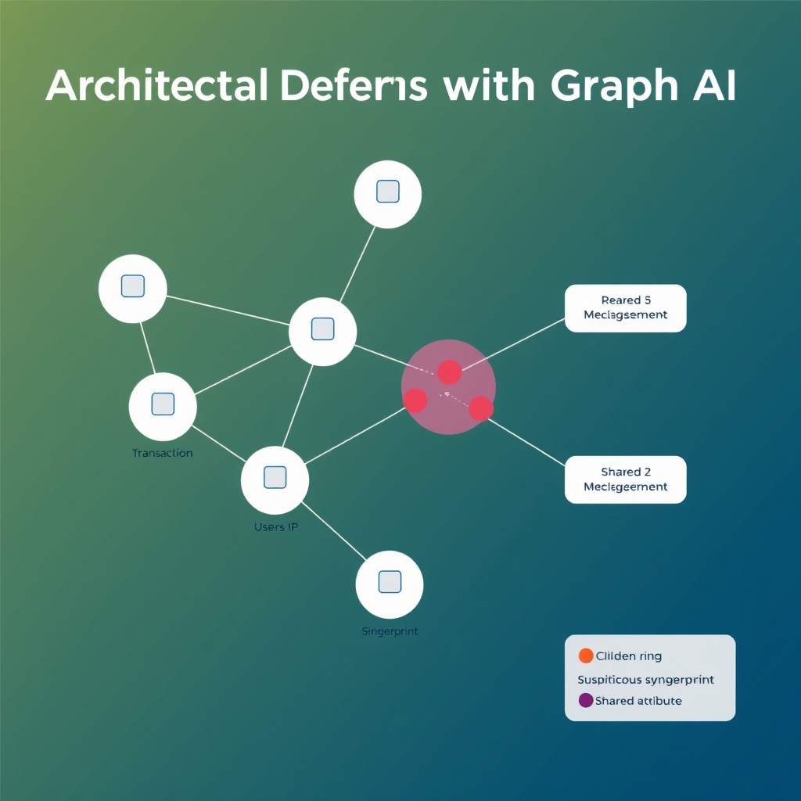
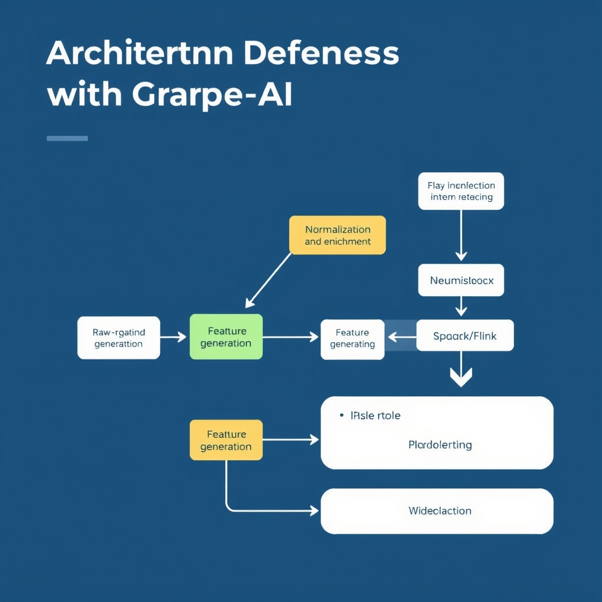

# Fortifying Finance: Combating AI-Driven Fraud in 2026

## The 2026 Threat Landscape

### Synthetic Identity Fraud’s Toll on U.S. Credit

The latest industry study projects that losses from synthetic identities on unsecured credit cards will surpass **$3.1 billion in 2026**, more than a 70% jump from 2020 levels. These fabricated personas blend real‑world data—such as a legitimate Social Security number—with fabricated employment and income details, allowing fraudsters to open credit lines that appear authentic to automated underwriting systems. The sheer volume of bogus accounts inflates credit risk models, forces lenders to tighten approval criteria, and drives up interest rates for legitimate borrowers.

[CFODive analysis](https://www.cfodive.com/news/synthetic-identity-fraud-surges-criminals-weaponize-ai/822557)

______________________________________________________________________

### Deepfake‑Enabled Identity Attacks Explode

Deepfake technology is no longer a niche concern. According to the Identity Fraud Index, **deepfake‑based identity fraud is expected to rise 495% in 2026 compared with 2025**. Attackers now generate hyper‑realistic video or audio clips to impersonate account holders during phone or video verification, bypassing static biometric checks. The rapid scalability of AI‑generated media means a single deepfake model can be repurposed across thousands of fraud attempts in a single day.

[ASIS Online report](https://www.asisonline.org/security-management-magazine/latest-news/today-in-security/2026/june/deepfake-identity-fraud)

______________________________________________________________________

### Large Language Models Lower the Barrier for Social Engineering

The democratization of powerful large language models (LLMs) has turned sophisticated phishing into a commodity. With a few prompts, threat actors can produce personalized email drafts, chat scripts, or voice‑assistant dialogues that mimic a target’s tone and context. Because LLMs can ingest publicly available data—social media posts, corporate filings, or previous correspondence—they generate convincing narratives at scale, reducing the need for skilled social engineers. This automation fuels mass‑targeted campaigns that blend credential harvesting with deepfake verification, creating a feedback loop that amplifies fraud success rates.

______________________________________________________________________

### Why Rule‑Based Filters Are Falling Behind

Traditional fraud defenses rely on static rule sets: blacklists of known bad IPs, velocity thresholds, or keyword matches. These approaches assume fraud patterns are predictable and that attackers will reuse known tactics. AI‑enabled fraud, however, mutates in real time:

- **Dynamic content**: LLM‑crafted messages vary wording and structure, evading keyword filters.
- **Adaptive timing**: Deepfake attacks can be triggered on demand, bypassing velocity limits.
- **Synthetic data**: Fake identities are built from legitimate data points, rendering blacklist checks ineffective.
  Consequently, rule‑based systems generate high false‑negative rates, missing novel attack vectors while producing false positives that burden compliance teams. The industry is therefore shifting toward behavior‑centric, graph‑based analytics that can surface hidden relationships and evolving threat patterns.

*Traditional rule-based filters fail against the polymorphic, adaptive nature of modern AI-driven attacks.*

## Architecting Defenses with Graph AI

### From Entity‑Centric Rules to Network‑Centric Detection

Traditional fraud controls treat each customer, account, or device as an isolated data point. Rules such as "flag transactions over $10,000 from a new device" rely on static thresholds and cannot see how a single actor may appear across multiple entities. In contrast, a graph‑based approach maps every interaction—payments, logins, device fingerprints—into a relational structure. Anomalies are then identified not just by individual behavior but by the shape of the surrounding network, exposing coordinated schemes that would slip past rule‑based filters.

*Graph AI maps relational data to reveal latent connections, identifying fraudulent rings that entity-centric rules miss.*

### How Graph AI Uncovers Latent Connections

Graph AI constructs nodes for customers, accounts, devices, merchants, and transactions, then draws edges that represent relationships (e.g., shared IP address, common device ID, or money flow). Advanced embedding techniques project these connections into a high‑dimensional space where similarity scores reveal hidden links between seemingly unrelated accounts. This enables the detection of mule accounts, synthetic identities, and collusive fraud rings that share subtle attributes such as overlapping device signatures or synchronized transaction timing. The capability to surface these latent connections is documented in the industry analysis of banking AI trends [Top Five AI Trends](https://www.retailbankerinternational.com/comment/top-five-ai-trends-banking).

### Data Pipeline for High‑Velocity Transaction Logs

1. **Ingestion Layer** – Real‑time streams from payment switches, mobile apps, and ATM networks are captured via Kafka or Pulsar topics.
1. **Normalization & Enrichment** – Each event is parsed, enriched with customer‑KYC data, device metadata, and geolocation, then written to a durable store (e.g., Apache Hudi) that supports incremental updates.
1. **Graph Construction** – A streaming graph engine (such as Neo4j Fabric or TigerGraph) consumes the enriched events, creating or updating nodes and edges on the fly.
1. **Feature Generation** – Temporal graph features (e.g., betweenness centrality, motif counts) are computed in micro‑batches using Spark GraphFrames or Flink Gelly, producing scores that feed downstream risk models.
1. **Alerting & Feedback Loop** – Scores above a dynamic threshold trigger alerts in a SIEM; analyst decisions are fed back to retrain the embedding models, ensuring the system adapts to evolving attack patterns.

### Link Analysis: Illuminating Organized Crime Syndicates

Link analysis leverages the graph’s topology to trace the flow of funds and information across multiple entities. By visualizing sub‑graphs that exhibit high edge density or recurrent motifs, investigators can pinpoint the core nodes of a syndicate—often a handful of “hub” accounts that orchestrate large‑scale fraud. This method uncovers hierarchical structures, such as a master account distributing payouts to downstream mule accounts, which traditional transaction‑level monitoring would miss. The result is a more actionable intelligence set that supports both real‑time interdiction and long‑term criminal network disruption.

*The high-velocity fraud detection pipeline integrates real-time stream processing with graph construction and continuous model retraining.*

## Navigating Regulatory and Compliance Risks

### Federal Momentum Toward Proactive AI Oversight

In 2026, U.S. federal health agencies are moving from a historically reactive stance on Medicare and Medicaid fraud to a pre‑emptive model that leverages artificial intelligence and advanced analytics. The Department of Health and Human Services (HHS) and the Centers for Medicare & Medicaid Services (CMS) have explicitly signaled this shift, deploying AI‑driven monitoring tools that flag anomalous billing patterns before they crystallize into large‑scale losses. This policy pivot reflects a broader governmental intent to use predictive models for early detection rather than waiting for post‑hoc investigations.

### State‑Level Restrictions on AI‑Only Claim Decisions

Concurrently, state legislatures are tightening controls over AI applications in insurance and health‑care claim processing. A notable trend in 2026 is the prohibition of AI‑only downcoding of medical claims without direct physician oversight. Bills introduced in seven states explicitly ban the exclusive use of algorithmic decisions for reducing claim values, mandating that a licensed clinician review any AI‑generated recommendation before it is applied. These statutes aim to curb potential bias and ensure clinical judgment remains central to reimbursement decisions.

### Human‑In‑The‑Loop (HITL) as a Governance Safeguard

Given the high‑stakes nature of fraud detection and claim adjudication, regulators are emphasizing human‑in‑the‑loop (HITL) frameworks. HITL requires that AI outputs—whether risk scores, anomaly flags, or downcoding suggestions—are reviewed and validated by qualified personnel before any enforcement action or payment adjustment occurs. This approach mitigates the risk of false positives that could disrupt patient care or insurer operations, while still allowing organizations to benefit from the speed and scale of automated analysis.

### Balancing Efficiency with Algorithmic Accountability

The regulatory landscape forces a delicate equilibrium between operational efficiency and accountability. AI can process millions of transactions in seconds, dramatically reducing detection latency. However, unchecked automation may erode transparency, making it difficult to trace why a particular claim was flagged. Compliance frameworks therefore mandate audit trails, model documentation, and periodic bias assessments. By embedding explainability into AI pipelines and retaining human oversight, institutions can achieve rapid fraud mitigation without sacrificing the ethical and legal standards demanded by both federal and state authorities.

**Key Takeaways**

- Federal agencies are adopting AI for proactive fraud flagging in health‑care payments. ([Proactive Health Care Compliance in 2026](https://www.crowell.com/en/insights/client-alerts/proactive-compliance-in-health-care-getting-ahead-of-enforcement-in-2026-and-beyond))
- Seven states have enacted laws banning AI‑only downcoding without physician review. ([Manatt Health: Health AI Policy Tracker](https://www.manatt.com/insights/newsletters/health-highlights/manatt-health-health-ai-policy-tracker))
- Human‑in‑the‑loop controls and robust audit mechanisms are essential to reconcile speed with accountability.

## Sources

- [Synthetic identity fraud surges as criminals weaponize AI: study](https://www.cfodive.com/news/synthetic-identity-fraud-surges-criminals-weaponize-ai/822557)
- [Deepfake Identity Fraud Poised to Increase Nearly 500 Percent in 2026](https://www.asisonline.org/security-management-magazine/latest-news/today-in-security/2026/june/deepfake-identity-fraud)
- [The top five AI trends reshaping banking in 2026](https://www.retailbankerinternational.com/comment/top-five-ai-trends-banking)
- [Proactive Health Care Compliance in 2026: AI, Billing Integrity & Transactions Enforcement Guide | Crowell & Moring LLP](https://www.crowell.com/en/insights/client-alerts/proactive-compliance-in-health-care-getting-ahead-of-enforcement-in-2026-and-beyond)
- [Manatt Health: Health AI Policy Tracker](https://www.manatt.com/insights/newsletters/health-highlights/manatt-health-health-ai-policy-tracker)