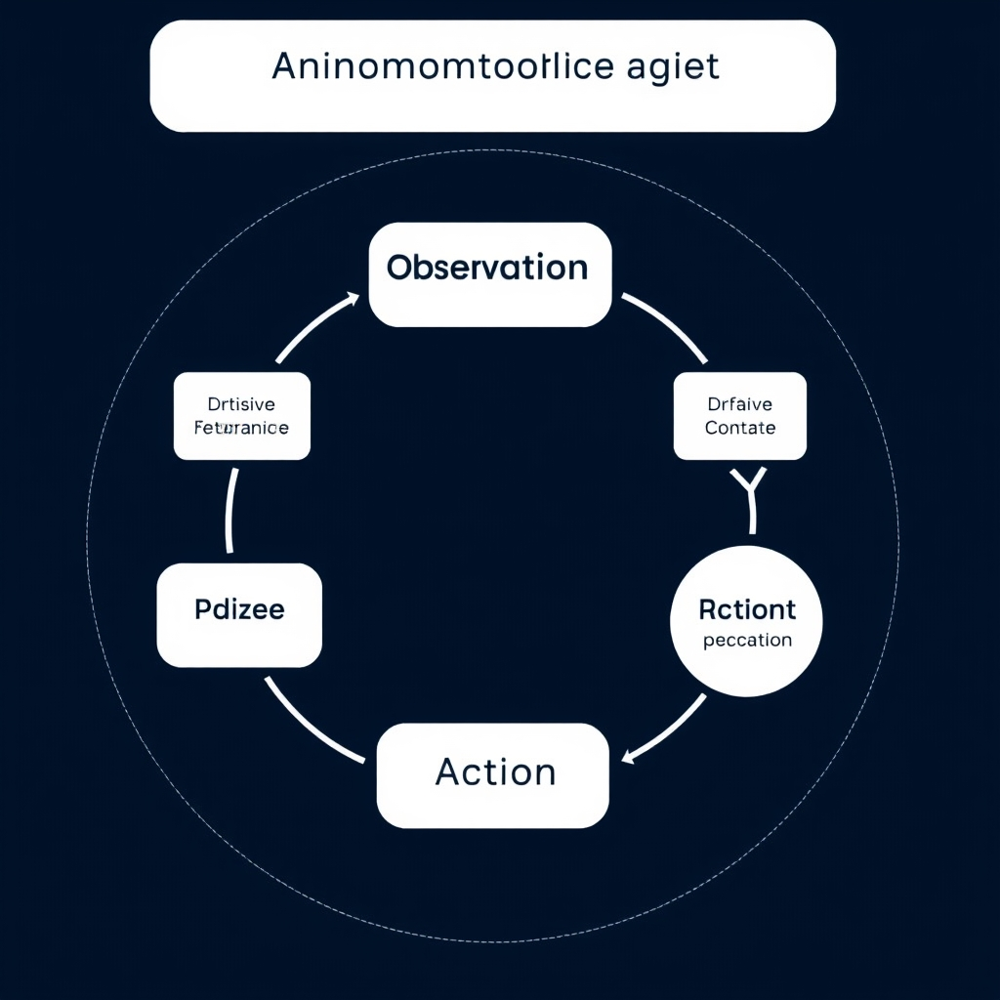
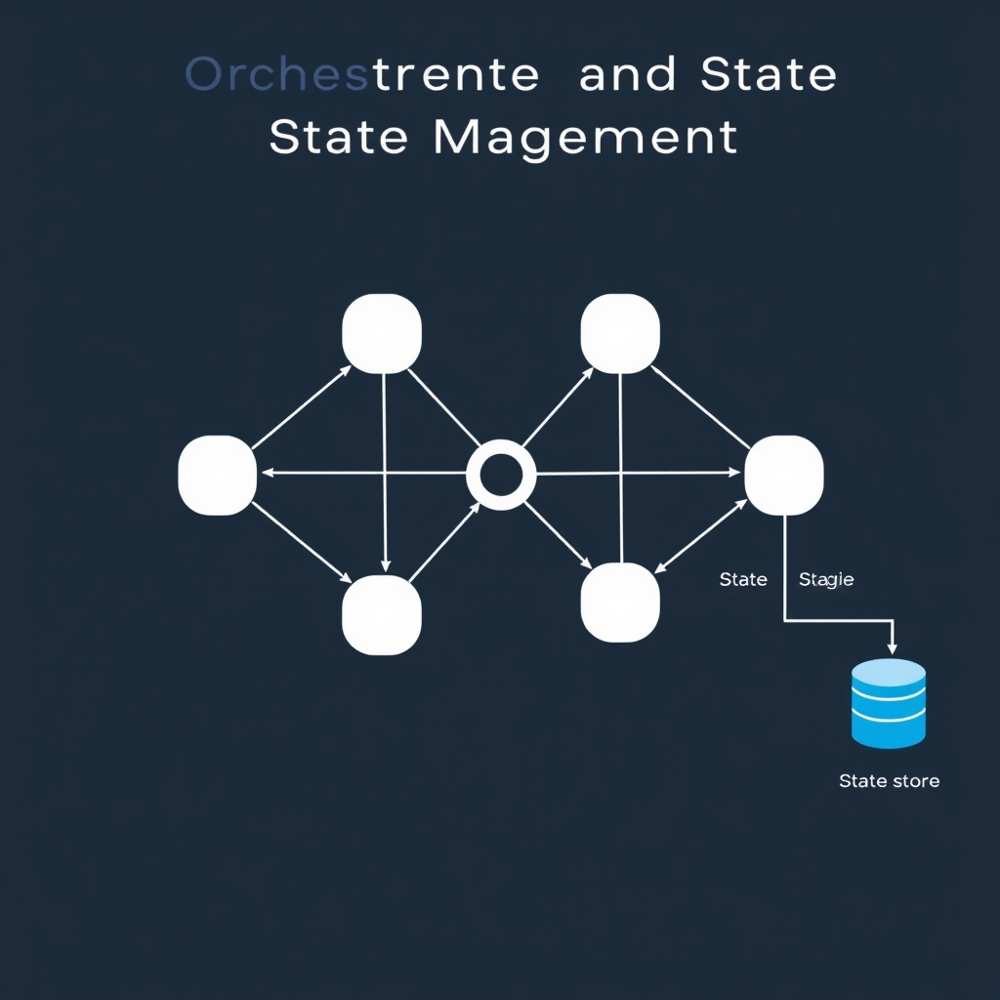
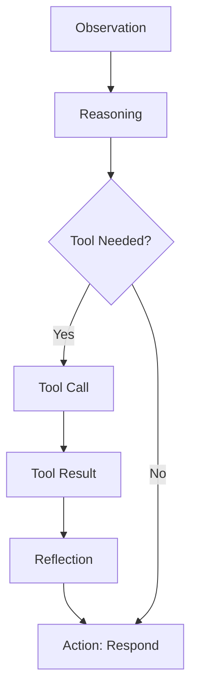
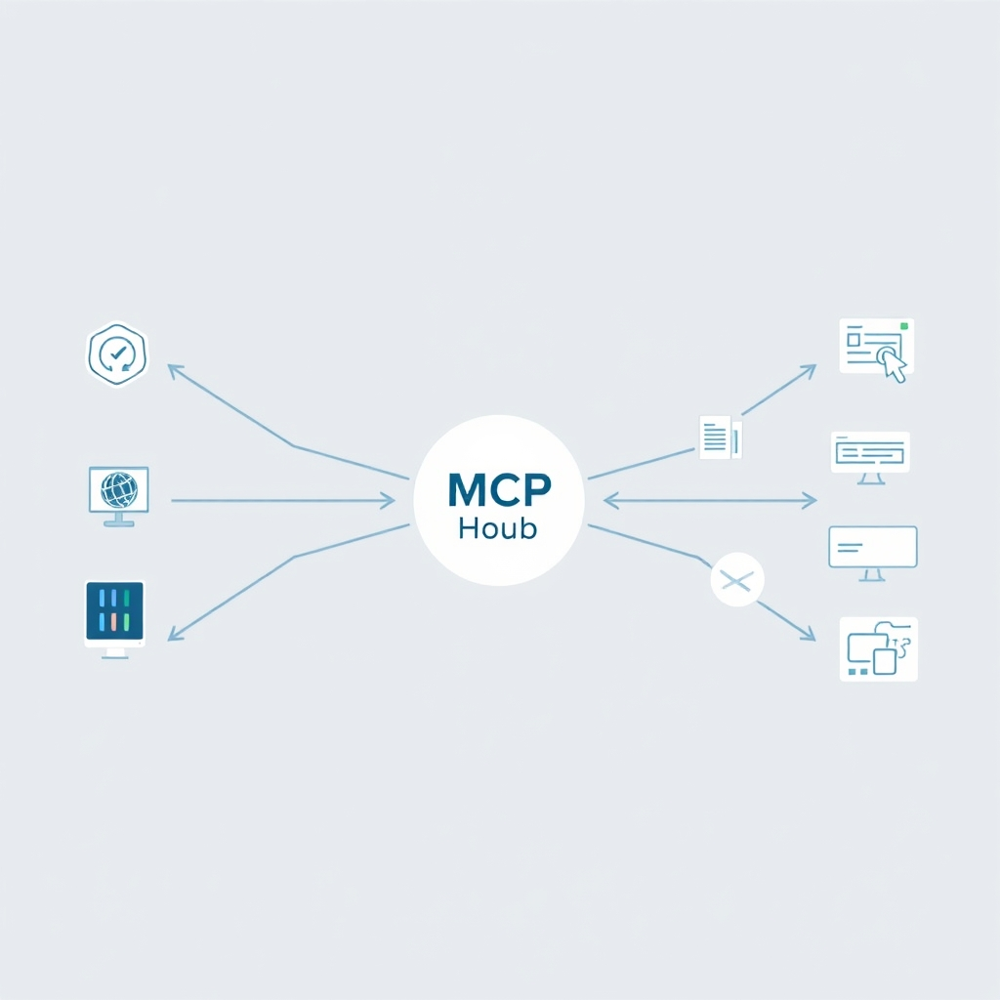

# Inside the Loop: How Modern AI Agents Actually Work

## The Anatomy of an Autonomous Agent

Modern autonomous agents are built around a **continuous observation‑reasoning‑action loop**. The loop begins with **observation**, where the agent gathers raw data from its environment—API responses, sensor readings, or user inputs. This context is fed to the **reasoning** stage, typically powered by a large language model (LLM). The LLM interprets the current state, evaluates the overarching objective, and generates a plan. Finally, the **action** stage executes the next step—calling a tool, sending a message, or updating internal state—before the cycle repeats.

*The core operational loop of an autonomous agent: the LLM processes observations to decide on actions, which in turn generate new observations.*

### The LLM as the cognitive engine

The LLM functions as the agent’s *brain*. It translates high‑level goals (e.g., “prepare a weekly sales report”) into a structured sequence of sub‑tasks. Because the model has been trained on vast textual corpora, it can infer implicit dependencies, select appropriate tools, and anticipate failure modes. In practice, the LLM receives a prompt that includes:

1. The **goal** supplied by the user or orchestrator.
1. The **latest observations** (e.g., fetched data, prior actions).
1. Any **constraints** (time limits, privacy rules).

It then returns a **reasoning output**—often a JSON‑like plan—detailing the next executable step.

### Decomposing high‑level goals into steps

Goal decomposition follows a top‑down approach:

- **Goal identification** – the agent records the user’s intent.
- **Task breakdown** – the LLM splits the intent into atomic actions (e.g., "query database", "format CSV", "email report").
- **Prioritization** – dependencies are ordered so that later steps have the data they need.
- **Execution** – each step is dispatched to a tool or function, and its result becomes the next observation.

This systematic breakdown enables the agent to handle complex, multi‑stage workflows without human micromanagement.

### Prompt‑based interaction vs. autonomous loops

A traditional prompt‑response model is *stateless*: the LLM receives a single input and returns a single output, after which the conversation ends. It cannot retain context beyond the immediate prompt, nor can it iteratively refine its answer.

In contrast, an autonomous loop **maintains state** across iterations, allowing the agent to:

- React to new information as it arrives.
- Re‑plan when an action fails.
- Accumulate knowledge over long‑running sessions.

Thus, the observation‑reasoning‑action cycle transforms a simple Q&A interface into a self‑directed system capable of achieving end‑to‑end objectives.

______________________________________________________________________

*Source: [Snowflake – What Are Autonomous AI Agents?](https://www.snowflake.com/en/artificial-intelligence/agents/autonomous-agents)*

## Architectural Design Patterns for Reliability

### ReAct: Reasoning + Acting

The **ReAct** pattern intertwines chain‑of‑thought reasoning with immediate tool usage. Instead of a single monolithic prompt, the agent iteratively:

1. **Reason** – generate a natural‑language rationale about the next step.
1. **Act** – invoke a tool (search API, calculator, database) based on that rationale.
1. **Observe** – feed the tool’s output back into the LLM for the next reasoning cycle.
   This loop reduces hallucinations because the model can verify assumptions against external evidence before committing to an answer. The pattern has become a de‑facto standard for production agents, enabling them to handle open‑ended queries while staying grounded in real data. [Source](https://pub.towardsai.net/the-7-design-patterns-every-ai-agent-should-know-in-2026-c77f28b51565)

### Reflection: Self‑Correction in the Wild

**Reflection** adds a meta‑cognitive step after each action. The agent asks itself questions such as *"Did the last tool call produce the expected result?"* or *"Is the current plan still optimal?"* If the answer is negative, the agent rewrites its plan or retries the tool call. This self‑audit loop catches errors early, preventing cascading failures in long‑running tasks. In practice, developers implement reflection by prompting the LLM with a concise summary of recent steps and a request for a confidence score. Low confidence triggers a corrective sub‑routine. The pattern is especially valuable when agents operate without human supervision, as it provides an automated safety net. [Source](https://pub.towardsai.net/the-7-design-patterns-every-ai-agent-should-know-in-2026-c77f28b51565)

### Multi‑Agent Collaboration: Divide and Conquer

Complex problems often exceed the expertise of a single model. **Multi‑Agent Collaboration** distributes subtasks across specialized agents—e.g., a planner, a data retriever, and a summarizer. A coordinator agent orchestrates the workflow, passing intermediate results via a shared context store. Benefits include:

- **Parallelism** – agents can run concurrently, reducing latency.
- **Specialization** – each agent can be fine‑tuned for its niche (code generation vs. legal reasoning).
- **Robustness** – failure of one agent can be mitigated by fallback agents or re‑routing.
  Real‑world deployments (e.g., autonomous research assistants) rely on this pattern to scale from simple Q&A to end‑to‑end project execution. [Source](https://pub.towardsai.net/the-7-design-patterns-every-ai-agent-should-know-in-2026-c77f28b51565)

### Human‑in‑the‑Loop (HITL): Guardrails for Critical Workflows

When stakes are high—financial decisions, medical advice, or regulatory compliance—**Human‑in‑the‑Loop** becomes non‑negotiable. The pattern inserts a review checkpoint where a human validates or edits the agent’s output before it proceeds. Implementation strategies include:

- **Soft HITL** – the agent presents confidence scores and optional explanations; the user can override low‑confidence actions.
- **Hard HITL** – the workflow halts until an explicit human approval is recorded.
- **Feedback Loop** – approved corrections are fed back into the training data, gradually improving model behavior.
  HITL not only mitigates risk but also builds trust with end users, a prerequisite for enterprise adoption. [Source](https://pub.towardsai.net/the-7-design-patterns-every-ai-agent-should-know-in-2026-c77f28b51565)

### Integrating the Patterns

A reliable production agent typically composes these patterns:

- **ReAct** drives the core reasoning‑action cycle.
- **Reflection** monitors each cycle for consistency.
- **Multi‑Agent Collaboration** scales the system across domains.
- **Human‑in‑the‑Loop** provides final oversight for high‑impact decisions.
  By layering them, developers achieve both autonomy and safety, turning experimental prototypes into robust services ready for real‑world workloads.

## Orchestration and State Management

### Modeling Agents as Directed Graphs

Frameworks such as **LangGraph** treat an autonomous agent as a *directed graph* where each node represents a discrete processing step (e.g., observation, reasoning, tool call) and each edge encodes the transition of state between steps. This abstraction makes the execution path explicit: the graph can be traversed deterministically, branched on conditional logic, or rewound to a prior node for re‑evaluation. By visualizing the agent’s logic as a flowchart, developers gain a clear mental model of how goals decompose into sub‑tasks and how data moves through the system.

*Modeling agents as directed graphs allows for stateful execution, where checkpoints enable error recovery and time-travel debugging.*

> *LangGraph is a low‑level orchestration framework that models agents as directed graphs where nodes are processing steps and edges define state transitions* \[[source](https://uvik.net/blog/agentic-ai-frameworks)\].

### Benefits of Stateful Workflows

| Feature                          | Why it matters for agents                                                                                                                                                                                                                                    |
| -------------------------------- | ------------------------------------------------------------------------------------------------------------------------------------------------------------------------------------------------------------------------------------------------------------ |
| **Checkpointing**                | Saves the complete state (LLM prompts, tool outputs, intermediate variables) at defined milestones. If a downstream error occurs, the agent can resume from the last checkpoint rather than restarting from scratch, dramatically reducing latency and cost. |
| **Time‑travel debugging**        | Allows developers to “rewind” the graph to a previous node, inspect the exact inputs that led to an unexpected output, and then replay with modifications. This is essential for diagnosing nondeterministic LLM behavior.                                   |
| **Human‑in‑the‑Loop primitives** | State snapshots enable a human reviewer to intervene at any node, edit the state, and push the graph forward, blending automation with oversight.                                                                                                            |

These capabilities turn a stateless prompt‑response loop into a *persistent* agent that can maintain context across long‑running tasks and recover gracefully from failures.

### Low‑Level Orchestration vs. Simple Script Automation

- **Script‑based automation** typically strings together API calls in a linear fashion. Errors abort the script, and there is no built‑in mechanism to preserve intermediate results.
- **Low‑level orchestration (e.g., LangGraph)** embeds state management into the execution engine. Nodes can be retried, reordered, or replaced without rewriting the entire script. Moreover, the graph can be dynamically expanded at runtime—agents can spawn new sub‑graphs to handle unforeseen sub‑tasks.

> In contrast to simple scripts, LangGraph provides *durable execution, checkpointing, time‑travel debugging, and first‑class human‑in‑the‑loop primitives* \[[source](https://uvik.net/blog/agentic-ai-frameworks)\].

### Durability as a Production Requirement

Production‑grade agents operate in environments where outages, network glitches, or model latency spikes are inevitable. Durability ensures that:

1. **State is persisted** to reliable storage (e.g., a database or object store) after each checkpoint, preventing loss of progress.
1. **Recovery is deterministic**; the same state snapshot will reproduce identical downstream behavior, a prerequisite for auditability and compliance.
1. **Scalability is achievable**; multiple workers can pick up different branches of the graph from a shared state store, enabling horizontal scaling without race conditions.

By adopting a graph‑based orchestration layer, developers gain fine‑grained control over execution, robust debugging tools, and the resilience needed for enterprise deployments.

______________________________________________________________________

*For a visual overview, the following Mermaid diagram illustrates a simple LangGraph agent that observes a user request, decides on a tool call, executes the tool, and then reflects on the result before responding.*

## Memory and Connectivity Standards

### Memory Types in Modern AI Agents

AI agents need to retain information at different granularities to act intelligently over time. The prevailing taxonomy splits memory into three layers:

*The Model Context Protocol (MCP) acts as a universal 'USB port,' decoupling agent frameworks from the specific tools and data sources they consume.*

- **Short‑Term (Contextual) Memory** – Holds the immediate conversation or task context that the LLM consumes on each inference call. It is typically limited to the model's token window (e.g., 4 k–32 k tokens) and is discarded after the next turn.
- **Working Memory** – A mutable store that survives across multiple LLM calls within a single session. It tracks intermediate results, plan steps, and variable bindings, enabling the agent to reason about a multi‑step workflow without re‑prompting the entire history.
- **Long‑Term Memory** – Persists beyond a session, often in a vector database or key‑value store. It captures user preferences, learned policies, or domain knowledge that the agent can retrieve and incorporate into future sessions.

These layers are not merely architectural niceties; they are essential for **multi‑session adaptation**. Without long‑term memory, an agent would treat each interaction as a fresh slate, forcing users to repeat preferences or re‑teach domain specifics. Working memory bridges the gap between the fleeting short‑term context and the durable long‑term store, allowing the agent to refine plans, remember partial results, and resume interrupted tasks.

______________________________________________________________________

### The Model Context Protocol (MCP): The USB Port for Agents

Integration has long been a pain point for agent developers. Each framework historically required its own custom connector to hook up tools, APIs, or data sources. The **Model Context Protocol (MCP)** emerged to solve this fragmentation. MCP defines a minimal, language‑agnostic schema for:

1. **Capability Advertisement** – Agents publish the functions they can invoke (e.g., `search_web`, `read_pdf`).
1. **Request/Response Envelope** – A standardized JSON payload carries inputs, metadata, and execution results.
1. **Session Tokens** – A lightweight identifier that ties a series of calls to a particular agent instance, preserving state across tool invocations.

By treating MCP as a universal “USB port,” developers can swap out the underlying framework (LangGraph, AutoGPT, etc.) without rewriting tool adapters. The protocol abstracts away framework‑specific plumbing, letting teams focus on the *what* (the tool) rather than the *how* (the connector).

______________________________________________________________________

### Reducing Integration Complexity

Before MCP, integrating a new external service often meant:

- Writing a bespoke wrapper for the chosen agentic framework.
- Maintaining separate authentication flows for each wrapper.
- Updating multiple codebases when the external API changed.

With MCP, the same connector can serve any compliant agent. This **single‑source integration** yields several concrete benefits:

- **Lower Development Overhead** – One implementation per tool, regardless of the number of agents that consume it.
- **Improved Reliability** – Standardized error handling and schema validation reduce runtime surprises.
- **Easier Auditing** – Uniform request logs simplify security reviews and compliance checks.

The protocol’s adoption is already visible in emerging frameworks, as noted by industry observers who describe MCP as “the USB port for agents”【https://futureagi.substack.com/p/top-5-agentic-ai-frameworks-to-watch】.

______________________________________________________________________

### Putting It All Together

A production‑grade AI agent typically layers these memory systems on top of MCP:

1. **Short‑Term** feeds the LLM each turn.
1. **Working Memory** stores the plan and tool results, referenced via MCP calls.
1. **Long‑Term Memory** retrieves user‑specific data that informs future prompts.

When an agent needs to call an external tool, it packages the request in an MCP envelope, receives the response, and writes any useful output into working memory. Over time, patterns that prove valuable are persisted to long‑term storage, enabling the agent to *learn* across sessions.

By standardizing connectivity (MCP) and structuring memory, modern agents achieve the reliability and scalability required for real‑world deployments.