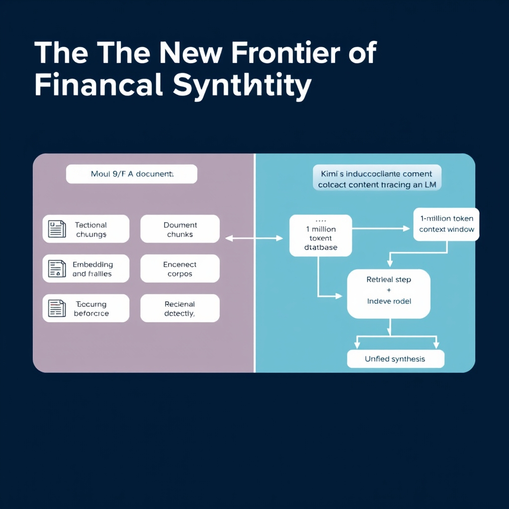
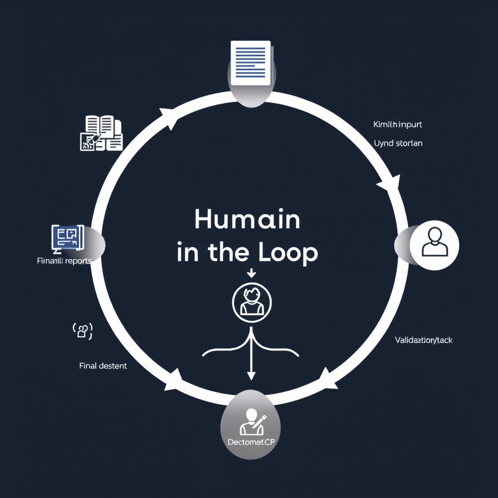
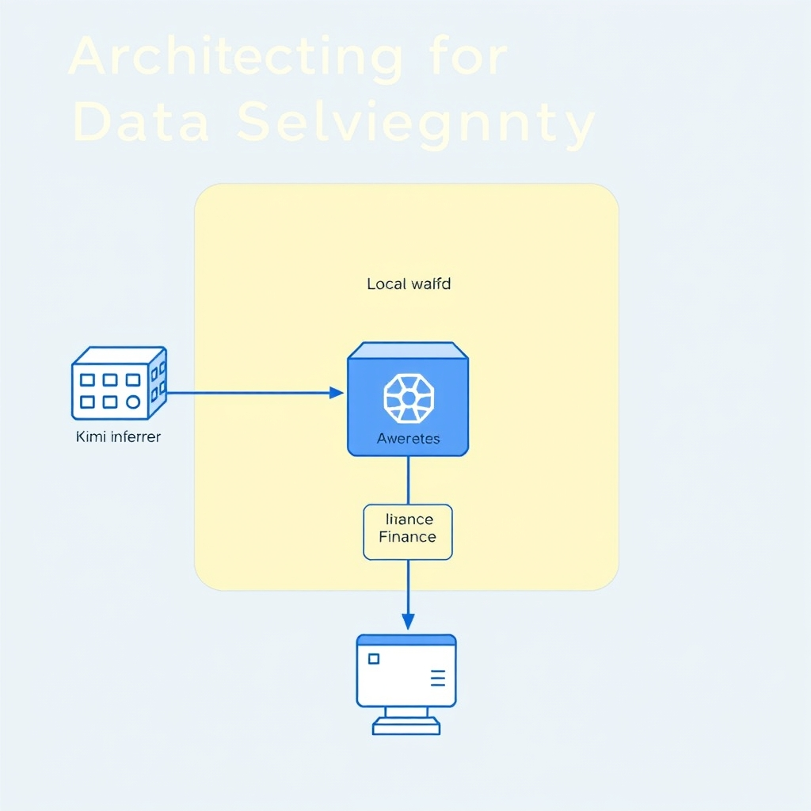

# Leveraging Kimi AI for Financial Workflows: A Strategic Guide

## The New Frontier of Financial Synthesis

### Massive Model, Massive Context

Kimi K3 is built on a **2.8 trillion‑parameter Mixture‑of‑Experts (MoE)** backbone. In an MoE design, only a subset of expert sub‑networks activates for each token, allowing the model to scale to trillions of parameters without a proportional increase in inference cost. This architecture gives Kimi the raw capacity to understand nuanced financial language, from complex derivatives contracts to multi‑year earnings narratives, while still delivering responses in real‑time.


*Traditional RAG pipelines (left) versus Kimi's native long-context processing (right), which eliminates retrieval latency and context loss.*

### One‑Million‑Token Window: A Game‑Changer for Finance

The standout feature for financial research is the **1 million token context window**. A single prompt can now contain an entire 10‑page 10‑K filing, a full set of quarterly earnings call transcripts, or an end‑to‑end audit trail spanning years of transaction logs. Traditional models, limited to a few thousand tokens, force analysts to chunk documents and manually stitch together summaries, introducing context loss and error risk. With Kimi, the entire corpus stays in memory, enabling coherent synthesis across sections and preserving cross‑reference integrity.

### Why Conventional RAG Falls Short

Retrieval‑Augmented Generation (RAG) pipelines typically retrieve short snippets, embed them, and then ask a language model to generate an answer. This works for simple fact‑lookup but **struggles with deep audit trails** where relevance is defined by temporal and relational links across thousands of lines. Kimi’s native long‑context handling sidesteps the retrieval step for large, contiguous documents, reducing latency and eliminating the “retrieval hallucination” problem that plagues RAG when the retrieved chunk misses a critical clause.

### Human‑In‑The‑Loop: The Operational Baseline

Even with these technical leaps, finance remains a high‑risk, regulated domain. The article therefore frames Kimi’s deployment within a **human‑in‑the‑loop (HITL)** model: the AI assists by aggregating, summarizing, and flagging insights, while a qualified analyst validates every output before it informs investment decisions or compliance reports. This approach leverages Kimi’s speed and breadth without compromising the fiduciary responsibility that financial institutions must uphold.

*Sources: [LinkedIn post on Kimi K3](https://www.linkedin.com/posts/ca-sumit-grover-6a8a3b73_28-trillion-parameters-1m-context-window-activity-7486485471385198592-IduM), [Kimi Work introduction](https://www.kimi.ai/resources/kimi-work-introduction), [Kimi K3 for Financial Services guide](https://www.layer3labs.io/guides/kimi-k3-for-finance)*

## High-Value Use Cases for Finance

### High‑Value Use Cases for Finance

Kimi AI’s long‑context window and agentic desktop layer translate directly into measurable ROI for finance teams. Below are the four most impactful scenarios.

#### 1. Automating research synthesis from disparate financial reports

- **Problem**: Analysts spend hours stitching together earnings releases, SEC filings, analyst notes, and macro‑data into a single narrative.
- **Kimi solution**: Feed the full text of each source—often exceeding 100,000 tokens—into a single prompt. The 1‑million token context window lets Kimi ingest an entire quarterly earnings packet plus related market commentary without truncation. The model then generates a concise synthesis, highlighting key performance drivers, risk factors, and forward‑looking statements.
- **Example**: A portfolio manager uploads the FY‑2024 10‑K, three broker research PDFs, and a Bloomberg macro‑report. Kimi returns a 2‑page briefing that surfaces revenue trends, debt covenant breaches, and comparable‑company benchmarks, cutting the manual aggregation time from ~6 hours to ~15 minutes.

#### 2. Streamlining document extraction and data normalization

- **Problem**: Raw financial statements are often in PDF or scanned formats, requiring OCR, column alignment, and manual mapping to internal data models.
- **Kimi solution**: Using its built‑in extraction agents, Kimi parses tables, footnotes, and narrative sections, then normalizes the data into JSON or CSV structures aligned with the firm’s taxonomy (e.g., GAAP vs. IFRS fields).
- **Example**: An analyst uploads a batch of quarterly balance sheets. Kimi outputs a standardized CSV with line‑item codes, automatically reconciling multi‑currency figures and flagging anomalies such as negative working capital.

#### 3. Internal knowledge management via Kimi Work’s desktop integration

- **Problem**: Institutional knowledge lives in scattered notebooks, email threads, and legacy SharePoint sites, making retrieval cumbersome.
- **Kimi solution**: Kimi Work runs as a local agent on the analyst’s workstation, indexing local files, internal databases, and web‑scraped market data. Queries like “What were the key risk disclosures for XYZ Corp in the last three filings?” are answered instantly, pulling from the indexed corpus.
- **Evidence**: The Kimi Work platform is explicitly built for finance professionals, integrating financial databases and allowing seamless data synthesis without switching tools【source: https://www.kimi.ai/resources/kimi-work-introduction】.

#### 4. Reducing context‑switching by unifying terminal data and document tools

- **Problem**: Traders and quants toggle between command‑line data pulls, spreadsheet models, and PDF reports, leading to lost focus and errors.
- **Kimi solution**: By exposing a unified chat interface that can invoke shell commands, query databases, and reference documents, Kimi lets users stay in a single pane. For instance, a user can ask, “Run a Monte‑Carlo simulation on the latest earnings forecast and compare it to the last three quarters’ actuals,” and Kimi will execute the script, fetch the results, and embed them in a brief report.
- **Impact**: Teams report a 20‑30 % reduction in task‑switch latency, translating into faster decision cycles and fewer transcription mistakes.

Collectively, these use cases illustrate how Kimi AI moves from a powerful model to a productivity engine, delivering concrete time savings and data quality improvements across the financial research workflow.

## Operational Guardrails and Risk Mitigation

### Defining the “Assistive‑Only” Boundary

Kimi K3’s 2.8‑trillion‑parameter MoE engine and 1‑million‑token context window make it technically capable of ingesting entire audit trails or full‑length prospectuses in a single prompt. **That capability does not translate into permission to let the model act autonomously.** In regulated finance, any system that initiates trades, generates compliance filings, or issues investment recommendations without explicit human sign‑off is a non‑starter. The model should be framed as a *research assistant* that surfaces relevant excerpts, drafts summaries, or suggests data points, while the final decision‑making remains firmly with a qualified professional.


*The human-in-the-loop framework: AI handles synthesis, but human oversight is mandatory for all final financial outputs.*

### Human Review as a Non‑Negotiable Requirement

Regulators expect a clear audit trail showing who approved each output that influences a client’s portfolio or a filing. Consequently, every Kimi‑generated artifact—whether a risk‑assessment memo, a regulatory summary, or a client‑facing report—must be reviewed and signed by a human before distribution. This practice mitigates two risks:

1. **Misinterpretation of model output** – LLMs can hallucinate figures or mis‑attribute sources.
1. **Compliance violations** – Unreviewed AI content could inadvertently breach disclosure rules or fiduciary duties.

Embedding a mandatory “human‑in‑the‑loop” checkpoint in the workflow (e.g., a review UI in Kimi Work) satisfies both operational control and auditability.

### Limits of AI in Final Investment Advice

While Kimi can synthesize earnings calls, normalize balance‑sheet tables, and flag anomalous trends, it lacks the fiduciary judgment required for final investment advice. The model does not possess:

- **Legal authority** to act as a registered investment adviser.
- **Contextual awareness** of a client’s risk tolerance, tax situation, or portfolio constraints.
- **Accountability** for the downstream impact of a recommendation.

Therefore, any suggestion labeled as “AI‑generated insight” must be accompanied by a disclaimer that it is for *informational purposes only* and must be vetted by a licensed professional before acting upon it.

### Best Practices for Verifying Model‑Generated Insights

1. **Source Attribution** – Require Kimi to cite the original document (e.g., SEC filing, Bloomberg terminal screen) for each data point. Use the built‑in citation feature of Kimi Work to embed hyperlinks or document IDs.
1. **Cross‑Check with Primary Sources** – Analysts should open the referenced source and confirm the extracted figure or statement matches the original context.
1. **Version Control** – Store AI‑drafts in a version‑controlled repository (e.g., Git) so that any changes to the underlying prompt or model can be traced.
1. **Independent Validation** – Run a secondary check using a different tool or a manual spreadsheet model to corroborate critical calculations.
1. **Document Review Logs** – Capture who performed the verification, when, and the outcome. This log becomes part of the compliance evidence set.

By institutionalizing these practices, financial firms can reap Kimi’s productivity gains while staying within the regulatory safe‑harbor. The next step is to ensure that the data feeding into Kimi remains under strict control—see the upcoming section on **Architecting for Data Sovereignty** for deployment strategies that keep sensitive information on‑premises or within a private cloud.

______________________________________________________________________

*Sources: [LinkedIn post on Kimi K3 parameters](https://www.linkedin.com/posts/ca-sumit-grover-6a8a3b73_28-trillion-parameters-1m-context-window-activity-7486485471385198592-IduM), [Kimi Work introduction](https://www.kimi.ai/resources/kimi-work-introduction), [Layer3 Labs guide on Kimi for finance](https://www.layer3labs.io/guides/kimi-k3-for-finance).*

## Architecting for Data Sovereignty

### API‑Based Consumption vs. Self‑Hosting

| Aspect                   | Kimi API                                                                                           | Self‑Hosted Open‑Weight Model                                                                            |
| ------------------------ | -------------------------------------------------------------------------------------------------- | -------------------------------------------------------------------------------------------------------- |
| **Data Path**            | Requests travel over TLS to Kimi’s cloud endpoint; data is processed and discarded after the call. | All inference runs inside the firm’s own network; no outbound traffic for model execution.               |
| **Control Plane**        | Versioning and scaling are managed by Moonshot; you rely on their SLA.                             | You provision compute, storage, and scaling policies yourself (e.g., Kubernetes, Docker Swarm).          |
| **Cost Model**           | Pay‑per‑token or subscription; costs rise with token volume.                                       | Up‑front hardware or cloud‑VM expense; token usage is effectively free after deployment.                 |
| **Compliance Footprint** | Requires a data‑processing agreement; audit logs are provided by the provider.                     | Full auditability of every container, network, and storage layer; can be placed behind air‑gapped zones. |


*Self-hosted architecture: Keeping model weights and data within a private, secure environment to ensure absolute data sovereignty.*

The API route is attractive for rapid pilots because it eliminates infrastructure overhead. However, regulated financial institutions often need **absolute data sovereignty**—the guarantee that no raw client or transaction data ever leaves their controlled environment. That guarantee is only achievable with self‑hosting.

### Why Self‑Hosting Eliminates External Exposure

Self‑hosting the open‑weight variant of Kimi (e.g., the K2 model) means the model weights reside on premises or within a private cloud VPC. As the **Security Scientist** article notes, “By running the model on your local infrastructure, you eliminate external data exposure entirely”【https://www.securityscientist.net/blog/12-questions-and-answers-about-kimi-data-privacy-as-a-chinese-model】. In practice this translates to:

- No outbound API calls that could inadvertently leak sensitive fields such as ISINs, client identifiers, or audit‑trail excerpts.
- Ability to enforce strict network segmentation (e.g., placing the inference service in a DMZ that only internal finance applications can reach).
- Full control over encryption at rest and in transit, using organization‑approved key management solutions.

### Kimi API’s Data‑Privacy Guarantees

For teams that still prefer the managed API, Moonshot explicitly states that *user data is not used to train or improve the model* and is **not persistently stored** beyond the request lifecycle【https://www.kimi.ai/help/kimi-api/api-data-security】. The API also enforces TLS‑1.3 encryption and isolates each request in a sandboxed container. While these safeguards meet many internal policies, they do not satisfy regulators that demand **zero‑exfiltration** of raw financial data.

### Implementation Strategy for Private Deployment

1. **Infrastructure Choice** – Deploy on a hardened Kubernetes cluster or a set of Docker hosts behind the institution’s firewall. For many firms, a single‑node GPU server (e.g., NVIDIA A100) is sufficient for research‑grade workloads.
1. **Model Acquisition** – Download the open‑weight K2 checkpoint from the official repository (requires a signed NDA). Verify the SHA‑256 hash before loading.
1. **Containerization** – Use the official Docker image provided by Moonshot, or build a custom image that includes your organization’s security hardening (e.g., non‑root user, minimal OS).
1. **Secure Inference Service** – Expose the model via a gRPC or REST endpoint that enforces mutual TLS. Store API keys in a vault (HashiCorp Vault, AWS Secrets Manager, etc.).
1. **Monitoring & Auditing** – Log every request/response pair to an immutable audit store (WORM storage). Integrate with SIEM for real‑time anomaly detection.
1. **Disaster Recovery** – Snapshot the model volume and configuration daily; test restore procedures quarterly.

#### Sample Docker‑Compose for a Self‑Hosted Kimi Inference Service

```yaml
version: '3.8'
services:
  kimi-inference:
    image: moonshot/kimi-k2:latest
    container_name: kimi_k2
    restart: unless-stopped
    environment:
      - MODEL_PATH=/models/k2
      - LOG_LEVEL=info
    volumes:
      - /opt/kimi/models/k2:/models/k2:ro   # read‑only model weights
      - /opt/kimi/config:/app/config:ro
    ports:
      - "8443:8443"   # mutual TLS endpoint
    deploy:
      resources:
        reservations:
          devices:
            - driver: nvidia
              count: 1
              capabilities: [gpu]
    healthcheck:
      test: ["CMD", "curl", "-f", "https://localhost:8443/health"]
      interval: 30s
      timeout: 10s
      retries: 3
```

The compose file demonstrates a **GPU‑enabled** container, read‑only mounting of model weights, and exposure of a TLS‑secured inference endpoint. Replace `/opt/kimi/models/k2` with the path to your verified checkpoint and configure mutual TLS certificates in `/opt/kimi/config`.

### Quick Checklist for Data‑Sovereign Deployment

- [ ] Verify model checksum before loading.
- [ ] Enforce mutual TLS for all client connections.
- [ ] Store secrets in a vault, never in plain text.
- [ ] Route all logs to an immutable audit store.
- [ ] Conduct a quarterly penetration test of the inference service.

By following this architecture, financial institutions can harness Kimi’s 2.8‑trillion‑parameter, 1‑million‑token context window for deep document synthesis **without compromising regulatory data‑safety requirements**.

## The Future of AI-Augmented Finance

The rise of Kimi AI marks a turning point for financial research. Its 2.8‑trillion‑parameter Mixture‑of‑Experts engine and 1‑million‑token context window let analysts ingest entire audit trails, multi‑year earnings releases, and regulatory filings in a single prompt, eliminating the fragmented workflows that have long hampered productivity.

**Balancing innovation with risk**

While the technology unlocks unprecedented speed, the regulated nature of finance demands strict guardrails. Kimi is positioned as an *assistive* partner—its outputs must be vetted by a qualified professional before any investment decision or compliance filing is made. This human‑in‑the‑loop model preserves the rigor of traditional review processes while still capturing the efficiency gains of AI‑driven synthesis.

**From tool to integrated agent**

Earlier generations of LLMs acted as isolated utilities: copy‑and‑paste, summarize, or answer queries. Kimi Work extends that paradigm by embedding the model directly into the analyst’s desktop, linking local files, market data feeds, and terminal outputs. The result is an *agentic* workflow where the AI orchestrates data collection, normalization, and draft generation, leaving the human to focus on interpretation and judgment.

**Practical rollout recommendation**

- **Start small:** Deploy Kimi on high‑volume, low‑risk tasks such as quarterly earnings summary generation or cross‑document research aggregation.
- **Measure impact:** Track time saved and error reduction before expanding to more sensitive domains.
- **Maintain oversight:** Enforce a policy that all model‑generated insights are reviewed against primary source documents and approved by a senior analyst or compliance officer.

By anchoring AI augmentation in a disciplined, human‑centric process, financial institutions can reap the productivity benefits of Kimi while upholding the stringent risk and compliance standards that define the industry.