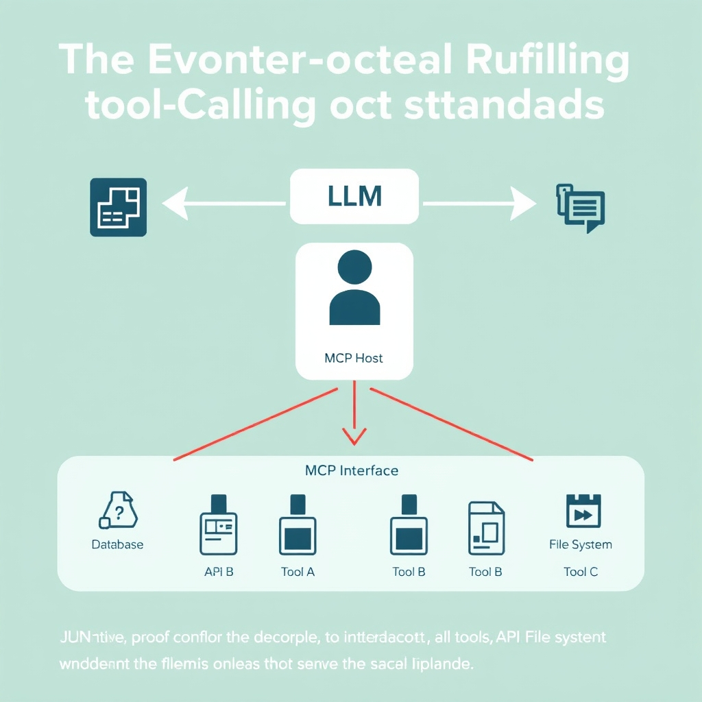
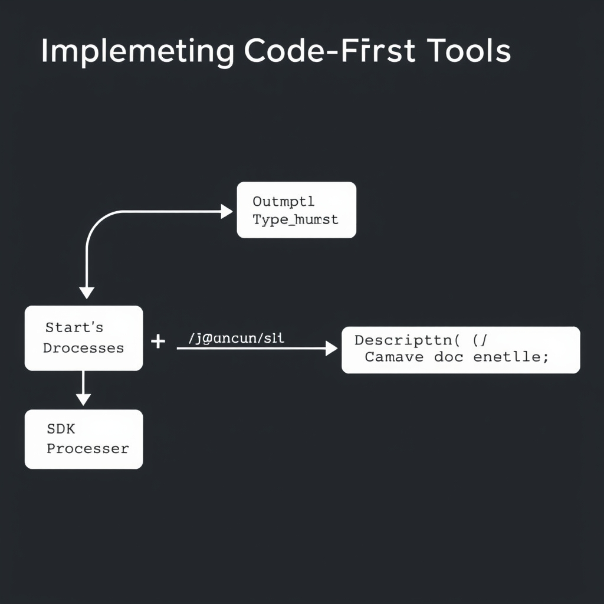
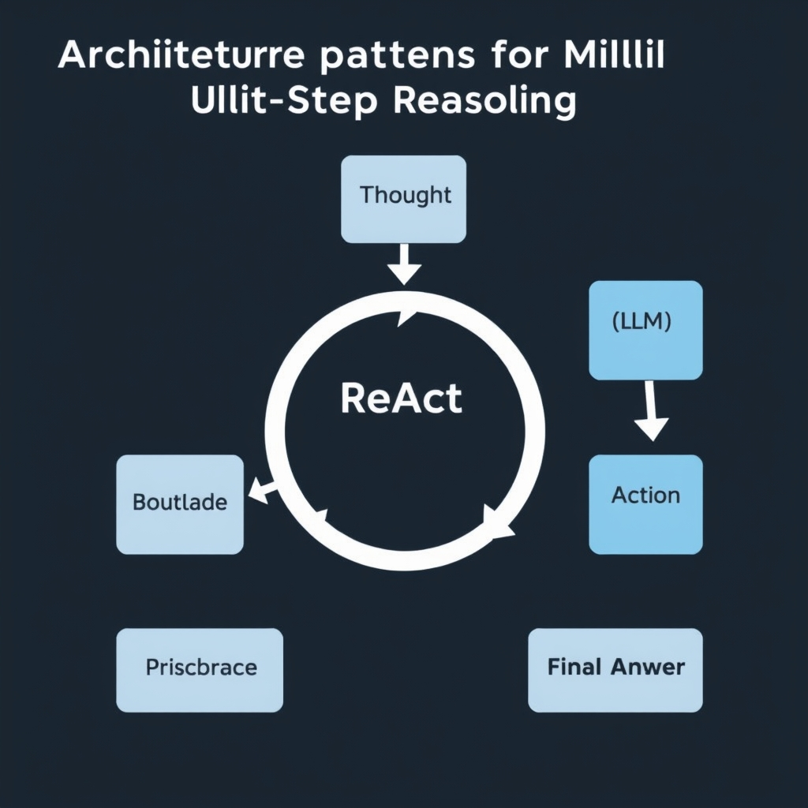

# Mastering LLM Tool Calling: 2026 Standards and Patterns

## The Evolution of Tool Calling Standards

The early days of LLM‑driven tool calling were dominated by **proprietary integrations**. Vendors shipped custom SDKs that tightly coupled a model to a specific database, search engine, or API. These adapters required hand‑written request/response schemas, version‑specific client libraries, and often forced developers to rewrite code whenever the underlying LLM or data source changed. The result was a fragmented ecosystem where each new tool introduced a fresh integration surface.


*The Model Context Protocol (MCP) acts as a standardized middle layer, allowing the LLM to interact with heterogeneous data sources through a uniform JSON-RPC interface.*

In contrast, the **Model Context Protocol (MCP)** emerged as an open, community‑backed standard that treats the LLM as a generic client and the tool as a JSON‑RPC service. MCP defines a minimal set of methods—`initialize`, `invoke`, and `shutdown`—and a JSON schema for describing input parameters and return types. By leveraging JSON‑RPC, MCP inherits a well‑understood, language‑agnostic transport layer, allowing any tool that implements the protocol to be discovered and invoked without bespoke glue code. This consistency is captured in the definition of MCP as an *open protocol standardizing how LLMs connect to data sources and tools through JSON‑RPC interfaces* [ClinAgent Paper](https://www.medrxiv.org/content/10.64898/2026.01.09.26343542v1.full-text).

Decoupling the model from concrete data‑source implementations yields several practical benefits:

- **Interchangeability** – a single LLM can switch between a SQL database, a vector store, or a third‑party API simply by swapping the endpoint that conforms to MCP.
- **Version resilience** – updates to the underlying tool’s internal API do not ripple to the model as long as the JSON‑RPC contract remains stable.
- **Simplified testing** – mock services can be spun up that implement the MCP contract, enabling deterministic unit tests for agentic workflows.

The 2026 standards landscape deliberately prioritizes **interoperability**. Industry consortia recognized that the rapid proliferation of specialized LLMs would stall without a common wiring language. MCP’s open design encourages cross‑vendor collaboration, reduces lock‑in risk, and aligns with broader initiatives such as the OpenAI Function Calling spec and the emerging ISO/IEC standards for AI service interfaces. By converging on a shared protocol, developers can focus on higher‑level reasoning logic rather than low‑level integration plumbing.

## Implementing Code-First Tools

### Automating Tool Registration with Decorators

Modern agent SDKs let developers expose Python functions as LLM‑callable tools with a single decorator. By adding `@function_tool` above a function, the SDK registers the callable, generates the required JSON‑RPC description, and wires the runtime so the model can invoke the code directly. This eliminates the boilerplate of manually publishing an OpenAPI spec or hand‑crafting a JSON schema.


*Modern SDKs use reflection on function signatures, type hints, and docstrings to automatically generate the tool schema required by the LLM.*

### Type Hints and Docstrings as the Single Source of Truth

When `@function_tool` is applied, the SDK inspects the function’s **type hints** to construct the JSON schema that describes each parameter’s name, type, and constraints. Simultaneously, the function’s **docstring** is harvested to populate the human‑readable description presented to the model. In this way, the Python signature becomes the authoritative definition for both the model and developers, removing the need for a separate schema file.

> The SDK turns any Python function into a tool by decorating it with `@function_tool`. Type hints become the JSON schema sent to the model, the docstring becomes the tool description the model reads, and the function body runs locally whenever the model decides to call it. [OpenAI Agents SDK Tutorial: 13 Steps (2026)](https://tech-insider.org/openai-agents-sdk-tutorial-python-13-steps-2026)

### Manual vs. Automated Schema Generation

| Aspect            | Manual Definition                                                               | SDK‑Driven Generation                                                     |
| ----------------- | ------------------------------------------------------------------------------- | ------------------------------------------------------------------------- |
| **Effort**        | Write JSON schema, keep it in sync with code, update on every signature change. | Write Python function with type hints; schema is derived automatically.   |
| **Error surface** | Typos or mismatched types cause runtime failures that are hard to trace.        | Type checker validates hints; schema reflects exact runtime expectations. |
| **Documentation** | Separate docs required for developers and the model.                            | Docstring serves both purposes, ensuring consistency.                     |
| **Versioning**    | Schema version must be managed independently.                                   | Schema version follows code version automatically.                        |

The automated path reduces cognitive load, shortens iteration cycles, and aligns the model’s view of a tool with the actual implementation.

### Concrete Example: Exposing a Weather Lookup Function

```python
from openai_agents import function_tool

@function_tool
def get_current_weather(city: str, unit: str = "celsius") -> str:
    """Return the current temperature for *city*.

    Parameters
    ----------
    city: str
        Name of the city, e.g., "Paris".
    unit: str, optional
        Temperature unit, either "celsius" or "fahrenheit". Defaults to "celsius".
    """
    # Imagine an external API call here
    temperature = fetch_weather_api(city, unit)
    return f"The temperature in {city} is {temperature} {unit}."
```

When the LLM decides it needs weather information, it receives a tool description derived from the function’s signature and docstring. The model then issues a call like:

```json
{"name": "get_current_weather", "arguments": {"city": "Tokyo", "unit": "celsius"}}
```

The SDK unmarshals the JSON, validates it against the generated schema, and executes `get_current_weather` locally, returning the string result back to the model.

### Benefits Recap

- **Zero‑maintenance schemas** – changes to type hints instantly propagate to the model.
- **Unified documentation** – docstrings double as model‑readable tool descriptions.
- **Rapid prototyping** – developers can iterate on tool logic without re‑publishing specs.
- **Safety** – the SDK validates inputs against the derived schema before execution, reducing injection risks.

By leveraging decorators, type hints, and docstrings, modern SDKs turn ordinary Python code into robust, model‑aware tools with minimal overhead.

## Architectural Patterns for Multi-Step Reasoning


*The ReAct (Reasoning and Acting) pattern creates an iterative loop where the LLM's thought process is constantly updated by the results of its own tool actions.*

### ReAct: Reasoning and Acting Loops

The ReAct pattern interleaves chain‑of‑thought reasoning with tool execution. An LLM first generates a textual rationale, then decides whether to invoke a tool, and finally incorporates the tool's output back into its reasoning. This tight loop enables the model to correct mistaken assumptions on the fly, rather than committing to a single answer after a static prompt. By treating each tool call as a discrete action, ReAct keeps the overall workflow deterministic while preserving the flexibility of natural‑language reasoning.

### Multi‑Agent Delegation

When a task exceeds the capacity of a single model—e.g., requiring domain‑specific knowledge, long‑running computations, or parallel data retrieval—multi‑agent delegation distributes sub‑tasks to specialized agents. A coordinator agent parses the high‑level goal, assigns responsibilities, and aggregates results. This approach reduces latency and isolates failure domains: if one sub‑agent encounters an error, the coordinator can retry or re‑route without aborting the entire workflow. The pattern is especially useful for complex pipelines such as end‑to‑end data pipelines, multi‑modal content generation, or hierarchical planning.

> "An agentic design pattern is a reusable solution to a recurring coordination problem that appears when LLM‑driven systems make decisions at runtime rather than following fixed code paths." – [Agentic Design Patterns](https://www.augmentcode.com/guides/agentic-design-patterns)

### Performance Benchmarks for Multi‑Turn Function Calling

Empirical evaluations in early 2026 show that GPT‑5 and Claude Opus 4.7 achieve the highest accuracy on multi‑turn function‑calling benchmarks. In a standardized test suite measuring correct tool selection, argument passing, and result integration over five interaction turns, GPT‑5 recorded a 92 % success rate, while Claude Opus 4.7 closely followed at 89 %. Competing models lagged by 10–15 % points, highlighting the importance of model architecture and training data that emphasize iterative reasoning.

> "Tool calling accuracy varies by provider; GPT‑5 and Claude Opus 4.7 are the strongest at multi‑turn function calling as of April 2026." – [OpenAI Agents SDK Tutorial](https://tech-insider.org/openai-agents-sdk-tutorial-python-13-steps-2026)

These results underscore that state‑of‑the‑art models are now capable of maintaining context across multiple tool invocations, a prerequisite for reliable ReAct loops and multi‑agent coordination.

### From Stateless Completions to State‑Aware Response APIs

Traditional LLM APIs return a single completion without preserving conversational state. Modern state‑aware APIs introduce a session token and a mutable "scratchpad" that the model can read and write. This enables the model to:

- Store intermediate results (e.g., IDs of created resources) for later steps.
- Reference prior tool outputs without re‑prompting the entire history.
- Emit structured "action" objects that downstream services can consume directly.

State‑aware designs reduce token overhead and latency, because the model no longer needs to re‑serialize the full interaction history. They also simplify the implementation of ReAct and multi‑agent patterns, as each turn can be processed incrementally while preserving a coherent internal state.

Together, these architectural patterns—ReAct decision loops, multi‑agent delegation, and state‑aware APIs—form a toolkit for building robust, multi‑step LLM applications that can reason, act, and coordinate at scale.

## Sources

- [ClinAgent: A Five-Layer Architecture for Autonomous Clinical Trial Statistical Programming](https://www.medrxiv.org/content/10.64898/2026.01.09.26343542v1.full-text)
- [OpenAI Agents SDK Tutorial: 13 Steps [2026]](https://tech-insider.org/openai-agents-sdk-tutorial-python-13-steps-2026)
- [What Are Agentic Design Patterns? 2026 Pattern Catalog](https://www.augmentcode.com/guides/agentic-design-patterns)