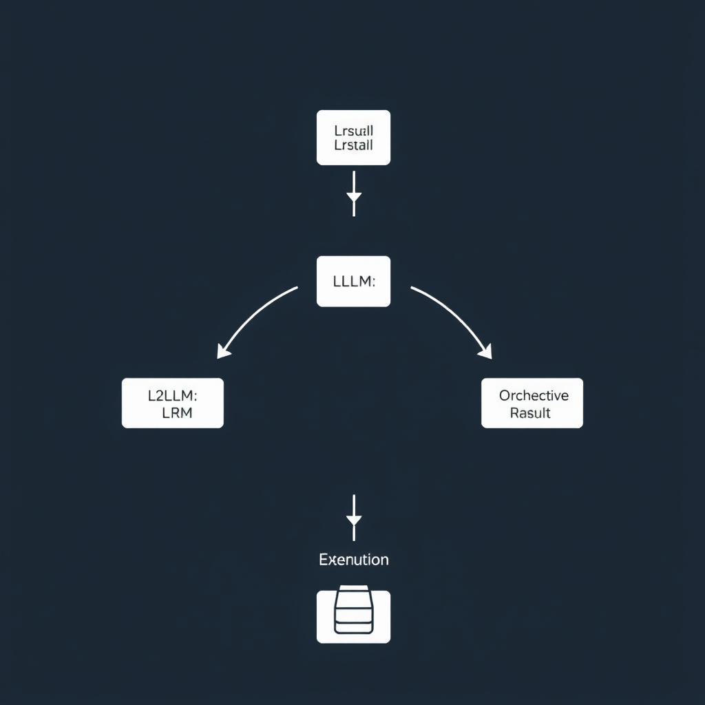
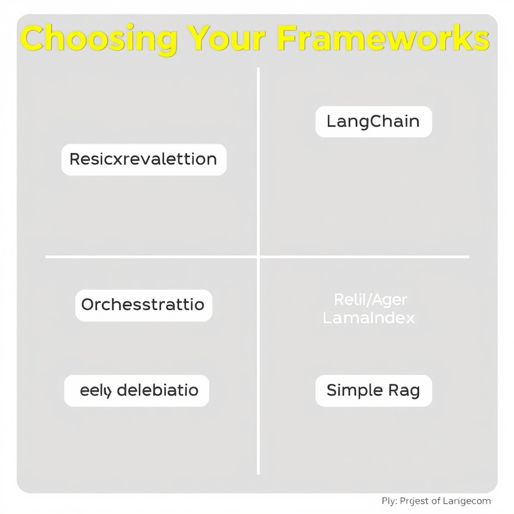
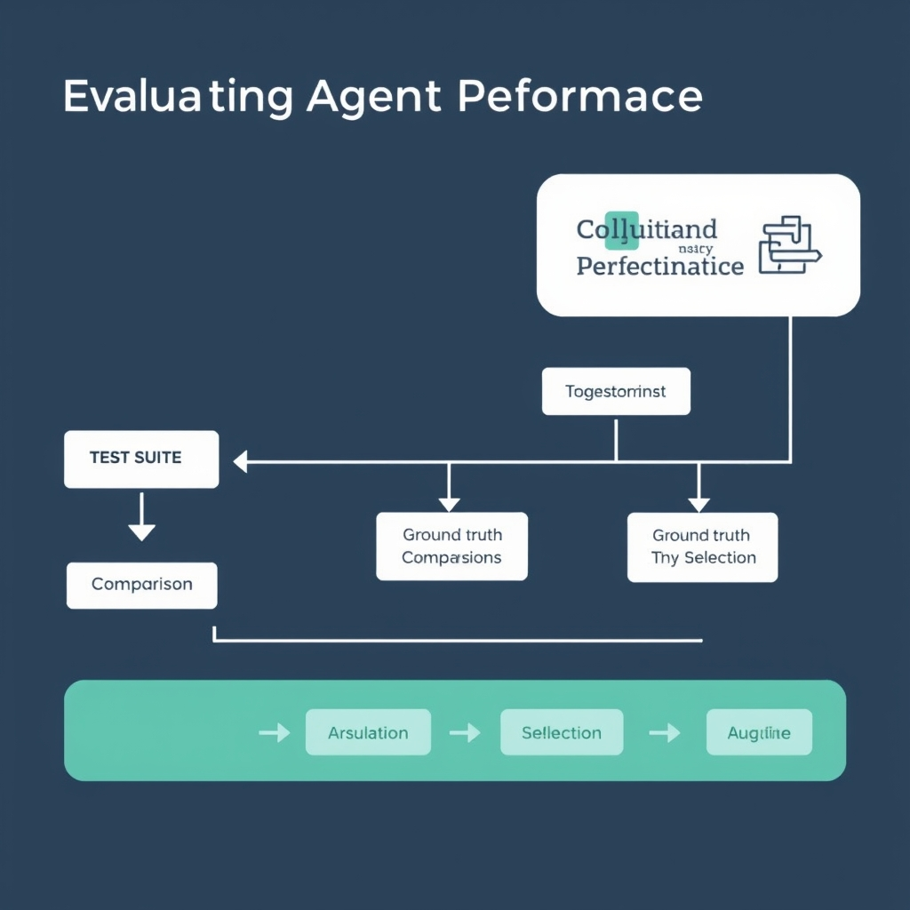

# Mastering LLM Tool Calling: A Practical Guide to Agentic Integration

## The Fundamentals of LLM Tool Calling

**Interchangeability of terminology**


*The agentic loop: The LLM emits a structured request, the orchestration layer executes the function, and the result is fed back into the model.*

Across the major LLM providers, the phrases *function calling* and *tool use* refer to the same capability: allowing a model to request the execution of an external piece of code. OpenAI originally coined the term *function calling* and later rebranded it as *tool use*; Anthropic uses *tool use* exclusively, while Google mixes *function calling* with *function declarations*. In practice the two labels are interchangeable [1].

**How a model requests external execution**

When a prompt includes a description of available tools, the model can emit a structured JSON payload that matches the tool’s schema. The orchestration layer parses this payload, maps the `name` field to a concrete function or API endpoint, and forwards the supplied `arguments` for execution. The response—often another JSON object—is then injected back into the conversation, enabling the model to continue reasoning with the newly obtained data.

**From passive chatbots to active agents**

Traditional chatbots merely generate text based on the conversation history. By contrast, an *agentic* LLM can decide autonomously to invoke a tool, retrieve fresh information, or perform an action before producing its next utterance. This shift transforms the model from a static responder into a dynamic orchestrator that can interact with databases, web services, or custom business logic.

**Why structured input matters**

The model’s tool request must conform to a predefined schema; otherwise the orchestration layer cannot reliably translate the output into a real API call. Explicit parameter definitions, required‑field markings, and constrained value sets (e.g., enums) reduce ambiguity and prevent runtime errors. Consequently, well‑designed schemas are the foundation that bridges generative language models with deterministic external systems.

______________________________________________________________________

## Designing Robust Tool Schemas

### Explicit Parameter Descriptions

LLM agents treat the schema as a contract. When a description is missing, the model often guesses the intent, leading to malformed calls or omitted arguments. Adding a concise, human‑readable description to every field gives the model a clear semantic cue and reduces hallucination. For example, describing a `date` field as "ISO‑8601 formatted date string (e.g., 2024-09-15)" guides the model to produce the correct format rather than a free‑form phrase.

> "Add descriptions to every parameter" – DeployBase\[[1]\](https://deploybase.ai/articles/best-llm-for-function-calling-tool-use-comparison).

### Using Enums for Constrained Inputs

When a parameter can only take a limited set of values, defining an `enum` in the JSON Schema eliminates ambiguity. The model then knows it must choose from the listed options, which improves both **Invocation Accuracy** and **Tool Selection Accuracy**. Common use‑cases include status flags, currency codes, or predefined actions.

> "Use enum values for constrained parameters" – DeployBase\[[1]\](https://deploybase.ai/articles/best-llm-for-function-calling-tool-use-comparison).

### Required vs. Optional Fields

Explicitly marking fields as required or optional prevents the model from either omitting essential data or over‑populating the request with unnecessary keys. JSON Schema uses a top‑level `required` array to list mandatory properties. Optional fields should be omitted from this array and can include a `default` value if appropriate.

> "Mark required vs optional fields explicitly" – DeployBase\[[1]\](https://deploybase.ai/articles/best-llm-for-function-calling-tool-use-comparison).

### Sample Schema: Calendar Event Creator

Below is a minimal yet robust schema for a hypothetical `create_event` tool. It demonstrates the three principles above: detailed descriptions, enums for constrained inputs, and clear required/optional delineation.

```json
{
  "$schema": "http://json-schema.org/draft-07/schema#",
  "title": "Create Calendar Event",
  "description": "Creates a new calendar event for a user.",
  "type": "object",
  "properties": {
    "title": {
      "type": "string",
      "description": "Short, descriptive title of the event."
    },
    "start_time": {
      "type": "string",
      "format": "date-time",
      "description": "ISO‑8601 timestamp indicating when the event starts."
    },
    "end_time": {
      "type": "string",
      "format": "date-time",
      "description": "ISO‑8601 timestamp indicating when the event ends. Must be after `start_time`."
    },
    "timezone": {
      "type": "string",
      "enum": ["UTC", "America/New_York", "Europe/London", "Asia/Tokyo"],
      "description": "Timezone identifier for the event times."
    },
    "reminder_minutes": {
      "type": "integer",
      "minimum": 0,
      "description": "Number of minutes before `start_time` to send a reminder. Optional; defaults to 10 minutes."
    },
    "location": {
      "type": "string",
      "description": "Physical or virtual location of the event. Optional."
    }
  },
  "required": ["title", "start_time", "end_time", "timezone"]
}
```

**Why this schema works:**

- **Descriptions** clarify each field’s purpose and expected format.
- **Enum** on `timezone` restricts input to known identifiers, preventing misspellings.
- **Required array** enforces the four critical fields while allowing `reminder_minutes` and `location` to be omitted.

By adhering to these design patterns, developers can dramatically lower the rate of schema violations during LLM‑driven tool calls, leading to smoother orchestration and more predictable downstream behavior.

## Choosing Your Framework: LangChain vs. LlamaIndex

### Comparing LangChain and LlamaIndex

Both LangChain and LlamaIndex have become go‑to libraries for building agentic applications, but they excel in different architectural niches.


*Framework selection matrix: LangChain excels at complex orchestration, while LlamaIndex is optimized for retrieval-heavy workflows.*

#### Orchestration‑first vs. retrieval‑first

- **LangChain** is designed around *orchestration*. It provides a rich set of abstractions—**Chains**, **Agents**, **Memory**, and built‑in **tool calling**—that let a single LLM coordinate multiple steps, invoke external APIs, and maintain context across hops. This makes it a natural fit for workflows such as:
  - A travel‑assistant that first queries a flight‑search API, then calls a hotel‑booking service, and finally formats an itinerary.
  - A code‑assistant that iteratively refactors a snippet, runs a linter, and then executes unit tests.
- **LlamaIndex** (formerly GPT‑Index) adopts a *retrieval‑first* philosophy. Its core strength lies in constructing and querying indexes over heterogeneous data (documents, vectors, SQL tables). Typical use‑cases include:
  - Augmenting a chatbot with up‑to‑date corporate knowledge by pulling relevant passages from an internal document store.
  - Building a RAG pipeline where the LLM only sees the most relevant chunks, reducing token consumption.

> *Evidence*: LangChain is orchestration‑first and LlamaIndex is retrieval‑first ([Statsig](https://www.statsig.com/perspectives/llamaindex-vs-langchain-rag)).

#### Decision matrix

| Criterion           | LangChain                                                      | LlamaIndex                                      |
| ------------------- | -------------------------------------------------------------- | ----------------------------------------------- |
| Primary focus       | Multi‑step agent orchestration, tool calling                   | Retrieval‑augmented generation (RAG)            |
| Indexing support    | Basic, via external libraries                                  | Native index builders (list, tree, vector)      |
| Memory handling     | Built‑in session and long‑term memory modules                  | No dedicated memory; relies on external storage |
| Tool integration    | First‑class tool schema validation, automatic function calling | Requires manual wrapper around tools            |
| Learning curve      | Higher (many abstractions)                                     | Lower (focus on indexing)                       |
| Community ecosystem | Large, many integrations (OpenAI, Anthropic, AWS)              | Growing, strong focus on data connectors        |

#### Trade‑offs of high‑level abstractions

- **Productivity vs. control** – LangChain’s high‑level components let developers prototype complex agents quickly, but the abstraction layers can obscure low‑level request details, making debugging harder.
- **Performance overhead** – The orchestration engine adds runtime indirection (e.g., chain routing, memory serialization). In latency‑sensitive environments, a leaner retrieval‑first stack like LlamaIndex may yield faster responses.
- **Extensibility** – Both libraries are extensible, yet LangChain’s plugin model encourages swapping out components (different LLM providers, custom tools) without rewriting core logic. LlamaIndex’s extensibility centers on custom index types and query transforms.
- **Maintenance burden** – High‑level APIs evolve rapidly. Teams must track version changes to avoid breaking changes, especially when relying on auto‑generated tool schemas.

#### Choosing the right framework

- Opt for **LangChain** when your application demands **complex decision trees**, **stateful interactions**, or **multiple tool invocations** within a single user query.
- Choose **LlamaIndex** when the primary challenge is **efficiently surfacing relevant information** from large corpora and the downstream LLM logic remains relatively straightforward.
- In hybrid scenarios—e.g., a RAG‑enhanced agent that also needs to call external services—consider **layering**: use LlamaIndex for document retrieval, then hand the retrieved context to a LangChain agent for orchestration.

## Evaluating Agent Performance

### Invocation Accuracy

Invocation Accuracy measures whether an agent correctly decides *if* a tool should be invoked for a given user request. A perfect score (1.0) means the model never attempts an unnecessary call nor skips a required one. This metric isolates the decision‑making layer from downstream execution errors, making it a primary signal for early‑stage debugging.


*The evaluation pipeline: Comparing agent outputs against ground truth to calculate Invocation and Selection accuracy.*

### Tool Selection Accuracy

Tool Selection Accuracy evaluates whether the agent picks the *right* tool from the available catalog after it has decided to invoke a function. It is computed as the proportion of cases where the selected tool matches the ground‑truth tool for the task. Together with Invocation Accuracy, it captures the full selection pipeline of an agentic system.

### Standard Benchmarks

Several community‑curated benchmarks provide labeled interaction logs for measuring these metrics:

- **ToolBench** – a collection of multi‑tool scenarios covering web search, database queries, and code execution. It reports both Invocation and Tool Selection Accuracy for each model variant.
- **API‑Bank** – focuses on REST‑style API calls, offering a diverse set of endpoint specifications and expected responses.
- **FlowBench** (mentioned in the survey) – adds workflow‑level evaluation but is beyond the scope of this section.

These benchmarks are publicly available and have been used in the survey *Evaluation and Benchmarking of LLM Agents* (see [arXiv link](https://arxiv.org/html/2507.21504v1)).

### Implementing a Custom Evaluation Loop

When off‑the‑shelf benchmarks do not match your domain, you can build a lightweight loop:

```python
import json
from your_agent import Agent

# 1. Load a test suite of (user_input, expected_tool, expect_call) tuples
with open('test_cases.json') as f:
    cases = json.load(f)

invocation_hits = selection_hits = 0

for case in cases:
    # 2. Run the agent in a deterministic mode (e.g., temperature=0)
    response = Agent.run(case['user_input'], temperature=0)
    # 3. Parse the model's tool call decision
    called = response.get('tool_called') is not None
    # 4. Update Invocation Accuracy
    if called == case['expect_call']:
        invocation_hits += 1
    # 5. If a call was made, check the selected tool
    if called:
        if response['tool_name'] == case['expected_tool']:
            selection_hits += 1

invocation_acc = invocation_hits / len(cases)
selection_acc = selection_hits / sum(c['expect_call'] for c in cases)
print(f"Invocation Accuracy: {invocation_acc:.2%}")
print(f"Tool Selection Accuracy: {selection_acc:.2%}")
```

The script demonstrates the core steps: deterministic inference, extraction of the tool‑call payload, and metric aggregation. Replace the JSON schema with your own format, and extend the loop to capture latency or error codes if needed.

### Continuous Testing in Production

Agentic systems evolve as model weights, tool APIs, or schema definitions change. Embedding the evaluation loop into a CI/CD pipeline ensures that any regression in Invocation or Tool Selection Accuracy is caught before deployment. Regularly re‑run benchmark suites (ToolBench, API‑Bank) and supplement them with domain‑specific cases to maintain coverage. Monitoring trends over time also highlights drift caused by external API changes, prompting timely updates to schema definitions or prompt engineering.

By systematically measuring these metrics and automating their verification, developers can keep LLM agents reliable and performant in real‑world deployments.

[1]: https://ofox.ai/blog/function-calling-tool-use-complete-guide-2026