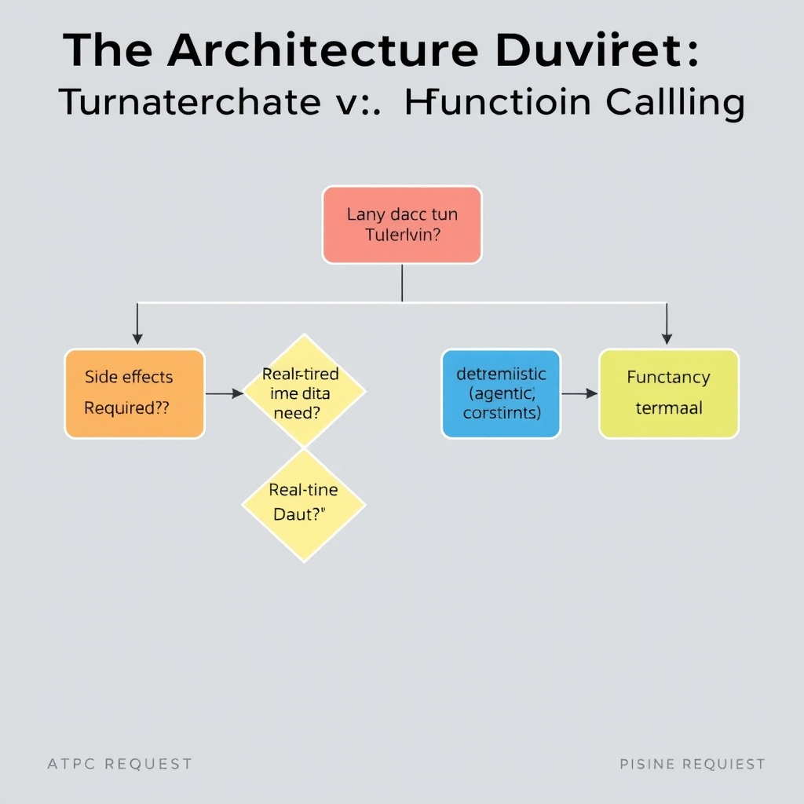
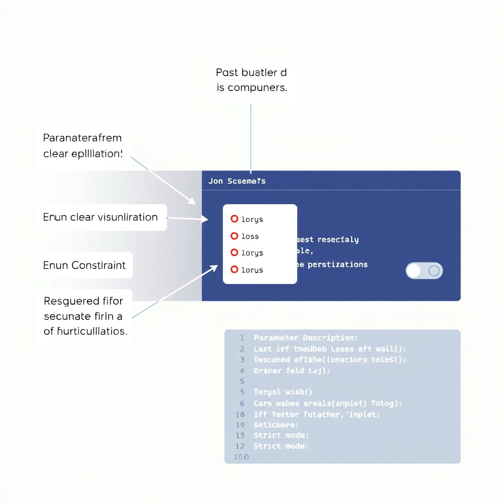
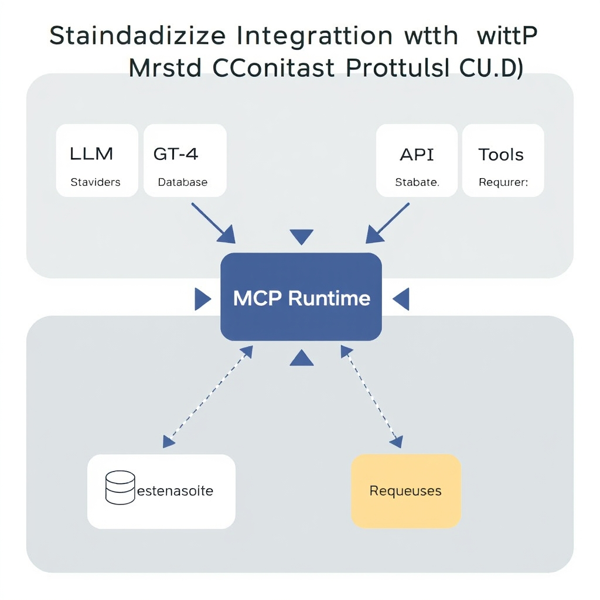

# Mastering LLM Tool Calling: Architectural Patterns for 2026

## The Architectural Divide: Structured Output vs. Function Calling

### Structured Output vs. Function Calling

**Structured Output** is a single‑turn pattern where the model is prompted to emit data that conforms to a predefined schema (e.g., a JSON object). The interaction ends once the model returns the formatted payload, making the process deterministic and inexpensive. Because the model never invokes an external tool, the only latency is the inference time of the LLM itself.


*A decision framework for selecting the appropriate architectural pattern based on your application's specific needs for side effects, data freshness, and latency.*

**Function Calling** (also called tool calling) treats the model as an orchestrator that can request external APIs over multiple turns. After each model response, the system parses the suggested function name and arguments, executes the real‑world call, and feeds the result back to the model. This multi‑turn dialogue enables dynamic behavior—such as fetching live stock prices or updating a calendar—but introduces additional latency and cost due to the round‑trip overhead and the need to maintain state across turns.

______________________________________________________________________

#### Cost and latency implications

| Aspect              | Structured Output                                               | Function Calling                                                                                                     |
| ------------------- | --------------------------------------------------------------- | -------------------------------------------------------------------------------------------------------------------- |
| **Inference cost**  | One inference per request; typically the cheapest option.       | One inference per turn; a typical workflow may require 3‑5 turns, multiplying compute cost.                          |
| **Network latency** | None (no external calls).                                       | Each tool invocation adds network round‑trip time; latency can grow linearly with the number of calls.               |
| **Error surface**   | Errors are limited to schema mismatches or hallucinated fields. | Errors include mis‑identified functions, malformed arguments, API failures, and potential infinite diagnostic loops. |
| **Predictability**  | High – output is deterministic given the prompt and schema.     | Lower – model may choose different tools or argument structures across runs.                                         |

______________________________________________________________________

#### Decision framework

1. **Is the data static or dynamic?**
   - *Static* (e.g., extracting a date from a user message) → Structured Output.
   - *Dynamic* (e.g., querying a live weather service) → Function Calling.
1. **Do you need real‑time side effects?**
   - No side effects → Structured Output.
   - Side effects such as creating a ticket, sending an email, or updating a DB → Function Calling.
1. **What are the latency constraints?**
   - Sub‑second response required → Prefer Structured Output.
   - Tolerable multi‑second latency and the value of fresh data outweighs delay → Function Calling.
1. **How critical is cost predictability?**
   - Fixed budget per request → Structured Output.
   - Variable budget acceptable for richer interactions → Function Calling.
1. **Complexity of the interaction**
   - Simple extraction or transformation → Structured Output.
   - Multi‑step reasoning, conditional branching, or fallback strategies → Function Calling.

By walking through these questions, architects can map a concrete use case to the appropriate pattern. For example, a ticket‑routing bot that only needs to parse a ticket title and assign a priority can rely on Structured Output, while a travel‑assistant that must check flight availability, book seats, and send confirmations should employ Function Calling.

______________________________________________________________________

#### Practical tip

When both patterns appear viable, start with Structured Output and only introduce Function Calling if the use case explicitly demands live data or side effects. This “schema‑first, tool‑later” approach reduces unnecessary complexity and keeps the agent’s cost profile predictable.

## Engineering Reliable Schemas: Best Practices for 2026

### Why Explicit Parameter Descriptions Matter

LLMs treat the schema as a contract. When each parameter includes a concise, human‑readable description, the model can map its internal reasoning to the expected field more reliably. For example, a `date` field described as "ISO‑8601 formatted date (YYYY‑MM‑DD)" guides the model away from free‑form phrases like "next Friday" that would otherwise cause a mismatch. DeployBase’s benchmark study notes that detailed descriptions *significantly reduce hallucination* because the model has a clearer target to generate — see the comparison of schema‑adherent calls versus free‑text outputs (https://deploybase.ai/articles/best-llm-for-function-calling-tool-use-comparison).

### Using Enums to Constrain Input Values

When a parameter can only accept a limited set of values, defining an `enum` forces the model to choose from that list. This eliminates ambiguous synonyms and cuts downstream validation work. Below is a minimal schema fragment for a ticket‑creation tool that restricts `priority` to three levels:

```json
{
  "name": "createTicket",
  "parameters": {
    "type": "object",
    "properties": {
      "title": {"type": "string", "description": "Short summary of the issue"},
      "priority": {
        "type": "string",
        "enum": ["low", "medium", "high"],
        "description": "Urgency of the ticket"
      }
    },
    "required": ["title", "priority"]
  }
}
```

DeployBase’s best‑practice guide recommends enums for any categorical input because they *directly improve schema adherence* and lower the chance of the model inventing unsupported values (https://deploybase.ai/articles/best-llm-for-function-calling-tool-use-comparison).

### Marking Required vs. Optional Fields

Explicitly listing required fields tells the model which arguments must be present for a successful call. Optional fields can be omitted without breaking the contract, but they should still carry descriptions to aid the model when they are supplied. Consider a user‑profile update endpoint:

```json
{
  "name": "updateProfile",
  "parameters": {
    "type": "object",
    "properties": {
      "userId": {"type": "string", "description": "Unique identifier of the user"},
      "email": {"type": "string", "format": "email", "description": "New email address (optional)"},
      "displayName": {"type": "string", "description": "Public name shown to other users (optional)"}
    },
    "required": ["userId"]
  }
}
```

By declaring only `userId` as required, the model learns that it must always provide that field, while it may safely omit `email` or `displayName` if the user did not supply them. This pattern is highlighted in the DeployBase analysis as a key factor in *reducing unnecessary model calls* and preventing validation errors.

### Enforcing Strict Mode in Production

OpenAI’s 2026 guide introduces a `strict: true` flag that tells the model to **reject** any argument set that does not exactly match the supplied JSON schema. When strict mode is enabled, the model will either produce a compliant call or fall back to a `null` response, allowing the surrounding orchestration layer to handle the failure gracefully. This eliminates a whole class of runtime bugs where mismatched types or missing fields cause downstream API errors.

```python
import openai

response = openai.ChatCompletion.create(
    model="gpt-4o",
    messages=[{"role": "user", "content": "Create a high‑priority ticket about login failure"}],
    tools=[{"type": "function", "function": schema}],
    tool_choice="auto",
    parallel_tool_calls=False,
    strict=True  # Enforces exact schema match
)
```

The OpenAI documentation emphasizes that strict mode *dramatically reduces production failure modes* because the model cannot emit arguments that violate type constraints, missing required fields, or unsupported enum values (https://www.kommunicate.io/blog/openai-function-calling).

### Putting It All Together

A robust schema for 2026 agentic systems therefore follows a checklist:

1. **Describe every parameter** with clear, concise language.
1. **Use `enum`** for any categorical choice.
1. **Mark required fields** explicitly; treat everything else as optional.
1. **Enable `strict` mode** in the LLM client to enforce compliance.

Applying these practices yields predictable tool calls, minimizes hallucination, and provides a solid foundation for scaling AI agents in production environments.


*Key components of a reliable schema: clear descriptions, enum constraints, explicit required fields, and strict mode enforcement.*

## Standardizing Integration with the Model Context Protocol (MCP)

### The Fragmented Landscape of Legacy Tool Integration

Traditional agent architectures stitch together individual API wrappers, custom parsers, and ad‑hoc prompting tricks. Each LLM vendor often requires its own "function calling" schema, forcing developers to maintain parallel codebases for OpenAI, Anthropic, Google, etc. This fragmentation leads to:


*The Model Context Protocol (MCP) provides a universal interface, allowing a single tool implementation to be consumed by multiple LLM providers.*

- **Inconsistent data contracts** – one model may return JSON, another plain text, requiring bespoke post‑processing.
- **Higher maintenance overhead** – updates to a single external service ripple through multiple wrappers.
- **Increased latency** – round‑tripping through separate request/response cycles for each tool.

The result is brittle pipelines that break under version changes or when scaling across providers.

______________________________________________________________________

### MCP: A Universal Interface for Tools and Data Sources

The Model Context Protocol (MCP) was introduced by Anthropic as an **open standard** that abstracts tool interaction behind a single, declarative contract[^mcp]. Rather than embedding provider‑specific function signatures in prompts, MCP defines a **tool manifest** that describes:

1. **Tool name and purpose** – a human‑readable identifier.
1. **Input schema** – a JSON Schema that the model must satisfy.
1. **Output schema** – the shape of the data the tool will return.
1. **Invocation semantics** – synchronous vs. asynchronous execution flags.

When an LLM needs to call a tool, it emits a structured request that conforms to the manifest. The runtime validates the request against the schema, executes the tool, and returns a response that the model can directly consume. Because the contract is **provider‑agnostic**, the same manifest works with Claude, GPT‑4, Gemini, or any future model that implements MCP.

______________________________________________________________________

### Interoperability Benefits Across LLM Providers

| Benefit         | Legacy Approach                                | MCP‑Enabled Approach                         |
| --------------- | ---------------------------------------------- | -------------------------------------------- |
| **Portability** | Re‑write function definitions per vendor       | Single manifest works everywhere             |
| **Consistency** | Varying output formats (JSON, XML, plain text) | Uniform JSON schema enforcement              |
| **Tool Reuse**  | Duplicate wrappers for each model              | One implementation, multiple consumers       |
| **Governance**  | Ad‑hoc validation, prone to errors             | Schema‑driven validation prevents mismatches |

By decoupling the *what* (schema) from the *who* (LLM), organizations can build a **tool library** that remains stable even as they experiment with newer models. This reduces integration costs and accelerates time‑to‑value for new AI initiatives.

______________________________________________________________________

### High‑Level Steps to Build an MCP‑Compliant Tool

1. **Define the Tool Manifest** – Create a JSON file that includes the tool name, description, and input/output schemas. Use `enum` and `required` fields to constrain values and guide the model.
1. **Register the Manifest with the Runtime** – Load the manifest into the MCP‑aware orchestration layer (e.g., Anthropic's `mcp-runtime`). The runtime will expose the tool to any connected model.
1. **Implement the Execution Handler** – Write the actual code that performs the work (e.g., a REST call, database query). The handler receives validated input and must return data matching the output schema.
1. **Enable Model Access** – Configure the LLM session to allow the tool. When the model decides to invoke the tool, it emits a structured request that the runtime validates and forwards to the handler.
1. **Test End‑to‑End** – Use the MCP test harness to simulate model calls, ensuring schema compliance and correct error handling before production deployment.

Adopting MCP transforms tool integration from a patchwork of bespoke adapters into a **standardized, schema‑first workflow** that scales across models and organizations.

______________________________________________________________________

## Conclusion: Building for Production Stability

The most dependable agents in 2026 start with a **schema‑first mindset**. By defining strict JSON schemas before any model interaction, developers give LLMs a clear contract: required fields, enumerated values, and type constraints. This contract dramatically reduces hallucinations and eliminates costly runtime validation failures.

At the same time, the industry is coalescing around the **Model Context Protocol (MCP)** as the de‑facto integration layer. MCP abstracts tool invocation, data retrieval, and response formatting into a single, provider‑agnostic API. When your schemas are already aligned with MCP’s payload conventions, swapping models or adding new tools becomes a matter of configuration rather than rewrites.

Finally, reliability hinges on **systematic edge‑case testing**. Multi‑turn agentic loops introduce stateful complexities—race conditions, stale context, and unexpected branching. Build test suites that:

- Simulate network latency and partial failures for each tool.
- Feed malformed or out‑of‑schema responses to verify graceful degradation.
- Exercise long conversation histories to expose context‑drift bugs.

By anchoring development in robust schemas, adopting MCP for seamless integration, and rigorously stress‑testing multi‑turn interactions, teams can deliver production‑grade AI agents that remain stable as usage scales.

[^mcp]: https://suprmind.ai/hub/claude/features