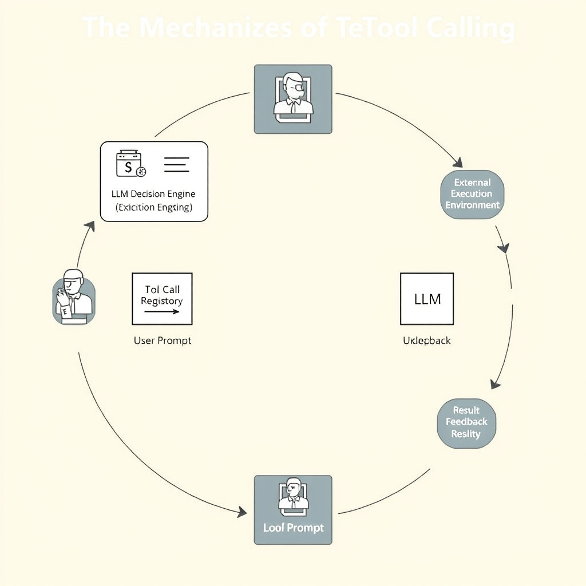
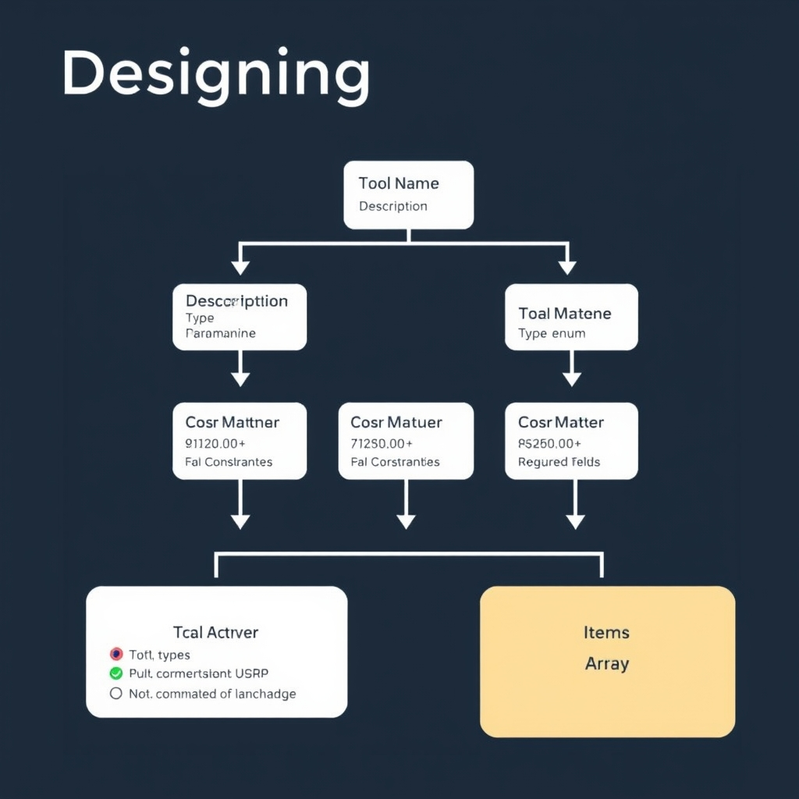
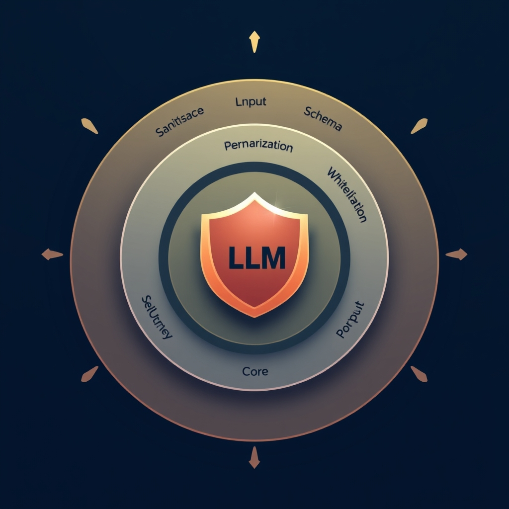

# Mastering LLM Tool Calling: From Schema Design to Secure Agentic Workflows

## The Mechanics of Tool Calling

### From Free‑Form Text to Structured Calls

Traditional LLM outputs are raw strings meant for human consumption. In tool‑calling workflows the model instead emits **JSON objects** that name a function and supply typed arguments. This shift eliminates ambiguity—the downstream system can parse the payload deterministically and invoke the exact operation the model selected[^1].


*The tool-calling loop: The LLM acts as a decision-maker, translating natural language into structured JSON calls that the execution environment processes.*

### The Model as a Decision‑Maker

The LLM no longer merely generates prose; it **decides** whether a tool is needed and which one. After processing the user prompt, the model evaluates the available tool schema and, if appropriate, returns a call specification. For example, given a request to “book a flight from NYC to Paris next Friday,” the model might output:

```json
{
  "name": "search_flights",
  "arguments": {"origin": "NYC", "destination": "Paris", "date": "2026-09-01"}
}
```

The orchestration layer interprets this JSON and triggers the `search_flights` API, closing the loop between intent and execution.

### Interaction Loop

1. **User Prompt** → LLM receives natural‑language request.
1. **Schema Lookup** → LLM references the registered tool definitions (name, parameters, types).
1. **Decision** → LLM either returns plain text or a structured call object.
1. **Execution Environment** → The platform validates the JSON against the schema, invokes the external function, and returns the result.
1. **Feedback** → The result can be fed back to the model for follow‑up turns.

Each iteration reinforces the contract: the schema defines *what* can be called, the model decides *when* to call it, and the execution environment enforces *how* the call is performed.

### Parallel Function Calling

OpenAI’s implementation introduced **parallel function calling**, allowing a single model turn to request multiple independent tools simultaneously. This reduces latency for composite tasks such as fetching weather data while querying a calendar[^2]. In practice, the model might emit an array of call objects, each processed concurrently, and then aggregate the results for the next response.

Understanding these mechanics—structured output, model‑driven decision making, a tight interaction loop, and parallelism—helps developers design agentic systems that are both predictable and performant.

## Designing Robust Tool Schemas

### Descriptive Parameter Naming

LLMs treat the tool schema as a prompt. When parameter names are self‑describing, the model can map its internal concepts to the schema with far fewer ambiguities. For example, `customer_id` is clearer than a generic `id`, and `start_date` conveys both type (date) and intent (the beginning of a range). Descriptive names also improve downstream debugging because logs will show meaningful keys rather than opaque placeholders.

### Constraining Output with `enum`

Using the JSON Schema `enum` keyword forces the model to choose from a predefined set of values, dramatically reducing hallucinations. In practice, this turns an open‑ended text generation problem into a multiple‑choice one, which LLMs handle more reliably. For instance, a `status` field that only accepts `"pending"`, `"approved"`, or `"rejected"` eliminates the risk of the model inventing unexpected statuses. The importance of enums for constrained parameters is highlighted in the DeployBase benchmark, which notes that schemas employing `enum` lead to fewer invalid calls [1].

### Enforcing Presence with the `required` Array

The `required` array in JSON Schema tells the model which fields must be supplied. Without it, the LLM may omit optional data, leading to downstream validation errors. Explicitly marking mandatory inputs also enables the execution environment to reject incomplete payloads before any costly operation runs. The same DeployBase analysis observes that schemas that list required fields experience fewer runtime failures [1].

### Putting It All Together: A Well‑Structured Tool Definition

Below is a minimal yet robust example of a tool schema for a fictional `create_invoice` function. It demonstrates descriptive naming, enum constraints, and required fields, and includes inline descriptions for every parameter.

```json
{
  "name": "create_invoice",
  "description": "Generate a new invoice for a customer.",
  "parameters": {
    "type": "object",
    "properties": {
      "customer_id": {
        "type": "string",
        "description": "Unique identifier of the customer (e.g., UUID)."
      },
      "invoice_date": {
        "type": "string",
        "format": "date",
        "description": "Date the invoice is issued."
      },
      "currency": {
        "type": "string",
        "enum": ["USD", "EUR", "GBP"],
        "description": "Three‑letter ISO currency code."
      },
      "line_items": {
        "type": "array",
        "description": "List of items to bill.",
        "items": {
          "type": "object",
          "properties": {
            "description": {"type": "string", "description": "Item description."},
            "quantity": {"type": "integer", "minimum": 1, "description": "Number of units."},
            "unit_price": {"type": "number", "minimum": 0, "description": "Price per unit in the selected currency."}
          },
          "required": ["description", "quantity", "unit_price"]
        }
      }
    },
    "required": ["customer_id", "invoice_date", "currency", "line_items"]
  }
}
```

**Why this works**

- **Naming**: `customer_id`, `invoice_date`, `currency`, and `line_items` immediately convey purpose.
- **Enum**: `currency` is limited to three common codes, preventing unexpected values.
- **Required**: The top‑level `required` array ensures the function cannot be called without the essential context, while the nested `required` array guarantees each line item is complete.
- **Descriptions**: Every property includes a human‑readable description, which the LLM uses to align its output with the schema.

By following these patterns—clear names, constrained enums, explicit required fields, and thorough descriptions—you give the LLM a precise contract to obey, leading to more reliable tool calling and fewer downstream errors.

______________________________________________________________________


*A robust tool schema uses descriptive names, enum constraints, and explicit required fields to minimize model hallucinations and runtime errors.*

## Structured Output vs. Function Calling

### Primary use case: Structured output for data formatting

When an LLM’s task is limited to **re‑formatting** information—e.g., converting a free‑form user query into a CSV row, generating a JSON payload for downstream consumption, or producing a markdown table—the most reliable approach is to ask the model for a *structured output*. The model receives a schema (often a JSON schema) that describes the exact shape of the data, and it returns a string that conforms to that shape. Because the model never invokes external code, the only failure mode is a malformed string, which can be caught with a simple schema validator.

> *Example*: A chatbot that extracts contact details from an email and returns `{ "name": "…", "email": "…", "phone": "…" }`. The schema guarantees each field exists and is correctly typed, allowing the downstream CRM to ingest the result without additional orchestration.

### Primary use case: Function calling for agentic control flow

Function calling turns the LLM into a **decision‑maker** that selects and triggers external functions. Instead of merely shaping data, the model determines *what* action the application should take next—sending an email, querying a database, or provisioning a cloud resource. The function definition (name, parameters, and description) acts as a contract, and the model’s output is a concrete function invocation that the runtime executes.

> *Example*: An AI assistant that, after understanding a user’s request to "book a flight for next Friday," calls `search_flights(destination, date)` and then `reserve_seat(flight_id, passenger_info)`. The model orchestrates the entire workflow, not just the data format.

### Reliability requirements: Structured output vs. function calling

| Aspect                | Structured output                                    | Function calling                                                    |
| --------------------- | ---------------------------------------------------- | ------------------------------------------------------------------- |
| Failure mode          | Invalid JSON / schema mismatch                       | Incorrect function selected, wrong parameters, or execution error   |
| Validation complexity | Simple schema validation (e.g., JSON Schema)         | Multi‑layer validation: schema check **and** runtime error handling |
| Expected reliability  | High, because the model never touches external state | Lower, because external side‑effects introduce nondeterminism       |

Structured output is inherently more deterministic: the model’s only job is to serialize data. Function calling introduces **stateful interactions** with external services, which can fail for network, permission, or business‑logic reasons.

### Why function calling demands robust error handling and retry logic

Because function calls affect real systems, any mistake can have tangible consequences (e.g., duplicate orders, unauthorized data access). Therefore, developers must implement:

- **Input sanitization**: Verify that the parameters produced by the LLM conform to the expected types and value ranges before invoking the function.
- **Idempotency checks**: Ensure that repeated calls (due to retries) do not cause side‑effects such as double billing.
- **Retry policies**: Distinguish transient errors (e.g., network timeouts) from permanent ones (e.g., validation failures) and apply exponential back‑off where appropriate.
- **Fallback mechanisms**: If a function call repeatedly fails, fall back to a safe default or ask the model to re‑formulate the request.

These safeguards are unnecessary for pure structured output, where a failed validation simply results in a re‑prompt. In contrast, function calling must anticipate and mitigate the broader risk surface introduced by external execution.

## Securing Your Agentic Integrations

- **Adversarial tool injection** – An attacker can craft a prompt that tricks the model into emitting a function call it should never invoke. The injected call may execute arbitrary code, exfiltrate data, or trigger side‑effects in downstream services. This vulnerability has been demonstrated on state‑of‑the‑art models such as GPT and Llama 3 [4].
- **Privacy theft** – When a model is allowed to pass user‑provided text directly to a tool, a crafted input can cause the model to forward confidential snippets (e.g., API keys, personal identifiers) to an attacker‑controlled endpoint [4].
- **Unscheduled tool execution** – An injection may cause a tool to run outside the intended workflow, leading to denial‑of‑service or unintended state changes (e.g., creating database records without authorization) [4].

### Why general‑purpose retrieval amplifies risk

Retrieval‑augmented generation (RAG) layers a searchable knowledge base beneath the LLM. Because the model can freely reference retrieved documents, an adversary can poison the index with malicious snippets that resemble legitimate tool specifications. When the model later sees those snippets, it may believe the injected tool definition is valid and emit a call, expanding the attack surface beyond the prompt itself to any external corpus the model consults [4].

### Defensive strategies

1. **Input sanitization** – Strip or escape characters that could be interpreted as JSON keys or function identifiers. Validate that any user‑generated string conforms to a whitelist of allowed patterns before it reaches the model.
1. **Strict permission scoping** – Assign each tool the minimal set of privileges required for its purpose. For example, a `send_email` function should never have write access to a file system. Use role‑based access control (RBAC) to enforce these limits at the execution layer.
1. **Schema whitelisting** – Maintain a static registry of approved tool schemas. Before invoking a function, compare the model‑generated call against this registry; reject any call that references an unknown or altered schema.
1. **Output validation** – After the model produces a function call, parse the JSON and verify:
   - All required fields are present.
   - Enum values match the predefined set.
   - No extra keys exist.
     If validation fails, log the incident and abort the call.
1. **Rate limiting and anomaly detection** – Monitor the frequency and pattern of tool calls per user or session. Sudden spikes may indicate an injection attempt.
1. **Secure retrieval pipelines** – When using RAG, protect the index with integrity checks (e.g., digital signatures) and restrict write access to trusted processes only.

### Putting it together

A robust security posture treats the LLM as a *decision engine* rather than a trusted executor. By sanitizing inputs, scoping permissions, and rigorously validating the model's output against a known schema, developers can dramatically reduce the likelihood of adversarial tool injection, privacy breaches, and unscheduled executions. These controls become especially critical when the system incorporates general‑purpose retrieval, as the broader data surface provides more footholds for attackers [4].


*Defense-in-depth: Protecting agentic integrations requires multiple layers of validation and control to prevent adversarial injection and unauthorized execution.*

## Conclusion: Building for the Future

The future of LLM‑driven tool calling hinges on three practical habits.

**1. Prioritize schema quality, not model size** – A well‑crafted JSON schema eliminates ambiguity, guides the model to emit valid arguments, and dramatically reduces the need for costly post‑processing. Even a modest model will reliably invoke the correct function when the schema is explicit, descriptive, and enforces required fields.

**2. Adopt a security‑first mindset** – Treat every tool as a potential attack surface. Apply input sanitization, enforce least‑privilege permissions, and validate all arguments against the schema before execution. By embedding these checks into the orchestration layer, you protect against adversarial injection, data leakage, and unintended side‑effects.

**3. Implement monitoring and observability** – Instrument each call with timestamps, payload hashes, and outcome codes. Centralize logs, set alerts for anomalous patterns (e.g., spikes in failed validations), and retain traceability for audit purposes. Observability not only aids debugging but also provides early warning of emerging threats.

By embedding rigorous schema design, defensive controls, and continuous visibility into your workflow, you create a resilient foundation that scales with evolving models and use cases. This disciplined approach turns LLM tool calling from a novelty into a production‑ready capability.

[1]: https://deploybase.ai/articles/best-llm-for-function-calling-tool-use-comparison
[^1]: https://viasocket.com/blog/best-llm-integration-tools-for-developers-and-teams-in-2026
[^2]: https://myengineeringpath.dev/tools/llm-api-comparison