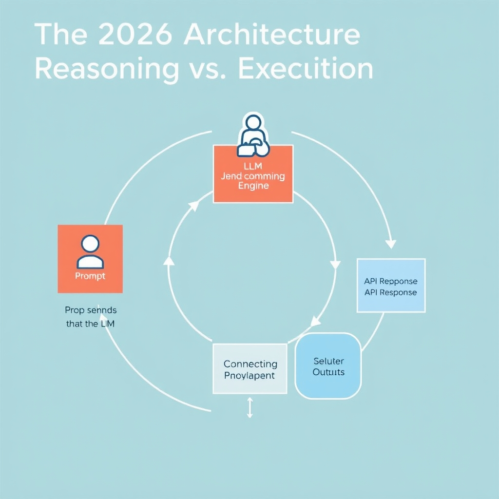
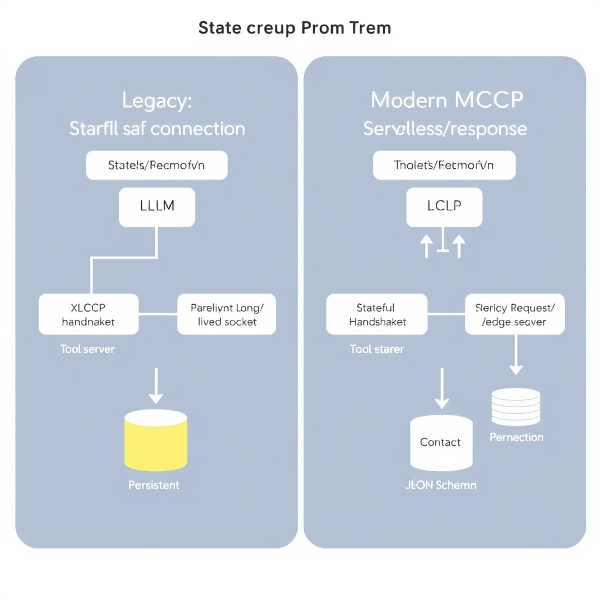
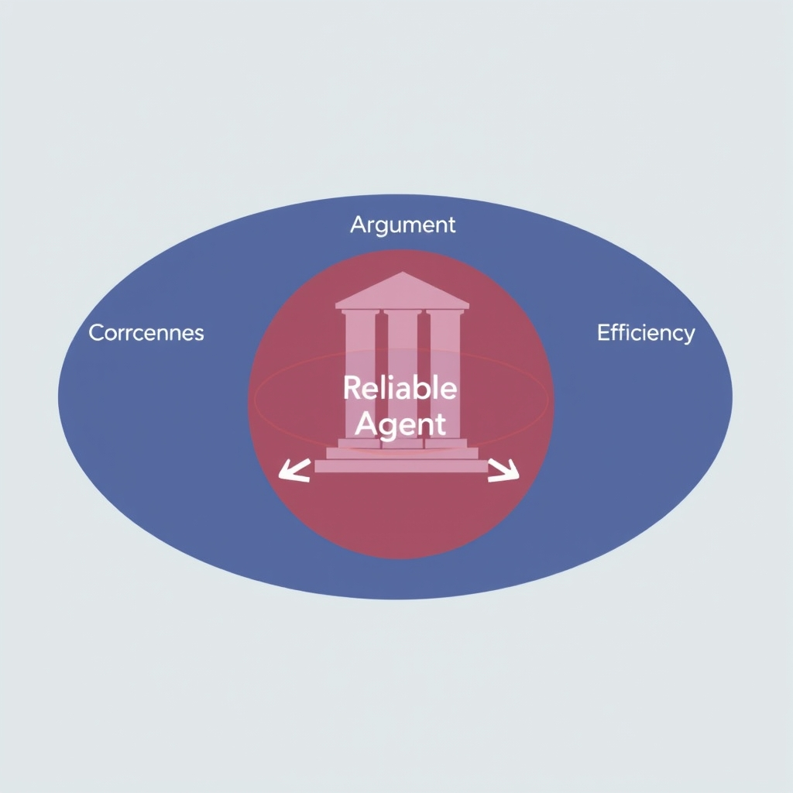

# Mastering LLM Tool Calling: The 2026 Architectural Standard

## The 2026 Architecture: Reasoning vs. Execution

The modern 2026 tool‑calling architecture treats the LLM as a pure reasoning engine while the surrounding application provides all "plumbing" needed to interact with external services.


*The 2026 architecture: The LLM acts as a reasoning engine, while the application handles the execution plumbing.*

**Separation of concerns**

- The model receives a user request and, based on its internal chain‑of‑thought, decides which tool is appropriate. It never reaches for network sockets or authentication credentials; its output is limited to a well‑defined JSON payload that describes the desired function call and its parameters.
- The application layer parses that payload, validates it against a strict schema, performs the actual HTTP request (or RPC), handles retries, pagination, and any required auth tokens, then feeds the raw response back to the model for final composition.

**The request‑response loop**

1. *User input* → LLM
1. LLM → **JSON command** (e.g., `{ "name": "search_documents", "arguments": { "query": "LLM security" } }`)
1. Application receives JSON, executes the corresponding API, collects the result.
1. Result → LLM
1. LLM incorporates the result into its answer to the user.

This deterministic hand‑off eliminates the risk of the model attempting to fabricate network calls, a behavior that would be both insecure and unpredictable.

**Why the model never executes the API directly**

- Execution requires context that the model cannot guarantee (valid credentials, rate‑limit state, network latency). Delegating execution to the application preserves security boundaries and allows centralized logging and monitoring.
- It also enables the application to enforce policies such as maximum payload size or prohibited endpoints, which the model cannot enforce on its own.

**Application responsibilities**

- **Authentication**: inject OAuth tokens, API keys, or signed headers before the call.
- **Retries & back‑off**: implement exponential back‑off strategies for transient failures, shielding the model from flaky services.
- **Pagination**: aggregate multi‑page results into a single response object, so the LLM receives a complete dataset without needing to manage cursors.

By keeping the LLM focused on reasoning and offloading all execution details to a robust application layer, developers achieve a predictable, auditable, and secure tool‑calling pipeline[^1].

\[^1\]: "What is LLM Function Calling for Integrations? (2026 Architecture Guide)" – Truto Blog, https://truto.one/blog/what-is-llm-function-calling-for-integrations-2026-guide

## Engineering Reliable Tool Schemas

**Enforcing Schema Discipline with `strict: true`**

OpenAI’s `strict: true` flag tells the model to *reject* any output that does not conform to the supplied JSON schema. In practice this eliminates the majority of hallucinated arguments because the model receives an immediate validation error instead of silently emitting malformed payloads. The flag works at the API layer, so the application never has to perform a secondary sanity check – the response is either a valid JSON object or an error that can be retried with a clarified prompt.

> *"strict: true guarantees the arguments match your schema"* \[[2](https://www.kommunicate.io/blog/openai-function-calling)\]

______________________________________________________________________

### Using Enums to Constrain the Output Space

When a parameter can only take a limited set of values, defining an `enum` in the schema reduces the model’s freedom to guess. This not only cuts down on hallucinations but also speeds up downstream validation because the allowed values are known ahead of time.

```json
{
  "name": "search_documents",
  "description": "Search a knowledge base.",
  "parameters": {
    "type": "object",
    "properties": {
      "query": {
        "type": "string",
        "description": "The free‑text search string."
      },
      "source": {
        "type": "string",
        "enum": ["internal", "external", "archived"],
        "description": "Which repository to query."
      }
    },
    "required": ["query", "source"]
  }
}
```

The `source` field can now only be *internal*, *external*, or *archived*, preventing the model from inventing unsupported identifiers.

> *"Use enum values for constrained parameters"* \[[1](https://deploybase.ai/articles/best-llm-for-function-calling-tool-use-comparison)\]

______________________________________________________________________

### Writing Descriptive Parameter Docs

Every property should carry a concise, human‑readable description. These strings act as the model’s guidebook, shaping the lexical choices it makes when populating the JSON. Ambiguous or missing descriptions leave the model to guess, which is a primary source of hallucination.

```json
"temperature": {
  "type": "number",
  "minimum": 0,
  "maximum": 1,
  "description": "Controls randomness of the search ranking; 0 = deterministic, 1 = highly stochastic."
}
```

Clear documentation narrows the semantic space the model explores, leading to higher fidelity calls.

> *"Add descriptions to every parameter"* \[[1](https://deploybase.ai/articles/best-llm-for-function-calling-tool-use-comparison)\]

______________________________________________________________________

### Enforcing Mandatory Inputs with `required`

The JSON Schema `required` array is the definitive way to tell the model which fields must be present. Without it, the model may omit critical arguments, forcing the application to fill defaults or raise errors downstream.

```json
"required": ["query", "source", "temperature"]
```

When the model attempts a call that lacks any of these keys, the `strict: true` validator will reject the payload, prompting a corrective turn.

> *"Mark required vs optional fields explicitly"* \[[1](https://deploybase.ai/articles/best-llm-for-function-calling-tool-use-comparison)\]

______________________________________________________________________

### Putting It All Together

A robust tool schema combines the three pillars above:

1. **`strict: true`** at the API level for hard enforcement.
1. **Enums** for any categorical argument.
1. **Rich descriptions** that act as a prompt for the model.
1. **`required` arrays** to guarantee essential data.

When these practices are applied consistently, the LLM’s output becomes a predictable, machine‑readable contract rather than a source of ad‑hoc text that must be parsed and corrected. This disciplined approach is the foundation of production‑grade tool‑calling systems in 2026.

## Infrastructure Standards: The Rise of MCP

### From Stateful Handshakes to Stateless Requests

In the first generation of tool‑calling protocols, the Model Context Protocol (MCP) behaved like a long‑lived TCP session: the LLM and the tool server exchanged a continuous stream of messages, each retaining context from the previous turn. While this made it easy to pass incremental state, it also forced developers to host persistent services, manage connection lifecycles, and handle back‑pressure manually.

**The 2026 shift** – documented in the August 2026 Claude release notes – recasts MCP as a pure request/response contract. The LLM now emits a single JSON payload describing the desired tool call; the application receives that payload, executes the call, and returns a response JSON. No lingering socket, no hidden state, and no need for the model to remember prior interactions. This stateless model aligns MCP with modern HTTP‑style APIs and unlocks two major deployment advantages.

______________________________________________________________________

### Serverless and Edge‑First Deployments

Because MCP no longer requires a persistent connection, tool servers can be hosted on **serverless platforms** (AWS Lambda, Cloudflare Workers, Azure Functions) or **edge networks** that bring compute closer to the user. The benefits are concrete:

- **Instant scaling** – each request spins up an isolated container, eliminating warm‑up latency and allowing the system to handle sudden spikes without pre‑provisioned capacity.
- **Reduced operational overhead** – developers no longer need to patch, monitor, or restart long‑running processes; the platform handles lifecycle management.
- **Lower latency** – edge nodes process the request geographically near the client, cutting round‑trip time for time‑sensitive tool calls such as real‑time translation or location‑aware data retrieval.

A practical example is a weather‑lookup tool that runs on Cloudflare Workers. The LLM emits `{ "tool": "weather", "params": { "city": "Paris" } }`; the edge worker fetches the forecast from a third‑party API and returns the JSON result in under 50 ms, far faster than a traditional VM‑hosted service.

______________________________________________________________________

### Standardized Protocols Reduce Integration Friction

MCP’s request/response shape is deliberately **schema‑driven**: every call must conform to a JSON Schema that defines the tool name, parameter types, and required fields. Because the contract is explicit, client libraries can auto‑generate request validators and type‑safe SDKs in any language. Teams can onboard a new tool by publishing its schema to a shared registry; the LLM runtime automatically discovers it without custom glue code.

Contrast this with legacy connectors, where developers wrote bespoke adapters for each API, often hard‑coding authentication flows, pagination logic, and error handling. Those adapters were brittle, duplicated effort across projects, and became a maintenance nightmare as APIs evolved.

______________________________________________________________________

### Legacy vs. Modern MCP Integration

| Aspect             | Legacy Custom Connectors                                 | Modern MCP (Request/Response)                                    |
| ------------------ | -------------------------------------------------------- | ---------------------------------------------------------------- |
| State Management   | Manual session handling, token refresh in process memory | Stateless; authentication tokens passed in request headers       |
| Deployment Model   | Long‑running servers on VMs or containers                | Serverless/edge functions, auto‑scaled per request               |
| Schema Enforcement | Ad‑hoc validation, often missing                         | JSON Schema + `strict: true` enforcement built into the protocol |
| Integration Effort | High – per‑API custom code                               | Low – publish schema, generate SDK, plug‑and‑play                |

By moving to a request/response MCP, organizations gain a **portable, cloud‑agnostic integration layer** that scales automatically and eliminates the hidden complexity that previously plagued production LLM tool‑calling pipelines.

*Source: Claude Updates by Anthropic – August 2026* ([https://releasebot.io/updates/anthropic/claude](https://releasebot.io/updates/anthropic/claude))


*Modern MCP shifts from stateful, long-lived connections to stateless, request/response interactions suitable for serverless deployment.*

## Evaluating Agentic Performance

### Tool Correctness – The Baseline Signal

Tool Correctness measures whether the agent selected the *right* tool for a given intent. In a multi‑step workflow, a single mis‑chosen API can cascade into downstream failures. For example, a travel‑booking assistant that calls a *flight‑search* endpoint instead of a *hotel‑search* endpoint will return irrelevant results, even if the subsequent steps execute flawlessly. By logging the tool identifier returned in the LLM’s JSON payload and comparing it against a ground‑truth map of intents → tools, we obtain a binary correctness score per step. Aggregating across a test suite yields the primary accuracy metric for the agent’s decision‑making layer.


*Multi-dimensional evaluation metrics provide a granular view of agent performance beyond simple accuracy.*

### Argument Correctness – Enforcing Schema Adherence

Argument Correctness evaluates whether the parameters supplied to a tool conform to its declared JSON schema. Strict schema enforcement (e.g., `"strict": true`) reduces hallucinations by constraining the model’s output space. An evaluation harness parses the LLM‑generated arguments and validates them against the tool’s OpenAPI‑style definition. Misspelled field names, type mismatches, or missing required fields are counted as argument errors. This metric directly reflects the quality of the model’s *reasoning* about the tool’s contract and is essential for reliable execution.

### Step Efficiency – Cost and Latency Optimisation

Step Efficiency quantifies how many *useful* steps the agent needed to achieve the target outcome. Redundant calls—such as repeatedly querying a weather service for the same location—inflate latency and API costs. By instrumenting each step with timestamps and cost tags, we can compute the ratio of useful steps to total steps. A lower ratio indicates a more efficient agent. In production, this metric guides pruning of unnecessary reasoning loops and informs prompt refinements that encourage more direct tool usage.

### Beyond Simple Accuracy

Traditional accuracy (e.g., exact match of final answer) masks failures in the intermediate reasoning process. An agent might produce the correct final text while invoking the wrong tools or passing malformed arguments, leading to hidden brittleness that surfaces under load or when external APIs change. Multi‑dimensional metrics—Tool Correctness, Argument Correctness, and Step Efficiency—provide a granular view of where the agent succeeds or falters, enabling targeted improvements and more trustworthy deployments.

> **Reference**: "Effective LLM agent evaluation in 2026 requires measuring tool correctness, argument correctness, and step efficiency to prevent failures in complex, multi-step agent workflows" – [Confident AI Blog](https://www.confident-ai.com/blog/llm-agent-evaluation-complete-guide)