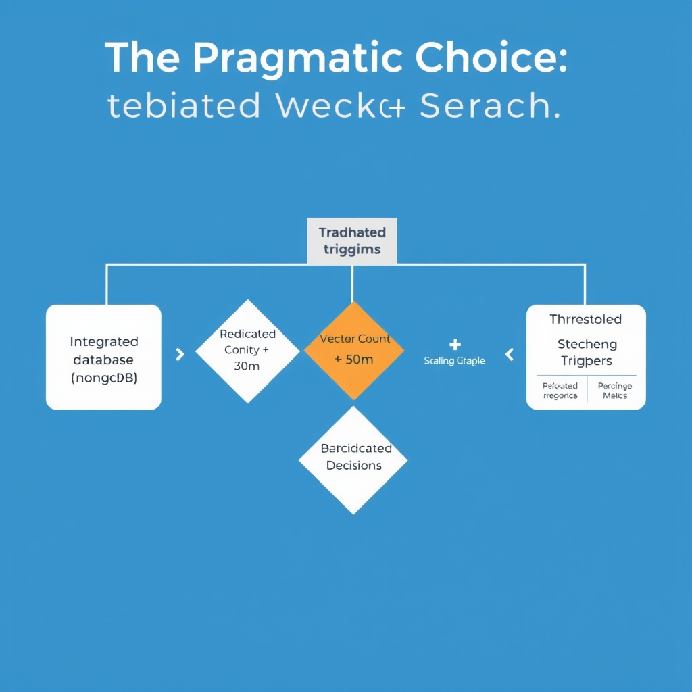
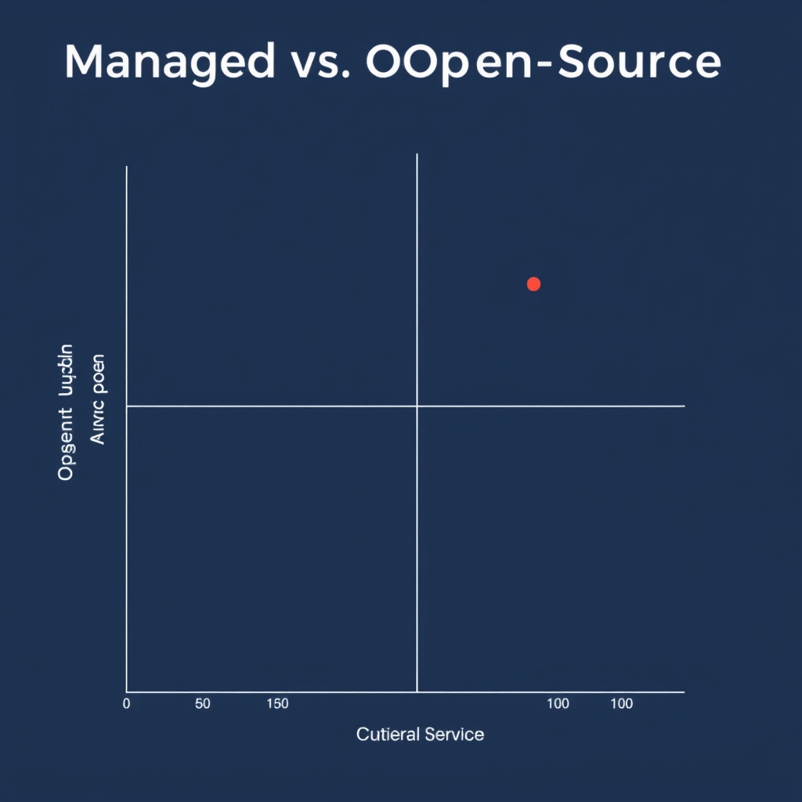
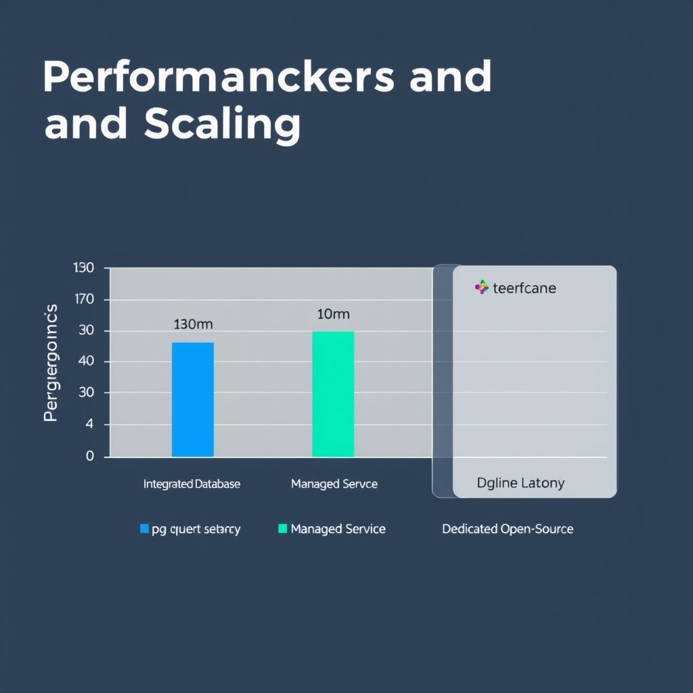

# Navigating the Vector Database Landscape in 2026

## The Evolution of Vector Infrastructure

Vector databases have become the backbone of Retrieval‑Augmented Generation (RAG) and large language model (LLM) pipelines. In a typical RAG flow, raw documents are embedded into high‑dimensional vectors, stored, and later queried to retrieve the most semantically similar passages for prompt construction. For LLM‑driven applications—semantic search, recommendation, or few‑shot inference—the same vector index supplies low‑latency nearest‑neighbor results that keep the model’s context window focused on relevant information.

During the early AI boom (2020‑2022), vector stores were experimental add‑ons, often built as ad‑hoc extensions to key‑value caches or plain file systems. Teams stitched together custom indexing scripts, relied on in‑memory libraries, and accepted flaky performance as a trade‑off for rapid prototyping. By 2024‑2025, the market coalesced around purpose‑built vector engines that offered persistent storage, ACID‑compatible snapshots, and built‑in support for approximate nearest neighbor (ANN) algorithms such as HNSW and IVF‑PQ. This shift enabled organizations to move from proof‑of‑concept notebooks to production services that handle millions of queries per day with SLA‑grade latency.

Choosing the right storage layer now matters as much as the embedding model itself. Persistent, disk‑backed vector stores decouple vector data from volatile compute, allowing independent scaling of storage and inference nodes. Moreover, storage decisions affect long‑term costs: columnar formats (e.g., Parquet) excel at batch re‑indexing, while log‑structured merge‑tree (LSM) engines provide efficient incremental updates. Aligning the storage architecture with expected data growth—whether a static corpus of a few hundred thousand vectors or a continuously expanding knowledge base of billions—prevents costly migrations later and ensures the vector layer can sustain the AI workload as the organization scales.

## The Pragmatic Choice: Integrated Vector Search

### Benefits of pgvector and MongoDB Atlas for Early‑Stage Projects

- **Leverage existing relational or document stacks** – Teams already using PostgreSQL or MongoDB can add the `pgvector` extension or Atlas Vector Search, avoiding the need for a separate service. This can reduce the need for additional network topology, DNS entries, or credential stores.
- **Unified query language** – Vector similarity can be expressed alongside SQL (`SELECT … ORDER BY embedding <=> query_vector LIMIT 10`) or MongoDB’s aggregation pipeline, allowing retrieval of metadata and nearest‑neighbors in a single round‑trip.
- **Cost‑effective scaling** – Because storage and compute are already provisioned for the primary database, adding vector columns typically incurs modest additional I/O. For small proof‑of‑concepts, the incremental cost is often negligible compared with a dedicated vector store.
- **Simplified DevOps** – Monitoring, backups, and security policies are already in place for the transactional database, so adding vector capabilities does not introduce a large new operational surface, which is valuable for small teams.

> The consolidation of vector search into PostgreSQL (pgvector) and MongoDB is a notable 2026 trend, as reported by Yugabyte [2026](https://www.yugabyte.com/key-concepts/why-you-should-use-vector-databases-for-llm-applications).

### Reducing Operational Overhead Accelerates Time‑to‑Market

1. **Single deployment pipeline** – CI/CD workflows that already build and migrate PostgreSQL schemas can include a `CREATE EXTENSION pgvector;` step, avoiding a parallel pipeline for a separate vector service.
1. **Fewer moving parts** – Debugging latency issues is confined to one database instance, eliminating the need to coordinate version compatibility between a vector engine and a transactional store.
1. **Rapid iteration on data models** – Because vector columns live in the same table as business data, developers can experiment with different embedding sizes or distance metrics and immediately observe the impact on downstream queries.
1. **Speedy onboarding** – Engineers familiar with SQL or MongoDB can start writing similarity queries without learning a new API, shortening the learning curve and product launch timeline.

Collectively, these factors can compress a development cycle that might otherwise take months (when provisioning a dedicated vector cluster, configuring networking, and establishing observability) to weeks or even days.

### When Integrated Solutions Reach Their Limits

| Indicator                    | Approximate Threshold                          | Impact if Exceeded                                                                                                                                     |
| ---------------------------- | ---------------------------------------------- | ------------------------------------------------------------------------------------------------------------------------------------------------------ |
| **Vector count**             | > 5‑10 million vectors (depending on hardware) | Index size grows beyond RAM, causing disk‑based lookups and latency spikes (> 100 ms per query).                                                       |
| **Query concurrency**        | > 200 QPS with low‑latency (\< 10 ms) SLAs     | PostgreSQL’s connection pool and background writer become bottlenecks; dedicated stores with sharding handle higher parallelism more gracefully.       |
| **Embedding dimensionality** | > 1,024 dimensions                             | Index construction and distance calculations become CPU‑bound; GPU‑accelerated engines (e.g., Milvus) outperform integrated databases.                 |
| **Advanced ANN algorithms**  | Need for HNSW or IVF‑PQ with custom tuning     | pgvector currently offers only basic L2/cosine indexes; specialized stores provide richer ANN configurations and better recall‑performance trade‑offs. |

When any of these signals appear—particularly sustained latency above 50 ms for user‑facing features—teams should evaluate migrating to a purpose‑built vector database. The migration path is straightforward: export vectors to a format like `JSONL` or a FAISS index, spin up a managed service (e.g., Pinecone) or self‑hosted Milvus, and update the application layer to query the new store while retaining the original transactional database for metadata.

In practice, many projects remain comfortable on pgvector or MongoDB Atlas up to a few million vectors and moderate traffic. Crossing the thresholds above often makes the performance benefits of a dedicated vector store outweigh the operational simplicity of an integrated approach.

*A decision framework for determining when your application has outgrown integrated vector search capabilities.*

## Managed vs. Open-Source: Choosing Your Path

### Managed vs. Open‑Source: Choosing Your Path

**Pinecone – Zero‑Ops Managed Service**

*The trade-off landscape: Managed services prioritize ease of use, while open-source platforms offer maximum architectural control.*

Pinecone is positioned as the de‑facto managed vector store for production Retrieval‑Augmented Generation (RAG) workloads in 2026, offering a serverless, zero‑ops experience that abstracts away cluster provisioning, scaling, and hardware maintenance【https://iternal.ai/insights/best-vector-databases-2026】. Because these capabilities are delivered as a fully managed service, the operational overhead is minimal: there is no need to patch the underlying database, monitor node health, or manage backup schedules.

*When to favor Pinecone*:

- Early‑stage projects that need to spin up a vector index within minutes.
- Teams without dedicated DevOps resources for storage.
- Use‑cases where predictable latency and SLA guarantees are required out‑of‑the‑box.

**Open‑Source Alternatives – Milvus, Weaviate, and Qdrant**

Milvus, Weaviate, and Qdrant are the most widely adopted open‑source vector databases for production use【https://lakefs.io/blog/best-vector-databases】. Each offers a distinct blend of flexibility and ecosystem integration:

| Feature                   | Milvus                                           | Weaviate                                                        | Qdrant                                             |
| ------------------------- | ------------------------------------------------ | --------------------------------------------------------------- | -------------------------------------------------- |
| **Primary Language**      | C++/Go (core), Python SDK                        | Go (core), GraphQL & REST APIs                                  | Rust (core), gRPC & REST                           |
| **GPU Support**           | Native CUDA acceleration for ANN indexes         | Relies on external compute for GPU workloads                    | CPU‑only, optimized for low‑latency queries        |
| **Schema & Metadata**     | Collections with optional scalar fields          | Schema‑first, supports hybrid (vector + property) queries       | Collections with payload filtering                 |
| **Community & Ecosystem** | Strong community, integrations with Spark, Flink | Emphasizes semantic search, integrates with OpenAI, HuggingFace | Growing community, focuses on Rust‑centric tooling |

*Note: feature details are based on publicly available project documentation and the comparative overview in the cited source.*

Because these projects are self‑hosted, teams generally retain full control over deployment topology, data residency, and custom extensions. For example, Milvus can be deployed on Kubernetes, including GPU‑enabled nodes, while Weaviate’s GraphQL layer enables seamless semantic queries that combine vector similarity with property filters.

**Trade‑offs: Licensing, Operational Burden, and Control**

| Dimension                   | Managed (Pinecone)                                                     | Open‑Source (Milvus/Weaviate/Qdrant)                                                                                                          |
| --------------------------- | ---------------------------------------------------------------------- | --------------------------------------------------------------------------------------------------------------------------------------------- |
| **Licensing Cost**          | Pay‑as‑you‑go pricing; cost scales with request volume and storage.    | No licensing fees; only infrastructure spend (cloud VMs, storage, networking).                                                                |
| **Operational Overhead**    | Minimal – provider handles upgrades, scaling, backups.                 | High – requires provisioning, monitoring, patching, and capacity planning.                                                                    |
| **Control & Customization** | Limited to API surface and configuration knobs exposed by the service. | Full access to source code, ability to modify indexing algorithms, integrate custom plugins, or comply with strict data‑sovereignty policies. |
| **Vendor Lock‑in**          | Moderate – migration requires data export and re‑indexing.             | Low – data can be moved between compatible open‑source stores with standard export formats (e.g., JSONL, Parquet).                            |

In practice, the decision often hinges on team expertise and project timeline. A startup with a small engineering team may accept the higher per‑query cost of Pinecone to accelerate time‑to‑market, while an enterprise with strict compliance requirements may invest in a self‑hosted Milvus cluster to leverage GPU acceleration and retain full data governance.

**Practical Guidance**

1. **Prototype Quickly** – Use Pinecone’s free tier or trial to validate RAG pipelines before committing to self‑hosting.
1. **Benchmark Early** – Run a representative query load against a local Milvus or Qdrant instance; compare latency, throughput, and cost against Pinecone’s published SLA.
1. **Assess Governance** – If regulations demand on‑prem storage or custom encryption, prioritize an open‑source stack.
1. **Plan Migration Path** – Design your data ingestion layer to be storage‑agnostic (e.g., emit vectors to a message queue) so you can switch from a managed service to a self‑hosted solution without rewriting core logic.

By weighing these dimensions—cost, operational effort, and control—you can select the vector store that aligns with both current project constraints and future scaling ambitions.

## Performance Benchmarks and Scaling

*Performance comparison: Dedicated engines like Qdrant typically offer lower latency than integrated database extensions.*

### Low‑latency performance: Qdrant in the spotlight

A Q1 2026 benchmark of ten popular vector stores measured p50 query latency for a 1 million‑vector collection. **Qdrant recorded the fastest result – 4 ms per query**【https://www.salttechno.ai/datasets/vector-database-performance-benchmark-2026】. This places Qdrant comfortably within the sub‑10 ms envelope that many real‑time retrieval use‑cases (e.g., conversational RAG) require. The benchmark used a typical ANN index (HNSW) on commodity CPU hardware, indicating that low‑latency responses are achievable without specialized accelerators【https://www.salttechno.ai/datasets/vector-database-performance-benchmark-2026】.

### Milvus and GPU‑accelerated, enterprise‑scale workloads

Milvus provides optional GPU‑accelerated indexing pipelines (e.g., IVF‑PQ on NVIDIA GPUs). By off‑loading vector insertion and search to GPUs, Milvus can reduce CPU bottlenecks for datasets that grow into the tens or hundreds of millions of vectors. This design makes it a good fit for organizations that already operate GPU clusters for model inference and want to reuse that hardware for vector search.

### When to migrate from an integrated solution to a dedicated store

Below is a practical decision framework that builds on the performance observations above. Use it as a checklist during the lifecycle of your AI product:

| Trigger condition                                                        | Typical symptom                                                             | Recommended action                                                                                                             |
| ------------------------------------------------------------------------ | --------------------------------------------------------------------------- | ------------------------------------------------------------------------------------------------------------------------------ |
| **Query latency > 10 ms (p50)** on a production workload                 | Users experience noticeable lag in chat or search responses                 | Evaluate a low‑latency specialist such as Qdrant; run a side‑by‑side test with your current integrated store (e.g., pgvector). |
| **Vector count exceeds 10 M** and indexing time grows super‑linearly     | Daily ingestion pipelines start missing SLA windows                         | Consider Milvus or another GPU‑enabled store that can parallelise indexing across multiple GPUs.                               |
| **CPU utilization > 80 %** during peak query bursts                      | Scaling the underlying relational DB becomes cost‑prohibitive               | Off‑load vector search to a dedicated engine to free CPU cycles for transactional workloads.                                   |
| **Operational complexity rises** (e.g., custom sharding, backup scripts) | Engineering time spent on vector‑specific ops outweighs product development | Adopt a managed service (Pinecone, etc.) or a self‑hosted specialist with built‑in clustering to reduce ops overhead.          |

**Step‑by‑step migration**

1. **Profile** your current integrated search (measure latency, throughput, resource usage).
1. **Pilot** the candidate specialist on a representative subset of data (e.g., 1 M vectors).
1. **Benchmark** side‑by‑side using the same query workload; focus on p50/p95 latency and cost per query.
1. **Assess** operational impact: deployment complexity, monitoring, backup strategy.
1. **Roll out** incrementally—start with a read‑only replica, then switch write paths once stability is confirmed.

By grounding the migration decision in concrete performance thresholds and operational signals, teams can avoid premature over‑engineering while still having a clear path to scale when the integrated approach reaches its limits.

## Conclusion: Future-Proofing Your AI Stack

The journey from prototype to production AI systems rarely requires a heavyweight vector store from day one. **Start simple, scale later** – begin with an integrated solution such as pgvector or MongoDB Atlas, which lets teams ship features quickly while keeping operational overhead low. This approach buys time to validate data quality, query patterns, and business value before committing to dedicated infrastructure.

When it’s time to reassess, evaluate the decision against two practical axes:

- **Team capacity** – Does the organization have the expertise to manage a self‑hosted cluster, handle backups, and tune hardware for GPU‑accelerated workloads?
- **Performance needs** – Are latency or throughput requirements approaching the limits observed in benchmark studies for integrated stores? If so, a migration to a specialized engine (e.g., Milvus, Qdrant, or a managed service like Pinecone) becomes justified.

Looking ahead, the vector database ecosystem has matured from niche research tools into a layered market. Managed services now offer zero‑ops experiences, while open‑source projects provide plug‑and‑play extensions for existing databases. This diversity means teams can adopt a solution that matches their current maturity level and evolve it as their AI workloads grow, ensuring a future‑proof stack without over‑engineering from the start.