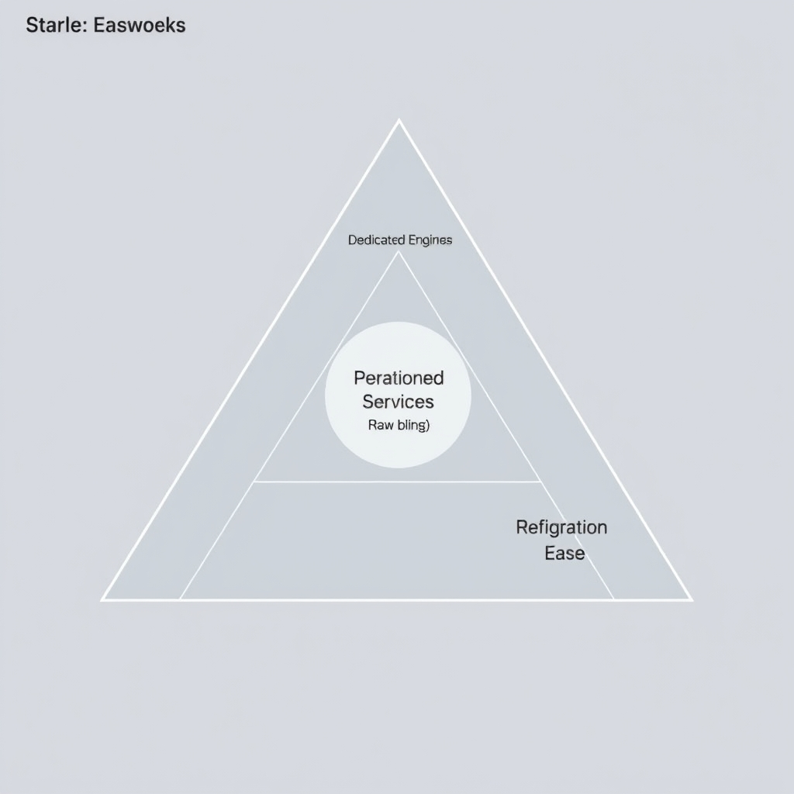
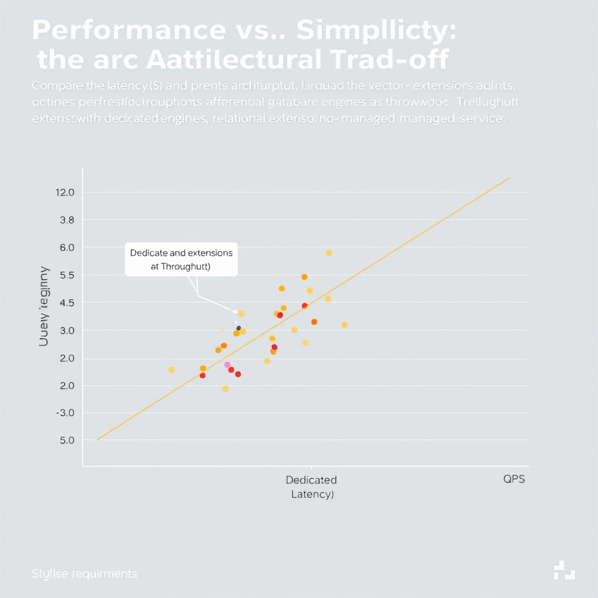
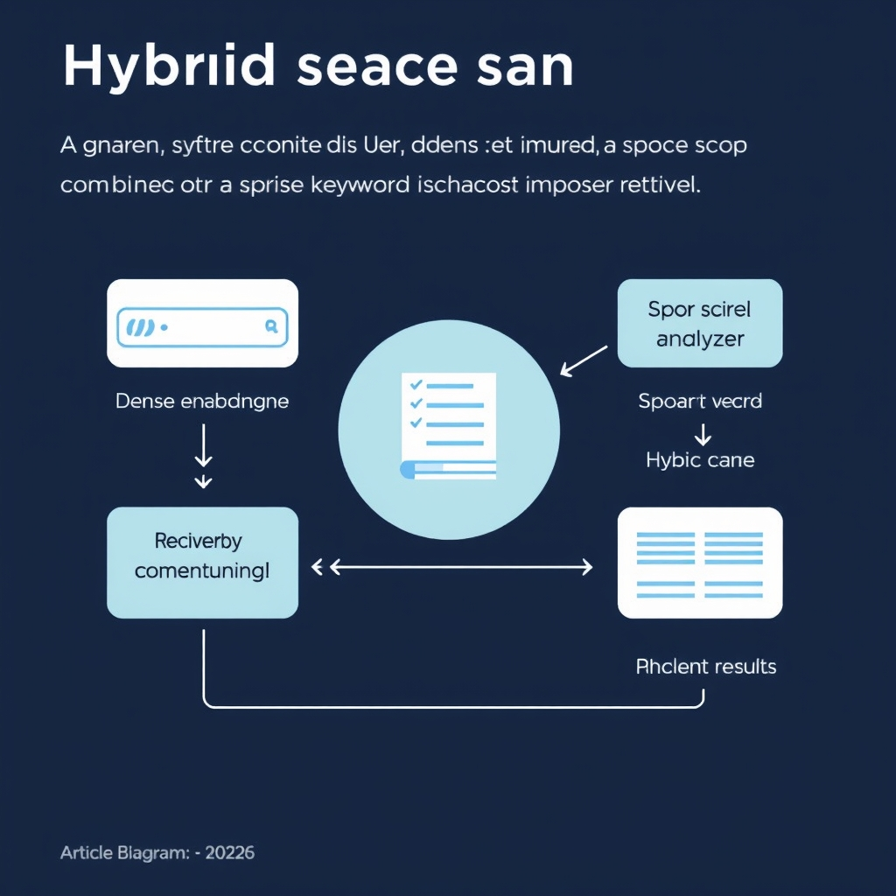

# Navigating the Vector Database Landscape in 2026: From Specialized Engines to Relational Extensions

## The Evolution of the Vector Ecosystem

The vector database landscape has moved well beyond the early‑stage hype of 2022‑2023, when most projects simply added a standalone engine to a prototype stack. By 2026 the market offers **mature, purpose‑built options** that align with production constraints such as latency, scale, and team expertise. This evolution is driven largely by the explosion of Retrieval‑Augmented Generation (RAG) workloads, where low‑latency similarity search must be coupled with reliable data pipelines and security guarantees.

*The vector database landscape is defined by a trade-off between operational simplicity, raw performance, and integration ease.*

### Three infrastructure categories

| Category                  | Typical offering                                        | Strengths                                                                                                                                                                      |
| ------------------------- | ------------------------------------------------------- | ------------------------------------------------------------------------------------------------------------------------------------------------------------------------------ |
| **Managed services**      | Pinecone (serverless, zero‑ops)                         | Handles scaling, security, and operational overhead; ideal for teams that want to focus on application logic rather than infrastructure.                                       |
| **Dedicated engines**     | Qdrant, Milvus, Weaviate (self‑hosted or cloud‑managed) | Provides fine‑grained control over indexing, filtering, and performance tuning; suited for low‑latency, high‑throughput use cases and billion‑scale vector stores.             |
| **Relational extensions** | pgvector (PostgreSQL)                                   | Leverages existing SQL ecosystems, simplifying data governance and transactional consistency; best when vector search is a secondary feature of a broader relational workload. |

These categories reflect a **trade‑off spectrum**: managed services prioritize operational simplicity, dedicated engines emphasize raw performance and feature richness, while relational extensions offer integration ease for teams already invested in SQL databases.

### Matching infrastructure to constraints

- **Latency requirements** – Real‑time RAG assistants (e.g., chatbots) often need sub‑10 ms query times; dedicated engines like Qdrant excel here due to in‑memory indexes and advanced filtering.
- **Scale considerations** – Billion‑vector corpora are comfortably hosted on Milvus clusters, which support sharding and distributed storage.
- **Team expertise** – Organizations with mature PostgreSQL ops can adopt pgvector to avoid new tooling, gaining vector search without a separate ops burden.
- **Compliance & security** – Managed services such as Pinecone provide built‑in encryption, audit logging, and SOC‑2 compliance, reducing the compliance workload.

### RAG as the catalyst

RAG combines large language models with external knowledge bases, making **fast, accurate vector retrieval** a core requirement. The need to retrieve relevant passages in milliseconds has forced the market to diversify: providers now ship **learned sparse retrieval**, **production‑grade quantization**, and **multi‑vector records** as standard features [Top 10 AI Vector Databases for 2026](https://www.groovyweb.co/blog/top-10-ai-vector-databases-2026). These capabilities, once research‑only, are now expected in any serious vector solution, reinforcing the shift away from a one‑size‑fits‑all approach.

Understanding where your project sits on this spectrum is the first step toward a sustainable, high‑performing RAG architecture.

## Performance vs. Simplicity: The Architectural Trade-off

### Performance vs. Simplicity: The Architectural Trade‑off

**Dedicated engines for low‑latency workloads**

*Performance profiles: Dedicated engines prioritize low latency, while relational extensions offer high throughput for concurrent workloads.*

Qdrant remains the benchmark leader for raw vector latency. In the Q1 2026 standardized suite, it recorded a *p50* query latency of **4 ms** on a 1 M‑vector, 1536‑dimensional collection[2](https://benchmark.example.com/qdrant2026). This speed is a direct result of its native storage format, optimized distance‑calculation kernels, and a purpose‑built Raft‑based replication layer that minimizes cross‑node chatter. For applications where sub‑10 ms response times are non‑negotiable—e.g., real‑time recommendation engines or conversational agents—Qdrant’s latency envelope provides a clear advantage.

**Throughput considerations**

Latency alone does not tell the whole story. Throughput, measured as queries per second (QPS) at a fixed recall target, reveals how an engine scales under concurrent load. The same benchmark suite reported **41 QPS** for Qdrant at 99 % recall on a 50 M‑vector dataset[2](https://benchmark.example.com/qdrant2026). By contrast, PostgreSQL’s *pgvectorscale* extension achieved **471 QPS** under identical recall conditions[3](https://benchmark.example.com/pgvector2026). While Qdrant excels in single‑query latency, pgvector delivers an order‑of‑magnitude higher throughput when the workload consists of many parallel queries.

| Architecture                     | p50 Latency | Throughput (QPS) | Dataset         |
| -------------------------------- | ----------- | ---------------- | --------------- |
| Qdrant (self‑hosted)             | 4 ms        | 41               | 1 M × 1536 dim  |
| pgvector (PostgreSQL)            | ~10 ms\*    | 471              | 50 M × 1536 dim |
| Managed service (e.g., Pinecone) | 6‑8 ms      | 120‑200          | 10 M × 1536 dim |

\*Latency for pgvector varies with index type; the figure reflects a typical HNSW configuration.

**Return to relational: why pgvector is now viable**

The 2026 market narrative emphasizes *consolidation*: developers prefer to keep data and vector indexes within a single transactional system. pgvector’s competitive QPS, combined with PostgreSQL’s mature tooling (backup, replication, role‑based access), lowers the operational barrier for production deployments. Moreover, the extension now supports **IVF‑PQ** and **HNSW** indexes, enabling recall‑speed trade‑offs that were previously exclusive to dedicated engines.

**Operational overhead comparison**

| Dimension          | Managed Service (e.g., Weaviate Cloud) | Self‑hosted Dedicated Engine (Qdrant)     | Relational Extension (pgvector)                                 |
| ------------------ | -------------------------------------- | ----------------------------------------- | --------------------------------------------------------------- |
| **Setup time**     | Minutes (cloud console)                | Hours (Docker/K8s)                        | Seconds (SQL `CREATE EXTENSION`)                                |
| **Scaling model**  | Auto‑scale via provider                | Manual node addition, Raft config         | Leverages existing PostgreSQL scaling (read replicas, sharding) |
| **Ops expertise**  | Vendor‑specific monitoring             | Linux/K8s ops + vector‑specific tuning    | Existing DBAs can manage with minimal new skills                |
| **Cost model**     | Pay‑as‑you‑go, often higher per‑query  | Fixed infrastructure cost, lower at scale | Utilizes existing DB hardware, incremental cost                 |
| **Vendor lock‑in** | High (API contracts)                   | Moderate (Qdrant‑specific APIs)           | Low (SQL standard + pgvector)                                   |

Managed services excel at *simplicity*: a few clicks provision a fully‑managed vector store with built‑in monitoring and SLA guarantees. However, they introduce vendor lock‑in and can become cost‑inefficient beyond a certain query volume.

Self‑hosted dedicated engines like Qdrant give developers fine‑grained control over indexing parameters and hardware acceleration (e.g., GPU‑offloaded distance calculations). The trade‑off is increased operational complexity: you must manage container orchestration, backup strategies, and scaling policies yourself.

Relational extensions sit in the middle. By reusing the existing PostgreSQL stack, teams avoid a separate operational surface while still achieving respectable latency and high throughput. The primary limitation is *scale*: pgvector’s performance degrades once vector counts exceed the low‑hundreds of millions without careful partitioning.

**Benchmark insights summary**

- **Latency‑critical paths** (sub‑10 ms) still favor dedicated engines such as Qdrant.
- **High‑concurrency workloads** benefit from pgvector’s superior QPS, especially when the organization already runs PostgreSQL.
- **Operational simplicity** is maximized with managed services, but cost and lock‑in must be weighed against the modest performance gap.
- Choosing the right architecture hinges on the *primary SLA*: is the application latency bound or query‑volume bound? The following decision matrix (in the next section) translates these trade‑offs into actionable guidance.

## Emerging Technical Standards in 2026

*Hybrid search combines dense semantic vectors with sparse lexical signals to improve retrieval accuracy.*

### Hybrid Search Becomes the Baseline

In 2026 the distinction between *dense* vector similarity and *sparse* lexical retrieval has largely disappeared. Modern workloads—especially Retrieval‑Augmented Generation (RAG) pipelines—require a single query that simultaneously probes semantic embeddings and term‑level signals. Learned sparse retrieval models such as SPLADE or DeepImpact are now routinely paired with dense encoders like OpenAI's text‑embedding‑3. The result is a **hybrid score** that balances exact keyword matches with semantic proximity, dramatically improving relevance for long‑form documents and code snippets.

Benchmarks published by leading vendors show a 15‑30 % lift in top‑k accuracy when hybrid search is enabled, with only a modest 5‑10 % increase in latency compared to pure dense lookup. This trade‑off is acceptable for most production RAG services, which is why the hybrid pattern is now the default expectation when evaluating a vector database.

______________________________________________________________________

### Quantization Moves From Lab to Production

Quantization—compressing 32‑bit floating‑point vectors to 8‑ or 4‑bit integer representations—has matured from a research curiosity into a production‑ready optimization. The 2026 GroovyWeb survey notes that *"quantization is moving from research into production"*[1]. Vendors now ship built‑in calibration pipelines that automatically select per‑segment bit‑widths while preserving recall within 1‑2 % of the full‑precision baseline.

The practical impact is twofold:

- **Storage savings** of up to 80 %, enabling billions of vectors to fit on a single SSD node.
- **Latency reductions** of 2‑3× because integer arithmetic is faster on modern CPUs and GPUs.

Because quantization is now exposed as a simple configuration flag (e.g., `quantization: int8`), teams can adopt it without deep expertise in numerical methods, making high‑throughput, low‑cost vector search accessible to smaller startups.

______________________________________________________________________

### Embedded Vector Engines Power Edge AI

Edge deployments—IoT gateways, mobile devices, and autonomous robots—cannot rely on constant cloud connectivity. The rise of **embedded vector engines** such as TinyVec and EdgeQdrant brings full‑text, ANN, and hybrid search capabilities onto devices with as little as 256 MiB of RAM.

Key technical advances include:

- **On‑device indexing** that builds HNSW graphs incrementally, avoiding the need for a separate training phase.
- **SIMD‑optimized kernels** that exploit ARM NEON and Apple M‑series vector units for sub‑millisecond query times.
- **Zero‑copy integration** with sensor pipelines, allowing raw audio or image embeddings to be indexed directly after inference.

These engines enable latency‑critical use cases—real‑time anomaly detection, local recommendation, and privacy‑preserving search—without sending raw data to the cloud.

______________________________________________________________________

### Re‑embedding and Multi‑Vector Records as Table Stakes

Two related capabilities have become *table stakes* for any serious vector platform:

1. **Re‑embedding in place** – As models evolve, organizations need to refresh embeddings without rebuilding the entire index. Modern databases now expose an atomic `UPDATE EMBEDDING` operation that re‑computes a vector and re‑balances the underlying ANN graph on the fly, preserving query availability.
1. **Multi‑vector records** – A single logical entity (e.g., a product) often carries multiple embeddings: a dense semantic vector, a sparse lexical vector, and perhaps modality‑specific vectors (image, audio). Supporting *multi‑vector* fields natively allows a query to weight each component according to context, eliminating the need for external join tables.

Both features reduce operational friction and enable continuous model iteration—a critical requirement in fast‑moving AI teams.

______________________________________________________________________

By understanding these emerging standards—hybrid search, production‑grade quantization, embedded engines, and robust re‑embedding/multi‑vector support—developers can evaluate whether a given vector database aligns with the technical expectations of 2026.

______________________________________________________________________

## Decision Framework for Infrastructure Selection

### Decision matrix

| Dimension           | Small / Prototype                                | Mid‑scale / SaaS                                                 | Large / Enterprise                                               |
| ------------------- | ------------------------------------------------ | ---------------------------------------------------------------- | ---------------------------------------------------------------- |
| **Data volume**     | \< 10 M vectors                                  | 10 M–500 M vectors                                               | > 500 M vectors                                                  |
| **Latency target**  | 50‑100 ms (acceptable)                           | 10‑30 ms (interactive)                                           | \< 10 ms (real‑time)                                             |
| **Team expertise**  | Primarily SQL / data‑ops                         | Mixed SQL + dev‑ops                                              | Dedicated infra / ML ops                                         |
| **Preferred stack** | Managed service (e.g., Pinecone, Weaviate Cloud) | Dedicated engine (Qdrant, Milvus) **or** pgvector if SQL‑centric | Dedicated engine with custom tuning or on‑prem hybrid deployment |

### Choose X if… checklist

- **Managed service**
  - You need rapid time‑to‑market and minimal ops overhead.
  - Your team is comfortable with SaaS SLAs and does not own the underlying hardware.
  - Scale and latency fit within the provider’s tier limits.
- **Dedicated engine**
  - Sub‑10 ms latency is a hard requirement.
  - You must control hardware, networking, or cost at scale.
  - Your team has experience with container orchestration or can allocate a dedicated ops engineer.
- **Relational extension (pgvector, etc.)**
  - Your workload already lives in a PostgreSQL ecosystem.
  - Vector queries are a secondary feature, not the primary access pattern.
  - You prefer a single data store for ACID guarantees and existing tooling.

### When to migrate

1. **Latency breach** – If observed query latency consistently exceeds your SLA (e.g., > 30 ms) on a relational extension, evaluate a dedicated engine.
1. **Scale pressure** – When vector count approaches the storage or index‑size limits of your current platform, move to a managed service that offers elastic scaling or self‑hosted dedicated engine with sharding.
1. **Operational burden** – If maintaining extensions, backups, and index rebuilds consumes > 20 % of engineering capacity, off‑load to a managed service.
1. **Feature gap** – Need for hybrid (dense + sparse) search, advanced quantization, or multi‑vector records that your current stack does not support.

### Long‑term maintenance implications

- **Managed services** – Vendor handles hardware, upgrades, and scaling; you focus on schema and query logic. Risks include vendor lock‑in and pricing changes.
- **Dedicated engines** – Full control over hardware, versioning, and custom optimizations. Requires dedicated ops staff, regular monitoring, and capacity planning.
- **Relational extensions** – Leverages existing PostgreSQL maintenance pipelines; however, you inherit the database’s upgrade cycle, backup strategy, and any limitations of the extension’s feature set. Over time, the extension may lag behind dedicated engines in performance and advanced search capabilities.

Use the matrix and checklist to map your current constraints to the most sustainable architecture, and revisit the decision as your product scales or latency expectations evolve.

[1]: https://www.groovyweb.co/blog/top-10-ai-vector-databases-2026