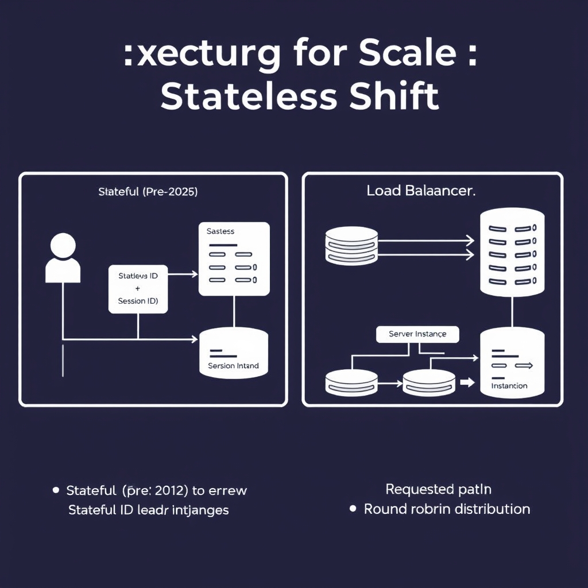
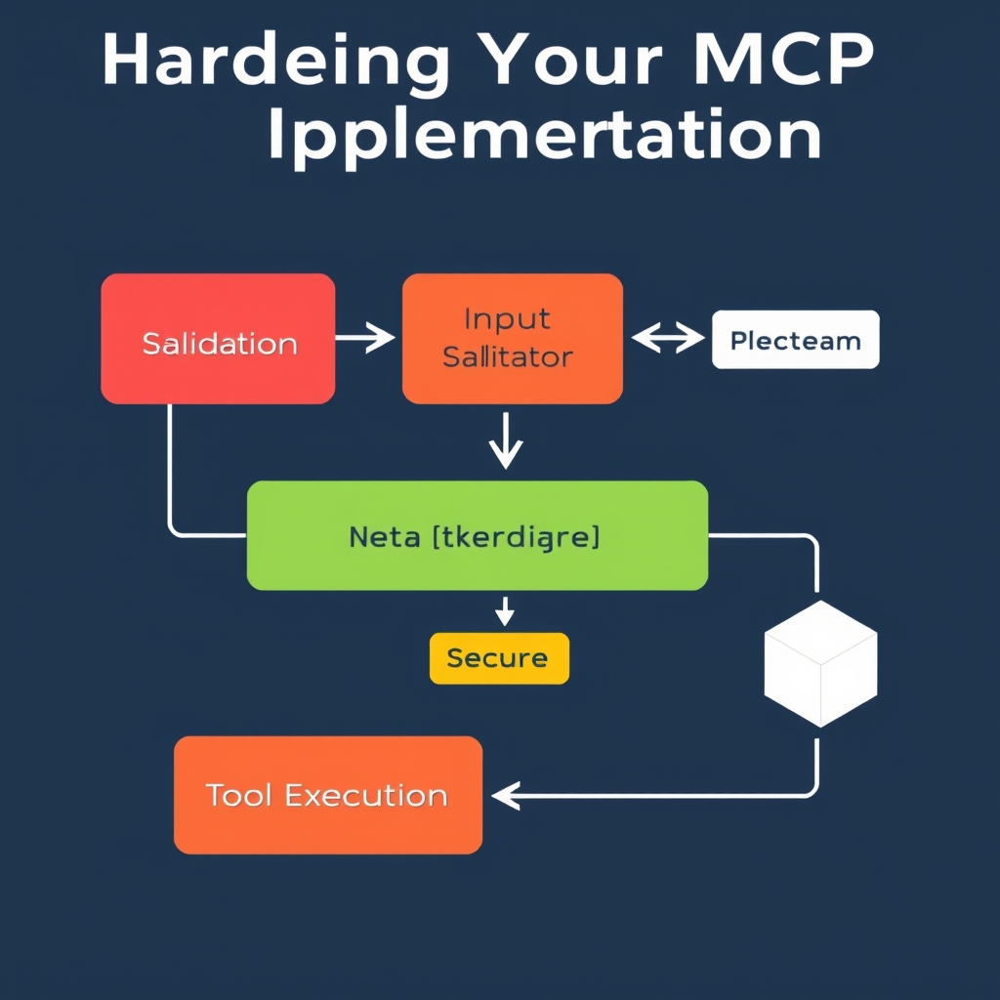

# Scaling AI Integration: Mastering the Stateless Model Context Protocol (MCP)

## The Evolution of MCP: From Local Utility to Enterprise Standard

### Brief History of MCP

The Model Context Protocol (MCP) was introduced by Anthropic in November 2024 as a lightweight, stateful mechanism for AI agents to invoke external tools during a single session. Early adopters used it for local development and proof‑of‑concept demos, leveraging the `Mcp-Session-Id` header to pin a client to a specific server instance.

### Limitations of the Original Stateful Design

While convenient for sandboxed experiments, the session‑pinned model imposed several constraints:

- **Scalability**: Requests had to hit the same backend, preventing horizontal scaling behind load balancers.
- **Reliability**: Server crashes or network partitions broke the session, forcing clients to restart the entire workflow.
- **Operational overhead**: Managing session lifetimes added complexity to deployment pipelines.
  These drawbacks became untenable as organizations moved from prototype to production‑grade AI services.

### Why the Industry Shift Required a Stateless Protocol

The rise of enterprise AI workloads—continuous inference, multi‑agent orchestration, and high‑throughput tool usage—demanded a protocol that could **scale out** without coupling a client to a single node. The July 28 2026 specification removed the `Mcp-Session-Id` header and eliminated the initialization handshake, allowing any server instance to handle any request [The biggest MCP spec update ships July 28](https://workos.com/blog/mcp-2026-spec-agent-authentication). This stateless approach aligns MCP with existing HTTP load‑balancing patterns, reduces latency, and simplifies failover handling.

### Major Players Backing the Standard

Adoption accelerated when the three AI giants—Microsoft, OpenAI, and Google—publicly endorsed MCP as the de‑facto integration layer for their agent platforms [6 Model Context Protocol alternatives to consider in 2026](https://www.merge.dev/blog/model-context-protocol-alternatives). Their involvement brings extensive engineering resources, contributes reference implementations, and drives community tooling, cementing MCP’s transition from a niche utility to an enterprise‑ready standard.

Together, these forces set the stage for the 2026‑07‑28 stateless release, positioning MCP as the backbone for secure, scalable AI‑to‑tool communication.

## Architecting for Scale: The Stateless Shift

### Removal of the `Mcp-Session-Id` header and initialization handshakes

The July 28 2026 MCP specification eliminates the `Mcp-Session-Id` header that previously bound a client to a single server instance. The handshake that exchanged a session token at connection start is also gone. As a result, each HTTP request is self‑contained: the payload carries all context needed for the tool execution, and the server can process it without consulting any in‑memory session store. This change is documented in the spec update that states *"The Mcp-Session-Id header is gone. The protocol‑level session that pinned a client to a specific server instance is removed…"*【https://workos.com/blog/mcp-2026-spec-agent-authentication】.


*The transition to a stateless architecture allows MCP services to scale horizontally behind standard load balancers, removing the need for sticky sessions.*

### Statelessness unlocks standard load‑balancer deployment

Because no request depends on prior state, any replica behind a load balancer can answer it. Traditional stateful MCP deployments required *sticky* routing (session affinity) to guarantee that subsequent calls hit the same instance. With the new stateless contract, you can place a simple L4/L7 load balancer (e.g., NGINX, Envoy, or a cloud‑provider LB) in front of a pool of MCP workers.

```nginx
# Example NGINX upstream for a stateless MCP service
upstream mcp_backend {
    server mcp-01.example.com:8080;
    server mcp-02.example.com:8080;
    server mcp-03.example.com:8080;
}

server {
    listen 80;
    location /mcp {
        proxy_pass http://mcp_backend;
        proxy_set_header Host $host;
        # No need for sticky session directives
    }
}
```

The configuration above forwards every `/mcp` request to the next healthy backend in a round‑robin fashion. No `sticky` module is required, simplifying operations and reducing latency.

### Old *pinned* model vs. new *any‑instance* handling

| Feature              | Pinned (pre‑2026)                                         | Any‑instance (post‑2026)                            |
| -------------------- | --------------------------------------------------------- | --------------------------------------------------- |
| Session header       | `Mcp-Session-Id` required                                 | Header removed                                      |
| Handshake            | One‑time init request → session token                     | No handshake; each request is independent           |
| Load‑balancer config | Sticky routing needed                                     | Standard round‑robin or least‑connections           |
| Failure recovery     | Session loss on instance crash → client must re‑handshake | Automatic failover; in‑flight requests simply retry |

In the pinned model, a client that lost its session due to a server restart had to repeat the handshake, causing a brief outage. The any‑instance model treats every request as a fresh transaction, eliminating that window of unavailability.

### Implications for horizontal scaling and high availability

1. **Linear scalability** – Adding a new MCP worker is a matter of registering it with the load balancer. No coordination layer is needed to propagate session state.
1. **Zero‑downtime deployments** – Rolling updates can replace instances one‑by‑one; in‑flight requests are automatically routed to the remaining healthy nodes.
1. **Improved HA** – If a node fails, the load balancer instantly redirects traffic to the surviving pool, preserving request throughput without client‑side error handling.
1. **Resource isolation** – Stateless workers can be containerized (Docker, Kubernetes) and autoscaled based on CPU or request latency metrics. For example, a Kubernetes `HorizontalPodAutoscaler` can target the `mcp-worker` deployment without worrying about session affinity:

```yaml
apiVersion: autoscaling/v2
kind: HorizontalPodAutoscaler
metadata:
  name: mcp-worker-hpa
spec:
  scaleTargetRef:
    apiVersion: apps/v1
    kind: Deployment
    name: mcp-worker
  minReplicas: 3
  maxReplicas: 20
  metrics:
  - type: Resource
    resource:
      name: cpu
      target:
        type: Utilization
        averageUtilization: 70
```

5. **Simplified security posture** – With no session identifier traveling over the wire, the attack surface related to session hijacking disappears. The remaining security focus shifts to input validation and transport‑layer hardening, which are covered in the next section.

Overall, the stateless MCP specification transforms the protocol from a niche, developer‑only tool into a production‑ready service that can be scaled horizontally, deployed behind any standard load balancer, and managed with familiar DevOps patterns.

## Hardening Your MCP Implementation


*A robust security posture for MCP requires multi-layered validation to prevent command injection and SSRF vulnerabilities.*

### Mitigating Command Injection

The stateless MCP spec removes the `Mcp-Session-Id` header, meaning any server instance can execute a tool request. This flexibility also expands the attack surface: an agent can supply a malicious payload that, if passed directly to a shell, results in command injection. The most reliable mitigation is to avoid string‑based command construction altogether. Use language‑specific APIs that accept an argument list rather than a single command string.

```ts
// TypeScript example using execFile (Node.js)
import { execFile } from 'child_process';
import Ajv from 'ajv';

// Validate incoming tool request against a JSON schema first (see later section)
const schema = {
  type: 'object',
  properties: {
    command: { type: 'string', enum: ['git', 'ls', 'cat'] },
    args: { type: 'array', items: { type: 'string' } }
  },
  required: ['command', 'args'],
  additionalProperties: false
};
const validate = new Ajv().compile(schema);

export async function runTool(request: any) {
  if (!validate(request)) {
    throw new Error('Invalid tool request');
  }
  // execFile does not invoke a shell, eliminating injection vectors
  return new Promise((resolve, reject) => {
    execFile(request.command, request.args, (error, stdout, stderr) => {
      if (error) return reject(error);
      resolve({ stdout, stderr });
    });
  });
}
```

By using `execFile` (or its Java equivalent `ProcessBuilder` with a list of arguments), the operating system receives a pre‑parsed argument vector, preventing an attacker from injecting additional commands. This pattern directly addresses the command‑injection findings reported in the 2024‑2026 security assessments, where 43 % of MCP implementations were vulnerable [Merge.dev](https://www.merge.dev/blog/model-context-protocol-alternatives).

______________________________________________________________________

### Preventing Server‑Side Request Forgery (SSRF)

When an MCP agent requests an internal API (e.g., a secrets manager), the server often performs an outbound HTTP call on the agent’s behalf. Without strict controls, an attacker can craft a URL that forces the server to reach internal services, leading to SSRF. Mitigation strategies include:

1. **Whitelist allowed hostnames or IP ranges** – reject any request that targets a host outside the approved list.
1. **Enforce URL scheme** – only allow `https://` (or `http://` for internal services with strict firewall rules).
1. **Perform DNS resolution before the request** and verify the resolved IP is within the whitelist.

```java
// Java example using Apache HttpClient with whitelist validation
import org.apache.http.client.methods.HttpGet;
import org.apache.http.impl.client.CloseableHttpClient;
import org.apache.http.impl.client.HttpClients;
import java.net.InetAddress;
import java.net.URI;
import java.util.Set;

public class SafeHttpFetcher {
    private static final Set<String> ALLOWED_HOSTS = Set.of("api.internal.example.com", "service.example.com");

    public static String fetch(String url) throws Exception {
        URI uri = new URI(url);
        if (!"https".equalsIgnoreCase(uri.getScheme())) {
            throw new IllegalArgumentException("Only HTTPS URLs are allowed");
        }
        if (!ALLOWED_HOSTS.contains(uri.getHost())) {
            throw new IllegalArgumentException("Host not whitelisted");
        }
        // Resolve DNS and double‑check IP range (omitted for brevity)
        try (CloseableHttpClient client = HttpClients.createDefault()) {
            HttpGet get = new HttpGet(uri);
            return client.execute(get, response ->
                new String(response.getEntity().getContent().readAllBytes()));
        }
    }
}
```

The explicit host check blocks the majority of SSRF attempts documented in the same Merge.dev assessment, where 30 % of implementations allowed unrestricted outbound calls [Merge.dev](https://www.merge.dev/blog/model-context-protocol-alternatives).

______________________________________________________________________

### Strict Input Validation & Schema Enforcement

Stateless MCP requests are plain JSON payloads. Enforcing a contract at the API gateway or within the MCP server prevents malformed or malicious data from reaching tool execution layers. Use a JSON‑Schema validator (e.g., AJV for JavaScript/TypeScript, Everit for Java) and reject any payload that does not conform.

```ts
// Re‑using the AJV schema from the command‑injection example
// Add constraints for numeric fields, enum values, and length limits
const extendedSchema = {
  ...schema,
  properties: {
    ...schema.properties,
    timeoutMs: { type: 'integer', minimum: 100, maximum: 30000 },
    env: {
      type: 'object',
      additionalProperties: { type: 'string', maxLength: 128 }
    }
  }
};
const validateExtended = new Ajv({ allErrors: true }).compile(extendedSchema);
```

Any deviation—extra fields, oversized strings, or unexpected types—triggers a validation error before the request reaches the execution engine. This defensive layer is essential now that session pinning is gone; without a persistent session, a compromised client can flood any server instance with malformed requests.

______________________________________________________________________

### Transport‑Layer Hardening After Session Pinning Removal

The 2026‑07‑28 specification eliminates protocol‑level sessions, enabling MCP servers to sit behind standard load balancers [WorkOS](https://workos.com/blog/mcp-2026-spec-agent-authentication). While this improves scalability, it also means the transport layer must provide the security guarantees previously afforded by session affinity.

- **Enforce TLS 1.3** end‑to‑end. Even if the load balancer terminates TLS, re‑encrypt traffic to backend instances using mutual TLS (mTLS) to authenticate both sides.
- **Enable HTTP Strict Transport Security (HSTS)** with a long `max‑age` and includeSubDomains to prevent downgrade attacks.
- **Rotate server certificates frequently** (e.g., every 30 days) and automate the process with a service like Let's Encrypt or an internal PKI.
- **Disable HTTP keep‑alive on the load balancer** if the backend does not require it; this reduces the window for replay attacks.
- **Log and monitor TLS handshake failures**. Anomalous spikes can indicate probing for vulnerable cipher suites.

By combining these transport‑level controls with the application‑level mitigations above, developers can safely expose MCP behind any load‑balancing infrastructure while preserving the stateless benefits highlighted in the previous section.

______________________________________________________________________

*With the core security patterns in place, the next step is to adopt the tooling ecosystem that simplifies MCP implementation—SDKs, code generators, and testing utilities that streamline compliance with the new spec.*

## Developer Ecosystem and Tooling

### SDKs that accelerate MCP development

- **FastMCP (TypeScript)** – A lightweight, type‑safe client library that mirrors the MCP request/response schema. It bundles helpers for constructing tool calls, handling JSON‑L responses, and retry logic. The library is actively maintained and published to npm, making it a first‑choice for front‑end and Node.js agents.
- **Spring AI MCP (Java)** – Integrated into the Spring AI ecosystem, this SDK provides a `McpTemplate` bean that abstracts HTTP communication, session handling (now unnecessary), and automatic deserialization of tool results. It works seamlessly with Spring Boot's auto‑configuration and can be dropped into existing microservices.

Both SDKs are documented in the community‑curated list of MCP devtools \[[GitHub – awesome‑mcp‑devtools](https://github.com/punkpeye/awesome-mcp-devtools)\]; they include quick‑start guides and sample projects.

______________________________________________________________________

### Generating MCP servers from OpenAPI specifications

The stateless MCP spec aligns closely with OpenAPI 3.1, allowing developers to generate server stubs automatically. Tools such as **taskade/mcp** read an OpenAPI document that describes the agent‑tool contract and emit a runnable server in the language of choice.

```bash
# Example: generate a FastMCP server from an OpenAPI file
npx @taskade/mcp-cli generate --input ./mcp-api.yaml --lang typescript --output ./generated-server
```

The generated code includes:

- Route handlers for each tool endpoint.
- Validation middleware that enforces the MCP JSON schema.
- Boilerplate for TLS termination, ready for deployment behind a load balancer.

This approach eliminates hand‑written boilerplate and guarantees protocol compliance from day one.

______________________________________________________________________

### Testing utilities for protocol compliance

Before pushing an MCP service to production, teams should run the **mcp-testkit** suite. It provides:

- **Schema validation** against the official MCP JSON schema (published with the 2026‑07‑28 spec).
- **Fuzzing harnesses** that exercise edge‑case payloads to surface injection or SSRF bugs (see the security assessment in the Merge blog \[[Merge – MCP alternatives](https://www.merge.dev/blog/model-context-protocol-alternatives)\]).
- **Integration test runners** that simulate full agent‑tool conversations, ensuring that request IDs, error handling, and streaming responses behave as expected.

Running the suite is as simple as adding a npm script:

```json
"scripts": {
  "test:mcp": "mcp-testkit run ./src/**/*.ts"
}
```

______________________________________________________________________

### Where to find community resources and documentation

- **Awesome MCP Devtools repository** – The central hub for SDKs, generators, and test utilities \[[GitHub – awesome‑mcp‑devtools](https://github.com/punkpeye/awesome-mcp-devtools)\].
- **Official MCP specification site** – Hosts the 2026‑07‑28 spec, changelogs, and reference implementations (see Akamai’s announcement \[[Akamai – New MCP Specification](https://www.akamai.com/blog/security-research/new-mcp-specification-security-teams-must-prepare)\]).
- **Discord & Slack channels** – Community‑run spaces where engineers share patterns, report bugs, and coordinate on RFCs.
- **Blog posts and tutorials** – Notable write‑ups include WorkOS’s deep dive on the stateless transition \[[WorkOS – MCP 2026 spec](https://workos.com/blog/mcp-2026-spec-agent-authentication)\] and the Merge blog’s security overview.

Staying engaged with these channels ensures you receive timely updates on tooling, security patches, and best‑practice guides as the MCP ecosystem matures.

## The Future of AI-to-Tool Integration

The July 28 2026 release marks the end of MCP’s early‑stage, stateful incarnation and the birth of a truly enterprise‑ready protocol. By stripping away the `Mcp-Session-Id` header and the initialization handshake, the specification now lets any server instance answer a request, which in turn enables deployment behind standard load balancers and horizontal scaling of AI‑agent clusters [WorkOS blog](https://workos.com/blog/mcp-2026-spec-agent-authentication). This shift transforms MCP from a convenience tool for local experimentation into the backbone of production‑grade AI‑to‑tool workflows.

Even as the protocol gains stability, security remains the linchpin of successful adoption. Recent assessments show that **43 %** of MCP implementations suffered command‑injection flaws and **30 %** were vulnerable to SSRF attacks [Merge.dev](https://www.merge.dev/blog/model-context-protocol-alternatives). Without the protective barrier of session pinning, agents now communicate with any backend instance, amplifying the impact of any injection or request‑forgery bug. Consequently, a security‑first mindset—rigorous input validation, strict schema enforcement, and hardened transport layers—must be baked into every deployment.

The ecosystem’s maturity is evident in the growing catalog of SDKs and tooling. Projects such as **FastMCP** for TypeScript and **Spring AI MCP** for Java, along with OpenAPI‑based server generators, lower the barrier to building compliant services [GitHub – awesome‑mcp‑devtools](https://github.com/punkpeye/awesome-mcp-devtools). Coupled with broad backing from Microsoft, OpenAI, and Google, MCP has moved beyond a niche experiment to a de‑facto standard for AI‑driven automation.

Looking ahead, the protocol’s stateless foundation will enable ever‑larger agentic ecosystems, but the security challenges highlighted above will persist. Teams that prioritize defensive coding, continuous threat modeling, and automated compliance testing will be best positioned to reap the benefits of MCP’s enterprise evolution.