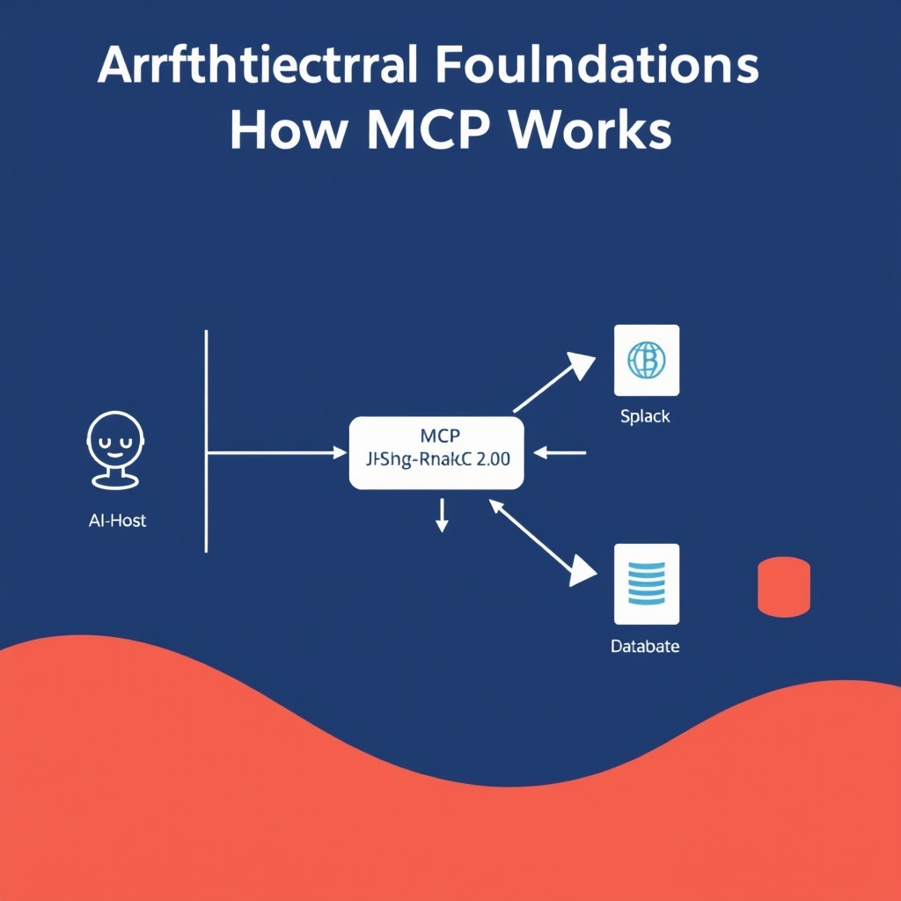
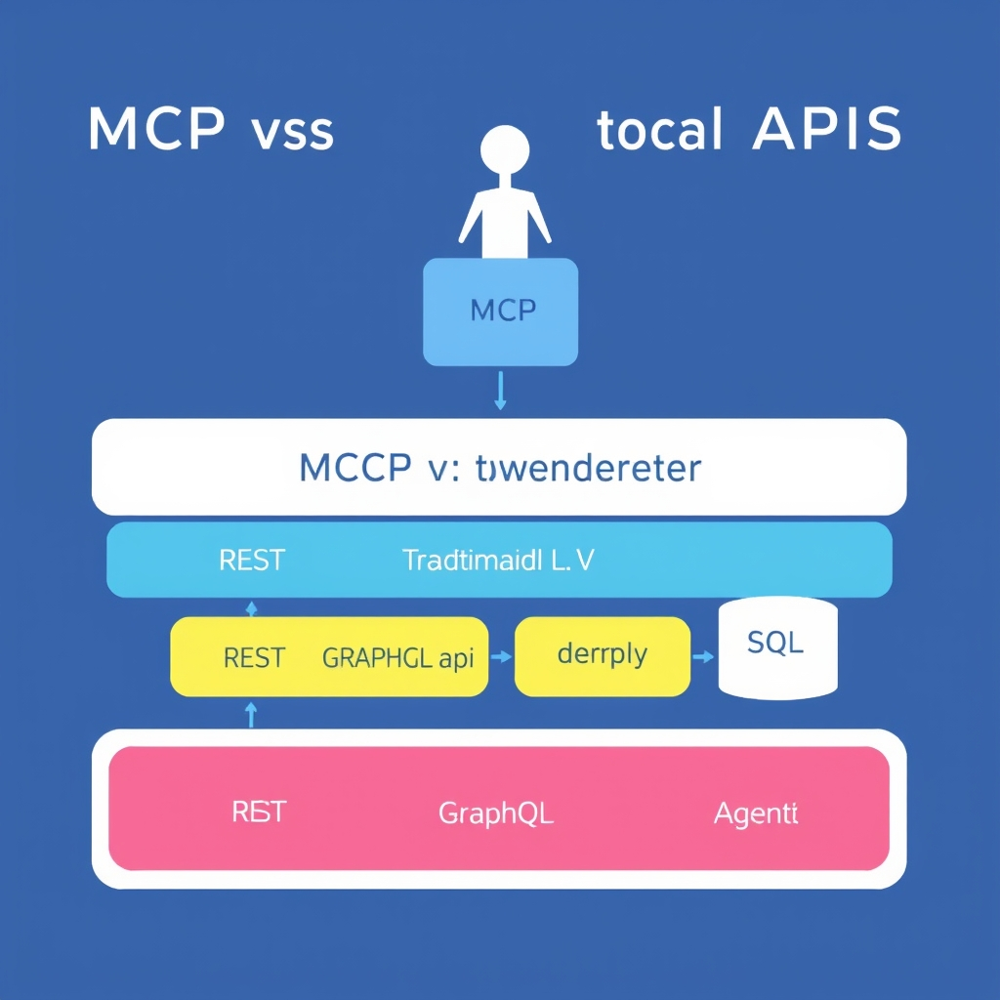

# Standardizing AI Connectivity: An Introduction to the Model Context Protocol (MCP)

## The Problem with AI Integration
The current state of AI agent development is plagued by 'glue code' - custom, brittle integrations that connect AI models to various data sources and tools. These integrations are not only hard to maintain but also hinder the scalability and flexibility of AI systems. The current state of 'glue code' in AI agent development involves manually writing code to connect AI models to each data source or tool, resulting in a complex web of integrations. Custom integrations are brittle and hard to maintain because they are often tailored to specific use cases and may break when either the AI model or the data source changes. Furthermore, the difference between static API calls and dynamic agentic tool use lies in the level of interaction - while APIs provide a fixed interface for data exchange, AI agents require more dynamic and interactive access to tools and data sources. Introducing MCP as the industry-standard solution, it aims to replace these fragmented integrations with a universal standard, allowing AI agents to discover and use tools without requiring custom code for every new connection.

## Architectural Foundations: How MCP Works

The Model Context Protocol (MCP) is built on a client-host-server architecture, utilizing JSON-RPC 2.0 to standardize interactions between AI models and external data or tools. The key components in the MCP ecosystem include:
* The **Host**: This is typically the AI system or model that needs to interact with various tools or data sources.
* The **Client**: This refers to the component that initiates requests to the server. In the context of MCP, the client is usually part of the AI system or an application that leverages the AI model.
* The **Server**: The server provides access to tools or data sources. It exposes its capabilities through the MCP interface, allowing clients to discover and utilize these resources dynamically.


*The MCP architecture: The AI host communicates with diverse servers through a standardized JSON-RPC 2.0 protocol, abstracting away the underlying data source complexity.*

JSON-RPC 2.0 is crucial for facilitating **stateful communication** between clients and servers. This means that the protocol maintains the context of the interaction, enabling more complex and meaningful exchanges than traditional stateless APIs.

The mechanism of **dynamic tool discovery** is another significant aspect of MCP. It allows AI agents to automatically detect and integrate with available tools and data sources without requiring manual configuration or custom coding for each new connection.

This architecture is more **scalable** than traditional point-to-point integrations because it eliminates the need for custom glue code for every possible connection between AI systems and data/tools. By standardizing the interface through which AI agents interact with their environment, MCP significantly reduces the complexity and maintenance costs associated with integrating diverse systems.
## MCP vs. Traditional APIs

The Model Context Protocol (MCP) is often misunderstood as a replacement for traditional APIs. However, it is essential to distinguish between the transport layer (REST/GraphQL) and the protocol layer (MCP). MCP acts as a wrapper, adding a semantic layer that enables AI agents to understand tool capabilities. Distinguishing between the transport layer and the protocol layer is crucial for understanding how MCP works with existing APIs. By adding a semantic layer, MCP makes it easier for AI agents to interact with various data sources and tools. The benefits of using MCP as a standardized wrapper for existing services include improved scalability, reduced maintenance costs, and increased flexibility. When deciding whether to use MCP or direct API calls, consider the complexity of the task, the need for standardized tool discovery, and the benefits of stateful communication.


*MCP acts as a semantic wrapper, providing a unified interface for AI agents while leveraging existing transport protocols like REST and GraphQL.*
## Implementing Your First MCP Server
To start building your first MCP-compliant server, it's essential to understand the available tools and resources. The official MCP SDKs are available in Python, JavaScript, and Go, making it easy to implement MCP servers in a variety of programming languages.
* Overview of available SDKs: The official MCP SDKs provide a simple and efficient way to define tools and resources within an MCP server. For example, in Python, you can use the `mcp` library to create an MCP server and define tools like file systems or databases.
* Defining tools and resources: Tools and resources are the core components of an MCP server. They can range from simple file systems to complex third-party services like GitHub or Slack. To define a tool, you need to create a JSON object that describes the tool's capabilities and interfaces.
* Example of a simple server setup: Here is an example of a simple MCP server setup in Python: ```python
from mcp.server import Server

tool = {
    'name': 'file_system',
    'description': 'A simple file system tool',
    'interfaces': [
        {'name': 'read_file', 'description': 'Read a file from the file system'}
    ]
}

server = Server()
server.add_tool(tool)
server.start()
```
* Connecting a local data source to an AI host: Once you have set up your MCP server, you can connect it to a local data source and an AI host. This allows AI agents to access and manipulate the data source using the standardized MCP interface. For example, you can use the `mcp` library to connect to a local database and define a tool that allows AI agents to query the database.

## The Future of Agentic Interoperability
The Model Context Protocol (MCP) is poised to revolutionize the AI ecosystem by providing a universal standard for AI agents to interact with diverse data sources and tools. Standardization through MCP accelerates the development of autonomous agents by enabling them to discover and use tools without requiring custom code for every new connection. This shift from 'building integrations' to 'building capabilities' is a significant paradigm change, allowing developers to focus on creating value-added services rather than spending time on custom integrations. MCP is a critical step for enterprise AI adoption as it provides a standardized layer that makes existing APIs more accessible to AI systems, thereby reducing the 'integration tax' and increasing the efficiency of AI development.