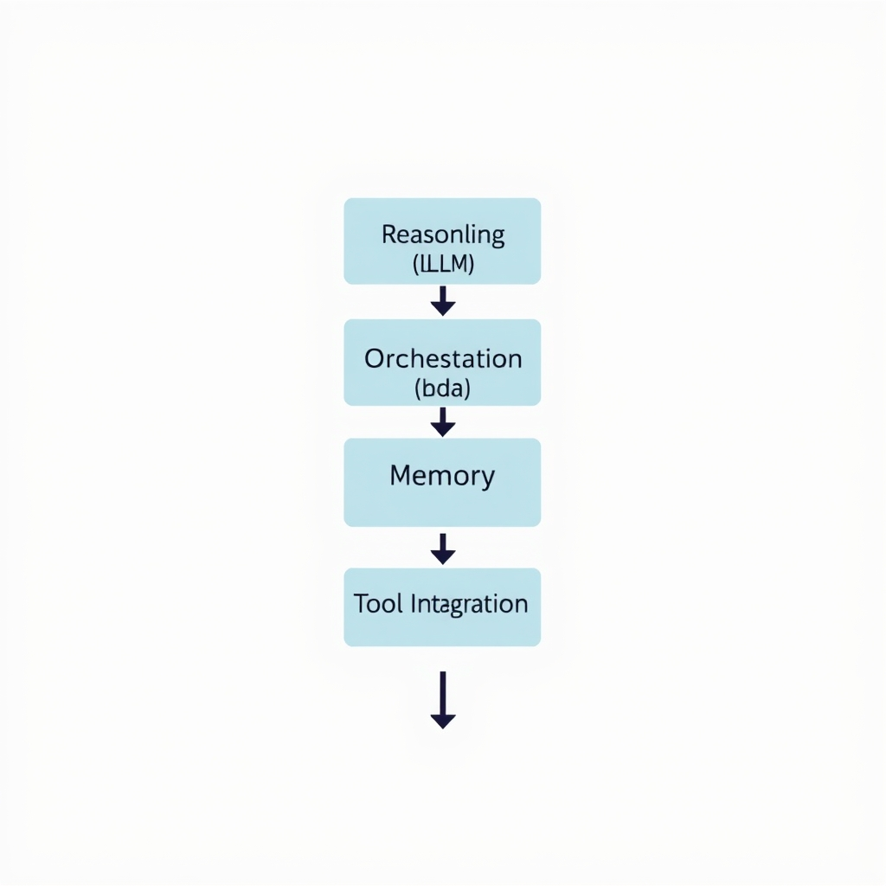
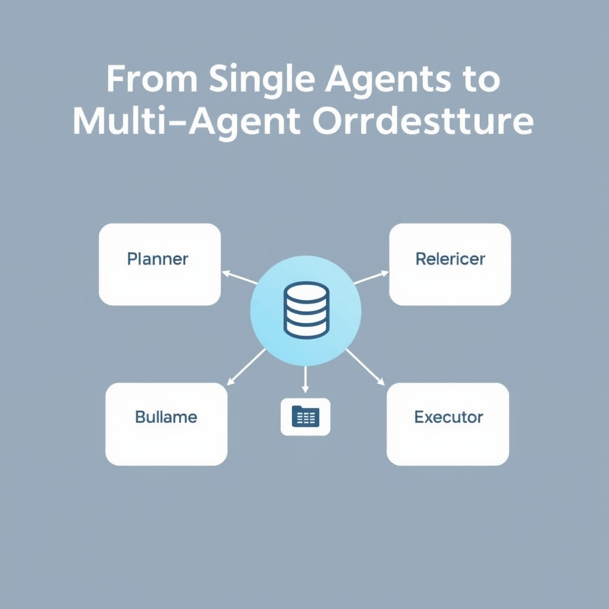
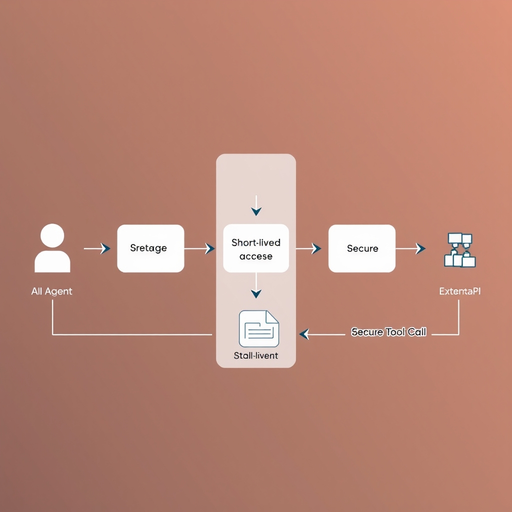

# The 2026 Blueprint: How Modern AI Agents Actually Work

## The Anatomy of a Modern AI Agent

The modern AI agent is no longer a single monolithic model that merely echoes a user’s input. In 2026 the industry has converged on a **four‑layer architecture** that separates concerns, improves reliability, and enables autonomous workflows. Each layer plays a distinct role while remaining tightly coupled through well‑defined interfaces.


*The 2026 industry-standard four-layer architecture for production-grade AI agents.*

### Reasoning Layer (LLM)

The topmost layer houses a large language model that acts as the agent’s cognitive engine. It interprets natural‑language prompts, generates plans, and performs inference. Because the LLM is stateless, it excels at *reasoning* but cannot retain context across calls. Its output is therefore handed off to lower layers for orchestration and persistence. This separation mirrors the design described by the EICTA Consortium, which identifies the reasoning layer as the core *LLM* component of production agents【https://www.eicta.iitk.ac.in/knowledge-hub/artificial-intelligence/ai-agent-architecture-explained】.

### Orchestration Layer

Below the LLM sits the orchestration layer, a deterministic engine that translates the model’s suggestions into concrete task flows. It decides **what** action to take next, **when** to invoke a tool, and **how** to handle branching logic or retries. By externalizing control flow, developers can inject policies (e.g., rate limits, fallback strategies) without retraining the LLM. The same source notes that orchestration governs *task flow and decision‑making* across the agent stack.

### Memory and Data Layer

Contextual continuity is provided by the memory and data layer. Rather than relying on a fleeting chat history, modern agents store structured, scoped, and temporal state that can be queried or edited by the orchestration engine. This enables long‑running tasks—such as multi‑step project planning—to resume after interruptions while preserving relevance. Graphlit’s survey highlights the shift from simple chat logs to *structured, scoped, temporal, self‑editable* context systems【https://www.graphlit.com/blog/survey-of-ai-agent-memory-frameworks】.

### Tool Integration Layer

The bottom layer exposes secure interfaces to external APIs—email, calendars, databases, or custom services. When the orchestration layer determines that a tool call is required, it invokes the integration layer, which handles authentication (typically OAuth or OpenID Connect) and payload formatting. Auth0’s guide confirms that *secure tool calling* now relies on these standards to avoid credential leakage【https://auth0.com/blog/genai-tool-calling-intro】.

### Layer Interaction: From Prompt to Autonomous Action

1. **User Prompt → Reasoning Layer** – The LLM parses the request and produces a high‑level plan (e.g., “draft a weekly report and email it”).
1. **Plan → Orchestration Layer** – The plan is broken into discrete steps, each mapped to a tool or internal function.
1. **State Check → Memory Layer** – Before executing, the orchestrator queries memory for relevant context (previous drafts, user preferences).
1. **Tool Call → Integration Layer** – The orchestrator triggers the appropriate API, authenticating via OAuth/OpenID Connect.
1. **Result → Memory Layer** – Outputs are stored back into memory, updating the agent’s state for future steps.
1. **Feedback Loop** – The LLM can be re‑invoked with the new state to refine the next action, completing a closed‑loop cycle.

Through this disciplined layering, a single user utterance can cascade into a fully autonomous workflow that reasons, plans, remembers, and interacts with the external world—all while remaining auditable and secure.

## From Single Agents to Multi-Agent Orchestration

In early generations, an AI agent was essentially a single LLM wrapped in a thin execution layer. The model received a user prompt, performed a chain‑of‑thought, and returned a response. This **monolithic** design works for straightforward Q&A or single‑step automation, but it quickly hits limits when tasks require:


*Multi-agent systems decompose complex tasks into specialized, collaborating agents connected via a shared state fabric.*

- **Parallel sub‑tasks** (e.g., data gathering, analysis, and reporting)
- **Domain‑specific expertise** (legal reasoning vs. financial forecasting)
- **Long‑running state management** across many interactions

### From One to Many: What a Multi‑Agent System (MAS) Looks Like

A MAS decomposes a complex objective into a **coordinated network of specialized agents**. Each agent owns a narrow competency and communicates through a shared orchestration fabric. The shift is captured by industry surveys that note “the center of gravity is shifting from single‑agent apps to multi‑agent systems…working together with explicit routing, shared state, and governance”【https://aiagentsdirectory.com/blog/2026-will-be-the-year-of-multi-agent-systems】.

| Aspect                | Monolithic Agent                     | Multi‑Agent System                            |
| --------------------- | ------------------------------------ | --------------------------------------------- |
| **Scope**             | One model handles everything         | Multiple models, each tuned for a sub‑task    |
| **Parallelism**       | Sequential execution                 | Concurrent execution of independent agents    |
| **Failure isolation** | Crash of the whole system            | Fault in one agent does not halt others       |
| **Extensibility**     | Requires retraining the single model | Add or replace agents without touching others |

### Specialized Roles in a MAS

1. **Planner** – receives the high‑level goal, decomposes it into a task graph, and assigns subtasks to downstream agents. Planners often embed prompt‑engineering patterns that translate abstract objectives into concrete action items.
1. **Researcher** – conducts information retrieval, literature review, or data mining. By focusing on search and synthesis, the researcher can be paired with a retrieval‑augmented generation (RAG) pipeline.
1. **Verifier** – validates outputs from other agents, checking for factual consistency, policy compliance, or security constraints. Verifiers act as a guardrail before results are exposed to users or external tools.
1. **Executor** – performs the final act, such as calling an API, updating a database, or sending a notification. Executors are tightly coupled with the Tool Integration Layer but remain independent of the reasoning logic.

These roles are not rigid; a single physical service may host multiple logical agents, and new roles (e.g., *Negotiator* or *Monitor*) emerge as use‑cases mature.

### Shared State and Governance

A MAS must maintain a **shared state** so that each agent can read and write context without stepping on each other’s toes. Common implementations include:

- **Distributed key‑value stores** (Redis, DynamoDB) that hold task identifiers, intermediate results, and timestamps.
- **Event streams** (Kafka, Pub/Sub) that broadcast state changes, enabling agents to react in near‑real time.
- **Governance policies** that define who can modify which parts of the state, often expressed as role‑based access controls (RBAC) or attribute‑based access controls (ABAC).

Governance is crucial for preventing race conditions, ensuring auditability, and enforcing compliance—especially when agents act on behalf of users in regulated domains.

### Industry Momentum Toward Collaboration

The 2026 landscape shows a clear trend: frameworks such as **LangGraph**, **Mastra**, and **CrewAI** are built around the notion of *orchestrated collaboration* rather than a single monolithic pipeline. Vendors are adding built‑in support for agent registries, state synchronization, and policy engines, reflecting the market’s demand for scalable, production‑grade agentic workflows.

In practice, a developer now starts by defining **what** needs to be done (the high‑level goal), then selects a suite of agents—planner, researcher, verifier, executor—each wired into a shared state store and governed by a central policy module. The result is a system that can tackle multi‑step, cross‑domain problems while remaining maintainable and auditable.

By embracing multi‑agent orchestration, organizations move from brittle, single‑point‑of‑failure bots to resilient, modular ecosystems capable of evolving alongside business needs.

## Memory and Tooling: The Engine of Autonomy

### Evolution of Agent Memory

Early chat‑based agents stored only the raw turn‑by‑turn transcript. By 2026 the **Memory and Data Layer** has matured into a **structured, scoped, temporal** system that can be edited by the agent itself. Graph‑based stores now hold entities (tasks, deadlines, user preferences) with timestamps, enabling the reasoning layer to query "what was the last approved budget for project X?" rather than scanning an unbounded chat log. This shift is documented in the 2026 memory survey, which notes that *"the state of the art in AI agent memory has moved toward structured, scoped, temporal, self‑editable context systems"*【https://www.graphlit.com/blog/survey-of-ai-agent-memory-frameworks】.


*Secure tool calling uses OAuth 2.0 to obtain short-lived tokens, ensuring agents never handle long-term credentials.*

#### Why Scoped Context Matters

For long‑running workflows—e.g., a recruitment assistant that coordinates interviews over weeks—the agent must isolate context per **task instance**. Scoped memory prevents leakage of unrelated data, reduces token consumption when the reasoning layer queries the LLM, and supports compliance checks (e.g., GDPR) by allowing selective deletion of a task’s state. In practice, developers define a **session ID** or **task ID** that namespaces all stored entries.

______________________________________________________________________

### Secure Tool Integration

The **Tool Integration Layer** bridges the agent’s internal reasoning with external services such as Slack, Gmail, or proprietary CRMs. Modern agents employ **tool calling**: the LLM emits a JSON‑encoded function call, which the orchestration layer validates and executes. However, naïve implementations expose API keys in the prompt or logs, a critical security flaw.

#### OAuth & OpenID Connect as the Guardrails

Secure patterns now rely on **OAuth 2.0** and **OpenID Connect (OIDC)** to obtain short‑lived access tokens on behalf of the end user. The agent never sees the user's password or long‑term refresh token. Instead, a delegated identity provider (e.g., Auth0) issues a token scoped to the exact API operation required—"send email" or "post message to channel"—and the token expires after a few minutes. This approach is recommended by Auth0’s guide on *"Secure Tool Calling for AI Agents"*【https://auth0.com/blog/genai-tool-calling-intro】.

______________________________________________________________________

### Code Example: Secure Slack Messaging

Below is a minimal Python snippet that demonstrates a safe tool‑calling loop using **LangChain**‑style tool definitions and **Auth0** for OAuth token acquisition. The pattern can be adapted to any API.

```python
import os
import httpx
from typing import Any, Dict

# 1️⃣ Define the tool signature the LLM will call
SLACK_POST_TOOL = {
    "name": "post_to_slack",
    "description": "Send a message to a Slack channel on behalf of the user.",
    "parameters": {
        "type": "object",
        "properties": {
            "channel": {"type": "string", "description": "Slack channel ID"},
            "text": {"type": "string", "description": "Message body"},
        },
        "required": ["channel", "text"],
    },
}

# 2️⃣ Helper to fetch an OAuth access token from Auth0
def get_slack_token(user_id: str) -> str:
    token_url = "https://YOUR_DOMAIN/oauth/token"
    payload = {
        "grant_type": "client_credentials",
        "client_id": os.getenv("AUTH0_CLIENT_ID"),
        "client_secret": os.getenv("AUTH0_CLIENT_SECRET"),
        "audience": "https://slack.com/api/",
        "scope": "chat:write",
    }
    resp = httpx.post(token_url, json=payload, timeout=5)
    resp.raise_for_status()
    return resp.json()["access_token"]

# 3️⃣ Execute the tool after the LLM suggests it
async def execute_tool(call: Dict[str, Any], user_id: str) -> Dict[str, Any]:
    if call["name"] != SLACK_POST_TOOL["name"]:
        raise ValueError("Unsupported tool call")

    args = call["arguments"]
    token = get_slack_token(user_id)
    headers = {"Authorization": f"Bearer {token}", "Content-Type": "application/json"}
    slack_endpoint = "https://slack.com/api/chat.postMessage"
    payload = {"channel": args["channel"], "text": args["text"]}
    async with httpx.AsyncClient() as client:
        resp = await client.post(slack_endpoint, json=payload, headers=headers)
    resp.raise_for_status()
    return {"status": "ok", "slack_response": resp.json()}
```

**Key security takeaways**

- **Never embed static API keys** in prompts or code that the LLM can see.
- **Scope tokens** to the minimal permission set (`chat:write` in the example).
- **Refresh tokens** are stored server‑side; the agent only receives the short‑lived access token.
- **Validate** the tool name and argument schema before making any external call.

______________________________________________________________________

### Putting Memory and Tools Together

When an agent receives a user request like *"Schedule a weekly sync with the product team and send the agenda via Slack*", the flow is:

1. **Orchestration Layer** parses intent and decides to use two tools: a calendar scheduler and the `post_to_slack` tool.
1. **Memory Layer** retrieves the user's preferred meeting time from a scoped context entry (`user:12345:preferences`).
1. The **Reasoning Layer** (LLM) generates the tool call payloads.
1. Each tool call is executed via the **secure pattern** above, storing the resulting event ID back into memory under the same task scope.
1. The agent updates the user with a confirmation, pulling the stored IDs to provide a concise summary.

By coupling **structured, temporal memory** with **OAuth‑protected tool calls**, agents achieve true autonomy: they can maintain continuity across days, respect privacy constraints, and interact with real‑world services without exposing credentials.

______________________________________________________________________

### References

- AI Agent Architecture Explained (2026) – four‑layer model【https://www.eicta.iitk.ac.in/knowledge-hub/artificial-intelligence/ai-agent-architecture-explained】
- AI Agent Memory Frameworks in 2026: Memory vs. Context – evolution of scoped memory【https://www.graphlit.com/blog/survey-of-ai-agent-memory-frameworks】
- Secure Tool Calling for AI Agents with Auth0 – OAuth/OIDC best practices【https://auth0.com/blog/genai-tool-calling-intro】

## Choosing Your Framework

### Framework Landscape in 2026

Modern AI agent development has coalesced around a handful of purpose‑built frameworks. While they share the four‑layer architecture (reasoning, orchestration, memory, tool integration) [AI Agent Architecture Explained](https://www.eicta.iitk.ac.in/knowledge-hub/artificial-intelligence/ai-agent-architecture-explained), each framework optimizes a different slice of the stack. Below is a high‑level comparison that helps you pick the right tool for your production needs.

| Framework             | Primary Language        | Core Strength                                                                          | Multi‑Agent Support                                                                    | State Management                                                                 | Ecosystem & Licensing                                                           |
| --------------------- | ----------------------- | -------------------------------------------------------------------------------------- | -------------------------------------------------------------------------------------- | -------------------------------------------------------------------------------- | ------------------------------------------------------------------------------- |
| **LangGraph**         | Python                  | Complex, stateful workflows with explicit graph‑based orchestration                    | Built‑in node routing; easy to compose specialized agents                              | Structured memory nodes; temporal context built into the graph                   | Open‑source (Apache 2.0); strong community plugins for LangChain, OpenAI, Azure |
| **Mastra**            | TypeScript / JavaScript | End‑to‑end full‑stack for TypeScript‑heavy teams; tight integration with Node runtimes | Native multi‑agent orchestration via *mastra‑orchestrator*                             | Declarative state stores (Redis, DynamoDB) with scoped context                   | MIT license; extensive SDKs for AWS, GCP, and Azure services                    |
| **CrewAI**            | Python                  | Rapid assembly of collaborative crews; focus on prompt‑driven role assignment          | Explicit crew definition (planner, researcher, executor) with shared state bus         | Uses LangChain memory adapters; supports long‑running sessions via vector stores | BSD‑3 Clause; integrates with LangChain, LlamaIndex, and OpenAI APIs            |
| **OpenAI Agents SDK** | Python & JavaScript     | Model‑native integration; minimal boilerplate for OpenAI‑centric stacks                | Limited out‑of‑the‑box multi‑agent patterns; relies on developer‑written orchestration | Leverages OpenAI's function calling + built‑in memory cache                      | Proprietary (free tier, paid usage); tight coupling to OpenAI models            |

#### Choosing the Right Fit

- **If your team lives in Python and needs fine‑grained control over graph execution**, LangGraph offers the most expressive orchestration primitives. Its node‑based design maps directly to the four‑layer model, letting you plug in custom memory or tool layers without boilerplate.
- **For TypeScript‑first organizations**, Mastra eliminates the language friction and provides a cohesive CLI for deploying multi‑agent services to serverless platforms. Its declarative state layer simplifies governance and audit trails.
- **When rapid prototyping of collaborative crews is the priority**, CrewAI shines. It abstracts the orchestration layer into a simple crew definition, allowing you to focus on prompt engineering and tool integration.
- **If you are committed to the OpenAI ecosystem and want the smallest surface area**, the OpenAI Agents SDK gives you model‑native tool calling and function definitions with minimal setup. However, you will need to build your own orchestration and memory layers for anything beyond single‑agent use cases.

#### Practical Considerations

- **Licensing & Vendor Lock‑in** – Open‑source options (LangGraph, Mastra, CrewAI) provide flexibility for on‑prem or hybrid deployments, whereas the OpenAI SDK ties you to OpenAI's pricing and rate limits.
- **Scalability** – Mastra’s native support for cloud‑native state stores and LangGraph’s graph partitioning make them better suited for high‑throughput production workloads.
- **Community & Support** – LangGraph and Mastra have active contributor bases and frequent releases, as highlighted in the 2026 framework survey [The 9 Best AI Agent Frameworks in 2026](https://www.agentmail.to/blog/best-ai-agent-frameworks-2026).

By aligning your language stack, orchestration complexity, and scalability requirements with the strengths above, you can select a framework that fits cleanly into the four‑layer architecture and accelerates the path to production‑grade autonomous agents.

## Building for the Future

### Scaling with the Four‑Layer Model

The four‑layer architecture—Reasoning, Orchestration, Memory & Data, and Tool Integration—acts as a scalability scaffold. Because each concern is isolated, teams can horizontally scale individual layers: the Reasoning Layer can be swapped for a larger model or distributed inference cluster, while the Memory Layer can be backed by a high‑throughput vector store for billions of context vectors. Orchestration logic, often expressed as stateless workflows, can be replicated across containers without risking state divergence, and the Tool Integration Layer can route calls through load‑balanced API gateways. This separation of duties lets production pipelines grow from prototype to enterprise scale with predictable performance characteristics.

### Security and Governance as Non‑Negotiable Foundations

Autonomous agents operate on privileged APIs, so robust security and governance are mandatory. OAuth and OpenID Connect remain the de‑facto standards for delegating tool access without exposing credentials. Coupled with fine‑grained policy engines that enforce who can invoke which tool, these mechanisms provide auditability and compliance—critical for regulated domains such as finance or healthcare. Governance also extends to shared state: a central governance service can mediate conflicts, enforce rate limits, and record immutable logs of inter‑agent interactions, ensuring that multi‑agent collaborations remain transparent and controllable.

### Embracing Modular, Multi‑Agent Designs

The industry’s shift toward modular, multi‑agent systems is driven by the need for specialization. By decomposing a complex task into focused agents—planners, researchers, verifiers—each component can be optimized, versioned, and replaced independently. Shared state managed through the Memory Layer and coordinated by the Orchestration Layer eliminates bottlenecks that monolithic agents face. Teams should therefore design their pipelines as composable services rather than monolithic scripts, leveraging the four‑layer model to plug new agents into existing workflows with minimal friction.

### Looking Ahead: A Mature 2026 Ecosystem

By 2026 the AI agent ecosystem has matured from experimental prototypes to production‑grade platforms. Standardized architectures, vetted frameworks, and proven security patterns now enable organizations to deploy autonomous agents at scale with confidence. The next frontier will be tighter integration with domain‑specific knowledge graphs and self‑healing orchestration loops, but the foundational four‑layer blueprint will remain the cornerstone for building resilient, secure, and scalable AI agents.