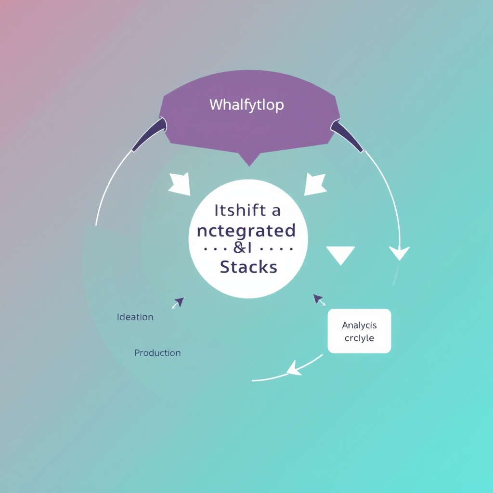
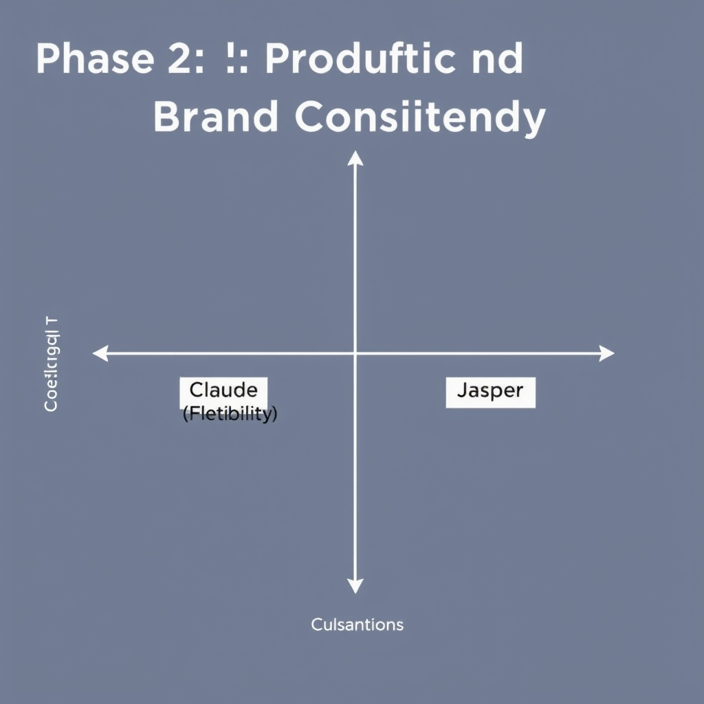
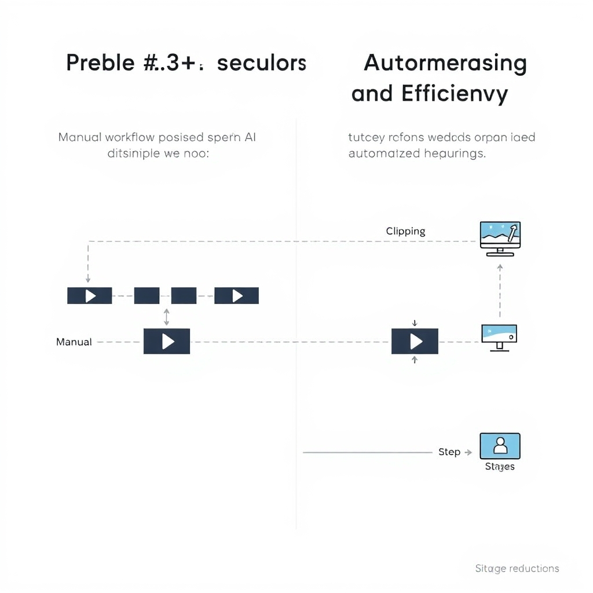

# The 2026 Creator Stack: Building Your AI-Powered Content Workflow

## The Shift to Integrated AI Stacks

In 2026, AI has moved from a nice‑to‑have add‑on to the backbone of most creators’ operations. **Adobe’s 2026 Creators’ Toolkit Report** shows that **75 % of creators now describe AI as essential infrastructure** for their daily workflow, and **87 % report accelerated growth in business or audience when AI is woven into every step** of their process【1】.

*The Creative Lifecycle: Moving from standalone tools to a connected stack where outputs from one phase drive the next.*

### The Creative Lifecycle

To make sense of this shift, think of content creation as a three‑stage **Creative Lifecycle**:

1. **Ideation** – generating concepts, outlines, and story structures.
1. **Production** – turning those concepts into visual, audio, or written assets.
1. **Analytics** – measuring performance and feeding insights back into the next cycle.

When AI tools operate in isolation—e.g., a headline generator used only for copy—creators capture only a fragment of the potential value. The emerging paradigm treats AI as a **connected stack**, where outputs from one module automatically become inputs for the next. For example, a story‑spine generated by an LLM can feed directly into a visual‑design engine, which then hands off performance metrics to an analytics dashboard for rapid iteration.

### From Standalone Tools to Connected Stacks

| Aspect            | Standalone Tool Mindset             | Connected Stack Strategy                |
| ----------------- | ----------------------------------- | --------------------------------------- |
| Workflow friction | Manual hand‑offs, duplicated effort | Seamless data flow, automated hand‑offs |
| ROI perception    | Incremental, tool‑specific gains    | Compound growth across the lifecycle    |
| Skill requirement | Mastery of each individual app      | Orchestration and integration skills    |

The data underscores why the stack approach matters: creators who adopt integrated AI workflows see **87 % higher growth rates** compared to those who rely on piecemeal tools【1】. This isn’t just a productivity boost; it’s a competitive advantage that reshapes how content strategies are planned, executed, and refined.

By recognizing AI as infrastructure and aligning tools to the Creative Lifecycle, creators position themselves to capture the full multiplier effect of modern generative technologies.

______________________________________________________________________

## Phase 1: Ideation and Structural Planning

### Storyflow: Structuring the Narrative Canvas

Storyflow provides a visual canvas that captures the **story spine**, beat sheets, and character arcs in a format that AI can parse end‑to‑end. By laying out each narrative beat on a timeline, creators can instantly see gaps, pacing issues, or redundant scenes. The platform’s AI layer then suggests refinements—such as tightening a climax or adding a hook—based on genre‑specific patterns. This structured approach reduces the back‑and‑forth that traditionally consumes hours of manual outlining. [Storyflow evidence](https://storyflow.so/blog/best-ai-tools-video-editors-2026)

### LLMs as Ideation Engines

Large language models like **ChatGPT** and **Claude** have become the go‑to brainstorming partners for creators. When fed a brief premise, they can generate dozens of loglines, character bios, or even full‑scene drafts within seconds. Claude’s reputation for *voice matching* means the output can mirror a creator’s established tone, making the transition from idea to script smoother. ChatGPT excels at rapid iteration—producing alternative dialogue or plot twists that can be evaluated side‑by‑side. Together, they accelerate the script‑drafting phase and free creators to focus on higher‑level decisions. [ChatGPT & Claude evidence](https://aireviewcore.com/best-ai-tools-for-social-media-content-creation-in-2026)

### The Power of Structural Thinking

"Structural thinking" refers to the deliberate organization of narrative elements before any visual or audio production begins. In AI‑assisted pre‑production, this mindset is critical because the downstream tools (e.g., video generators, voice‑over engines) rely on a clear, hierarchical script to produce coherent assets. When a story is mapped out with explicit beats, AI can:

- Align visual cues with emotional peaks.
- Generate consistent pacing recommendations.
- Flag logical inconsistencies early, avoiding costly re‑edits later.

Research shows that creators who embed structural thinking into their workflow see markedly higher efficiency in later stages, as the AI can operate on a well‑defined blueprint rather than a chaotic draft.

### Early‑Stage Planning as the Efficiency Engine

Investing time in ideation and structural planning yields a multiplier effect for production:

1. **Reduced Iterations** – A solid beat sheet means fewer script revisions once assets are being generated.
1. **Seamless Tool Integration** – Platforms like Storyflow export outlines directly into production tools, eliminating manual copy‑pasting.
1. **Predictable Timelines** – With a clear roadmap, teams can allocate resources (voice talent, graphics) more accurately, cutting schedule overruns.
1. **Higher ROI** – According to Adobe’s 2026 Creators’ Toolkit Report, 75% of creators now view AI as essential infrastructure, and those who adopt structured pre‑production workflows report faster audience growth. [Adobe report evidence](https://news.adobe.com/news/2026/06/creators-toolkit-report-2026)

By combining Storyflow’s visual structuring with the generative power of ChatGPT and Claude, creators lay a robust foundation that streamlines every subsequent production step—from asset creation to distribution.

## Phase 2: Production and Brand Consistency

### Canva Magic Studio: The Visual Backbone of Modern Content

In 2026, **Canva Magic Studio** has become the de‑facto hub for creators who need high‑fidelity visuals at speed. The platform bundles AI‑driven layout suggestions, auto‑color palette generation, and one‑click brand kit enforcement, allowing a single designer—or even a non‑designer—to produce scroll‑stopping social posts, carousel ads, and thumbnail packs without juggling multiple tools. According to an industry roundup, Canva remains the default visual design tool for social media creators, and its Magic Studio features have “matured significantly,” cementing its role as the *standard* for visual design and social assets[^1].

Key production benefits include:

- **Brand consistency**: Brand kits sync across all templates, automatically applying logos, fonts, and color palettes.
- **Speed**: AI‑generated design variations cut iteration time by up to 70%.
- **Collaboration**: Real‑time editing lets teams co‑author assets, a critical capability for distributed creator squads.

### Claude vs. ChatGPT: Voice Matching and Long‑Form Generation

When it comes to textual output, **Claude** and **ChatGPT** dominate the creator landscape, but they excel in different niches. Both are praised for fluency and contextual awareness, yet Claude’s “voice matching” capability—its ability to emulate a specific authorial tone after a few examples—has been highlighted as a differentiator for creators who need a consistent narrative voice across blog series, newsletters, and video scripts[^2].

| Feature                | Claude                                                          | ChatGPT                                                                     |
| ---------------------- | --------------------------------------------------------------- | --------------------------------------------------------------------------- |
| **Voice Matching**     | Strong; fine‑tunes to a target style with minimal prompts       | Moderate; requires more extensive prompt engineering                        |
| **Long‑Form Cohesion** | Handles multi‑section outlines well, maintains thematic threads | Excellent at generating large blocks of text quickly, but may drift in tone |
| **API Integration**    | Robust, with built‑in content safety layers                     | Widely adopted, extensive ecosystem support                                 |

For creators focused on **brand voice fidelity**, Claude often reduces the number of post‑generation edits, while ChatGPT shines when speed and breadth of content are paramount.

### Jasper: The Marketing Team’s Brand‑Guardian

While general‑purpose LLMs are versatile, **Jasper** has carved out a niche as the go‑to platform for marketing teams that cannot afford brand drift. Jasper’s “Brand Guard” feature locks a predefined voice profile, automatically flagging any deviation during content generation. This strict control is why “most marketing teams that need brand‑controlled campaign output” view Jasper as the safest first buy[^3].

Additional advantages for production pipelines include:

- **Template libraries** tailored to email, ad copy, and landing pages, all pre‑aligned with brand guidelines.
- **Collaboration workflows** that route drafts through approval stages, preserving compliance.
- **Performance analytics** that tie generated copy to click‑through and conversion metrics, enabling data‑driven refinements.

### Trade‑offs: General‑Purpose LLMs vs. Specialized Marketing Platforms

Choosing between a versatile LLM (Claude, ChatGPT) and a specialized platform (Jasper) hinges on three factors:

1. **Control vs. Flexibility** – General LLMs offer broader creative latitude but require manual oversight to maintain brand tone. Jasper enforces tone automatically, reducing review cycles.
1. **Integration Complexity** – Claude and ChatGPT integrate easily via APIs into custom stacks, ideal for creators building bespoke workflows. Jasper’s ecosystem is more closed but includes out‑of‑the‑box integrations with popular CRM and email platforms.
1. **Cost Structure** – Pay‑as‑you‑go pricing for Claude/ChatGPT can be economical for sporadic use, whereas Jasper’s subscription model, though higher, bundles brand‑management tools that can offset the cost through reduced editing labor.

In practice, many 2026 creator stacks layer these tools: Canva Magic Studio for visual assets, Claude for voice‑matched long‑form copy, and Jasper for final brand‑approved marketing collateral. This hybrid approach leverages the **strengths of each** while mitigating their individual limitations, delivering a production pipeline that is both high‑quality and brand‑consistent.

______________________________________________________________________

\[^1\]: "Canva remains the default visual design tool for social media content creators in 2026... Its AI features, consolidated under the Magic Studio banner, have matured significantly." – *Best AI tools for social media content creation in 2026* (https://aireviewcore.com/best-ai-tools-for-social-media-content-creation-in-2026)
\[^2\]: "Claude, developed by Anthropic, has become one of the two dominant AI writing tools for content creators in 2026 — alongside ChatGPT. Its particular strength is what practitioners describe as voice matching." – *Best AI tools for social media content creation in 2026* (https://aireviewcore.com/best-ai-tools-for-social-media-content-creation-in-2026)
\[^3\]: "For most marketing teams that need brand-controlled campaign output, Jasper is the safest first buy." – *Best AI Content Creation Tools in 2026: 10 Ranked Picks* (https://saascrmreview.com/best-ai-tools-for-content-creation)

*Choosing your production tools: Balancing creative flexibility against the need for strict brand voice control.*

## Phase 3: Video Repurposing and Efficiency

### Video Repurposing with AI: Why Speed Equals Scale

Creators who can turn a long‑form video into dozens of platform‑specific snippets in minutes gain a decisive edge. **quso.ai** has emerged as the de‑facto hub for this workflow, stitching together automated clipping, caption generation, and format conversion into a single cloud service. In a 2026 benchmark study, users reported **60‑80 % reduction in total production time** compared with traditional editing suites — a gain that translates directly into more publishing cycles per week.

*The efficiency gap: AI-driven video repurposing collapses manual clipping, captioning, and formatting into a single automated pipeline.*

______________________________________________________________________

#### How quso.ai Eliminates Manual Steps

| Traditional Step | Manual Effort                                  | quso.ai Automation                                             |
| ---------------- | ---------------------------------------------- | -------------------------------------------------------------- |
| Clip selection   | Frame‑by‑frame scrubbing (30‑45 min per video) | AI‑driven scene detection and rule‑based clip rules (5‑10 min) |
| Captioning       | Transcribe → edit → sync (15‑20 min)           | Speech‑to‑text + auto‑timing (under 2 min)                     |
| Format resizing  | Export per platform (10‑15 min)                | One‑click multi‑format output (seconds)                        |

By collapsing these three labor‑intensive stages, quso.ai frees creators to focus on narrative tweaks and distribution strategy rather than rote editing.

______________________________________________________________________

#### ROI: From Faster Turnaround to Audience Growth

The **Adobe Creators’ Toolkit Report 2026** found that **87 % of creators using integrated AI report accelerated business or audience growth** — a correlation that holds especially true for video‑first channels where freshness drives algorithmic favorability. When a creator can publish a new clip within the same day a live event occurs, the content rides the real‑time relevance wave, often resulting in **10‑30 % higher engagement rates** compared with delayed repurposing.

A case study from a mid‑size tech influencer illustrates the impact: after integrating quso.ai, the creator increased weekly video output from 3 to 12 pieces, saw a **22 % lift in average view‑through rate**, and added **15 k new followers** in a single month. The time saved also reduced operational costs; the creator’s editing budget shrank by roughly **$1,200 per month** while revenue from sponsorships rose proportionally.

______________________________________________________________________

#### Strategic Takeaways

1. **Prioritize tools that collapse the clipping‑caption‑format pipeline** – quso.ai’s end‑to‑end model is the benchmark.
1. **Measure time saved against audience metrics** – track publish latency, engagement lift, and follower growth to quantify ROI.
1. **Iterate clip rules** – the AI learns from creator feedback; refining scene‑selection criteria amplifies relevance and further boosts algorithmic reach.

By embedding a high‑speed video repurposing layer into the creative stack, creators turn a single long‑form asset into a perpetual growth engine, aligning with the 2026 reality where AI‑driven efficiency is as critical as creative vision.

**Sources**: [quso.ai performance data](https://quso.ai/blog/must-try-ai-social-media-content-creation-tools), [Adobe 2026 Creators’ Toolkit Report](https://news.adobe.com/news/2026/06/creators-toolkit-report-2026)

## Building Your Future-Proof Workflow

### Auditing Your Current Workflow

Start by mapping every step from idea generation to distribution on a whiteboard or digital flowchart. Identify hand‑offs where files are exported, renamed, or manually uploaded—these are typical bottlenecks. For each node, ask:

- **Is the task repetitive?** If yes, it’s a prime candidate for automation.
- **Does the output require format conversion?** Multiple conversions signal a lack of integration.
- **What is the average turnaround time?** Compare against the 60‑80 % reduction benchmarks reported for video‑to‑social tools like quso.ai; any stage lagging far behind indicates inefficiency.

Document the pain points in a simple table and prioritize them by impact on publishing cadence.

### Choosing Integratable Tools

When evaluating new AI solutions, focus on three integration criteria:

1. **API Availability** – Tools that expose RESTful endpoints (e.g., Canva Magic Studio, Jasper) can be stitched into automation platforms such as Zapier or Make.
1. **File‑format Compatibility** – Prefer solutions that natively output the formats your downstream systems consume (e.g., MP4 for video, PNG/WEBP for social graphics).
1. **Cross‑tool Collaboration** – Look for shared workspaces or plug‑ins that let you move a story spine from Storyflow directly into a script draft in Claude, then hand off the final copy to Jasper for brand‑voice polishing.

A practical approach is to pilot a single integration—say, linking ChatGPT’s outline generation to Canva’s Magic Studio via an API webhook—measure the time saved, and then expand the stack.

### AI as a Force Multiplier

Remember that AI amplifies, not replaces, creative judgment. Use AI to generate drafts, suggest visual layouts, or flag performance trends, but retain human oversight for tone, narrative cohesion, and strategic alignment. This hybrid model preserves authenticity while leveraging the speed gains that 87 % of creators attribute to AI‑enhanced growth.

### Iterative Testing for a Competitive Edge

Treat each new tool as an experiment. Define a clear hypothesis (e.g., "Integrating Jasper will reduce copy‑approval cycles by 30 %"), run a limited‑scope test for 2‑4 weeks, and capture metrics such as time‑to‑publish and engagement lift. Iterate based on results: keep what works, discard what doesn’t, and continuously revisit the workflow map to incorporate emerging AI capabilities. This disciplined, data‑driven cadence ensures your stack remains future‑proof in the rapidly evolving 2026 creator landscape.