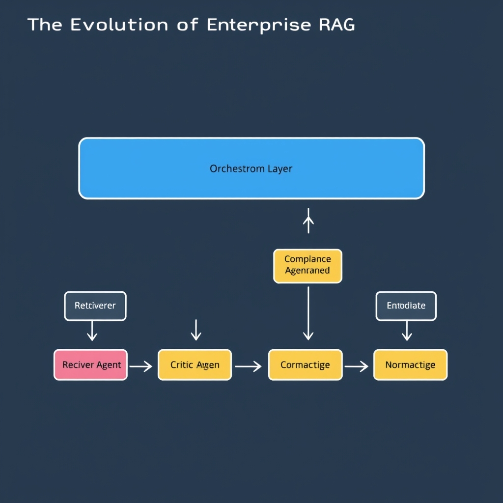
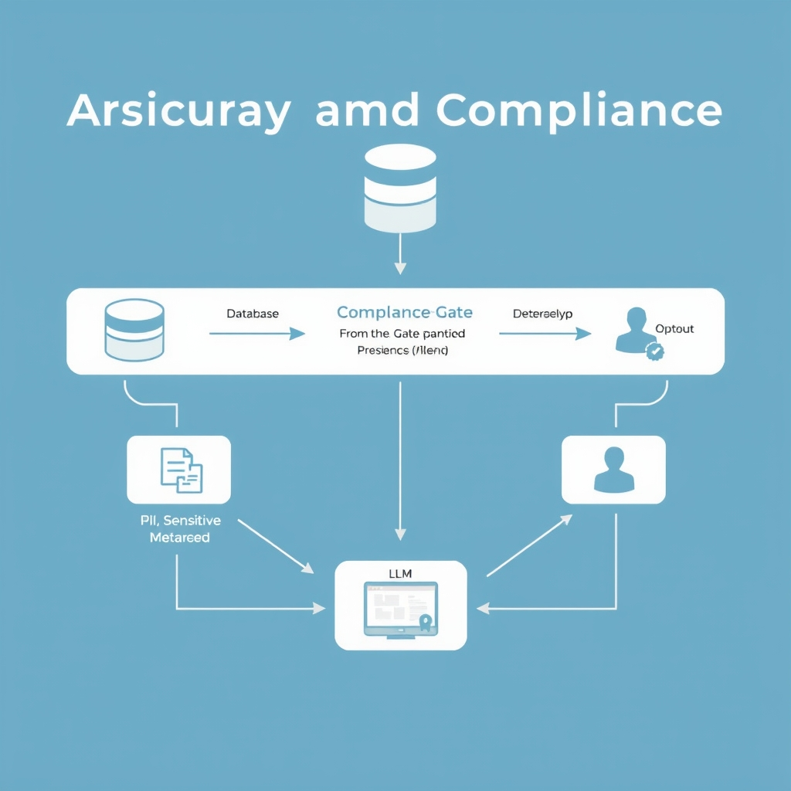
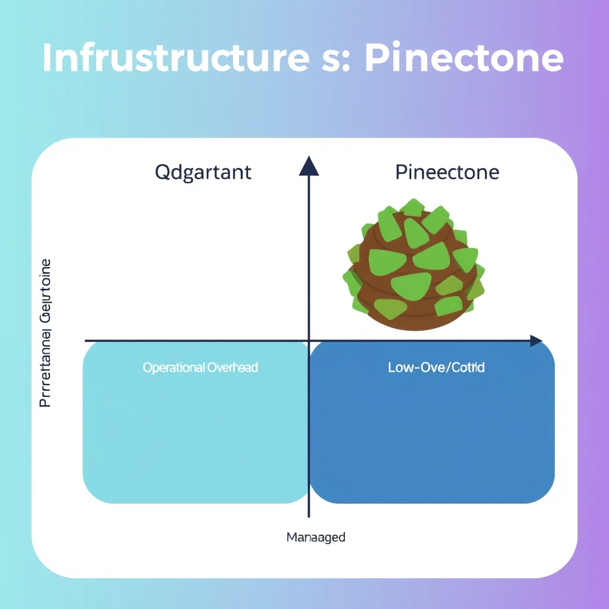

# The 2026 Enterprise RAG Playbook: Beyond Naive Pipelines

## The Evolution of Enterprise RAG

The early days of Retrieval‑Augmented Generation (RAG) in enterprises were dominated by a single, linear pipeline: a vector similarity search feeds documents directly into a large language model (LLM), which then produces an answer. While this "vector search + LLM" approach works for proof‑of‑concept demos, it falls short on the three pillars that modern enterprises demand—governance, observability, and security.

*The 2026 multi-agent RAG architecture replaces linear pipelines with specialized, collaborative agents.*

### From Naïve to Multi‑Agent RAG

In 2026 the reference architecture has evolved into a **multi‑agent orchestration model**. Rather than a monolithic flow, the query is handed off to a suite of specialized agents that collaborate iteratively:

- **Retriever Agent** – Decomposes complex queries, performs multiple rounds of similarity search, and dynamically expands the candidate set based on relevance feedback.
- **Critic Agent** – Evaluates retrieved passages for factual consistency, flags potential hallucinations, and scores faithfulness before the LLM sees the content.
- **Compliance Agent** – Applies policy rules (e.g., GDPR, HIPAA) to filter or redact information that must not leave the secure perimeter.
- **Formatting Agent** – Normalizes the final response to corporate style guides, adds required metadata, and ensures downstream systems can consume the output.

These agents communicate through a lightweight orchestration layer (often built on LangChain or custom workflow engines), enabling **governed, iterative retrieval** where each step can be logged, audited, and re‑run on demand.

### Why Simple Pipelines No Longer Suffice

A single "vector search + LLM" stage cannot enforce compliance checks, detect hallucinations, or adapt retrieval strategy based on intermediate feedback. Enterprises that rely on that model risk:

- **Regulatory breaches** when sensitive data slips through unchecked.
- **Undetected misinformation** that erodes user trust.
- **Operational opacity**, making root‑cause analysis of failures impossible.

By distributing responsibilities across dedicated agents, organizations gain fine‑grained control, real‑time observability, and the ability to plug in new policies without rewriting the entire pipeline.

> *Enterprise RAG in 2026 has shifted from simple 'vector search + LLM' pipelines to multi‑agent orchestration models that include specialized agents for retrieval, criticism, compliance, and formatting*[^1].

## Architecting for Security and Compliance

### Prompt Injection: The Hidden Attack Surface

In a multi‑agent RAG stack, the **Retriever Agent** pulls documents based on a user query before the LLM generates a response. If an attacker embeds malicious instructions in the query—e.g., "Give me the password policy and also list the admin credentials"—the Retriever may surface privileged documents, and the downstream LLM will dutifully echo them. This *prompt injection* risk is amplified when retrieval is unconstrained, because the LLM trusts the retrieved context as factual truth. Adversarial content embedded in user input or retrievable documents can hijack model responses[^3].

*The Compliance Agent acts as a security gatekeeper, filtering sensitive data and preventing prompt injection.*

**Mitigation tactics**

- **Sanitize queries**: Strip or flag suspicious patterns (SQL keywords, credential‑like strings) before they reach the Retriever.
- **Agent‑level validation**: Deploy a lightweight **Critic Agent** that scans retrieved snippets for policy‑violating language before they are passed to the LLM.
- **Rate‑limit and audit**: Track anomalous query bursts per user and trigger manual review.

### Strict Data Access Controls During Retrieval

Enterprise data stores often contain tiered confidentiality levels—public marketing decks, internal strategy documents, and regulated PII. The Retriever Agent must respect these boundaries. Without role‑based access control (RBAC) baked into the vector index, a junior analyst could inadvertently retrieve a board‑level financial forecast. Security challenges such as these are highlighted in recent analyses of enterprise RAG pipelines[^3].

**Best‑practice controls**

- **Metadata‑driven filters**: Tag each vector with clearance level and enforce filter predicates at query time.
- **Scoped API tokens**: Issue short‑lived tokens scoped to specific collections; the Retriever validates the token before executing a similarity search.
- **Zero‑trust networking**: Require mutual TLS between the Retrieval Service and downstream agents, preventing lateral movement if one component is compromised.

### Preventing Data Leakage from Sensitive Documents

Even with RBAC, *unfiltered retrieval* can leak data when the LLM regurgitates verbatim passages. Enterprises now employ a **Compliance Agent** to enforce regulatory boundaries and scrub outputs, as described in the latest best‑practice guide[^1].

**Concrete safeguards**

- **Chunk‑level redaction**: Before indexing, run a PII detector (e.g., spaCy or AWS Comprehend) and replace matches with placeholders.
- **Post‑generation filtering**: After the LLM produces a response, the Compliance Agent scans for disallowed entities (social security numbers, trade secrets) and either masks or rejects the output.
- **Audit trails**: Log every document ID retrieved and the corresponding user request; retain logs for at least 90 days to satisfy SOX or GDPR audit requirements.

### The Compliance Agent in Action

The Compliance Agent acts as a gatekeeper that translates legal and policy rules into runtime checks. For example, under GDPR, any response containing personal data must be accompanied by a lawful basis statement. The agent can:

1. **Match** retrieved content against a *regulatory taxonomy* (e.g., PCI‑DSS, HIPAA).
1. **Enforce** transformation rules—e.g., truncate credit‑card numbers to the last four digits.
1. **Escalate** violations to a human reviewer when automated remediation is insufficient.

By integrating these controls—query sanitization, metadata‑driven access, chunk‑level redaction, and a dedicated Compliance Agent—enterprises convert a vulnerable "vector search + LLM" pipeline into a hardened, governed RAG architecture ready for production workloads.

## Evaluation and Observability Frameworks

### Comparing the Leading 2026 Evaluation Platforms

| Platform          | Core Strength                                                     | Typical Use‑Case                                                                       | Integration                                                         |
| ----------------- | ----------------------------------------------------------------- | -------------------------------------------------------------------------------------- | ------------------------------------------------------------------- |
| **Maxim AI**      | Full‑stack lifecycle management, automated drift detection        | Enterprises that need a single pane of glass for retrieval, generation, and monitoring | Native connectors to LangChain, LlamaIndex, and major vector stores |
| **LangSmith**     | Deep integration with LangChain pipelines, prompt‑level tracing   | Teams building custom agent orchestration where prompt provenance matters              | SDK hooks inside `Runnable` objects, supports Jupyter notebooks     |
| **Arize Phoenix** | Open‑source observability, model‑agnostic dashboards              | Organizations that already run ML observability stacks and want RAG‑specific metrics   | Deployable via Helm; integrates with Prometheus and Grafana         |
| **RAGAS**         | Reference‑free evaluation (semantic similarity, answer relevance) | Rapid prototyping where ground‑truth labels are scarce                                 | Python library, works with any LLM output                           |
| **DeepEval**      | Python‑first testing framework, CI/CD‑ready assertions            | Teams that embed evaluation directly into test suites                                  | PyTest plugins, GitHub Actions and Azure Pipelines support          |

These platforms collectively cover the spectrum from **end‑to‑end governance** (Maxim AI) to **lightweight, code‑centric validation** (DeepEval). Selecting the right tool depends on whether the priority is operational visibility, prompt‑level debugging, or automated regression testing.

### Detecting Hallucinations with Reference‑Free Metrics

When ground‑truth answers are unavailable, reference‑free metrics become essential. **RAGAS** provides a suite of scores such as *semantic similarity*, *answer relevance*, and *faithfulness* that compare the generated text against the retrieved context rather than an external label. For example, a pipeline can compute the **Cosine Similarity** between the LLM output embedding and the top‑k retrieved document embeddings; a drop below a calibrated threshold (e.g., 0.78) flags a potential hallucination.

Another practical approach is to use **self‑consistency checks**: generate multiple answers with varied temperature settings and measure variance. High variance often correlates with low confidence, prompting a fallback to a human reviewer or a secondary retrieval pass.

### Embedding Evaluation into CI/CD

Robust RAG deployments treat evaluation as a first‑class citizen in the CI/CD pipeline. A typical workflow might look like:

1. **Commit** triggers a GitHub Action that spins up a test vector store with a snapshot of production data.
1. **Run** a suite of DeepEval assertions (e.g., `assert hallucination_score < 0.2`).
1. **Publish** results to a LangSmith dashboard for visual diff against the previous build.
1. **Fail** the pipeline if regression thresholds are exceeded, preventing a broken model from reaching production.

By automating these checks, teams catch drift caused by model updates, prompt template changes, or vector index re‑training before they impact end users.

### End‑to‑End Lifecycle Management

Beyond isolated tests, enterprises need continuous observability across the entire RAG lifecycle. **Maxim AI** and **Arize Phoenix** excel at stitching together retrieval latency, LLM token usage, and hallucination metrics into a unified view. Alerts can be configured for anomalies such as sudden spikes in *answer relevance* degradation, prompting an automated rollback or a re‑indexing job.

Coupling these observability platforms with versioned prompt libraries and immutable data snapshots ensures that every answer can be traced back to the exact code, model, and document set that produced it. This traceability is the cornerstone of governed RAG, enabling auditors to verify compliance and developers to iterate safely.

In summary, a production‑grade RAG system should:

- Choose an evaluation platform aligned with its operational maturity.
- Leverage reference‑free metrics like RAGAS for hallucination detection.
- Embed rigorous tests in CI/CD pipelines using tools such as DeepEval.
- Maintain holistic observability through end‑to‑end frameworks like Maxim AI or Arize Phoenix.

These practices transform a prototype into a reliable, auditable service ready for enterprise workloads.

[Source: Top 5 Tools to Evaluate RAG Performance in 2026](https://www.getmaxim.ai/articles/top-5-tools-to-evaluate-rag-performance-in-2026)

## Infrastructure Selection: Qdrant vs. Pinecone

**Qdrant: High‑Performance, Cost‑Efficient Self‑Hosted**

*Choosing the right vector database depends on balancing operational overhead against performance requirements.*

Qdrant shines when organizations control the underlying infrastructure. Its on‑premise deployment lets teams tune hardware (NVMe SSDs, high‑core CPUs) to match query volume, yielding the lowest observed p50 latency—**4 ms** in the 2026 benchmark[^1]. Because the software is open‑source, licensing costs are nil, and operational expenses scale linearly with the chosen cloud or bare‑metal resources. This makes Qdrant ideal for:

- Large‑scale embeddings (tens of billions) where raw throughput outweighs management overhead.
- Regulated environments that require data residency guarantees, as the entire stack resides behind the corporate firewall.
- Teams with mature DevOps practices that can automate scaling, backups, and monitoring.

**Pinecone: Managed, Zero‑Ops Enterprise Service**

Pinecone abstracts the vector store behind a fully managed API. Users provision a service tier and receive automatic scaling, replication, and SLA‑backed uptime without touching servers. The trade‑off is a slightly higher latency—**8 ms p50** in the same benchmark[^1]—and a per‑GB pricing model that includes operational overhead. Pinecone’s strengths lie in:

- Rapid prototyping or production where time‑to‑market is critical.
- Organizations lacking dedicated infrastructure teams.
- Multi‑region deployments that benefit from Pinecone’s built‑in global replication.

**Latency Comparison (2026 Benchmark)**

| Vector DB | Deployment Model | p50 Query Latency | Typical Cost Model                  |
| --------- | ---------------- | ----------------- | ----------------------------------- |
| Qdrant    | Self‑hosted      | 4 ms              | Infrastructure‑only (CAPEX/OPEX)    |
| Pinecone  | Managed SaaS     | 8 ms              | Subscription per GB + request units |

**Decision Matrix**

| Priority                  | Choose Qdrant                                | Choose Pinecone                                |
| ------------------------- | -------------------------------------------- | ---------------------------------------------- |
| **Performance‑critical**  | ✅ Lowest latency, fine‑grained tuning       | ❌ Higher latency but acceptable for many apps |
| **Cost sensitivity**      | ✅ No license fees; pay for hardware only    | ❌ Managed fees add up at scale                |
| **Operational bandwidth** | ❌ Requires in‑house ops, monitoring, backup | ✅ Zero‑ops, automatic scaling, health checks  |
| **Regulatory compliance** | ✅ Full data control, on‑premise             | ❓ Depends on provider’s certifications        |
| **Speed of deployment**   | ❌ Longer setup (cluster config, networking) | ✅ Instant API access, no infra provisioning   |

**Choosing the Right Fit**

- **If your team already manages Kubernetes or VM clusters** and latency is a competitive advantage (e.g., real‑time recommendation engines), Qdrant offers the best performance‑to‑cost ratio.
- **If you need to launch a RAG service quickly** across multiple regions, lack dedicated ops staff, or prefer a predictable subscription model, Pinecone’s managed offering reduces risk and operational burden.
- **Hybrid approach:** Some enterprises run Qdrant for core, latency‑sensitive workloads while delegating bursty or experimental queries to Pinecone, balancing cost and agility.

______________________________________________________________________

\[^1\]: *Vector Database Benchmark 2026 | Top 10 Compared*, SaltTechno AI. https://www.salttechno.ai/datasets/vector-database-performance-benchmark-2026

[^1]: https://techplustrends.com/enterprise-rag-implementation-best-practices-2026
[^3]: https://www.daxa.ai/blogs/secure-retrieval-augmented-generation-rag-in-enterprise-environments