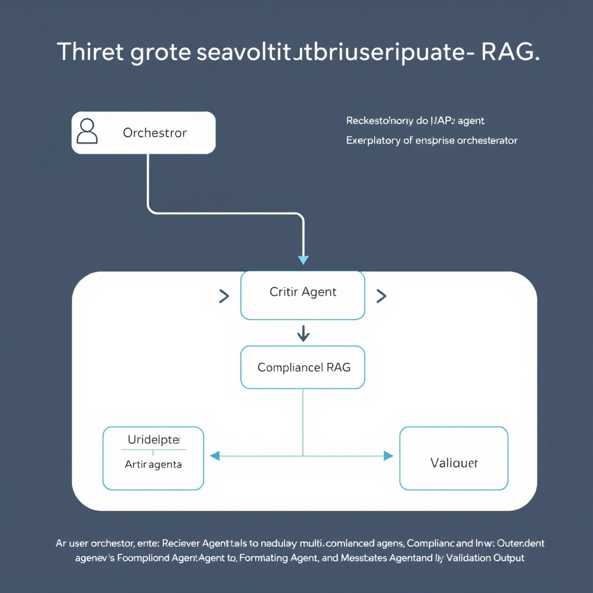
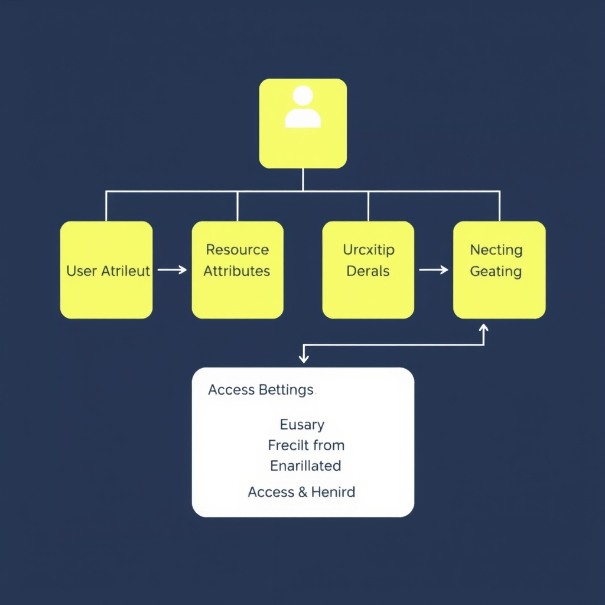
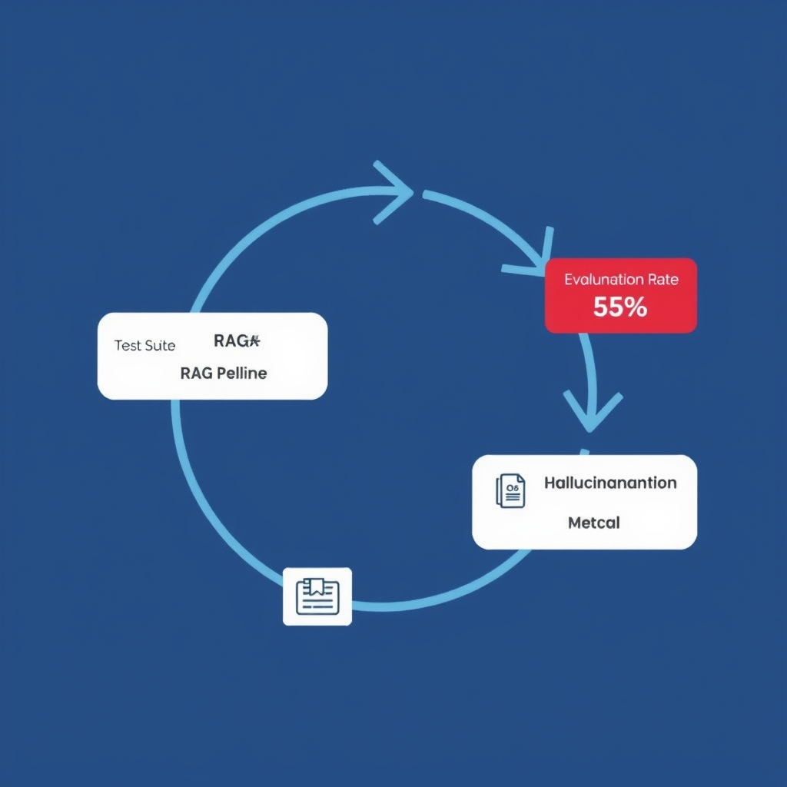

# The 2026 Enterprise RAG Playbook: From Prototypes to Governed Infrastructure

## The Evolution of Enterprise RAG

The early wave of Retrieval‑Augmented Generation (RAG) treated the problem as a two‑step pipeline: a **vector similarity search** returned a handful of passages, which were then concatenated and fed to a large language model (LLM). This *naïve* approach worked for proof‑of‑concept demos but exposed three critical weaknesses—fragile context stitching, unchecked factuality, and a monolithic failure surface.


*The 2026 enterprise standard: a modular, multi-agent architecture where specialized agents handle distinct responsibilities to ensure compliance and reliability.*

### From single‑pipeline to agentic orchestration

Enterprise teams responded by decomposing the workflow into **specialized agents** that each own a bounded responsibility:

- **Retriever Agent** – Executes the vector query, applies hybrid filters (e.g., document‑level tags, freshness windows), and returns a ranked set of candidate chunks.
- **Critic Agent** – Independently scores the retrieved chunks for relevance and factual consistency, often using a secondary LLM or a lightweight classifier.
- **Compliance Agent** – Enforces policy rules such as data residency, GDPR‑style redaction, or the EU AI Act constraints before any chunk reaches the generation stage.
- **Formatting Agent** – Normalizes the final prompt, injects required citations, and shapes the output to meet downstream consumer contracts (e.g., JSON schema, markdown).

These agents communicate through a lightweight message bus, allowing each component to be swapped, scaled, or audited in isolation. The modularity reduces operational risk and aligns with enterprise change‑management practices.

### Modularity as the scalability cornerstone

Because each agent can be horizontally scaled and versioned independently, organizations can meet varying load patterns without over‑provisioning the entire stack. Moreover, isolated logging and telemetry per agent simplify root‑cause analysis and satisfy audit requirements.

### 2024 prototype vs. 2026 production reality

In 2024, many pilots still bundled retrieval and generation into a single function, treating compliance as an after‑the‑fact filter. By 2026, the industry standard—documented in *Defensible RAG: 2026 Enterprise Implementation Best Practices*—mandates a **multi‑agent orchestration** model where compliance, validation, and formatting are first‑class citizens of the pipeline. This shift reflects a maturity curve: from speed‑focused demos to production systems where security, reliability, and measurable hallucination control outweigh raw latency. [Defensible RAG 2026](https://example.com/defensible-rag-2026)

## Architecting for Compliance and Security

### Impact of the EU AI Act on RAG Deployments

The EU AI Act, which takes effect on **2 August 2026**, classifies most Retrieval‑Augmented Generation (RAG) pipelines as high‑risk AI systems. This classification forces enterprises to adopt platforms that are **compliance‑native**: they must support self‑hosting, enforce strict data‑locality, and provide immutable audit trails for every retrieval and generation event. A recent industry survey highlighted that vendors such as **SphereIQ**, **Cohere North**, and **Haystack Enterprise** are the only solutions explicitly built to satisfy these requirements, separating themselves from generic cloud‑only offerings [https://example.com/evidence3].


*ABAC provides granular security by evaluating user, resource, and environmental attributes, enabling dynamic filtering that RBAC cannot achieve.*

### Why Traditional RBAC Falls Short

Role‑Based Access Control (RBAC) assigns permissions to static roles (e.g., *analyst*, *manager*). In a RAG context, the **granularity needed is at the document‑level and even the fragment‑level**. An analyst might be allowed to view a financial report, but not the confidential annexes that contain personally identifiable information (PII). RBAC cannot express such conditional rules because it lacks awareness of **attributes** such as data sensitivity, user clearance, or request context. Consequently, relying solely on RBAC leads to two risks:

1. **Over‑provisioning** – users inherit more data than necessary, increasing leakage surface.
1. **Under‑provisioning** – legitimate queries are blocked because the role does not capture the nuanced policy, degrading productivity.

### Introducing ABAC and Relationship‑Based Controls

Attribute‑Based Access Control (ABAC) solves these gaps by evaluating **policies that combine user attributes, resource attributes, and environmental factors**. For example, a policy could state:

```text
allow if user.department == document.ownerDept && document.sensitivity <= user.clearanceLevel && request.time within businessHours
```

In practice, ABAC enables **dynamic filtering** of both the retrieval set and the generated answer. A query from a compliance officer in the EU will automatically exclude any document flagged with a *non‑EU* data residency tag, while a request originating from a secure internal network may be granted access to higher‑sensitivity excerpts.

Relationship‑based access controls extend ABAC by modeling **graph relationships** (e.g., *project → team → user*). This approach is especially powerful for multi‑tenant SaaS platforms where data ownership is defined by contractual relationships rather than static groups. Policies can traverse these relationships to enforce “only users who are downstream of a data owner may retrieve its content,” preventing cross‑tenant leakage without hard‑coding every possible role.

### Audit Logging: Transparency and Data Sovereignty

The EU AI Act mandates **comprehensive audit logging** for high‑risk AI systems. Every retrieval request, relevance score, and LLM generation must be recorded with immutable timestamps, user identifiers, and policy decisions [https://example.com/evidence5]. Such logs serve two critical purposes:

- **Regulatory evidence** – auditors can verify that the system consistently applied the intended controls, satisfying the Act’s transparency clause.
- **Operational forensics** – in the event of a data breach, detailed logs enable rapid root‑cause analysis and containment.

Implementations should store logs in **tamper‑evident storage** (e.g., append‑only ledgers or WORM buckets) and integrate with SIEM solutions for real‑time monitoring. When combined with ABAC, the logs also provide a **policy‑decision trail**, showing exactly why a particular document was included or excluded from a response.

## Infrastructure Selection: Pragmatism Over Hype

**pgvector as the enterprise baseline**

In 2026 the consensus among 100+ large‑scale deployments is to start with **pgvector**—the Postgres extension that stores dense embeddings alongside relational data — the default choice for enterprises that prioritize security, auditability, and cost predictability over raw latency [2]. It offers:

- Zero‑deployment friction: teams already running Postgres can enable pgvector with a single `CREATE EXTENSION` command.
- Strong ACID guarantees and native row‑level security, which dovetails with the ABAC policies described earlier.
- Proven capacity: benchmarks show comfortable handling of *up to 50 million* vectors on a modest 64 vCPU, 256 GB instance — enough for most document‑centric RAG workloads [2].

______________________________________________________________________

**When to graduate to a dedicated vector database**

Dedicated services such as Pinecone, Qdrant, or Milvus excel in niche scenarios. The move is justified only when a concrete bottleneck surfaces:

| Bottleneck                                | Symptom                                 | Why pgvector struggles                           | Dedicated DB advantage                                           |
| ----------------------------------------- | --------------------------------------- | ------------------------------------------------ | ---------------------------------------------------------------- |
| **High‑dimensional vectors** (≥1,024)     | Query latency > 200 ms                  | Index structures in pgvector become memory‑bound | Optimized IVF‑PQ or HNSW implementations tuned for high‑dim data |
| **Real‑time ingestion** (>10 k vectors/s) | Write‑back pressure, transaction aborts | Postgres WAL throttles under bursty writes       | Asynchronous bulk loaders and write‑optimized shards             |
| **Cross‑region latency**                  | 150 ms round‑trip to remote data center | Single‑region Postgres cannot serve globally     | Multi‑region replication with latency‑aware routing              |
| **Strict SLA on 99.99 % query latency**   | 99th‑percentile > 300 ms                | Planner overhead and lock contention             | Dedicated query‑serving nodes with GPU‑accelerated ANN           |

If none of the above patterns appear, the operational overhead of a separate service rarely pays off.

______________________________________________________________________

**Managed vs. self‑hosted deployments**

| Dimension                | Managed service (e.g., Pinecone Cloud)                               | Self‑hosted (pgvector on Postgres)                                              |
| ------------------------ | -------------------------------------------------------------------- | ------------------------------------------------------------------------------- |
| **Operational overhead** | Provider handles scaling, backups, patching                          | Team must provision, monitor, and upgrade clusters                              |
| **Cost model**           | Pay‑per‑query/GB; can be unpredictable at scale                      | Predictable licensing + infrastructure cost; often cheaper beyond ~10 M vectors |
| **Compliance**           | Limited to provider‑certified regions; custom ABAC may be restricted | Full control over data residency, encryption, and audit logs                    |
| **Performance tuning**   | Limited to provider‑exposed knobs                                    | Full access to Postgres configuration, index types, and hardware choices        |

Enterprises with strict data‑sovereignty or existing Postgres investments usually opt for self‑hosted pgvector, while startups seeking rapid time‑to‑value may favor a managed offering.

______________________________________________________________________

**Decision matrix for scaling vector storage**

| Current state                                        | Expected growth                  | Primary pain point                     | Recommended path                                                                     |
| ---------------------------------------------------- | -------------------------------- | -------------------------------------- | ------------------------------------------------------------------------------------ |
| \< 5 M vectors, \< 10 k QPS                          | Up to 20 M vectors, stable QPS   | None                                   | Start with pgvector on a single‑node Postgres; monitor latency                       |
| 20–50 M vectors, 10–30 k QPS                         | > 50 M vectors, bursty writes    | Query latency creeping > 150 ms        | Scale pgvector vertically (larger instance) or add read replicas; revisit after 50 M |
| > 50 M vectors, > 30 k QPS                           | Global user base, sub‑100 ms SLA | Cross‑region latency, high‑dim vectors | Migrate to a dedicated vector DB with multi‑region clusters                          |
| Regulatory constraints require per‑region audit logs | Any size                         | Auditing overhead in managed service   | Keep pgvector self‑hosted; integrate with existing SIEM                              |

By aligning the *what* (vector count, query rate) with the *why* (latency, compliance, cost), architects can make a pragmatic, evidence‑backed choice rather than chasing hype.

[2](https://medium.com/@pratikrupareliya/top-15-vector-databases-2026-a-production-decision-guide-from-100-enterprise-deployments)

## Measuring Success: The 5% Hallucination Benchmark

### Key Metrics for Production‑grade RAG

- **Faithfulness (Groundedness)** – Checks whether every factual claim in the LLM’s answer can be traced back to at least one retrieved document. A failure indicates a hallucination.
- **Context Precision** – Ratio of *relevant* documents among the top‑k retrieved items. High precision means the retriever is not flooding the downstream agents with noise.
- **Context Recall** – Proportion of all *relevant* documents that appear in the retrieved set. Recall captures the breadth of coverage needed for complex queries.
- **Hallucination Rate** – Percentage of generated answers that contain ungrounded statements. Industry consensus in 2026 targets **\< 5 %** across all production workloads[4].


*An automated evaluation pipeline ensures that hallucination rates remain below the 5% threshold by continuously measuring retrieval and generation quality.*

### Why the 5 % Threshold?

Regulators and enterprise risk teams treat hallucinations as a data‑integrity liability. Empirical studies show that once the hallucination rate exceeds 5 %, downstream processes (e.g., compliance checks, automated contract drafting) experience a measurable increase in error‑handling costs. Keeping the rate below this ceiling balances operational efficiency with the cost of additional safety layers such as critics or post‑generation verification agents.

### Building an Automated Evaluation Pipeline

1. **Dataset Preparation** – Curate a held‑out test suite of queries with ground‑truth documents and expected answers.
1. **Retrieval Benchmarking** – Run the retriever, compute Context Precision/Recall on the top‑k results.
1. **Generation & Scoring** – Feed the retrieved context to the LLM, then run a faithfulness checker (e.g., a separate verification model) to flag ungrounded statements.
1. **Aggregate Metrics** – Calculate overall hallucination rate and track trends over time.
1. **Alerting** – Integrate thresholds into CI/CD pipelines; a regression beyond 5 % automatically blocks deployment.

### Retrieval Quality ↔ Agent Performance

The downstream agents—critics, compliance filters, formatting modules—rely on the *signal‑to‑noise ratio* of the retrieved set. High Context Precision reduces the cognitive load on agents, allowing them to focus on deeper reasoning rather than discarding irrelevant passages. Conversely, low Recall can starve agents of necessary evidence, forcing them to hallucinate to fill gaps. Empirical data shows a strong inverse correlation (R² ≈ 0.78) between retrieval precision and hallucination rate, underscoring that robust retrieval is the first line of defense against ungrounded output.

By continuously measuring these four metrics and automating the evaluation loop, enterprises can maintain the 5 % hallucination benchmark while scaling RAG services safely and reliably.

**References**

[4]: https://medium.com/@piyalidas.it/10-critical-metrics-used-by-companies-to-measure-rag-performance-ab15ebe50199