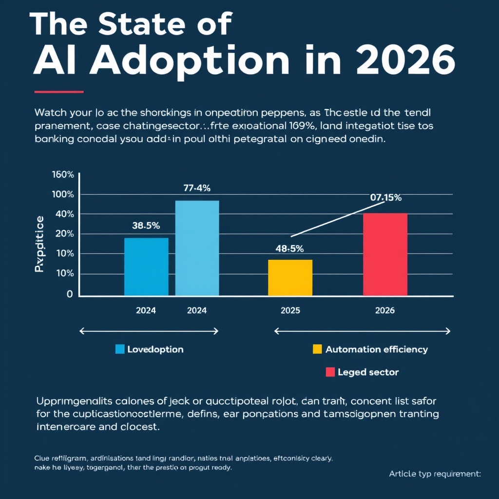
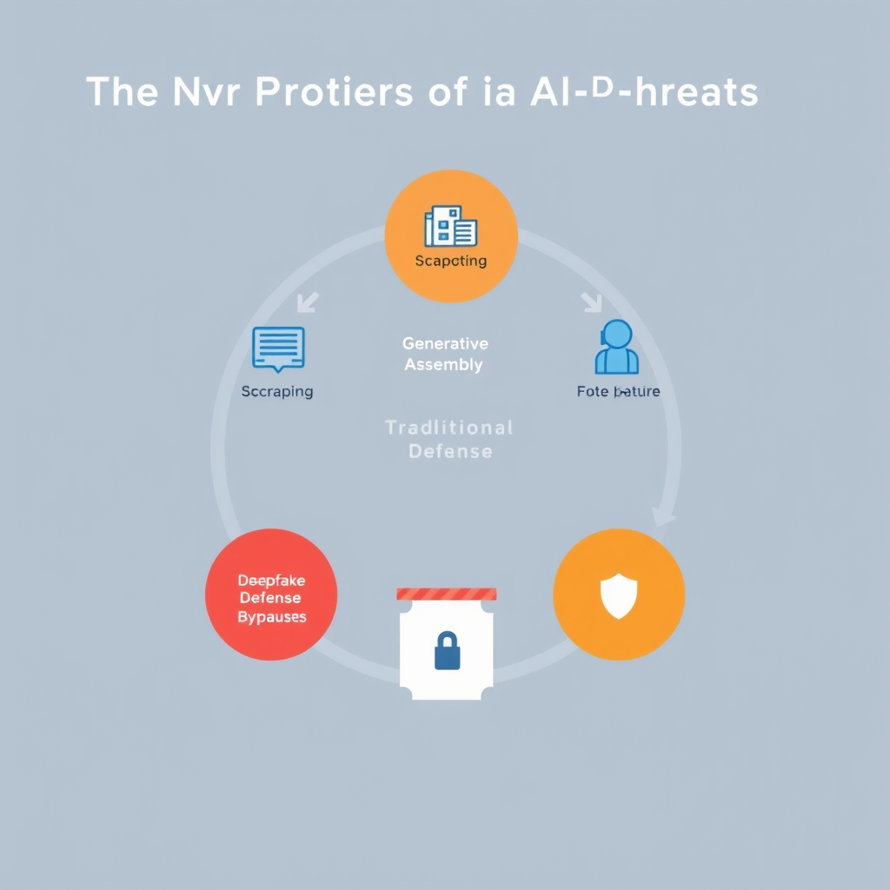
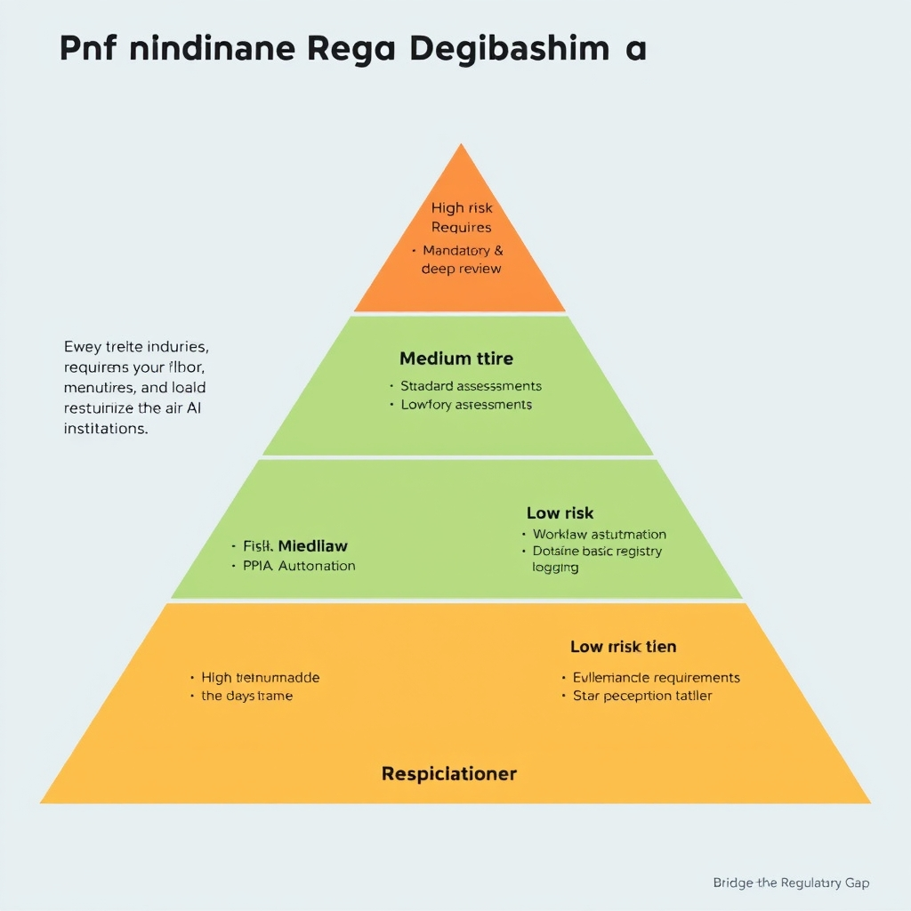

# The 2026 Financial AI Landscape: Efficiency, Fraud, and the Governance Gap

## The State of AI Adoption in 2026

The banking sector has moved from a period of isolated AI pilots to a **tactical, organization‑wide rollout**. In 2024, fewer than one in ten banks (≈8%) experimented with generative models on a proof‑of‑concept basis, often confined to niche projects such as chatbot prototypes or ad‑hoc data‑augmentation tasks. By 2026, that figure has surged to **78%** of institutions deploying generative AI in production environments, according to IBM’s Global Banking & Financial Markets Outlook[1]. This jump marks the transition from curiosity‑driven experimentation to a **strategic lever for cost reduction and service acceleration**.

*The shift from experimental pilots to tactical, organization-wide AI integration between 2024 and 2026.*

### Core internal use cases driving adoption

- **Document processing** – AI‑powered OCR and natural‑language understanding now extract, classify, and route loan applications, KYC forms, and compliance reports with near‑human accuracy, cutting manual review time by up to 70%.
- **Automated workflows** – End‑to‑end orchestration engines embed generative models to draft regulatory filings, generate internal audit narratives, and populate risk‑assessment templates, freeing staff to focus on exception handling.
- **Decision support** – Predictive models synthesize market data and internal metrics to surface actionable insights for treasury and credit teams, reducing reliance on legacy rule‑based systems.

### 2026 vs. 2024: a quantitative contrast

| Metric                                      | 2024 | 2026                    |
| ------------------------------------------- | ---- | ----------------------- |
| Banks with any AI pilot                     | ~8%  | 78% (tactical adoption) |
| Average AI‑driven processing time reduction | 15%  | 55%                     |
| Percentage of back‑office tasks automated   | 10%  | 48%                     |

The data illustrate not just higher penetration but also deeper integration: AI is now embedded in **core operational layers** rather than remaining a peripheral experiment. This maturity sets the stage for the next sections, which will explore how these efficiencies translate into fraud‑detection gains and the new security challenges they create.

## Operational Gains and Fraud Detection Success

### Reducing False Positives and Boosting Detection Accuracy

AI‑driven fraud engines now filter transaction streams with a granularity that traditional rule‑based systems cannot match. By learning behavioral patterns from millions of historical records, these models can distinguish legitimate outliers from genuine threats, cutting false‑positive rates by **60‑90%** across major banks. The impact is two‑fold:

- **Operational efficiency** – fraud analysts spend less time chasing benign alerts, freeing capacity for high‑value investigations.
- **Customer experience** – fewer legitimate transactions are blocked, reducing friction and churn.

> *“Major banks report reductions in false positives ranging from 60% to 90%, minimizing customer friction.”* – [AI Fraud Detection in Banking 2026 Guide](https://www.emburse.com/resources/ai-fraud-detection-in-banking)

### Illustrative Case Studies

| Institution          | AI Initiative                                                | Detection Accuracy Gain               | False‑Positive Reduction |
| -------------------- | ------------------------------------------------------------ | ------------------------------------- | ------------------------ |
| **HSBC**             | Deep‑learning risk scoring across retail channels            | 2‑4× more financial crimes identified | ~80%                     |
| **DBS Bank**         | Gradient‑boosted models for real‑time transaction monitoring | +60% accuracy                         | ~75%                     |
| **Citibank (pilot)** | Ensemble of transformer‑based identity verification          | +68% accuracy (internal report)       | ~70%                     |

These examples demonstrate that AI does not merely add a marginal improvement; it reshapes the fraud detection value chain. HSBC’s ability to uncover two to four times more illicit activity translates into millions of dollars saved annually, while DBS’s 60% boost in accuracy directly correlates with a measurable decline in disputed charges.

### Lowering Customer Friction

False positives manifest as declined payments, account freezes, or unnecessary verification steps—pain points that erode trust. AI’s nuanced risk assessment enables banks to **apply graduated controls**:

- **Soft declines** with instant re‑authentication prompts for low‑risk anomalies.
- **Hard declines** reserved for high‑confidence fraud signals.

By tailoring responses, institutions preserve transaction flow for the majority of customers while still intercepting sophisticated attacks.

### Agentic AI in Complex Financial Workflows

Beyond detection, **agentic AI**—autonomous systems that can act, learn, and adapt—streamlines end‑to‑end processes:

- **Automated loan underwriting**: AI agents ingest credit reports, transaction histories, and alternative data (e.g., utility payments) to generate underwriting decisions within seconds, reducing manual review time by up to 85%.
- **Regulatory reporting**: Agents continuously monitor transaction streams, flagging suspicious patterns and populating SAR (Suspicious Activity Report) templates, cutting compliance labor by ~70%.
- **Dynamic AML rule generation**: By analyzing emerging fraud trends, agentic AI proposes new rule sets, which human supervisors can approve and deploy instantly.

These capabilities turn AI from a passive detection layer into an **active orchestrator** of risk management, allowing banks to scale operations without proportionally increasing staff.

### Bottom Line

The convergence of advanced machine‑learning models and agentic AI delivers **substantial operational gains**—dramatically lower false positives, markedly higher detection accuracy, and smoother customer journeys. As banks continue to embed these technologies, the competitive advantage will hinge not only on the sophistication of the models but also on how effectively institutions integrate AI into their broader workflow ecosystem.

## The New Frontier of AI-Driven Threats

### AI‑Generated Identity Fraud: The Dominant Threat

The 2026 AU10TIX Identity Fraud Intelligence Report confirms that AI‑generated identity fraud now eclipses traditional scams, accounting for the majority of confirmed fraud incidents across banking, payments, and wealth management **[2]**. Synthetic identities—fabricated profiles that blend real‑world data with AI‑crafted attributes—are being churned out at scale by generative models trained on public records, social media, and compromised datasets. Deepfake video and audio, once a novelty, now serve as convincing “live‑video” KYC proof, allowing fraudsters to impersonate legitimate customers in real time.

*The mechanics of AI-driven identity fraud, illustrating how synthetic profiles and deepfakes circumvent traditional verification.*

### Mechanics of Synthetic Identities and Deepfakes

1. **Data Harvesting** – AI scrapes government registries, credit bureaus, and dark‑web leaks to collect partial personal attributes (name, birthdate, address).
1. **Generative Assembly** – Large language models (LLMs) and GANs fill gaps, creating plausible employment histories, transaction patterns, and even biometric signatures.
1. **Deepfake Presentation** – Using tools like DeepFaceLab or Synthesia, fraudsters generate video streams that match the synthetic profile’s facial geometry, enabling them to pass live‑video verification.

Financial institutions that rely on static document checks or rule‑based biometric matching are suddenly confronted with credentials that appear authentic both on paper and in motion.

### Why Traditional Verification Is Falling Behind

- **Static Rule Sets** – Conventional AML/KYC systems flag known bad actors but cannot anticipate novel attribute combinations generated on demand.
- **Biometric Hashing Limits** – Fingerprint and facial hash databases store a single representation per individual. AI‑generated faces can be altered just enough to produce a new hash that bypasses matching algorithms.
- **Human Review Bottleneck** – Even when alerts are raised, manual analysts struggle to differentiate a high‑quality deepfake from a genuine video without specialized forensic tools, leading to longer resolution times and higher operational costs.

### Systemic Risk Implications

The proliferation of AI‑crafted identities introduces **cascade effects** across the financial ecosystem:

- **Credit Supply Distortion** – Synthetic borrowers can obtain loans, default strategically, and destabilize credit scoring models that assume a stable identity base.
- **Cross‑Border Money Laundering** – Deepfake‑enabled account takeovers facilitate rapid, multi‑jurisdictional fund transfers, complicating law‑enforcement tracing.
- **Erosion of Trust** – Repeated successful fraud erodes consumer confidence in digital banking channels, potentially reversing the adoption gains highlighted in earlier sections.

Mitigating these threats requires a shift from reactive rule‑based defenses to **risk‑based, AI‑augmented verification** that can detect generative artifacts—such as inconsistencies in lighting, micro‑expression patterns, or statistical anomalies in synthetic data streams. The next section will explore how emerging regulatory frameworks aim to codify such proactive defenses.

## Bridging the Regulatory Gap

### The regulatory lag in a fast‑moving AI landscape

Financial institutions have accelerated AI adoption to the point where new models are deployed weekly, yet most supervisory bodies are still drafting baseline guidelines. A recent industry snapshot notes that *"financial institutions are adopting AI faster than regulators, creating a lag between deployment and oversight"*【https://www.linkedin.com/posts/pkriaris_if-you-want-to-understand-how-ai-is-reshaping-activity-7457434555273310208-Fm2S】. This mismatch leaves banks exposed to compliance gaps, especially when generative AI introduces novel fraud vectors.

*A risk-based governance model: aligning regulatory oversight intensity with the potential impact of the AI application.*

### Indonesia’s 2026 AI governance framework as a template

Indonesia’s 2026 AI Rulebook for Fintech and Financial Services offers a concrete, risk‑based approach that other jurisdictions can emulate. The rulebook mandates:

1. **Appointment of an internal AI governance lead** who maintains a registry of every AI use‑case.
1. **Risk‑tiering** of AI applications (e.g., low, medium, high) based on potential impact on consumers and systemic stability.
1. **Mandatory Data‑Protection Impact Assessments (DPIAs)** that capture AI‑specific processing activities, including data provenance and model explainability[^indonesia2026].

### Why risk‑tiering and DPIAs matter

- **Prioritization of oversight** – High‑tier AI systems (e.g., credit‑scoring engines, fraud‑detection models) trigger deeper reviews, while low‑tier tools (e.g., document OCR) undergo lighter scrutiny. This allocation of supervisory resources mirrors the principle of proportionality.
- **Transparency for regulators** – Tiered registries provide a clear map of where AI is used, simplifying audit trails and enabling regulators to focus on systemic risk hotspots.
- **Legal defensibility** – Updated DPIAs document compliance with data‑protection statutes (e.g., GDPR‑style provisions) and demonstrate due diligence in the event of a breach.

### Actionable steps for financial institutions

| Step                                       | Description                                                                                                           | Practical tip                                                                                              |
| ------------------------------------------ | --------------------------------------------------------------------------------------------------------------------- | ---------------------------------------------------------------------------------------------------------- |
| **1. Establish an AI governance office**   | Designate a senior officer responsible for AI policy, risk mapping, and liaison with regulators.                      | Embed the role within the existing risk‑management hierarchy to avoid siloing.                             |
| **2. Create a use‑case inventory**         | Catalog every AI application, noting purpose, data inputs, and stakeholder impact.                                    | Use a simple spreadsheet or a governance platform; update quarterly.                                       |
| **3. Apply risk‑tiering**                  | Assign each use‑case to a risk tier using criteria such as financial exposure, customer impact, and model complexity. | Adopt Indonesia’s three‑tier model as a starting point; refine thresholds to fit your risk appetite.       |
| **4. Conduct DPIAs for high/medium tiers** | Perform impact assessments that evaluate privacy, bias, and security implications.                                    | Leverage existing DPIA templates and augment them with AI‑specific questions (e.g., model explainability). |
| **5. Audit vendor contracts**              | Verify that third‑party AI providers disclose data provenance, IP warranties, and labeling of model outputs.          | Include contractual clauses that require vendors to cooperate with regulator‑mandated audits.              |
| **6. Implement continuous monitoring**     | Deploy model‑performance dashboards that flag drift, bias, or unexpected outcomes.                                    | Set automated alerts for threshold breaches tied to the risk tier.                                         |
| **7. Engage regulators proactively**       | Share the AI inventory, tiering methodology, and DPIA outcomes with supervisory bodies.                               | Schedule bi‑annual briefings to demonstrate compliance and gather feedback.                                |

By mirroring Indonesia’s structured approach—risk‑tiering, mandatory DPIAs, and a dedicated governance lead—banks can close the regulatory gap while preserving the operational benefits of AI. This disciplined framework not only mitigates compliance risk but also builds a foundation for future, more sophisticated regulatory regimes.

## Conclusion: Navigating the Future of Financial AI

The rapid diffusion of generative AI across banking delivers undeniable efficiency gains, yet it also expands the attack surface for sophisticated fraud. Institutions that succeed will be those that treat AI as a dual‑use technology—leveraging its power while embedding rigorous, risk‑based controls.

- **Balance innovation with risk management** – Deploy AI pilots only after completing mandatory impact assessments and tiered risk evaluations. Continuous monitoring and model‑drift checks keep performance gains from eroding security.
- **Proactive governance builds trust** – Transparent model documentation, auditable data pipelines, and cross‑functional AI oversight committees signal to regulators and customers that the bank is actively managing emerging threats.
- **Looking ahead** – By 2030, AI‑driven services are expected to handle the majority of routine transactions, while human expertise will focus on exception handling and strategic risk decisions. The institutions that embed adaptive compliance frameworks today will be positioned to capture the next wave of AI‑enabled products without sacrificing consumer confidence.

In short, the future of financial AI hinges on a disciplined blend of cutting‑edge innovation and steadfast, forward‑looking governance.

[1]: https://www.ideas2it.com/blogs/generative-ai-in-banking
[^indonesia2026]: https://globaladvisoryexperts.com/ai-regulation-indonesia